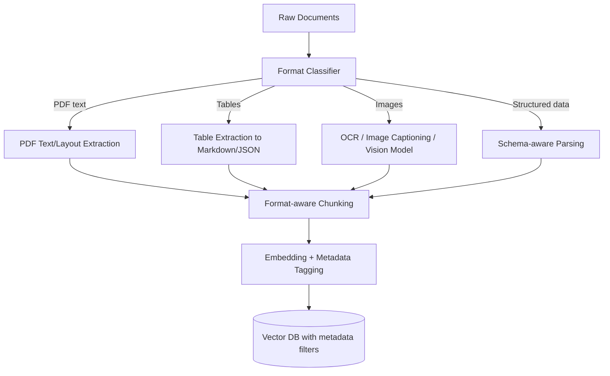

# RAG Interview — Scenario-Based Questions (Deep Dive)

These are the "your system is broken, now what?" questions that separate candidates who memorized the RAG architecture diagram from candidates who've actually debugged one in production. Each answer follows: **Why it happens → How to diagnose → How to fix → How to prevent it recurring**.

---

## Q1. Retriever returns the right documents, but the LLM still gives the wrong answer. How do you find the actual problem?

This is a **generation-stage** problem, not a retrieval-stage problem — but you have to *prove* that before you can fix it.

### Diagnose (isolate retrieval from generation)
1. **Manually inspect the exact chunks passed to the LLM** — not just "the right document," but the *specific chunk boundaries*. The right document with the wrong chunk (answer split across a chunk boundary, or buried at position 8 of 10 retrieved chunks) is a retrieval-adjacent problem, not a pure generation problem.
2. **Check chunk ordering** — LLMs exhibit a well-documented **"lost in the middle"** effect: information at the start or end of the context window is used more reliably than information in the middle. If your correct chunk is buried in the middle of a long context, reorder it (e.g., most-relevant-first or most-relevant-last).
3. **Check for contradicting chunks** — if multiple retrieved chunks contain conflicting or outdated information alongside the correct one, the LLM may average/hedge or pick the wrong one.
4. **Test the prompt in isolation** — take the exact retrieved chunks + question, paste directly into the LLM (bypassing the full pipeline) and see if it answers correctly with a minimal, clean prompt. If it now works, the bug is in your prompt template (too much boilerplate, unclear instructions, competing system-prompt directives).
5. **Check for instruction-following failures** — is your system prompt ambiguous about how to use context (e.g., "use the following information" vs. an explicit "answer ONLY using the provided context, and if the answer isn't present, say so")?

### Fix
- Rewrite the prompt template with explicit instructions: cite which chunk supports the answer, refuse to answer if unsupported, prioritize the most relevant chunk.
- Reorder/re-rank chunks so the highest-relevance chunk sits at the start or end of context (mitigate lost-in-the-middle).
- Reduce the number of chunks passed (top-3 well-ranked instead of top-10 noisy) — more context isn't always better; it dilutes attention.
- Consider a stronger/more instruction-tuned model if the base model has poor context-grounding behavior.

### Prevent recurrence
- Build a **generation-only eval set**: fixed (question, correct-chunks) pairs where retrieval is not in question — track "faithfulness" (does the answer strictly follow from the given context) as its own metric, separate from end-to-end accuracy.

---

## Q2. Works fine with 10K documents, but after scaling to 1M+ documents, retrieval quality drops. What would you check?

### Diagnose
1. **Embedding space crowding**: at 1M+ documents, semantically similar-but-irrelevant chunks are far more likely to score close to the true match — the "signal to noise ratio" in nearest-neighbor space drops as density increases. Check whether your top-K results include a lot more *near-miss* content than before.
2. **ANN index approximation error**: most vector DBs use Approximate Nearest Neighbor (HNSW, IVF) for speed at scale — recall of true nearest neighbors is not 100% by design. Check the index's recall/accuracy setting (e.g., HNSW's `ef_search`, IVF's `nprobe`) — these are often left at default, which trades accuracy for speed and gets worse as the dataset grows.
3. **Chunking strategy no longer fits the corpus diversity**: a chunking strategy tuned for one document type (e.g., FAQ pages) may perform poorly once the corpus includes a much wider variety of document structures added at scale.
4. **Metadata filtering not applied**: at 10K docs, brute-force semantic search alone was "good enough." At 1M+, you likely need **metadata pre-filtering** (date, category, source, department) to narrow the candidate pool before/during vector search — otherwise you're searching a much noisier haystack.
5. **Duplicate/near-duplicate content**: larger corpora accumulate more duplicate or near-duplicate chunks (multiple versions of the same doc, boilerplate across many pages) which crowd out diverse, relevant results in top-K.

### Fix
- Tune ANN index parameters for higher recall (`ef_search`/`nprobe` up), accepting some latency cost.
- Add a **re-ranking stage** (cross-encoder re-ranker on top-50 candidates → final top-5) — this recovers precision lost to ANN approximation and embedding crowding, since cross-encoders score query-document pairs jointly rather than via a static embedding distance.
- Introduce **hybrid search** (dense + BM25/sparse keyword search) — sparse retrieval is often more robust at scale for exact terms (IDs, names, jargon) that dense embeddings blur together.
- Add metadata filters and encourage/require query-time filters where possible (e.g., date range, document type).
- Deduplicate the corpus at ingestion time (near-duplicate detection via SimHash/MinHash).

### Prevent recurrence
- Load-test retrieval quality (not just latency) at target scale *before* full rollout, using a representative eval set sampled across the full planned corpus diversity — not just the original 10K set.

---

## Q3. User asks something not in the knowledge base, but the LLM confidently hallucinates an answer. How do you handle this?

### Why it happens
The LLM's parametric (pretrained) knowledge fills the gap when retrieval returns nothing relevant or low-confidence — and nothing in the prompt explicitly tells it *not* to do this. This is the single most common RAG failure mode reported by users.

### Fix — layered defense
1. **Retrieval confidence thresholding**: if the top retrieved chunk's similarity score is below a calibrated threshold, treat this as "no relevant context found" and short-circuit — either respond with an explicit "I don't have information on this" or route to a fallback (human handoff, web search, "did you mean...").
2. **Explicit prompt instruction**: "Answer ONLY using the provided context. If the answer is not present in the context, say 'I don't have enough information to answer this' — do not use outside knowledge." This alone significantly reduces (not eliminates) hallucination.
3. **Groundedness/faithfulness check as a post-generation step**: run a lightweight verifier (a smaller LLM call, or an NLI/entailment model) that checks whether the generated answer is actually entailed by the retrieved context; reject/regenerate if not.
4. **Query classification / out-of-domain detection**: classify incoming queries as "in-domain" vs "out-of-domain" before even attempting retrieval (a lightweight classifier or the retrieval score itself), and respond with a graceful decline for out-of-domain queries.
5. **Show sources / citations**: forcing the model to cite the specific chunk(s) it used tends to reduce ungrounded generation (it's harder to hallucinate *and* cite plausibly), and lets users verify the answer themselves.

### Trade-off to mention
Being too aggressive with "I don't know" thresholds increases **false refusals** (system says "I don't know" even when it actually could answer) — this is a precision/recall trade-off on the refusal decision itself, and should be tuned against real user query logs, not guessed.

---

## Q4. The correct answer is present in the retrieved chunks, but the model completely ignores it. What could be going wrong?

### Likely causes (ranked by frequency in practice)
1. **Lost-in-the-middle**: the correct chunk is retrieved but placed in the middle of a long context window among many other chunks — models attend much more reliably to the beginning and end of context.
2. **Prompt template burying the context**: excessive system-prompt boilerplate, formatting instructions, or few-shot examples placed *between* the context and the question can distract the model from the relevant chunk.
3. **Context window overflow / truncation**: if the combined context + question + system prompt exceeds the model's effective context window (or a hard truncation limit set by your pipeline), the correct chunk might be silently cut off — check actual token counts, not assumed ones.
4. **Chunk lacks sufficient surrounding context to be interpretable**: a chunk can contain the *literal* answer text but be too fragmented (missing a preceding sentence that establishes what "it" or "this" refers to) for the model to recognize it as relevant/usable.
5. **Formatting mismatch**: the answer might be in a table, and your chunking/extraction flattened the table into unreadable text, so the "answer" is technically present as raw text but not comprehensible in context.
6. **Model's own conflicting prior knowledge**: for well-known topics, a model's strong pretrained belief can override a context that contradicts it — this is a known LLM behavior (over-reliance on parametric memory even when instructed to prioritize context).

### Diagnose
- Do a **minimal repro**: strip the prompt to just the correct chunk + question, no other chunks, no boilerplate. If it now answers correctly, the noise/dilution/lost-in-the-middle theory is confirmed.
- Count tokens end-to-end to rule out silent truncation.
- Visually inspect the raw chunk text as it will actually be sent — not the source document — to catch formatting/table-flattening issues.

### Fix
- Reduce number of chunks in context (quality over quantity).
- Place the highest-confidence chunk first (or last, per lost-in-the-middle mitigation for your specific model — test both).
- Strengthen the instruction: "The following context contains information relevant to the question. Read it carefully before answering." (explicit attention cueing measurably helps in practice).
- Improve chunking to preserve table structure (e.g., convert tables to markdown format rather than flattening to plain text) and preserve enough surrounding context per chunk (overlap, or include section headers as chunk metadata prepended to the chunk).

---

## Q5. Context Recall is high, but Context Precision is low. What does this tell you about your retrieval system?

### What these metrics mean (RAGAS-style definitions)
- **Context Recall**: of all the ground-truth-relevant information needed to answer, what fraction was actually present somewhere in the retrieved chunks? High recall = you're not *missing* the needed information.
- **Context Precision**: of the chunks you retrieved, what fraction were actually relevant/useful? Low precision = you're retrieving a lot of **irrelevant noise alongside** the useful chunks.

### What high-recall + low-precision indicates
Your retriever is casting a **wide net** and successfully catching the right information — but it's also pulling in a lot of irrelevant chunks along with it. This is a classic symptom of:
1. **Retrieving too many chunks (top-K too large)** — you're compensating for weak ranking by over-fetching, which does improve recall but tanks precision.
2. **Weak ranking/scoring** — the retriever "knows" what's relevant is *somewhere* in a broad candidate set, but isn't good at ranking the truly relevant chunks to the top.
3. **Chunk granularity too coarse** — large chunks are more likely to *contain* the answer (boosting recall) but also contain a lot of unrelated surrounding text (hurting precision).

### Why this matters downstream
Low precision directly causes Q1 and Q4-style problems — a noisy context dilutes the LLM's attention and increases hallucination/ignoring-the-right-chunk risk, even though the raw information was technically retrieved.

### Fix
- **Add a re-ranking stage** (cross-encoder) — this is precisely the tool for improving precision without sacrificing recall, since you can retrieve broadly (good recall) then re-rank tightly (recover precision) before truncating to a small final top-K.
- **Reduce chunk size** with smart overlap, so each chunk is more atomically relevant-or-not (reduces "contains the answer plus unrelated stuff" chunks).
- **Reduce top-K** after adding re-ranking — you no longer need to over-fetch to compensate for weak base ranking.
- **Tune the similarity threshold** to cut off clearly irrelevant results rather than always returning a fixed top-K regardless of score.

---

## Q6. Same question sometimes produces different answers even though documents haven't changed. How would you investigate?

### Likely causes, in order of investigation
1. **LLM sampling temperature > 0**: the most common cause by far. If `temperature` isn't set to 0 (or very low), the generation step is inherently stochastic — same input, different output, by design. **Diagnose**: check the exact generation parameters used; run the exact same prompt N times and see if outputs vary even with identical retrieved context.
2. **Non-deterministic retrieval**: some ANN indexes (especially HNSW under concurrent writes, or certain approximate search configurations) can return slightly different top-K results across queries even against unchanged data, due to internal randomization in the search algorithm.
3. **Race conditions in a hybrid/ensemble retrieval pipeline**: if multiple retrieval sources (dense + sparse + re-ranker) are combined with some tie-breaking logic that isn't fully deterministic (e.g., unstable sort on equal scores), chunk ordering can vary run to run.
4. **Caching inconsistency**: if only some layers of the pipeline are cached (e.g., embeddings cached but LLM generation not), and there's any drift between cached and live values, this can look like nondeterminism.
5. **Different model versions being load-balanced**: if requests are routed across multiple LLM API backend instances/versions (common with hosted APIs during a rolling model update), responses can differ even at temperature 0.

### Fix
- Set `temperature=0` (or very low, e.g., 0.1) for factual/RAG use cases where consistency matters — reserve higher temperature for creative use cases only.
- Note: even at `temperature=0`, some providers don't guarantee bit-for-bit determinism due to floating-point non-associativity in batched GPU inference — if you need *true* determinism, ask about a `seed` parameter (supported by some APIs) or accept "mostly consistent" as the realistic bar.
- Pin retrieval index configuration and verify ANN determinism settings, or switch to exact search for small-enough corpora where reproducibility matters more than speed.
- Add logging that captures the *exact* retrieved chunks + exact prompt + model version per request — essential for being able to actually investigate a specific reported inconsistency after the fact, rather than only being able to guess.

---

## Q7. RAG system works well for English but performs badly for Hindi/Hinglish queries. What would you change?

### Root causes to check
1. **Embedding model's multilingual capability**: many popular embedding models are English-centric (trained predominantly on English corpora) — their multilingual/code-mixed (Hinglish) representation quality is often much weaker, leading to poor semantic similarity matching for non-English queries even if the underlying documents *do* contain relevant content.
2. **Code-mixed text (Hinglish) is especially hard**: Hinglish isn't just "Hindi" — it's Latin-script transliterated Hindi mixed with English, which most tokenizers and embedding models handle inconsistently (tokenization fragmentation, out-of-vocabulary subword splits).
3. **Corpus language mismatch**: if your knowledge base documents are primarily in English but queries come in Hindi/Hinglish, you have a **cross-lingual retrieval** problem, not just a multilingual one — the embedding model must map semantically equivalent English and Hindi/Hinglish text close together in vector space, which is a much harder ask than same-language retrieval.
4. **Chunking/preprocessing pipeline built assuming English text**: sentence splitters, stopword removal, and normalization steps tuned for English can mis-segment or corrupt Hindi/Hinglish text.

### Fix
- **Switch to a genuinely multilingual embedding model** built/evaluated for cross-lingual retrieval (many modern multilingual embedding models explicitly benchmark Hindi and code-mixed performance — check MTEB multilingual leaderboards rather than assuming).
- **Query translation/normalization step**: translate or transliterate the incoming query to a canonical form (e.g., English, or standardized Devanagari Hindi) before embedding, if your corpus is predominantly one language — trades a translation-step latency/error cost for much better retrieval alignment.
- **Language detection + routing**: detect query language and route to language-specific retrieval strategies/indexes if you maintain corpora in multiple languages.
- **Fine-tune or evaluate the LLM's Hindi/Hinglish generation quality separately** — even with perfect retrieval, the generation model needs to produce fluent, correct Hindi/Hinglish; not all LLMs are equally strong here, and this needs its own eval set.
- **Build a dedicated Hindi/Hinglish eval set** — testing only in English and assuming multilingual performance "should" transfer is the root mistake; you need real Hinglish query examples with known-correct answers to measure this at all.

---

## Q8. Documents contain PDFs, tables, images, and structured data. How would you design ingestion and retrieval?

### Design: a multi-modal, format-aware ingestion pipeline

### Per-format strategy
1. **PDFs**: use a layout-aware extraction library (not naive text-dump) that preserves reading order, headers, and distinguishes body text from headers/footers/page numbers (which otherwise pollute chunks with noise). Preserve section hierarchy as metadata (chapter/section title) attached to each chunk — improves both retrieval relevance and answer traceability.
2. **Tables**: extract to a structured format (markdown table or JSON) rather than flattening to plain text — plain-text-flattened tables lose row/column relationships and become nearly unusable for the LLM to reason over correctly. Consider embedding table *summaries* (a natural-language description of what the table contains) alongside the structured table itself, since raw tabular data often embeds poorly for semantic search.
3. **Images**: 
   - If images contain text (scanned documents, screenshots) → OCR extraction, then treat as text.
   - If images are diagrams/charts/photos → use a vision-language model to generate a textual caption/description, which is then embedded and retrievable like any text chunk; store the original image reference in metadata so it can be shown alongside the answer.
4. **Structured data (databases, CSVs, JSON)**: often better served by a **text-to-SQL** or schema-aware query approach rather than forcing it through the same embedding-retrieval pipeline as unstructured text — structured data has exact query semantics (aggregations, filters) that semantic search handles poorly. Consider a **router** that classifies whether a query needs structured-data querying vs. unstructured RAG, and dispatches accordingly.

### Metadata strategy
Every chunk, regardless of source format, should carry consistent metadata: source document, page/section, format type, extraction confidence (for OCR), last-updated date — enabling both filtering and citation.

### Trade-offs
| Approach | Pro | Con |
|---|---|---|
| Unified pipeline (everything → text → same embedding index) | Simple architecture, one retrieval path | Loses structure, hurts table/structured-data accuracy |
| Format-specialized pipelines + routing | Much higher accuracy per format | More engineering complexity, need a reliable router/classifier |

---

## Q9. Answers are accurate, but responses take 8–10 seconds. Where would you look for the bottleneck?

### Systematic latency breakdown (measure each stage independently — don't guess)

### Where the 8-10 seconds is usually actually going (in order of likelihood)
1. **LLM generation itself** — this is almost always the dominant cost, especially for long output or a large/non-optimized model. Check: output token count × per-token latency. A 500-token response from a slow model can easily be 5-8 seconds alone.
2. **Re-ranking stage** — cross-encoder re-rankers score each (query, chunk) pair individually; re-ranking 50 candidates can be surprisingly slow if not batched/optimized, especially on CPU.
3. **Sequential (not parallel) pipeline stages** — if embedding → retrieval → re-ranking → generation are called strictly sequentially with unnecessary waiting (e.g., separate network round-trips to different services with no pipelining), overhead accumulates. Any independent steps should be parallelized.
4. **Multiple LLM calls in the pipeline** (e.g., a query-rewriting/expansion LLM call, then a separate generation LLM call, maybe a groundedness-check LLM call after) — if there are 2-3 sequential LLM calls, each taking 2-3 seconds, that alone explains 6-9 seconds.
5. **Large context / long prompts** — a bigger prompt (many retrieved chunks) increases prefill/processing time before the model even starts generating tokens.
6. **Network/infra overhead** — cold starts, un-pooled connections, cross-region API calls to the LLM provider.

### Fix priorities (highest impact first)
- **Add instrumentation/tracing** (e.g., OpenTelemetry spans per stage) before optimizing blindly — you must know the actual per-stage breakdown, not assume.
- **Stream the LLM response** to the user (token-by-token) — doesn't reduce total generation time, but drastically improves *perceived* latency, which is often what actually matters for user experience.
- **Reduce number of sequential LLM calls** — combine query rewriting into the main call via a single well-structured prompt where possible, rather than a separate round-trip.
- **Use a smaller/faster model** for latency-sensitive steps (e.g., a small model for re-ranking or query classification, reserving the large model only for final generation).
- **Reduce context size** (fewer, better-ranked chunks) — smaller prompts process faster.
- **Cache aggressively**: cache embeddings for repeated/similar queries, cache full responses for frequently asked questions (with appropriate invalidation).
- **Parallelize independent stages** — e.g., if you're doing hybrid search (dense + sparse), run both concurrently, not sequentially.

---

## Q10. Offline evaluation looks good, but users report hallucinations in production. How would you monitor and improve?

### Why offline eval can miss this
1. **Eval set doesn't represent real query distribution** — offline test sets are often curated/clean questions; real users ask ambiguous, multi-part, colloquial, or out-of-domain questions the eval set never covers.
2. **Eval set is static; production data drifts** — documents get added/updated/removed over time; an eval set built once goes stale relative to the live corpus.
3. **Offline metrics measure the wrong thing** — e.g., measuring answer *similarity* to a reference answer (ROUGE/BLEU-style) doesn't actually measure *faithfulness to retrieved context* — a fluent, semantically-similar-sounding answer can still be an unfaithful hallucination.
4. **Small eval set size** — statistically insufficient to catch low-frequency but real failure modes that show up at production volume.

### How to monitor in production
1. **Continuous sampling + human/LLM-as-judge review**: sample a percentage of real production interactions (with privacy considerations handled) and run them through an automated groundedness/faithfulness judge (or periodic human review) — don't rely solely on the one-time offline eval.
2. **User feedback signals**: thumbs up/down, explicit "this answer was wrong" reporting, and *implicit* signals (user immediately re-asks the same question differently, user abandons the session) as hallucination proxies.
3. **Automated faithfulness scoring in the live pipeline**: run a lightweight verifier model on a sample (or all) of production responses, checking if the answer is entailed by the retrieved context, logging a faithfulness score per response for dashboarding/alerting.
4. **Track retrieval confidence distribution over time**: a rising share of low-confidence retrievals (which correlates strongly with hallucination risk, per Q3) is a leading indicator worth alerting on before user complaints spike.
5. **Log everything needed for post-hoc debugging**: exact query, retrieved chunks (with scores), final prompt, model version, response — without this, you can't investigate a specific reported hallucination after the fact.

### How to improve once found
- Expand the offline eval set continuously with real production failure cases (a "hallucination regression suite" that grows over time — every reported bad case becomes a permanent test).
- Tighten prompt grounding instructions and refusal behavior (per Q3).
- Consider a production-side faithfulness gate: if the automated verifier flags low faithfulness, either regenerate with adjusted parameters, fall back to "I'm not confident about this," or route to human review, rather than always showing the raw LLM output.

### Interview framing
The key insight interviewers want to hear: **offline eval and production monitoring are not substitutes for each other** — offline eval catches known/anticipated failure patterns before ship; production monitoring catches the long tail of real-world query diversity and data drift that no offline set can fully anticipate. A mature RAG system needs both, continuously feeding into each other (production failures → added to offline eval set).
