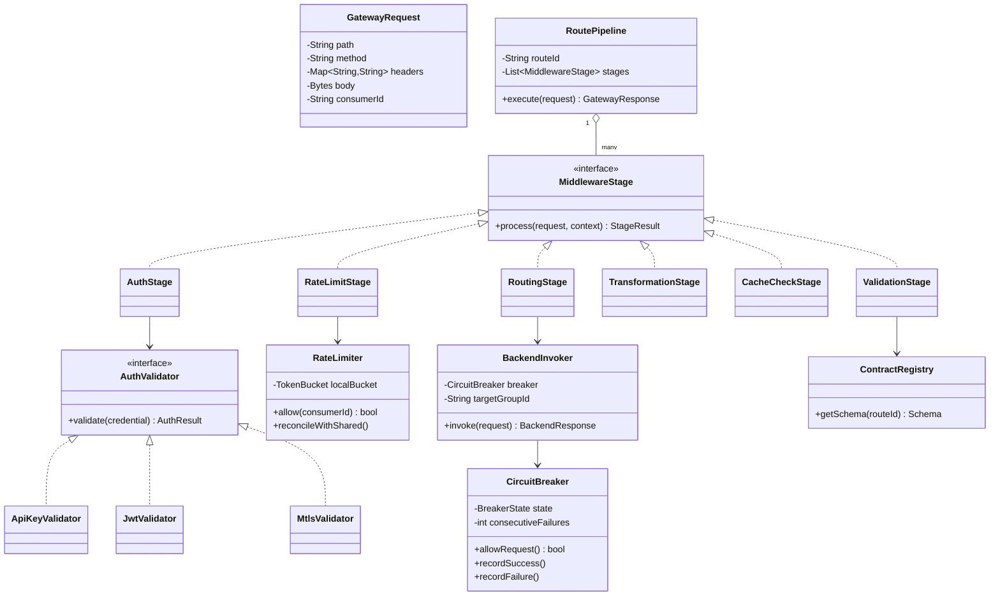
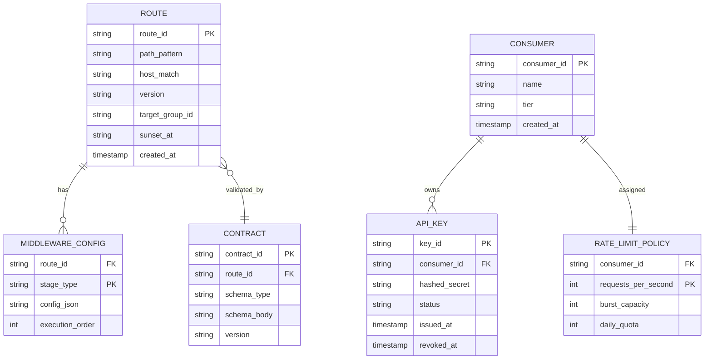
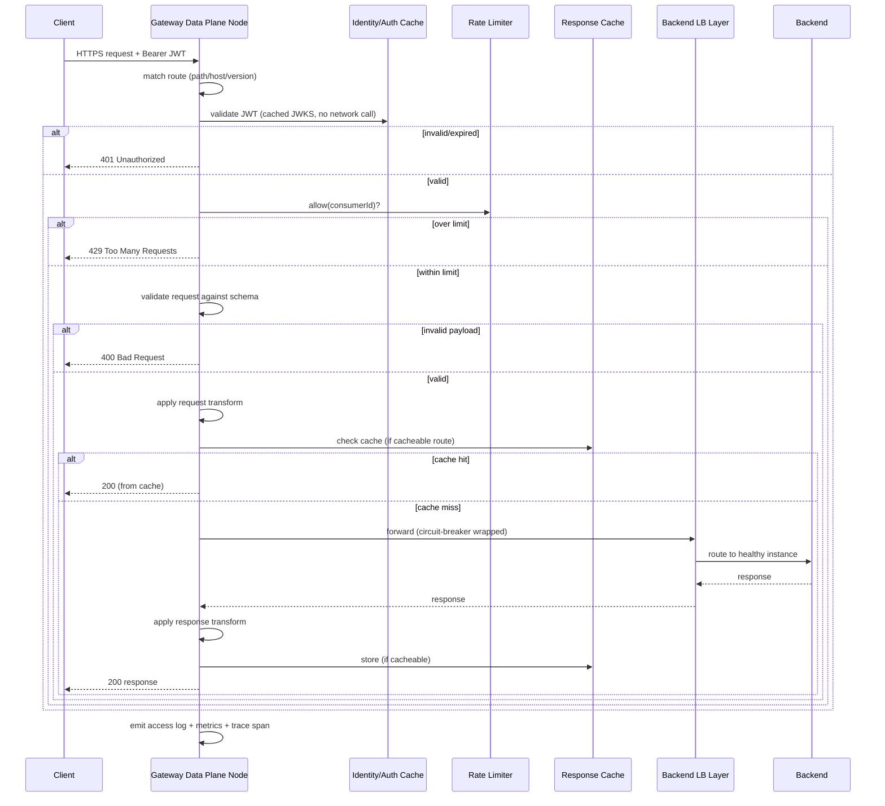

# API Gateway System Design — HLD & LLD

**Assumed metrics** (call out if different): ~2M requests/sec peak across thousands of backend APIs · tens of thousands of registered API consumers (internal + external/partner) · gateway-added overhead < 10ms p95 · 99.99%+ availability · multi-region active-active · AWS-primary but portable.

**Scope of "all features a standard API Gateway supports"**, explicitly enumerated:
request routing (path/host/version-based) · protocol translation (REST↔gRPC, REST↔GraphQL, WebSocket) · authentication (API keys, OAuth2/OIDC, JWT validation, mTLS) · authorization (scopes/RBAC) · rate limiting & quota management (per-consumer, per-API, tiered plans) · request/response transformation · request validation (schema enforcement) · response caching · circuit breaking & retries to backends · service discovery integration · API versioning & deprecation · request aggregation/composition (BFF pattern) · CORS handling · a pluggable middleware/plugin pipeline · developer portal & API key/credential lifecycle · observability (metrics, structured access logs, distributed tracing) · canary/blue-green routing.

This design deliberately builds on the **Load Balancer design already discussed** — the gateway sits one layer above the LB in the request path (client → API Gateway → internal LB → backend service) and reuses its control-plane/data-plane split, health-checking, and routing-table propagation model rather than reinventing them. Where a concept was already covered there (target health, connection draining, consistent hashing), this document references it instead of repeating it, and focuses on what's genuinely new at the API layer: identity, contracts, transformation, and per-consumer policy.

---

# Phase 2: High-Level Design (HLD)

## 1. Scope & System Estimation

**Functional Requirements**
- Route incoming API requests to the correct backend service based on path, host, version, or header
- Authenticate callers via API key, OAuth2/OIDC token, JWT, or mTLS, and authorize based on scopes/roles
- Enforce per-consumer rate limits and quotas (e.g., "Free tier: 1,000 req/day", "Partner X: 500 req/sec burst")
- Validate request payloads against a registered schema before forwarding (reject malformed requests before they cost a backend anything)
- Transform requests/responses (header injection, body reshaping, protocol translation) so backends don't all need to speak the same contract as clients
- Cache idempotent (typically GET) responses to reduce backend load
- Apply circuit breaking and bounded retries when calling backends
- Support multiple API versions concurrently, with a deprecation/sunset mechanism
- Let a team publish a new API (self-service) via a developer portal, including key issuance
- Aggregate multiple backend calls into a single client-facing response (BFF) for high-fan-out clients (e.g., mobile)
- Emit per-request logs/metrics/traces sufficient to debug "why did this specific request fail, and where"

**Non-Functional Requirements**
- Availability: 99.99%+ for the data plane (request handling); control plane (publishing new routes, issuing keys) can tolerate 99.9%, same split rationale as the load balancer design
- Consistency: rate-limit counters need to be **approximately** consistent fleet-wide (see trade-off in §4, same shape as the LB's rate-limiter discussion but now the stakes are billing/quota, not just abuse protection); route/auth-policy config needs to propagate quickly (seconds) but the actual request-handling hot path never blocks on a live config fetch
- Compliance: PII must never be logged in plaintext in access logs; API keys/secrets must never appear in logs; TLS 1.2+ everywhere; regional data-residency for request bodies if regulated data passes through
- Scalability: must add gateway capacity horizontally in response to traffic growth without any change to backend services (the whole point of the layer)

**Back-of-the-Envelope Estimation**
- 2M RPS ÷ ~40K RPS/node sustained (lower than the pure-LB per-node number in the prior design, because auth/transformation/validation cost more CPU per request than raw forwarding) → **~50-60 nodes minimum**, sized up for headroom and multi-AZ spread → design for **150-200 nodes**.
- JWT validation cost: RSA/ECDSA signature verification is ~0.1-0.5ms per token on modern hardware; at 2M RPS this is a meaningful chunk of the 10ms budget, which is precisely why **JWKS (public key) caching** at each node is mandatory — fetching the identity provider's public key over the network per-request would blow the latency budget by 10-50x (see §3).
- Rate-limit counter writes: if every consumer's limit is checked and incremented per request, that's up to 2M counter-increments/sec — this is why rate limiting is architected as **local-approximate with periodic reconciliation** rather than a single shared exact counter (same trade-off pattern as the LB design, but now quantified: a shared Redis counter at 2M ops/sec is achievable but adds a network hop to *every single request*, which alone could consume 30-50% of the entire latency budget).
- Response cache: assuming ~20% of traffic is cacheable GETs with a 60s TTL and a 70% hit rate, cacheable traffic reduces backend-facing load by roughly **14% of total fleet RPS** — a meaningful backend-protection number, not just a latency nicety.

## 2. System Architecture & Components

**Architecture Style**: Same **control plane / data plane split** as the load balancer, extended with an **identity/policy layer** and a **pluggable middleware pipeline** on the data plane. Justification: the reasons for the split are identical to the LB case (hot path must never block on a database), but the API Gateway adds a genuinely new architectural requirement — different APIs need *different combinations* of auth, transformation, and rate-limit policy applied in a specific order, which is what makes "pluggable middleware pipeline" (not just "routing table") the right core abstraction here, distinct from the LB's simpler forward-to-healthy-target model.

**Component Breakdown**
- **Data Plane Nodes**: run the per-request middleware pipeline (auth → rate limit → validation → transformation → routing → circuit-breaker-wrapped backend call → response transformation → caching → logging)
- **Control Plane**: pushes route definitions, auth policies, rate-limit configs, and transformation rules to data-plane nodes (same xDS-style streaming model as the LB design)
- **Identity/Auth Service**: validates API keys against the registry, verifies JWTs against cached JWKS, integrates with external OIDC providers for token introspection when needed
- **Rate Limiter**: local token-bucket per node for coarse/fast enforcement, backed by a periodic-reconciliation shared counter for cross-node quota accuracy (detailed trade-off in §4)
- **Schema/Contract Registry**: stores the OpenAPI/GraphQL/protobuf schema for each registered API, used for request validation and for generating the developer portal's docs
- **Transformation Engine**: applies configured request/response transforms (header injection, JSONPath-based body reshaping, protocol translation adapters for REST↔gRPC etc.)
- **Response Cache**: keyed by (route, normalized query params, relevant headers), TTL-based, invalidatable via explicit purge API
- **Backend Discovery/Routing Layer**: this is where the gateway hands off to the **Load Balancer system already designed** — the gateway resolves "which target group" and delegates actual healthy-instance selection to that layer rather than duplicating health-checking logic
- **Aggregation/BFF Service**: executes fan-out calls to multiple backends per a configured composition definition and merges results before responding to the client
- **Developer Portal**: self-service UI/API for publishing API definitions, issuing/revoking keys, viewing usage/quota
- **Observability Pipeline**: structured access logs (with PII redaction rules applied before persistence), per-route/per-consumer metrics, distributed trace propagation (W3C traceparent header injection/forwarding)

**Data Flow Walkthrough**

*Write path (publishing a new API / policy change):*
1. A service team submits an API definition (OpenAPI spec) + desired policies (auth type, rate limits, transformations) via the Developer Portal / Config API.
2. Control Plane validates the spec, stores it in the Contract Registry, and generates the corresponding routing rule + middleware pipeline configuration for that route.
3. Control Plane pushes the new route + pipeline config to all data-plane nodes via the streaming update channel (identical propagation mechanism to the LB design).
4. Developer Portal issues an API key (or registers an OAuth client) for the consumer, stored in the Identity/Auth registry with its assigned rate-limit tier.

*Read path (a client request):*
1. Client sends a request with credentials (API key header, Bearer JWT, or mTLS cert) to the gateway's edge.
2. Data-plane node matches the request to a route (path/host/version), loading that route's middleware pipeline from its local cached config.
3. **Auth stage**: validates the credential — API key lookup (cached), or JWT signature check against cached JWKS + expiry/audience/issuer claims check. Fails fast (401/403) before any further processing if invalid — this ordering matters, since auth is the cheapest possible rejection and should never happen after expensive work.
4. **Rate-limit stage**: checks the caller's local token bucket; if exceeded, returns 429 immediately without touching the backend.
5. **Validation stage**: checks the request body/params against the registered schema; malformed requests are rejected (400) before ever reaching a backend.
6. **Transformation stage**: applies configured request transforms (e.g., inject an internal auth header, reshape a REST body into the gRPC message the backend actually expects).
7. **Cache check**: for cacheable routes, checks the response cache first; on hit, returns immediately, skipping the backend entirely.
8. **Routing/forwarding**: hands off to the backend Load Balancer layer (circuit-breaker-wrapped) to reach a healthy instance of the target service.
9. **Response path**: applies response transforms, writes to cache if applicable, emits access log + metrics + trace span, returns to client.

## 3. Storage & Data Strategy

**Database Selection**
- **Contract/Schema Registry**: document store (e.g., DynamoDB or a Git-backed store) holding OpenAPI/protobuf definitions per route — read-heavy at config-propagation time, not on the request hot path.
- **API Key / Credential Registry**: strongly-consistent KV store (DynamoDB with conditional writes) — a revoked key must stop working promptly; cached at each data-plane node with a short TTL (seconds) to balance "fast lookup" against "revocation propagates quickly."
- **JWKS cache**: in-memory per node, refreshed on a schedule (e.g., every 10-15 min) or on a signature-verification-failure-triggered refresh (handles key rotation without waiting for the full TTL) — this is the single most important cache in the system given the JWT-validation cost estimated in §1.
- **Rate-limit counters**: local in-memory token buckets per node (fast path) + a shared counter store (Redis) that nodes reconcile against periodically (e.g., every 1-5s) rather than on every request — bounds the network-hop cost while still catching a consumer who spreads requests across many nodes to evade a purely local limit.
- **Response cache**: distributed cache (Redis/Memcached cluster, or per-node local cache for smaller catalogs) keyed by a normalized cache key; sized and evicted by TTL + LRU.
- **Access logs**: same pattern as the LB design — append-only, cheap-ingestion store (S3 + Athena or a log platform), with a PII-redaction transform applied *before* persistence, not after (never write sensitive fields to durable storage in the first place).
- **Usage/metering data** (for quota enforcement and billing): a separate, append-only event stream (requests-per-consumer events) aggregated by a downstream batch/stream job into daily/monthly usage totals — decoupled from the real-time rate limiter, which only needs "requests in the last N seconds," not full historical usage.

**Data Lifecycle**
- **Config propagation**: identical incremental/delta streaming model as the LB design — new routes, policy changes, and key revocations propagate to all nodes within seconds via the control-plane push channel, never via per-request polling.
- **Rate-limit reconciliation**: local buckets refill continuously; the shared-counter reconciliation is a background process, not a per-request dependency — if the reconciliation service is briefly unavailable, nodes fall back to local-only enforcement (slightly less precise, never fails open to "no limiting at all").
- **API versioning**: routes are versioned explicitly (`/v1/...`, `/v2/...` or a header-based version negotiation); a deprecated version's route config carries a `sunsetAt` timestamp, and the gateway injects a `Deprecation`/`Sunset` response header automatically once past that date — making deprecation visible to consumers without requiring backend changes.
- **Cache invalidation**: explicit purge API for config-driven invalidation (a backend team ships a fix and wants stale cached responses gone immediately) plus standard TTL expiry for the common case.

## 4. Cross-Cutting Concerns & Trade-offs

**CAP Theorem & Trade-offs**
- API key/credential validation: leans **CP** for revocation correctness (a revoked key should stop working promptly) but is implemented pragmatically with a short-TTL cache — a deliberate, bounded compromise: full CP (live lookup every request) would blow the latency budget; full AP (long cache TTL) would make revocation too slow. The short TTL is the tuning knob.
- Rate-limit enforcement: **AP**, same reasoning as the LB design — a partition between a node and the shared counter store means the node keeps enforcing its local approximate limit rather than failing every request open or closed.
- Route/policy config: **AP** for propagation (nodes serve on their last-known-good config during a control-plane blip) — identical to the LB's routing-table trade-off, since this gateway explicitly reuses that model.

**Resiliency & Security**
- **Circuit breaking to backends**: per-backend-service circuit breakers (open after N consecutive failures or an elevated error-rate window) with a configurable fallback (fail fast with a 503, or serve a stale cached response if one exists) — protects backends from being hammered by a gateway that keeps retrying a service that's already down.
- **Bounded retries**: idempotent (GET/PUT with idempotency key) requests may be retried on transient backend failures with exponential backoff and a retry budget cap; non-idempotent POSTs are **not** auto-retried by the gateway unless the caller has supplied an idempotency key — silently retrying a payment POST is a correctness bug, not a resiliency feature.
- **Request validation as a security boundary**: schema validation rejects malformed/oversized payloads before backend CPU is spent on them — this doubles as a first line of defense against certain injection and DoS patterns, though it doesn't replace a WAF.
- **WAF layer**: typically sits in front of or integrated with the gateway edge (SQLi/XSS pattern blocking, IP reputation) — complementary to, not a replacement for, the gateway's own auth/validation.
- **mTLS support**: for service-to-service or high-trust partner integrations, the gateway can require and validate client certificates in addition to or instead of bearer tokens.
- **PII handling in logs**: redaction rules (configured per-route, since "sensitive field" differs by API) applied in the observability pipeline before any log line is persisted — never redacted after the fact, since "after the fact" means it was already durably written somewhere.
- **CORS**: handled at the gateway edge via configured allowed-origins/methods/headers per route, so individual backend teams don't each reimplement (and inevitably misconfigure) CORS themselves.

---

# Phase 3: Low-Level Design (LLD)

## 1. Class & Object-Oriented Design

**Design Patterns**
- **Chain of Responsibility**: the request-processing pipeline (auth → rate-limit → validation → transformation → cache-check → routing → response-transformation) is a chain of independent, ordered, short-circuiting middleware stages — this is the core extensibility mechanism; new cross-cutting behavior (e.g., a new auth type) is a new stage, not a change to existing ones.
- **Strategy**: pluggable `AuthValidator` (ApiKeyValidator, JwtValidator, MtlsValidator) and pluggable `Transformer` (header injection, JSONPath reshape, protocol adapter) behind common interfaces.
- **Adapter**: protocol-translation transformers (REST→gRPC, REST→GraphQL) are adapters reconciling the client-facing contract with the backend's native protocol.
- **Circuit Breaker** (state pattern): per-backend breaker with `CLOSED → OPEN → HALF_OPEN` states, reused conceptually from the LB design's outlier-detection mechanism but scoped here to logical backend services rather than raw targets.



## 2. Database Schema Design



**Table Definitions**

`ROUTE`

| Field | Type | Constraints | Description |
|---|---|---|---|
| route_id | String | PK | — |
| path_pattern | String | Not Null | e.g., `/v2/orders/{orderId}` |
| host_match | String | Nullable | For host-based routing |
| version | String | Not Null | e.g., `v2` |
| target_group_id | String | Not Null | References a Load-Balancer target group (see prior design) |
| sunset_at | Timestamp | Nullable | Drives deprecation headers |
| created_at | Timestamp | Not Null | — |

`API_KEY`

| Field | Type | Constraints | Description |
|---|---|---|---|
| key_id | String | PK | Public identifier |
| consumer_id | String | FK → CONSUMER | — |
| hashed_secret | String | Not Null | Never store raw keys |
| status | String | Not Null | ACTIVE / REVOKED |
| issued_at | Timestamp | Not Null | — |
| revoked_at | Timestamp | Nullable | — |

`RATE_LIMIT_POLICY`

| Field | Type | Constraints | Description |
|---|---|---|---|
| consumer_id | String | FK → CONSUMER | — |
| requests_per_second | Int | PK (composite) | Sustained rate |
| burst_capacity | Int | Not Null | Token-bucket burst size |
| daily_quota | Int | Nullable | Longer-window cap, enforced via usage aggregation, not the hot-path bucket |

`MIDDLEWARE_CONFIG`

| Field | Type | Constraints | Description |
|---|---|---|---|
| route_id | String | FK → ROUTE | — |
| stage_type | String | PK (composite) | AUTH / RATE_LIMIT / VALIDATION / TRANSFORM / CACHE |
| config_json | String | Not Null | Stage-specific settings (e.g., which AuthValidator, TTL for cache) |
| execution_order | Int | Not Null | Enforces pipeline ordering |

## 3. API & Interface Specifications

```yaml
openapi: 3.0.0
info:
  title: API Gateway Control Plane API
  version: "1.0"
paths:
  /routes:
    post:
      summary: Publish a new route (self-service API publishing)
      requestBody:
        content:
          application/json:
            schema:
              type: object
              required: [pathPattern, version, targetGroupId]
              properties:
                pathPattern: { type: string }
                hostMatch: { type: string }
                version: { type: string }
                targetGroupId: { type: string }
                middleware:
                  type: array
                  items:
                    type: object
                    properties:
                      stageType: { type: string, enum: [AUTH, RATE_LIMIT, VALIDATION, TRANSFORM, CACHE] }
                      config: { type: object }
      responses:
        "201": { description: Route published }

  /consumers/{consumerId}/keys:
    post:
      summary: Issue a new API key for a consumer
      responses:
        "201":
          content:
            application/json:
              schema:
                type: object
                properties:
                  keyId: { type: string }
                  secret: { type: string, description: "Shown once at creation, never retrievable again" }

    delete:
      summary: Revoke an API key
      parameters:
        - name: keyId
          in: query
          schema: { type: string }
      responses:
        "202": { description: Revocation accepted, propagates within the credential-cache TTL window }

  /consumers/{consumerId}/rate-limit-policy:
    put:
      summary: Set or update a consumer's rate-limit tier
      requestBody:
        content:
          application/json:
            schema:
              type: object
              properties:
                requestsPerSecond: { type: integer }
                burstCapacity: { type: integer }
                dailyQuota: { type: integer }
      responses:
        "200": { description: Policy updated }

  /cache/purge:
    post:
      summary: Explicitly invalidate cached responses matching a route/key pattern
      requestBody:
        content:
          application/json:
            schema:
              type: object
              properties:
                routeId: { type: string }
                keyPattern: { type: string }
      responses:
        "202": { description: Purge accepted, propagates to all nodes }

  /routes/{routeId}/usage:
    get:
      summary: Get aggregated usage metrics for a route (operational/billing visibility)
      parameters:
        - name: from
          in: query
          schema: { type: string, format: date }
        - name: to
          in: query
          schema: { type: string, format: date }
      responses:
        "200":
          content:
            application/json:
              schema:
                type: object
                properties:
                  totalRequests: { type: integer }
                  errorRate: { type: number }
                  p95LatencyMs: { type: number }
                  cacheHitRate: { type: number }
```

**Idempotency**
- Route publishing is upserted by `(pathPattern, version)` as the effective natural key — republishing the same definition (common in CI/CD-driven "desired state" pipelines) is a no-op update, not a duplicate route.
- API key issuance returns the secret exactly once and is **not** idempotent by design (each call mints a genuinely new credential) — but revocation *is* idempotent: revoking an already-revoked key just confirms the current state.
- Cache purge accepts an idempotency-safe key pattern; issuing the same purge twice is harmless (second call finds nothing left to purge).
- Backend-facing retries (within the gateway's circuit-breaker/retry logic) only apply to requests the gateway knows are safe to retry — GET/PUT, or POST/DELETE carrying a client-supplied idempotency key that the gateway forwards unchanged so the backend can dedupe.

## 4. Concrete Code Snippets & Sequence Flows



**Core Logic: Pluggable, Short-Circuiting Middleware Pipeline** (the core extensibility mechanism — every gateway feature above is "just" a stage in this chain, which is what lets new cross-cutting concerns be added without touching existing ones)

```typescript
// pipeline.ts

interface GatewayRequest {
  path: string;
  method: string;
  headers: Record<string, string>;
  body: Buffer | null;
  consumerId?: string;
}

interface GatewayResponse {
  statusCode: number;
  headers: Record<string, string>;
  body: Buffer | null;
}

interface PipelineContext {
  routeId: string;
  consumerId?: string;
  cacheHit?: boolean;
  // additional shared state stages may read/write, e.g., decoded JWT claims
  attributes: Map<string, unknown>;
}

/**
 * A stage either short-circuits (returns a response immediately, e.g. a 401
 * or 429) or passes control to the next stage. This is the entire contract —
 * every feature (auth, rate limiting, validation, transformation, caching)
 * implements this same interface.
 */
interface MiddlewareStage {
  readonly name: string;
  process(
    request: GatewayRequest,
    context: PipelineContext,
    next: () => Promise<GatewayResponse>
  ): Promise<GatewayResponse>;
}

class AuthStage implements MiddlewareStage {
  readonly name = "auth";

  constructor(private readonly validator: AuthValidator) {}

  async process(
    request: GatewayRequest,
    context: PipelineContext,
    next: () => Promise<GatewayResponse>
  ): Promise<GatewayResponse> {
    const credential = request.headers["authorization"];
    if (!credential) {
      return this.reject(401, "Missing credential");
    }

    const result = await this.validator.validate(credential);
    if (!result.valid) {
      return this.reject(401, result.reason ?? "Invalid credential");
    }

    context.consumerId = result.consumerId;
    context.attributes.set("authClaims", result.claims);
    return next(); // short-circuits stop here; success continues the chain
  }

  private reject(statusCode: number, reason: string): GatewayResponse {
    return {
      statusCode,
      headers: { "content-type": "application/json" },
      body: Buffer.from(JSON.stringify({ error: reason })),
    };
  }
}

class RateLimitStage implements MiddlewareStage {
  readonly name = "rate_limit";

  constructor(private readonly limiter: RateLimiter) {}

  async process(
    request: GatewayRequest,
    context: PipelineContext,
    next: () => Promise<GatewayResponse>
  ): Promise<GatewayResponse> {
    if (!context.consumerId) {
      // Should not happen if AuthStage runs first; fail closed defensively.
      return this.reject();
    }

    const allowed = await this.limiter.allow(context.consumerId);
    if (!allowed) {
      return this.reject();
    }
    return next();
  }

  private reject(): GatewayResponse {
    return {
      statusCode: 429,
      headers: { "content-type": "application/json", "retry-after": "1" },
      body: Buffer.from(JSON.stringify({ error: "Rate limit exceeded" })),
    };
  }
}

/**
 * Composes an ordered list of stages into a single executable pipeline.
 * Each stage receives a `next` callback bound to the remainder of the
 * chain — this is what makes short-circuiting and ordering both work
 * with plain function composition, no central "if/else per feature" logic.
 */
class RoutePipeline {
  constructor(
    private readonly routeId: string,
    private readonly stages: MiddlewareStage[],
    private readonly terminalHandler: (
      request: GatewayRequest,
      context: PipelineContext
    ) => Promise<GatewayResponse>
  ) {}

  async execute(request: GatewayRequest): Promise<GatewayResponse> {
    const context: PipelineContext = {
      routeId: this.routeId,
      attributes: new Map(),
    };

    const runFrom = (index: number): (() => Promise<GatewayResponse>) => {
      return async () => {
        if (index >= this.stages.length) {
          return this.terminalHandler(request, context);
        }
        const stage = this.stages[index];
        return stage.process(request, context, runFrom(index + 1));
      };
    };

    return runFrom(0)();
  }
}

// --- supporting interfaces referenced above ---
interface AuthValidator {
  validate(credential: string): Promise<{
    valid: boolean;
    consumerId?: string;
    claims?: Record<string, unknown>;
    reason?: string;
  }>;
}

interface RateLimiter {
  allow(consumerId: string): Promise<boolean>;
}

// --- unit test placeholders ---
describe("RoutePipeline", () => {
  it("short-circuits with 401 when auth fails, never reaching later stages", async () => {
    // arrange: AuthStage with a validator that always rejects; a spy RateLimitStage
    // act: execute a request
    // assert: response.statusCode === 401; rate-limit stage's process() was never called
  });

  it("passes context.consumerId from AuthStage into RateLimitStage", async () => {
    // arrange: AuthStage validator resolves consumerId="abc"; RateLimitStage spy
    //          asserts it received context.consumerId === "abc"
  });

  it("reaches the terminal handler when all stages pass", async () => {
    // arrange: stages that all call next() unconditionally
    // act: execute
    // assert: terminalHandler was invoked exactly once
  });

  it("rate-limit stage rejects with 429 without calling next", async () => {
    // arrange: limiter.allow() resolves false
    // assert: statusCode === 429, terminalHandler never invoked
  });
});
```

---

### Key design decisions worth flagging back to you
1. **The gateway deliberately delegates backend-instance selection to the Load Balancer layer** rather than reimplementing health-checking/consistent-hashing — the gateway's job is identity, contract, and policy; the LB's job is "which healthy instance." Conflating the two tends to produce a gateway that's slow at both.
2. **JWKS caching is the single highest-leverage optimization** in this whole design — without it, JWT auth alone could eat the entire 10ms latency budget across 2M RPS.
3. **The middleware pipeline abstraction is what "supports all standard features" actually means in practice** — every feature in the requirements list (auth, rate limiting, validation, transformation, caching) is an instance of the same interface, so the design scales in *feature count* without scaling in *architectural complexity*.

Let me know if you want to go deeper on any piece — e.g., the request-aggregation/BFF composition engine, a concrete tiered-quota billing/metering pipeline, or GraphQL-specific concerns (query complexity limiting, persisted queries) that a pure-REST gateway design tends to gloss over.
