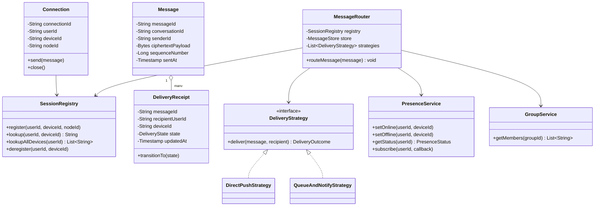
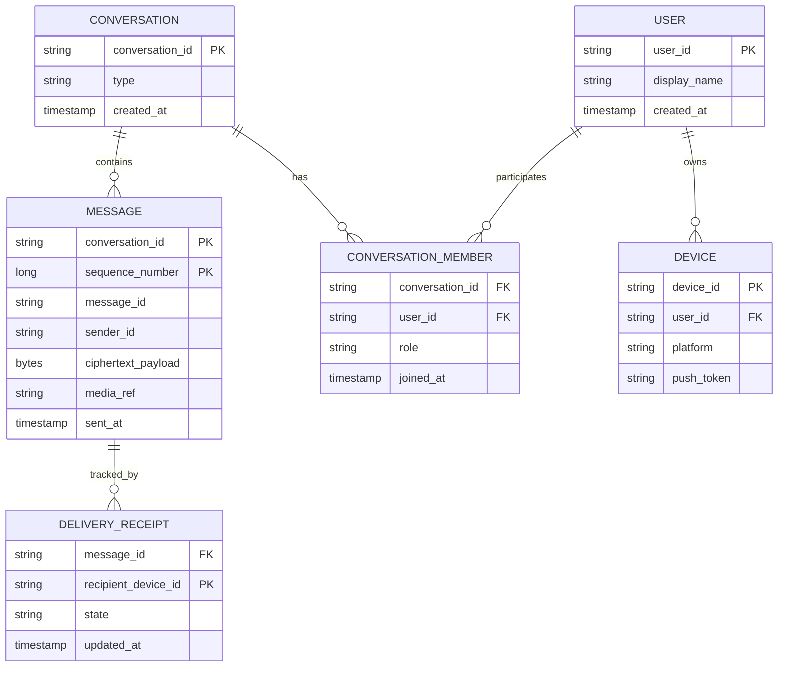
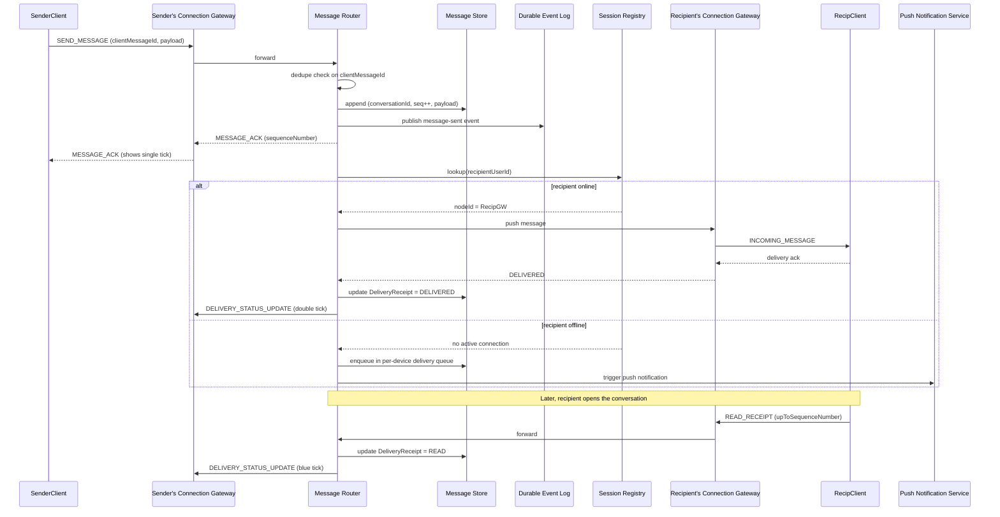

# Real-Time Chat Application (WhatsApp-style) — HLD & LLD

**Assumed metrics** (call out if different): ~100M DAU · ~20M peak concurrent WebSocket connections · ~50B messages/day (peak ~1M messages/sec) · message delivery p95 < 200ms (both parties online) · presence/typing updates < 500ms · 99.95%+ availability, message durability non-negotiable · multi-region active-active · AWS-primary.

**Scope, explicitly enumerated** (so nothing implied by "all analytics and status management like WhatsApp" gets silently dropped): real-time 1:1 and group messaging over WebSockets · delivery status per message (sent → delivered → read, "single/double/blue tick" semantics) · presence (online/offline/last-seen) · typing indicators · multi-device sync (same account, several devices) · offline delivery via push notification when the recipient has no live connection · message persistence and history sync · media messages (images/video/voice, uploaded out-of-band from the WebSocket path) · message ordering and idempotent delivery (no duplicates, no reordering within a conversation) · end-to-end encryption posture (designed for, not implemented in transport detail here) · analytics: real-time (active connections, message throughput, delivery latency) and batch (engagement trends, retention, message-volume-by-region dashboards).

This design reuses two patterns already established in this conversation: the **control-plane/data-plane split with consistent hashing** from the Load Balancer design (here used to route "which connection node owns this user's socket," a materially different problem than load-balancing stateless HTTP requests), and the **Lambda architecture (streaming + batch over one event log)** from the Loyalty Insights design, applied here to chat analytics instead of loyalty events.

---

# Phase 2: High-Level Design (HLD)

## 1. Scope & System Estimation

**Functional Requirements**
- Establish and maintain persistent WebSocket connections for online clients; gracefully handle reconnects (mobile networks drop constantly)
- Route a message from sender to recipient(s) with delivery-status tracking at each hop (sent by sender → received by server → delivered to recipient device → read by recipient)
- Maintain and broadcast presence (online/offline/last-seen) and typing indicators to relevant contacts, without turning presence updates into a firehose that dwarfs actual message traffic
- Support group conversations (fan-out to N members) alongside 1:1
- Support multiple devices per account with consistent message history across all of them
- Queue and push-notify when a recipient is offline; deliver queued messages on reconnect, in order, without duplication
- Persist message history durably and make it efficiently retrievable (scroll-back, search)
- Handle media messages via a separate upload path (never through the WebSocket, which is for control/text messages)
- Provide real-time operational analytics (active connections, message throughput, delivery latency percentiles) and batch analytics (DAU/MAU, retention, engagement-by-cohort, message-volume trends)

**Non-Functional Requirements**
- Availability: 99.95%+ for the messaging path; a connection-node failure must not lose in-flight messages, only force a reconnect
- Consistency: **message delivery and ordering per-conversation is CP-leaning** (a message must not be lost, and within one conversation, order matters — see §4); **presence is AP** (a few-hundred-ms-stale "online" status is an acceptable, expected trade-off, never worth blocking message delivery over)
- Durability: once a server acks a message as "sent," it must survive a node crash — this is a hard requirement, not a nice-to-have, because it's the trust foundation of the whole product
- Compliance: E2E encryption posture means the server should be designed to route and store ciphertext, not require plaintext access, for private conversations — analytics must be computable from metadata (sender, recipient, timestamp, size) without needing message content
- Scalability: connection count and message volume both need independent horizontal scaling (a viral moment spikes connections; a big broadcast/group spikes fan-out — different bottlenecks)

**Back-of-the-Envelope Estimation**
- 20M concurrent connections ÷ ~50K connections/node (realistic for a tuned event-loop-based WebSocket server, e.g., Netty/Node) → **~400 connection nodes** minimum, sized up for multi-AZ/region headroom → design for **600-800 nodes**.
- 1M messages/sec peak × ~500 bytes avg (text + metadata) ≈ **500 MB/sec** through the message pipeline at peak.
- Group fan-out multiplier: assume average group size 8, and ~15% of messages are group messages → effective delivery fan-out is roughly **1M × (0.85×1 + 0.15×8) ≈ ~2.05M delivery-events/sec** — this is the number that actually sizes the delivery/notification path, not the raw message-send rate.
- Message storage: 50B messages/day × 500 bytes ≈ **25 TB/day** raw, ~9 PB/year before any tiering — same "must tier hot/warm/cold" lesson as the loyalty platform's event volume, applied here to message history.
- Presence update volume: 20M users, assume avg 10 state changes/hour (online/offline/foreground-background) → **~55K presence events/sec** — an order of magnitude below message volume, which is exactly why presence gets its own lightweight, AP-leaning path rather than sharing the durable message pipeline.

## 2. System Architecture & Components

**Architecture Style**: Microservices with a clear split between **the connection/session layer** (stateful — literally holds open sockets), **the message/delivery layer** (event-driven, built on a durable log), and **the analytics layer** (Lambda architecture, reused from the loyalty design). Justification: these three have fundamentally different scaling and consistency needs — connection nodes scale with concurrent-user count and must be sticky (a socket lives on exactly one node); message processing scales with throughput and must be durable/ordered; analytics scales with total event volume and tolerates eventual consistency. Forcing them into one service would mean over-constraining the parts that don't need strong consistency and under-constraining the part that does.

**Component Breakdown**
- **Connection Gateway (WebSocket nodes)**: holds the actual persistent client connections; on connect, registers `(userId, deviceId) → nodeId` in the Session Registry; on message-send, forwards to the Message Router; on incoming delivery, pushes to the locally-held socket if the recipient is connected to this node
- **Session Registry**: the "who's connected where" source of truth — a fast KV store (Redis/DynamoDB) mapping user/device to connection-node — this is the chat-specific analog of the LB's target registry, but routing a *specific user* to *their* node rather than any healthy backend, which is why it's a direct lookup, not a load-balancing algorithm
- **Message Router**: on receiving a message from a Connection Gateway, persists it (durable write, see §3), determines recipient(s), looks up their connection node(s) via the Session Registry, and either pushes directly (if online) or enqueues for push-notification delivery (if offline)
- **Presence Service**: tracks online/offline/last-seen/typing state, backed by a fast, AP-leaning store (Redis pub/sub) — deliberately decoupled from the durable Message Router path
- **Message Store**: durable, partitioned-by-conversation persistence for message history and scroll-back
- **Delivery Receipt Tracker**: records sent/delivered/read state transitions per message per recipient (matters per-recipient in groups — read receipts aren't all-or-nothing)
- **Push Notification Service**: integrates with APNs/FCM for offline delivery — triggered when the Message Router finds no live connection for a recipient
- **Media Service**: separate upload/download path (pre-signed URLs to object storage, same pattern as the file-upload service design) — the WebSocket carries only a reference (media ID + thumbnail), never the binary
- **Multi-Device Sync Service**: ensures a message sent/received on one device reflects on all of a user's devices — effectively treats "recipient" as a device-set, not a single socket
- **Analytics Pipeline** (Lambda architecture, reused pattern): stream processing for real-time ops metrics (throughput, latency, connection counts) and batch processing for engagement/retention/business analytics
- **Group Management Service**: membership, roles, group metadata — referenced by the Message Router to resolve fan-out lists

**Data Flow Walkthrough**

*Write path (sending a message):*
1. Client sends a message frame over its WebSocket to its connected Connection Gateway node.
2. Gateway forwards to the Message Router, which first **durably persists the message** (append to the Message Store + publish to the durable event log) — this happens *before* attempting delivery, so a message is never "in flight and losable."
3. Router acks back to the sender's gateway → sender's client sees "sent" (single tick) — this ack is purely about durability, not about the recipient having seen anything.
4. Router resolves recipient(s) (1 for direct, N for group) and, for each, queries the Session Registry for their current connection node.
5. If a recipient is online: Router pushes the message to their specific connection node, which delivers it over their live socket. Recipient's client sends back a delivery ack → Delivery Receipt Tracker updates status to "delivered" (double tick) → propagated back to sender (a presence-style, best-effort update, not re-persisted as critical data).
6. If a recipient is offline: message sits durably in their per-user delivery queue; Push Notification Service is triggered to wake their device; on reconnect, the client requests undelivered messages since its last-known cursor and the Router drains the queue in order.
7. When the recipient actually opens/views the conversation, client sends a "read" event → Delivery Receipt Tracker updates to "read" (blue tick) → propagated to sender.

*Read path (analytics / history):*
1. **Real-time ops**: stream processor consumes the durable event log, computes rolling metrics (messages/sec, delivery-latency percentiles, active-connections-per-region) into a dashboard-facing store — mirrors the loyalty platform's streaming feature computation.
2. **Batch/business analytics**: nightly/hourly Spark-style jobs compute DAU/MAU, retention cohorts, message-volume trends, group-engagement metrics from the data lake — mirrors the loyalty platform's batch gold-table pipeline, applied to chat events instead of purchase events.
3. **Scroll-back/history**: client requests message history for a conversation → served from the partitioned Message Store, not from the real-time path at all.

## 3. Storage & Data Strategy

**Database Selection**
- **Session Registry**: Redis or DynamoDB — needs single-digit-ms lookups at massive read/write rates (every connect/disconnect writes, every message-send reads); this is the hottest-path lookup in the whole system.
- **Message Store**: a wide-column/partitioned store (Cassandra-style, or DynamoDB with a conversation-based partition key) — chosen specifically because chat access patterns are "give me the last N messages for conversation X," which wide-column stores serve extremely well via clustering on timestamp within a partition.
- **Presence Store**: Redis pub/sub + short-TTL keys — presence is inherently ephemeral (if a key isn't refreshed, the user is presumed offline), which maps naturally onto TTL semantics rather than needing a durable database at all.
- **Durable Event Log** (Kafka/Kinesis): the single source-of-truth stream for "a message was sent" — everything downstream (persistence confirmation, analytics, delivery-receipt propagation) consumes from here, same architectural role as the event bus in the loyalty platform.
- **Media**: object storage (S3), referenced by ID from messages — reuses the file-upload service design's chunked/resumable upload for large media (video/voice notes).
- **Analytics warehouse**: same shape as the loyalty platform — S3 data lake (bronze/silver/gold) + a columnar warehouse for BI queries, fed by the batch layer.

**Data Lifecycle**
- **Message partitioning**: `conversationId` as the primary partition key, `messageTimestamp` (or a monotonic sequence number) as the clustering key — this directly serves the dominant query ("recent messages in this conversation") without a full scan, and keeps one very active conversation from creating a store-wide hotspot the way a naive global-timestamp partition would.
- **Per-user delivery queue**: partitioned by `(recipientUserId, deviceId)`, TTL'd after successful delivery + ack — an offline user's undelivered messages don't need indefinite storage in this queue specifically, since the durable Message Store already has the authoritative copy; the queue is just "what's pending," not "the archive."
- **Connection-node stickiness**: once a client connects to a node, the Session Registry entry pins them there until disconnect — reconnects after a node failure trigger a fresh registry write to whichever node the client's next connection attempt lands on (via the same consistent-hashing-based routing tier discussed in §4, reused conceptually from the LB design).
- **Tiering**: message history follows the same hot/warm/cold pattern as the loyalty platform's event data — recent conversations (say, 90 days) hot in the Message Store, older history moved to cheaper cold storage, restorable on-demand for scroll-back into old history (rare, so higher latency there is an acceptable trade).
- **Multi-device fan-out**: a "recipient" in the Message Router's resolution step expands to a device-set; delivery/read status is tracked per-device, but a conversation is marked "read" for the user once any one of their devices reports it, avoiding N redundant read receipts to the sender for one human's N devices.

## 4. Cross-Cutting Concerns & Trade-offs

**CAP Theorem & Trade-offs**
- Message durability/delivery: **CP-leaning** for the "was this message safely persisted" question — a write isn't acked to the sender as "sent" until it's durably logged; this is deliberately more conservative than the LB/loyalty designs' AP-leaning defaults, because a lost chat message is a trust-breaking product failure in a way a stale load-balancer routing table isn't.
- Message ordering: enforced **per-conversation**, not globally — partitioning by `conversationId` in the durable log (same key used for storage) means one conversation's messages are strictly ordered (single partition = single consumer = in-order processing), while different conversations can process fully in parallel with no ordering relationship required between them. This is the standard, correct trade-off: global ordering across billions of unrelated conversations would be both meaningless to users and needlessly expensive to guarantee.
- Presence/typing/delivered-status propagation: **AP**, same reasoning as the LB design's health-status propagation — a slightly stale "online" dot is an accepted, invisible-to-most-users trade-off in exchange for not adding any latency or blocking behavior to the actual message path.

**Resiliency & Security**
- **Connection-node failure**: on node crash, all sockets on it drop; clients detect this (missed heartbeat) and reconnect, landing on a different node via the routing tier; because messages are durably persisted *before* delivery is attempted, a crash between "persisted" and "delivered" just means the message is redelivered from the durable queue on the client's next connect — no data loss, worst case a client briefly sees itself as disconnected.
- **Exactly-once-feeling delivery despite at-least-once mechanics**: the underlying delivery pipeline is at-least-once (retries on ack timeout), so clients dedupe incoming messages by `messageId` — this is the same idempotency pattern used in the loyalty ledger design, applied to message delivery instead of point balances.
- **Backpressure**: if a Connection Gateway node's outbound queue to a client backs up (slow mobile connection), the node applies backpressure rather than unbounded buffering — protects node memory from one slow client, at the cost of that client seeing delayed delivery, which is the correct trade-off (isolate the slow client's problem to that client).
- **Rate limiting**: per-user message-send rate limits at the gateway (same token-bucket pattern as the LB/gateway designs) to prevent spam/abuse without needing message-content inspection.
- **Encryption**: TLS for the WebSocket transport; for private conversations, the design assumes end-to-end encryption at the application layer (server routes and stores ciphertext blobs, group key management handled client-side) — this shapes the analytics requirement in §1: usable analytics must come from metadata (who, when, size, delivery latency), never from content, which the architecture already assumes throughout (no component here inspects message bodies).
- **Group fan-out abuse**: large-group message storms are rate-limited and can be queued/batched for push-notification delivery rather than instantaneous fan-out to thousands of offline devices at once, protecting the Push Notification Service from thundering-herd spikes.

---

# Phase 3: Low-Level Design (LLD)

## 1. Class & Object-Oriented Design

**Design Patterns**
- **Observer**: Presence Service publishes state changes; interested contacts' connection nodes subscribe and forward to live sockets — decouples "who changed state" from "who needs to know."
- **State pattern**: `Message` delivery status (`SENT → DELIVERED → READ`) is a strict forward-only state machine per recipient, same discipline as the `TargetState`/`UploadSession` state machines in earlier designs.
- **Strategy**: pluggable `DeliveryStrategy` (DirectPush for online recipients, QueueAndNotify for offline) selected per-recipient at fan-out time.
- **Mediator**: the Message Router acts as a mediator between Connection Gateways — a gateway never talks to another gateway directly to deliver a message, it always goes through the Router, which is what keeps the gateway fleet horizontally simple (stateless about each other).



## 2. Database Schema Design



**Table Definitions**

`MESSAGE` (partitioned by `conversation_id`, clustered by `sequence_number`)

| Field | Type | Constraints | Description |
|---|---|---|---|
| conversation_id | String | Partition key | Groups all messages of one conversation together for fast scroll-back |
| sequence_number | Long | Clustering key | Monotonic per-conversation ordering — the mechanism behind "per-conversation, not global" ordering from §4 |
| message_id | String | Unique | Client-facing dedup key |
| sender_id | String | Not Null | — |
| ciphertext_payload | Bytes | Nullable if media-only | Server never needs plaintext (see E2E note in §4) |
| media_ref | String | Nullable | Reference into Media Service, not inline binary |
| sent_at | Timestamp | Not Null | — |

`DELIVERY_RECEIPT`

| Field | Type | Constraints | Description |
|---|---|---|---|
| message_id | String | FK → MESSAGE | — |
| recipient_device_id | String | PK (composite) | Per-device, not per-user (multi-device support) |
| state | String | Not Null | SENT / DELIVERED / READ |
| updated_at | Timestamp | Not Null | — |

`CONVERSATION_MEMBER`

| Field | Type | Constraints | Description |
|---|---|---|---|
| conversation_id | String | FK → CONVERSATION | — |
| user_id | String | FK → USER | — |
| role | String | Not Null | MEMBER / ADMIN (for groups) |
| joined_at | Timestamp | Not Null | — |

`DEVICE`

| Field | Type | Constraints | Description |
|---|---|---|---|
| device_id | String | PK | — |
| user_id | String | FK → USER | — |
| platform | String | Not Null | iOS / Android / Web |
| push_token | String | Nullable | For offline push via APNs/FCM |

## 3. API & Interface Specifications

**WebSocket protocol** (control/text messages — media goes through a separate REST upload, referenced by ID):

```yaml
# Client -> Server frames
SEND_MESSAGE:
  conversationId: string
  clientMessageId: string   # idempotency key, deduped server-side
  ciphertextPayload: bytes
  mediaRef: string?         # optional, from prior media upload

TYPING_INDICATOR:
  conversationId: string
  state: "TYPING" | "STOPPED"

READ_RECEIPT:
  conversationId: string
  upToSequenceNumber: long

PRESENCE_HEARTBEAT:
  # sent periodically to keep the session's TTL-based presence key alive

# Server -> Client frames
MESSAGE_ACK:
  clientMessageId: string
  serverMessageId: string
  sequenceNumber: long
  status: "PERSISTED"        # durability ack, i.e. "sent" (single tick)

INCOMING_MESSAGE:
  conversationId: string
  serverMessageId: string
  senderId: string
  sequenceNumber: long
  ciphertextPayload: bytes
  mediaRef: string?

DELIVERY_STATUS_UPDATE:
  serverMessageId: string
  recipientDeviceId: string
  state: "DELIVERED" | "READ"

PRESENCE_UPDATE:
  userId: string
  status: "ONLINE" | "OFFLINE"
  lastSeenAt: timestamp?

TYPING_UPDATE:
  conversationId: string
  userId: string
  state: "TYPING" | "STOPPED"
```

**REST control-plane APIs** (non-real-time operations):

```yaml
openapi: 3.0.0
info:
  title: Chat Service REST API
  version: "1.0"
paths:
  /conversations/{conversationId}/messages:
    get:
      summary: Fetch message history (scroll-back)
      parameters:
        - name: beforeSequenceNumber
          in: query
          schema: { type: integer }
        - name: limit
          in: query
          schema: { type: integer, default: 50 }
      responses:
        "200":
          content:
            application/json:
              schema:
                type: object
                properties:
                  messages:
                    type: array
                    items:
                      type: object
                      properties:
                        serverMessageId: { type: string }
                        senderId: { type: string }
                        sequenceNumber: { type: integer }
                        sentAt: { type: string, format: date-time }

  /conversations/{conversationId}/sync:
    get:
      summary: Fetch undelivered messages since a client's last-known cursor (reconnect flow)
      parameters:
        - name: sinceSequenceNumber
          in: query
          schema: { type: integer }
      responses:
        "200":
          content:
            application/json:
              schema:
                type: object
                properties:
                  messages: { type: array, items: { type: object } }
                  latestSequenceNumber: { type: integer }

  /devices/{deviceId}/push-token:
    put:
      summary: Register/update push notification token for offline delivery
      requestBody:
        content:
          application/json:
            schema:
              type: object
              properties:
                pushToken: { type: string }
                platform: { type: string, enum: [IOS, ANDROID, WEB] }
      responses:
        "200": { description: Updated }

  /analytics/conversations/{conversationId}/summary:
    get:
      summary: Aggregate engagement metrics for a conversation (batch-computed, BI consumption)
      responses:
        "200":
          content:
            application/json:
              schema:
                type: object
                properties:
                  messageCount: { type: integer }
                  activeParticipants: { type: integer }
                  avgDeliveryLatencyMs: { type: number }
```

**Idempotency**
- `SEND_MESSAGE` carries a client-generated `clientMessageId`; the Message Router dedupes on this before persisting — a client that retries a send after a flaky connection (never having received the `MESSAGE_ACK`) doesn't create a duplicate message. This is the same idempotency-key pattern as the file-upload and loyalty-ledger designs, applied to message sends.
- `sequenceNumber` assignment is done atomically per-conversation (a single ordered append per partition), so even under retry, a given `clientMessageId` maps to exactly one `sequenceNumber`.
- `READ_RECEIPT` is idempotent by construction: marking "read up to sequence N" twice with the same N is a no-op; marking with a lower N than already recorded is ignored (state only moves forward, per the strict `SENT → DELIVERED → READ` state machine).
- Reconnect `/sync` calls are safe to repeat with the same `sinceSequenceNumber` — they're a pure read, no side effects.

## 4. Concrete Code Snippets & Sequence Flows



**Core Logic: Idempotent Message Fan-Out with Per-Recipient Delivery Strategy Selection** (the piece that ties together durability, ordering, multi-device, and online/offline delivery — the actual heart of "how does a message get from A to B reliably")

```python
# message_router.py
from dataclasses import dataclass
from enum import Enum
from typing import Optional
import logging

logger = logging.getLogger("chat.router")


class DeliveryState(Enum):
    SENT = "SENT"
    DELIVERED = "DELIVERED"
    READ = "READ"


class DuplicateMessageError(Exception):
    """Not fatal — signals the caller to return the existing ack, not an error."""


@dataclass
class IncomingMessage:
    client_message_id: str
    conversation_id: str
    sender_id: str
    ciphertext_payload: bytes
    media_ref: Optional[str] = None


@dataclass
class PersistedMessage:
    server_message_id: str
    conversation_id: str
    sequence_number: int
    sender_id: str


class MessageStore:
    def find_by_client_message_id(
        self, conversation_id: str, client_message_id: str
    ) -> Optional[PersistedMessage]:
        raise NotImplementedError

    def append(self, message: IncomingMessage) -> PersistedMessage:
        """Atomically assigns the next sequence_number for this conversation
        and durably persists. Must be a single atomic operation per partition
        to guarantee per-conversation ordering under concurrent senders."""
        raise NotImplementedError

    def record_receipt(
        self, server_message_id: str, device_id: str, state: DeliveryState
    ) -> None:
        raise NotImplementedError


class SessionRegistry:
    def lookup_devices(self, user_id: str) -> list[str]:
        """Returns connection-node IDs for every currently-connected device
        of this user; empty list if fully offline."""
        raise NotImplementedError


class DeliveryStrategy:
    def deliver(self, message: PersistedMessage, device_id: str) -> bool:
        """Returns True if delivered live, False if it had to fall back
        to queue-and-notify."""
        raise NotImplementedError


class DirectPushStrategy(DeliveryStrategy):
    def __init__(self, registry: SessionRegistry, gateway_client):
        self._registry = registry
        self._gateway_client = gateway_client

    def deliver(self, message: PersistedMessage, device_id: str) -> bool:
        node_id = self._gateway_client.resolve_node_for_device(device_id)
        if node_id is None:
            return False
        return self._gateway_client.push(node_id, device_id, message)


class QueueAndNotifyStrategy(DeliveryStrategy):
    def __init__(self, delivery_queue, push_service):
        self._delivery_queue = delivery_queue
        self._push_service = push_service

    def deliver(self, message: PersistedMessage, device_id: str) -> bool:
        self._delivery_queue.enqueue(device_id, message)
        self._push_service.notify(device_id, message)
        return False  # queued, not live-delivered


class MessageRouter:
    def __init__(
        self,
        store: MessageStore,
        registry: SessionRegistry,
        direct_strategy: DirectPushStrategy,
        fallback_strategy: QueueAndNotifyStrategy,
    ):
        self._store = store
        self._registry = registry
        self._direct = direct_strategy
        self._fallback = fallback_strategy

    def route_message(
        self, message: IncomingMessage, recipient_user_ids: list[str]
    ) -> PersistedMessage:
        """
        Persists the message exactly once (idempotent on client_message_id),
        then fans out to every device of every recipient, choosing
        DirectPush or QueueAndNotify per-device based on live connectivity.
        """
        existing = self._store.find_by_client_message_id(
            message.conversation_id, message.client_message_id
        )
        if existing is not None:
            logger.info(
                "duplicate_send_returning_existing",
                extra={"client_message_id": message.client_message_id},
            )
            return existing  # idempotent: same ack as the original send

        persisted = self._store.append(message)  # atomic seq assignment
        self._store.record_receipt(
            persisted.server_message_id, message.sender_id, DeliveryState.SENT
        )

        for recipient_id in recipient_user_ids:
            self._fan_out_to_user(persisted, recipient_id)

        return persisted

    def _fan_out_to_user(self, message: PersistedMessage, user_id: str) -> None:
        device_ids = self._registry.lookup_devices(user_id)

        if not device_ids:
            # Fully offline user: still needs at least one queued delivery
            # target — in practice this resolves to their primary/last-known
            # device from a device registry, omitted here for brevity.
            logger.info("user_fully_offline", extra={"user_id": user_id})
            return

        for device_id in device_ids:
            delivered_live = self._direct.deliver(message, device_id)
            if delivered_live:
                self._store.record_receipt(
                    message.server_message_id, device_id, DeliveryState.DELIVERED
                )
            else:
                self._fallback.deliver(message, device_id)
                # Receipt stays at SENT until the client reconnects and
                # actually pulls this message — recorded as DELIVERED only
                # on confirmed receipt, never optimistically.


# --- unit test placeholders ---
def test_route_message_persists_and_assigns_sequence_number():
    # arrange: empty store
    # act: route_message(new_message, [recipient])
    # assert: store.append called once, sequence_number assigned
    pass


def test_route_message_is_idempotent_on_client_message_id():
    # arrange: store already has a message with this client_message_id
    # act: route_message called again with the same client_message_id
    # assert: store.append NOT called again; same PersistedMessage returned
    pass


def test_fan_out_uses_direct_push_when_device_online():
    # arrange: registry returns one device; direct_strategy.deliver returns True
    # act: route_message
    # assert: receipt recorded as DELIVERED for that device; fallback never called
    pass


def test_fan_out_falls_back_to_queue_when_device_offline():
    # arrange: direct_strategy.deliver returns False
    # act: route_message
    # assert: fallback_strategy.deliver called; receipt remains SENT, not DELIVERED
    pass


def test_fan_out_handles_multiple_devices_independently():
    # arrange: registry returns two devices, one online (direct succeeds),
    #          one offline (falls back to queue)
    # assert: each device's receipt reflects its own delivery outcome independently
    pass
```

---

### Key design decisions worth flagging back to you
1. **Durability comes before delivery, always**: a message is persisted and acked to the sender as "sent" before the system even attempts to find the recipient — this ordering is what guarantees no message is ever "in flight and losable," and it's the main way this design is intentionally *more* conservative (CP-leaning) than the LB/gateway designs' default AP posture.
2. **Ordering is scoped to the conversation, not global** — partitioning the durable log and the message store by `conversationId` gives correct, strict per-conversation ordering essentially for free, while letting unrelated conversations scale embarrassingly in parallel.
3. **Multi-device is modeled as "recipient expands to a device-set"** throughout — delivery/read status, presence, and the session registry all operate at the device level, which is what correctly reproduces WhatsApp-style behavior (read on one device shows as read everywhere) without bolting it on as an afterthought.

Let me know if you want to go deeper on any piece — e.g., the exact presence pub/sub fan-out mechanics for large contact lists, end-to-end group-key management for encrypted groups, or the real-time analytics stream-processing job that computes delivery-latency percentiles.
