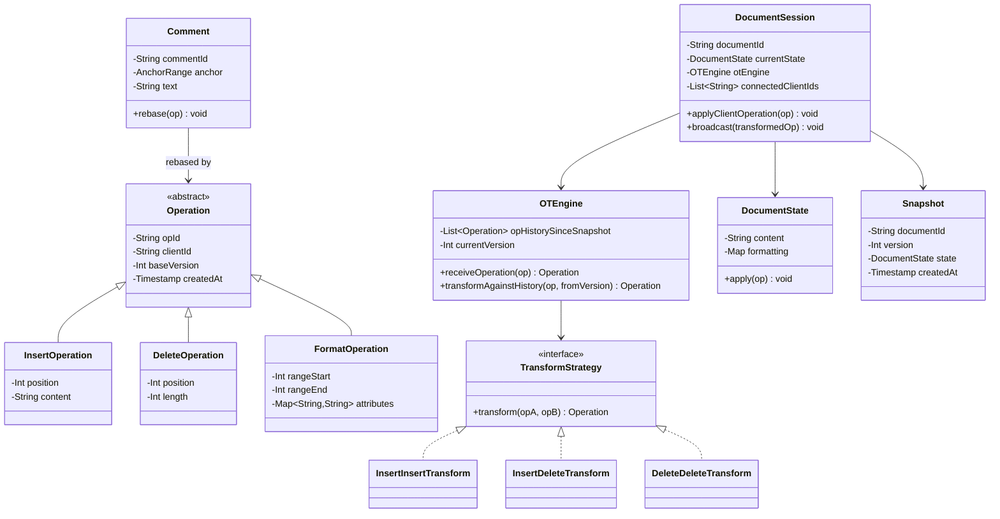
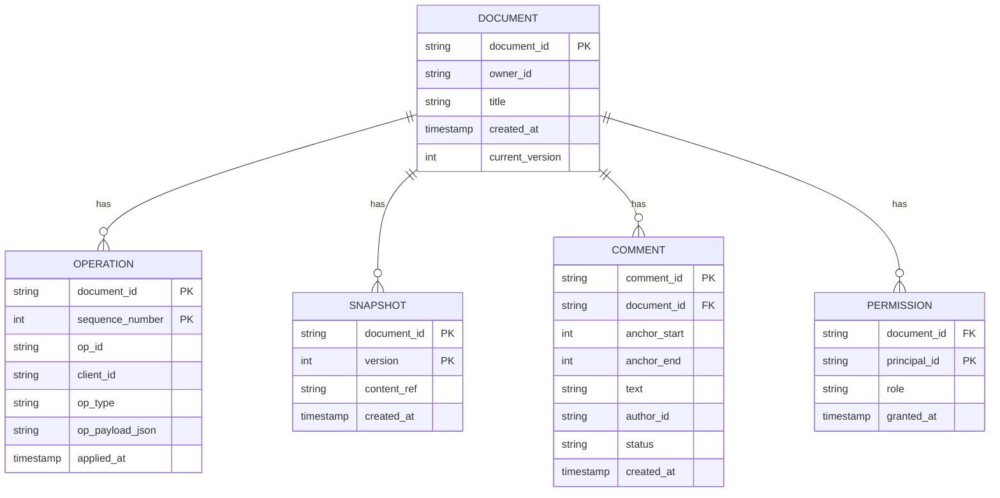
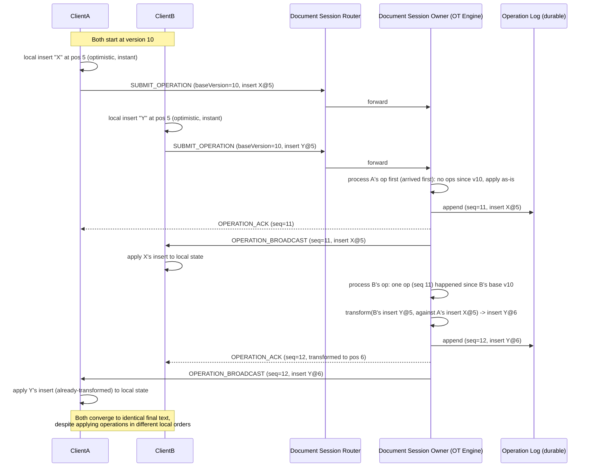

# Collaborative Text Editor (Google-Docs-style) — HLD & LLD

**Assumed metrics** (call out if different): ~500M users · ~1B documents · ~5M concurrent active editing sessions at peak, ~2-3 live collaborators per actively-edited doc · local edits reflected instantly (optimistic UI), remote propagation p95 < 100ms · consistency model: **strong eventual consistency** — every replica converges to the identical document, not just "eventually similar" · multi-region, AWS-primary.

**Scope, explicitly enumerated**: real-time concurrent text editing with automatic conflict resolution (no "merge conflict" ever shown to a user) · live cursor/selection presence for collaborators · commenting anchored to content · offline editing with resync on reconnect · version history and restore · access control (owner/editor/commenter/viewer, link-sharing) · rich content (formatting, images, tables — not just plain text) · document search/indexing.

**The one problem this whole design exists to solve**: if two people are typing in the same paragraph at the same instant, both edits must apply, neither must be silently lost, and both users' screens must end up showing the *exact same final text* — without either person seeing a "conflict" dialog. This is what makes this design structurally different from the chat app (messages don't need to be transformed against each other, just ordered and delivered) even though both use a persistent connection and route to "the node that owns this session."

---

# Phase 2: High-Level Design (HLD)

## 1. Scope & System Estimation

**Functional Requirements**
- Multiple users edit the same document concurrently; all local edits are applied optimistically (zero perceived latency) and reconciled with remote edits automatically
- Every collaborator sees every other collaborator's changes converge to one identical document state, regardless of the order operations arrived in at each client
- Live presence: who's viewing/editing, where their cursor/selection is
- Comments anchored to a specific range of content, surviving edits that shift that content around
- Offline editing: a client can keep working with no connection and resync cleanly on reconnect
- Version history: view/restore any prior point in the document's history
- Access control: owner/editor/commenter/viewer roles, plus shareable links with configurable permission
- Rich content: formatting (bold/italic/etc.), embedded images, tables — not just a flat character stream
- Search over document content

**Non-Functional Requirements**
- **Consistency: strong eventual consistency for document content is the core requirement** — distinct from every prior design in this conversation. It's stronger than the chat app's "eventually delivered, strictly ordered per-conversation" and stronger than the LB/gateway's "eventually propagated config," because it's not enough for operations to just arrive — they must be *mathematically transformed* against each other so every possible arrival order produces the same final document.
- Availability: 99.9%+ for active editing sessions; a brief hiccup should degrade to "your edits are buffered locally," never to "your edit is lost"
- Latency: local edits are never blocked waiting on the network (optimistic local application is mandatory, not an optimization) — remote propagation latency affects collaboration smoothness but never local typing responsiveness
- Durability: once an edit is acknowledged by the server, it must survive any single node failure
- Compliance: standard access-control enforcement, encryption at rest/in transit; enterprise tiers commonly require audit logs of who-viewed/edited-when

**Back-of-the-Envelope Estimation**
- 5M concurrent sessions, ~10M concurrent WebSocket connections (avg ~2 collaborators per active session) — same order of magnitude connection-management problem as the chat app, reusing that design's Connection Gateway pattern.
- Raw keystroke rate would be enormous if every keypress were its own network operation; client-side **operation batching** (coalescing rapid keystrokes into one operation every ~100-300ms of typing, standard practice in real editors) is what keeps the server-facing rate manageable — assuming ~15% of concurrent sessions are actively typing at any given instant and each produces ~3-5 batched ops/sec while typing, that's roughly **5M × 0.15 × 4 ≈ 3M ops/sec at absolute peak fan-in**, though realistic sustained load is well below this ceiling; the batching factor is the single biggest lever on this number.
- Per-document ops history: a heavily-edited document over its lifetime can accumulate tens of thousands of operations — this is why periodic **snapshotting** (materializing the current state and truncating replay-from-start cost) is necessary, not optional, for both performance and version-history storage cost.
- Document count vs. active concurrency: 1B documents but only ~5M concurrently active — the overwhelming majority of documents are cold/idle at any moment, which is the estimation fact that justifies *not* keeping every document's edit session resident anywhere; sessions are created on open and torn down on idle, not pre-provisioned per document.

## 2. System Architecture & Components

**Architecture Style**: Microservices with a **per-document authoritative sequencer** at the core — this is the load-bearing architectural choice, and it's worth being explicit about why. Real-time OT (Operational Transformation) requires *some* entity to establish a single, agreed-upon order of operations for a given document so every client's transform math has a consistent reference point; a fully leaderless/peer-to-peer model (pure CRDTs with no server arbitration) is a legitimate alternative architecture, but the classic and still-dominant "Google Docs" approach — and the one this design follows — is client-server OT with the server as the ordering authority (the "Jupiter" model). Justification: it keeps the conflict-resolution logic centralized and testable in one place per document, and it composes cleanly with the access-control, persistence, and presence concerns that also naturally live server-side.

**Component Breakdown**
- **Connection Gateway**: same architectural role as the chat app's — holds persistent WebSocket connections, forwards client operations to the correct Document Session Owner
- **Document Session Router**: maps `documentId → ownerNodeId`, analogous to the chat app's Session Registry but keyed by document, not user — routes every client editing the same document to the single node currently serving as its OT sequencer (reuses the consistent-hashing-based ownership-routing pattern from the Load Balancer design, applied here to "which node owns this document's live session" rather than "which node owns this user's socket")
- **Document Session Owner (OT Engine)**: for each currently-open document, exactly one node holds the authoritative in-memory operational-transform state (current op sequence number, recent-ops buffer needed for transforming late-arriving concurrent ops) — this is the component actually solving the concurrency problem, detailed in §4 and the LLD
- **Document Store**: durable persistence of document snapshots + the append-only operation log (source of truth once the in-memory session ends or crashes)
- **Presence Service**: cursor positions, active-viewer list — same AP-leaning, ephemeral, TTL-based pattern as the chat app's presence
- **Access Control Service**: roles, link-sharing tokens, permission checks on every operation and every session join
- **Comment Service**: comments anchored to a position/range that must be re-anchored as the document is edited (detailed in §3)
- **Version History Service**: reconstructs and exposes any historical snapshot from the op log; powers "restore this version"
- **Offline Sync Service**: reconciles a client's locally-buffered operations (created while disconnected) against the server's operation history since the client's last-known version, on reconnect
- **Search/Indexing Pipeline**: batch/streaming pipeline (same shape as the loyalty and chat analytics pipelines) that indexes document content for search, decoupled from the live-editing hot path
- **Rich-Content/Media Service**: image/embed uploads reuse the chunked, resumable upload design already established, referenced from the document by ID rather than inlined as binary in the op stream

**Data Flow Walkthrough**

*Write path (a user types):*
1. User types; the client applies the edit **immediately and locally** (optimistic UI — the user never waits on the network to see their own keystroke).
2. Client batches rapid keystrokes into a discrete operation (e.g., "insert 'hello' at position 42") tagged with the client's current known document version (the version it was editing against) and a client-generated operation ID.
3. Operation is sent over the WebSocket to the Connection Gateway, which forwards it (via the Document Session Router) to that document's Session Owner node.
4. Session Owner checks: has any operation been committed since the client's stated base version? If yes, it **transforms** the incoming operation against every intervening operation (the core OT algorithm — detailed in the LLD) so it applies correctly against the *current* document state, not the stale state the client thought it had.
5. Session Owner applies the transformed operation to its authoritative in-memory document state, assigns it the next sequence number, appends it to the durable operation log, and broadcasts the transformed operation to every other connected client of that document.
6. Every other client applies the received (already-transformed) operation to its own local copy — because the transform math is well-defined and deterministic, every client converges to the identical resulting document, regardless of the order their own local edits happened to be made in relative to others'.
7. Periodically (op-count or time-based threshold), the Session Owner materializes a new snapshot and the op log since the last snapshot can be pruned/archived — bounds replay cost for new joiners and crash recovery.

*Read path (a user opens a document / a new collaborator joins):*
1. Client requests to open a document → Access Control check → if permitted, the Document Session Router either finds the existing Session Owner (if already open by someone else) or spins one up, which loads the latest snapshot + replays any ops since it to reconstruct current state.
2. Client receives the current document state plus the current version number and subscribes to the live operation broadcast stream — it is now a live collaborator, and any operation it sends is tagged against this version going forward.

## 3. Storage & Data Strategy

**Database Selection**
- **Operation log**: an append-only, ordered store, partitioned by `documentId` — the exact same "partition-by-conversation for ordering" pattern used in the chat app's message store, applied here to editing operations; the append-only, ordered nature is what makes both replay-to-reconstruct-state and version history possible.
- **Snapshots**: object storage (S3) or a document store, keyed by `(documentId, snapshotVersion)` — snapshots are the periodic "fast-forward" points so a new client or a crash-recovering session owner doesn't have to replay a document's entire multi-year operation history from scratch.
- **Document Session Router / ownership table**: fast KV store (Redis/DynamoDB), same role as the chat app's Session Registry.
- **Access control / permissions**: strongly consistent store (a permission change — e.g., revoking someone's edit access — should take effect promptly, not eventually) — this is one of the few genuinely CP-leaning pieces of this design, alongside the OT sequencing itself.
- **Comments**: a document store keyed by `documentId`, each comment carrying an anchor reference (see below) rather than a raw character offset.
- **Search index**: a dedicated search engine (OpenSearch/Elasticsearch), fed asynchronously — never queried on the live-editing path.

**Data Lifecycle**
- **Snapshot + log truncation**: once a snapshot at version N is durably written, operations before N can be archived to cold storage (still retrievable for full version history, just not needed for the hot "reconstruct current state" path) — mirrors the hot/warm/cold tiering pattern used in every other design in this conversation, applied here to editing history instead of events or messages.
- **Comment anchor re-basing**: a comment anchored to "characters 40-55" must move correctly if someone inserts text before position 40 — comments are anchored using the **same transform function** the OT engine already applies to operations (an insert/delete operation transforms a comment's anchor range exactly as it would transform a concurrent edit's position), so comment tracking isn't a separate ad hoc mechanism, it's a direct reuse of the core OT machinery.
- **Session teardown**: when the last collaborator closes a document, the Session Owner flushes final state to a snapshot and releases the in-memory session — the Document Session Router's ownership entry is cleared, so the next open (by anyone) triggers a fresh session on whichever node picks it up next, keeping "hot" resource usage proportional to actually-open documents (the 5M active vs. 1B total distinction from §1).
- **Offline op reconciliation**: a reconnecting client's buffered local operations are transformed against everything that happened on the server since the client's last-known version — this is precisely the same transform operation used for live concurrent edits, just applied to a batch of catch-up operations instead of one at a time; offline support falls out of the OT model rather than needing a separate mechanism.

## 4. Cross-Cutting Concerns & Trade-offs

**CAP Theorem & Trade-offs**
- **The per-document operation sequence is CP** — there must be exactly one agreed-upon order of operations for a document, established by its single Session Owner; this is a deliberate echo of the chat app's "ordering is per-conversation, enforced by a single partition owner," but stricter, because chat only needs *ordering*, while collaborative editing needs ordering *plus* mathematically correct transformation, and getting either wrong produces a diverged, silently-incorrect document.
- **Presence/cursor position: AP** — exactly the same trade-off as the chat app's presence; a cursor shown one frame late is invisible to the user, never worth adding latency to actual content edits.
- **Access control changes: CP-leaning** — a revoked permission should apply promptly; implemented with a short-TTL cache at the Session Owner (checked on each operation, not just at session join) so revocation propagates within seconds rather than only at next reconnect.
- **What happens if the Session Owner node fails mid-session**: because every committed operation is durably logged before being broadcast (same "persist before delivering" discipline as the chat app's message router and the banking ledger's "commit before acknowledging"), a crashed Session Owner's document state is fully reconstructable from the last snapshot + logged ops — a new node picks up ownership, replays, and clients reconnect and resync from their last-known version exactly as they would after their own disconnect. No operation that was ever acknowledged to a client is lost.

**Resiliency & Security**
- **Optimistic local application is the resiliency mechanism for the client side**: a client never blocks typing on network round-trips, and a temporary disconnect degrades gracefully into "offline editing," reconciled via the same transform-and-catch-up mechanism used for live concurrency — there's deliberately no separate "offline mode" code path, just the general case of "operations arrived out of order relative to the server's view," which OT already has to handle.
- **Idempotency**: every operation carries a client-generated operation ID; a retried send (e.g., after an ack timeout) is deduped by the Session Owner — same pattern used for message sends in chat and transactions in banking, applied here to edit operations.
- **Access control enforcement per-operation, not just per-session**: a viewer-only collaborator's client should be structurally incapable of sending an accepted edit operation — enforced server-side at the Session Owner regardless of what the client UI does or doesn't allow, since client-side restrictions alone are never a security boundary.
- **Malicious/malformed operations**: the Session Owner validates that an incoming operation is well-formed against the document's actual current structure (e.g., an insert-at-position operation referencing a position beyond the document's length is rejected, not applied) — protects document integrity from a buggy or compromised client.
- **Encryption**: TLS in transit; encryption at rest for documents and the operation log; enterprise-tier customers commonly require per-organization encryption keys, which shapes the Document Store's key-management design (per-tenant CMKs) rather than one global key.

---

# Phase 3: Low-Level Design (LLD)

## 1. Class & Object-Oriented Design

**Design Patterns**
- **Command pattern**: every edit is represented as an `Operation` object (Insert, Delete, Format) — this is what makes operations transformable, loggable, and replayable as first-class values rather than direct mutations.
- **Strategy**: pluggable `TransformStrategy` per operation-type pair (Insert-vs-Insert, Insert-vs-Delete, Delete-vs-Delete, etc.) — the actual OT mathematics, isolated so each pairwise case can be implemented and tested independently.
- **Memento**: `Snapshot` captures document state at a point in time for fast reconstruction and version-history restore, without the `Document` class needing to know about persistence.
- **Mediator**: the Document Session Owner mediates between all connected clients of one document — no client ever transforms against another client directly, exactly mirroring the chat app's Message Router mediator role.



## 2. Database Schema Design



**Table Definitions**

`OPERATION` (partitioned by `document_id`, clustered by `sequence_number` — same partitioning rationale as the chat app's `MESSAGE` table)

| Field | Type | Constraints | Description |
|---|---|---|---|
| document_id | String | Partition key | — |
| sequence_number | Int | Clustering key, monotonic per document | Establishes the single authoritative order this document's OT math is defined against |
| op_id | String | Unique per document | Client-generated, used for idempotent dedup on retry |
| client_id | String | Not Null | Attribution for presence/audit |
| op_type | String | Not Null | INSERT / DELETE / FORMAT |
| op_payload_json | String | Not Null | Type-specific fields (position, content, range, attributes) |
| applied_at | Timestamp | Not Null | — |

`SNAPSHOT`

| Field | Type | Constraints | Description |
|---|---|---|---|
| document_id | String | PK (composite) | — |
| version | Int | PK (composite) | Corresponds to a `sequence_number` — "state as of this many ops applied" |
| content_ref | String | Not Null | Pointer to the materialized document content (object storage) |
| created_at | Timestamp | Not Null | — |

`COMMENT`

| Field | Type | Constraints | Description |
|---|---|---|---|
| comment_id | String | PK | — |
| document_id | String | FK → DOCUMENT | — |
| anchor_start | Int | Not Null | Re-based on every relevant operation (see §3) |
| anchor_end | Int | Not Null | — |
| text | String | Not Null | — |
| author_id | String | Not Null | — |
| status | String | Not Null | OPEN / RESOLVED |
| created_at | Timestamp | Not Null | — |

`PERMISSION`

| Field | Type | Constraints | Description |
|---|---|---|---|
| document_id | String | FK → DOCUMENT | — |
| principal_id | String | PK (composite) | User ID or a link-share token ID |
| role | String | Not Null | OWNER / EDITOR / COMMENTER / VIEWER |
| granted_at | Timestamp | Not Null | — |

## 3. API & Interface Specifications

**WebSocket protocol** (the live-editing channel):

```yaml
# Client -> Server
SUBMIT_OPERATION:
  documentId: string
  opId: string              # idempotency key
  baseVersion: int          # the version this op was created against, client's-side
  opType: "INSERT" | "DELETE" | "FORMAT"
  payload: object            # position/content, or range/attributes, per opType

CURSOR_UPDATE:
  documentId: string
  position: int
  selectionEnd: int?

JOIN_DOCUMENT:
  documentId: string

# Server -> Client
OPERATION_BROADCAST:
  documentId: string
  sequenceNumber: int
  opId: string
  clientId: string
  opType: string
  payload: object
  # Note: this is the TRANSFORMED operation, safe to apply directly
  # against the receiving client's current local state, per the invariant
  # the OT engine guarantees.

OPERATION_ACK:
  opId: string
  sequenceNumber: int
  # Confirms durability + gives the sender the authoritative sequence
  # number their (possibly-transformed) op was assigned.

DOCUMENT_STATE:
  documentId: string
  version: int
  content: object
  # Sent on JOIN_DOCUMENT — the full current state to bootstrap a new client.

PRESENCE_UPDATE:
  documentId: string
  clientId: string
  cursorPosition: int?
  status: "ACTIVE" | "IDLE" | "LEFT"
```

**REST APIs** (non-real-time operations):

```yaml
openapi: 3.0.0
info:
  title: Document Service REST API
  version: "1.0"
paths:
  /documents/{documentId}/versions:
    get:
      summary: List available historical versions
      responses:
        "200":
          content:
            application/json:
              schema:
                type: object
                properties:
                  versions:
                    type: array
                    items:
                      type: object
                      properties:
                        version: { type: integer }
                        createdAt: { type: string, format: date-time }
                        author: { type: string }

  /documents/{documentId}/versions/{version}/restore:
    post:
      summary: Restore the document to a prior version (creates a new forward-moving operation, never rewrites history)
      responses:
        "200": { description: Restored — appended as a new operation on top of current history }

  /documents/{documentId}/permissions:
    put:
      summary: Grant or update a principal's role on this document
      requestBody:
        content:
          application/json:
            schema:
              type: object
              required: [principalId, role]
              properties:
                principalId: { type: string }
                role: { type: string, enum: [EDITOR, COMMENTER, VIEWER] }
      responses:
        "200": { description: Permission updated }

  /documents/{documentId}/comments:
    post:
      summary: Add a comment anchored to a content range
      requestBody:
        content:
          application/json:
            schema:
              type: object
              required: [anchorStart, anchorEnd, text]
              properties:
                anchorStart: { type: integer }
                anchorEnd: { type: integer }
                text: { type: string }
      responses:
        "201": { description: Comment created }
```

**Idempotency**
- Every `SUBMIT_OPERATION` carries a client-generated `opId`; the Document Session Owner dedupes on this before applying — a retried send after a missed `OPERATION_ACK` doesn't double-apply the edit. Same pattern as chat's `clientMessageId` and banking's `idempotencyKey`, applied to editing operations.
- Offline-reconciliation batches (a whole set of locally-buffered operations sent on reconnect) are processed through the exact same dedup-and-transform path, one at a time, in the client's original local order — no special-cased "bulk resync" logic needed.
- `restore` is explicitly **not** a destructive operation — it's idempotent in the sense that calling it twice with the same target version produces the same resulting content, but it always does so by appending a new operation, never rewinding the log.

## 4. Concrete Code Snippets & Sequence Flows



**Core Logic: Operational Transformation for Concurrent Insert/Delete** (the mathematical heart of the whole system — this is the function that guarantees convergence)

```python
# ot_engine.py
from dataclasses import dataclass, replace
from typing import Union
import logging

logger = logging.getLogger("docs.ot")


@dataclass(frozen=True)
class InsertOp:
    op_id: str
    client_id: str
    base_version: int
    position: int
    content: str


@dataclass(frozen=True)
class DeleteOp:
    op_id: str
    client_id: str
    base_version: int
    position: int
    length: int


Operation = Union[InsertOp, DeleteOp]


class DuplicateOperationError(Exception):
    """Signals idempotent replay — caller should return the existing ack."""


def transform_insert_insert(
    op_to_transform: InsertOp, against: InsertOp, tie_break_priority: bool
) -> InsertOp:
    """
    Transforms `op_to_transform` so it applies correctly on a document
    that already has `against` applied.
    tie_break_priority: when both ops insert at the exact same position,
    a deterministic rule (e.g., lower client_id wins) decides ordering so
    all replicas resolve the tie identically.
    """
    if op_to_transform.position < against.position:
        return op_to_transform  # unaffected, `against` inserted later in the doc
    if op_to_transform.position > against.position:
        # `against`'s insert shifts everything after it forward
        return replace(
            op_to_transform, position=op_to_transform.position + len(against.content)
        )
    # Exact same position: deterministic tie-break, not "first writer wins"
    # by arrival order, which would NOT converge across replicas.
    if tie_break_priority:
        return op_to_transform  # this op wins the tie, stays at same position
    return replace(
        op_to_transform, position=op_to_transform.position + len(against.content)
    )


def transform_insert_against_delete(
    op_to_transform: InsertOp, against: DeleteOp
) -> InsertOp:
    delete_end = against.position + against.length
    if op_to_transform.position <= against.position:
        return op_to_transform  # insert point is before the deleted range
    if op_to_transform.position >= delete_end:
        # Insert point is after the deleted range: shift back by what was removed
        return replace(op_to_transform, position=op_to_transform.position - against.length)
    # Insert point was *inside* the deleted range: collapse to the deletion's
    # start point (the content it would have been inserted relative to no
    # longer exists).
    return replace(op_to_transform, position=against.position)


def transform_delete_against_delete(
    op_to_transform: DeleteOp, against: DeleteOp
) -> DeleteOp:
    """Handles the trickiest case: overlapping deletes. Returns a delete
    operation whose range no longer double-removes content already
    removed by `against`."""
    self_end = op_to_transform.position + op_to_transform.length
    against_end = against.position + against.length

    if self_end <= against.position:
        return op_to_transform  # entirely before, unaffected
    if op_to_transform.position >= against_end:
        # entirely after: shift back by the length already removed
        return replace(op_to_transform, position=op_to_transform.position - against.length)

    # Overlapping ranges: shrink to only the portion not already deleted.
    new_start = max(op_to_transform.position, against.position)
    overlap_start = max(op_to_transform.position, against.position)
    overlap_end = min(self_end, against_end)
    already_removed = max(0, overlap_end - overlap_start)
    remaining_length = op_to_transform.length - already_removed

    adjusted_position = (
        against.position
        if op_to_transform.position >= against.position
        else op_to_transform.position
    )
    return replace(
        op_to_transform,
        position=adjusted_position,
        length=max(0, remaining_length),
    )


class OTEngine:
    """
    Owns the authoritative operation history for one document since its
    last snapshot. Every incoming client operation is transformed against
    every operation that was committed after the client's stated
    base_version, then applied and appended, in a single serialized
    (single-threaded per document) step — this serialization is exactly
    what the Document Session Owner's per-document exclusivity provides.
    """

    def __init__(self, starting_version: int):
        self._current_version = starting_version
        self._history: list[Operation] = []  # ops since the last snapshot
        self._seen_op_ids: set[str] = set()

    def receive_operation(self, op: Operation) -> tuple[Operation, int]:
        if op.op_id in self._seen_op_ids:
            raise DuplicateOperationError(op.op_id)

        transformed = op
        ops_since_base = self._history[
            max(0, op.base_version - self._starting_offset()):
        ]

        for concurrent_op in ops_since_base:
            transformed = self._transform_pair(transformed, concurrent_op)

        self._current_version += 1
        self._history.append(transformed)
        self._seen_op_ids.add(op.op_id)

        logger.info(
            "operation_committed",
            extra={
                "op_id": op.op_id,
                "client_id": op.client_id,
                "sequence_number": self._current_version,
                "transformed": transformed != op,
            },
        )
        return transformed, self._current_version

    def _starting_offset(self) -> int:
        return self._current_version - len(self._history)

    def _transform_pair(self, op: Operation, against: Operation) -> Operation:
        # Deterministic tie-break: lower client_id wins simultaneous
        # same-position inserts, ensuring every replica resolves identically.
        if isinstance(op, InsertOp) and isinstance(against, InsertOp):
            return transform_insert_insert(
                op, against, tie_break_priority=op.client_id < against.client_id
            )
        if isinstance(op, InsertOp) and isinstance(against, DeleteOp):
            return transform_insert_against_delete(op, against)
        if isinstance(op, DeleteOp) and isinstance(against, DeleteOp):
            return transform_delete_against_delete(op, against)
        # DeleteOp transformed against InsertOp, and FormatOp cases follow
        # the same structure, omitted here for brevity.
        return op


# --- unit test placeholders ---
def test_concurrent_inserts_at_different_positions_both_apply_unmodified():
    # arrange: insert "A" at 0, concurrently insert "B" at 10 (no overlap)
    # act: transform each against the other
    # assert: neither position changes
    pass


def test_concurrent_inserts_at_same_position_resolve_deterministically():
    # arrange: two inserts at position 5 from different client_ids
    # act: transform both directions (A against B, and B against A)
    # assert: exactly one of them ends up "shifted" and the tie-break is
    #         consistent regardless of which replica computes it
    pass


def test_insert_inside_deleted_range_collapses_to_deletion_start():
    # arrange: delete range [10,20), concurrent insert at position 15
    # act: transform_insert_against_delete
    # assert: resulting insert position == 10
    pass


def test_overlapping_deletes_do_not_double_remove_content():
    # arrange: delete [5,15) already applied; concurrent delete [10,20)
    # act: transform_delete_against_delete
    # assert: resulting delete only covers [15,20) — the non-overlapping tail
    pass


def test_engine_rejects_duplicate_op_id():
    # arrange: an operation already committed
    # act: receive_operation with the same op_id again
    # assert: raises DuplicateOperationError; history unchanged
    pass


def test_operations_committed_out_of_local_order_still_converge():
    # arrange: simulate engine receiving B's op before A's op (reverse of
    #          when they were created client-side)
    # act: apply both, then apply the mirrored sequence on a second engine
    #      instance with A first
    # assert: both engines' final reconstructed document content is identical
    pass
```

---

### Key design decisions worth flagging back to you
1. **This is the first design in the conversation where "eventual consistency" isn't enough — it has to be *strong* eventual consistency**, meaning every possible arrival order of concurrent operations must transform to the identical final document. That's a materially harder guarantee than "eventually delivered" (chat) or "eventually propagated" (LB/gateway config), and it's why a dedicated transform algorithm, not just an ordered log, is the core of this design.
2. **Optimistic local application isn't a performance optimization here — it's structurally how offline editing works too.** There's no separate "offline mode": a disconnected client is just a client whose operations will be transformed against a longer history than usual once it reconnects, using the exact same code path as live concurrent editing.
3. **Comments are anchored using the same transform math as content edits**, not a separate position-tracking mechanism — this is what keeps a comment glued to "the sentence I highlighted" even as unrelated edits happen elsewhere in the document, without a second, parallel system that could drift out of sync with the first.

Let me know if you want to go deeper on any piece — e.g., extending this to a full CRDT-based (Yjs/Automerge-style) alternative architecture and the trade-offs versus this OT approach, rich-content/table operational transforms specifically, or the exact snapshot-cadence and replay-cost tuning for very long-lived, heavily-edited documents.
