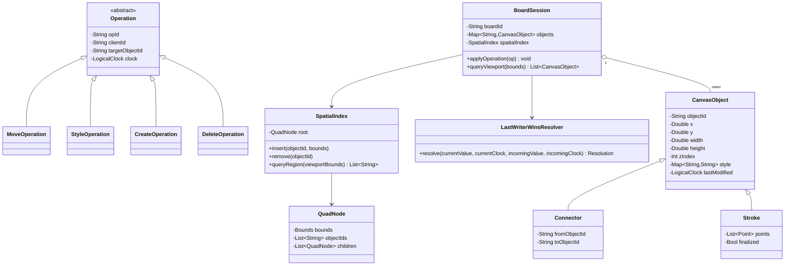
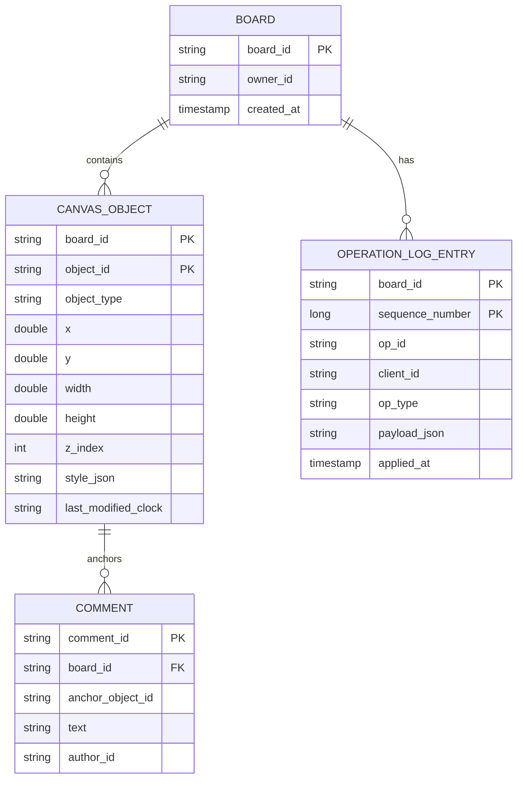
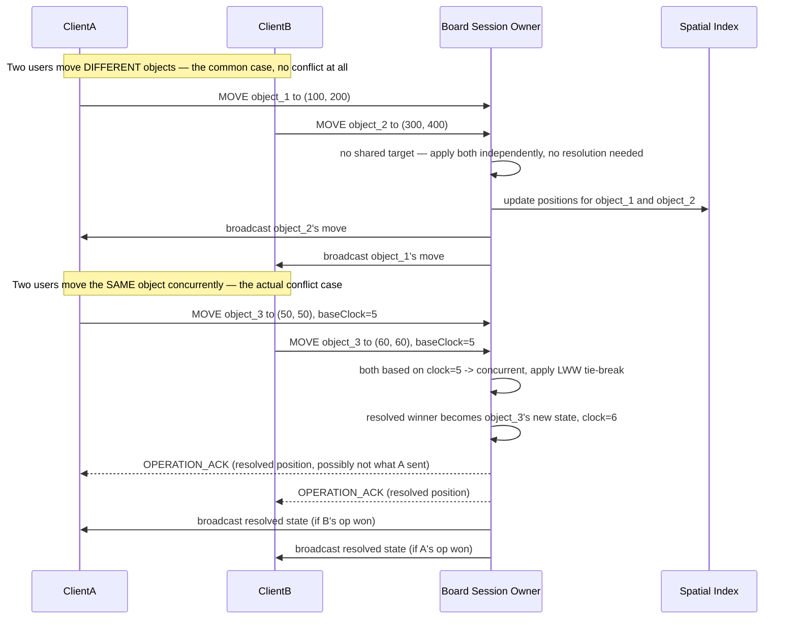

# Collaborative Whiteboard (Miro-style) — HLD & LLD

**Assumed metrics** (call out if different): millions of boards, most small/solo, but large brainstorm/planning boards can hold tens of thousands to low hundreds of thousands of objects · ~2M concurrent active editing sessions at peak platform-wide, typically 2-20 live collaborators per actively-edited board (rarely more) · local edits reflected instantly (optimistic), remote propagation p95 < 100ms · infinite/very large canvas per board, but any one client only ever needs to see what's in their current viewport · multi-region, AWS-primary.

**Scope, explicitly enumerated**: an effectively infinite 2D canvas per board · objects on it — shapes, sticky notes, freehand-drawn strokes, text boxes, images, connector lines between objects — each independently positioned, sized, styled, and z-ordered · real-time multi-user editing with live cursors and selection presence · pan/zoom with efficient rendering of only what's currently visible · undo/redo · comments anchored to objects or canvas regions · access control/sharing · export.

**The key structural difference from the Google Docs design earlier in this conversation, stated up front because it shapes everything below**: a text document is fundamentally a single ordered sequence, so *any* two concurrent edits potentially interact (an insert at position 5 changes what "position 12" even refers to for everyone else), which is exactly why Operational Transformation exists. A whiteboard's objects are, in the overwhelming majority of cases, **spatially and referentially independent** — moving one sticky note has zero effect on any other object's position or identity. This means the conflict-resolution problem here is dramatically narrower in scope (it only has to handle "two people touched the *same* object at the same instant," not "every operation potentially interacts with every other"), while a genuinely new problem — efficiently indexing and syncing a huge, sparse 2D space so a client only ever deals with what's in its viewport — takes center stage instead. This design reuses the doc editor's per-session-ownership routing and live-presence patterns, and reuses the ETA design's geospatial-indexing philosophy (there for real-world coordinates, here for canvas coordinates).

---

# Phase 2: High-Level Design (HLD)

## 1. Scope & System Estimation

**Functional Requirements**
- Create, move, resize, rotate, restyle, and delete objects (shapes, sticky notes, text, images, freehand strokes, connectors) on a shared canvas in real time
- Multiple users see each other's changes converge to the identical board state, with live cursor and selection presence
- Efficiently render and sync only the portion of a very large board that's currently within a user's viewport, panning/zooming smoothly
- Support connectors that reference two other objects and must visually track them if either endpoint moves
- Undo/redo, scoped sensibly per-user even in a multi-collaborator session
- Comments anchored to a specific object or canvas region
- Access control (owner/editor/commenter/viewer) and link-based sharing, mirroring the doc editor's permission model
- Export the board (or a region of it) to an image/PDF

**Non-Functional Requirements**
- **Consistency: strong eventual consistency is still required, exactly as in the doc editor** — every collaborator's canvas must converge to the identical final state regardless of the order operations were locally applied in. What's different is the *scope* of what has to be reconciled: the doc editor's transform function had to reason about arbitrary insert/delete interactions across a whole ordered sequence; here, reconciliation is almost entirely scoped to "did two operations touch the exact same object's exact same property," which is a much smaller, simpler surface.
- Latency: local edits apply optimistically and instantly (identical principle to the doc editor); remote propagation and viewport-sync latency should feel live, not necessarily sub-frame-perfect.
- Scalability: a single very large board (hundreds of thousands of objects) must remain smooth to navigate even though no single client ever needs more than a small visible slice of it at once — this "huge total, small visible working set" shape is structurally similar to the chat app's "1B total documents, 5M concurrently active" distinction and the loyalty platform's storage-tiering logic, just applied spatially instead of temporally.
- Availability: a brief network hiccup should degrade to "your edits are buffered locally, resynced on reconnect," identical philosophy to the doc editor's offline-editing story.

**Back-of-the-Envelope Estimation**
- A board with, say, 100,000 objects, each carrying position/size/style/z-index metadata (maybe a few hundred bytes each), is on the order of tens of MB of total board state — small enough to fully persist and version easily, but **too much to usefully send to every client on every connection or every viewport change**, which is exactly why viewport-scoped spatial querying (not "sync everything") is the load-bearing architectural decision here, detailed in §2.
- Object independence in practice: because most concurrent operations touch different objects entirely, the *actual* conflict-resolution workload (two operations touching the same object's same property in the same instant) is a small fraction of total edit volume even during a busy collaborative session — this is the concrete justification for using a much lighter-weight conflict-resolution mechanism (a simple per-property last-writer-wins register, detailed in the LLD) than the doc editor's full transform-function machinery, rather than porting that heavier mechanism over unnecessarily.
- Freehand drawing is the one object type that behaves a bit like the doc editor's problem at a micro-scale: a single stroke is an ordered sequence of points, appended rapidly as the user draws — but critically, this sequence is **owned by exactly one user for the duration of that one stroke** (nobody else is concurrently appending points to *your* in-progress pen stroke), so even here, the harder "concurrent edits to one ordered sequence" problem the doc editor solved doesn't actually arise in practice; a finished stroke becomes an ordinary immutable (or move/delete-able, but not mid-sequence-editable) object once the user lifts the pen.
- Viewport working-set size: a typical viewport at a typical zoom level might contain a few hundred to low thousands of objects even on a huge board — this bounded number, not the board's total object count, is what actually determines per-client sync cost and rendering cost, which is the whole point of spatial indexing.

## 2. System Architecture & Components

**Architecture Style**: Microservices, reusing the doc editor's **per-board session-ownership model** (one authoritative node coordinates a given board's live edit session, exactly like the doc editor's per-document Session Owner) combined with a **spatial-indexing layer** that's genuinely new to this conversation in its specific 2D-canvas form, though philosophically continuous with the ETA design's real-world geospatial indexing. Justification: a single ordering authority per board is still valuable (it gives a consistent reference point for conflict resolution and a natural place to maintain the board's authoritative object set), but because most operations don't actually conflict, that authority's job is lighter-weight than the doc editor's OT engine — it's closer to "the source of truth for object state plus the spatial index over it" than "the arbiter of a complex transform function."

**Component Breakdown**
- **Connection Gateway**: same role as the chat app's and doc editor's — holds persistent WebSocket connections per client
- **Board Session Router**: maps `boardId → ownerNodeId`, identical structural role to the doc editor's Document Session Router
- **Board Session Owner**: holds the authoritative in-memory object set for one currently-open board, applies incoming operations (with the lightweight per-object conflict resolution detailed in the LLD), and maintains the **spatial index** (a quadtree, detailed below) over that object set
- **Spatial Index (Quadtree)**: the mechanism that answers "which objects intersect this rectangular viewport" efficiently, without scanning every object on the board — this is the direct 2D-canvas analog of the ETA design's H3/S2-cell geospatial index, just indexing canvas coordinates instead of latitude/longitude
- **Viewport Sync Service**: on a client's pan/zoom, queries the Spatial Index for the newly-visible region and sends only the objects the client doesn't already have (or that changed since it last saw them) — the mechanism that keeps per-client sync cost bounded by viewport size, not board size
- **Object Store**: durable persistence of the board's object set and its operation history (append-only, same shape as the doc editor's operation log), enabling version history, crash recovery, and offline resync
- **Presence Service**: live cursor positions and current selection per collaborator — same AP-leaning, ephemeral pattern as the chat app's and doc editor's presence
- **Access Control Service**: same role and model as the doc editor's — roles, link-sharing tokens, checked per-operation
- **Comment Service**: comments anchored to an object ID (which travels with the object regardless of where it moves) or to a fixed canvas-coordinate region — notably simpler than the doc editor's comment-anchor-rebasing problem, since an object-anchored comment just needs to track an object's ID, not a text-position offset that shifts as surrounding content is edited
- **Export Service**: renders a board (or region) to a static image/PDF, an offline/batch operation entirely decoupled from the live-editing hot path
- **Undo/Redo Manager**: maintains each user's own local undo stack referencing the shared operation history — detailed in the LLD, since "whose undo affects what" in a multi-user session is a genuinely subtle design point

**Data Flow Walkthrough**

*Write path (moving/creating/editing an object):*
1. User drags a shape; the client applies the move **immediately and locally** (optimistic, identical principle to the doc editor).
2. Client sends the operation (e.g., "set object X's position to (px, py)") to its Board Session Owner via the Connection Gateway.
3. Session Owner checks whether any *other* operation has touched this same object's same property more recently than the client's known base state for it — if so, applies the per-property last-writer-wins resolution (detailed in the LLD); if not (the common case, since most operations touch different objects entirely), applies the operation directly with no conflict-resolution overhead at all.
4. Session Owner updates its authoritative object set and the Spatial Index (the object's new position may move it into a different quadtree region), appends the operation to the durable log, and broadcasts the (possibly-resolved) operation to every other connected client of that board.
5. Every other client applies the received operation to its local copy — because resolution is well-defined and deterministic, every client converges to the identical final object set.

*Read path (panning/zooming, or a new collaborator joining):*
1. On viewport change, client requests the objects intersecting its new visible region → Viewport Sync Service queries the Spatial Index and returns just those objects (or, more precisely, just the ones the client doesn't already have cached locally).
2. A new collaborator joining an open board receives an initial viewport-scoped object set (not the whole board), then subscribes to the live operation broadcast stream for updates, panning further as needed to pull in more of the board on demand.

## 3. Storage & Data Strategy

**Database Selection**
- **Object Store**: a document/wide-column store keyed by `boardId`, holding each object's current properties plus an append-only operation log — same architectural shape as the doc editor's operation-log-plus-snapshot design, just storing object mutations instead of text-insert/delete operations.
- **Spatial Index**: an in-memory quadtree (or R-tree) per actively-open board, maintained by that board's Session Owner — not a persistent database structure itself, but rebuilt from the Object Store's current object set on board-session startup, the same "in-memory for speed, durable store as the source of truth for recovery" split used throughout this conversation (the LB's routing tables, the DNS design's zone data, the KV store's memtables).
- **Presence**: same ephemeral, TTL-based store as the chat app and doc editor.
- **Access control**: same strongly-consistent store and rationale as the doc editor's.

**Data Lifecycle**
- **Quadtree rebalancing**: as objects move, are added, or are removed, the quadtree updates incrementally (an object moving to a new region is removed from its old node and inserted into its new one) rather than being fully rebuilt — this is what keeps the "does this viewport intersect these objects" query cheap on every pan/zoom rather than only on a periodic rebuild.
- **Freehand stroke finalization**: while a user is actively drawing, the in-progress stroke's points are appended locally and streamed as a lightweight, high-frequency update (similar in spirit to the ETA design's throttled position broadcasts, since a raw pointer-move stream needs the same kind of significance-filtering to avoid flooding other collaborators with every micro-movement); once the pen is lifted, the stroke finalizes into an ordinary, immutable-content object (its points don't change further, though its position/rotation as a whole object can still be moved) and is inserted into the spatial index like anything else.
- **Snapshot + log truncation**: identical rationale to the doc editor — periodic snapshots bound how much operation history needs replaying to reconstruct a board's current state, with older operations archived (still available for version history) rather than needing to be replayed on every session start.
- **Session teardown**: when the last collaborator leaves a board, the Session Owner flushes a final snapshot and releases its in-memory object set and quadtree, exactly mirroring the doc editor's and chat app's session-teardown lifecycle — keeping "hot" resource usage proportional to actually-open boards, not the platform's total board count.

## 4. Cross-Cutting Concerns & Trade-offs

**CAP Theorem & Trade-offs**
- **Object state: strong eventual consistency, same requirement as the doc editor, but achieved via a lighter mechanism** — because conflicting concurrent operations on the *same* object are rare relative to total edit volume (per §1's estimation), a simple deterministic tie-break (last-writer-wins per property, using a logical clock to avoid wall-clock skew issues) is sufficient to guarantee convergence, whereas the doc editor's dense, every-character-interacts-with-every-operation problem genuinely required full operational transformation. This is a case where the *consistency requirement* is identical across two designs in this conversation, but the *mechanism* correctly differs because the underlying conflict *frequency and shape* differ.
- **Cursor/selection presence and in-progress-stroke streaming: AP**, identical reasoning to every presence/location-streaming component elsewhere in this conversation.
- **Viewport sync itself is not really a consistency question at all, but a cost-bounding one** — the interesting trade-off is "how much does this client need to know right now" (its viewport) versus "what's the total state of the board" (everything), and the spatial index is what makes serving the former cheaply, regardless of the latter's size, possible.

**Resiliency & Security**
- **Connector objects tracking their endpoints**: a connector line references two other objects by ID rather than storing absolute coordinates for its endpoints — so when either referenced object moves, the connector's visual position is derived, not separately synchronized, avoiding an entire class of "the connector didn't get the memo that the shape moved" bugs; this is a modeling choice (referential, not positional, connector endpoints) that sidesteps a consistency problem before it can occur, rather than solving it after the fact.
- **Idempotency**: every operation carries a client-generated operation ID, deduped by the Board Session Owner exactly like every other write path in this conversation — protects against a retried send after a missed ack causing a duplicate move/create.
- **Access control enforced per-operation**: a viewer-only collaborator's client is structurally incapable of having an edit operation accepted, checked server-side at the Session Owner regardless of client-side UI restrictions — identical principle and rationale to the doc editor's access-control enforcement.
- **Undo/redo scoping**: because a shared board can have several people editing concurrently, a naive shared undo stack would let one user's "undo" surprisingly revert someone else's unrelated recent change — this design gives each user their **own** local undo stack, referencing only operations that user themselves originated; undoing only ever reverts your own last action, never someone else's, which is both the more intuitive product behavior and a much simpler correctness story than trying to define a single, shared, multi-user-aware undo ordering.
- **Malformed/out-of-bounds operations**: the Session Owner validates operations against the object's actual current state (e.g., resizing an object to a negative dimension, or referencing a connector endpoint that doesn't exist) before applying them — same defensive-validation posture as the doc editor's rejection of ill-formed insert positions.

---

# Phase 3: Low-Level Design (LLD)

## 1. Class & Object-Oriented Design

**Design Patterns**
- **Command pattern**: every edit is an `Operation` object (`MoveOperation`, `CreateOperation`, `StyleOperation`, `DeleteOperation`) — loggable, replayable, and undoable, same rationale as the doc editor's operation objects.
- **Strategy**: pluggable per-property conflict resolution — in practice a single, simple `LastWriterWinsResolver` strategy suffices here (contrasted with the doc editor's several distinct pairwise transform strategies), which is itself a reflection of this domain's simpler conflict shape.
- **Composite**: a `Board`'s object set is queried through the `SpatialIndex`, which is itself composed of nested quadrant nodes — the classic composite/tree structure, applied to 2D spatial partitioning.
- **Memento**: `Snapshot` captures full board state for fast reconstruction and version-history restore, same role as the doc editor's snapshot mechanism.



## 2. Database Schema Design



**Table Definitions**

`CANVAS_OBJECT` (partitioned by `board_id`)

| Field | Type | Constraints | Description |
|---|---|---|---|
| board_id | String | Partition key | — |
| object_id | String | Clustering key | — |
| object_type | String | Not Null | SHAPE / STICKY_NOTE / TEXT / IMAGE / STROKE / CONNECTOR |
| x / y / width / height | Double | Not Null | Current spatial properties, indexed live in the in-memory quadtree while the board is open |
| z_index | Int | Not Null | Draw order |
| style_json | String | Not Null | Color, font, stroke width, etc. |
| last_modified_clock | String (serialized) | Not Null | The logical clock used by last-writer-wins resolution |

`OPERATION_LOG_ENTRY` (partitioned by `board_id`, clustered by `sequence_number` — same shape as the doc editor's and chat app's per-container-ordered logs)

| Field | Type | Constraints | Description |
|---|---|---|---|
| board_id | String | Partition key | — |
| sequence_number | Long | Clustering key | — |
| op_id | String | Unique per board | Idempotency/dedup key |
| op_type | String | Not Null | MOVE / CREATE / STYLE / DELETE |
| payload_json | String | Not Null | Type-specific fields |

## 3. API & Interface Specifications

**WebSocket protocol:**

```yaml
# Client -> Server
SUBMIT_OPERATION:
  boardId: string
  opId: string
  targetObjectId: string
  opType: "MOVE" | "STYLE" | "CREATE" | "DELETE"
  payload: object
  baseClock: string   # this client's last-known logical clock for the target object

VIEWPORT_CHANGED:
  boardId: string
  bounds: { minX: number, minY: number, maxX: number, maxY: number }

CURSOR_UPDATE:
  boardId: string
  x: number
  y: number
  selectedObjectIds: array

# Server -> Client
OPERATION_BROADCAST:
  boardId: string
  sequenceNumber: int
  opId: string
  targetObjectId: string
  opType: string
  payload: object
  resolvedClock: string

VIEWPORT_OBJECTS:
  boardId: string
  objects: array   # only objects newly visible or changed since last sync

PRESENCE_UPDATE:
  boardId: string
  clientId: string
  x: number
  y: number
  selectedObjectIds: array
```

**REST APIs:**

```yaml
openapi: 3.0.0
info:
  title: Whiteboard Service REST API
  version: "1.0"
paths:
  /boards/{boardId}/export:
    post:
      summary: Render the board (or a region) to an image/PDF
      requestBody:
        content:
          application/json:
            schema:
              type: object
              properties:
                bounds: { type: object, nullable: true }
                format: { type: string, enum: [PNG, PDF] }
      responses:
        "202": { description: Export job queued, delivered via a follow-up notification/link }

  /boards/{boardId}/versions/{version}/restore:
    post:
      summary: Restore the board to a prior version (appends a new operation, never rewrites history)
      responses:
        "200": { description: Restored }

  /boards/{boardId}/comments:
    post:
      summary: Add a comment anchored to an object
      requestBody:
        content:
          application/json:
            schema:
              type: object
              required: [anchorObjectId, text]
              properties:
                anchorObjectId: { type: string }
                text: { type: string }
      responses:
        "201": { description: Comment created }
```

**Idempotency**
- Every operation carries a client-generated `opId`, deduped by the Board Session Owner — identical pattern to every write path in this conversation.
- `baseClock` on each operation is what lets the resolver detect whether a conflicting concurrent edit happened (see the LLD code below) — it's not itself an idempotency key, but it plays the equivalent role of "what did the client think was true when it made this edit" that the doc editor's `baseVersion` played for text operations.

## 4. Concrete Code Snippets & Sequence Flows



**Core Logic: Spatial Index (Quadtree) for Viewport Queries + Last-Writer-Wins Conflict Resolution** (the two problems that actually define this system: efficiently answering "what's visible here" at huge scale, and correctly resolving the narrow, genuine conflict case — contrasted throughout with the doc editor's much broader, denser transform problem)

```python
# whiteboard_core.py
from dataclasses import dataclass, field
from typing import Optional
import logging

logger = logging.getLogger("whiteboard.core")

MAX_OBJECTS_PER_QUAD_NODE = 16  # split once a node holds more than this
MAX_QUAD_DEPTH = 12


@dataclass(frozen=True)
class Bounds:
    min_x: float
    min_y: float
    max_x: float
    max_y: float

    def intersects(self, other: "Bounds") -> bool:
        return not (
            self.max_x < other.min_x
            or self.min_x > other.max_x
            or self.max_y < other.min_y
            or self.min_y > other.max_y
        )

    def contains_point(self, x: float, y: float) -> bool:
        return self.min_x <= x <= self.max_x and self.min_y <= y <= self.max_y

    def quadrants(self) -> list["Bounds"]:
        mid_x = (self.min_x + self.max_x) / 2
        mid_y = (self.min_y + self.max_y) / 2
        return [
            Bounds(self.min_x, self.min_y, mid_x, mid_y),
            Bounds(mid_x, self.min_y, self.max_x, mid_y),
            Bounds(self.min_x, mid_y, mid_x, self.max_y),
            Bounds(mid_x, mid_y, self.max_x, self.max_y),
        ]


@dataclass
class QuadNode:
    bounds: Bounds
    depth: int
    object_bounds: dict[str, Bounds] = field(default_factory=dict)
    children: Optional[list["QuadNode"]] = None

    def is_leaf(self) -> bool:
        return self.children is None


class SpatialIndex:
    """
    Answers 'which objects intersect this viewport' without scanning
    every object on the board — the mechanism that keeps per-client sync
    cost bounded by viewport size rather than total board size, even for
    a board with hundreds of thousands of objects (per the HLD's §1
    estimation). Direct structural analog of the ETA design's H3/S2-cell
    geospatial index, here partitioning canvas coordinates instead of
    the real world.
    """

    def __init__(self, world_bounds: Bounds):
        self._root = QuadNode(bounds=world_bounds, depth=0)
        self._object_locations: dict[str, Bounds] = {}  # for fast removal/move

    def insert(self, object_id: str, obj_bounds: Bounds) -> None:
        self._insert_into(self._root, object_id, obj_bounds)
        self._object_locations[object_id] = obj_bounds

    def _insert_into(self, node: QuadNode, object_id: str, obj_bounds: Bounds) -> None:
        if node.is_leaf():
            node.object_bounds[object_id] = obj_bounds
            if (
                len(node.object_bounds) > MAX_OBJECTS_PER_QUAD_NODE
                and node.depth < MAX_QUAD_DEPTH
            ):
                self._split(node)
            return

        placed = False
        for child in node.children:
            if child.bounds.intersects(obj_bounds):
                self._insert_into(child, object_id, obj_bounds)
                placed = True
        if not placed:
            # Shouldn't normally happen if obj_bounds is within world_bounds;
            # defensive fallback keeps it at this node rather than dropping it.
            node.object_bounds[object_id] = obj_bounds

    def _split(self, node: QuadNode) -> None:
        node.children = [
            QuadNode(bounds=b, depth=node.depth + 1) for b in node.bounds.quadrants()
        ]
        existing = node.object_bounds
        node.object_bounds = {}
        for object_id, obj_bounds in existing.items():
            self._insert_into(node, object_id, obj_bounds)

    def remove(self, object_id: str) -> None:
        old_bounds = self._object_locations.pop(object_id, None)
        if old_bounds is None:
            return
        self._remove_from(self._root, object_id, old_bounds)

    def _remove_from(self, node: QuadNode, object_id: str, obj_bounds: Bounds) -> None:
        if node.is_leaf():
            node.object_bounds.pop(object_id, None)
            return
        for child in node.children:
            if child.bounds.intersects(obj_bounds):
                self._remove_from(child, object_id, obj_bounds)

    def move(self, object_id: str, new_bounds: Bounds) -> None:
        """An object moving is remove-then-reinsert — simple and correct,
        and cheap relative to the query workload this index optimizes for,
        since moves are far less frequent than viewport queries in a
        typical collaborative session."""
        self.remove(object_id)
        self.insert(object_id, new_bounds)

    def query_region(self, viewport: Bounds) -> set[str]:
        results: set[str] = set()
        self._query_into(self._root, viewport, results)
        return results

    def _query_into(self, node: QuadNode, viewport: Bounds, results: set[str]) -> None:
        if not node.bounds.intersects(viewport):
            return
        if node.is_leaf():
            for object_id, obj_bounds in node.object_bounds.items():
                if obj_bounds.intersects(viewport):
                    results.add(object_id)
            return
        for child in node.children:
            self._query_into(child, viewport, results)


# ---------------------------------------------------------------------
# Last-Writer-Wins conflict resolution — the deliberately lightweight
# counterpart to the doc editor's full operational transform, justified
# by this domain's much narrower actual conflict surface.
# ---------------------------------------------------------------------

@dataclass(frozen=True)
class LogicalClock:
    """A simple Lamport-style logical counter plus client_id tie-break —
    NOT a full vector clock, because we only need to compare two writers
    touching the SAME property, not reconstruct causal history across an
    entire document's worth of interacting operations."""

    counter: int
    client_id: str

    def is_newer_than(self, other: "LogicalClock") -> bool:
        if self.counter != other.counter:
            return self.counter > other.counter
        # Deterministic tie-break for genuinely simultaneous writes,
        # ensuring every replica resolves the tie identically —
        # same principle as the doc editor's insert-insert tie-break.
        return self.client_id > other.client_id


class LastWriterWinsResolver:
    def resolve(
        self,
        current_value: dict,
        current_clock: LogicalClock,
        incoming_value: dict,
        incoming_clock: LogicalClock,
    ) -> tuple[dict, LogicalClock]:
        """Returns the winning (value, clock) pair. Deterministic and
        commutative: every replica applying this same function to the
        same two candidate writes arrives at the identical winner,
        regardless of which one it happened to receive 'first' —
        the same convergence guarantee the doc editor's transform
        function provides, achieved here with far less machinery because
        the conflict is scoped to one property, not an entire ordered
        document."""
        if incoming_clock.is_newer_than(current_clock):
            return incoming_value, incoming_clock
        return current_value, current_clock


class BoardObjectStore:
    """Holds one board's authoritative object state and coordinates
    conflict resolution + spatial index maintenance on every applied
    operation — the Board Session Owner's core responsibility."""

    def __init__(self, spatial_index: SpatialIndex, resolver: LastWriterWinsResolver):
        self._objects: dict[str, dict] = {}
        self._clocks: dict[str, LogicalClock] = {}
        self._spatial_index = spatial_index
        self._resolver = resolver
        self._seen_op_ids: set[str] = set()

    def apply_move(self, object_id: str, op_id: str, new_bounds: Bounds, incoming_clock: LogicalClock) -> Bounds:
        if op_id in self._seen_op_ids:
            # idempotent replay — return current state, don't reapply
            return self._objects[object_id]["bounds"]
        self._seen_op_ids.add(op_id)

        current = self._objects.get(object_id)
        if current is None:
            self._objects[object_id] = {"bounds": new_bounds}
            self._clocks[object_id] = incoming_clock
            self._spatial_index.insert(object_id, new_bounds)
            return new_bounds

        current_clock = self._clocks[object_id]
        winning_value, winning_clock = self._resolver.resolve(
            {"bounds": current["bounds"]},
            current_clock,
            {"bounds": new_bounds},
            incoming_clock,
        )

        self._objects[object_id] = winning_value
        self._clocks[object_id] = winning_clock
        self._spatial_index.move(object_id, winning_value["bounds"])

        logger.info(
            "move_resolved",
            extra={"object_id": object_id, "incoming_won": winning_clock == incoming_clock},
        )
        return winning_value["bounds"]


# --- unit test placeholders ---
def test_query_region_returns_only_intersecting_objects():
    # arrange: index with objects scattered across a large world; a small
    #          viewport intersecting only a subset of them
    # act: query_region(viewport)
    # assert: result contains exactly the intersecting object IDs, no others
    pass


def test_move_correctly_relocates_object_between_quadrants():
    # arrange: object inserted in one quadrant
    # act: move() to a position in a different quadrant
    # assert: query_region on the OLD position's viewport no longer
    #         returns it; query_region on the new position's viewport does
    pass


def test_quad_node_splits_when_exceeding_max_objects():
    # arrange: insert MAX_OBJECTS_PER_QUAD_NODE + 1 objects into the same
    #          small region
    # act: observe root node state
    # assert: root is no longer a leaf; objects are distributed among children
    pass


def test_lww_resolver_picks_higher_logical_counter():
    # arrange: current_clock counter=5, incoming_clock counter=6
    # act: resolve(...)
    # assert: incoming value wins
    pass


def test_lww_resolver_tie_breaks_deterministically_on_equal_counters():
    # arrange: two clocks with the same counter but different client_ids
    # act: resolve() computed from BOTH directions (A-vs-B and B-vs-A)
    # assert: the SAME client's write wins regardless of which was
    #         passed as "current" vs "incoming" — proves the tie-break
    #         is commutative and thus convergent across replicas
    pass


def test_apply_move_on_different_objects_never_invokes_conflict_resolution():
    # arrange: two apply_move calls targeting DIFFERENT object_ids
    # act: apply both
    # assert: both succeed with their own submitted values unchanged —
    #         demonstrating the "most operations don't conflict at all"
    #         property this whole design is built around
    pass


def test_apply_move_is_idempotent_on_op_id():
    # arrange: an operation already applied
    # act: apply_move with the same op_id again (even with different bounds)
    # assert: object state unchanged from the first application's result
    pass
```

---

### Key design decisions worth flagging back to you
1. **The conflict-resolution mechanism here is deliberately much lighter than the doc editor's**, and that's a direct, correct consequence of the domain, not a missed opportunity to reuse more — most whiteboard operations touch entirely independent objects, so a simple last-writer-wins register per property is sufficient, whereas the doc editor's dense, every-edit-potentially-interacts-with-every-other-edit text model genuinely required full operational transformation.
2. **The spatial index (quadtree) is this design's actual centerpiece**, playing the same architectural role the ETA design's geospatial index played for real-world coordinates — it's what makes "smoothly navigate a board with hundreds of thousands of objects" tractable by ensuring per-client cost scales with viewport size, never total board size.
3. **Connectors modeling their endpoints by object reference, not absolute position**, is a small but important choice that prevents an entire class of synchronization bugs before they can occur — the connector's visual position is always derived fresh from its referenced objects' current positions, so there's no separate "keep the connector in sync" mechanism to get wrong.

Let me know if you want to go deeper on any piece — e.g., extending the last-writer-wins model to a full per-property CRDT for even richer merge semantics, the freehand-stroke streaming/throttling mechanics in more detail, or how grouping/nesting objects (a group being moved together) would layer onto this object model.
