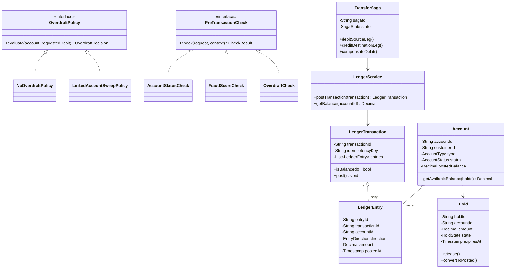
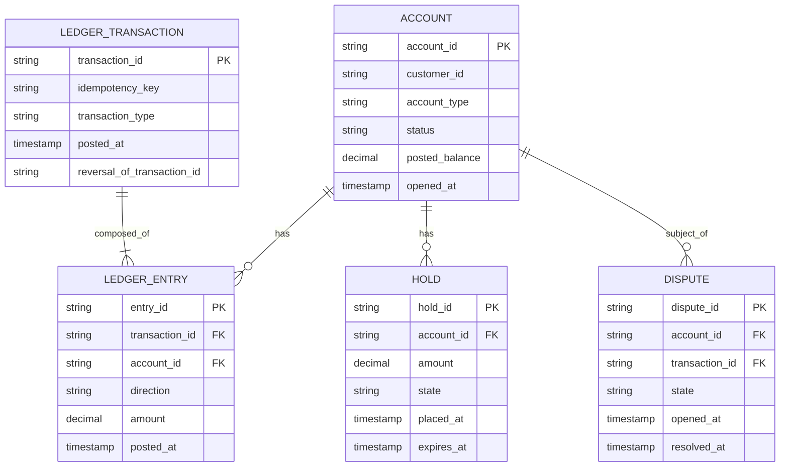
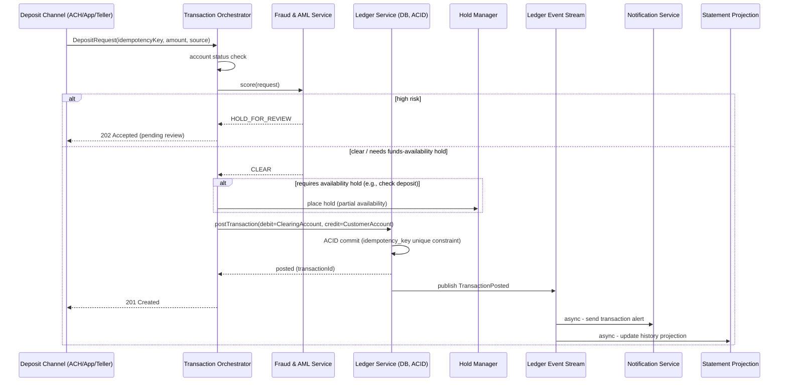
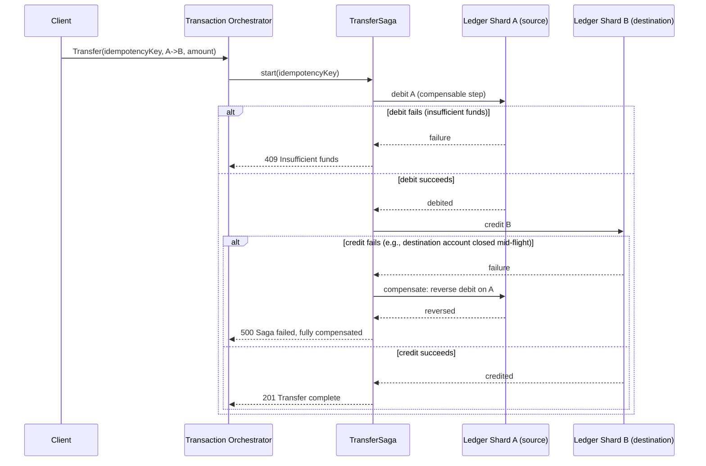

# Core Banking System (Deposits & Beyond) — HLD & LLD

**Assumed metrics** (call out if different): ~20M customers · ~100M transactions/day, peak ~10K TPS (business-hours skew) · interest accrual/statement generation as nightly batch · KYC/AML + PCI-DSS scope · 99.99%+ availability target, but correctness of balances is never sacrificed for it · multi-region for disaster recovery, single authoritative write region per account shard (not active-active — see §4).

**"All other features," explicitly enumerated**, so scope is unambiguous: account opening with KYC/identity verification · deposits (cash/branch, ACH, wire, mobile check deposit, card-linked) · withdrawals · internal transfers (own accounts, peer-to-peer) · external transfers (ACH, wire) · real-time balance inquiry and transaction history/statements · interest accrual on interest-bearing accounts · overdraft handling · holds/pending-transaction management (e.g., a check deposit clears in stages) · fraud/AML monitoring and transaction holds · dispute/chargeback workflow · regulatory reporting · immutable audit trail · notifications (transaction alerts, low-balance, fraud alerts).

**Foundational principle this entire design is built around**: every single balance-affecting operation is a **double-entry ledger transaction** — a debit to one account and a matching credit to another, always in the same atomic operation, always summing to zero. This isn't a storage detail, it's the correctness model the whole system exists to enforce, and it's why this design looks structurally different from the AP-leaning systems earlier in this conversation (the LB, gateway, and chat app) even though it reuses some of their component patterns (API Gateway for external access, an event log for downstream consumers, an idempotency-key pattern already used in the loyalty ledger and chat message designs).

---

# Phase 2: High-Level Design (HLD)

## 1. Scope & System Estimation

**Functional Requirements**
- Open an account after KYC/identity verification passes
- Accept deposits from multiple sources (cash/branch teller, ACH pull/push, wire, mobile check capture, card network settlement) and credit the correct account exactly once
- Process withdrawals and transfers (internal and external), enforcing sufficient-funds/overdraft-policy checks atomically with the balance change
- Maintain a complete, immutable transaction history per account, queryable for statements and disputes
- Apply interest accrual on eligible accounts on a defined schedule (e.g., daily accrual, monthly posting)
- Place and release holds on pending funds (e.g., a deposited check is provisionally available but not fully cleared for N business days)
- Detect potentially fraudulent or AML-flagged transactions in real time and hold/block them pending review
- Handle disputes/chargebacks with a documented reversal workflow (never a silent balance edit — every correction is itself a ledger entry)
- Generate regulatory reports and retain records for the legally mandated period (commonly 5-7+ years depending on jurisdiction)
- Notify customers of transactions, low balances, and suspicious activity

**Non-Functional Requirements**
- **Consistency: strong/ACID for anything touching a balance.** This is the one hard non-negotiable in this entire design — no eventual consistency, no "probably correct," no AP trade-off, for the ledger itself.
- Availability: 99.99%+ target for customer-facing read/write operations, achieved through redundancy and failover *within* a consistency-preserving architecture, not by relaxing consistency (see §4 for exactly how these coexist)
- Durability: a committed transaction must survive any single node/AZ failure — standard multi-replica synchronous commit, no exceptions
- Compliance: PCI-DSS scope for any card-linked flow (this narrows which components can ever see raw card data), KYC/AML regulatory requirements on onboarding and ongoing monitoring, immutable audit logging of every balance-affecting action and every administrative action on an account
- Security: encryption at rest and in transit everywhere, strict least-privilege on who/what can write to the ledger, and — critically — **no component other than the Ledger Service is ever allowed to directly mutate a balance**; every other service can only *request* a ledger transaction

**Back-of-the-Envelope Estimation**
- 100M transactions/day ÷ 86,400s ≈ 1,150 TPS average, but banking traffic is heavily skewed to business hours and paydays → design for **~10K TPS peak**, roughly 8-10x average, which is a standard skew factor for retail banking.
- Double-entry means every transaction writes **at least 2 ledger rows** (one debit, one credit) — at 100M transactions/day that's **200M+ ledger rows/day**, ~73B rows/year before any archival — this is the number that drives the storage-tiering decision in §3 (identical lesson to the loyalty and chat designs' event-volume tiering, applied here to financial records where the "cold" tier still needs fast, auditable retrieval, unlike a stale chat message).
- Fraud-check latency budget: real-time fraud scoring must complete within the transaction's synchronous path for card-present/ATM transactions (typically a few hundred ms end-to-end including the card network round-trip) — this is why fraud scoring is architected as a fast, cacheable-feature lookup (reusing the loyalty platform's online-feature-store pattern) rather than a query against the full transaction history at decision time.
- Account shard sizing: with 20M accounts and a target of keeping any single ledger shard's write throughput well within a single-node ACID database's comfortable ceiling (a few thousand TPS), sharding by `accountId` across on the order of **dozens of shards** comfortably covers the 10K TPS peak with headroom, since any one account's own transactions are inherently sequential anyway (an account only has one "current balance" to serialize against).

## 2. System Architecture & Components

**Architecture Style**: Microservices, but with a **single, non-negotiable source of truth for money** — the Ledger Service — everything else in the architecture is either a client of it or a consumer of what it publishes. This is a deliberate divergence from the "let each service own its own consistency trade-off" style used in the LB/gateway/chat designs: those systems could afford per-component AP/CP choices because no single component held something as universally load-bearing as "the correct amount of money in every account." Here, that centralization is the architecture, not a compromise.

**Component Breakdown**
- **Account Service**: account lifecycle (open/close/freeze), KYC/identity-verification orchestration (typically delegating to a third-party identity provider), account metadata (type, interest rate, overdraft policy)
- **Ledger Service**: the authoritative, ACID double-entry ledger — the *only* component with write access to balances; exposes an API to "post a transaction" (atomic debit+credit), never a raw "set balance" operation
- **Transaction Orchestration Service**: the front door for deposits/withdrawals/transfers — validates the request (sufficient funds, account status, limits), calls fraud scoring, and if clear, calls the Ledger Service to post the transaction; this is where business rules live, kept deliberately separate from the Ledger Service so the ledger itself stays simple and auditable
- **Payment Rails Integrations**: adapters to external networks — ACH processor, wire network (Fedwire/SWIFT), card network (for card-linked deposits/purchases), check-image-clearing service — each normalizes external settlement events into a "credit/debit this account" instruction for the Orchestration Service
- **Hold/Pending Funds Manager**: tracks provisional holds (e.g., "deposited check available in 2 business days") separately from posted balance — the customer-visible "available balance" is computed as posted balance minus active holds, never stored as its own mutable field (avoids a whole class of hold/balance drift bugs)
- **Fraud & AML Service**: real-time transaction scoring (reuses the streaming feature-store pattern from the loyalty platform) plus batch AML pattern detection (structuring, rapid fund movement) run against the ledger's durable event stream
- **Interest Accrual Service**: scheduled batch job that computes and posts interest as its own ledger transactions (interest earned is credited via the exact same double-entry mechanism as any other transaction — no special-cased balance mutation)
- **Statement & History Service**: read-optimized projections of ledger data for customer-facing statements and transaction history, built from the ledger's event stream (CQRS — same pattern used in the file-upload and loyalty designs)
- **Dispute/Chargeback Service**: manages the dispute lifecycle; a resolved dispute results in a *new* reversing ledger transaction, never a mutation of the original — preserves a complete, honest audit history
- **Notification Service**: subscribes to the ledger event stream for transaction alerts, low-balance triggers, fraud-hold notifications
- **Audit & Compliance Service**: append-only, tamper-evident log of every balance-affecting event and every privileged administrative action (who changed an account's status, and why) — retained per regulatory schedule
- **External API Gateway**: reuses the API Gateway design already established in this conversation for external-facing endpoints (mobile app, third-party integrations via open-banking APIs) — auth, rate limiting, and request validation happen there before anything reaches the Orchestration Service

**Data Flow Walkthrough**

*Write path (a deposit):*
1. Deposit arrives via one of several channels — mobile check capture, ACH credit notification from the payment rail, a teller-initiated cash deposit — each normalized by its channel adapter into a common `DepositRequest` (accountId, amount, source, external reference ID).
2. Transaction Orchestration Service validates the account is active and not frozen, and — depending on the deposit type — decides whether the funds are immediately available or must be placed on hold (e.g., check deposits are commonly held per regulatory/risk policy).
3. Orchestration Service calls Fraud & AML Service for a real-time score against fast-path features (recent velocity, known-fraud-pattern signals); a high-risk score routes the deposit to manual review instead of auto-posting.
4. On clearance, Orchestration Service calls the Ledger Service to **post the transaction**: debit a suspense/clearing account representing the external source, credit the customer's account — atomically, in one ACID transaction, keyed by an idempotency key derived from the external reference ID (critical: the ACH network *will* redeliver notifications; the ledger must never double-post the same deposit).
5. Ledger Service commits the transaction (both entries, or neither), publishes a `TransactionPosted` event to the durable event stream.
6. Downstream consumers react asynchronously and independently: Statement Service updates its projection, Notification Service alerts the customer, Fraud/AML batch analysis ingests it for pattern detection — none of this blocks the transaction's completion, since by the time the event is published, the money has already, correctly, moved.

*Read path (balance inquiry / statement):*
1. **Real-time available balance**: read directly from the Ledger Service's current-balance view (posted balance) combined with the Hold/Pending Funds Manager's active holds for that account — always computed from the source of truth, never served from a potentially-stale cache for money-critical reads (a stale *balance* is a much worse UX than a stale presence dot).
2. **Transaction history/statements**: served from the Statement Service's read-optimized projection (built from the ledger event stream), which can be eventually consistent by design — a statement being a few seconds behind the absolute latest transaction is an accepted, standard, and disclosed trade-off distinct from the current-balance read.

## 3. Storage & Data Strategy

**Database Selection**
- **Ledger Service datastore**: a strongly consistent, ACID-transactional relational database (e.g., PostgreSQL, or a distributed-SQL system like Spanner/CockroachDB/YugabyteDB if global-scale multi-region strong consistency is required) — chosen specifically *because* it's relational: double-entry bookkeeping is fundamentally a relational integrity problem (every transaction's debits must equal its credits, enforced by a constraint, not by application discipline alone).
- **Sharding**: by `accountId` (each account's full transaction history and balance state lives in one shard) — this matches the dominant access pattern (almost every ledger operation touches one account's balance) and avoids the vast majority of cross-shard transactions; the minority of operations that inherently span two accounts (an internal transfer between two customers) are handled via the two-phase, saga-style pattern detailed in §4.
- **Statement/History projections**: a read-optimized store (could be the same relational engine with read replicas, or a separate document/columnar store) — deliberately decoupled from the ledger's write path so heavy statement-generation or analyst queries can never contend with or slow down live transaction posting.
- **Fraud feature store**: same online (Redis/DynamoDB, ms-latency) + offline (warehouse, for model training) split as the loyalty platform design — real-time scoring reads the online store, never the ledger directly, to stay within the transaction's latency budget.
- **Audit log**: append-only, write-once storage (e.g., an object store with object-lock/WORM semantics, or a database with no UPDATE/DELETE grants at all for this table) — the tamper-evidence requirement means the storage layer itself, not just application logic, should make retroactive edits impossible.

**Data Lifecycle**
- **Hot/warm/cold tiering**: recent transactions (say, 18-24 months) in the primary ledger database for fast read/write; older history moved to cheaper, still-queryable cold storage — but unlike the chat/loyalty designs, "cold" here must still support **fast, complete retrieval for audits and disputes**, since a customer or regulator can reasonably ask about a 5-year-old transaction — cold tier is optimized for retrievability, not just cost, which is a meaningfully different requirement than the chat app's "rarely-accessed old messages."
- **Idempotency keys**: every externally-triggered transaction (ACH notification, card settlement, API-initiated transfer) carries an idempotency key; the Ledger Service enforces a uniqueness constraint on `(idempotencyKey)` at the database level — a replayed external event is rejected as a duplicate, not silently reprocessed, at the storage layer itself rather than relying purely on upstream deduplication.
- **Retention**: driven by regulatory schedule (commonly 5-7 years, jurisdiction-dependent) rather than a cost-optimization TTL — this is the one design in this conversation where "delete old data to save money" is explicitly *not* the default instinct; deletion, where it happens at all, is itself a compliance-governed process.
- **Reversals, not edits**: correcting a mistaken transaction is always a new, linked reversing entry, never an UPDATE to the original row — the ledger table is effectively append-only by policy, which is what makes the audit trail trustworthy by construction rather than by promise.

## 4. Cross-Cutting Concerns & Trade-offs

**CAP Theorem & Trade-offs**
- **The ledger is unambiguously CP.** During a network partition affecting a shard's primary, that shard's writes pause (or fail over via consensus to a new primary with no data loss) rather than accept a write that risks an inconsistent balance. This is a direct, deliberate reversal of the AP-leaning default used for the LB's health status, the gateway's rate limits, and the chat app's presence — none of those, if briefly wrong, cost anyone money; a wrong balance does.
- **Achieving high availability *despite* CP**: this isn't "CP therefore low availability" — it's achieved via synchronous replication within a region (so a single node failure doesn't pause writes, a consensus-driven failover does) and, for multi-region resilience, a designated primary region per shard with fast, consensus-backed failover to a standby region on a regional outage — the standby is never simultaneously "active" for writes on the same shard, which is precisely what avoids the split-brain double-spend problem that true active-active would risk.
- **Cross-account transfers spanning shards**: since sharding is per-account, a transfer between two customers' accounts on different shards can't be a single local ACID transaction. This uses a **saga pattern**: debit account A's shard (with a compensating reversal defined), then credit account B's shard; if the credit fails, the debit is automatically reversed via its compensating transaction. The customer-visible transaction only reports "complete" once both legs succeed — this is the standard, correct way to get multi-shard atomicity-in-effect without a slow, fragile distributed 2PC lock across every transaction (most transactions, being single-account, never pay this cost at all).
- **Statements/history/analytics**: eventually consistent by design (same as every prior system in this conversation) — the trade-off is explicitly scoped to *derived views*, never to the balance itself.

**Resiliency & Security**
- **No component other than the Ledger Service can mutate a balance** — enforced at the access-control layer (database grants), not just by convention; this is the single most important security boundary in the whole system, since a bug or breach in, say, the Notification Service should be structurally incapable of moving money.
- **Fraud/AML holds fail closed**: if the Fraud & AML Service is unreachable, the Orchestration Service's default policy is to hold (not auto-approve) high-value or unusual transactions rather than assume "no score means safe" — mirrors the file-upload design's fail-closed posture on unscanned files, applied here to money instead of malware.
- **PCI-DSS scope containment**: any component that ever touches raw card data (card-linked deposit flows) is isolated into its own tightly-scoped, separately-audited boundary, with tokenization used everywhere else in the system so the vast majority of services (Ledger, Statement, Notification, etc.) never come into PCI scope at all.
- **Encryption**: TLS in transit; encryption at rest for all financial data; field-level encryption or tokenization for the most sensitive identifiers (account numbers, SSNs/tax IDs) so a database-layer breach doesn't directly expose them.
- **AuthN/Z**: strong customer authentication (MFA) for money-movement actions specifically, even if session auth for balance-viewing is lighter-weight — the security bar scales with the action's consequence, not uniformly across the whole app.
- **Reconciliation**: a continuous, independent job compares the sum of all ledger entries against expected external-source totals (e.g., total ACH credits received vs. total posted) — this is the system-wide safety net (same philosophy as the file-upload service's streaming-vs-batch ledger reconciliation and the loyalty platform's balance reconciliation) that catches any bug the transactional guarantees somehow missed.

---

# Phase 3: Low-Level Design (LLD)

## 1. Class & Object-Oriented Design

**Design Patterns**
- **Double-entry invariant enforced at the domain-model level**: `LedgerTransaction` is not constructible with mismatched debit/credit amounts — the class itself refuses to represent an invalid state, rather than relying on a runtime check that could be skipped.
- **Saga pattern**: `TransferSaga` coordinates the two-leg, cross-shard transfer described in §4, with an explicit compensating action defined for each step.
- **State pattern**: `Dispute` lifecycle (`OPENED → UNDER_REVIEW → RESOLVED_CUSTOMER_FAVOR → RESOLVED_MERCHANT_FAVOR`) and `Hold` lifecycle (`PLACED → RELEASED / CONVERTED_TO_POSTED`) are both strict state machines.
- **Strategy**: pluggable `OverdraftPolicy` (NoOverdraft, LinkedAccountSweep, FeeBasedOverdraftLine) evaluated by the Orchestration Service before allowing a debit that would take a balance negative.
- **Chain of Responsibility**: pre-transaction checks (account-status check → fraud score check → overdraft-policy check → limit check) run as an ordered, short-circuiting chain — directly reusing the middleware-pipeline shape from the API Gateway design, applied here to transaction validation instead of HTTP request handling.



## 2. Database Schema Design



**Table Definitions**

`LEDGER_TRANSACTION`

| Field | Type | Constraints | Description |
|---|---|---|---|
| transaction_id | UUID | PK | — |
| idempotency_key | String | **Unique, Not Null** | Enforces exactly-once posting at the DB level; this constraint is the actual mechanism, not just a convention |
| transaction_type | String | Not Null | DEPOSIT / WITHDRAWAL / TRANSFER / INTEREST / REVERSAL |
| posted_at | Timestamp | Not Null | — |
| reversal_of_transaction_id | String | Nullable, FK → self | Links a reversal to the original — never an UPDATE of the original |

`LEDGER_ENTRY`

| Field | Type | Constraints | Description |
|---|---|---|---|
| entry_id | UUID | PK | — |
| transaction_id | String | FK → LEDGER_TRANSACTION, Not Null | Every entry belongs to exactly one transaction |
| account_id | String | FK → ACCOUNT, Not Null | — |
| direction | String | Not Null | DEBIT / CREDIT |
| amount | Decimal | Not Null, > 0 | Sign is carried by `direction`, never a negative amount field (avoids a classic sign-error bug class) |
| posted_at | Timestamp | Not Null | — |

**Invariant enforced by application + DB constraint**: for a given `transaction_id`, `SUM(amount WHERE direction=DEBIT) = SUM(amount WHERE direction=CREDIT)`.

`HOLD`

| Field | Type | Constraints | Description |
|---|---|---|---|
| hold_id | UUID | PK | — |
| account_id | String | FK → ACCOUNT | — |
| amount | Decimal | Not Null | — |
| state | String | Not Null | PLACED / RELEASED / CONVERTED_TO_POSTED |
| placed_at | Timestamp | Not Null | — |
| expires_at | Timestamp | Nullable | Auto-release trigger for time-bound holds |

`DISPUTE`

| Field | Type | Constraints | Description |
|---|---|---|---|
| dispute_id | UUID | PK | — |
| account_id | String | FK → ACCOUNT | — |
| transaction_id | String | FK → LEDGER_TRANSACTION | The disputed transaction |
| state | String | Not Null | OPENED / UNDER_REVIEW / RESOLVED_CUSTOMER_FAVOR / RESOLVED_MERCHANT_FAVOR |
| opened_at | Timestamp | Not Null | — |
| resolved_at | Timestamp | Nullable | — |

## 3. API & Interface Specifications

```yaml
openapi: 3.0.0
info:
  title: Core Banking Transaction API
  version: "1.0"
paths:
  /accounts/{accountId}/deposits:
    post:
      summary: Post a deposit (idempotent)
      requestBody:
        content:
          application/json:
            schema:
              type: object
              required: [idempotencyKey, amount, source]
              properties:
                idempotencyKey: { type: string, description: "Derived from the external settlement reference where applicable" }
                amount: { type: number }
                source: { type: string, enum: [ACH, WIRE, CHECK, CASH, CARD] }
                externalReferenceId: { type: string }
      responses:
        "201": { description: Deposit posted }
        "200": { description: Already processed (idempotent replay), returns original result }
        "202": { description: Held pending fraud review or funds-availability policy }
        "400": { description: Invalid request / account not eligible }

  /accounts/{accountId}/withdrawals:
    post:
      summary: Post a withdrawal (idempotent, subject to available-balance and overdraft policy checks)
      requestBody:
        content:
          application/json:
            schema:
              type: object
              required: [idempotencyKey, amount]
              properties:
                idempotencyKey: { type: string }
                amount: { type: number }
      responses:
        "201": { description: Withdrawal posted }
        "200": { description: Idempotent replay }
        "409": { description: Insufficient available funds under current overdraft policy }

  /transfers:
    post:
      summary: Transfer funds between two accounts (internal saga-coordinated if cross-shard)
      requestBody:
        content:
          application/json:
            schema:
              type: object
              required: [idempotencyKey, sourceAccountId, destinationAccountId, amount]
              properties:
                idempotencyKey: { type: string }
                sourceAccountId: { type: string }
                destinationAccountId: { type: string }
                amount: { type: number }
      responses:
        "201": { description: Transfer completed (both legs posted) }
        "200": { description: Idempotent replay }
        "409": { description: Insufficient funds or destination account ineligible }
        "500": { description: "Saga failed and was compensated; source account was not debited (or was auto-reversed)" }

  /accounts/{accountId}/balance:
    get:
      summary: Get current posted balance and available balance (posted minus active holds)
      responses:
        "200":
          content:
            application/json:
              schema:
                type: object
                properties:
                  postedBalance: { type: number }
                  availableBalance: { type: number }
                  activeHolds:
                    type: array
                    items:
                      type: object
                      properties:
                        holdId: { type: string }
                        amount: { type: number }
                        expiresAt: { type: string, format: date-time }

  /accounts/{accountId}/transactions:
    get:
      summary: Transaction history (statement source), served from the read-optimized projection
      parameters:
        - name: from
          in: query
          schema: { type: string, format: date }
        - name: to
          in: query
          schema: { type: string, format: date }
      responses:
        "200":
          content:
            application/json:
              schema:
                type: object
                properties:
                  transactions:
                    type: array
                    items:
                      type: object
                      properties:
                        transactionId: { type: string }
                        type: { type: string }
                        amount: { type: number }
                        direction: { type: string }
                        postedAt: { type: string, format: date-time }
```

**Idempotency**
- Every money-movement endpoint requires a client- or channel-supplied `idempotencyKey`; the Ledger Service enforces uniqueness on this key **as a database constraint**, not just an application-layer check — this is deliberately stronger than the equivalent pattern in the loyalty-ledger or chat-message designs, because the cost of a missed duplicate here is literally money, not a miscounted point or a duplicate chat bubble.
- A retried request with the same `idempotencyKey` returns the original result (`200`, not `201`) — the caller (e.g., an ACH processor retrying a redelivered notification) gets a safe, correct answer rather than a duplicate credit.
- Transfers use the same key across both legs of the saga — if the saga is retried after a partial failure, it resumes/rechecks rather than re-executing an already-completed leg.

## 4. Concrete Code Snippets & Sequence Flows





**Core Logic: Double-Entry Ledger Posting with Enforced Balance Invariant and Idempotency** (the correctness-critical core of the entire system — this is the one function that must never be wrong)

```python
# ledger.py
from dataclasses import dataclass, field
from decimal import Decimal
from enum import Enum
from typing import Optional
import logging

logger = logging.getLogger("bank.ledger")


class Direction(Enum):
    DEBIT = "DEBIT"
    CREDIT = "CREDIT"


class UnbalancedTransactionError(Exception):
    """Raised if debits and credits don't sum to zero — this must be
    impossible to construct, but we check explicitly rather than trust it."""


class DuplicateTransactionError(Exception):
    """Not necessarily fatal to the caller — signals 'idempotent replay,'
    the caller should fetch and return the original result."""


class InsufficientFundsError(Exception):
    pass


@dataclass(frozen=True)
class LedgerEntryDraft:
    account_id: str
    direction: Direction
    amount: Decimal  # always positive; sign is carried by `direction`

    def __post_init__(self):
        if self.amount <= 0:
            raise ValueError("Ledger entry amount must be positive")


@dataclass(frozen=True)
class LedgerTransactionDraft:
    idempotency_key: str
    transaction_type: str
    entries: list[LedgerEntryDraft] = field(default_factory=list)

    def total_debits(self) -> Decimal:
        return sum(
            (e.amount for e in self.entries if e.direction == Direction.DEBIT),
            Decimal("0"),
        )

    def total_credits(self) -> Decimal:
        return sum(
            (e.amount for e in self.entries if e.direction == Direction.CREDIT),
            Decimal("0"),
        )

    def is_balanced(self) -> bool:
        return self.total_debits() == self.total_credits()


class LedgerRepository:
    """Backed by a relational DB with ACID transactions and a UNIQUE
    constraint on idempotency_key. All methods below are assumed to run
    inside a single database transaction per posting."""

    def find_by_idempotency_key(self, key: str) -> Optional[dict]:
        raise NotImplementedError

    def get_current_balance(self, account_id: str) -> Decimal:
        """Must be read with appropriate isolation (e.g., SELECT ... FOR
        UPDATE or an equivalent serializable read) within the same
        transaction that will post the entries, to prevent a
        read-then-write race against a concurrent debit."""
        raise NotImplementedError

    def insert_transaction_and_entries(
        self, draft: LedgerTransactionDraft
    ) -> str:
        """Single atomic DB transaction: insert the LEDGER_TRANSACTION row
        and all LEDGER_ENTRY rows, update each affected ACCOUNT's
        posted_balance. All-or-nothing by the underlying database's ACID
        guarantee — there is no code path where entries exist without a
        transaction row, or vice versa."""
        raise NotImplementedError


class LedgerService:
    def __init__(self, repo: LedgerRepository):
        self._repo = repo

    def post_transaction(
        self,
        draft: LedgerTransactionDraft,
        overdraft_allowed_accounts: Optional[set[str]] = None,
    ) -> dict:
        """
        Posts a double-entry transaction atomically. Idempotent on
        idempotency_key. Enforces: (1) debits == credits, (2) no account
        goes negative unless explicitly permitted for that account by
        overdraft policy (checked by the caller/Orchestrator before this
        is invoked, but re-validated here as the last line of defense —
        the ledger never trusts an upstream check alone for a
        balance-safety invariant).
        """
        existing = self._repo.find_by_idempotency_key(draft.idempotency_key)
        if existing is not None:
            logger.info(
                "idempotent_replay",
                extra={"idempotency_key": draft.idempotency_key},
            )
            return existing

        if not draft.is_balanced():
            # This should be structurally unreachable if callers only ever
            # construct balanced drafts, but a ledger must never rely on
            # "should be unreachable" for a money-correctness invariant.
            raise UnbalancedTransactionError(
                f"debits={draft.total_debits()} credits={draft.total_credits()}"
            )

        overdraft_allowed_accounts = overdraft_allowed_accounts or set()

        for entry in draft.entries:
            if entry.direction != Direction.DEBIT:
                continue
            current_balance = self._repo.get_current_balance(entry.account_id)
            resulting_balance = current_balance - entry.amount
            if (
                resulting_balance < 0
                and entry.account_id not in overdraft_allowed_accounts
            ):
                logger.warning(
                    "insufficient_funds_rejected",
                    extra={
                        "account_id": entry.account_id,
                        "attempted_balance": str(resulting_balance),
                    },
                )
                raise InsufficientFundsError(
                    f"Account {entry.account_id} would go negative"
                )

        transaction_id = self._repo.insert_transaction_and_entries(draft)

        logger.info(
            "transaction_posted",
            extra={
                "transaction_id": transaction_id,
                "idempotency_key": draft.idempotency_key,
                "type": draft.transaction_type,
            },
        )

        return {
            "transaction_id": transaction_id,
            "idempotency_key": draft.idempotency_key,
            "entries": draft.entries,
        }


def build_transfer_draft(
    idempotency_key: str, source_account_id: str, dest_account_id: str, amount: Decimal
) -> LedgerTransactionDraft:
    """Factory ensures every transfer is constructed as a balanced pair —
    there is no way to call post_transaction with mismatched legs via
    this path."""
    return LedgerTransactionDraft(
        idempotency_key=idempotency_key,
        transaction_type="TRANSFER",
        entries=[
            LedgerEntryDraft(source_account_id, Direction.DEBIT, amount),
            LedgerEntryDraft(dest_account_id, Direction.CREDIT, amount),
        ],
    )


# --- unit test placeholders ---
def test_post_transaction_commits_balanced_entries():
    # arrange: a balanced two-entry draft (debit A, credit B, equal amounts)
    # act: post_transaction(draft)
    # assert: repo.insert_transaction_and_entries called once; result contains transaction_id
    pass


def test_post_transaction_is_idempotent_on_key():
    # arrange: repo.find_by_idempotency_key returns an existing result
    # act: post_transaction(draft) with that same key
    # assert: insert_transaction_and_entries NOT called; existing result returned
    pass


def test_post_transaction_rejects_unbalanced_draft():
    # arrange: draft with mismatched debit/credit totals (bypassing normal factories)
    # act/assert: raises UnbalancedTransactionError before touching the repository
    pass


def test_post_transaction_rejects_insufficient_funds_without_overdraft():
    # arrange: get_current_balance returns less than the debit amount;
    #          overdraft_allowed_accounts is empty
    # act/assert: raises InsufficientFundsError; insert NOT called
    pass


def test_post_transaction_allows_negative_balance_when_overdraft_permitted():
    # arrange: same as above, but account_id is in overdraft_allowed_accounts
    # act: post_transaction succeeds
    # assert: insert_transaction_and_entries called with the negative-resulting entry
    pass


def test_build_transfer_draft_always_produces_balanced_entries():
    # act: build_transfer_draft(...)
    # assert: draft.is_balanced() is True by construction, for any amount > 0
    pass
```

---

### Key design decisions worth flagging back to you
1. **This is the one design in the conversation that's deliberately CP over AP wherever money is involved** — every other system here (LB, gateway, chat) defaulted to eventual consistency for scale; here, the ledger sacrifices some availability-under-partition specifically to guarantee a balance is never wrong, and high availability is instead achieved through synchronous replication and consensus-based failover rather than relaxed consistency.
2. **Double-entry as an unbreakable invariant, not a convention** — `LedgerTransactionDraft` and the balanced-transfer factory make it structurally hard to even construct an invalid transaction, and the service re-validates the invariant anyway rather than trusting callers, because "should be unreachable" is not an acceptable justification when the invariant is "money exists."
3. **Reversals instead of edits** — every correction, dispute resolution, or fix is a new linked transaction, never a mutation of history. This is what makes the audit trail trustworthy by construction, and it's also just... how real banks actually work.

Let me know if you want to go deeper on any piece — e.g., the exact consensus/failover mechanics for the ledger's primary-region model, the AML batch pattern-detection job (structuring, layering detection), or how card-network settlement (authorization hold → capture → settlement) maps onto the hold/posted-balance model here.
