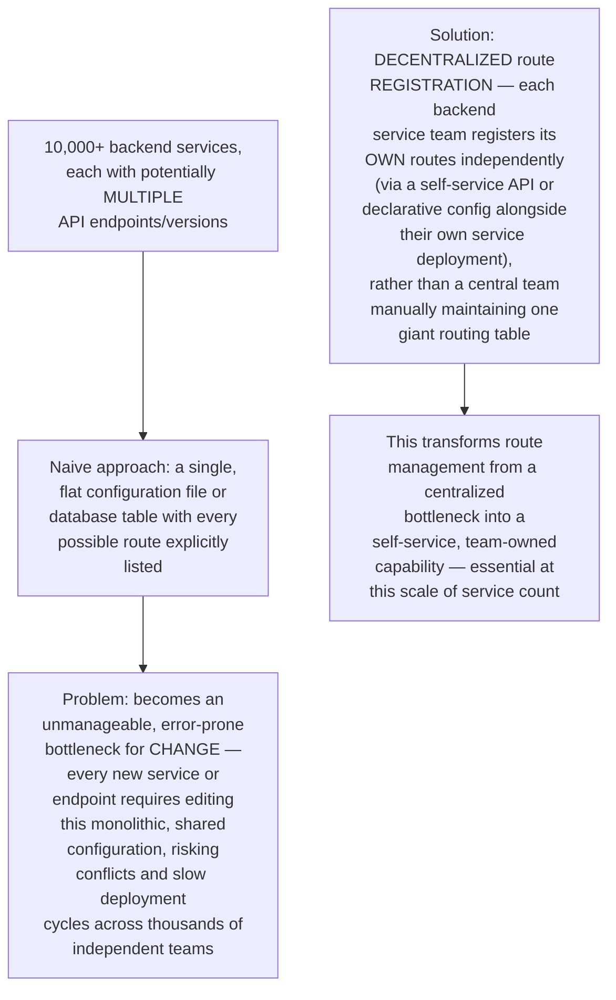
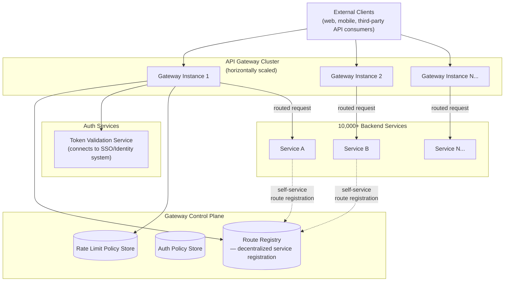
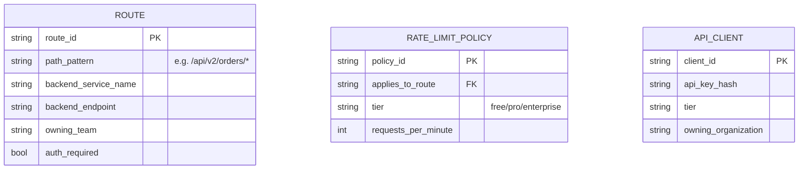
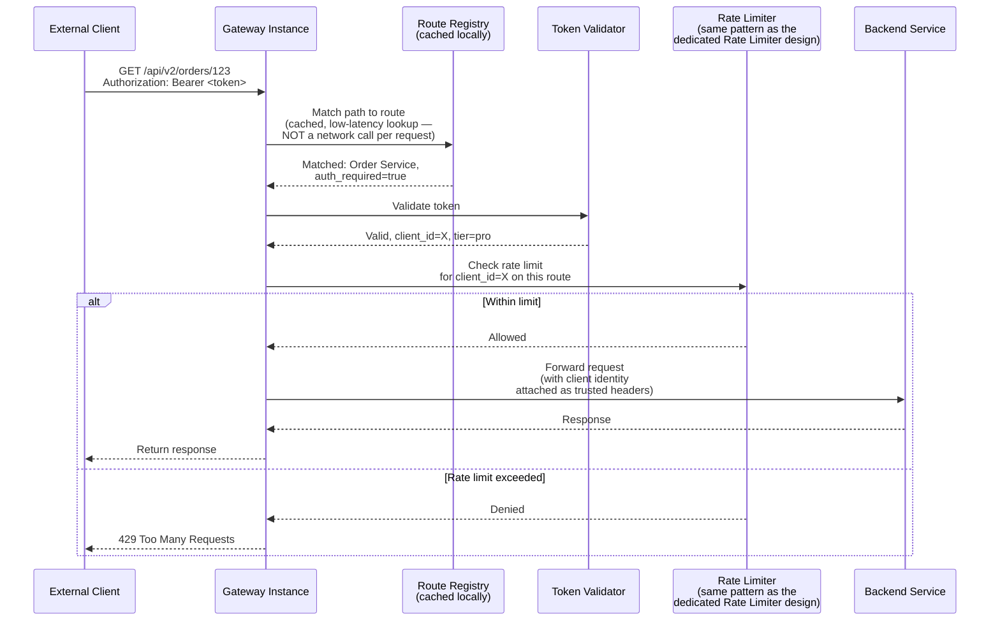
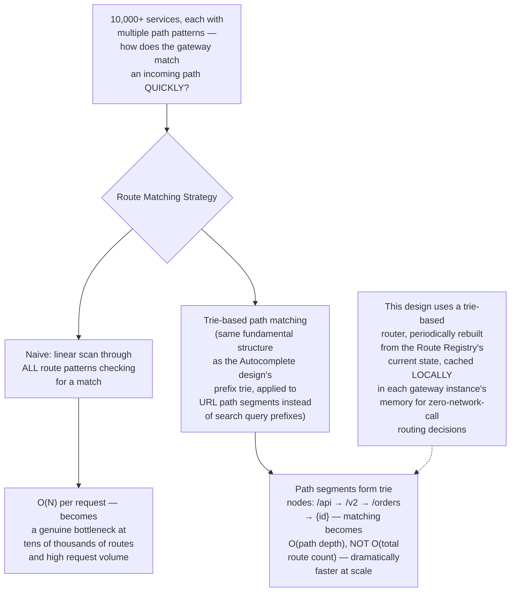
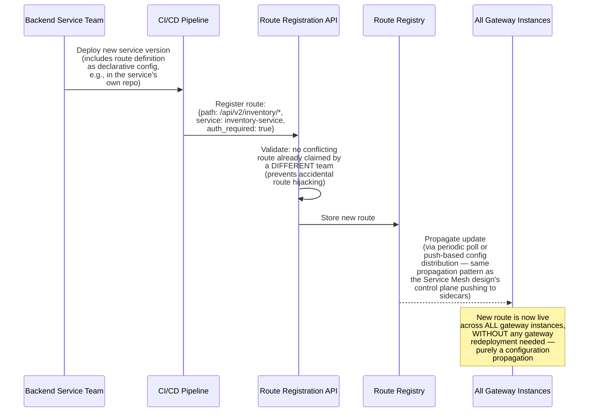
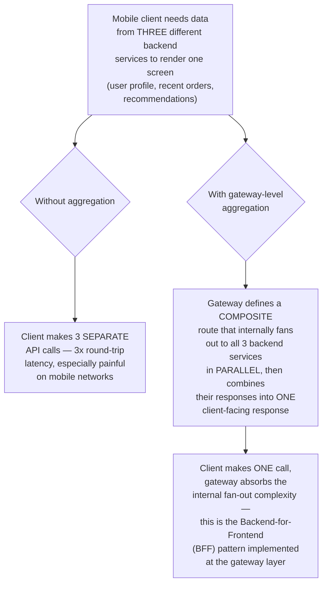
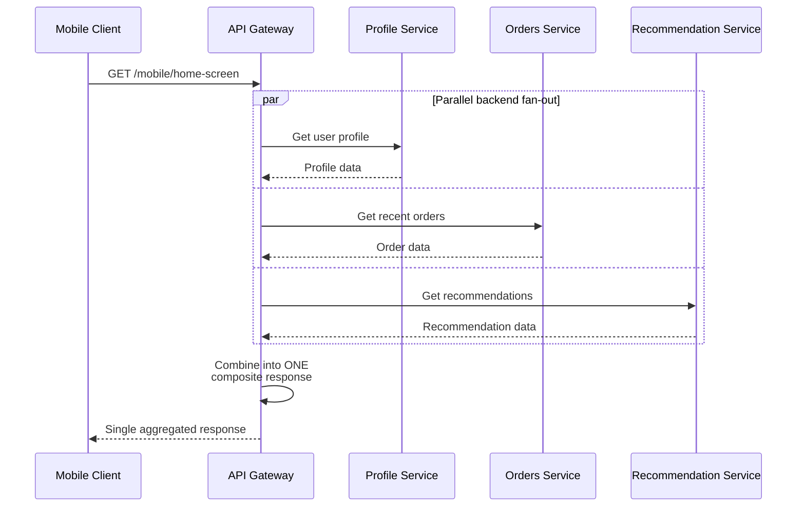
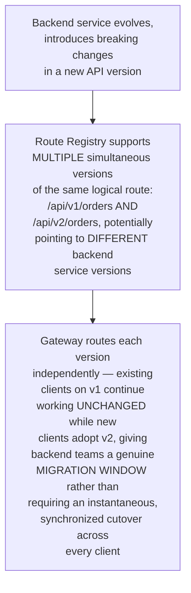

# Design an API Gateway Handling Auth, Rate Limiting, and Routing for 10,000+ Backend Services — High-Level Design Document

## 1. Requirements

### Functional Requirements
- Route incoming external requests to the correct one of 10,000+ backend services
- Centrally enforce authentication and authorization before requests reach backend services
- Apply rate limiting per client/API key across potentially thousands of distinct API endpoints
- Support API versioning, request/response transformation, and aggregation of multiple backend calls into one client-facing response

### Non-Functional Requirements
- **Extremely high availability:** The gateway sits in front of EVERY external request to EVERY service — its failure is a total platform outage, similar criticality to the SSO and Global DNS designs
- **Low added latency:** Every single request now has an extra hop through the gateway before reaching its actual destination
- **Configuration scale:** Routing rules for 10,000+ distinct services/endpoints must be manageable, not an unmaintainable flat configuration file
- **Horizontal scalability:** Must handle the platform's ENTIRE external request volume, not just a fraction

### Back-of-Envelope Estimation
| Metric | Value |
|---|---|
| Backend services routed | 10,000+ |
| Requests/sec (platform-wide) | Hundreds of thousands to millions |
| Routing table size | Tens of thousands of distinct route entries |
| Added latency budget | Single-digit milliseconds |

---

## 2. The Core Architectural Challenge — Routing Table Scale



---

## 3. High-Level Architecture



**Key idea:** Every gateway instance is stateless and horizontally identical, pulling its routing/auth/rate-limit configuration from shared, centrally-managed but DECENTRALLY-POPULATED stores. Backend service teams register their own routes as part of their own deployment process — the gateway's job is to efficiently CONSUME this large, continuously-changing routing dataset, not to be the single point where all route changes must be manually coordinated.

---

## 4. Data Model



---

## 5. Request Flow — Detailed Sequence



---

## 6. Efficient Route Matching at Scale



---

## 7. Self-Service Route Registration Flow



**Why route conflict validation matters:** With thousands of independently-deploying teams, without an explicit check, two different teams could accidentally claim overlapping path patterns — the registration API must actively prevent this at registration time, since silently allowing "last write wins" on a route conflict could cause one team's requests to be misrouted to another team's service, a serious and confusing production issue.

---

## 8. Request Aggregation (Backend-for-Frontend Pattern)





---

## 9. API Versioning Support



---

## 10. Component Responsibilities Summary

```mermaid
mindmap
  root((API Gateway HLD))
    Gateway Instances
      Stateless, horizontally scaled
      Local route cache for speed
    Route Registry
      Decentralized self-service registration
      Conflict prevention
    Trie-Based Router
      O(path depth) matching
      Scales to tens of thousands of routes
    Token Validator
      Centralized auth enforcement
      Connects to identity/SSO system
    Rate Limiter
      Per-client, per-route policies
      Same core mechanism as dedicated Rate Limiter design
    Aggregation Layer
      Backend-for-Frontend pattern
      Parallel fan-out and merge
```

---

## 11. Key Design Decisions & Tradeoffs

| Decision | Choice | Why |
|---|---|---|
| Route management model | Decentralized, self-service registration | A centrally-maintained flat routing table becomes an unmanageable bottleneck at 10,000+ services across many independent teams |
| Route matching algorithm | Trie-based path matching | Scales as O(path depth) rather than O(total route count), essential for maintaining low latency at this route table scale |
| Gateway instance state | Stateless, locally-cached configuration | Enables horizontal scaling and avoids making every request dependent on a network call to a central config store |
| Auth enforcement | Centralized at the gateway, before backend routing | Ensures consistent authentication/authorization across all 10,000+ services without requiring each to reimplement it independently |
| Aggregation | Optional Backend-for-Frontend composite routes | Reduces client-side round-trips for screens/use cases needing data from multiple backend services |
| Versioning | Multiple simultaneous route versions supported | Gives backend teams a genuine migration window rather than forcing synchronized, all-at-once client cutovers |

---

## 12. Bottlenecks & Scaling Considerations

- **Configuration propagation latency** — with decentralized, frequent route registration across thousands of teams, the delay between "team registers a new route" and "all gateway instances have it live" directly impacts deployment velocity; needs an efficient, low-latency propagation mechanism (push-based, not slow polling) at this scale.
- **Local route cache memory footprint** — caching tens of thousands of routes in EVERY gateway instance's memory (for zero-network-call matching) requires the trie structure to remain memory-efficient even as route count continues growing.
- **Auth service as a critical shared dependency** — since EVERY authenticated request across ALL 10,000+ services depends on token validation, this component's availability and latency directly bound the entire gateway's performance, similar criticality to the SSO design's session store.
- **Backend service ownership vs gateway team responsibility split** — decentralized route registration empowers teams but also means the central gateway team has LESS direct visibility/control over what's actually routed through their infrastructure; requires monitoring/governance tooling to maintain platform-wide observability despite the decentralized registration model.
- **Aggregation failure handling** — when a Backend-for-Frontend composite route fans out to multiple services and ONE of them fails/times out, the gateway needs clear policy: fail the whole aggregated response, or return partial results with the failed section omitted — this must be a deliberate, documented per-route decision, not an accidental inconsistency.
- **Gateway as a total-platform single point of failure** — given that gateway failure blocks essentially ALL external traffic to ALL services, this component warrants exceptional investment in high availability, redundancy across failure domains, and graceful degradation strategies — commensurate with its position as the single mandatory entry point for the entire platform's external-facing traffic.
- **Route conflict resolution edge cases** — beyond simple exact-path conflicts, overlapping WILDCARD patterns from different teams (e.g., `/api/v2/orders/*` vs `/api/v2/orders/special/*`) require careful precedence rules to avoid ambiguous routing behavior, adding meaningful complexity to the route registration validation logic beyond simple duplicate detection.
