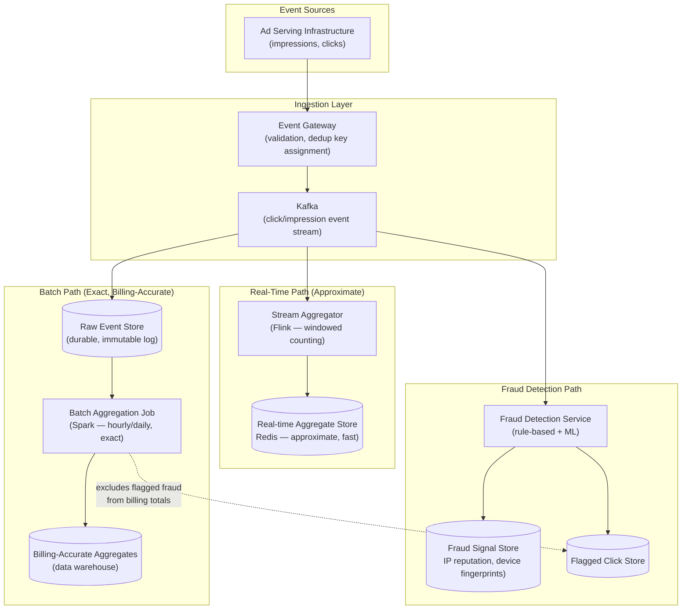
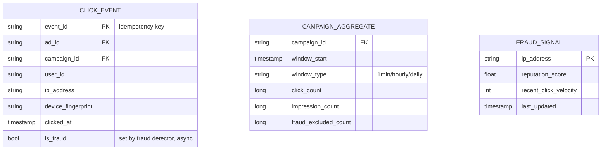
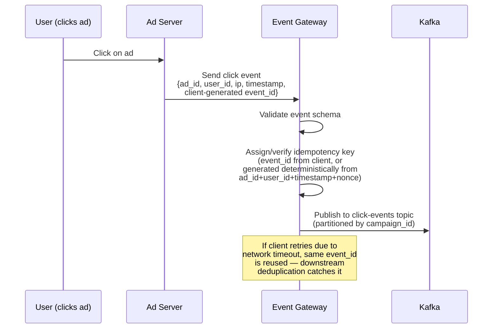
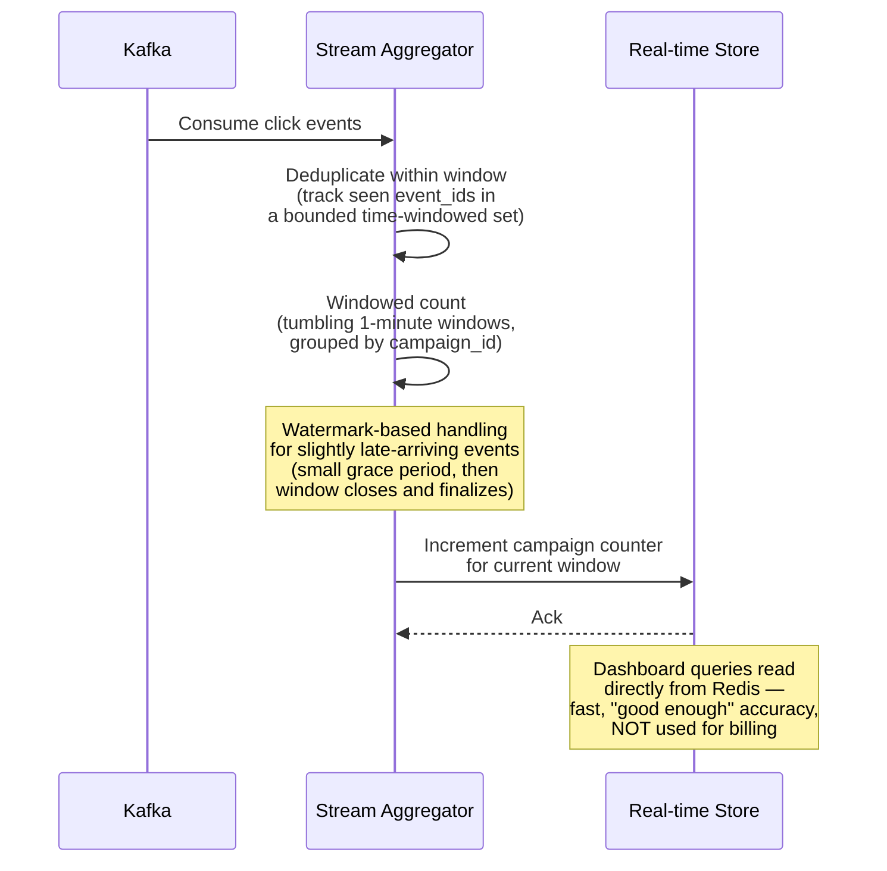
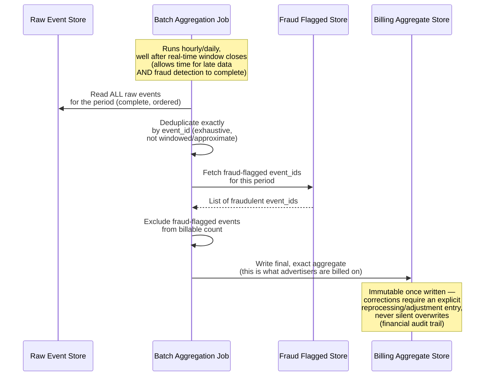
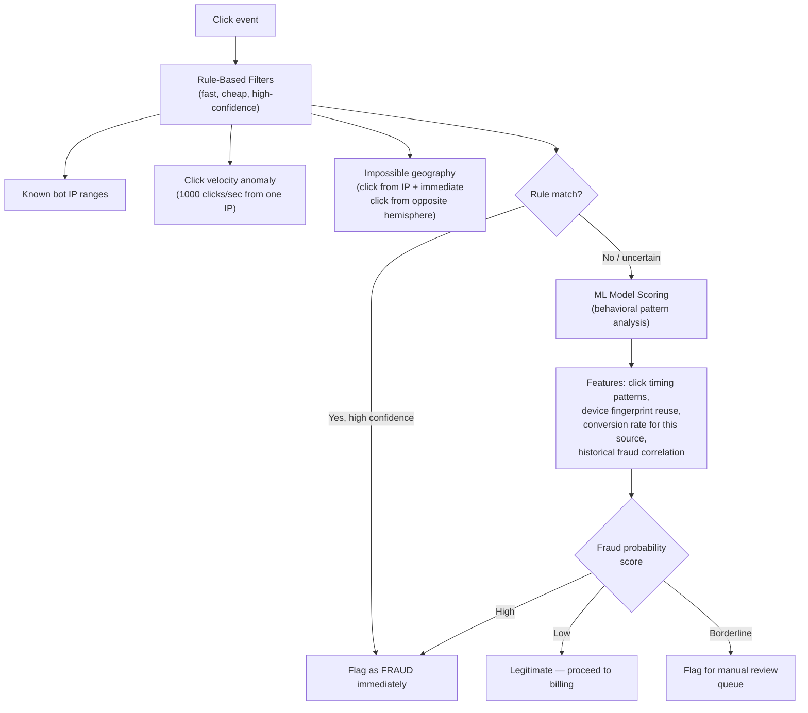
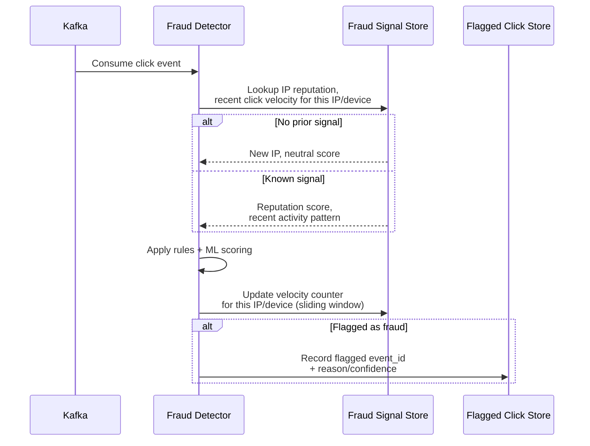
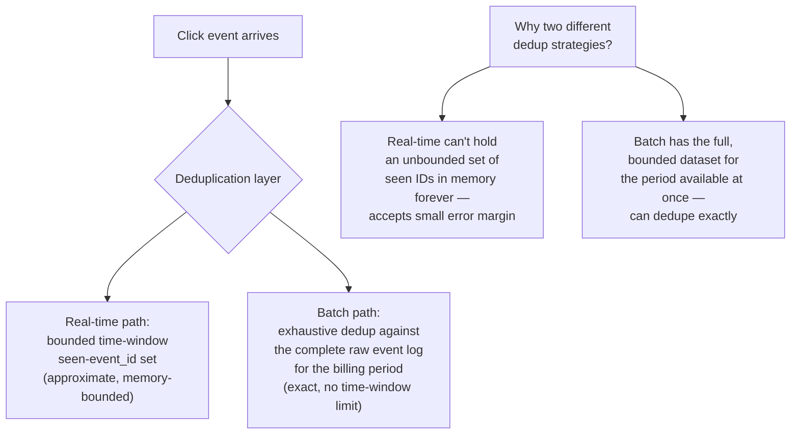
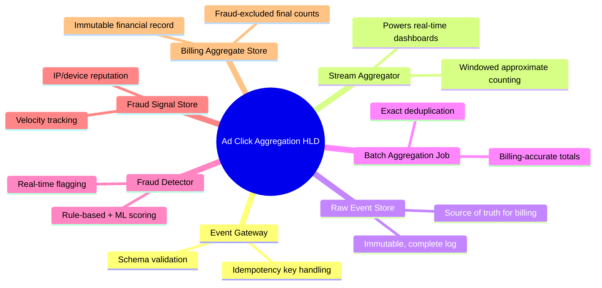

# Design an Ad Click Aggregation / Fraud Detection System — High-Level Design Document

## 1. Requirements

### Functional Requirements
- Ingest ad click/impression events at massive volume
- Aggregate clicks/impressions per ad, campaign, advertiser over various time windows
- Detect fraudulent clicks in near-real-time (bots, click farms, competitor click fraud)
- Support both real-time dashboards (approximate, fast) and billing-accurate reports (exact, delayed)
- Prevent double-counting/duplicate click events

### Non-Functional Requirements
- **High write throughput:** Massive click/impression event volume, especially during peak ad-serving hours
- **Near-real-time aggregation:** Dashboards should reflect activity within seconds to a minute
- **Correctness for billing:** Financial reporting (advertisers are charged based on this data) must be exactly accurate, even if real-time dashboards are approximate
- **Fraud detection latency:** Should ideally flag fraud before or shortly after billing, not weeks later
- **Idempotency:** Duplicate event delivery (network retries) must not inflate click counts

### Back-of-Envelope Estimation
| Metric | Value |
|---|---|
| Ad impressions/sec (platform-wide) | ~1M+ |
| Ad clicks/sec | ~10,000-50,000 (much lower than impressions) |
| Estimated fraud rate (industry) | 5-20% of clicks, varies by vertical |
| Aggregation windows | 1-min (real-time), hourly, daily (billing) |
| Event replay/backfill need | Billing corrections require exact reprocessing capability |

---

## 2. High-Level Architecture

**Key idea:** This system deliberately runs **two parallel aggregation paths** — a fast, approximate real-time path for dashboards (stream processing, eventual consistency acceptable), and a slower, exact batch path for billing (where correctness matters far more than speed). Trying to make one pipeline serve both needs would force an unnecessary compromise on one or the other.

---

## 3. Data Model

---

## 4. Click Event Ingestion — Detailed Sequence

---

## 5. Real-Time Aggregation (Approximate Path)

---

## 6. Exact Batch Aggregation (Billing-Accurate Path)

**Why batch (not stream) for billing:** Billing correctness requires waiting for the complete, ordered dataset — including late-arriving events and completed fraud analysis — before finalizing numbers advertisers will be charged on. Real-time streaming inherently trades some completeness for speed (bounded lateness windows), which is the right tradeoff for dashboards but the wrong one for money.

---

## 7. Fraud Detection Pipeline

---

## 8. Fraud Signal Aggregation — Detailed Sequence

---

## 9. Deduplication Strategy (Preventing Double-Counting)

---

## 10. Component Responsibilities Summary

---

## 11. Key Design Decisions & Tradeoffs

| Decision | Choice | Why |
|---|---|---|
| Dual aggregation paths | Real-time (approximate) + Batch (exact) | Dashboards need speed and can tolerate small error; billing needs exact correctness and can tolerate delay — these are fundamentally different requirements |
| Billing timing | Delayed (hourly/daily), not real-time | Must wait for complete data and finished fraud analysis before finalizing amounts advertisers are charged |
| Fraud detection | Layered: fast rules first, ML for uncertain cases | Cheap rule-based filters catch obvious fraud instantly; expensive ML scoring reserved for genuinely ambiguous cases |
| Deduplication | Different strategies per path (windowed vs exhaustive) | Real-time has memory constraints; batch has the complete bounded dataset available, enabling exact dedup |
| Billing record immutability | Append-only with explicit adjustment entries | Financial records require an audit trail — silent overwrites of billing numbers are never acceptable |
| Idempotency | Client-generated event_id, deduplicated downstream | Network retries must never cause double-billing an advertiser for the same click |

---

## 12. Bottlenecks & Scaling Considerations

- **Fraud detection latency vs billing deadline** — if fraud analysis takes longer than the batch billing window allows, either the billing job must wait longer (delaying advertiser reports) or accept a small window where late-detected fraud requires a billing adjustment/refund after the fact.
- **Real-time dedup memory bounds** — the windowed seen-event-id set in the stream aggregator must be carefully bounded (e.g., Bloom filter or bounded LRU) to avoid unbounded memory growth, accepting a small false-negative dedup rate as the tradeoff.
- **Fraud signal store hot keys** — a coordinated click-farm attack targeting one campaign creates extremely high write velocity to that campaign's fraud signals; needs to handle bursty, adversarial traffic patterns specifically (this is an adversarial system, unlike most others in this list).
- **Adversarial adaptation** — fraud detection is fundamentally an arms race; rule-based detection catches known patterns but sophisticated fraud evolves to evade them — the ML layer and continuous retraining are essential, not optional, components.
- **Raw event storage growth** — storing every raw click/impression event for exact batch reprocessing at billion-scale daily volume requires efficient compressed storage and clear retention policy (how long must raw data be kept for billing dispute resolution?).
- **Cross-checking real-time vs batch numbers** — operationally, the two pipelines can diverge (by design, due to approximate vs exact dedup) — dashboards should clearly communicate that real-time numbers are estimates, and reconciliation processes should flag if divergence exceeds expected bounds (signaling a pipeline bug, not just normal approximation).
- **Billing dispute reprocessing** — advertisers disputing charges require the ability to exactly reprocess a historical period's raw events, which is why the raw event store's durability and retention design is as critical as the live pipeline itself.
