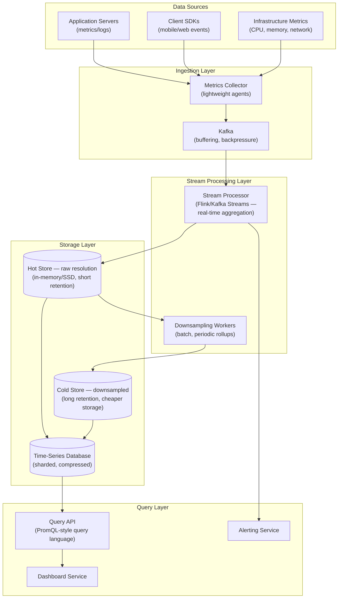
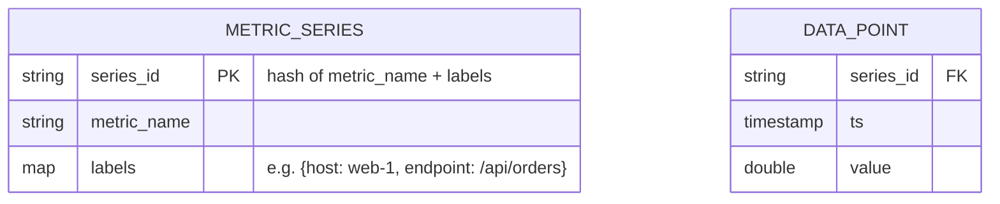
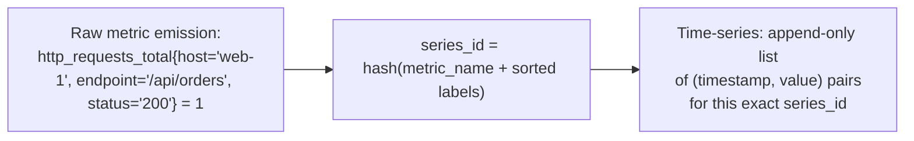
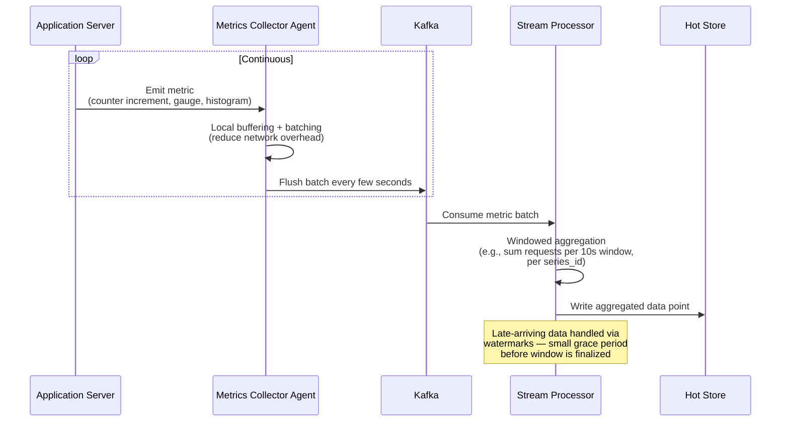
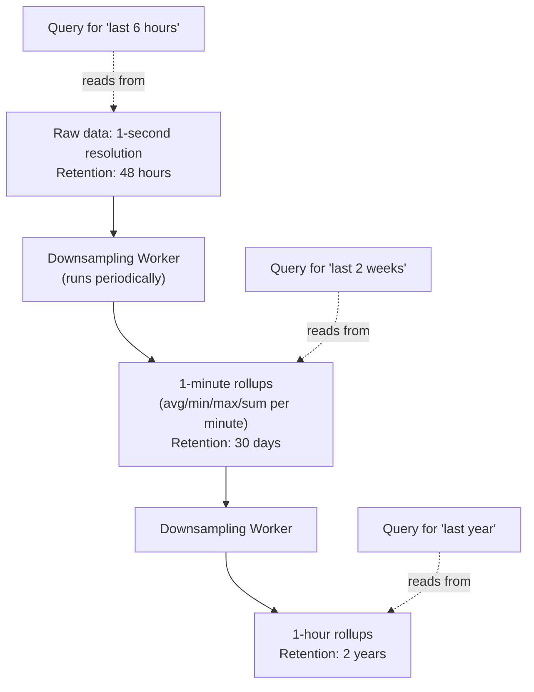
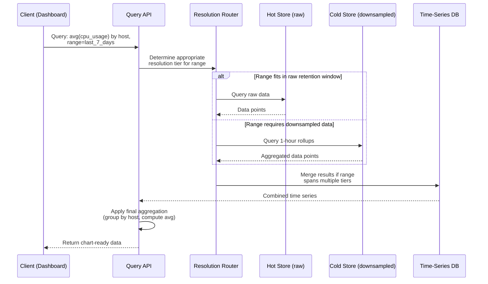
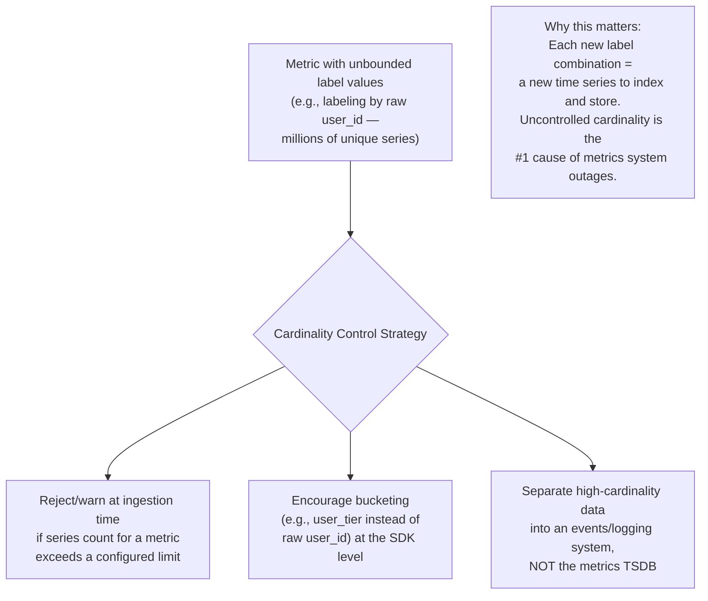
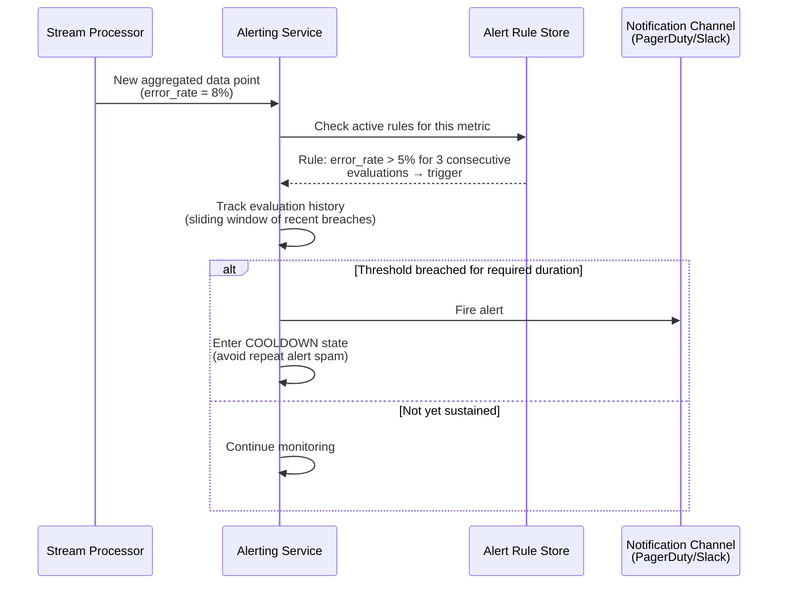
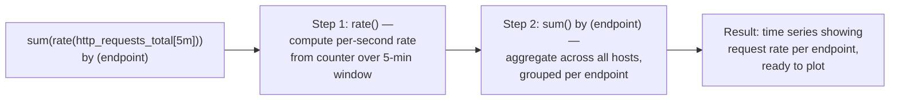
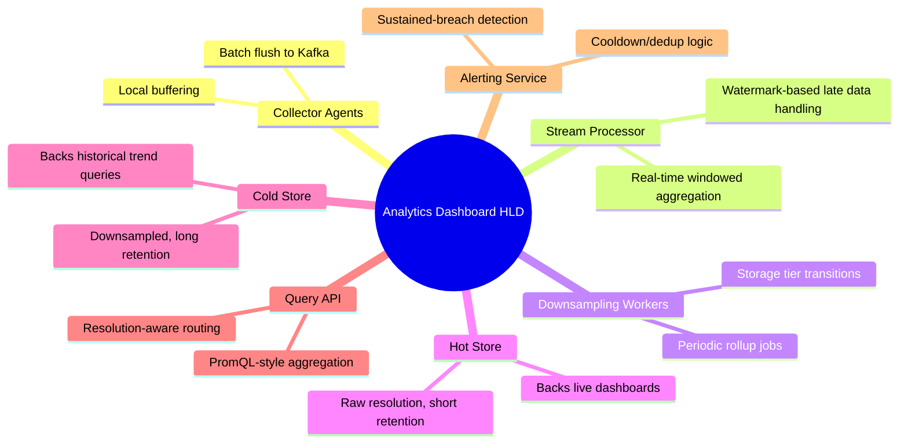

# Design an Analytics/Metrics Dashboard System — High-Level Design Document

## 1. Requirements

### Functional Requirements
- Ingest high-volume event/metric data from many sources (app servers, clients, IoT devices)
- Support flexible aggregations (sum, count, avg, percentiles) over arbitrary time windows
- Real-time dashboards (near-live metrics, e.g., "requests in the last 5 minutes")
- Historical trend analysis (metrics over days/months/years)
- Alerting based on threshold breaches

### Non-Functional Requirements
- **High write throughput:** Millions of data points/sec ingested
- **Query latency:** Dashboard queries should render in < 1-2 seconds, even over large time ranges
- **Storage efficiency:** Raw granular data doesn't need to be retained forever — older data can be downsampled
- **Availability over strict consistency:** A slightly delayed metric is fine; a dashboard outage during an incident is not
- **Cardinality handling:** Must gracefully handle metrics with many unique label combinations (e.g., per-user, per-endpoint)

### Back-of-Envelope Estimation
| Metric | Value |
|---|---|
| Data points ingested/sec | ~5M |
| Unique metric series (cardinality) | ~10M+ |
| Retention: raw resolution | 24-48 hours |
| Retention: downsampled (1-min) | 30 days |
| Retention: downsampled (1-hour) | 2 years |
| Dashboard queries/sec | ~10,000 |

---

## 2. High-Level Architecture

**Key idea:** Metrics data has a **temporal value gradient** — recent, high-resolution data is queried constantly (live dashboards) but only needs short retention, while old data is queried rarely but must be retained cheaply for long-term trends. The architecture explicitly tiers storage around this: hot (raw, recent), and cold (downsampled, long-retained) — rather than storing everything at full resolution forever.

---

## 3. Time-Series Data Model

**Key modeling concept — cardinality:** Each unique combination of metric name + label values creates a distinct time series. `http_requests_total` with labels for `host`, `endpoint`, and `status` across 1,000 hosts × 50 endpoints × 5 status codes = 250,000 distinct series just for one metric — this is why cardinality control is a first-class design concern, not an afterthought.

---

## 4. Ingestion & Real-Time Aggregation Flow

---

## 5. Downsampling Pipeline (Storage Tiering)

**Why this matters:** A dashboard showing a year-long trend doesn't need per-second granularity — the human eye can't distinguish it, and rendering millions of raw points would be both slow and visually meaningless. Downsampling trades granularity for storage efficiency and query speed exactly where it doesn't cost anything perceptually.

---

## 6. Query Flow — Detailed Sequence

---

## 7. Handling High Cardinality

---

## 8. Alerting Pipeline

*Alerting requires "sustained breach" logic (not firing on a single noisy spike) — a naive threshold check on every data point would generate constant false-positive pages from normal metric jitter.*

---

## 9. Query Language / Aggregation Model (PromQL-style)

---

## 10. Component Responsibilities Summary

---

## 11. Key Design Decisions & Tradeoffs

| Decision | Choice | Why |
|---|---|---|
| Storage tiering | Hot (raw, short retention) + Cold (downsampled, long retention) | Matches storage cost/query patterns to actual value of data at different ages |
| Aggregation timing | Stream processing (real-time) + batch downsampling (periodic) | Real-time dashboards need live aggregation; long-term rollups don't need to be instant |
| Cardinality control | Enforced limits + architectural separation from logging systems | Uncontrolled label cardinality is the most common cause of metrics system failure at scale |
| Consistency model | Eventual, with brief ingestion delay | A metrics dashboard being a few seconds stale is acceptable; blocking on strict consistency would hurt availability for no real benefit |
| Alert evaluation | Sustained-breach windows, not single-point triggers | Prevents alert fatigue from normal metric noise/spikes |
| Query resolution routing | Automatic tier selection based on time range | Keeps queries fast by never pulling more granularity than the range/chart actually needs |

---

## 12. Bottlenecks & Scaling Considerations

- **Cardinality explosion** — the single biggest operational risk; needs proactive limits at ingestion (reject or aggregate away high-cardinality labels) rather than discovering the problem after storage/query performance degrades.
- **Hot store write throughput** — millions of data points/sec requires a write-optimized storage engine (LSM-tree based, like many purpose-built TSDBs) rather than a general-purpose relational database.
- **Late-arriving data** — mobile/IoT clients with intermittent connectivity may submit data well after its actual timestamp; stream processing watermarks must balance waiting for stragglers against not delaying window finalization indefinitely.
- **Downsampling job backlog** — if downsampling workers fall behind, hot-store retention windows can fill up before older data is safely rolled up and archived; needs monitoring and priority scaling of this pipeline stage specifically.
- **Query fan-out for wide aggregations** — a query aggregating "by host" across 10,000 hosts touches many underlying series; needs efficient parallel scan/merge within the TSDB rather than sequential series-by-series querying.
- **Dashboard query storms** — many users loading the same popular dashboard simultaneously (e.g., during an incident, when everyone checks the same graphs) benefits heavily from query result caching with short TTLs.
- **Alert flapping** — metrics oscillating right around a threshold can cause repeated alert fire/resolve cycles; hysteresis (different thresholds for firing vs resolving) helps stabilize this beyond just the sustained-window requirement.
