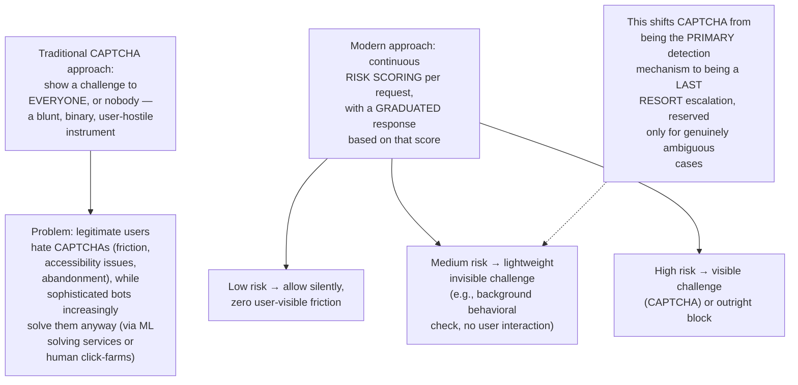
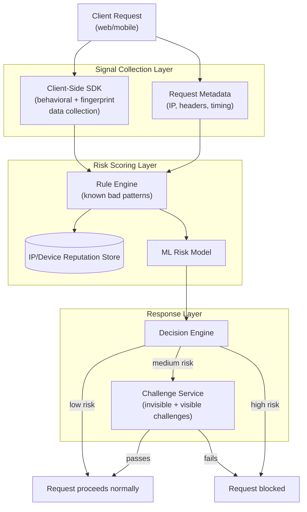
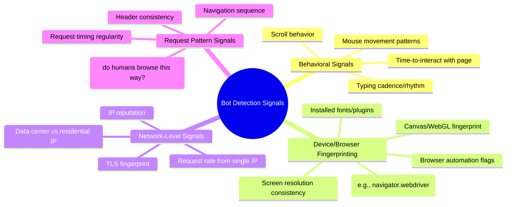
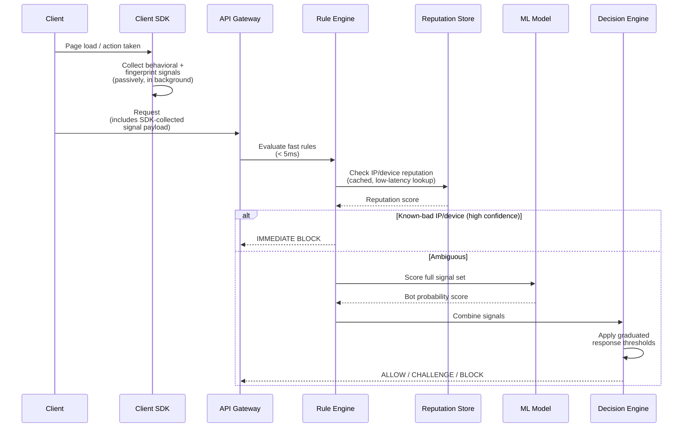
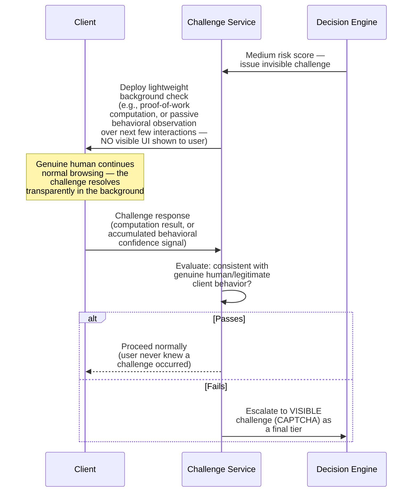
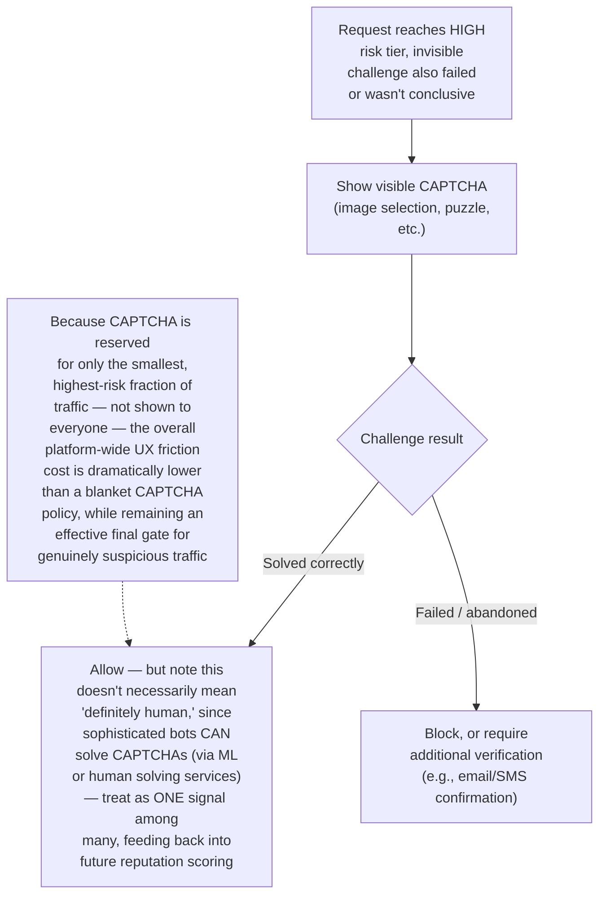
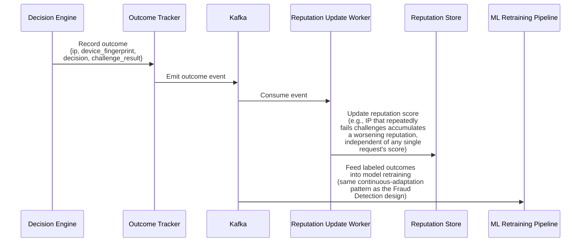
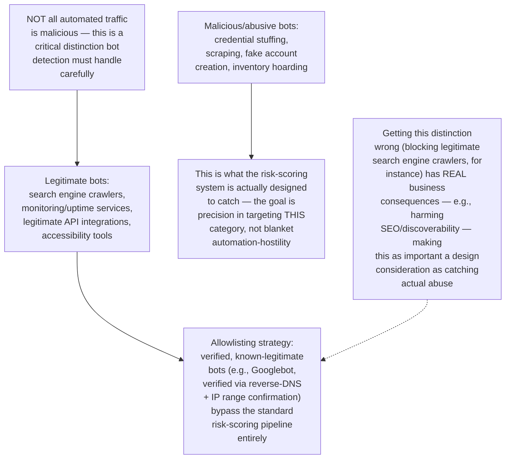
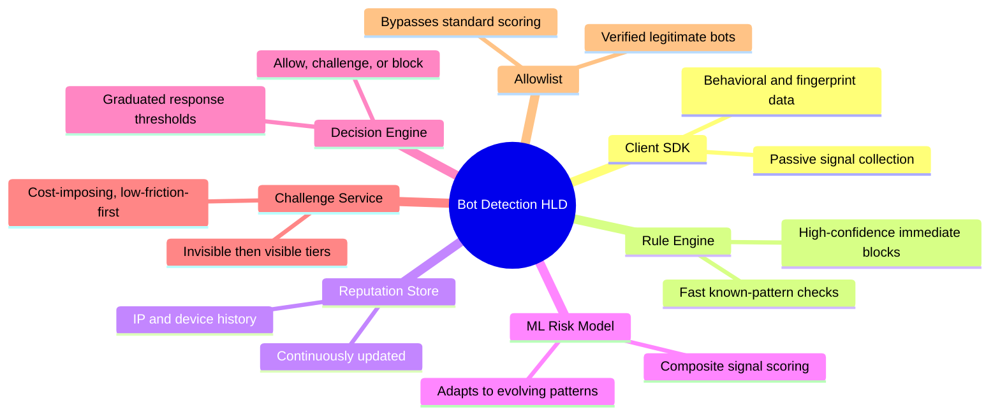

# Design a Bot Detection / CAPTCHA-Alternative System at Scale — High-Level Design Document

## 1. Requirements

### Functional Requirements
- Distinguish genuine human traffic from automated bot traffic across web/app requests
- Provide a graduated response — not every suspicious request needs a hard block; some warrant a lightweight challenge
- Support multiple detection signals: behavioral, device/browser fingerprinting, network-level indicators
- Minimize friction for legitimate users while effectively blocking automated abuse

### Non-Functional Requirements
- **Low false-positive rate:** Blocking genuine human users is a severe UX and business cost — must be weighed as seriously as missing actual bots
- **Low latency:** Detection must add minimal overhead to normal request processing, since it runs on a huge fraction of platform traffic
- **Adversarial resilience:** Like fraud detection, this is an active arms race — sophisticated bots specifically try to evade detection
- **Scale:** Must evaluate essentially every incoming request across the platform, not just a sampled subset

### Back-of-Envelope Estimation
| Metric | Value |
|---|---|
| Requests/sec evaluated (platform-wide) | Hundreds of thousands to millions |
| Bot traffic (industry typical estimate) | 20-40%+ of raw internet traffic, varies hugely by endpoint type |
| Detection latency budget | Single-digit to low tens of milliseconds |
| Challenge friction cost | Must be weighed against genuine security value — every CAPTCHA shown has a real conversion/UX cost |

---

## 2. The Core Philosophy — Graduated Response, Not Binary Block/Allow

---

## 3. High-Level Architecture

**Key idea:** This shares significant architectural DNA with the Fraud Detection design — a fast, synchronous, latency-critical scoring decision combining rules, reputation data, and ML — but the RESPONSE mechanism is fundamentally different: fraud detection has only approve/decline/review, while bot detection has an intermediate "challenge" option that lets genuinely ambiguous traffic self-resolve (a human easily passes a lightweight challenge; a simple bot typically doesn't).

---

## 4. Signal Categories

**Why NO single signal is sufficient alone:** Any individual signal can be spoofed by a sufficiently motivated attacker (residential proxies defeat IP reputation, headless browser tools can fake some fingerprints, replay tools can simulate mouse movement) — but SPOOFING ALL SIGNALS SIMULTANEOUSLY AND CONSISTENTLY is significantly harder and more expensive, which is precisely why combining many independent, cheap-to-collect signals into one composite score is the effective strategy, rather than betting everything on one supposedly bulletproof check.

---

## 5. Real-Time Scoring Flow — Detailed Sequence

---

## 6. Invisible Challenge Flow (Medium Risk)

**Why invisible challenges are preferred over jumping straight to CAPTCHA:** A proof-of-work style computational challenge, for instance, is trivially fast for a normal user's device but adds meaningful COST when performed at the scale a bot operator needs (thousands/millions of requests) — this raises the bot's operating cost without ever showing the legitimate user any interruption at all, making it a strictly better tradeoff than CAPTCHA for the medium-risk tier.

---

## 7. Visible Challenge (CAPTCHA) as Last Resort

---

## 8. Reputation Feedback Loop

---

## 9. Handling Legitimate Automated Traffic (The Nuance This System Must Get Right)

---

## 10. Component Responsibilities Summary

---

## 11. Key Design Decisions & Tradeoffs

| Decision | Choice | Why |
|---|---|---|
| Response model | Graduated (allow/invisible-challenge/CAPTCHA/block), not binary | Minimizes friction for the vast legitimate-user majority while reserving maximum friction for genuinely high-risk traffic only |
| Detection approach | Combined multi-signal scoring, no single signal trusted alone | Any individual signal is spoofable; consistently spoofing ALL signals simultaneously is a much higher bar for attackers |
| Challenge escalation order | Invisible (proof-of-work/behavioral) before visible (CAPTCHA) | Imposes real cost on bot operators without any UX friction for legitimate users in the common case |
| Legitimate bot handling | Explicit allowlisting for verified crawlers/integrations | Avoids the real business cost of inadvertently blocking beneficial automated traffic like search engine indexing |
| Continuous adaptation | Reputation feedback loop + ML retraining | Same adversarial-arms-race reality as fraud detection — static rules alone become stale as attackers adapt |
| CAPTCHA role | Last-resort tier, not primary detection mechanism | Reflects the reality that sophisticated bots increasingly solve CAPTCHAs; it's one signal among many, not a definitive human/bot proof |

---

## 12. Bottlenecks & Scaling Considerations

- **Signal collection overhead on client devices** — extensive behavioral/fingerprint collection can impact page load performance and battery life on client devices; needs careful engineering to remain lightweight and non-blocking, collected asynchronously rather than delaying the user-visible page render.
- **Reputation store as a high-traffic dependency** — since nearly every request triggers a reputation lookup, this store faces the same criticality and scaling requirements as the feature store in the Fraud Detection design — low latency, high availability, on the critical path of essentially all traffic.
- **Adversarial evolution requiring continuous investment** — like fraud detection, this is fundamentally an ongoing arms race, not a solved problem; sophisticated bot operators actively study and adapt to detection signals, meaning the ML model and rule set require continuous, dedicated investment rather than being a one-time build.
- **False positive cost at scale** — even a small false-positive rate (e.g., 0.1%) translates to a large absolute number of legitimate users experiencing unnecessary friction at high traffic volumes; requires ongoing monitoring of false-positive rate specifically, not just overall detection effectiveness, and mechanisms for affected users to report/appeal incorrect blocks.
- **Distributed/residential proxy networks** — sophisticated bot operations increasingly route traffic through large networks of residential IP addresses (making IP-reputation-based detection far less effective), pushing detection weight increasingly toward behavioral and fingerprinting signals rather than network-level signals alone.
- **Privacy and regulatory considerations** — extensive behavioral tracking and device fingerprinting for bot detection purposes intersects with privacy regulations (GDPR, CCPA); the signal collection approach needs to be designed with these constraints in mind from the start, not retrofitted later, potentially connecting to the GDPR Deletion System design for how this collected signal data itself must be handled.
- **Mobile app-specific considerations** — mobile environments have different available signals (device attestation APIs, app integrity checks) compared to web browsers, requiring a meaningfully different signal collection strategy per platform rather than a single unified approach across web and native app traffic.
