# Design a Change Data Capture (CDC) Pipeline — High-Level Design Document

## 1. Requirements

### Functional Requirements
- Capture every insert, update, and delete happening in a source database, in the exact order they occurred
- Stream these changes to downstream consumers (search indexes, caches, analytics warehouses, other microservices)
- Preserve transactional boundaries where relevant (changes from a single source transaction should be identifiable as a group)
- Support multiple independent downstream consumers reading the same change stream

### Non-Functional Requirements
- **Low source impact:** Capturing changes must NOT meaningfully degrade the performance of the source production database
- **No missed changes:** Every committed change must eventually reach downstream consumers — this is a durability/completeness requirement
- **Low latency:** Changes should propagate to downstream systems within seconds, not minutes
- **Ordering guarantee:** Changes to the same row must be delivered downstream in the same order they were committed at the source

### Back-of-Envelope Estimation
| Metric | Value |
|---|---|
| Source database write rate | ~10,000-50,000 changes/sec |
| CDC propagation latency target | < 1-5 seconds |
| Downstream consumers | Multiple independent (search, cache, analytics, other services) |
| Change event size | ~500 bytes - few KB (depending on row size) |

---

## 2. The Core Design Choice — Log-Based CDC vs Query-Based Polling

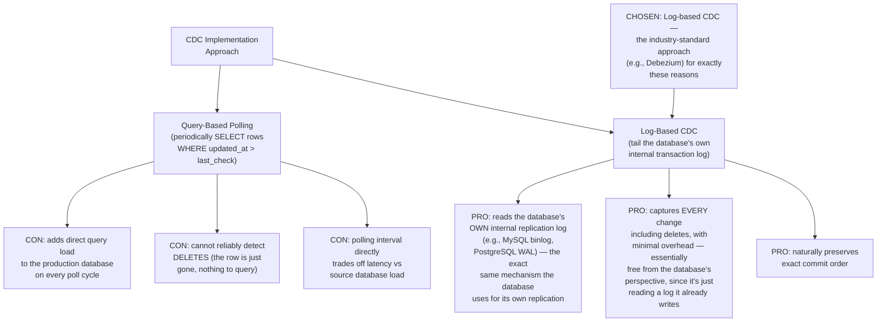

**Why log-based CDC is almost universally preferred in production:** Every transactional database already maintains an internal write-ahead log for its own crash recovery and replication purposes (this connects directly to the WAL & Recovery System design). Log-based CDC simply taps into this existing, already-durable, already-ordered stream — rather than adding new query load or missing deletes entirely, as polling-based approaches do.

---

## 3. High-Level Architecture

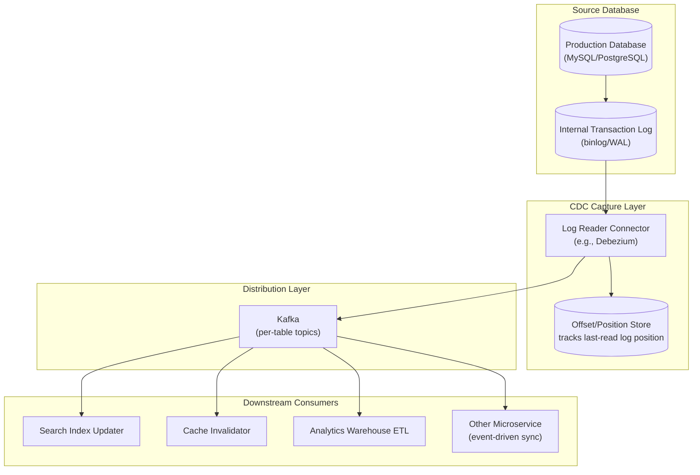

**Key idea:** The Log Reader Connector is the only component that ever touches the source database directly — and it does so by reading a log the database was already writing anyway, not by issuing queries against live tables. Everything downstream consumes from Kafka, completely decoupled from the source database's load and availability.

---

## 4. Data Model — Change Event Structure

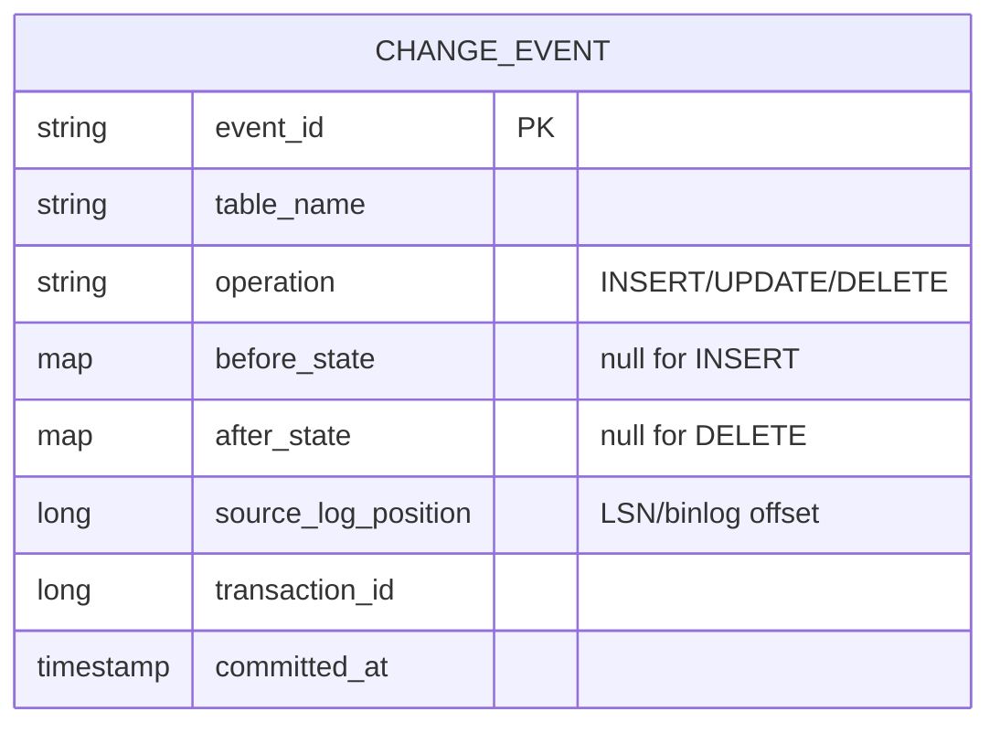

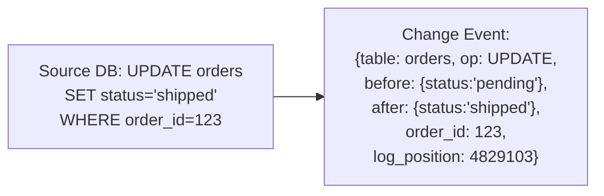

**Why both before and after state matter:** Downstream consumers often need more than just "this changed" — a cache invalidator just needs the key, but an analytics pipeline computing "time in each order status" needs the before-state to calculate duration, and audit/compliance consumers need the full before/after diff for record-keeping.

---

## 5. Change Capture Flow — Detailed Sequence

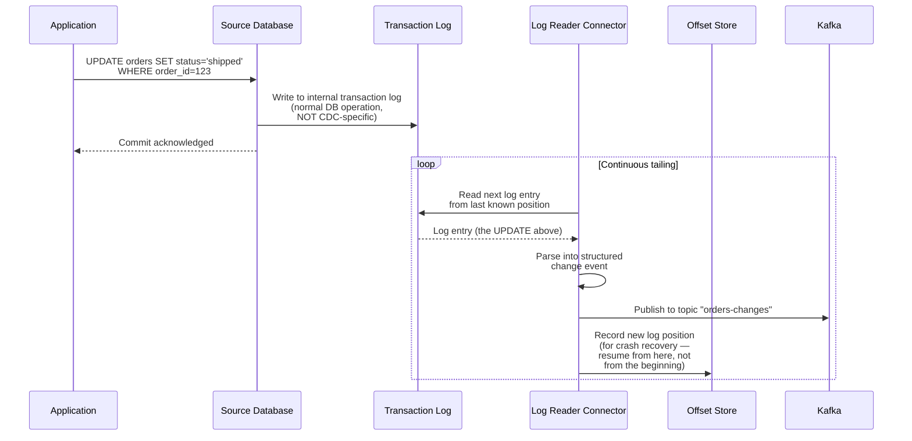

---

## 6. Handling Initial Snapshot (Bootstrapping)

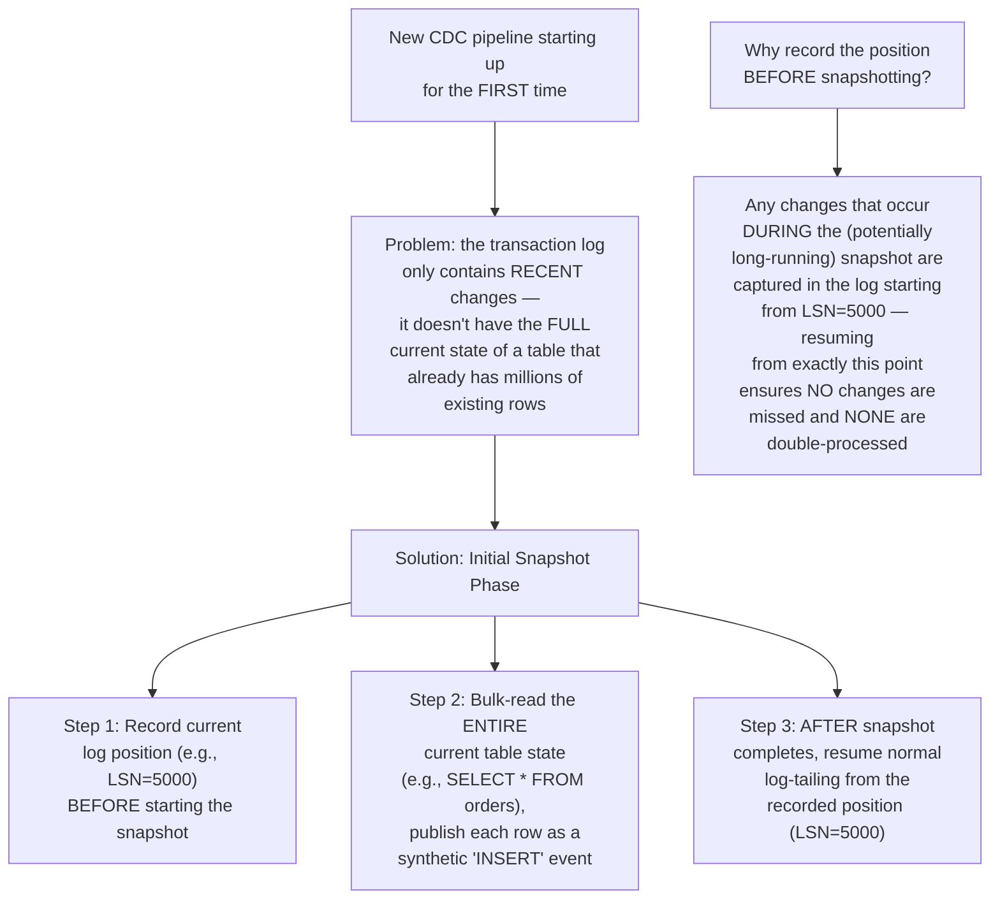

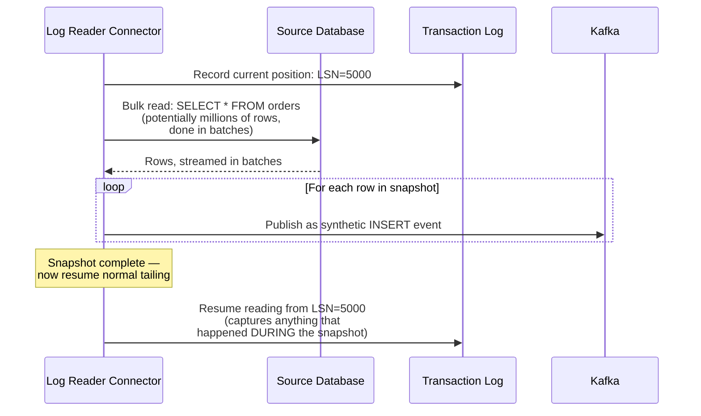

---

## 7. Ordering Guarantees Across Multiple Tables/Partitions

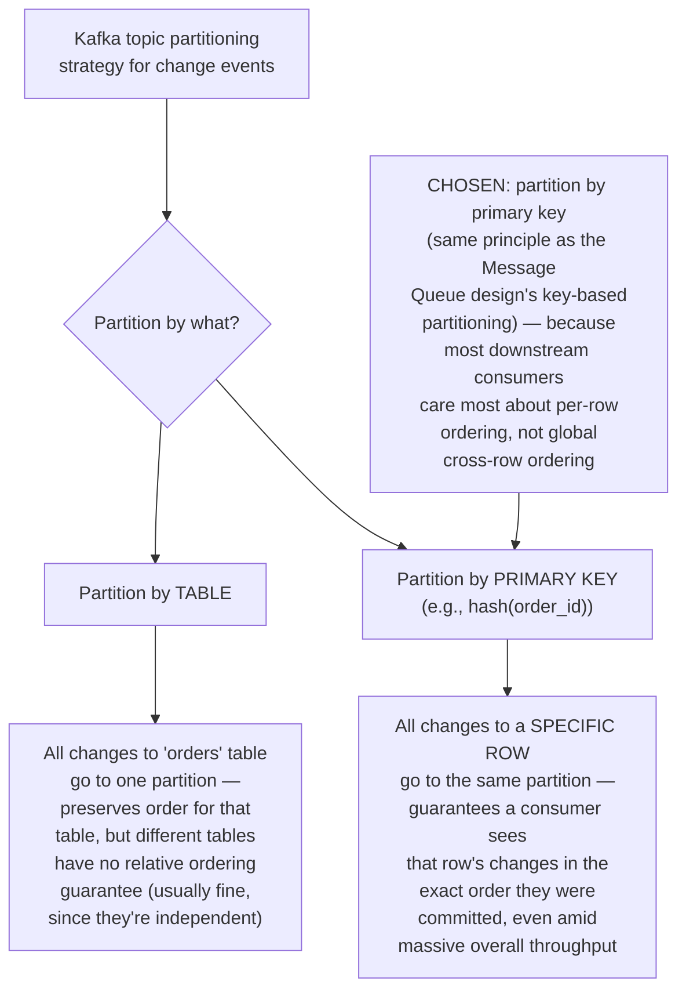

---

## 8. Handling Source Database Failover

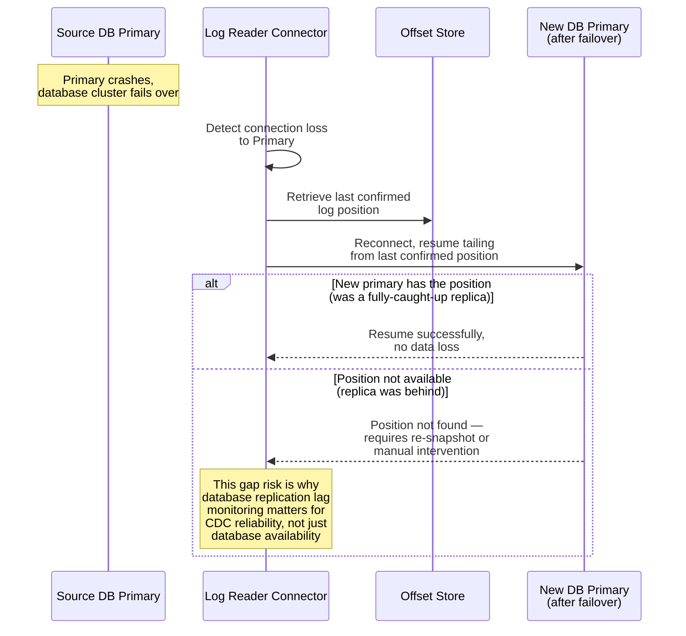

---

## 9. Downstream Consumer Patterns

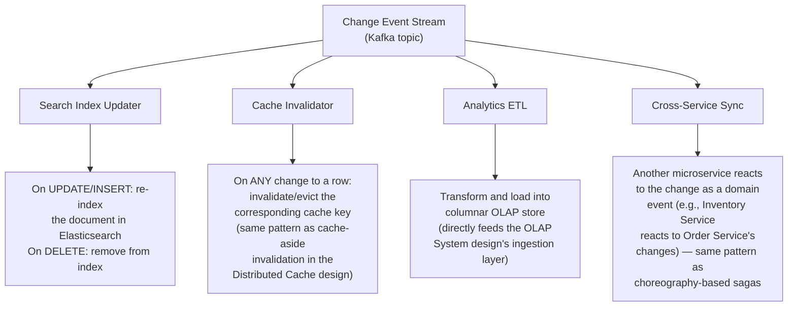

*This is precisely why CDC is such a foundational infrastructure pattern — it's the underlying mechanism that powers cache invalidation, search indexing, OLAP ingestion, and event-driven microservice communication, all from a single, low-overhead capture point at the source database.*

---

## 10. Component Responsibilities Summary

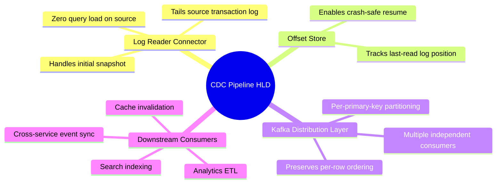

---

## 11. Key Design Decisions & Tradeoffs

| Decision | Choice | Why |
|---|---|---|
| Capture mechanism | Log-based (tail transaction log), not query polling | Near-zero source database overhead, captures deletes correctly, naturally preserves commit order |
| Initial data load | Snapshot-then-tail with recorded position boundary | Ensures no changes are missed or double-processed during the transition from snapshot to live tailing |
| Event partitioning | By primary key (row identity) | Guarantees per-row change ordering for consumers, which is the ordering guarantee that actually matters for most use cases |
| Distribution layer | Kafka, decoupling source from consumers | Multiple independent downstream systems can consume the same change stream without adding load back to the source database |
| Position tracking | Persistent offset store, resumable on restart/failover | Enables crash-safe recovery without needing to re-snapshot the entire source database |

---

## 12. Bottlenecks & Scaling Considerations

- **Source database log retention** — the transaction log itself typically has limited retention (databases don't keep it forever); if the CDC connector falls too far behind or is down too long, the needed log segments may have been purged, forcing a full re-snapshot — monitoring connector lag relative to log retention window is critical.
- **Large table initial snapshot time** — bootstrapping CDC for a table with billions of existing rows can take a very long time; needs to be done in a way that doesn't overwhelm the source database (throttled, batched reads) and should ideally run during lower-traffic periods for the first deployment.
- **Schema change handling** — when the source table's schema changes (column added/removed/renamed), the CDC pipeline must handle this gracefully — typically by also capturing schema-change events from the log and propagating schema evolution to downstream consumers rather than breaking silently.
- **Downstream consumer lag** — if a consumer (e.g., the search indexer) falls behind the change stream, Kafka's durable buffering (same pattern as the general Message Queue design) absorbs this without data loss, but monitoring per-consumer lag is essential to catch systemic issues before they become large backlogs.
- **Multi-table transaction atomicity downstream** — if a single source transaction modified multiple tables atomically, but those tables' change events land in different Kafka partitions/topics, downstream consumers reconstructing "what happened in this transaction" need the shared transaction_id to correlate related events — this correlation logic must be deliberately preserved through the pipeline, not assumed.
- **Connector high availability** — the Log Reader Connector itself is a critical single point in the pipeline; production deployments typically run it with failover capability (though usually as an active-passive pair, since only one instance should be tailing the log at a time to avoid duplicate event production).
- **Cost of maintaining exactly-once semantics end-to-end** — while the source log-tailing itself is naturally ordered and complete, guaranteeing downstream consumers process each event exactly once (not just at-least-once) requires the same idempotency patterns covered in the Idempotent API Requests design — CDC delivers reliable at-least-once delivery, and consumers are responsible for their own deduplication.
