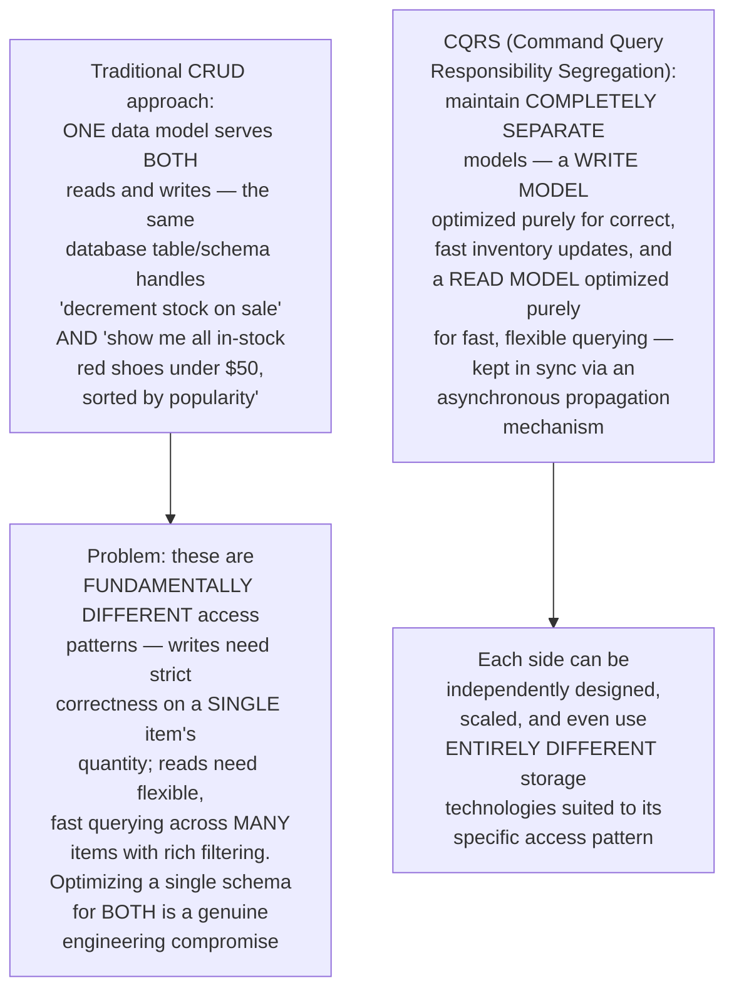
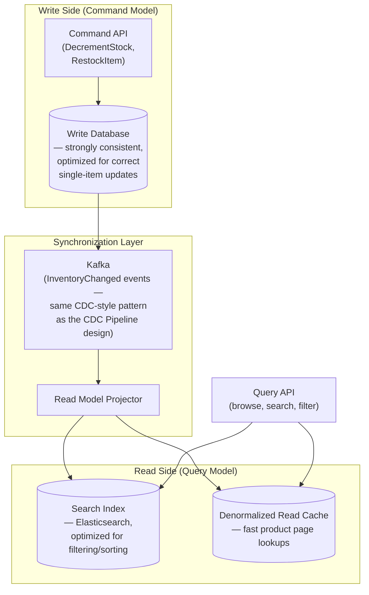
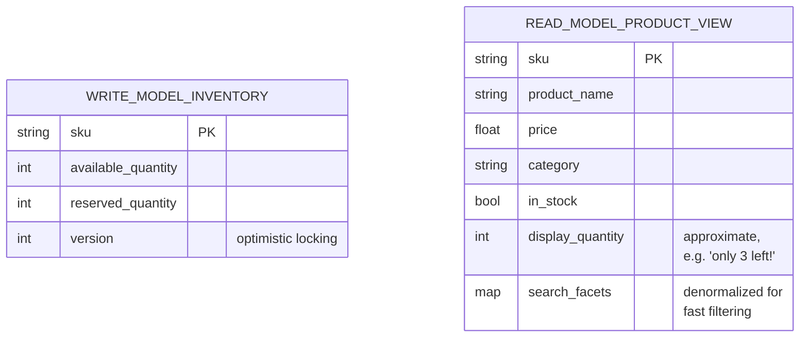
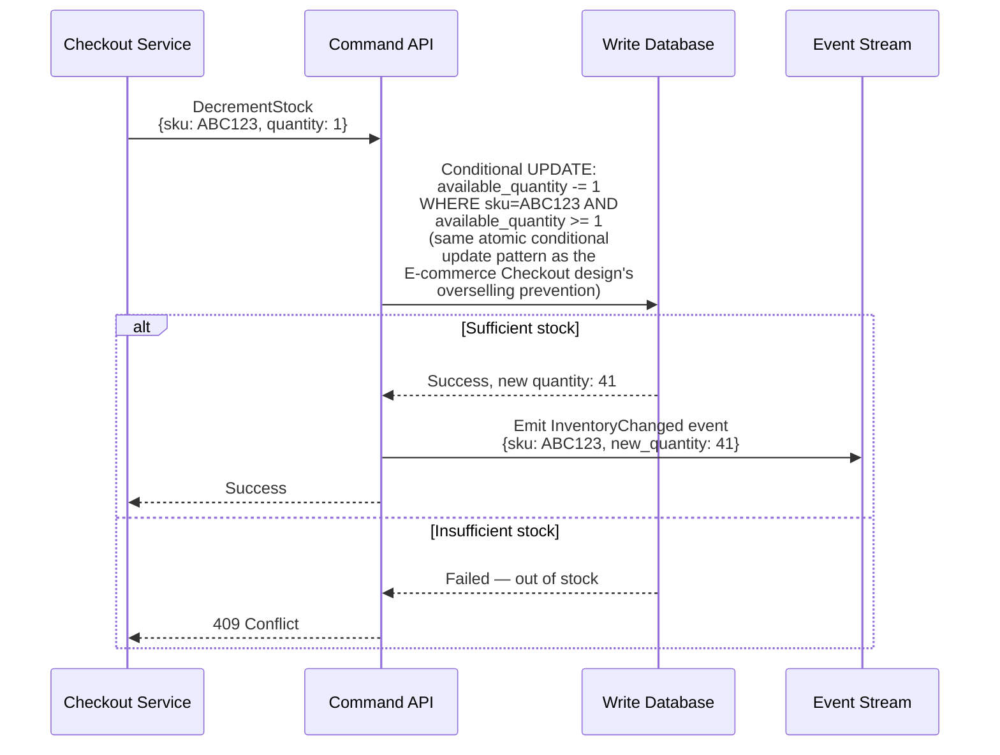
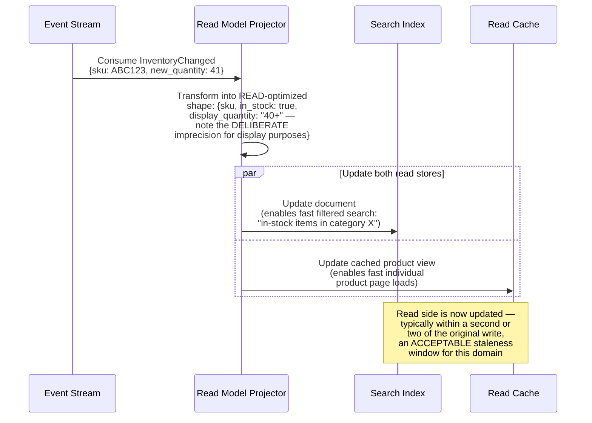
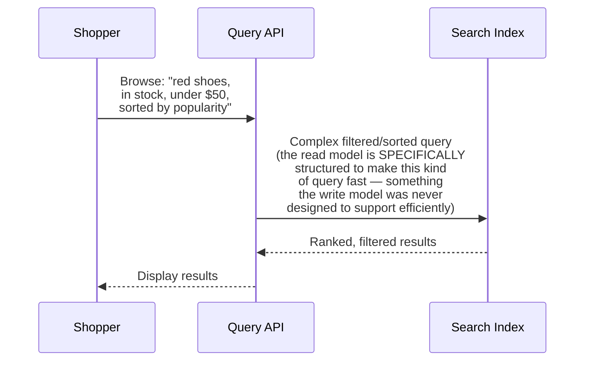
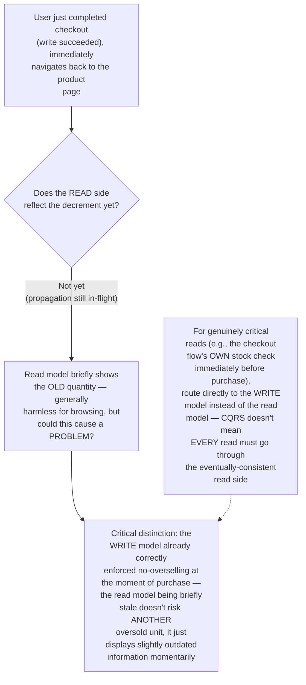
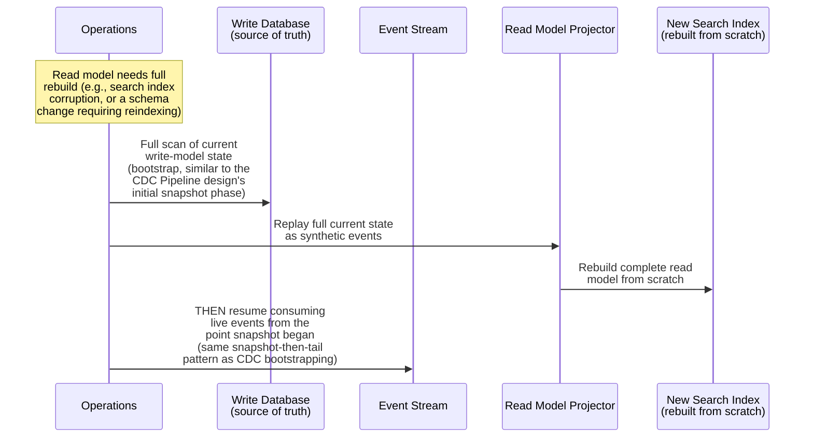
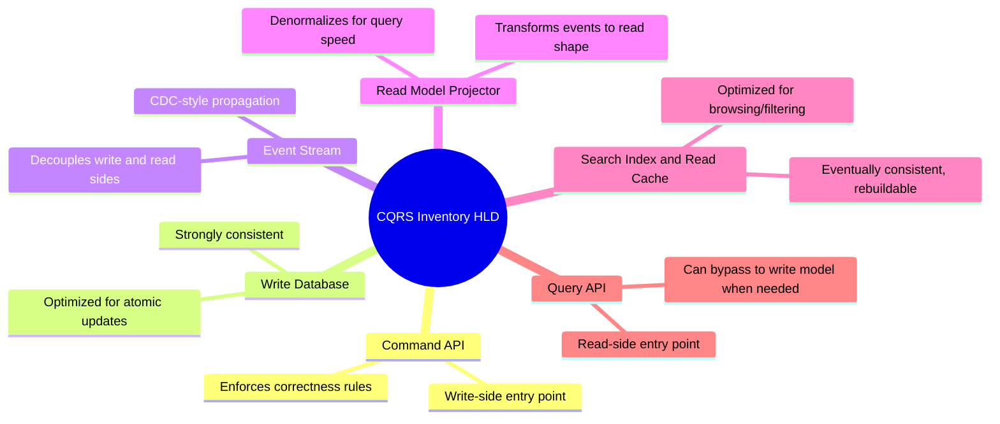

# Design a CQRS-Based Architecture for a High-Write, High-Read E-commerce Inventory System — High-Level Design Document

## 1. Requirements

### Functional Requirements
- Handle extremely high-frequency inventory WRITES (stock decrements on every sale, restocks, adjustments)
- Serve extremely high-frequency inventory READS (product pages checking "in stock?", search filters, browsing) with very different query patterns than the writes
- Support complex read queries (e.g., "show all in-stock items in category X, sorted by price") that don't map naturally to the write model's structure
- Maintain acceptable consistency between what's written and what's eventually readable

### Non-Functional Requirements
- **Independent scaling of reads and writes:** Read and write traffic patterns and volumes are fundamentally different at this scale — they shouldn't be forced to share the same infrastructure/scaling constraints
- **Write correctness (paramount):** Inventory decrements must never allow overselling — this is a hard business correctness requirement
- **Read performance:** Product browsing/search must be fast, even though the underlying write model isn't optimized for these complex read patterns
- **Acceptable read staleness:** A brief delay between a write and its visibility in read queries is generally tolerable for this domain (unlike, say, a bank balance)

### Back-of-Envelope Estimation
| Metric | Value |
|---|---|
| Inventory writes/sec (sales events) | Thousands, spiking during flash sales |
| Inventory reads/sec (browsing/search) | Hundreds of thousands — orders of magnitude more than writes |
| Read/write ratio | Extremely read-heavy, but WRITES are correctness-critical |
| Read staleness tolerance | Seconds typically acceptable |

---

## 2. The Core Principle — Separate Models for Reading and Writing

---

## 3. High-Level Architecture

**Key idea:** The Write Database is a small, simple, strongly-consistent store optimized for exactly one thing — correctly updating a single item's quantity without overselling. The Read Side is entirely separate, denormalized, and optimized for the genuinely different query patterns real users need (browsing, filtering, search) — connected only by an asynchronous event stream, the same CDC-style mechanism covered in the dedicated CDC Pipeline design.

---

## 4. Data Model

**Why the read model is deliberately DENORMALIZED and even slightly APPROXIMATE:** The write model needs an EXACT quantity for correctness (never oversell). The read model, however, only needs a reasonably fresh "in stock" boolean and a display quantity that might legitimately be a few seconds stale ("only 3 left!" might actually be 2 by the time you click, and that's an acceptable, common e-commerce UX pattern) — this deliberate relaxation of consistency on the read side is precisely what allows it to be optimized purely for query speed and flexibility.

---

## 5. Write Flow (Command Side) — Detailed Sequence

---

## 6. Read Model Projection Flow — Detailed Sequence

---

## 7. Query Flow (Read Side) — Detailed Sequence

**Why this query would be awkward and slow against the write model directly:** The write model's schema is optimized for "atomically update ONE item's quantity correctly" — it has no denormalized category/price/popularity indexing, no search-optimized structure. Forcing this kind of rich, multi-dimensional filtered query against a schema designed for single-item transactional correctness would require expensive joins/scans that a purpose-built search index avoids entirely.

---

## 8. Handling the Consistency Gap (Read-Your-Writes for Checkout)

**Why this hybrid read-routing matters:** A well-designed CQRS system doesn't dogmatically route ALL reads through the read model — for the specific, narrow case where a read feeds directly into a correctness-critical decision (like the actual stock check during checkout), querying the strongly-consistent write model directly is the right choice, while the vast majority of browsing/search reads happily use the faster, eventually-consistent read model.

---

## 9. Handling Read Model Rebuild (Disaster Recovery / Schema Changes)

**Why this rebuild capability is a genuine advantage of CQRS's architectural separation:** Because the write model remains the unambiguous source of truth and the read model is EXPLICITLY understood to be a derived, rebuildable projection, the system can always recover from read-side corruption or evolve the read model's schema by simply reprocessing from the write model — a capability that's much harder to achieve cleanly in a single-shared-model architecture where "source of truth" and "query interface" are the same tightly-coupled thing.

---

## 10. Component Responsibilities Summary

---

## 11. Key Design Decisions & Tradeoffs

| Decision | Choice | Why |
|---|---|---|
| Architecture pattern | CQRS — fully separate write and read models | Read and write access patterns are fundamentally different; forcing one shared schema to serve both is a real engineering compromise this pattern eliminates |
| Write model design | Simple, strongly consistent, optimized purely for correctness | The one non-negotiable requirement — never oversell — deserves a purpose-built, uncompromised model |
| Read model design | Denormalized, search-optimized, eventually consistent | Optimized purely for the actual query patterns users need (browse, filter, search), independent of write-side constraints |
| Synchronization | Async event stream (CDC-style) | Decouples the two sides' scaling and technology choices entirely, at the cost of a brief, generally acceptable staleness window |
| Consistency-critical reads | Selectively bypass to the write model | CQRS doesn't mandate ALL reads go through the eventually-consistent side — genuinely critical reads can and should query the source of truth directly |
| Read model recovery | Fully rebuildable from write-model replay | The read model's explicit status as a derived projection (not source of truth) enables clean disaster recovery and schema evolution |

---

## 12. Bottlenecks & Scaling Considerations

- **Propagation lag under write bursts** — during a flash sale with extremely high write volume, the event stream and projector may experience increased lag, widening the read-model staleness window beyond its normal few-seconds baseline; needs monitoring and independently scalable projector capacity, same operational concern as the CDC Pipeline design.
- **Read model rebuild time at scale** — for a catalog with millions of SKUs, a full read-model rebuild (Section 9) can take substantial time; needs efficient batch processing and ideally the ability to rebuild incrementally/in parallel rather than as a single long-running sequential job.
- **Dual-write consistency risk** — the write model update and the event emission (Section 5) must be atomically coupled (both happen, or neither does) — this is the same "transactional outbox" concern noted in the Distributed Transaction Saga design's dual-write problem, requiring careful implementation to avoid a write succeeding while its corresponding event is lost.
- **Multiple read models for different use cases** — beyond the single search-index example shown here, a real system might need SEVERAL distinct read models (e.g., one for search, one for a recommendation engine, one for analytics) all fed from the SAME write-side event stream — each optimized independently for its own specific query pattern, extending the core CQRS principle to multiple specialized read sides rather than just one.
- **Testing consistency guarantees** — because the system deliberately allows brief read-side staleness, testing must clearly distinguish between ACCEPTABLE staleness (browsing shows slightly outdated quantity) and UNACCEPTABLE inconsistency (the write model itself allowing overselling) — conflating these two very different correctness properties during testing/design review is a common and serious mistake.
- **Operational complexity increase** — CQRS introduces genuinely more moving parts (two models, a synchronization pipeline, monitoring for propagation lag) compared to a simple single-model CRUD system; this architectural complexity is a deliberate, worthwhile tradeoff specifically when read and write patterns are genuinely divergent at meaningful scale — applying CQRS to a system without this genuine access-pattern mismatch would add complexity without corresponding benefit.
