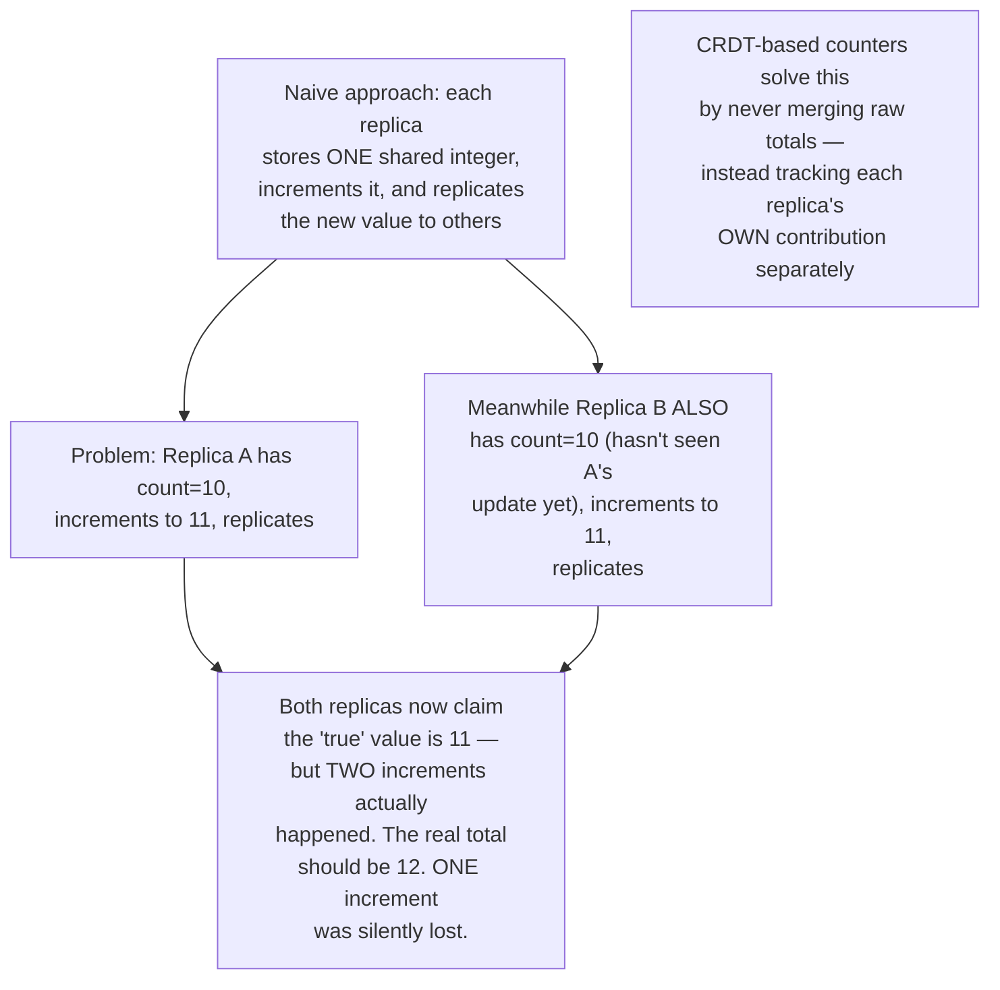
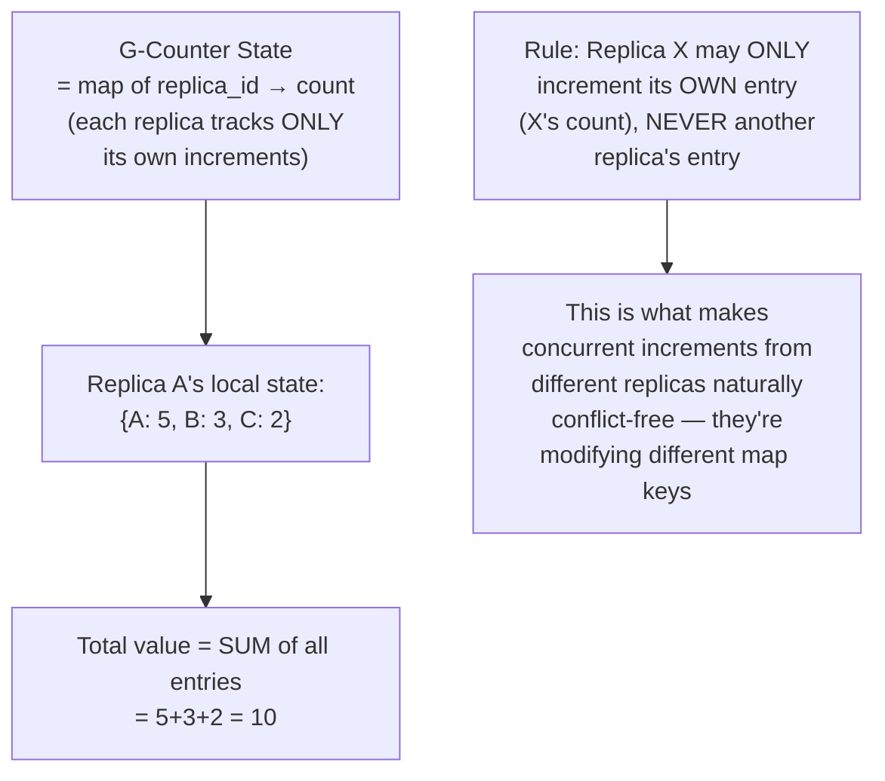
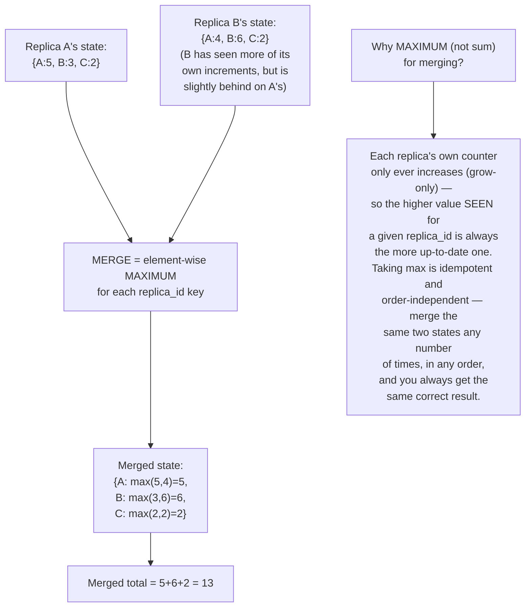
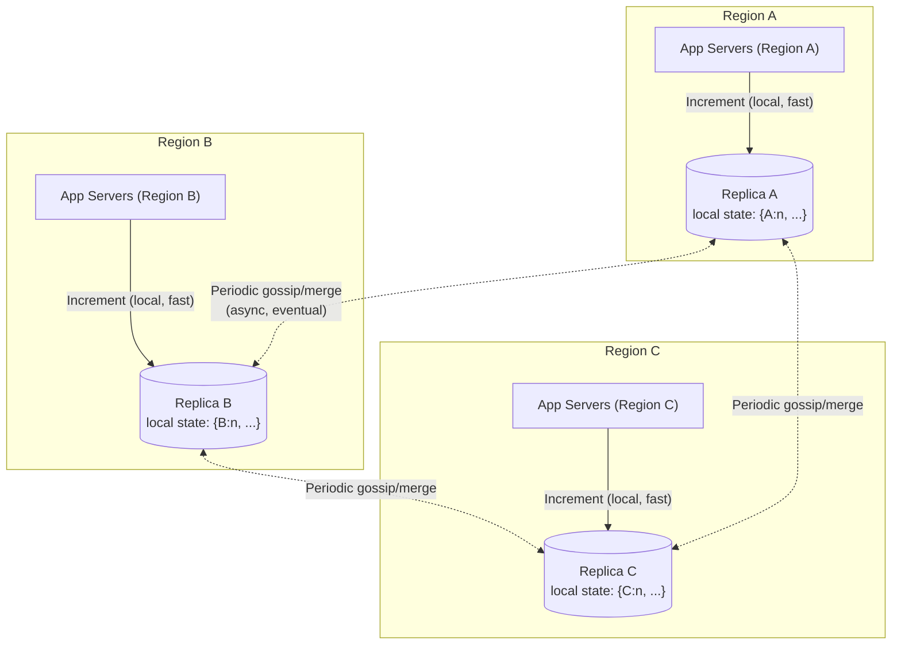
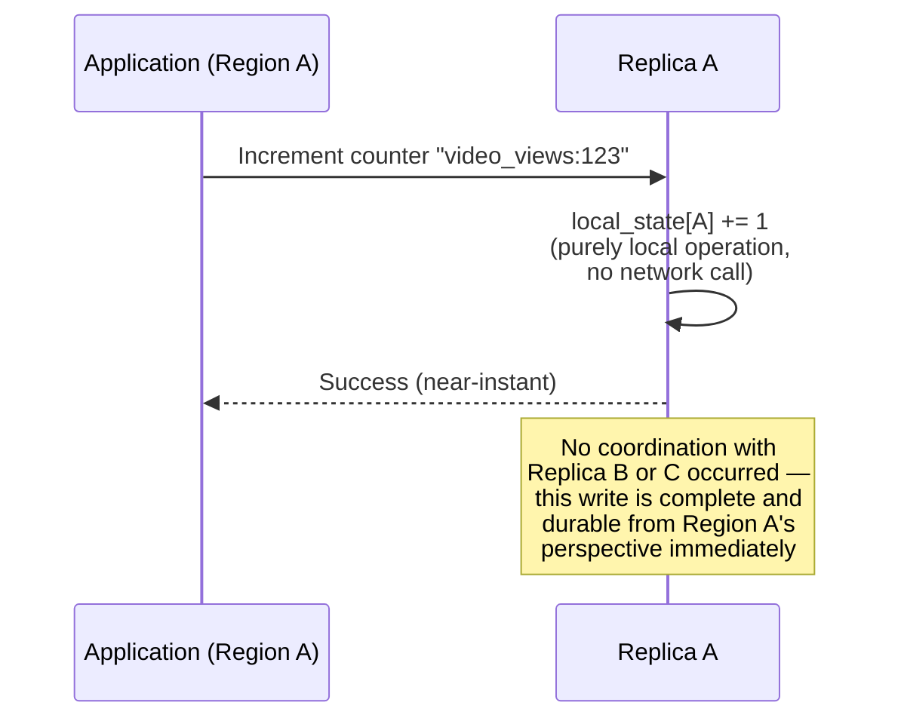
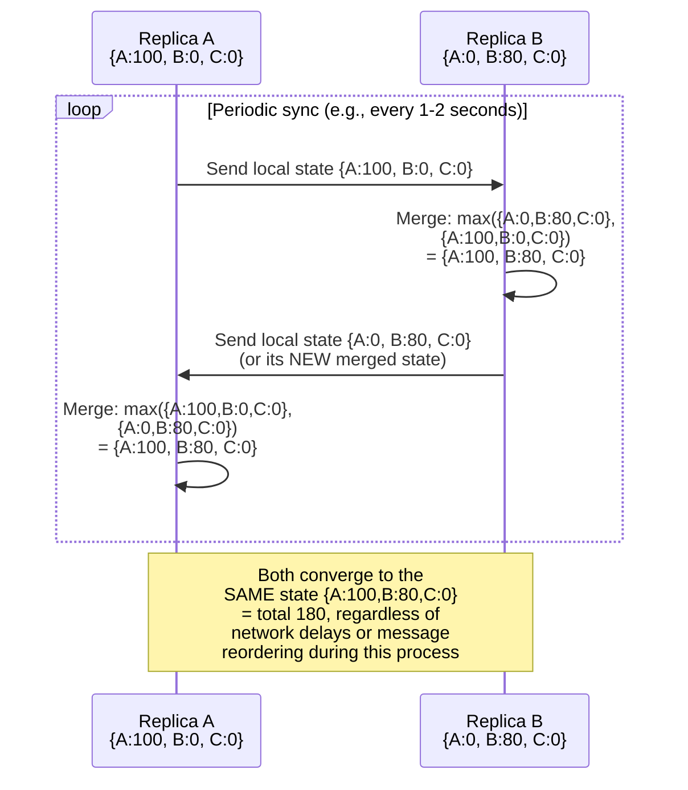
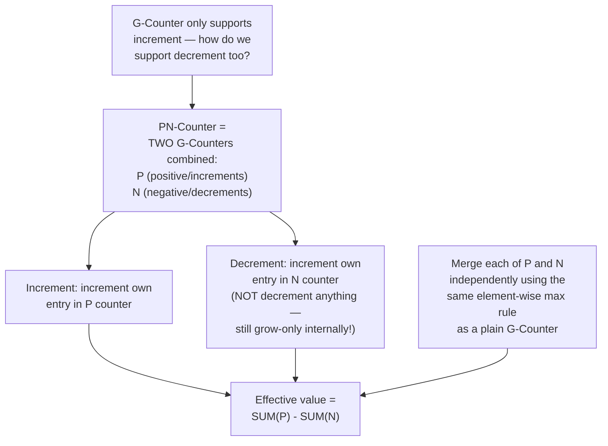
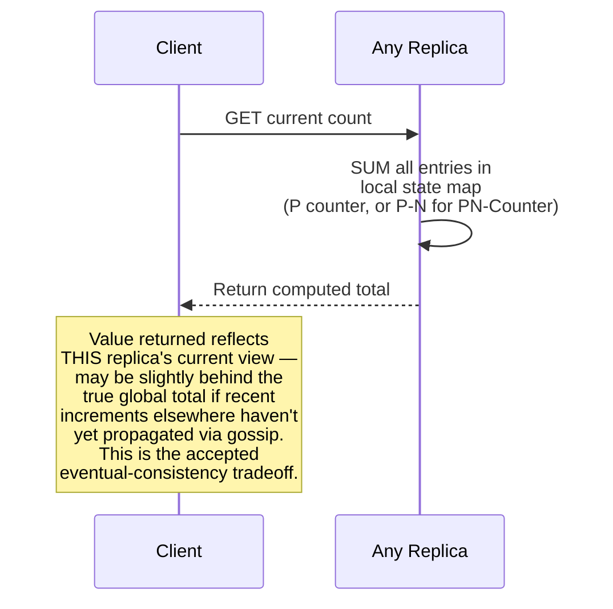
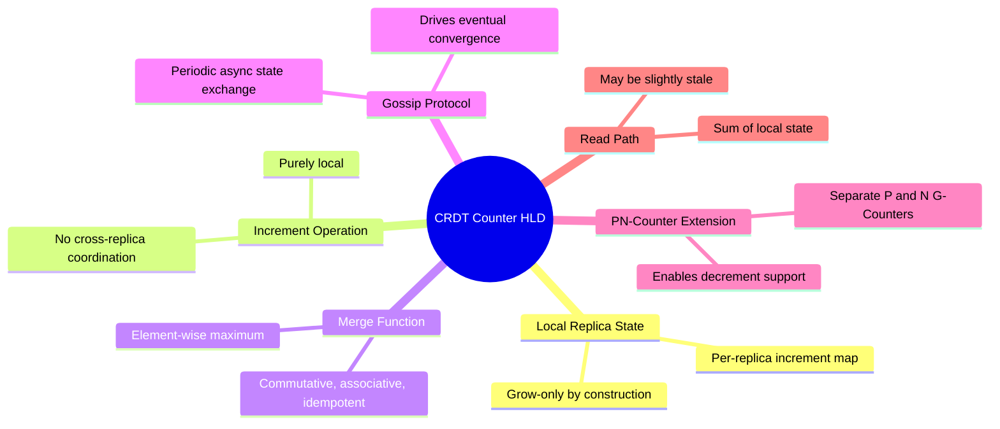

# Design a Distributed Counter (CRDT-based) — High-Level Design Document

## 1. Requirements

### Functional Requirements
- Increment/decrement a counter from any replica, with no single coordination point
- All replicas must eventually converge to the mathematically correct total, regardless of message ordering
- Support both increment-only counters (e.g., view counts) and increment/decrement counters (e.g., inventory-like tallies)
- Counter must remain available for writes even during network partitions between replicas

### Non-Functional Requirements
- **High availability:** Writes must succeed locally even if the replica is fully partitioned from all others
- **Eventual accuracy:** Once all replicas can communicate again, the merged total must be exactly correct — no lost or double-counted increments
- **Low latency:** Increments should be near-instant local operations, never blocked on cross-replica coordination
- **Scalability:** Must handle very high increment rates (e.g., viral content view counting) across many replicas

### Back-of-Envelope Estimation
| Metric | Value |
|---|---|
| Increments/sec (single hot counter, viral event) | ~100,000+ |
| Replicas | 3-20, spread across regions/data centers |
| Merge/sync frequency | Sub-second to a few seconds |
| Per-replica state size | O(number of replicas) — small and bounded |

---

## 2. The Core Problem — Why a Naive Distributed Counter Fails

---

## 3. G-Counter (Grow-Only Counter) — Core CRDT Structure

**Why this design eliminates the lost-update problem entirely:** Since each replica only ever increments its own dedicated counter within the map, there is no shared mutable value that two replicas could race on. The "total" is always just a derived sum — a read-time computation, never a stored value that needs coordinated updates.

---

## 4. Merge Operation — The Heart of the CRDT

**This is what makes it a CRDT (Conflict-free Replicated Data Type):** the merge function is **commutative** (order doesn't matter), **associative** (grouping doesn't matter), and **idempotent** (merging the same state twice doesn't cause double-counting) — these three mathematical properties together guarantee that no matter how or when replicas exchange state, they will always converge to the identical, correct result.

---

## 5. High-Level Architecture

**Key idea:** Each region's replica accepts writes purely locally — an increment never waits for any cross-region communication. Separately, replicas periodically **gossip** their state to each other and merge, converging the global count over time. This decouples write availability/latency completely from convergence, which is precisely the point of using a CRDT.

---

## 6. Increment Flow — Detailed Sequence

---

## 7. Gossip/Sync Flow — Detailed Sequence

---

## 8. PN-Counter (Supporting Decrements)

**Why decrements are also modeled as increments internally:** This preserves the grow-only property that makes the merge function well-defined and conflict-free — by never actually decreasing any stored value, the same max-based merge logic applies uniformly to both counters, and the final subtraction happens only at read time.

---

## 9. Reading the Current Value

---

## 10. Component Responsibilities Summary

---

## 11. Key Design Decisions & Tradeoffs

| Decision | Choice | Why |
|---|---|---|
| Data structure | G-Counter (per-replica increment map) | Eliminates the lost-update race condition inherent to naive shared-integer replication |
| Merge strategy | Element-wise maximum | Provides the commutative/associative/idempotent properties needed for order-independent, conflict-free convergence |
| Decrement support | PN-Counter (two combined G-Counters) | Preserves the grow-only property that makes merging well-defined, rather than trying to make a single counter both grow and shrink |
| Write path | Fully local, no coordination | Maximizes availability and minimizes latency — the entire point of choosing a CRDT over a coordinated counter |
| Convergence mechanism | Periodic gossip/anti-entropy | Decouples write latency from consistency — replicas sync independently of the write path |
| Consistency model | Eventual (strong eventual consistency) | Appropriate for counters where a brief staleness window is harmless (see the Linearizability vs Eventual Consistency design for the broader decision framework) |

---

## 12. Bottlenecks & Scaling Considerations

- **State size grows with replica count** — the per-replica map has one entry per replica that has ever incremented the counter; for a bounded, known set of server-side replicas this stays small, but if individual clients were (incorrectly) used as "replicas," this would grow unboundedly — same lesson as vector clocks.
- **Gossip frequency vs convergence latency tradeoff** — more frequent gossip reduces the staleness window but increases network chatter; less frequent gossip reduces overhead but widens the gap between "locally visible" and "globally true" counts.
- **Hot counter contention within a single replica** — even though cross-replica coordination is eliminated, an extremely high increment rate hitting one specific replica's local counter still needs efficient local concurrency handling (e.g., sharding the counter across multiple local shards/cores, then summing).
- **Read consistency expectations** — clients must understand that reading from different replicas can return different (both valid, but different) totals until convergence completes; if an application needs a guaranteed-accurate read (e.g., for billing), a CRDT counter is the wrong tool — that calls back to the linearizable approach instead.
- **State transfer efficiency at very large replica counts** — gossiping the full state map on every sync is cheap when replica count is small (tens), but for extremely large replica sets, delta-based gossip (sending only what's changed since last sync) becomes important to avoid unnecessary bandwidth.
- **Garbage collection of retired replicas** — if a replica is permanently decommissioned, its entry in the state map remains forever (it's grow-only, never removed) unless an explicit, carefully-coordinated pruning mechanism is added — an unbounded, rarely-addressed edge case in long-lived CRDT deployments.
