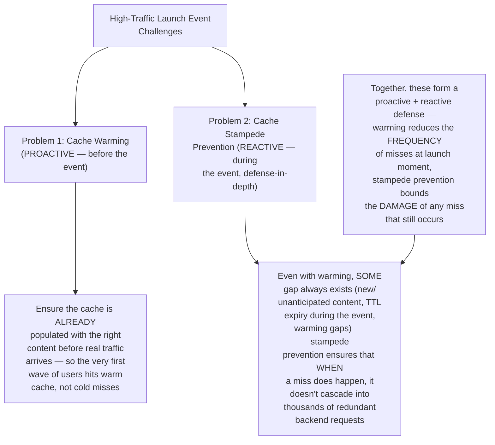
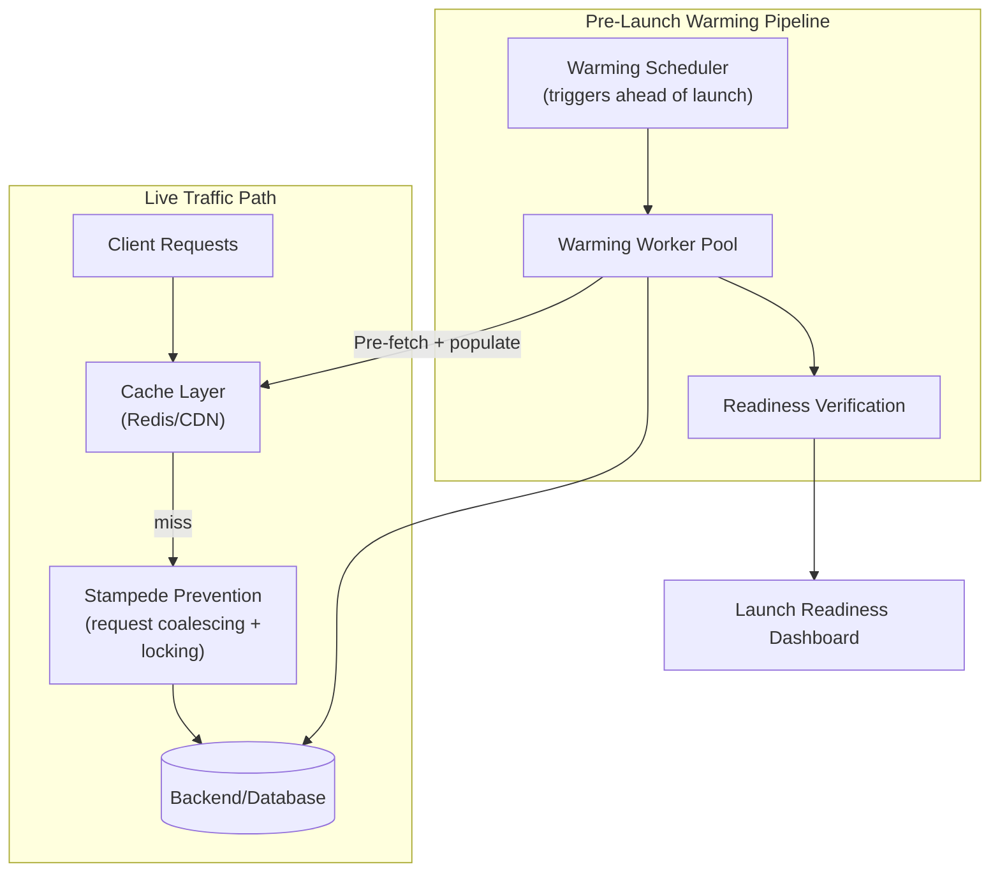
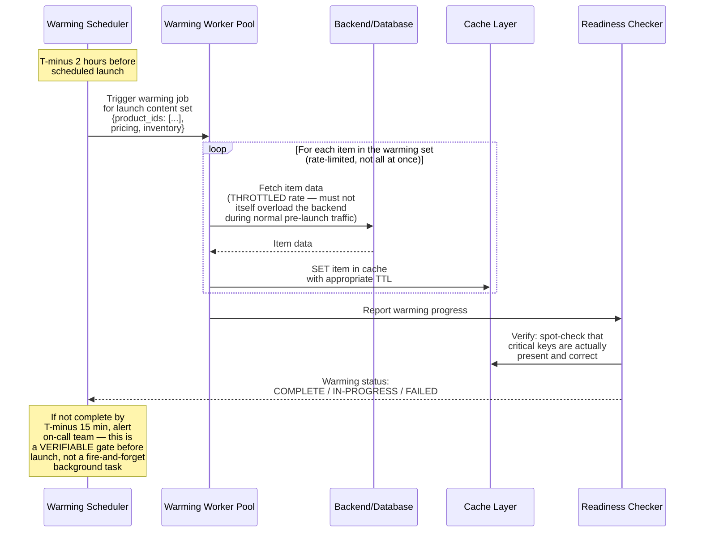
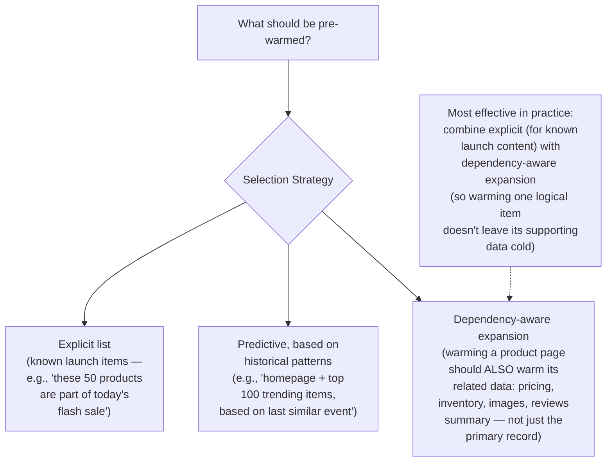
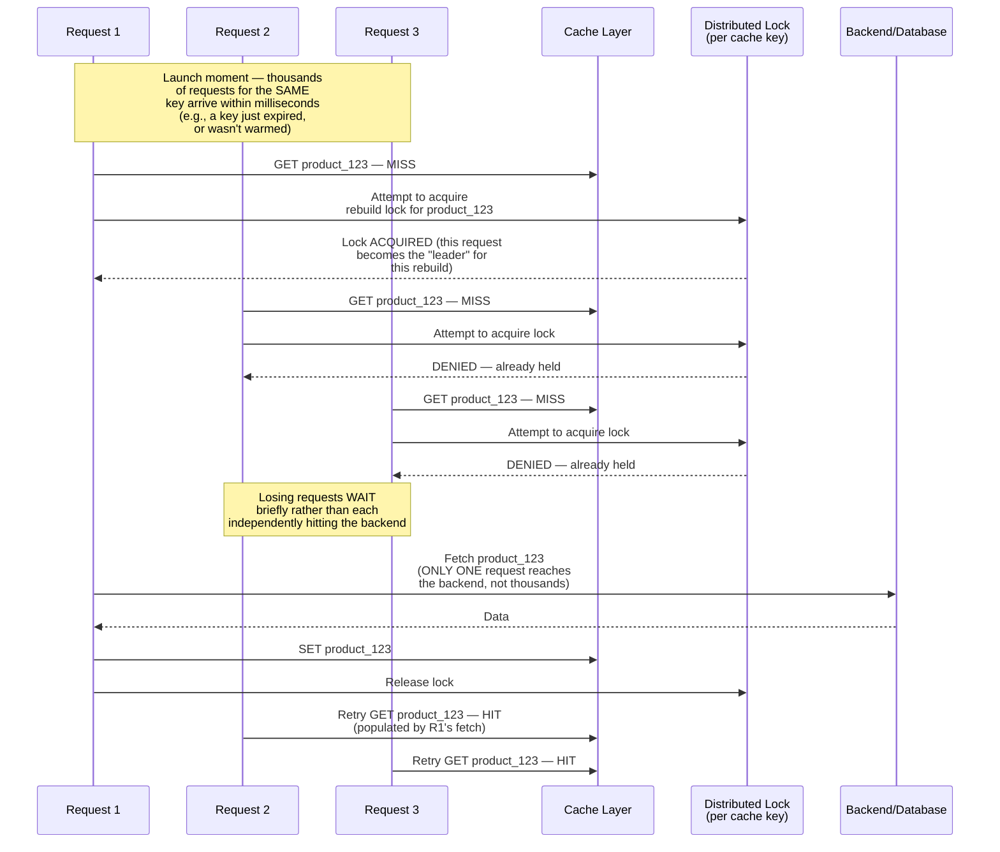
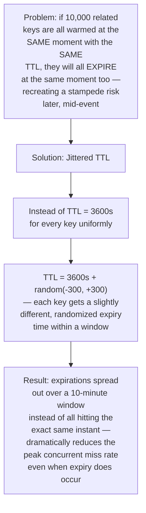
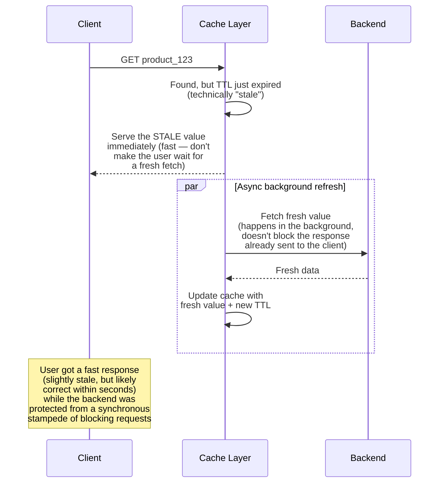
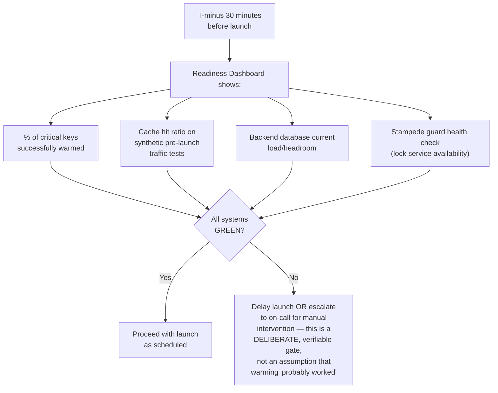
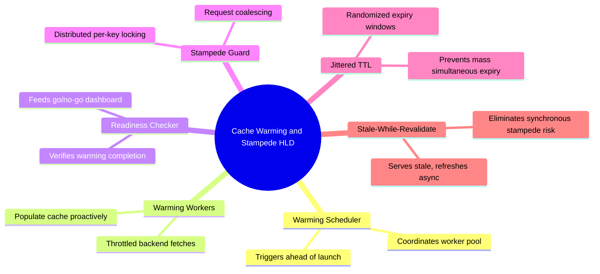

# Design a Cache Warming & Cache Stampede Prevention System for a High-Traffic Launch Event — High-Level Design Document

## 1. Requirements

### Functional Requirements
- Pre-populate ("warm") caches with anticipated high-demand content BEFORE a scheduled high-traffic event (e.g., product launch, flash sale, major announcement)
- Prevent cache stampede scenarios where many concurrent requests for the same uncached key simultaneously overwhelm the backing database
- Support graceful cache expiration that avoids mass-simultaneous expiry of related keys
- Provide monitoring/visibility into cache readiness before the event goes live

### Non-Functional Requirements
- **Zero-downtime launch:** The backing database/services must never be overwhelmed by a traffic surge at launch moment, even if it's entirely predictable in advance
- **Warming completion guarantee:** Critical content must be confirmed cached before the event's public start time — this needs to be verifiable, not just "probably done"
- **Minimal warming overhead:** The warming process itself shouldn't degrade normal production traffic while it runs
- **Fast recovery from stampede if it occurs anyway:** Even with warming, unexpected traffic patterns can still trigger stampede conditions — the system needs defense-in-depth

### Back-of-Envelope Estimation
| Metric | Value |
|---|---|
| Expected launch-moment traffic spike | 50-100x normal baseline, concentrated in first few minutes |
| Content to pre-warm | Product pages, pricing, inventory for the launched items |
| Warming lead time | Minutes to hours before launch |
| Cache miss cost (if stampede occurs) | Could be 10,000+ simultaneous identical DB queries in worst case |

---

## 2. The Two Distinct Problems This Design Solves

---

## 3. High-Level Architecture

**Key idea:** The warming pipeline runs entirely separately from, and ahead of, live traffic — its job is to make the cache layer already "hot" by the time real users arrive. The stampede guard remains permanently in place on the live traffic path as an always-on safety net, regardless of how well warming succeeded.

---

## 4. Cache Warming Flow — Detailed Sequence

**Why throttled warming matters:** Ironically, an overly aggressive warming process could itself overload the backend database right before the event it's trying to protect — warming must be rate-limited to a sustainable fetch rate, spread over the available lead time, rather than blasting the backend with maximum-parallelism fetches.

---

## 5. Warming Content Selection Strategy

---

## 6. Cache Stampede Prevention — Request Coalescing (Core Mechanism)

*This is the exact same request-coalescing pattern established in the Distributed Cache design's "Thundering Herd Prevention" section — this system applies it specifically in the context of a predictable, scheduled high-traffic event rather than an organic viral spike, but the underlying mechanism is identical.*

---

## 7. Staggered TTL Expiration (Preventing Mass Simultaneous Expiry)

---

## 8. Stale-While-Revalidate Pattern (Additional Defense Layer)

**Why this is a particularly strong defense during a launch event:** Rather than making the "unlucky" first request after expiry wait for a fresh backend fetch (and having all concurrent requests either wait or stampede), stale-while-revalidate serves the still-reasonably-fresh old value instantly to everyone, while a single background refresh quietly updates the cache — trading a few seconds of technical staleness for a complete elimination of stampede risk at the moment of expiry.

---

## 9. Launch Readiness Dashboard & Go/No-Go Gate

---

## 10. Component Responsibilities Summary

---

## 11. Key Design Decisions & Tradeoffs

| Decision | Choice | Why |
|---|---|---|
| Warming approach | Throttled, dependency-aware pre-fetch ahead of launch | Proactively eliminates the most common cause of launch-moment stampede — completely cold cache meeting a traffic surge |
| Warming verification | Explicit readiness checks with go/no-go gate | "Probably warmed" isn't good enough for a scheduled, high-stakes event — completion must be verifiable before committing to launch |
| Stampede defense | Distributed locking (request coalescing) | Bounds backend load to at most one request per key during any miss window, regardless of concurrent request volume |
| TTL strategy | Jittered expiration | Prevents warmed content from later creating a SECOND stampede risk when it all expires simultaneously |
| Additional resilience layer | Stale-while-revalidate | Provides a layer of protection that doesn't even require the locking mechanism to engage — stale content is simply served while refresh happens asynchronously |

---

## 12. Bottlenecks & Scaling Considerations

- **Warming process itself becoming a bottleneck** — an insufficiently throttled warming job can degrade normal pre-launch production traffic; needs careful rate limiting and ideally scheduling during lower-traffic pre-launch windows.
- **Incomplete warming coverage** — no warming strategy can perfectly predict every piece of content real users will request; the stampede guard's importance as a permanent safety net (not just a launch-day feature) can't be overstated — organic traffic spikes happen too, without any advance warning or warming opportunity.
- **Lock service as a new critical dependency during the highest-stakes moment** — the stampede guard's distributed lock service must itself be highly available and low-latency, precisely during the exact moment (launch) when overall system load is at its absolute peak — this dependency needs to be provisioned and tested for MORE than baseline capacity, not less.
- **Stale-while-revalidate correctness for rapidly-changing data** — this pattern works well for content that's "probably still correct" for a few seconds (product descriptions, images) but is inappropriate for data requiring strict correctness (e.g., real-time inventory count during a limited-stock flash sale, where serving stale "in stock" could lead to overselling) — must be applied selectively based on data criticality.
- **Multi-region warming coordination** — for a globally distributed launch, warming must happen across every regional cache tier (connecting back to the Multi-Layer CDN design), not just a single central cache — requiring the warming pipeline itself to fan out globally with the same care as content invalidation does.
- **Post-launch monitoring for sustained hot spots** — even after the initial launch-moment spike is absorbed, certain content may remain unusually hot for an extended period (e.g., the single most popular launch item); this connects to the ongoing hot-key mitigation strategies needed beyond just the initial warming window.
