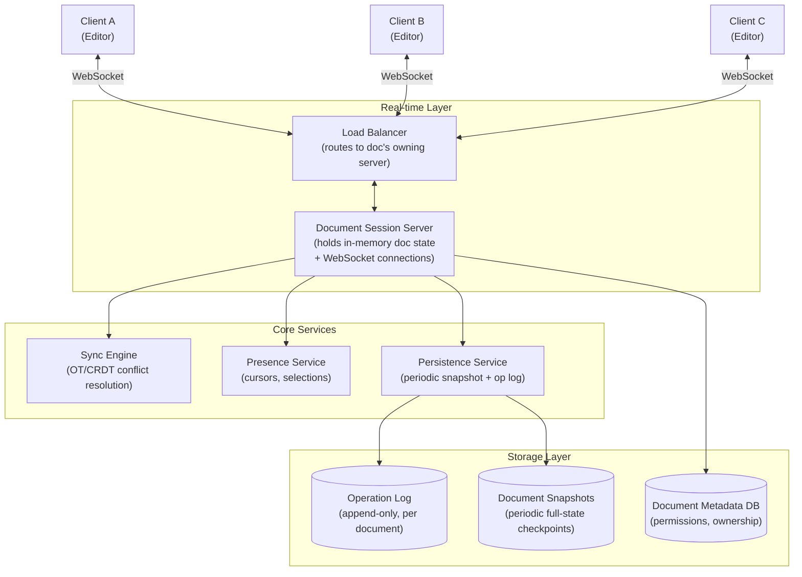
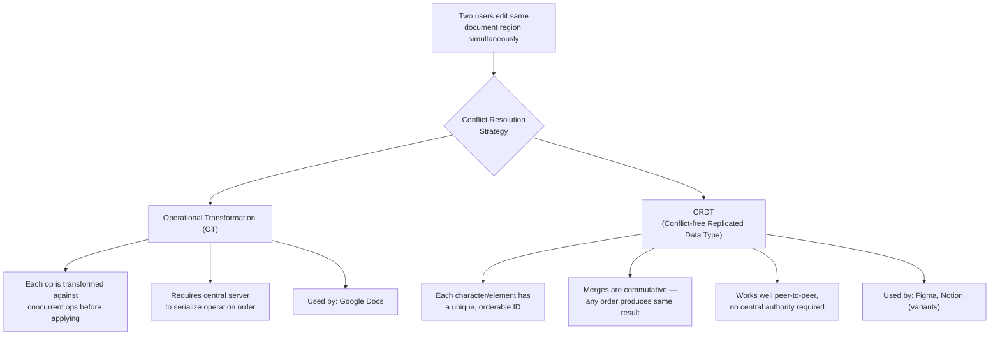
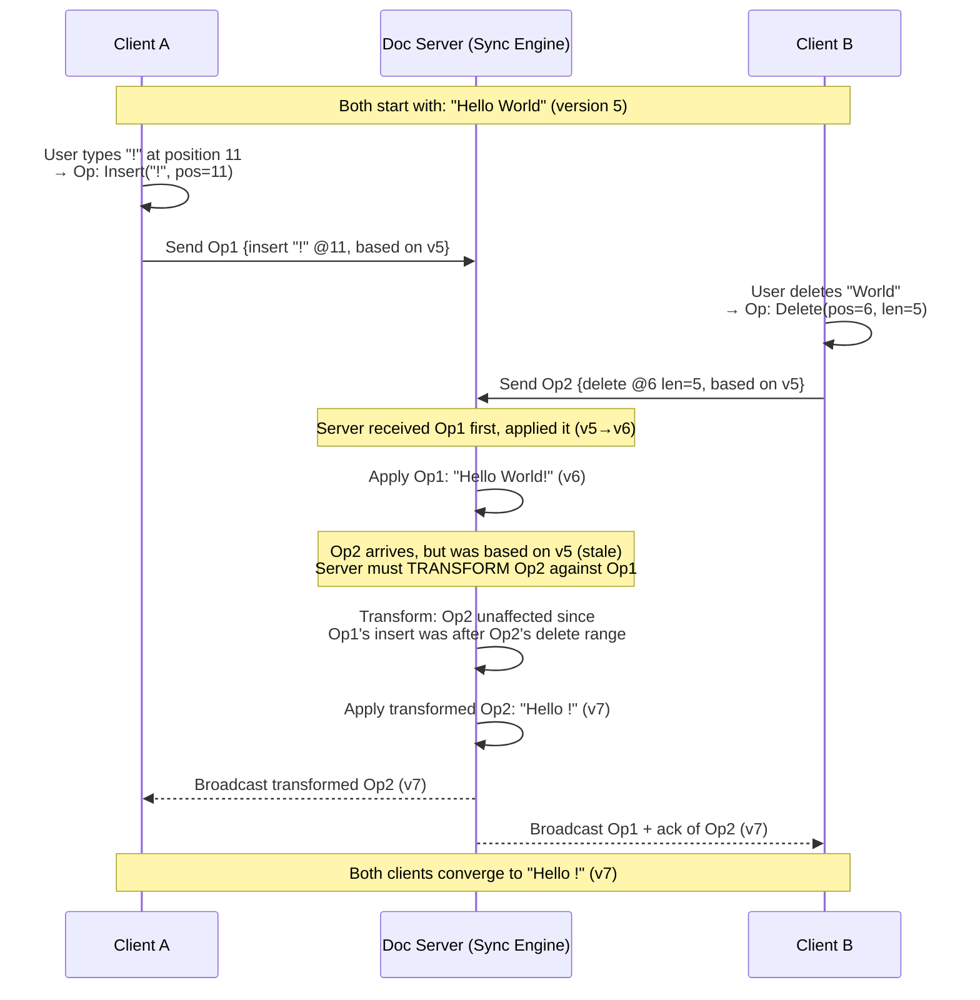
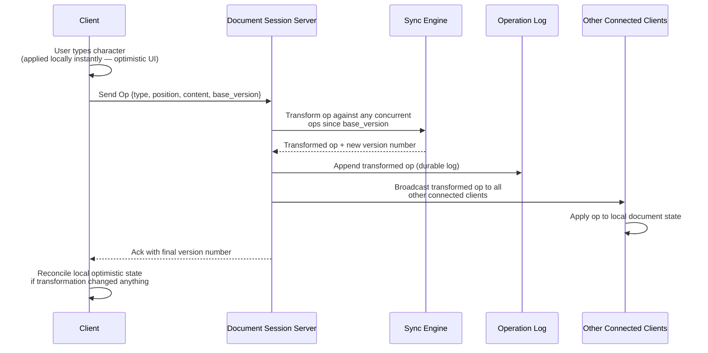
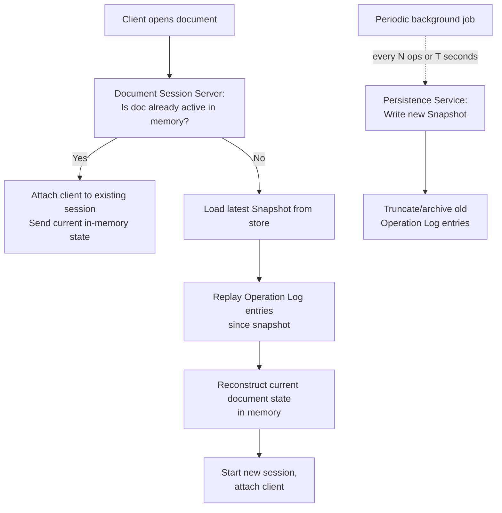
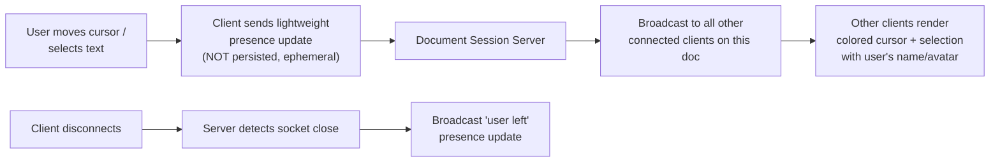
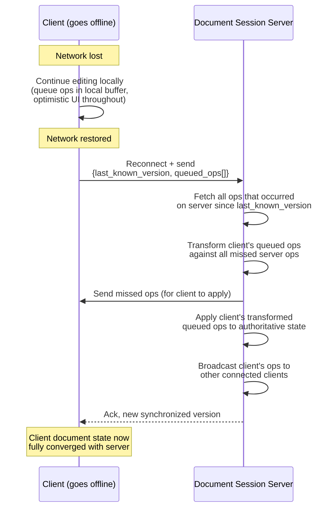
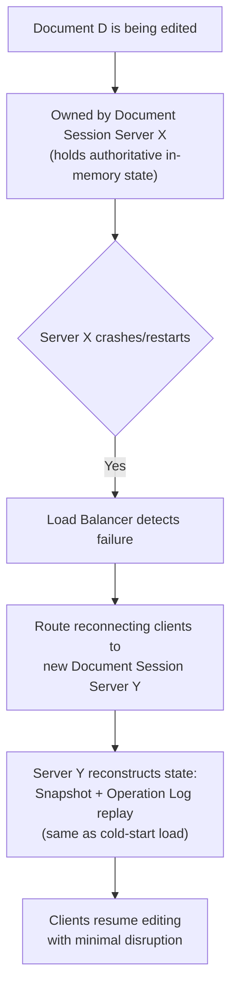
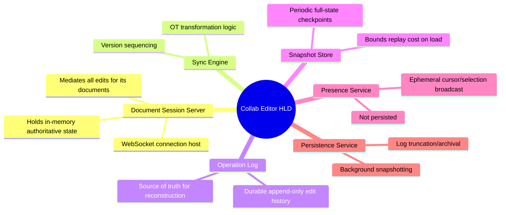

# Design a Real-Time Collaborative Document Editor — High-Level Design Document

## 1. Requirements

### Functional Requirements
- Multiple users can edit the same document simultaneously
- Changes from one user appear near-instantly for all others
- No lost updates — concurrent edits must merge correctly, not overwrite
- Support cursor/selection presence (see where others are typing)
- Offline editing with sync on reconnect
- Full document version history / undo

### Non-Functional Requirements
- **Latency:** Local edits should render instantly (< 16ms, no perceptible lag); remote edits should propagate < 100-200ms
- **Consistency:** All clients must eventually converge to the identical document state
- **Conflict resolution:** Automatic — users should never see manual "merge conflict" dialogs
- **Scale:** Most documents have small concurrent editor counts (2-20), but the platform serves millions of documents simultaneously
- **Durability:** No edit should ever be silently lost, even across disconnects

### Back-of-Envelope Estimation
| Metric | Value |
|---|---|
| Concurrent active documents | ~1M+ |
| Avg concurrent editors/doc | 2-5 (occasionally 50+) |
| Edit operations/sec/active doc | 1-10 (keystroke-level) |
| Total edit ops/sec (platform-wide) | ~1M+ |
| Document size | KB to low MB range |

---

## 2. High-Level Architecture

**Key idea:** Each active document is "owned" by exactly one Document Session Server at a time, which holds the authoritative in-memory state and mediates all concurrent edits through the Sync Engine. This avoids distributed consensus on every keystroke — conflict resolution happens in one place per document.

---

## 3. Core Conflict Resolution Approaches

*This design uses **OT** as the primary approach (Google Docs-style, server-mediated) since it requires less client-side complexity and metadata overhead than CRDTs, at the cost of needing a central sequencing authority per document.*

---

## 4. Operational Transformation — How It Works

**Key idea:** When two operations are based on the same starting version but conflict in position, the server transforms the later-arriving operation's coordinates against the earlier one so it still makes semantic sense when applied — this is the mathematical core of OT.

---

## 5. Document Edit Flow — Detailed Sequence

---

## 6. Document Loading & Persistence Strategy

**Key idea:** The system never replays the *entire* history from scratch — periodic snapshots bound how much of the operation log needs replaying to reconstruct current state, keeping document load times fast even for documents with years of edit history.

---

## 7. Presence & Cursor Sharing

*Presence updates are high-frequency but ephemeral — they're never written to the Operation Log or persisted, since they represent transient UI state, not document content.*

---

## 8. Offline Editing & Reconnect Sync

---

## 9. Document Server Ownership & Failover

*Because the Operation Log is the durable source of truth (not the in-memory state), losing a Document Session Server is recoverable — any server can reconstruct the exact same state by replaying the log, making ownership reassignment safe.*

---

## 10. Component Responsibilities Summary

---

## 11. Key Design Decisions & Tradeoffs

| Decision | Choice | Why |
|---|---|---|
| Conflict resolution | Operational Transformation | Well-suited to a centralized server model; less client metadata overhead than CRDTs |
| Document ownership | One session server per active document | Avoids distributed consensus on every keystroke; conflict resolution centralized and simple |
| Durability model | Append-only op log + periodic snapshots | Bounds recovery/replay time while keeping every edit durably recorded |
| Presence updates | Ephemeral, not persisted | Cursor position isn't document content — persisting it would bloat the op log for no value |
| Optimistic local editing | Apply locally instantly, reconcile async | Local typing must never feel laggy; reconciliation happens transparently in the background |
| Offline support | Queue ops locally, transform-and-replay on reconnect | Users expect to keep typing through brief network drops without losing work |
| Server failover | Stateless reconstruction from log + snapshot | Any server can take over a document; no special leader-election needed for document ownership |

---

## 12. Bottlenecks & Scaling Considerations

- **Hot documents with many concurrent editors** (50+ users on one doc, e.g., large team meeting notes) — a single session server's broadcast fanout and OT transformation load can become a bottleneck; may need sharded broadcast groups or CRDT fallback for very high concurrency documents.
- **Operation Log write throughput** — extremely active documents generate many small ops/sec; batch writes to the log where possible without sacrificing durability guarantees.
- **Snapshot frequency tradeoff** — too frequent = wasted storage/compute; too infrequent = slow reconstruction on load/failover. Tune based on op volume per document (e.g., snapshot every 1000 ops or 5 minutes, whichever first).
- **Cross-region latency** — users far from the document's owning server experience higher round-trip latency for their edits to be acknowledged/broadcast; may need regional session server placement with cross-region replication for global documents.
- **Large document initial load time** — very large documents (many MB, years of history) need efficient snapshot formats (not naive full-text) to avoid slow cold starts.
- **Session server memory pressure** — holding many large documents in memory simultaneously requires LRU-style eviction of inactive document sessions, with fast reload from snapshot+log on next access.
- **OT transformation complexity for rich content** — plain text OT is well-understood; transforming operations on rich formatting (tables, embedded images, nested lists) is significantly harder to get correct and is where most real-world bugs live.
