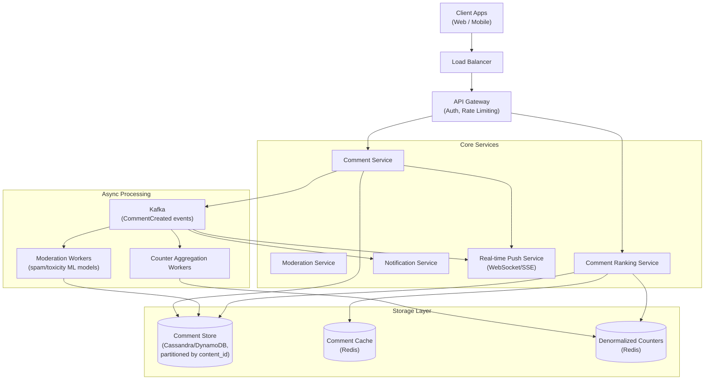
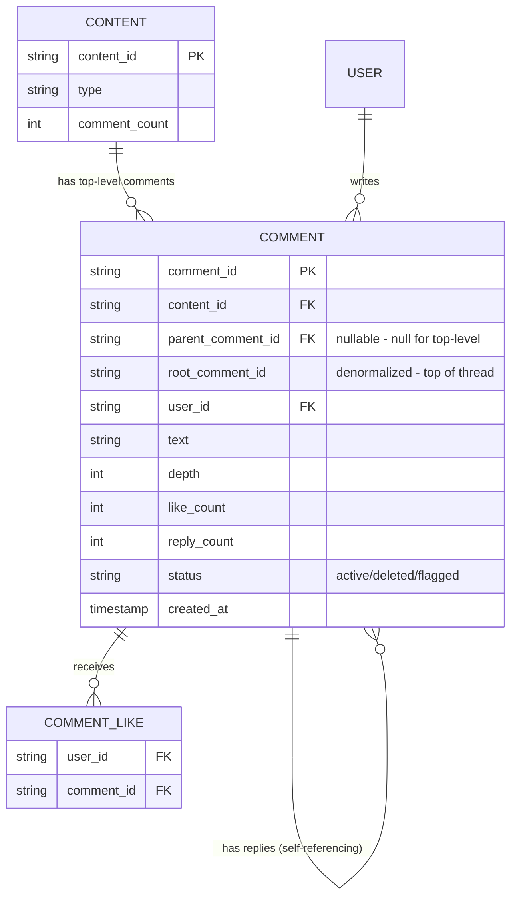
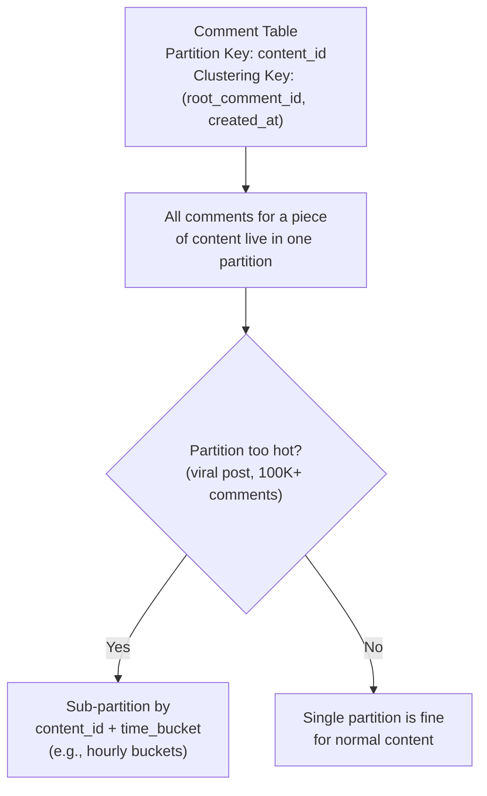
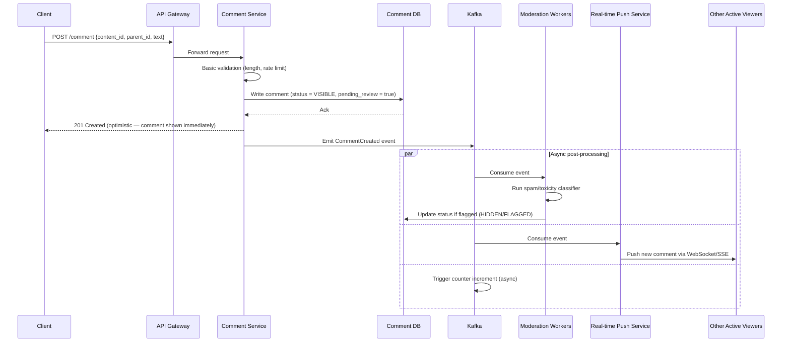
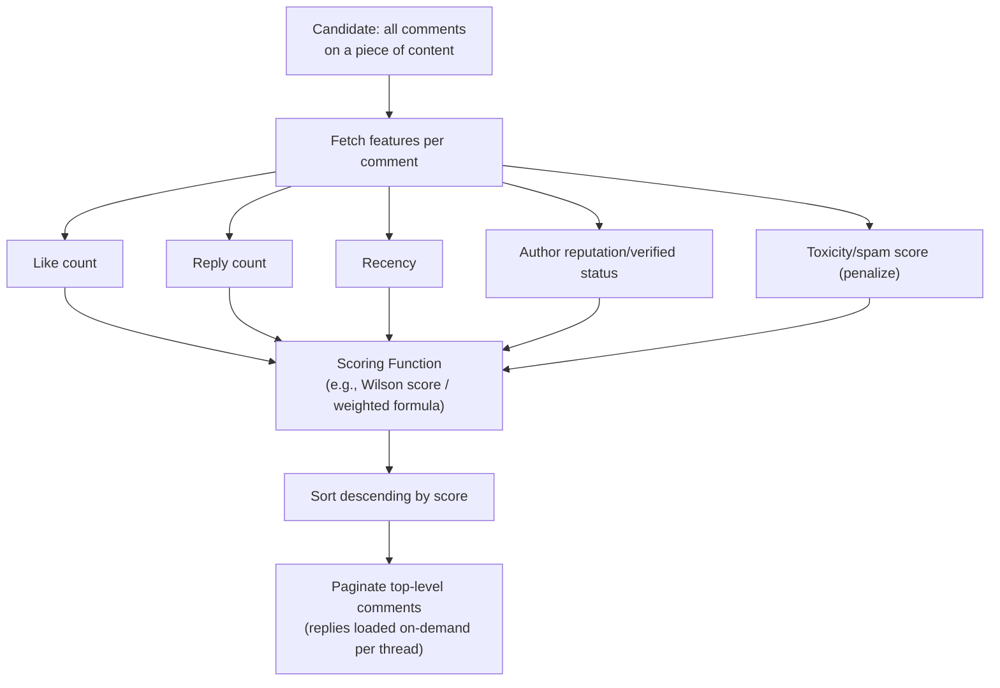
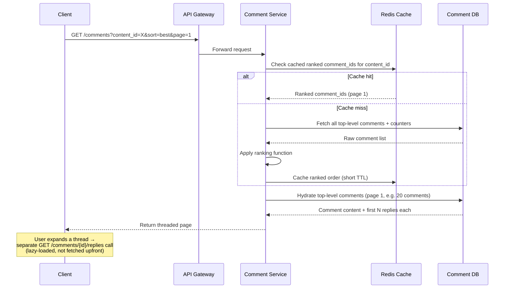
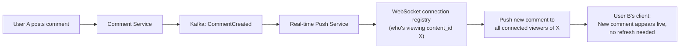
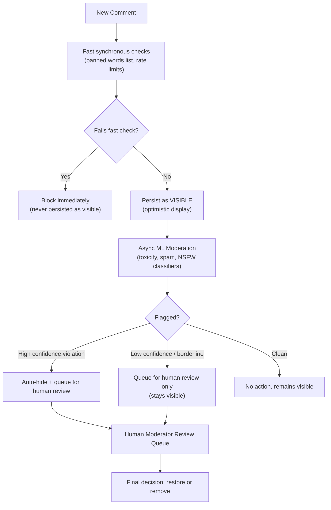

# Design a Comments System at Scale — High-Level Design Document

## 1. Requirements

### Functional Requirements
- Users can post comments on content (posts, videos, articles)
- Support nested/threaded replies (multiple levels deep)
- Users can like/upvote comments
- Sort comments by: newest, most liked, "best" (ranked)
- Real-time updates (new comments appear live for active viewers)
- Moderation: flagging, deletion, spam/toxicity filtering

### Non-Functional Requirements
- **Scale:** Viral posts can get 100K+ comments; hot threads get 1000s of new comments/minute
- **Read-heavy:** Comment reads vastly outnumber writes, but write bursts happen on viral content
- **Low latency:** Comment submission should feel instant (< 200ms to appear for the author)
- **Eventual consistency acceptable** for comment counts and cross-region propagation
- **Ordering:** Threaded replies must render in a consistent, sensible order

### Back-of-Envelope Estimation
| Metric | Value |
|---|---|
| Comments/sec (avg) | ~2,000 |
| Comments/sec (peak, viral event) | ~50,000 |
| Avg comment size | ~200 bytes |
| Max nesting depth (practical) | 5-10 levels (UI-enforced) |
| Comment reads/sec | ~200,000+ |
| Storage growth | ~35GB/day (text only) |

---

## 2. High-Level Architecture

**Key idea:** Comment submission is fast and synchronous (write + immediate local echo), but moderation, notification, real-time fanout, and counter updates all happen asynchronously via Kafka — keeping the write path lean while supporting heavy downstream processing.

---

## 3. Data Model — Threaded Comments

**Key modeling decision:** Storing both `parent_comment_id` (immediate parent) and `root_comment_id` (top-level ancestor) lets us efficiently query "give me the whole thread for this top-level comment" in one partition scan, instead of recursively walking the tree.

---

## 4. Comment Storage & Partitioning Strategy

*Partitioning by `content_id` co-locates all comments for a post, making "load comments for this post" a single efficient range scan. But a viral post's partition can become a hot spot — mitigated with time-bucketed sub-partitioning if a single partition grows too large or too hot.*

---

## 5. Comment Submission — Detailed Sequence

**Key design choice:** Comments appear **optimistically** before moderation completes — this keeps the UX fast. If moderation later flags the comment, it's retroactively hidden. This trades a small window of "objectionable content briefly visible" for much better perceived latency; premium/high-risk contexts (e.g., livestream chat with minors) may instead require pre-moderation (comment held until cleared).

---

## 6. Comment Ranking ("Best" / "Top" Sort)

*A common approach: score = f(likes, replies, recency_decay, author_trust) − penalty(toxicity_score). Top-level comments are ranked this way; replies within a thread are typically just chronological to preserve conversational flow.*

---

## 7. Comment Read Path (Paginated + Nested)

---

## 8. Real-Time Updates for Active Viewers

*The push service maintains an in-memory (or Redis-backed) registry of which users have an active WebSocket/SSE connection subscribed to which `content_id`, so new comments can be fanned out only to relevant, currently-active viewers — not broadcast globally.*

---

## 9. Moderation Pipeline

---

## 10. Component Responsibilities Summary

| Component | Responsibility |
|---|---|
| **Comment Service** | Handles submission, validation, fast persistence |
| **Moderation Service/Workers** | Async spam/toxicity classification, flagging |
| **Ranking Service** | Computes "best"/"top" ordering for comment display |
| **Real-time Push Service** | WebSocket/SSE fanout of new comments to active viewers |
| **Counter Workers** | Async aggregation of like/reply counts to avoid write hotspots |
| **Comment DB** | Durable, partitioned storage optimized for per-content range reads |
| **Comment Cache** | Caches ranked comment order and hot threads to reduce DB load |

---

## 11. Key Design Decisions & Tradeoffs

| Decision | Choice | Why |
|---|---|---|
| Moderation timing | Optimistic (post-then-moderate) by default | Prioritizes low latency UX; falls back to pre-moderation only in high-risk contexts |
| Thread storage | Store both `parent_id` and `root_id` | Enables efficient full-thread retrieval without recursive queries |
| Partitioning | By `content_id`, with time-bucket sub-partitioning for viral content | Balances query locality against hot-partition risk |
| Reply loading | Lazy-loaded per thread, not eagerly fetched | Avoids massive payloads for posts with huge comment trees |
| Counters | Denormalized, updated asynchronously | Avoids write contention on hot comments (celebrity post with 1M likes) |
| Real-time delivery | WebSocket/SSE with per-content subscriber registry | Avoids broadcasting to all users; only active viewers of that content receive pushes |
| Ranking | Computed and cached, not real-time per-request | Recomputing ranking on every read for a 100K-comment thread is prohibitively expensive |

---

## 12. Bottlenecks & Scaling Considerations

- **Hot partitions from viral posts** — a single post attracting 100K+ comments in an hour can overwhelm a single partition; mitigate via time-bucketed sub-partitions or dedicated hot-content sharding.
- **Deep nesting abuse** — malicious users creating extremely deep reply chains; enforce a max depth at the application layer (e.g., cap UI nesting at 5-10 levels, flatten beyond that).
- **Counter write contention** — synchronous increment-on-like at massive scale causes lock contention; use async aggregation (batch increments) or approximate counters (e.g., HyperLogLog-style) for very hot comments.
- **Moderation pipeline backlog** — sudden spam waves or brigading can flood the ML moderation queue; auto-scale workers and prioritize newest/most-visible comments first.
- **Real-time fanout for mega-viral live content** — thousands of viewers on a livestream chat means each new comment fans out to thousands of WebSocket connections; needs a pub/sub layer (e.g., Redis Pub/Sub or dedicated fanout service) rather than naive per-connection iteration.
- **Ranking cache staleness** — cached "best" order can go stale quickly on fast-moving threads; use short TTLs or event-driven cache invalidation when engagement crosses significant thresholds.
