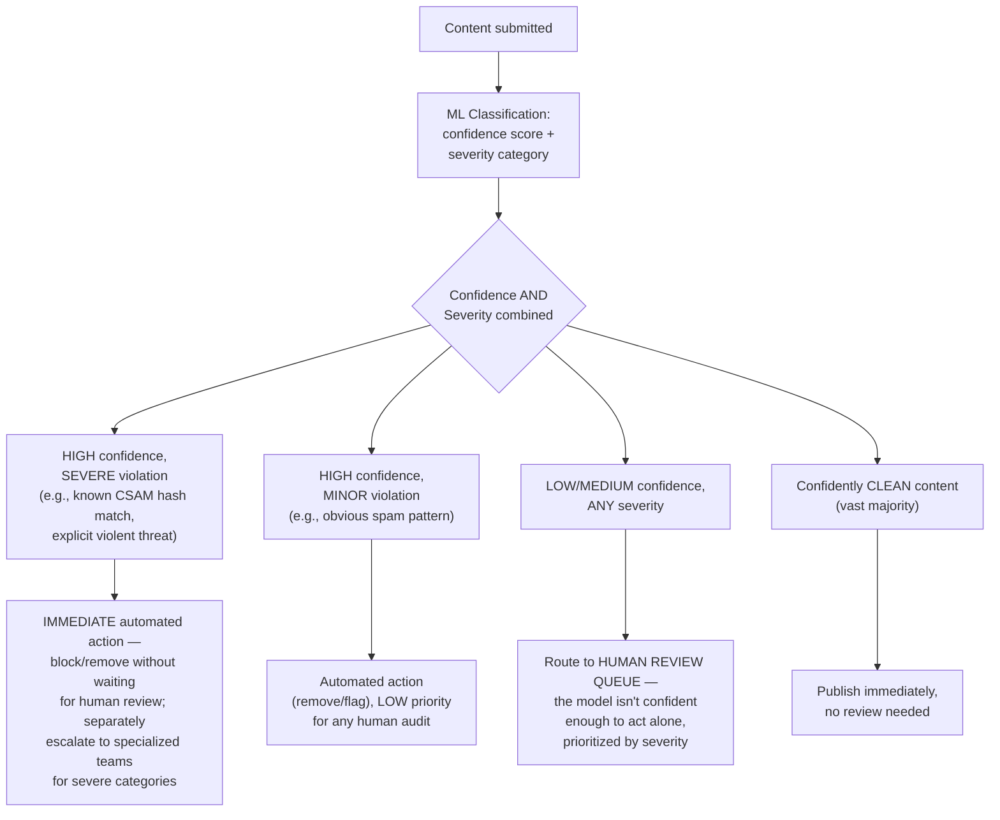
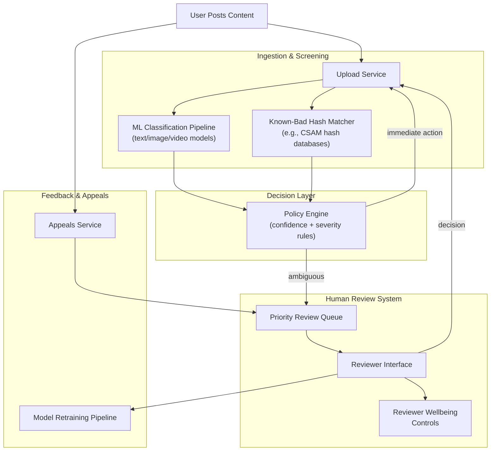
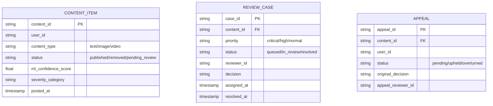
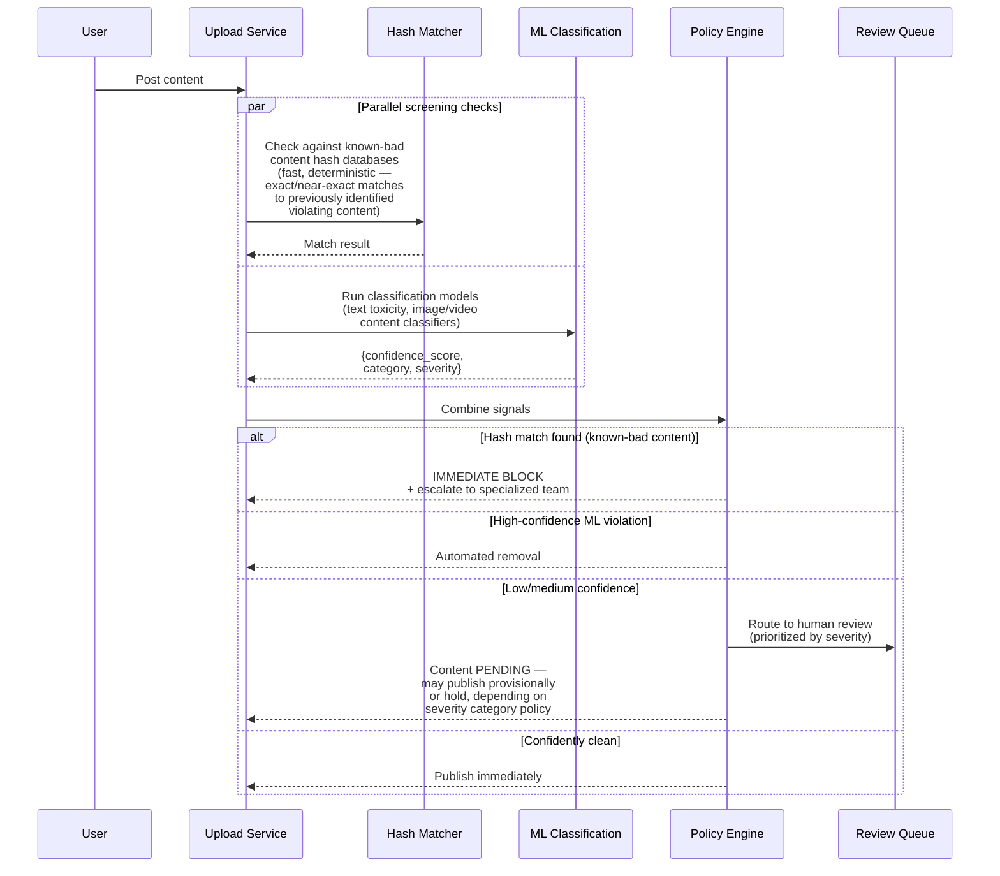
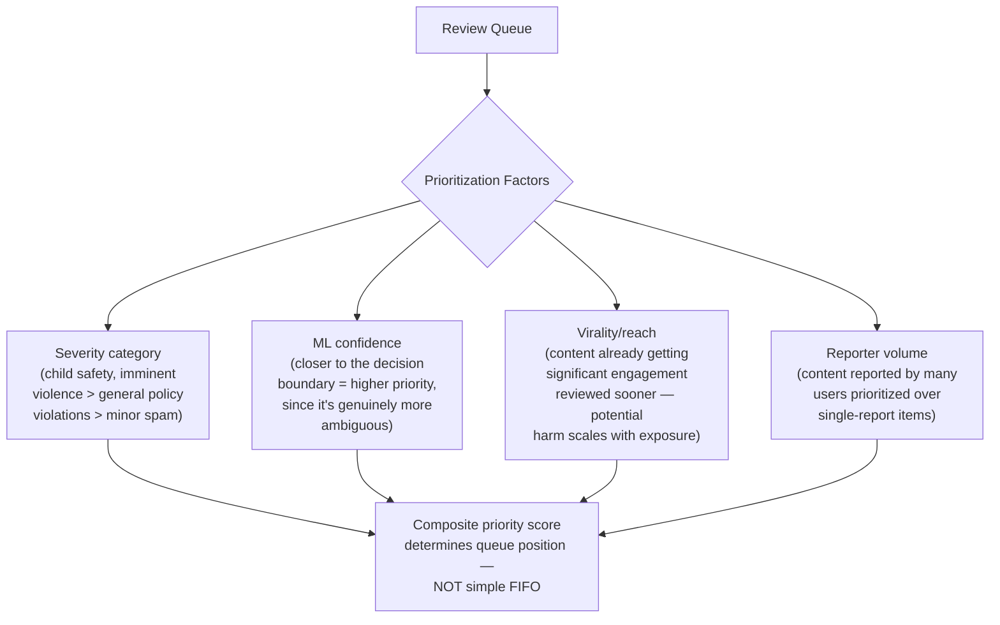
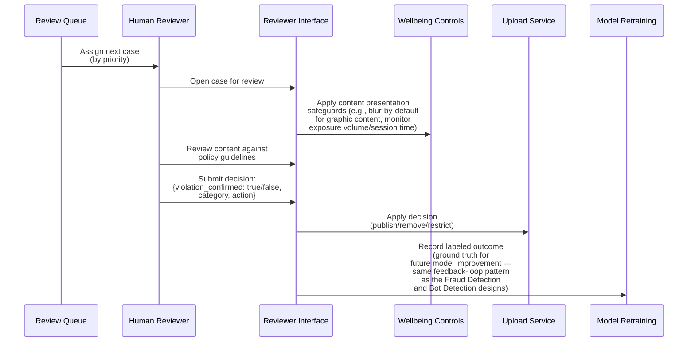
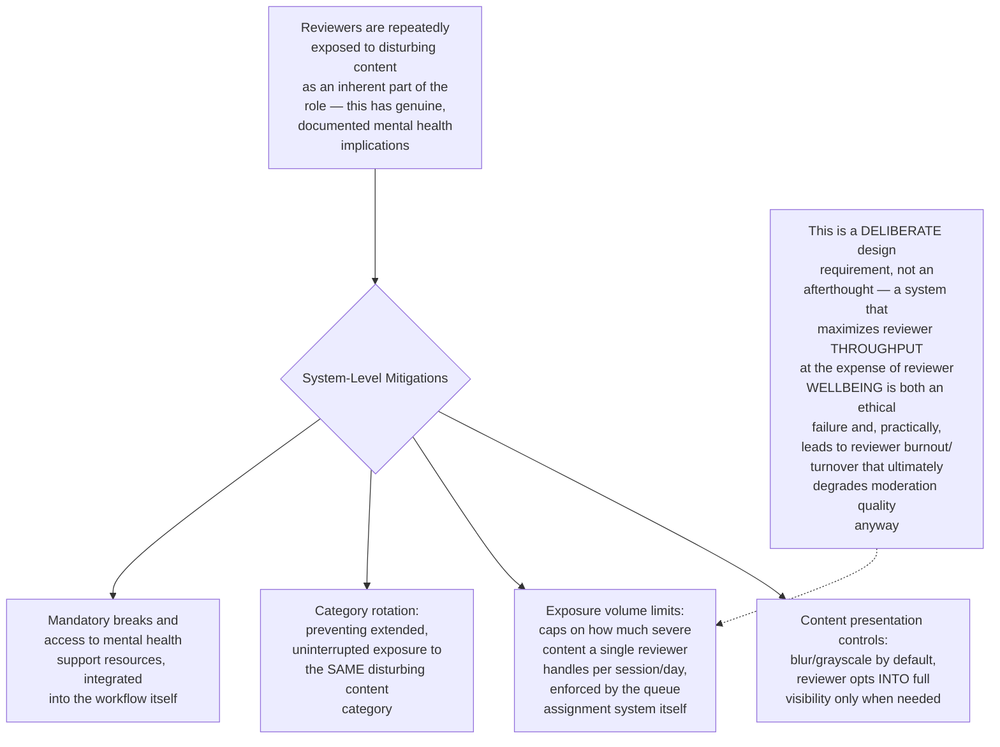
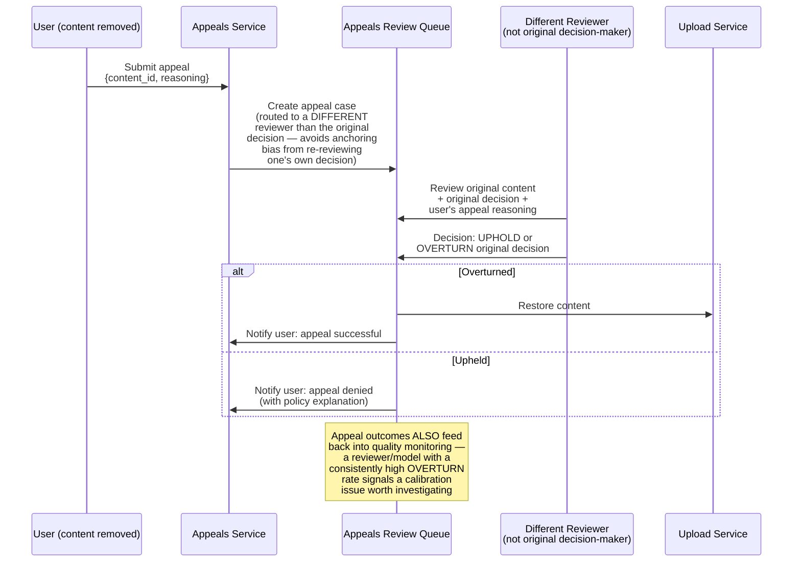
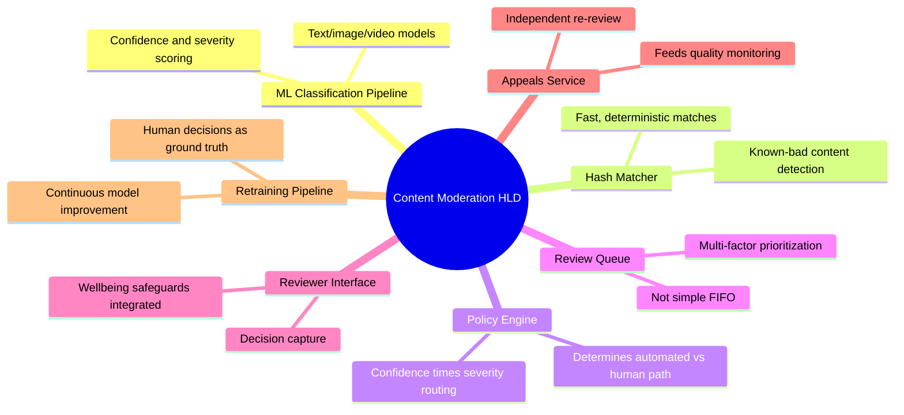

# Design a Content Moderation System Combining ML Models and Human Review — High-Level Design Document

## 1. Requirements

### Functional Requirements
- Automatically screen user-generated content (text, images, video) for policy violations at upload/post time
- Route genuinely ambiguous cases to human moderators for judgment
- Support appeals — a user can contest a moderation decision
- Support different severity tiers with different handling speed/rigor (e.g., child safety content vs. mild spam)

### Non-Functional Requirements
- **Low latency for the common case:** The vast majority of content (which is fine) shouldn't experience meaningful posting delay
- **High recall for severe violations:** Missing genuinely dangerous content (e.g., illegal content) is a far more serious failure than the reverse
- **Human reviewer wellbeing:** Reviewers are repeatedly exposed to disturbing content — the system's design has direct human welfare implications
- **Consistency:** Similar content should receive similar moderation decisions, both across different automated model calls and across different human reviewers

### Back-of-Envelope Estimation
| Metric | Value |
|---|---|
| Content pieces posted/sec (platform-wide) | Tens of thousands |
| ML-flagged-for-review rate | Single-digit percentage typically |
| Human reviewer capacity | Hundreds to thousands of items/reviewer/day, varies by content type |
| Severe-violation response target | Minutes, not hours (e.g., imminent harm content) |

---

## 2. The Core Philosophy — Tiered Response by Confidence and Severity

**Why this two-dimensional (confidence × severity) approach matters:** A naive single-threshold system ("flag if score > X") fails to capture the crucial distinction between "the model is UNCERTAIN" and "the content is SEVERE" — these require genuinely different handling. High-confidence severe violations need instant automated action (waiting for a human reviewer risks real harm), while low-confidence content of ANY severity needs human judgment specifically BECAUSE the model doesn't know enough to decide alone.

---

## 3. High-Level Architecture

---

## 4. Data Model

---

## 5. Automated Screening Flow — Detailed Sequence

**Why provisional publishing is sometimes the right choice for pending review:** For LOW-severity ambiguous content (e.g., borderline spam), holding every such post until human review completes would create unacceptable latency for a large volume of ultimately-fine content; provisional publishing (visible immediately, subject to removal if review finds a violation) balances user experience against moderation thoroughness — but this policy must NEVER apply to high-severity categories, where the precautionary hold is worth the latency cost.

---

## 6. Human Review Queue Prioritization

---

## 7. Human Review Flow — Detailed Sequence

---

## 8. Reviewer Wellbeing Controls (A Distinctive, Human-Centric Requirement)

---

## 9. Appeals Process — Detailed Sequence

---

## 10. Component Responsibilities Summary

---

## 11. Key Design Decisions & Tradeoffs

| Decision | Choice | Why |
|---|---|---|
| Routing logic | Two-dimensional: confidence × severity | Captures the crucial distinction between model uncertainty and content danger — these require fundamentally different handling, not a single threshold |
| Severe-content handling | Immediate automated action, no human-review delay | For genuinely dangerous content, waiting for human review risks real harm; automated action for high-confidence severe cases is the correct precautionary default |
| Ambiguous content handling | Human review, prioritized by composite severity/confidence/reach score | The model's own uncertainty is precisely the signal that human judgment is needed, not a reason to guess |
| Reviewer wellbeing | Explicit system-level controls (blur, exposure limits, rotation) | A deliberate, first-class design requirement — not just an ethical consideration but a practical necessity to prevent burnout-driven quality degradation |
| Appeals | Independent reviewer, separate from original decision-maker | Avoids anchoring bias; also serves as an ongoing quality-monitoring signal via overturn rates |
| Provisional publishing | Applied only to low-severity ambiguous content | Balances user experience against moderation thoroughness, with severity-based limits preventing this from ever applying to genuinely dangerous content categories |

---

## 12. Bottlenecks & Scaling Considerations

- **Human review capacity as a hard constraint** — unlike most systems where "add more compute" solves scaling, human reviewer capacity scales with HIRING and TRAINING, which is slow and has real limits; the system must be designed to minimize what genuinely NEEDS human review (via increasingly accurate ML models) rather than assuming review capacity can simply scale with content volume.
- **Model accuracy directly determines both false-negative harm and reviewer workload** — a model with poor precision sends too much genuinely-fine content to the review queue (wasting scarce reviewer capacity and adding unnecessary friction for legitimate users); poor recall lets genuine violations through — this dual cost makes ongoing model quality investment a direct lever on both safety AND operational cost.
- **Adversarial content evolution** — similar to fraud and bot detection, bad actors actively adapt content to evade automated detection (e.g., subtle text obfuscation, image manipulation); this requires the same continuous retraining discipline as those other adversarial systems.
- **Cross-cultural and multi-language consistency** — content policy application must remain consistent across vastly different languages, cultural contexts, and content norms; this typically requires region/language-specific model tuning and reviewer expertise, adding significant complexity beyond a single global model/policy.
- **Consistency measurement across reviewers** — with many human reviewers each making judgment calls, measuring and maintaining INTER-REVIEWER CONSISTENCY (similar content receiving similar decisions regardless of who reviews it) requires ongoing calibration exercises and quality auditing, not just individual reviewer accuracy metrics in isolation.
- **Latency vs thoroughness for viral/high-reach content** — content rapidly gaining engagement needs FASTER review specifically because potential harm scales with exposure, but faster review can mean LESS thorough review — this tension requires careful queue-prioritization design (as noted in Section 6) rather than a simple speed-vs-quality tradeoff applied uniformly.
- **Downstream legal and regulatory obligations** — certain content categories (e.g., specific illegal content types) carry legal reporting obligations to authorities once identified; the system's escalation pathways for these categories need to integrate with legal/compliance processes, not just internal moderation workflows — connecting to considerations similar to those in the GDPR Deletion System design's handling of legally-mandated processes.
