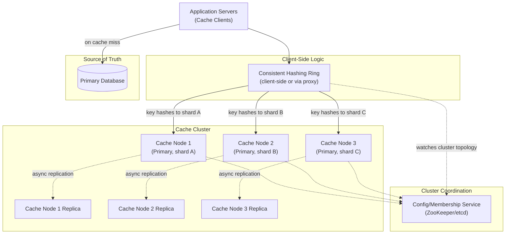
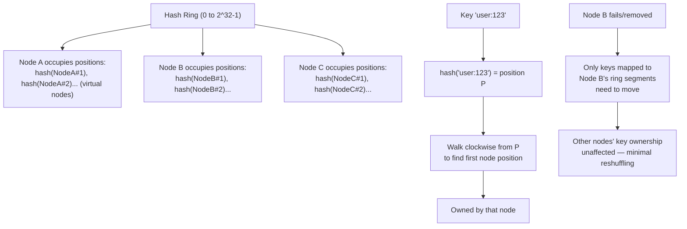
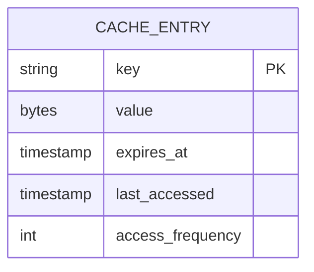
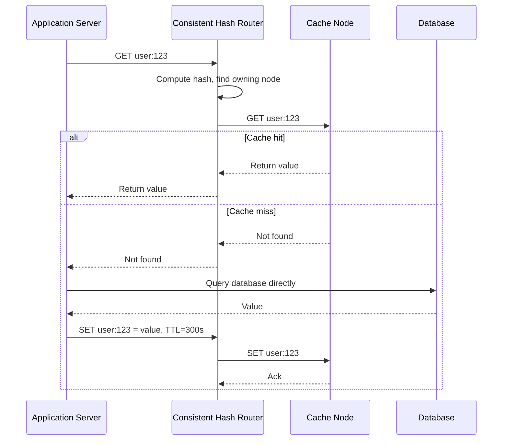
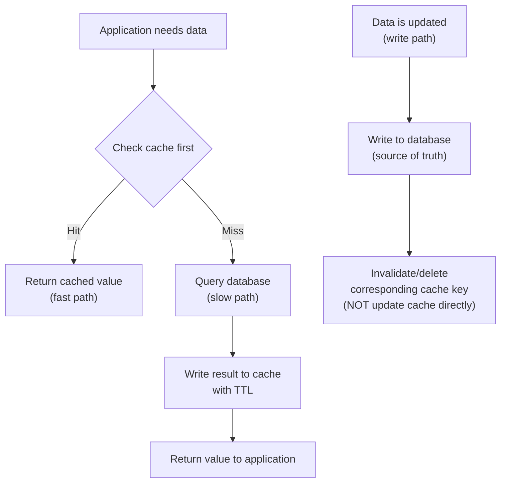
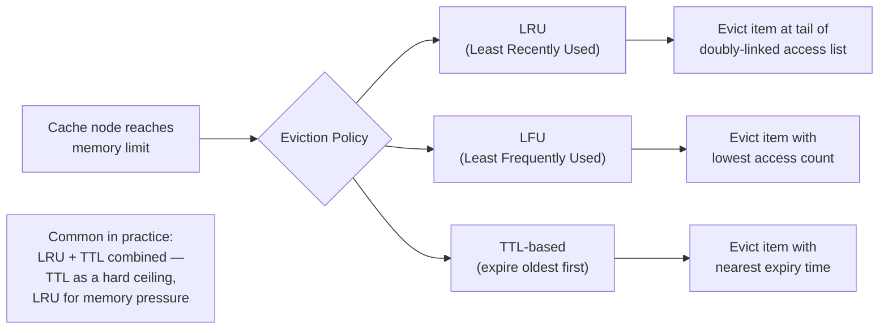
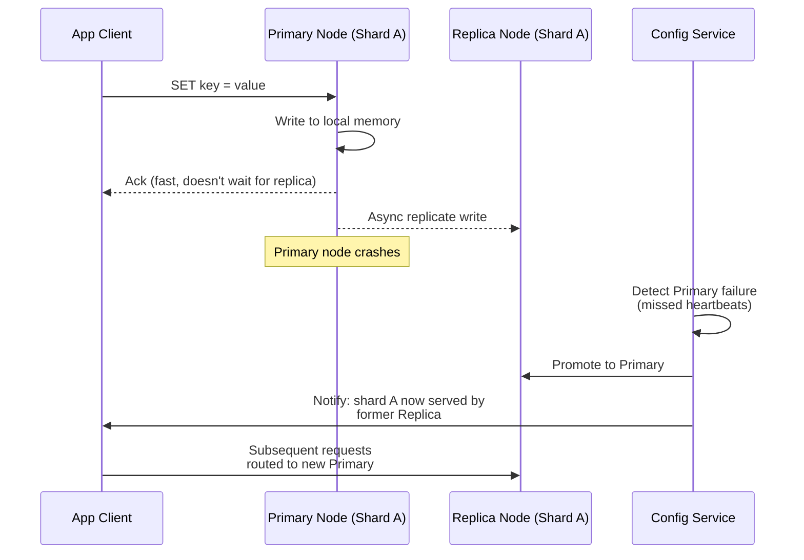
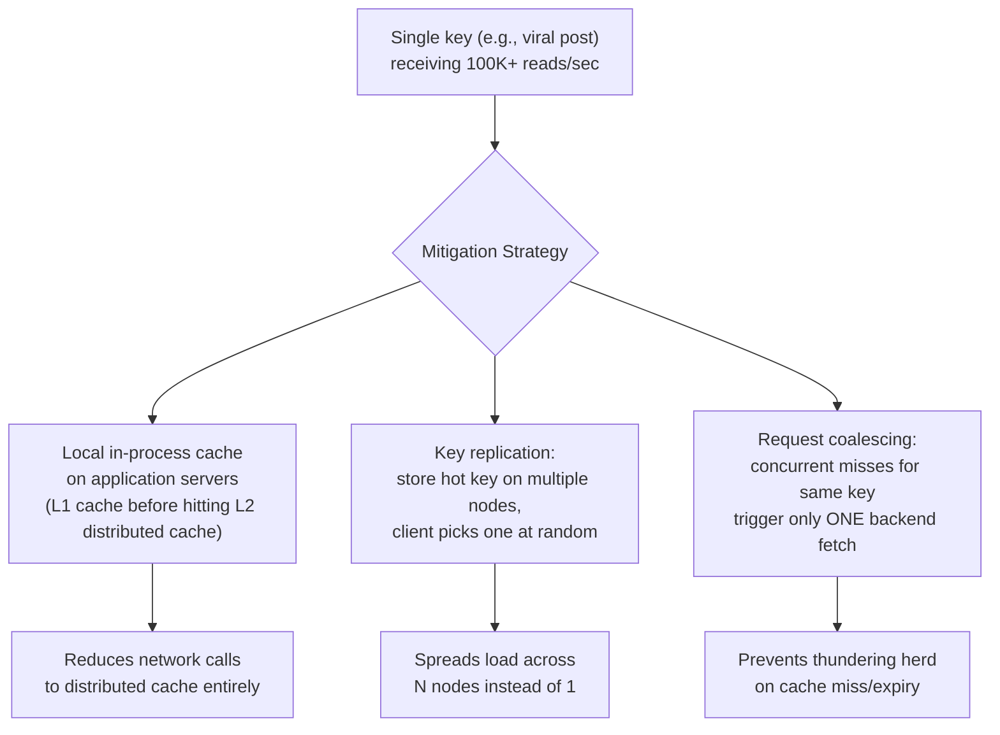
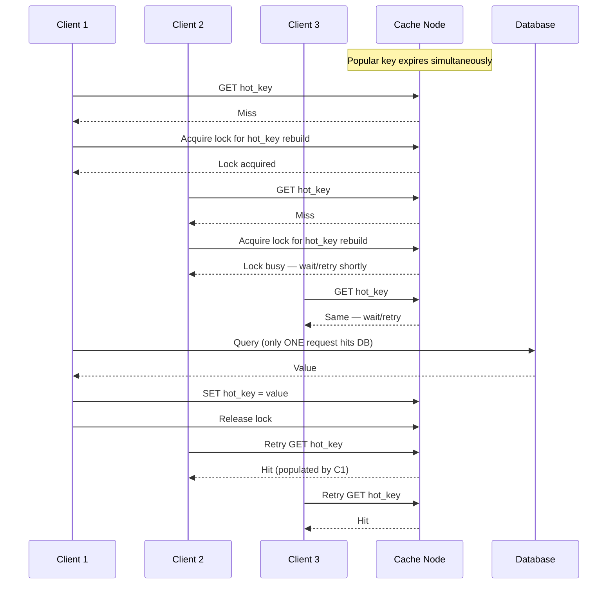
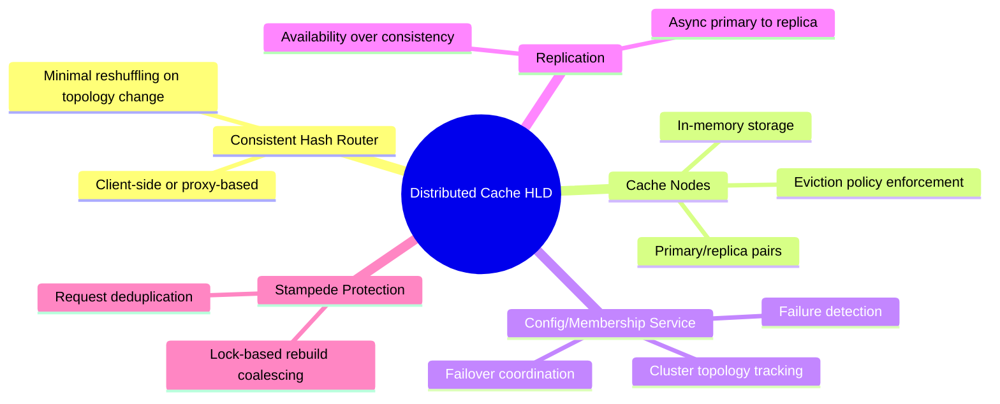

# Design a Distributed Cache — High-Level Design Document

## 1. Requirements

### Functional Requirements
- Standard cache API: GET, SET, DELETE, with TTL support
- Data distributed across many nodes (dataset too large for one machine)
- Support for common eviction policies (LRU, LFU, TTL-based)
- Handle node failures without losing the whole cache
- Support cache invalidation (explicit and TTL-based)

### Non-Functional Requirements
- **Latency:** Sub-millisecond GET/SET at p99
- **Scale:** Millions of keys, 100K+ ops/sec per node, horizontally scalable
- **Availability over consistency:** A stale cache read is usually fine; an unavailable cache is not
- **Hot key resilience:** A small number of very popular keys shouldn't overwhelm a single node
- **Graceful degradation:** Cache miss should fall back to source-of-truth DB, never hard-fail the request

### Back-of-Envelope Estimation
| Metric | Value |
|---|---|
| Total keys | ~1B |
| Avg value size | ~1KB |
| Total dataset size | ~1TB (must be sharded across many nodes) |
| Ops/sec (platform-wide) | ~10M+ |
| Nodes needed (assuming 64GB RAM/node, ~50GB usable) | ~20+ nodes minimum, scaled for redundancy |
| Target hit ratio | > 90% for a well-tuned cache |

---

## 2. High-Level Architecture

**Key idea:** Clients (or a thin proxy layer) use **consistent hashing** to determine which cache node owns a given key, avoiding a single coordinator bottleneck for routing. A separate lightweight coordination service tracks cluster membership so clients know when nodes join/leave.

---

## 3. Consistent Hashing — How Key Routing Works

**Why consistent hashing (not simple `hash(key) % N`):** With modulo hashing, adding/removing a single node remaps almost every key, causing a cache-wide stampede to the backing DB. Consistent hashing (with virtual nodes for even distribution) ensures only the fraction of keys owned by the changed node need to move.

---

## 4. Data Model / Storage Structure (Per Node)

*Internally, each node maintains an in-memory hash table for O(1) key lookup, paired with an eviction-policy-specific auxiliary structure (doubly-linked list for LRU, frequency buckets for LFU, or a min-heap of expiry times for TTL sweeping).*

---

## 5. Cache Read/Write Flow — Detailed Sequence

---

## 6. Cache-Aside Pattern (Most Common Strategy)

**Why invalidate rather than update-on-write:** Updating the cache directly on every DB write risks the cache and DB drifting out of sync if the write path has multiple steps or partial failures. Deleting the cache key and letting the next read repopulate it (cache-aside) is simpler and self-healing — worst case is one extra DB read, not permanent staleness.

---

## 7. Eviction Policies

---

## 8. Replication & Failover

**Tradeoff:** Async replication means a small window of potential data loss on failover (writes not yet replicated when primary crashes) — but this is generally acceptable for a cache, since the backing database remains the true source of truth and a lost cache entry just means a future cache miss, not lost data.

---

## 9. Hot Key Mitigation

---

## 10. Thundering Herd / Cache Stampede Prevention

*Without this lock-based coalescing, a popular key expiring under high load causes hundreds of concurrent clients to simultaneously miss and hammer the database — the classic "thundering herd" or "cache stampede" problem.*

---

## 11. Component Responsibilities Summary

---

## 12. Key Design Decisions & Tradeoffs

| Decision | Choice | Why |
|---|---|---|
| Key routing | Consistent hashing with virtual nodes | Minimizes key remapping when nodes join/leave; avoids cache-wide stampede on topology change |
| Consistency model | Eventual (async replication) | A cache prioritizes availability and speed; the backing DB remains the source of truth for correctness |
| Write pattern | Cache-aside with invalidation-on-write | Simpler and self-healing compared to write-through/write-behind; avoids cache/DB drift |
| Eviction | LRU + TTL combined | TTL bounds staleness; LRU handles memory pressure for keys that haven't expired yet |
| Hot key handling | L1 local cache + replication + coalescing | No single mitigation is sufficient alone; layered defenses handle different traffic patterns |
| Failure handling | Fail open (fall back to DB on cache unavailability) | A cache outage should degrade performance, not take down the whole application |

---

## 13. Bottlenecks & Scaling Considerations

- **Hot keys / celebrity content** — a single popular key can overwhelm one node even with consistent hashing (which balances key *count*, not key *popularity*); needs explicit hot-key detection and mitigation (see above).
- **Memory fragmentation** — long-running cache nodes with variable-size values can suffer internal fragmentation; many production caches (Redis, Memcached) use slab allocation to manage this.
- **Rebalancing cost during scale-out** — even with consistent hashing, adding nodes still requires migrating some data; do this gradually with rate-limited migration to avoid impacting live traffic.
- **Split-brain during network partitions** — if the config service itself partitions, two nodes might both believe they're primary for the same shard; use a consensus-based config store (etcd/ZooKeeper) to avoid this.
- **Cache warming after full restart** — a cold cache after a major outage causes a massive DB load spike; consider pre-warming from a snapshot or gradually ramping traffic back rather than instant full cutover.
- **Cross-region caching** — global applications may need region-local cache clusters (to avoid cross-region latency) with careful invalidation propagation, since a write in one region needs to invalidate stale entries in others.
