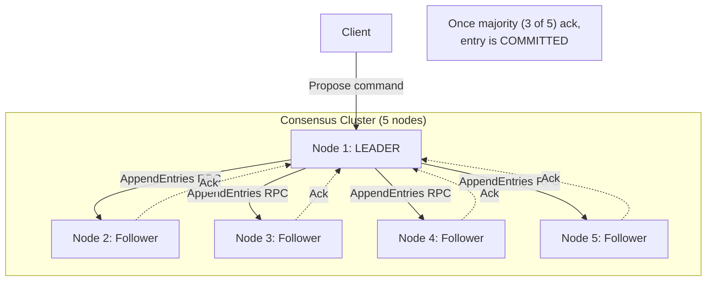
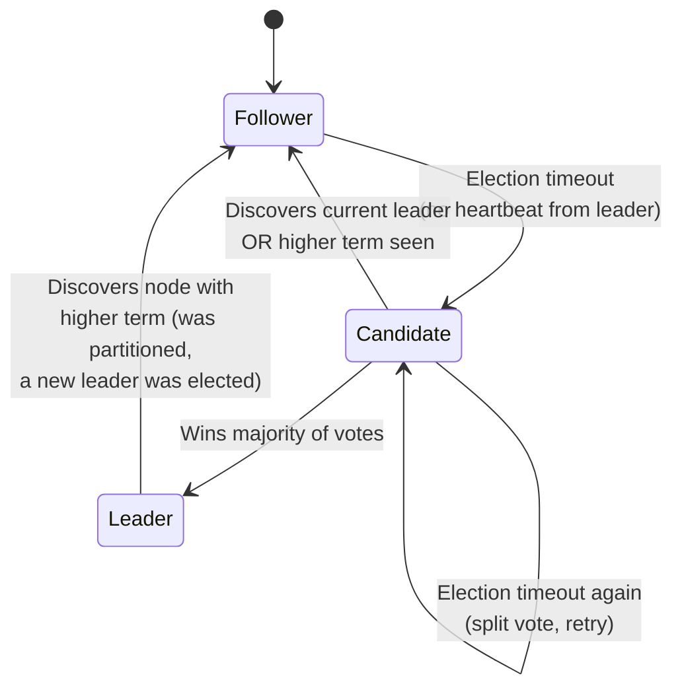
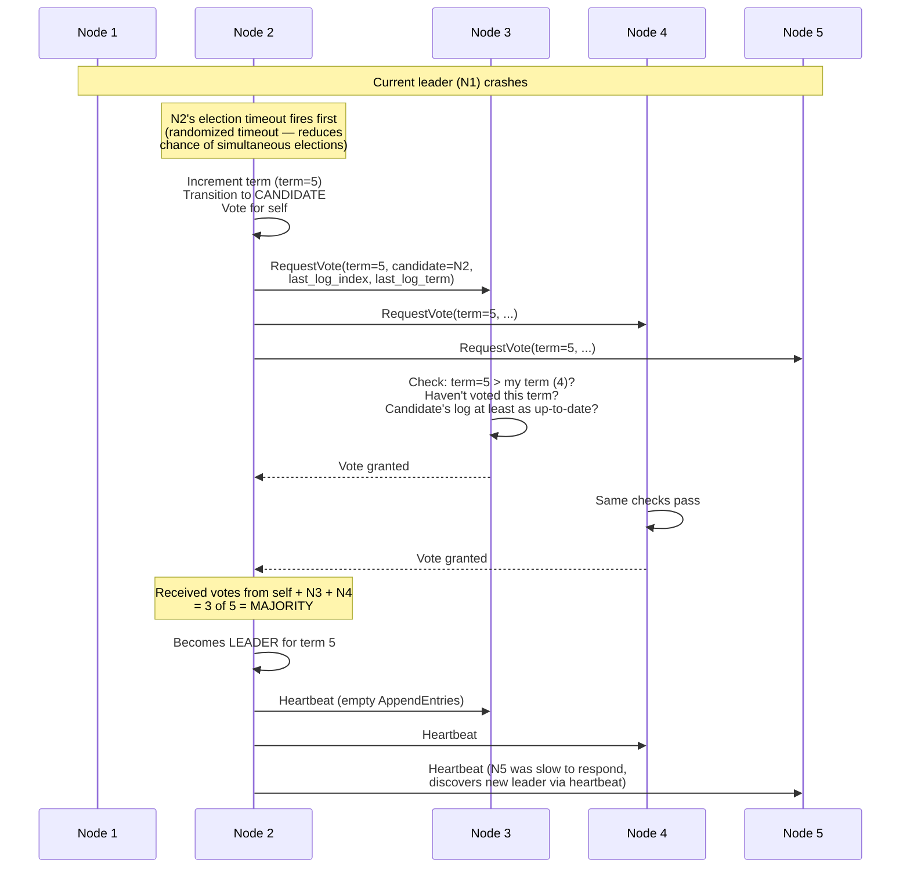
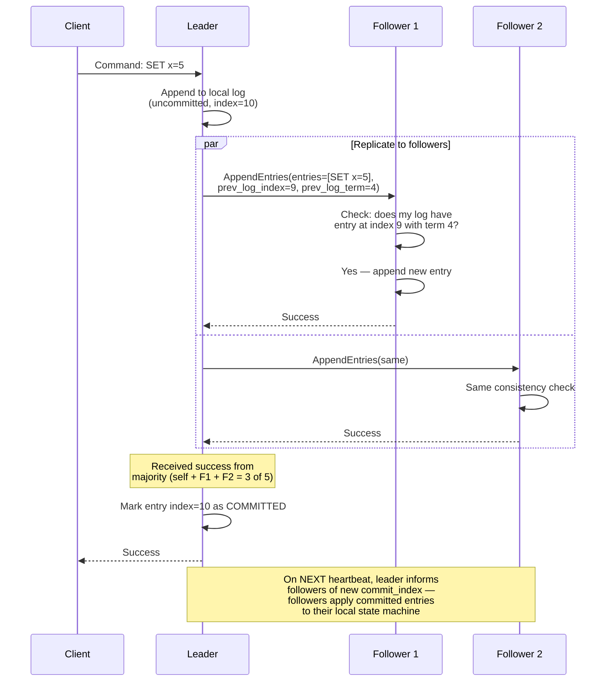
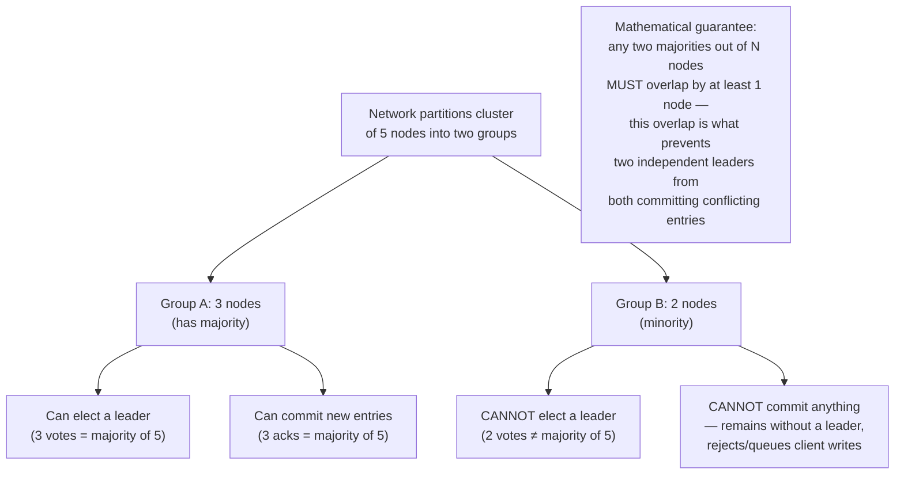
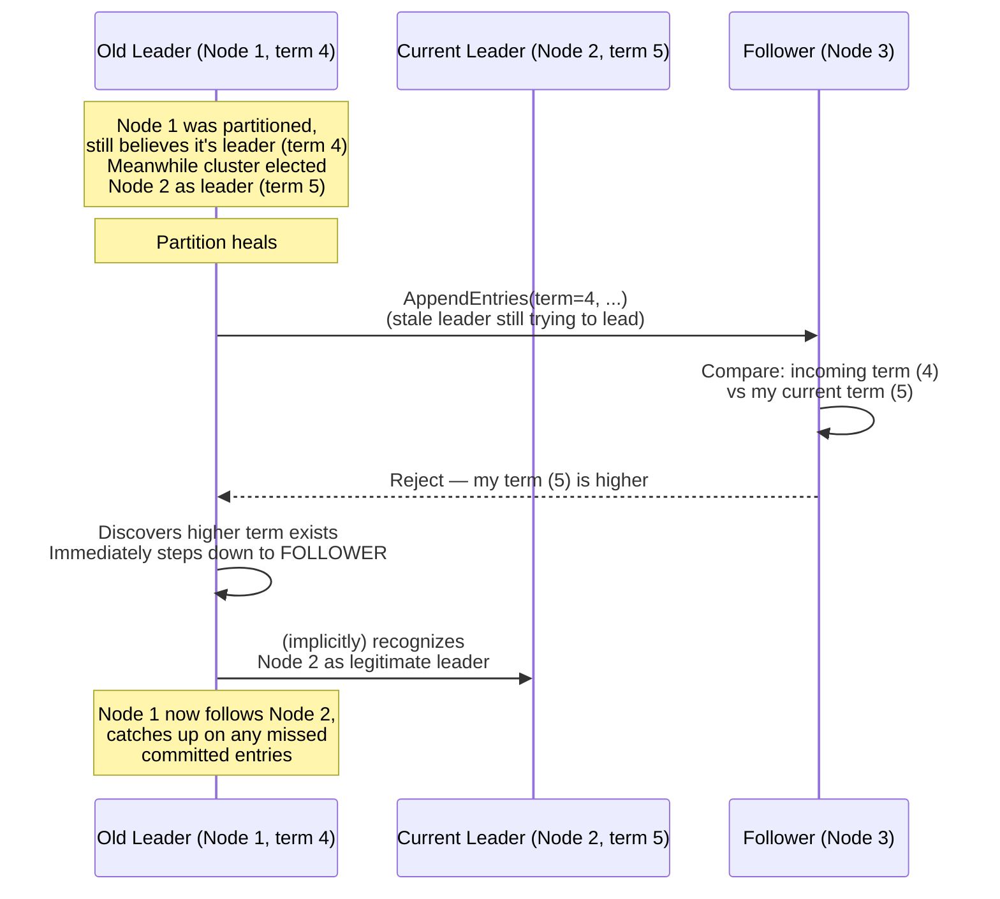
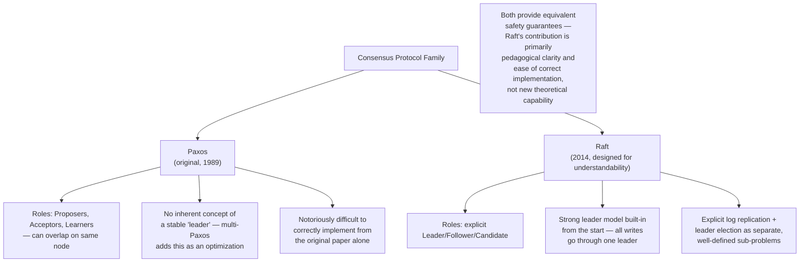
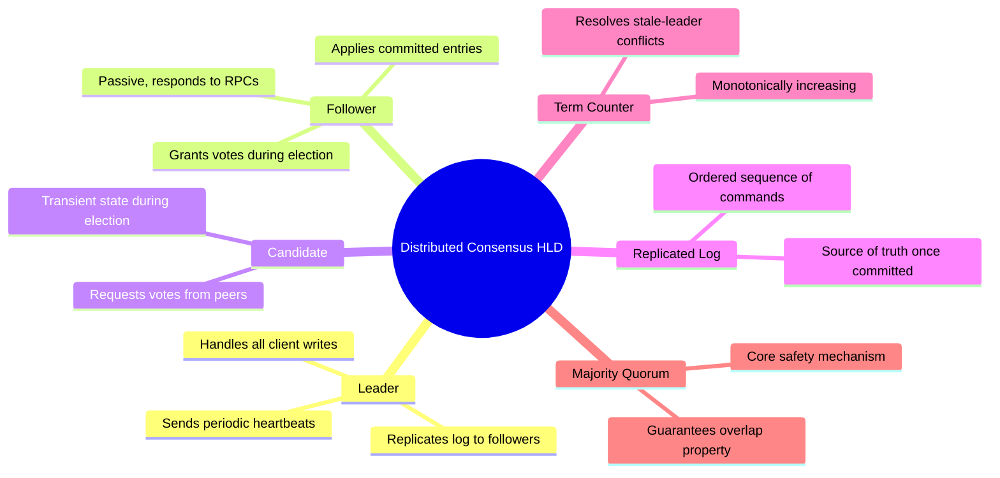

# Design a Distributed Consensus System (Raft/Paxos) — High-Level Design Document

## 1. Requirements

### Functional Requirements
- A cluster of nodes must agree on a single sequence of values/commands (a replicated log), despite failures
- Any node can propose a value; the system must converge on exactly one accepted value per log position
- Support leader-based writes for efficiency, with automatic leader election on failure
- All committed entries must eventually be visible identically on every healthy node

### Non-Functional Requirements
- **Safety (the paramount property):** Never allow two different values to be committed for the same log position — under ANY sequence of failures, message delays, or network partitions
- **Liveness:** The cluster must be able to make progress (elect a leader, commit new entries) as long as a majority of nodes are up and can communicate
- **Fault tolerance:** Tolerates up to `(N-1)/2` node failures in a cluster of N nodes
- **No split-brain:** At most one leader can be active and able to commit entries at any given time

### Back-of-Envelope Estimation
| Metric | Value |
|---|---|
| Typical cluster size | 3, 5, or 7 nodes (odd, for clean majorities) |
| Fault tolerance (N=5) | Tolerates 2 simultaneous node failures |
| Log replication latency | Bounded by round-trip to a majority of nodes |
| Leader election timeout | Randomized, typically 150-300ms range |

---

## 2. High-Level Architecture

**Key idea:** Exactly one node is the leader at any time; all client writes go through it. The leader replicates each new log entry to followers and only considers it "committed" once a **majority** have durably stored it — this majority requirement is the mathematical foundation that makes the whole system safe under partial failure.

---

## 3. Node States & Transitions (Raft's Core State Machine)

*Every node is always in exactly one of these three states. This simplicity — just three possible roles with clear transition triggers — is a large part of why Raft is considered more understandable than the original Paxos formulation, while providing equivalent safety guarantees.*

---

## 4. Leader Election — Detailed Sequence

**Why "last log up-to-date" matters in voting:** A node only grants its vote if the candidate's log is at least as current as its own — this prevents a node that missed recent committed entries from becoming leader and potentially overwriting/losing that committed data. This single rule is central to Raft's safety guarantee.

---

## 5. Log Replication — Detailed Sequence

**Why the `prev_log_index`/`prev_log_term` consistency check matters:** Before accepting a new entry, a follower verifies its log matches the leader's log up to that point. If it doesn't match (e.g., the follower has a stale/incorrect entry from an old leader), the leader detects this and works backward, forcing the follower's log to converge with the leader's — this is how Raft guarantees log consistency across the cluster even after leader changes.

---

## 6. Safety Guarantee — Why Split-Brain Is Impossible

*This overlap property is the single most important insight in majority-quorum consensus: since any two majority sets must share at least one common node, it's mathematically impossible for two different "majorities" to simultaneously commit two different values for the same log position — the shared node would have to agree to both, which the protocol explicitly prevents (a node only votes/acks once per term/index).*

---

## 7. Handling a Stale Leader Rejoining (Term Numbers)

**Why monotonically increasing terms matter:** Every node always defers to a higher term number it observes — this is the mechanism that guarantees a stale leader (one that was partitioned and doesn't know a new election happened) immediately and safely steps down the moment it learns a newer term exists, rather than continuing to issue conflicting commands.

---

## 8. Paxos vs Raft — Conceptual Comparison

---

## 9. Component Responsibilities Summary

---

## 10. Key Design Decisions & Tradeoffs

| Decision | Choice | Why |
|---|---|---|
| Consensus family | Raft (leader-based) over classic multi-Paxos | Explicit strong-leader model simplifies reasoning and implementation while providing equivalent safety |
| Commit rule | Majority quorum acknowledgment | Mathematically guarantees any two majorities overlap, making split-brain commits impossible |
| Cluster size | Odd numbers (3/5/7) | Avoids wasted fault tolerance — an even-sized cluster gains no extra resilience over the next-lower odd size |
| Leader election trigger | Randomized timeout | Reduces probability of simultaneous candidacies (split votes) that would otherwise repeatedly stall election |
| Term numbers | Monotonically increasing, compared on every RPC | Provides an unambiguous way for stale leaders/followers to detect they're behind and defer to current state |
| Log consistency enforcement | prev_log_index/term check on every AppendEntries | Ensures followers' logs stay consistent with the leader's, even after leader changes mid-stream |

---

## 11. Bottlenecks & Scaling Considerations

- **Write throughput bounded by slowest majority node** — every committed write requires a round trip to a majority of nodes; adding more nodes to a cluster does NOT increase write throughput (it actually can decrease it, since more nodes must acknowledge) — consensus clusters are scaled for fault tolerance, not throughput.
- **This is why consensus is used sparingly** — real systems typically use a small consensus cluster (e.g., 3-5 nodes) purely for critical coordination metadata (leader election, configuration, locks) rather than for high-volume application data, which gets sharded across many independent replica sets instead.
- **Network partition duration** — a minority partition remains completely unable to make progress for as long as the partition lasts; this is the direct, intentional cost of prioritizing safety (CP) over availability during partitions.
- **Leader as a bottleneck for large clusters** — all client interaction funnels through one node; for read scaling, followers can often serve reads directly (with appropriate staleness caveats), but all writes remain leader-bound.
- **Log compaction/snapshotting** — an ever-growing replicated log eventually needs periodic snapshotting (compacting old entries into a state snapshot) so that new nodes joining or recovering nodes don't need to replay the entire history from the beginning.
- **Configuration changes (adding/removing nodes)** — changing cluster membership itself must go through the consensus protocol to avoid a window where old and new configurations could both form independent majorities (a subtle correctness issue Raft handles via joint consensus during the transition).
- **Cross-region consensus latency** — if cluster nodes span geographic regions (as in globally distributed strongly-consistent systems), majority round-trip time is bounded by inter-region network latency, directly limiting write throughput for globally-replicated consensus groups.
