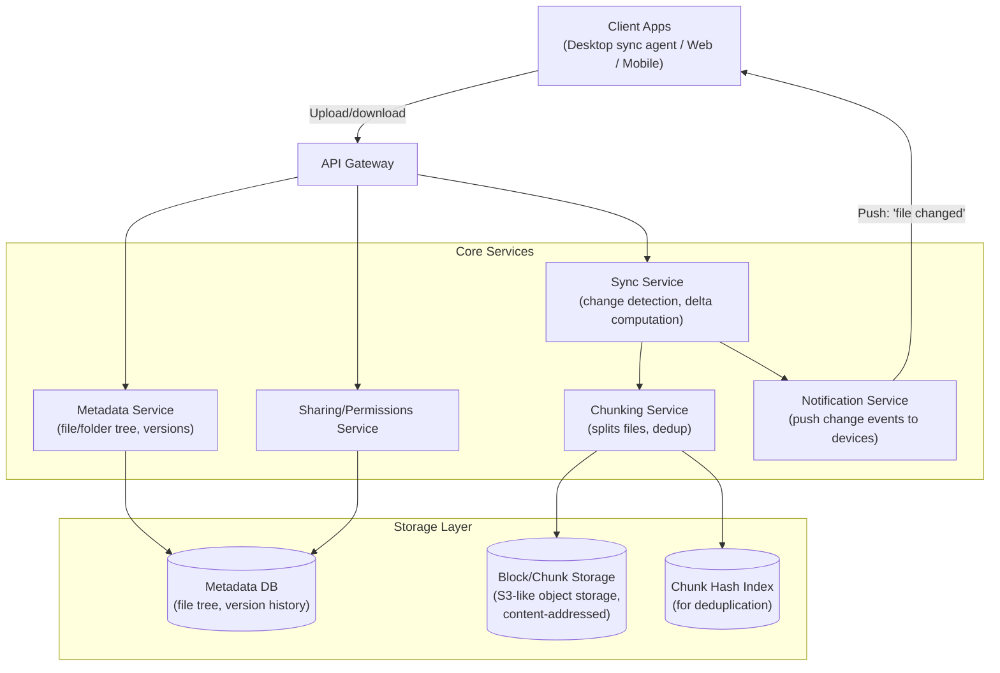
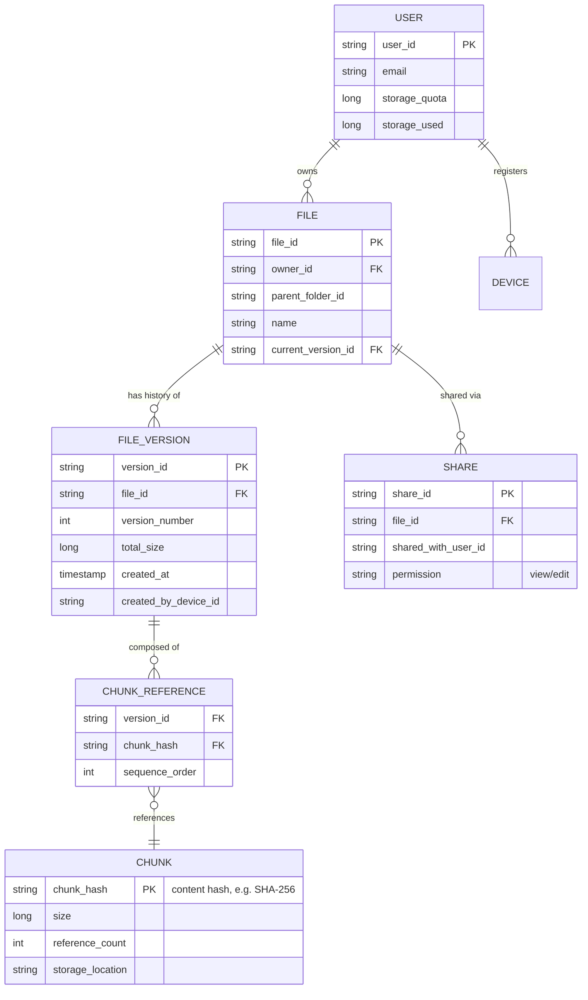
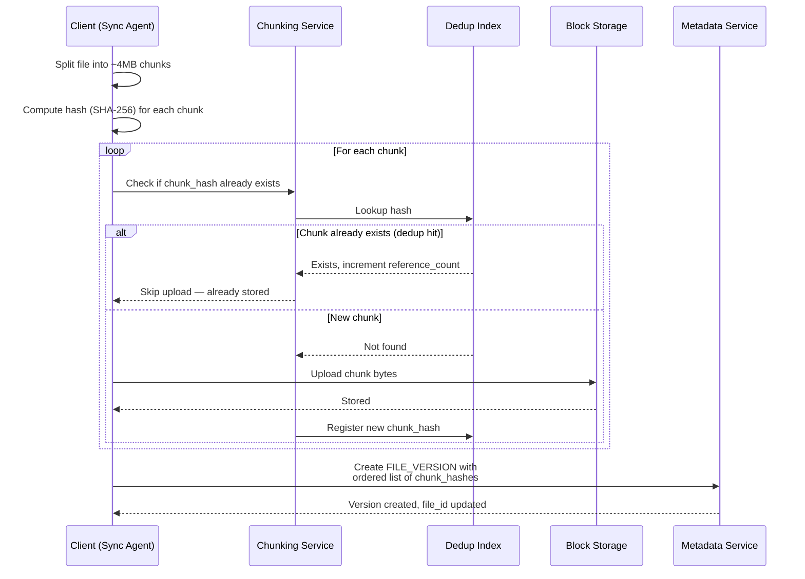
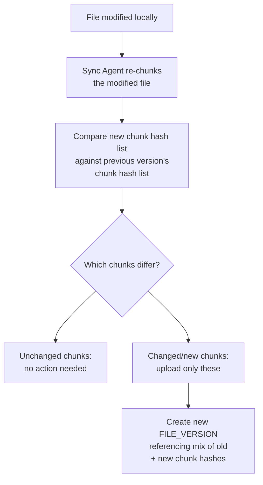
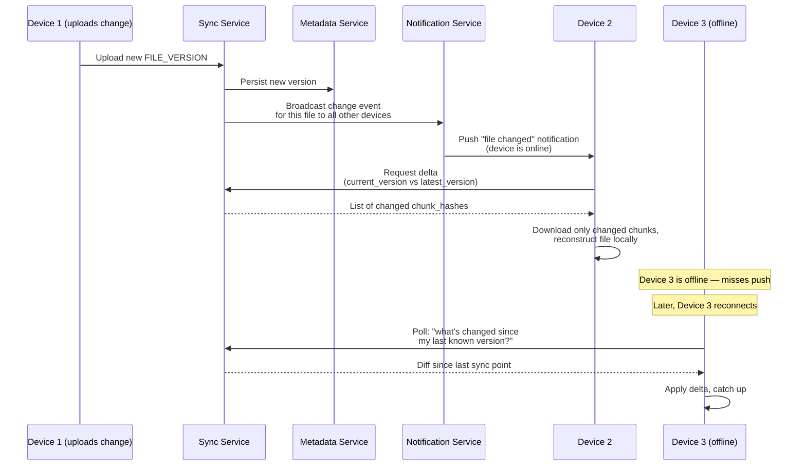
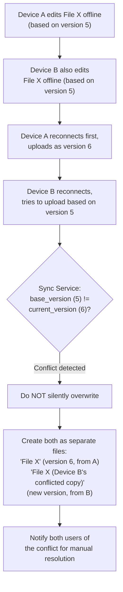
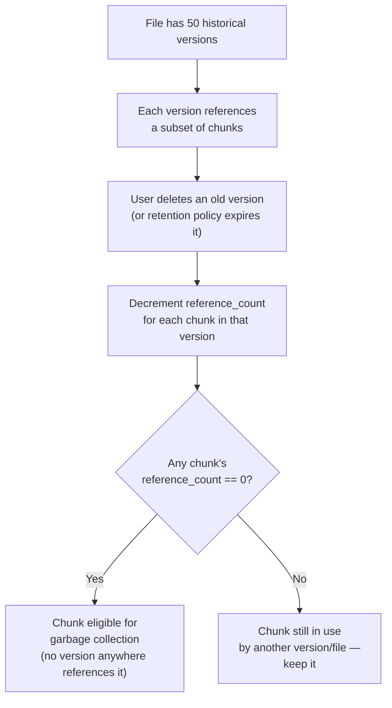
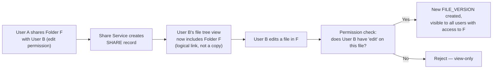
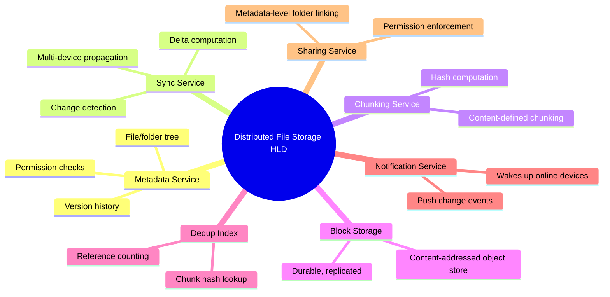

# Design a Distributed File Storage System (Dropbox/Google Drive) — High-Level Design Document

## 1. Requirements

### Functional Requirements
- Upload, download, delete files/folders
- Sync files across multiple devices automatically
- Support large files via chunked upload/download
- File versioning (restore previous versions)
- Sharing files/folders with other users, with permissions
- Conflict resolution when the same file is edited offline on two devices

### Non-Functional Requirements
- **Scale:** ~500M users, exabytes of total storage
- **Bandwidth efficiency:** Only sync the parts of a file that changed (delta sync), not the whole file
- **Durability:** 99.999999999% (11 nines) — data must never be lost
- **Availability:** Sync should resume gracefully after any connectivity interruption
- **Consistency:** Eventually consistent across devices is acceptable; conflicts must be handled gracefully, not silently overwritten

### Back-of-Envelope Estimation
| Metric | Value |
|---|---|
| DAU | ~100M |
| Avg storage/user | ~10GB |
| Total storage | ~5 exabytes |
| File uploads/sec (platform-wide) | ~50,000 |
| Avg file size | Highly variable — KB (docs) to GB (video) |
| Chunk size | ~4MB (common choice, balances overhead vs granularity) |

---

## 2. High-Level Architecture

**Key idea:** Files are never treated as monolithic blobs — they're split into content-addressed **chunks**. This enables two critical features: (1) **delta sync** — only upload/download the chunks that actually changed, and (2) **deduplication** — if two users store the identical file (or two versions share unchanged sections), the identical chunks are stored only once platform-wide.

---

## 3. Data Model

**Key modeling decision:** A `FILE_VERSION` doesn't store the file content directly — it stores an **ordered list of chunk references**. Two versions of a mostly-unchanged large file share almost all the same chunk references, so storing a new version costs almost nothing beyond the changed chunks.

---

## 4. File Upload Flow — Chunking & Deduplication

**Why content-addressed chunks:** Using the chunk's own content hash as its identifier means identical content — whether from the same user re-uploading, two different users with the same file, or unchanged sections across versions — is automatically recognized and deduplicated, without any explicit "is this the same file" logic needed.

---

## 5. Delta Sync — Detecting What Changed

*A single-line edit at the start of a large document might shift byte offsets throughout the file — this is why **content-defined chunking** (using rolling hash boundaries like Rabin fingerprinting, rather than fixed byte offsets) is used in production systems: it re-anchors chunk boundaries around actual content changes, so an insertion near the top doesn't cause every subsequent chunk to appear "changed" due to offset shifting.*

---

## 6. Multi-Device Sync Propagation

---

## 7. Conflict Resolution (Concurrent Offline Edits)

**Why this approach:** Silently picking a "winner" (e.g., last-write-wins) risks silently destroying a user's work — unacceptable for a file storage product. Instead, the system detects the version mismatch and preserves **both** edits as separate items, letting the user manually reconcile — the same strategy Dropbox and Google Drive actually use ("conflicted copy" files).

---

## 8. File Versioning & Storage Reclamation

*This reference-counting garbage collection is what makes deduplication safe — a chunk is only physically deleted once nothing in the entire system still points to it.*

---

## 9. Sharing & Permissions

*Shared folders are implemented as metadata-level references, not physical file copies — this keeps storage costs proportional to actual unique content, not the number of users a folder is shared with.*

---

## 10. Component Responsibilities Summary

---

## 11. Key Design Decisions & Tradeoffs

| Decision | Choice | Why |
|---|---|---|
| File representation | Content-addressed chunks, not monolithic blobs | Enables delta sync and cross-user/cross-version deduplication naturally |
| Chunking strategy | Content-defined (rolling hash) over fixed-offset | Avoids cascading "everything changed" false positives from small edits near the start of a file |
| Conflict resolution | Preserve both versions as separate files, never silent overwrite | File storage products must never silently destroy user data — user must resolve conflicts explicitly |
| Sharing model | Metadata-level linking, not physical copying | Keeps storage cost proportional to unique content regardless of how widely something is shared |
| Storage reclamation | Reference-counted garbage collection | Makes deduplication safe — chunks only deleted when truly orphaned across the entire system |
| Consistency model | Eventually consistent across devices | Real-time strict consistency across arbitrarily many offline-capable devices isn't achievable; explicit conflict handling compensates |

---

## 12. Bottlenecks & Scaling Considerations

- **Metadata DB as a hot path** — every file operation touches metadata (tree structure, versions, permissions); needs to be highly available and low-latency, often sharded by `user_id` or `file_id` hash.
- **Small file overhead** — chunking a 10KB file into a single "chunk" still incurs metadata overhead per chunk; systems often special-case very small files to avoid chunking overhead disproportionate to file size.
- **Dedup index scale** — a global chunk hash index across exabytes of data is enormous; typically sharded by hash prefix, similar to a distributed hash table.
- **Sync storm on large shared folder changes** — if a folder shared with 10,000 people gets a new file, notification fanout to that many devices simultaneously needs the same hybrid push/pull thinking as a social feed's celebrity-fanout problem.
- **Mobile bandwidth/battery constraints** — mobile sync agents can't behave like desktop agents (constant background chunking/hashing drains battery); typically use coarser sync intervals, wifi-only large-file sync options, and deferred chunk hashing.
- **Garbage collection safety** — reference-count-based deletion must be carefully race-condition-free (a chunk shouldn't be deleted the instant its count hits zero if another version creation referencing it is in-flight); usually handled with a grace period before physical deletion.
- **Large file initial upload** — multi-GB files need resumable, parallel chunk upload (not a single monolithic request) to tolerate connection drops without restarting from scratch.
