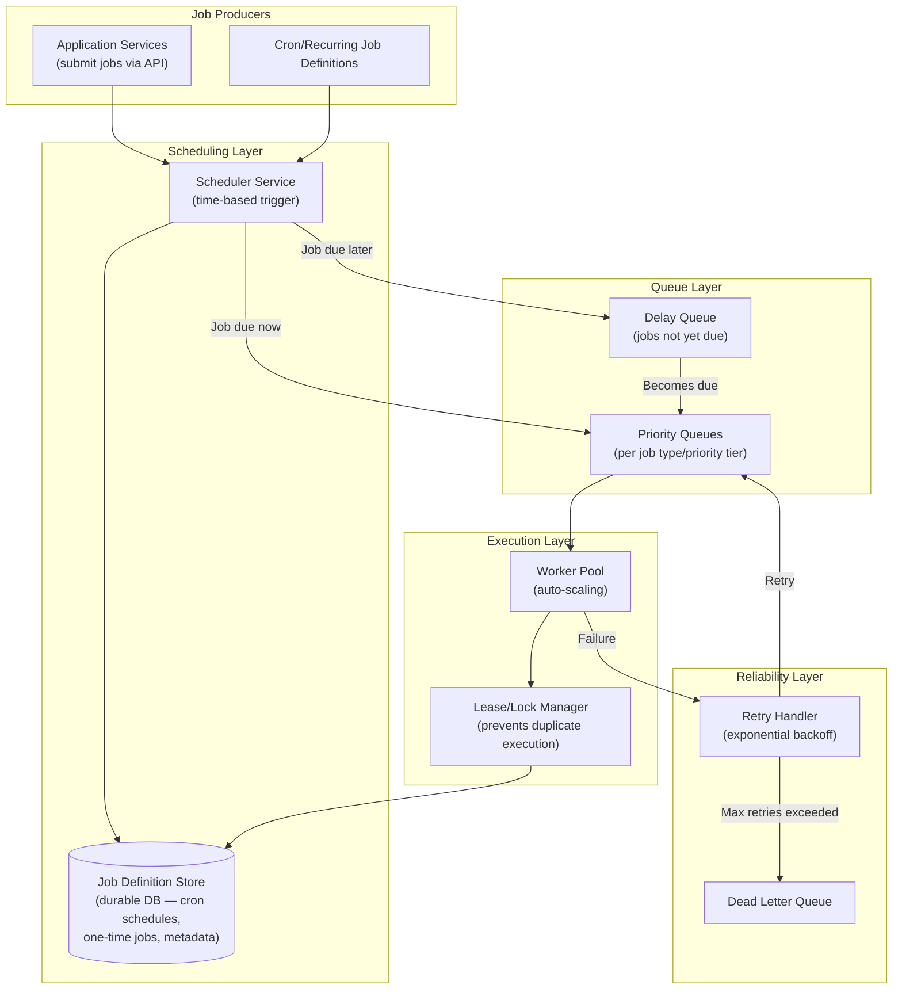
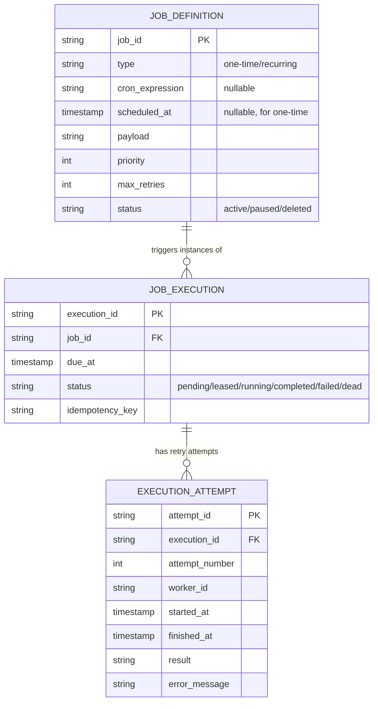
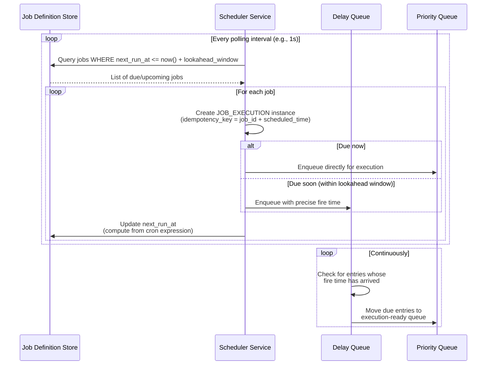
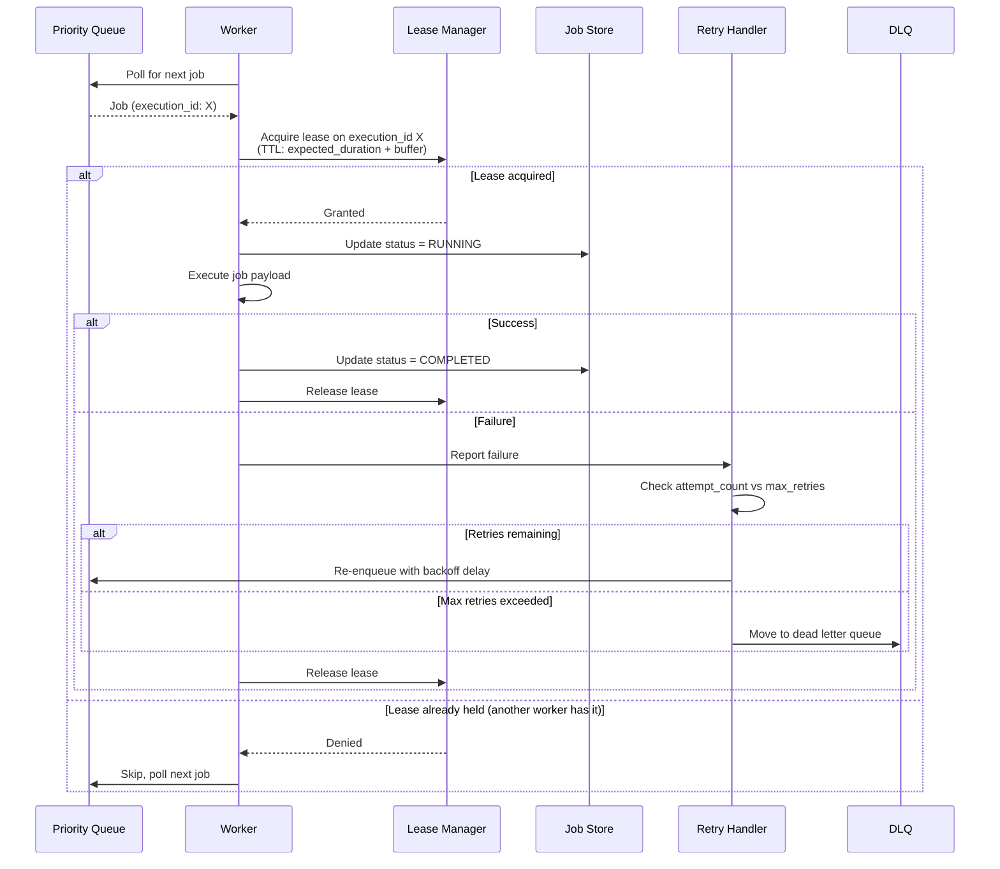
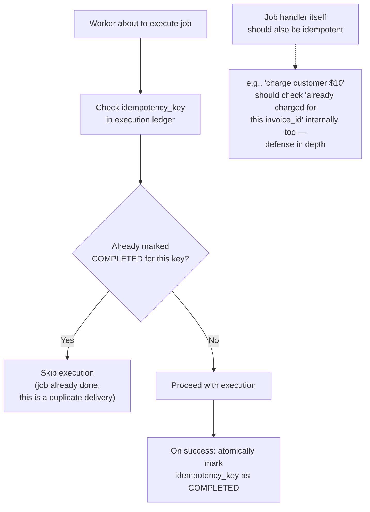
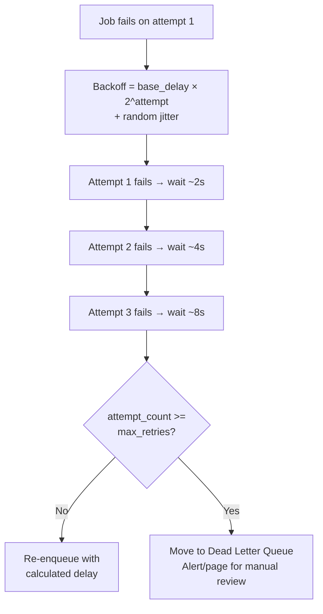
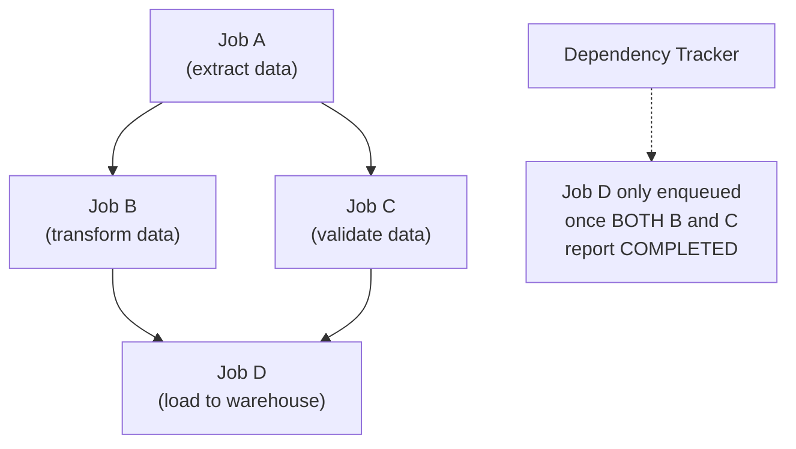
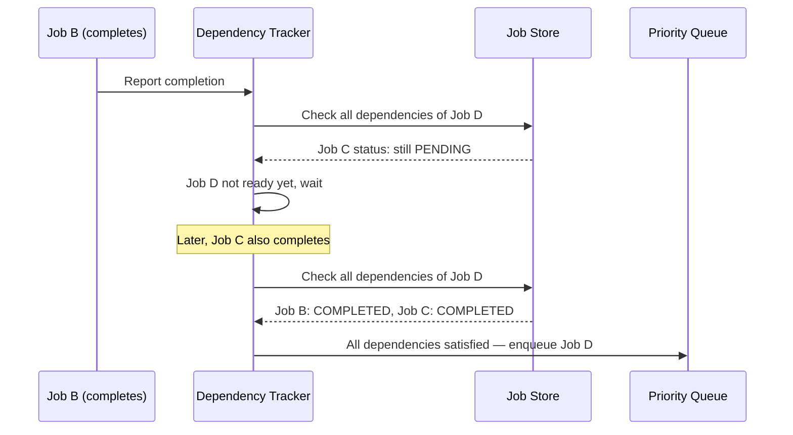
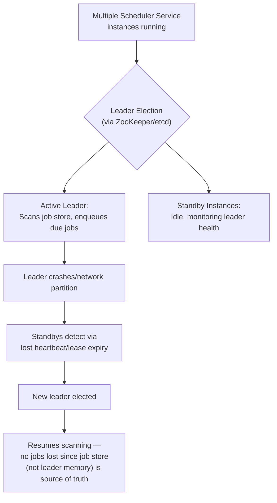
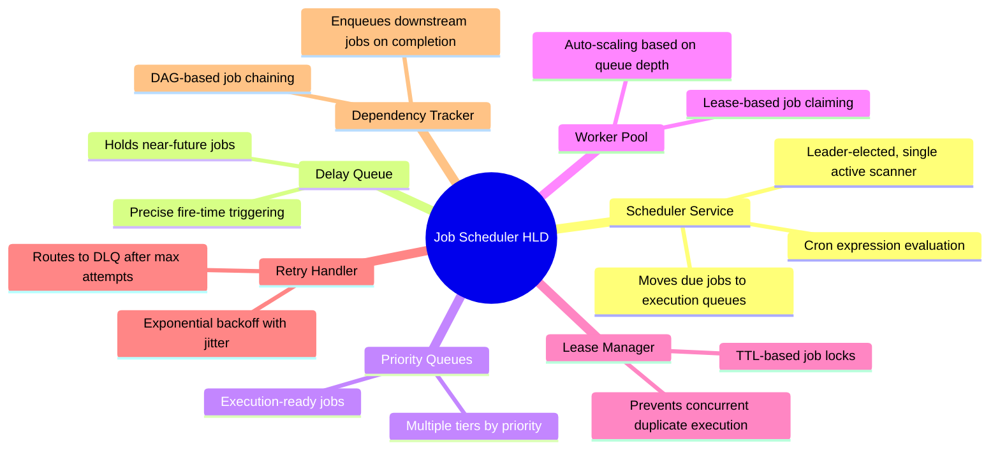

# Design a Distributed Job Scheduler / Task Queue — High-Level Design Document

## 1. Requirements

### Functional Requirements
- Schedule jobs to run at a specific time or on a recurring cron-like schedule
- Support immediate (fire-and-forget) task queueing in addition to scheduled jobs
- Guarantee job execution — no silently dropped jobs
- Support job priorities, retries with backoff, and dead-letter handling for permanently failing jobs
- Support job dependencies (job B runs only after job A completes)
- Idempotent execution — a job accidentally run twice shouldn't cause harmful side effects

### Non-Functional Requirements
- **Exactly-once-ish execution:** In practice, "effectively-once" via at-least-once delivery + idempotent handlers
- **Scale:** Millions of scheduled jobs, tens of thousands of jobs executing per second at peak
- **Reliability:** Scheduler crash must not lose or duplicate pending jobs
- **Timing accuracy:** Scheduled jobs should fire within a small tolerance window (e.g., ± few seconds)
- **Horizontal scalability:** Adding more worker capacity should linearly increase throughput

### Back-of-Envelope Estimation
| Metric | Value |
|---|---|
| Total scheduled jobs (at rest) | ~100M |
| Jobs executing/sec (peak) | ~50,000 |
| Avg job execution time | Varies: ms (simple) to minutes (batch) |
| Cron-style recurring jobs | ~1M unique schedules |
| Worker fleet size | Elastic, scales with queue depth |

---

## 2. High-Level Architecture

**Key idea:** Scheduling (deciding *when* a job should run) and execution (actually running it) are cleanly separated. The Scheduler Service continuously scans for jobs coming due and moves them into execution-ready queues; workers pull from those queues independently, so scheduling accuracy and execution throughput can scale independently of each other.

---

## 3. Data Model

---

## 4. Job Scheduling Flow (Cron-style Recurring Jobs)

**Why a lookahead window + delay queue:** Rather than the scheduler doing a fresh DB scan at the exact millisecond every job is due (expensive and imprecise at scale), it pulls upcoming jobs into an in-memory/Redis-backed delay queue slightly ahead of time, then fires them precisely from there — decoupling expensive DB polling from precise timing.

---

## 5. Job Execution Flow — Detailed Sequence

**Why leases, not simple dequeue-and-delete:** If a worker crashes mid-execution after dequeuing a job but before marking it complete, a naive "delete on dequeue" approach loses the job entirely. Leases with a TTL ensure that if a worker dies mid-job, the lease expires and another worker can safely pick it up — at the cost of potential duplicate execution, which is why idempotency matters.

---

## 6. Preventing Duplicate Execution (Idempotency)

*Since the lease mechanism only provides **at-least-once** delivery (not exactly-once), true safety requires the job execution ledger to dedupe by idempotency key, AND ideally the job's own business logic to be idempotent as a second layer of protection.*

---

## 7. Retry with Exponential Backoff

*Jitter (small randomization added to the delay) prevents synchronized retry storms — if 10,000 jobs fail simultaneously due to a downstream outage, staggered jitter prevents them all from retrying at the exact same moment and re-overwhelming the recovering downstream service.*

---

## 8. Job Dependencies (DAG Execution)

---

## 9. Distributed Scheduler High Availability

*Only one scheduler instance should be actively scanning and enqueueing at a time to avoid duplicate enqueueing of the same due job — leader election ensures this while providing automatic failover.*

---

## 10. Component Responsibilities Summary

---

## 11. Key Design Decisions & Tradeoffs

| Decision | Choice | Why |
|---|---|---|
| Scheduling vs execution | Cleanly separated layers | Allows independent scaling — scheduling accuracy doesn't depend on execution throughput and vice versa |
| Delivery guarantee | At-least-once + idempotency keys | True exactly-once is effectively impossible in distributed systems; at-least-once + dedup achieves the same practical outcome |
| Duplicate prevention | Lease-based locking with TTL | Balances safety (job never truly lost) against liveness (crashed worker's job is eventually retried, not stuck forever) |
| Retry strategy | Exponential backoff + jitter | Prevents retry storms from synchronized failures overwhelming a recovering downstream dependency |
| Scheduler HA | Leader election, single active scanner | Prevents duplicate enqueueing while still providing automatic failover |
| Job dependencies | DAG tracking via completion events | Enables complex pipelines (ETL-style) without requiring jobs to poll for their dependencies' status |

---

## 12. Bottlenecks & Scaling Considerations

- **Scheduler DB polling at scale** — scanning millions of job definitions for "what's due soon" needs an efficient index (e.g., on `next_run_at`) and a bounded lookahead window; naive full-table scans won't keep up at scale.
- **Lease TTL tuning** — too short risks a slow-but-healthy job being falsely reclaimed by another worker (duplicate execution); too long delays recovery if a worker actually crashes. Should be set based on realistic job duration estimates, ideally with periodic lease renewal (heartbeating) for long-running jobs.
- **Hot job types dominating queue capacity** — a single very high-frequency job type could starve other job types; use separate priority queues per job category, not one global queue.
- **Dead letter queue growth** — DLQ entries need active monitoring/alerting, not silent accumulation — a growing DLQ usually signals a systemic downstream issue worth paging on.
- **Clock synchronization** — scheduler instances and workers must agree on "now" for accurate due-time comparisons; NTP-synced clocks are assumed, but the delay-queue design should tolerate small skew gracefully.
- **Thundering herd on recovery** — after a downstream outage resolves, many backed-up retrying jobs firing simultaneously can re-trigger the outage; jittered backoff (above) plus optional gradual queue-drain rate limiting mitigates this.
- **Recurring job schedule drift** — computing `next_run_at` from a cron expression must be done relative to the *scheduled* time, not the *actual execution* time, to avoid gradual drift if jobs occasionally run late.
