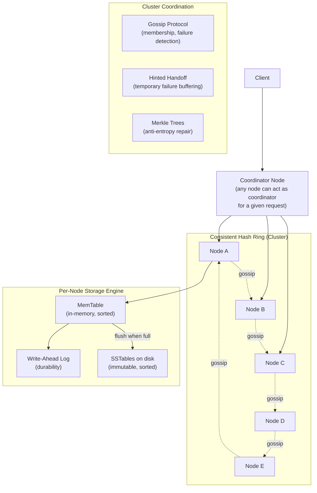
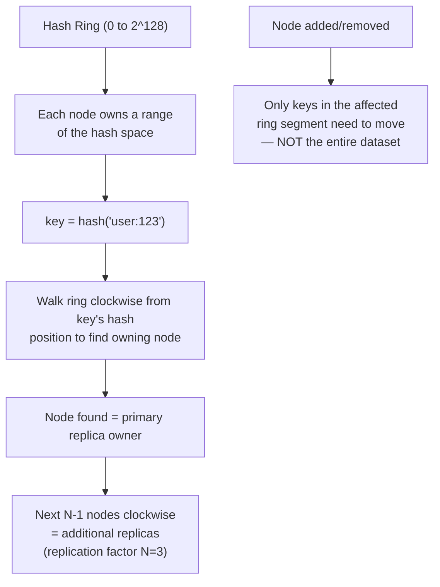
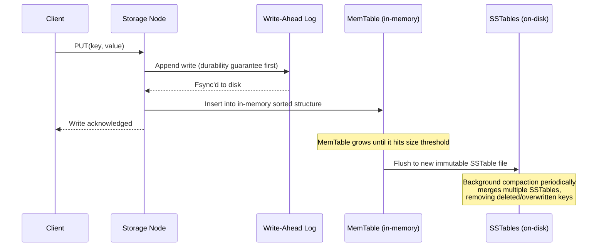
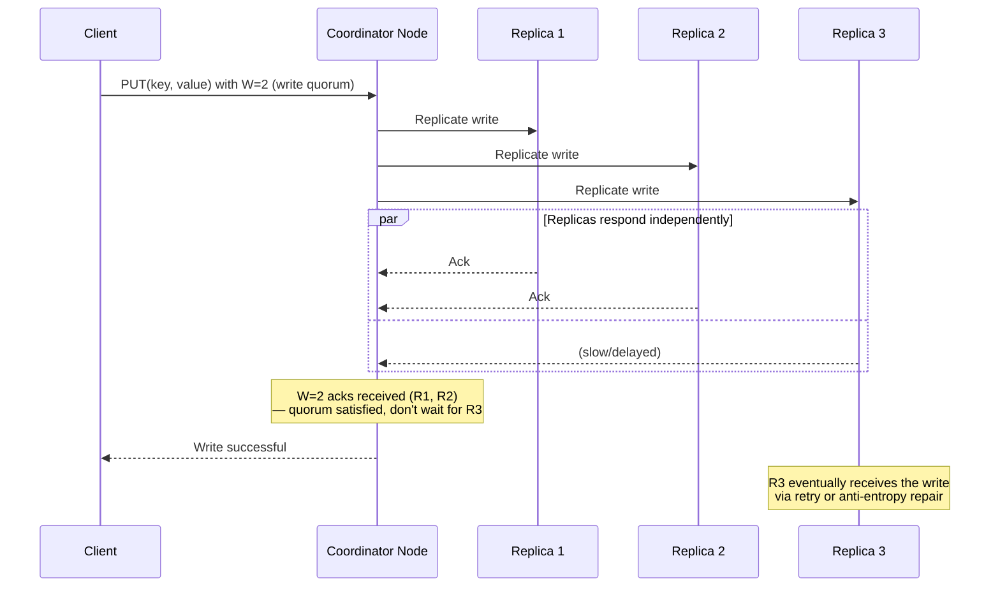
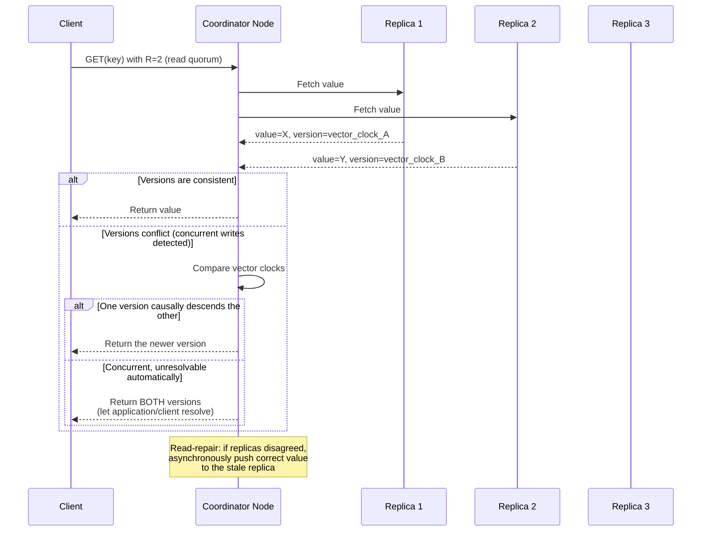
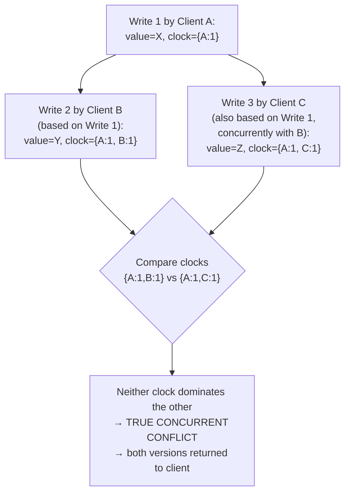
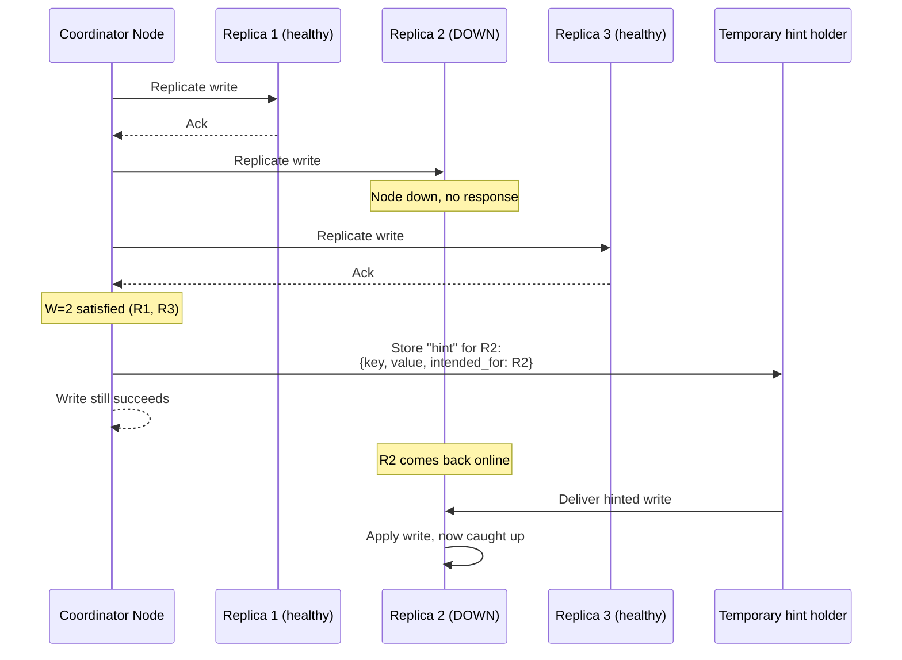
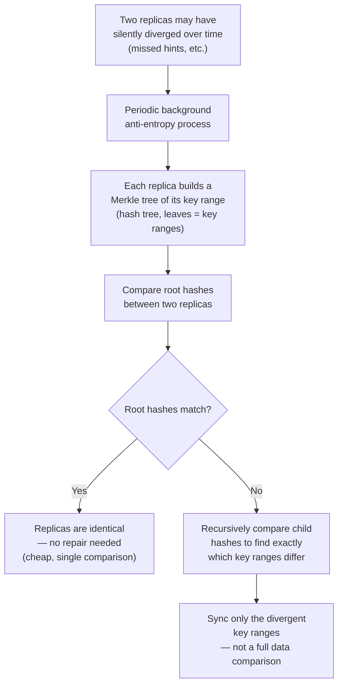
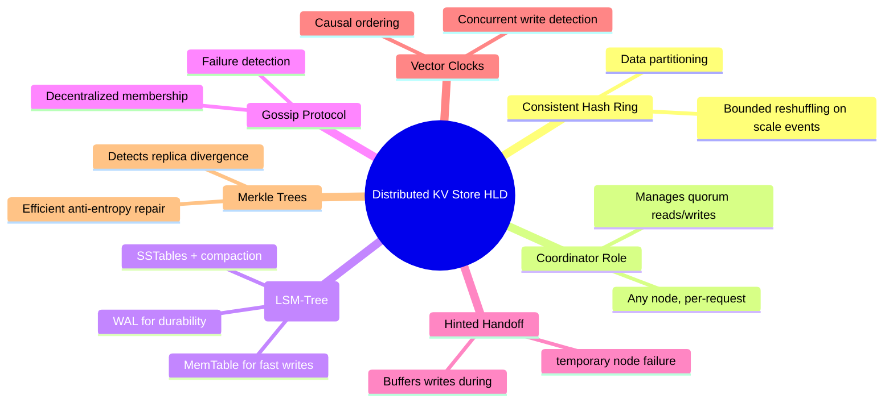

# Design a Distributed Key-Value Store (DynamoDB-style) — High-Level Design Document

## 1. Requirements

### Functional Requirements
- Basic operations: `PUT(key, value)`, `GET(key)`, `DELETE(key)`
- Data automatically partitioned (sharded) across many nodes
- Data replicated across nodes for durability and availability
- Configurable consistency (tunable per-request: strong vs eventual)
- Automatic handling of node failures without data loss

### Non-Functional Requirements
- **Availability > strict consistency** by default (AP system, per CAP theorem), with tunable consistency
- **Horizontal scalability:** Add/remove nodes without full system downtime or full data reshuffle
- **Low latency:** Single-digit millisecond reads/writes at p99
- **Partition tolerance:** Must continue operating during network partitions between nodes
- **Durability:** Once a write is acknowledged, it must survive node failures

### Back-of-Envelope Estimation
| Metric | Value |
|---|---|
| Nodes in cluster | Hundreds to thousands |
| Total keys | Billions |
| Replication factor | Typically 3 |
| Reads/writes per sec (cluster-wide) | Millions |
| Latency target | < 10ms p99 for single-key operations |

---

## 2. High-Level Architecture

**Key idea:** There is no single master — **any node can coordinate any request**, data is partitioned via consistent hashing across the ring, and cluster membership/failure detection happens via a decentralized gossip protocol rather than a central coordinator. This is the architecture underlying systems like DynamoDB, Cassandra, and Riak.

---

## 3. Consistent Hashing — Data Partitioning

**Why consistent hashing over simple `hash(key) % num_nodes`:** With modulo hashing, adding or removing a single node forces nearly *all* keys to remap (since the modulus changes). Consistent hashing bounds the reshuffling to only the keys in the ring segment adjacent to the changed node — critical for scaling a cluster without massive data movement.

---

## 4. Data Model & Storage Engine (LSM-Tree Based)

**Key idea (LSM-Tree):** Writes are always fast because they only ever go to an in-memory structure (after being durably logged) — never requiring in-place disk seeks. Data is later flushed to immutable sorted files (SSTables) and periodically **compacted** in the background to reclaim space and maintain read efficiency.

---

## 5. Write Path — Quorum-Based Replication

**Key idea:** With replication factor N=3, the coordinator doesn't need all 3 replicas to acknowledge before returning success — just a **write quorum W** (e.g., W=2). This is the core availability/latency tradeoff: waiting for fewer replicas means faster, more available writes, at the cost of temporarily inconsistent replicas that get reconciled later.

---

## 6. Read Path — Quorum-Based Reads & Conflict Resolution

**Key idea (tunable consistency):** `R + W > N` guarantees strong consistency (at least one replica in any read quorum overlaps with any write quorum). Choosing `R + W ≤ N` favors availability/latency over strict consistency — this is the "tunable consistency" DynamoDB-style systems are known for, decided per-operation by the client.

---

## 7. Vector Clocks — Detecting Concurrent Writes

*Vector clocks let the system distinguish "this write happened strictly after that one" (safe to auto-resolve) from "these writes happened concurrently, neither aware of the other" (genuine conflict requiring application-level resolution, e.g., merging a shopping cart's contents from both versions).*

---

## 8. Node Failure Handling — Hinted Handoff

*Hinted handoff lets the system keep accepting writes at full replication intent even when a replica is temporarily down — a nearby healthy node holds a "hint" (essentially an IOU) and delivers it once the failed node recovers, rather than either blocking the write or permanently under-replicating.*

---

## 9. Anti-Entropy Repair — Merkle Trees

*Merkle trees let two replicas efficiently determine whether (and where) their data has diverged by comparing tree hashes top-down, without transferring or comparing every single key — critical for keeping repair traffic manageable across a large dataset.*

---

## 10. Component Responsibilities Summary

---

## 11. Key Design Decisions & Tradeoffs

| Decision | Choice | Why |
|---|---|---|
| Partitioning | Consistent hashing | Bounds data movement to a small ring segment when nodes join/leave, unlike modulo hashing |
| Replication | Configurable N (typically 3), quorum-based R/W | Tunable per-operation tradeoff between latency, availability, and consistency |
| Consistency model | Eventual by default, tunable to strong (R+W>N) | Prioritizes availability (AP over CP) but allows callers to opt into stronger guarantees when needed |
| Storage engine | LSM-Tree (WAL + MemTable + SSTables) | Optimized for extremely high write throughput; sequential disk writes instead of random-access updates |
| Conflict resolution | Vector clocks + application-level merge for true conflicts | Distinguishes safely-resolvable causal ordering from genuine concurrent conflicts that need app logic |
| Failure handling | Hinted handoff (short-term) + Merkle tree repair (long-term) | Keeps the system available during transient failures while ensuring eventual full consistency |
| Cluster membership | Gossip protocol (decentralized) | No single point of failure for membership/failure detection, unlike a central coordinator |

---

## 12. Bottlenecks & Scaling Considerations

- **Hot keys / partition skew** — a single extremely popular key can overwhelm the few nodes that own its hash range; mitigated via key-level caching or splitting hot keys with a sharding suffix (e.g., `key#1`, `key#2`) and merging on read.
- **Compaction overhead** — background SSTable compaction competes for disk I/O with live read/write traffic; must be carefully throttled to avoid latency spikes during compaction cycles.
- **Read amplification in LSM-trees** — a `GET` may need to check the MemTable plus multiple SSTables (until compacted); bloom filters per SSTable are used to quickly skip files that definitely don't contain the key.
- **Vector clock growth** — clocks can grow unbounded with many concurrent writers over time; typically pruned/truncated with a bounded size, trading some historical causal precision for bounded metadata overhead.
- **Gossip convergence time at very large cluster sizes** — thousands of nodes can take longer to converge on membership state changes; often mitigated with gossip fan-out tuning or hierarchical gossip structures.
- **Rebalancing cost during cluster resize** — even with consistent hashing's bounded reshuffling, large-scale node additions still require substantial background data transfer; must be rate-limited to avoid starving live traffic of bandwidth/disk I/O.
- **Cross-datacenter replication** — extending this model globally adds significant write latency if requiring cross-region quorum; typically handled with per-datacenter local quorums plus asynchronous cross-region replication for disaster recovery.
