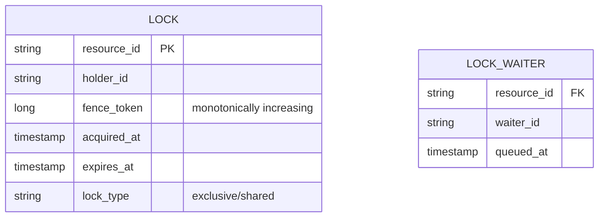
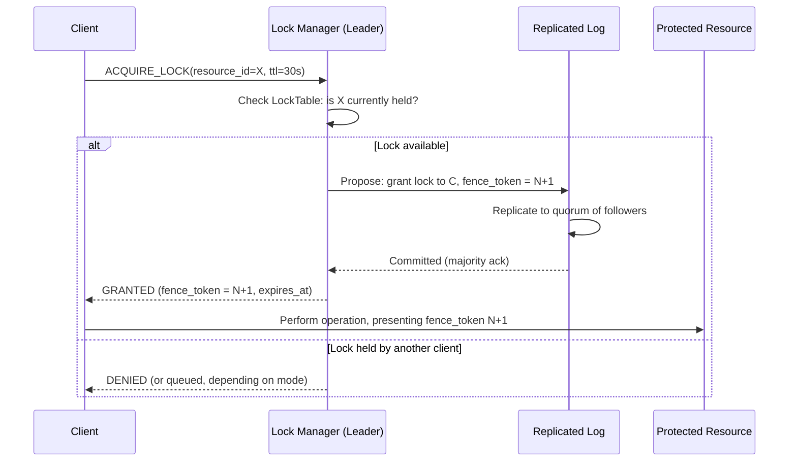
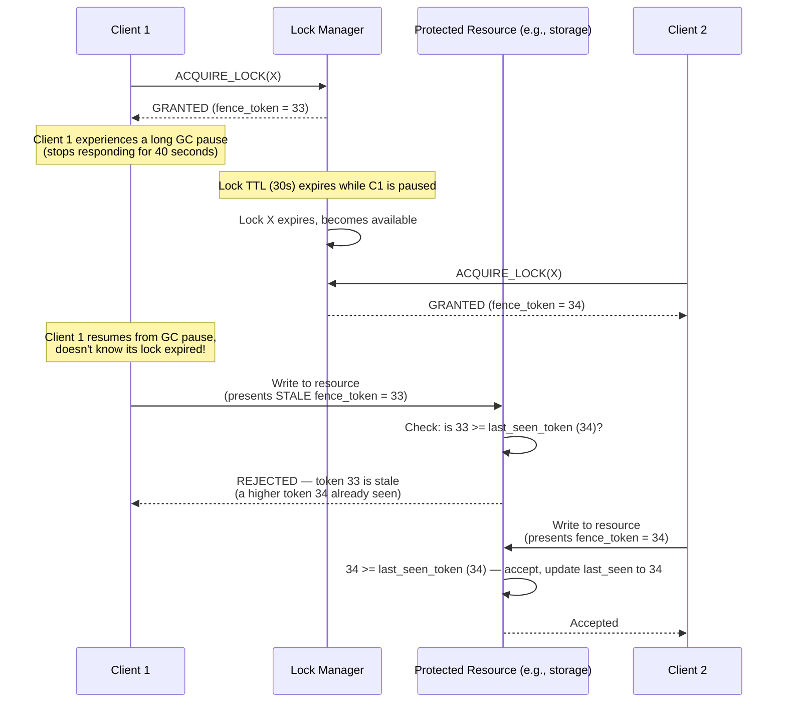
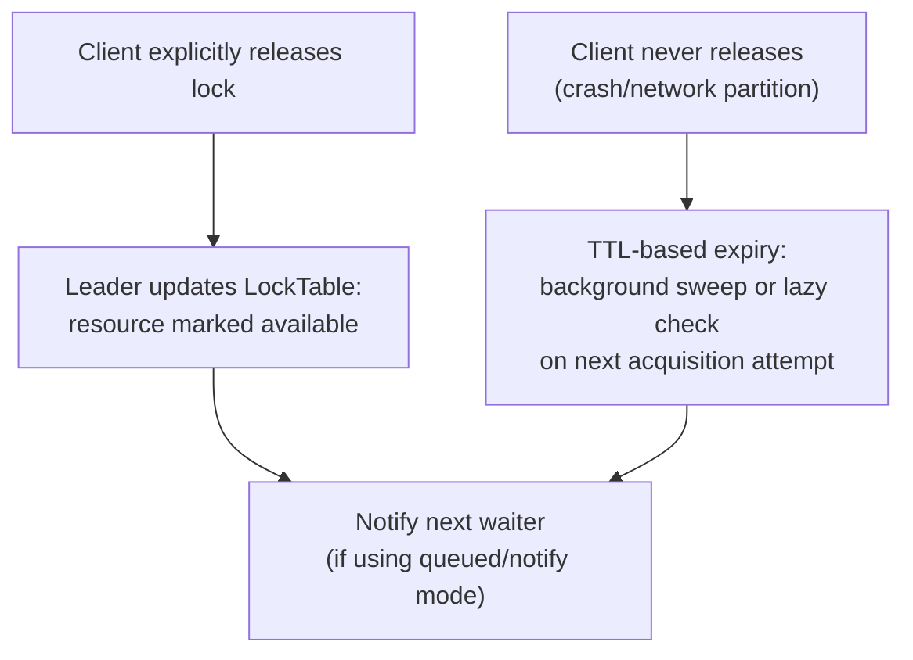
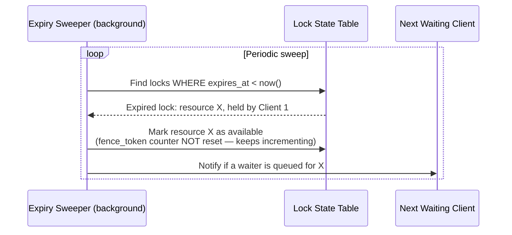
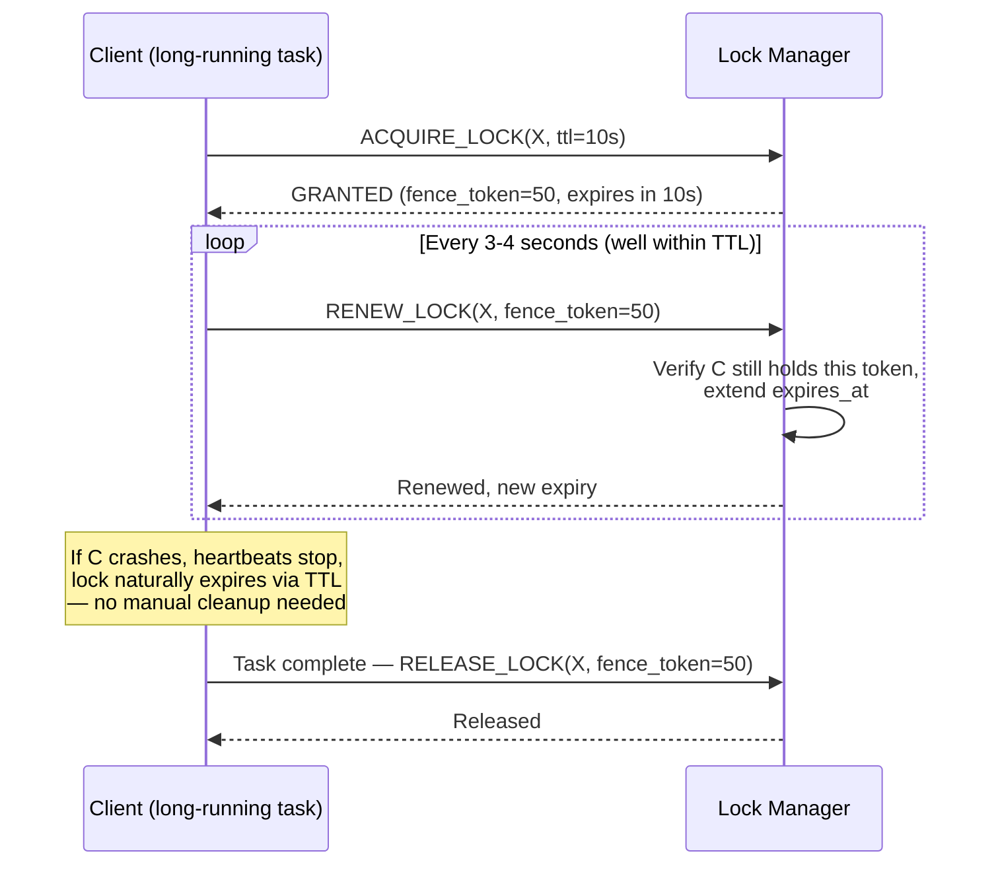
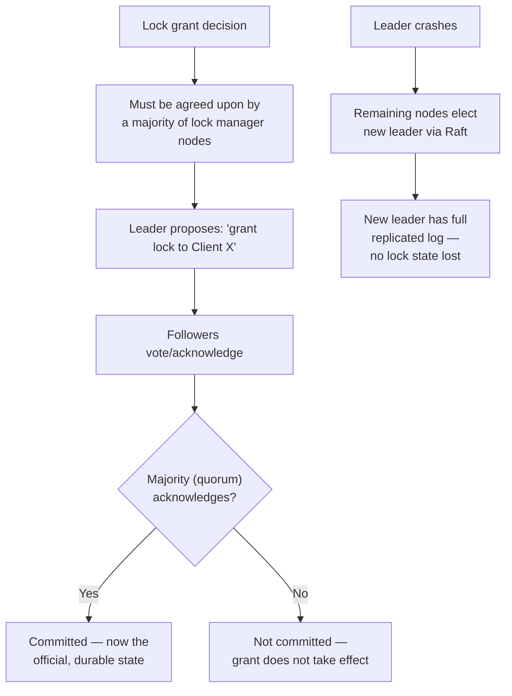
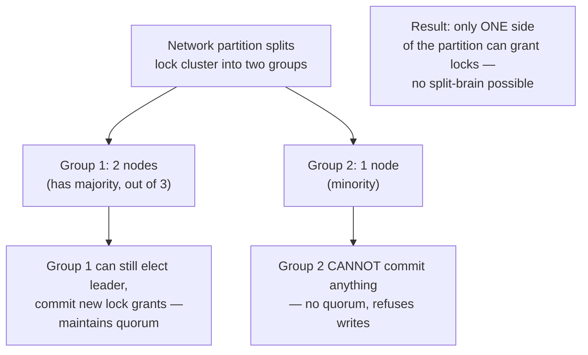
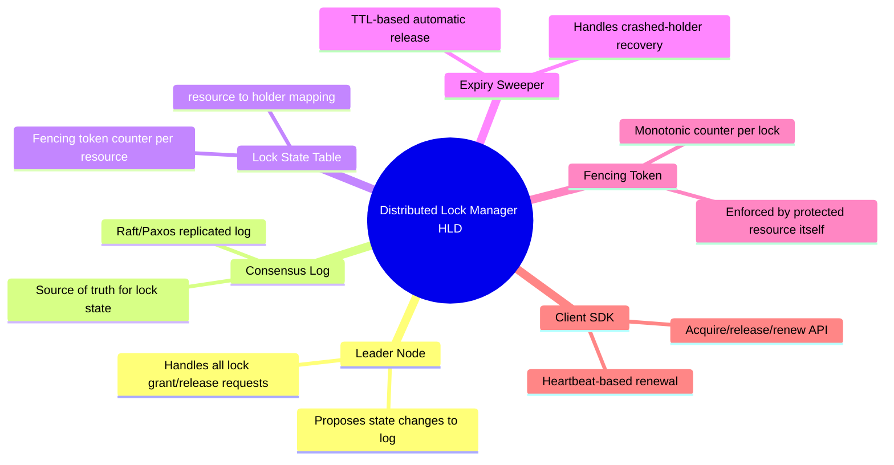

# Design a Distributed Lock Manager — High-Level Design Document

## 1. Requirements

### Functional Requirements
- Acquire and release locks on named resources across multiple processes/machines
- Support both exclusive locks and (optionally) shared/read locks
- Locks must automatically expire if the holder crashes (no permanent deadlock)
- Support reentrant locks (same holder can re-acquire without deadlocking itself, optional)
- Notify waiters when a lock becomes available (optional, vs pure polling)

### Non-Functional Requirements
- **Safety (correctness) above all:** Two clients must never simultaneously believe they hold the same exclusive lock — this is the entire point of the system
- **Liveness:** A crashed lock holder must not permanently block others from acquiring the lock
- **Availability:** The lock service itself must survive node failures without losing lock state
- **Low latency:** Lock acquisition should be fast (< 10-50ms) since it's often on a hot path
- **Fencing:** Must protect against the "paused/slow client thinks it still holds the lock" problem

### Back-of-Envelope Estimation
| Metric | Value |
|---|---|
| Lock acquisitions/sec (platform-wide) | ~10,000-100,000 |
| Typical lock hold duration | Milliseconds to seconds |
| Concurrent distinct locks | Millions (many different resources) |
| Lock service nodes | Odd number (3, 5, 7) for consensus quorum |

---

## 2. High-Level Architecture

```mermaid
flowchart TB
    subgraph Clients["Client Processes"]
        C1["Client 1<br/>(Service Instance A)"]
        C2["Client 2<br/>(Service Instance B)"]
        C3["Client 3<br/>(Service Instance C)"]
    end

    subgraph LockCluster["Lock Manager Cluster (Consensus-based)"]
        Leader["Leader Node<br/>(handles all writes)"]
        Follower1["Follower Node 1"]
        Follower2["Follower Node 2"]
    end

    subgraph Storage["Replicated Log / State"]
        Log[("Replicated Log<br/>(Raft/Paxos)"]
        LockTable[("Lock State Table<br/>resource → holder, expiry, fence_token")]
    end

    ProtectedResource["Protected Resource<br/>(e.g., shared file, DB row,<br/>critical section)"]

    C1 <-->|"Acquire/Release"| Leader
    C2 <-->|"Acquire/Release"| Leader
    C3 <-->|"Acquire/Release"| Leader

    Leader -->|"Replicate"| Follower1
    Leader -->|"Replicate"| Follower2
    Leader --> Log --> LockTable

    C1 -.->|"Access resource with<br/>fence token"| ProtectedResource
```

**Key idea:** The lock manager itself is a small distributed system requiring **consensus** (Raft/Paxos-based, like ZooKeeper/etcd/Consul) — because the lock state (who holds what) must never diverge between nodes, or two clients could be told by different nodes that they each hold the same exclusive lock.

---

## 3. Data Model



---

## 4. Basic Lock Acquisition Flow



---

## 5. The Fencing Token Problem — Why Simple Locks Aren't Enough



**Why this matters — this is the crux of the whole problem:** A lock's TTL expiring doesn't guarantee the original holder has actually stopped working (it might just be paused — GC, slow network, OS scheduling). The **fencing token** (a monotonically increasing number issued with each lock grant) lets the *protected resource itself* reject stale writes from a client that no longer legitimately holds the lock, even if that client doesn't know it lost the lock. Without this, a naive TTL-based lock provides an illusion of safety, not real safety.

---

## 6. Lock Release & Automatic Expiry





---

## 7. Lock Renewal (Heartbeating) for Long-Running Operations



*Short TTLs with frequent renewal (rather than one long TTL) give faster failure detection — if a client crashes, the lock becomes available again within one TTL period rather than however long the original operation was expected to take.*

---

## 8. Consensus Layer — Why Raft/Paxos Underpins This



*This is precisely why production distributed locks are built on top of consensus systems like ZooKeeper, etcd, or Consul rather than a single arbitrarily-chosen coordinator node — a single node granting locks unilaterally would be a single point of failure and, worse, a single point of potential incorrectness during a network partition.*

---

## 9. Handling Network Partitions (Split-Brain Prevention)



**Why odd-numbered clusters (3, 5, 7):** A quorum-based system needs a strict majority to make progress. With an odd number of nodes, any network partition can produce at most one side with a majority — guaranteeing at most one "active" side can ever grant locks, which is what prevents split-brain lock grants.

---

## 10. Component Responsibilities Summary



---

## 11. Key Design Decisions & Tradeoffs

| Decision | Choice | Why |
|---|---|---|
| Underlying consensus | Raft/Paxos-based cluster (odd node count) | Only mechanism that provides both safety (no split-brain) and liveness (survives node failure) for lock state |
| Failure detection | TTL-based expiry, not indefinite hold | A crashed client must not permanently block a resource; TTL bounds the worst-case unavailability |
| Stale-holder protection | Fencing tokens, checked by the protected resource | TTL expiry alone can't guarantee the original holder has actually stopped — the resource itself must be the final enforcement point |
| Renewal | Short TTL + frequent heartbeat renewal | Faster failure detection than one long TTL matched to expected task duration |
| Lock queueing | Notify-based (not busy-polling) where possible | Reduces load on the lock service and improves fairness/latency for waiters |

---

## 12. Bottlenecks & Scaling Considerations

- **Leader as a bottleneck** — all writes go through a single leader in Raft-style systems; for extremely high lock-acquisition throughput, consider partitioning locks across multiple independent consensus groups (sharding by resource_id hash) rather than one global cluster.
- **Fencing token adoption gap** — the fencing token only protects against stale writes if the *protected resource itself* checks and enforces it; this requires cooperation from every system that uses the lock — a weak link if any integration skips the check.
- **TTL tuning tradeoff** — too short causes false expiry under normal GC pauses/network hiccups (leading to two "valid" holders briefly, mitigated only by fencing); too long delays recovery from genuine crashes. Must be tuned per use case, ideally paired with heartbeat renewal rather than one static long TTL.
- **Thundering herd on lock release** — many waiters for a popular resource all attempting to acquire simultaneously when it's released; needs either queued/notify semantics or randomized backoff on retry to avoid a stampede.
- **Clock dependency for TTL** — expiry timing depends on the lock manager's own clock, not the client's; clients experiencing clock drift relative to the server must still respect the server's determination of expiry, which is why fencing tokens (not client-side timers) are the real safety mechanism.
- **Cross-region latency** — a lock manager cluster spanning regions adds significant acquisition latency due to consensus round-trips; most designs keep the lock service regional/local to where it's used, accepting that cross-region coordination needs a different mechanism entirely.
