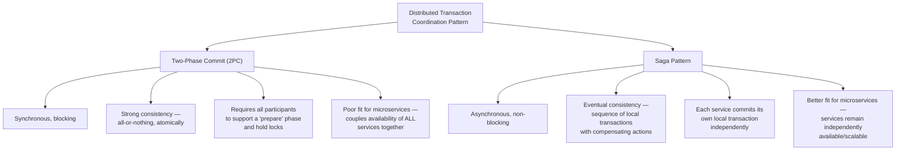
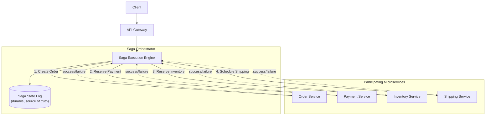
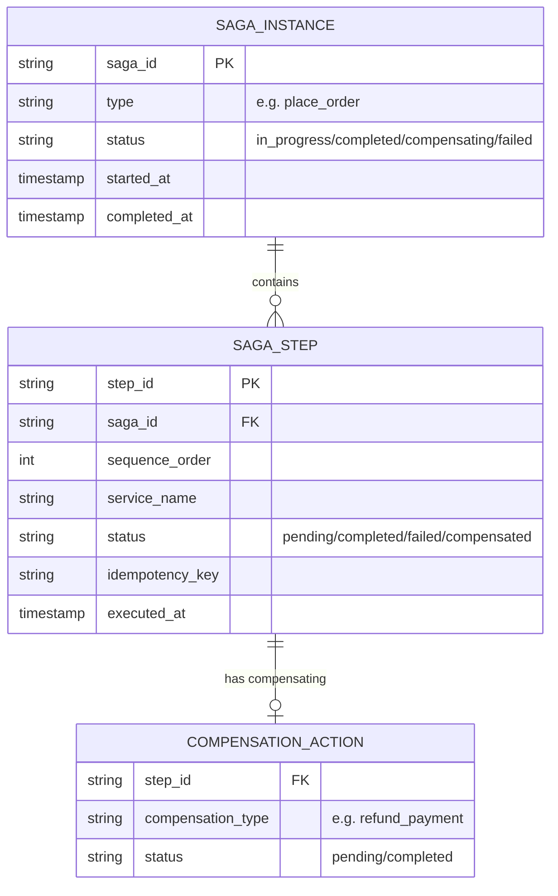
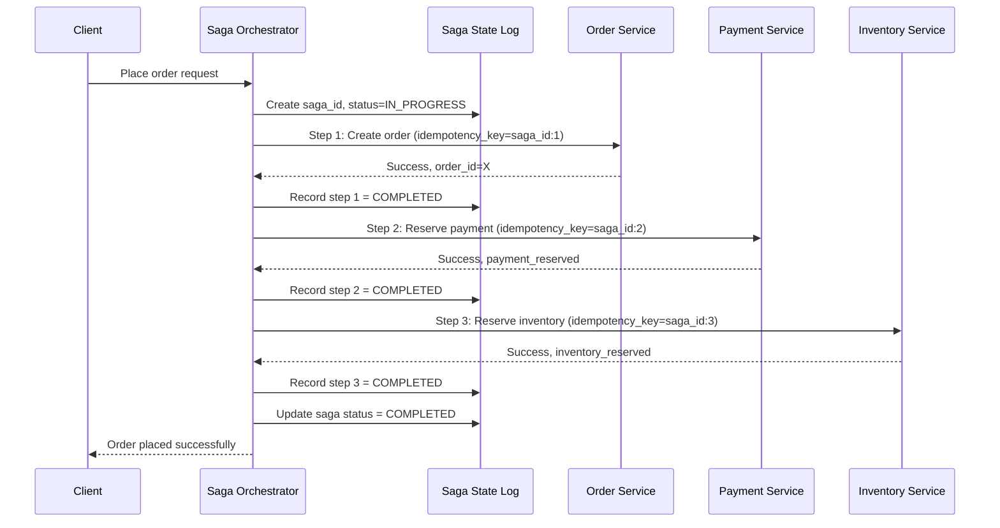
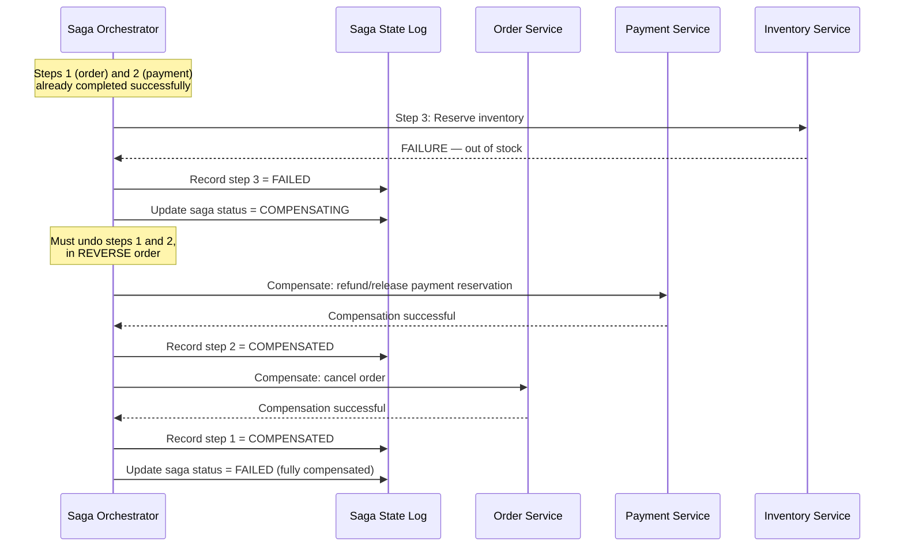
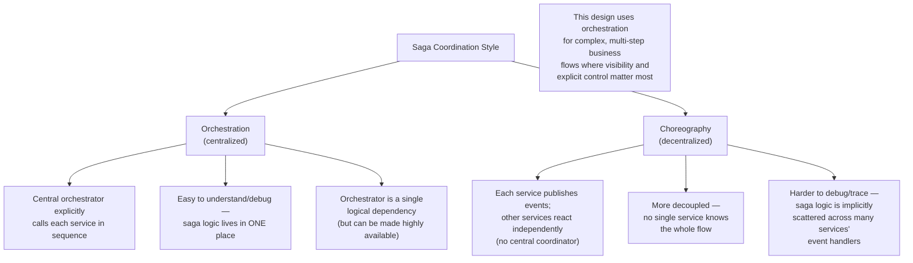
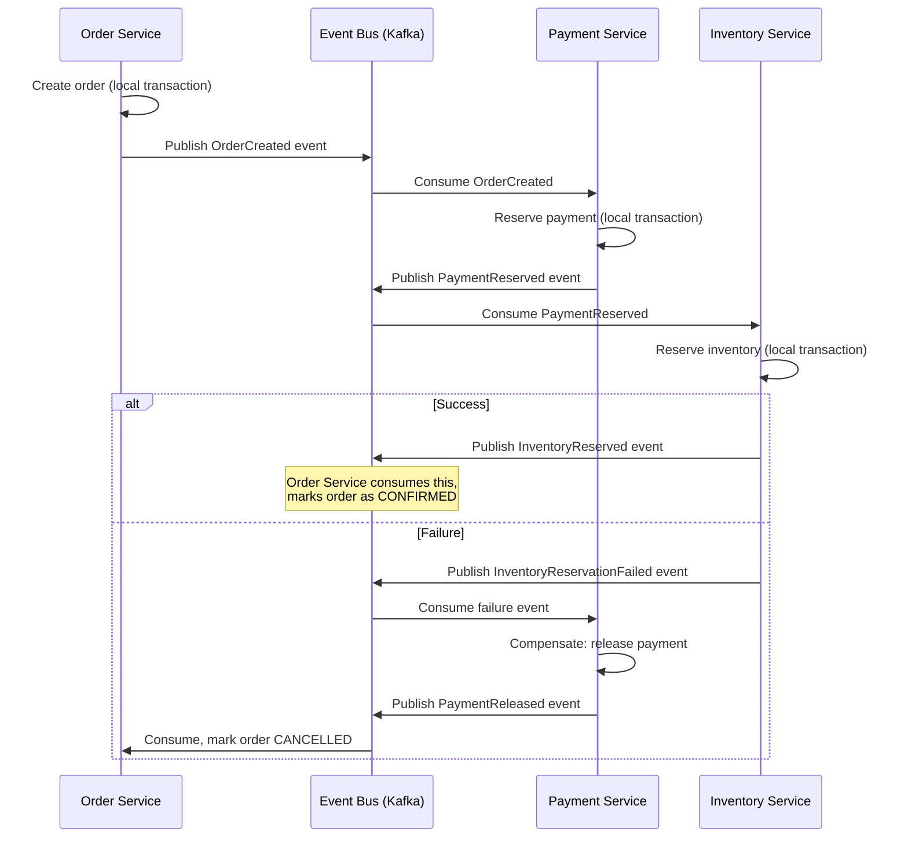
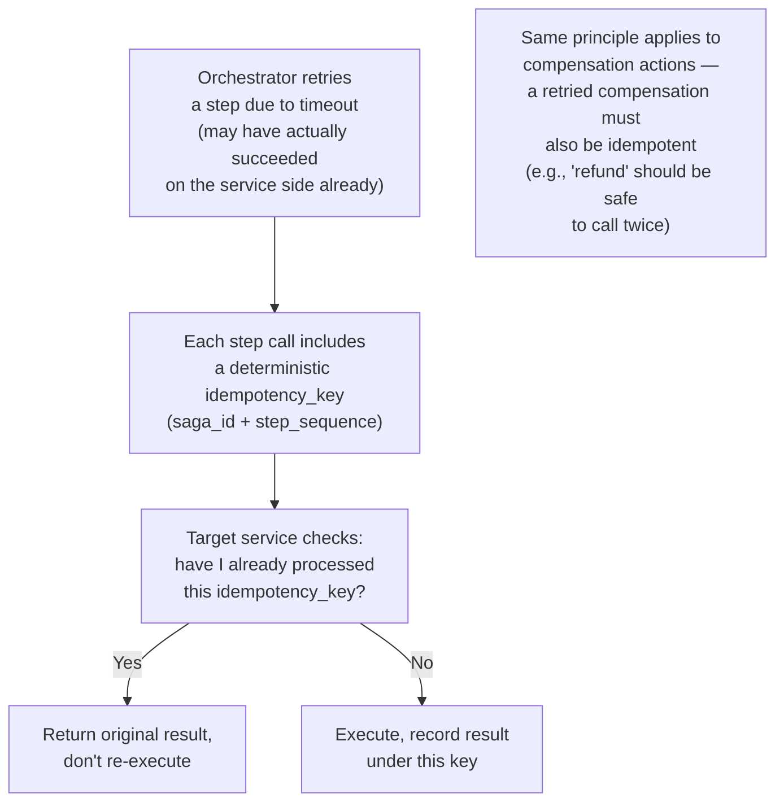
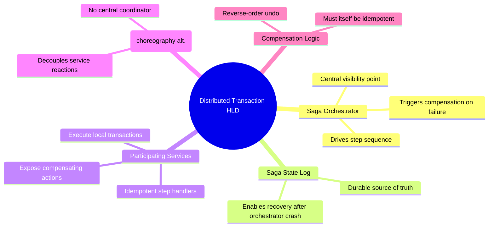

# Design a Distributed Transaction System Across Microservices — High-Level Design Document

## 1. Requirements

### Functional Requirements
- A single business operation (e.g., "place order") must atomically succeed or fail across multiple independently-owned microservices (Order, Payment, Inventory, Shipping)
- If any step fails partway through, previously completed steps must be undone (compensated)
- Support both synchronous (blocking, immediate consistency) and asynchronous (eventual consistency) coordination patterns
- Provide visibility into transaction/saga state for debugging and monitoring

### Non-Functional Requirements
- **No partial completion left silently unresolved:** every started transaction must reach a definitively known final state (all committed or all compensated)
- **Availability:** shouldn't require all services to be simultaneously available and fast — must tolerate individual service slowness/failure gracefully
- **Scalability:** must not become a bottleneck as transaction volume grows
- **Idempotency:** each step (and each compensation) may be retried and must not cause duplicate side effects

### Back-of-Envelope Estimation
| Metric | Value |
|---|---|
| Transactions/sec | ~10,000 |
| Avg services involved per transaction | 3-5 |
| Avg transaction completion time | Seconds (async saga) vs sub-second (sync 2PC, when it works) |
| Compensation rate | Small % of transactions require rollback (failures, inventory conflicts, etc.) |

---

## 2. Two Fundamental Approaches

*This design primarily uses the **Saga pattern** for microservices — 2PC's requirement that all participants block and hold locks until every service responds fundamentally conflicts with microservice architecture's goal of independent service availability. A single slow/down service in 2PC blocks the entire transaction and holds locks across all others.*

---

## 3. High-Level Architecture (Orchestration-Based Saga)

**Key idea:** A central **Saga Orchestrator** explicitly drives the sequence of steps, tracking state in a durable log. Each participating service performs its own local transaction and reports success/failure back — the orchestrator decides what happens next, including triggering compensating actions if something fails partway through. This is in contrast to a "choreography" approach where services react to each other's events without central coordination.

---

## 4. Data Model

---

## 5. Successful Saga Flow — Detailed Sequence

---

## 6. Failed Saga Flow — Compensation (Rollback) Sequence

**Why compensation happens in reverse order:** Steps often have dependencies — inventory reservation might depend on payment being reserved first. Undoing in reverse order (most recent first) respects those same dependencies in the opposite direction, minimizing the chance of a compensating action itself failing due to an inconsistent intermediate state.

---

## 7. Orchestration vs Choreography

---

## 8. Choreography-Based Saga (Alternative Pattern)

*In choreography, there's no central coordinator — each service knows only "what event do I react to, and what event do I emit next/on failure." This scales well and avoids a central dependency, but the overall business flow logic becomes implicit, spread across many services' event handlers, making it harder to answer "what's the current state of this order" without piecing together events from multiple services.*

---

## 9. Ensuring Idempotency of Each Saga Step

---

## 10. Component Responsibilities Summary

---

## 11. Key Design Decisions & Tradeoffs

| Decision | Choice | Why |
|---|---|---|
| Coordination pattern | Saga (not 2PC) | 2PC's blocking, lock-holding nature conflicts with microservices' independent-availability goals; saga trades strong consistency for availability and resilience |
| Saga style | Orchestration (primary) | Centralizes complex business flow logic for visibility/debuggability, at the cost of a coordinator dependency (made HA) |
| Consistency model | Eventual (via compensation) | The system passes through intermediate, partially-completed states visible to other parts of the system — this must be an accepted design tradeoff, not hidden |
| Failure recovery | Reverse-order compensation | Respects the same dependency ordering as forward execution, in reverse |
| Idempotency | Deterministic keys per step + compensation | Ensures safe retries at every stage of both the happy path and the rollback path |
| Orchestrator durability | Persistent saga state log | Allows the orchestrator to recover and resume in-flight sagas after a crash, rather than losing transaction state |

---

## 12. Bottlenecks & Scaling Considerations

- **Compensating actions aren't always perfectly reversible** — e.g., "send a confirmation email" can't be un-sent; sagas must be designed around genuinely compensatable actions, or accept that some side effects (like notifications) are best deferred until the saga is guaranteed to succeed.
- **Orchestrator as a critical dependency** — while it doesn't block services synchronously like 2PC, an unavailable orchestrator halts new saga progress; must be deployed with high availability (multiple instances, durable state log as source of truth for recovery).
- **Long-running sagas and stuck states** — a saga waiting on a slow downstream service can remain "in progress" for extended periods; needs timeout policies and alerting for sagas exceeding expected duration, to avoid silent stuck transactions.
- **Semantic/business-level failures vs technical failures** — "inventory reservation failed because out of stock" is a valid business outcome requiring compensation, distinct from "inventory service timed out" which might warrant a retry instead — the orchestrator's failure-handling logic must distinguish these cases.
- **Dual-write problem** — services must atomically both perform their local business transaction AND publish the resulting event/report status back to the orchestrator; naive separate writes can fail independently, requiring patterns like the transactional outbox to guarantee both happen together.
- **Testing complexity** — with many possible failure points (any step can fail, any compensation can fail), thorough testing requires deliberately simulating failures at every stage — sagas have combinatorially more failure paths to validate than a single-service transaction.
- **Cross-saga resource contention** — many concurrent sagas competing for the same limited resource (e.g., same inventory item) can cause a cascade of reservations-then-compensations under high contention; may need additional coordination (e.g., the inventory reservation system itself, as covered in the e-commerce checkout design) to reduce this churn.
