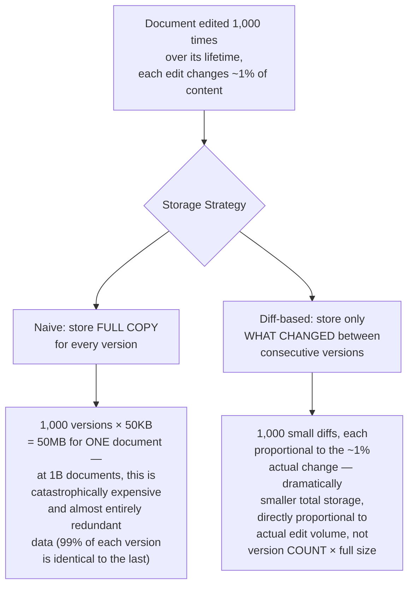
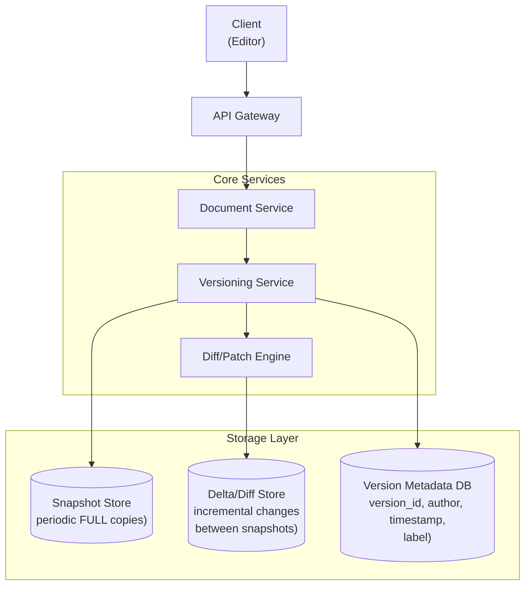
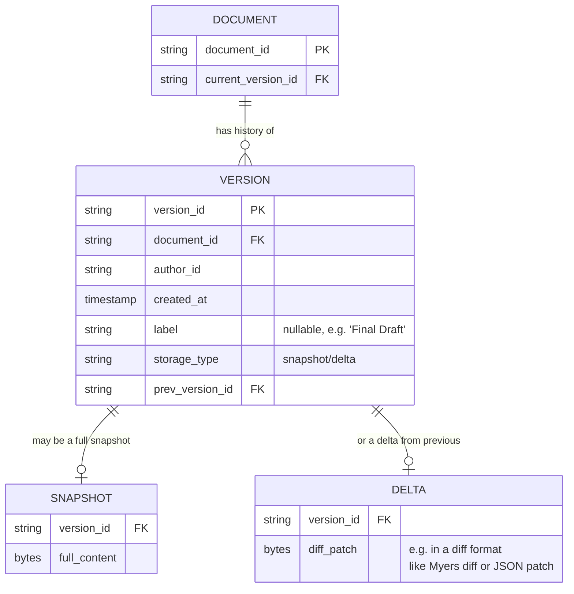
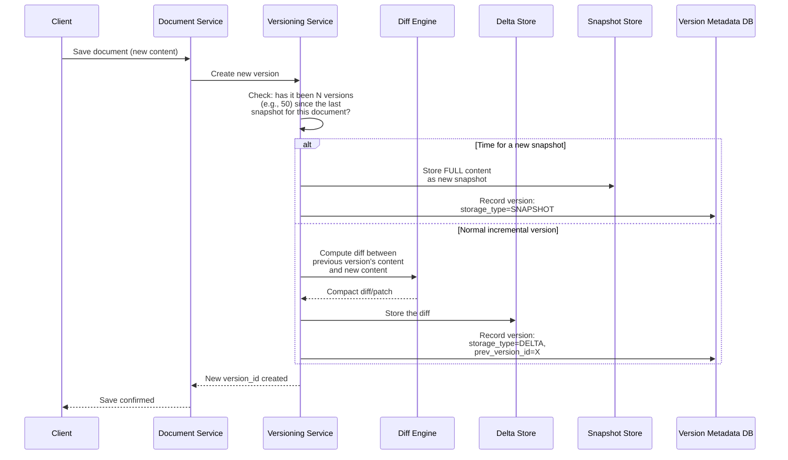
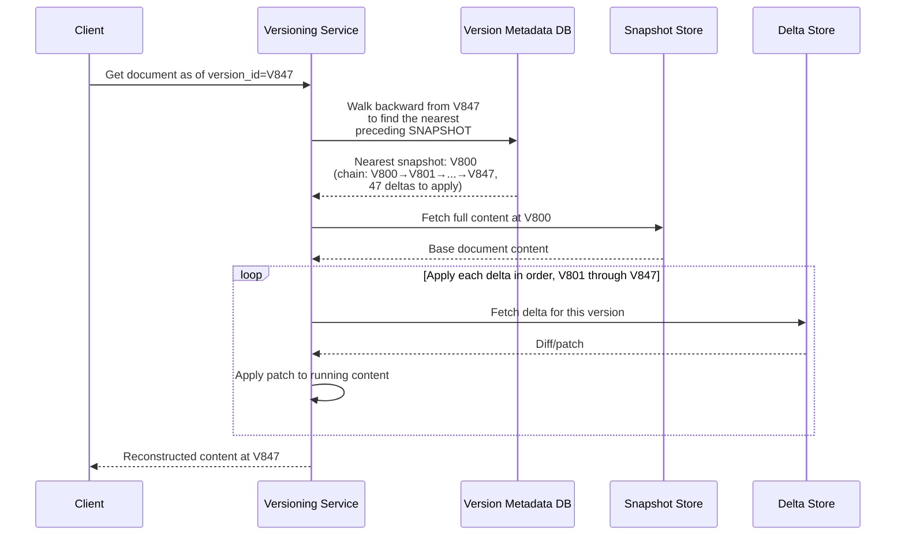
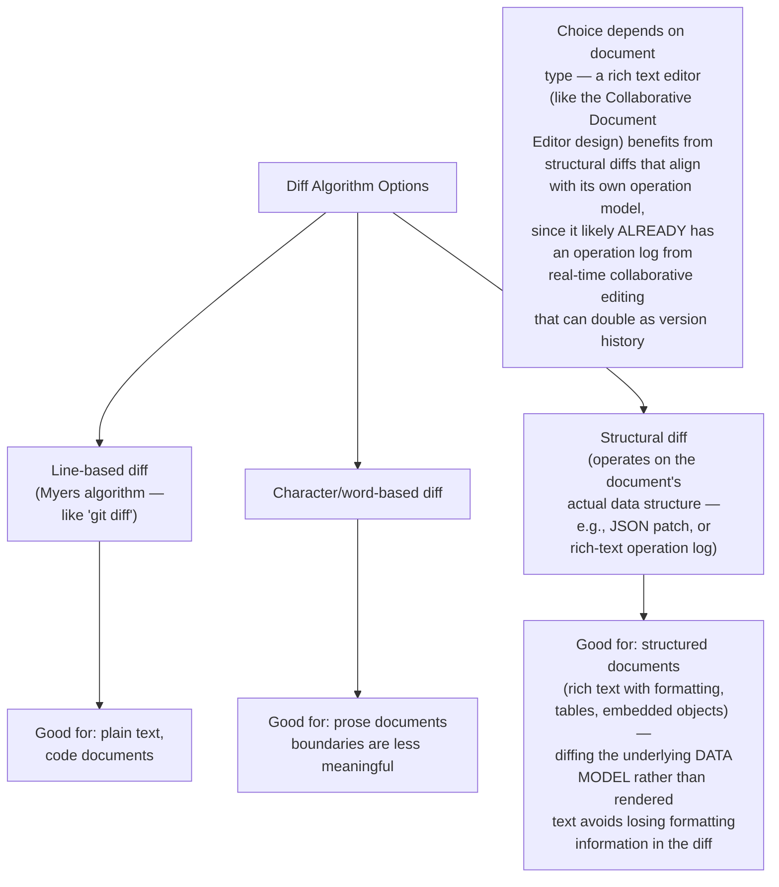
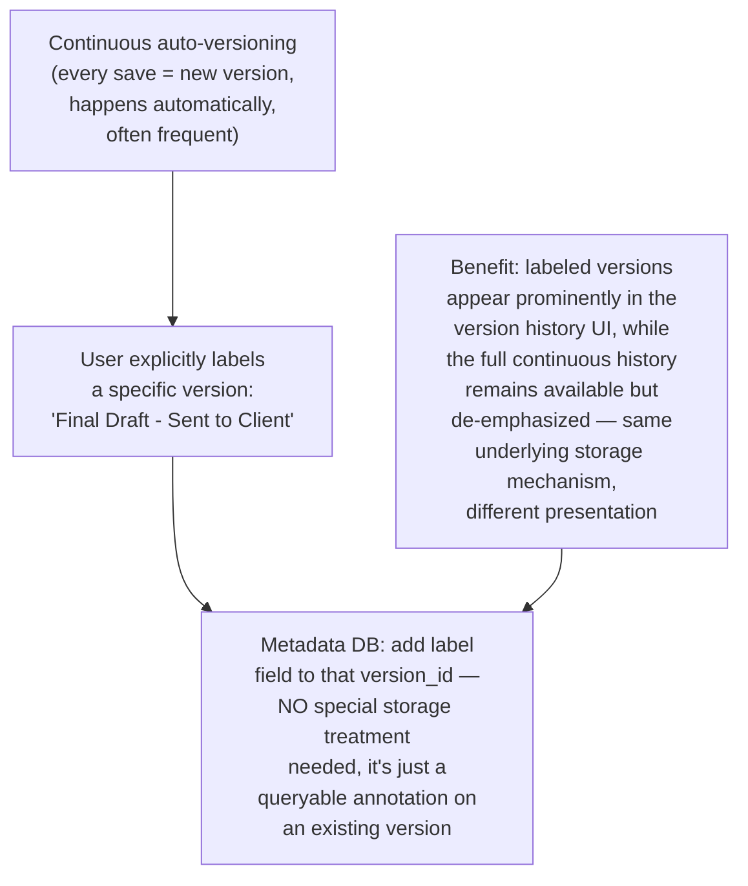
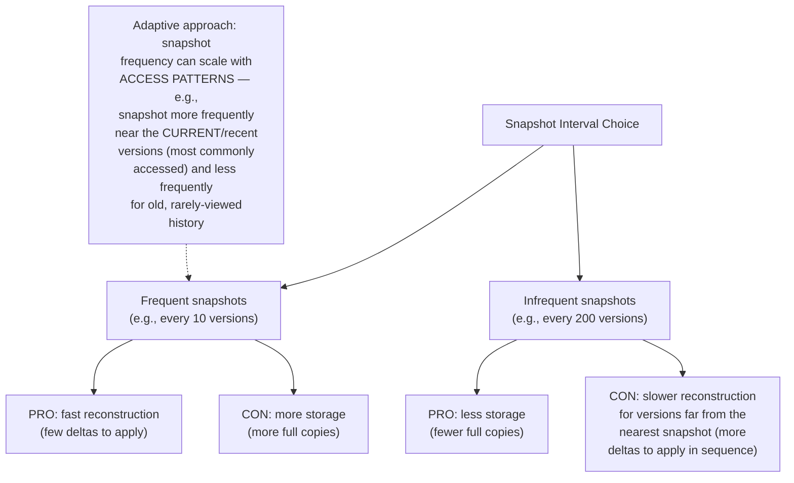
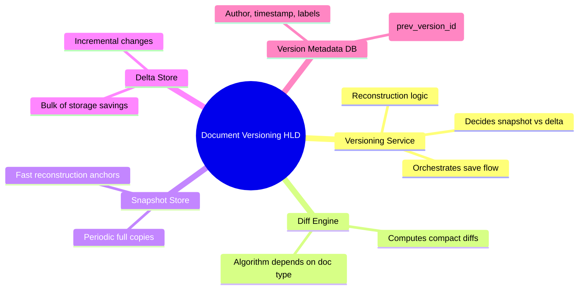

# Design a Document Versioning & History System — High-Level Design Document

## 1. Requirements

### Functional Requirements
- Store the complete edit history of a document, supporting "restore to any prior version"
- Show a human-readable diff between any two versions
- Support efficient storage — don't naively store a full copy of the document for every single edit
- Support named/labeled snapshots (e.g., "final draft," explicit save points) alongside continuous auto-versioning
- Attribute each change to a specific user and timestamp

### Non-Functional Requirements
- **Storage efficiency:** A document edited thousands of times over its life shouldn't require thousands of full copies
- **Retrieval speed:** Reconstructing any historical version should be fast, not requiring an expensive replay of the entire edit history from the beginning
- **Durability:** Version history is often legally/organizationally important — must never be silently lost
- **Scale:** Millions of documents, each with potentially thousands of versions

### Back-of-Envelope Estimation
| Metric | Value |
|---|---|
| Documents | ~1B |
| Avg versions per document (over lifetime) | ~500-2,000 (frequent auto-save) |
| Avg document size | ~50KB |
| Naive storage (full copy per version) | Would be ~50-100TB just for one popular document set — clearly infeasible |
| Diff-based storage (actual) | Orders of magnitude smaller, proportional to actual changes |

---

## 2. The Core Problem — Why Storing Full Copies Doesn't Scale

---

## 3. High-Level Architecture

**Key idea:** This design uses a **hybrid snapshot + delta chain** approach — periodic full snapshots (e.g., every 50th version) act as fast "anchor points," with delta/diff records capturing the incremental changes between them. Reconstructing any version means starting from the nearest preceding snapshot and applying a bounded, small number of deltas — never replaying the entire edit history from the document's creation.

---

## 4. Data Model

---

## 5. Writing a New Version — Detailed Sequence

---

## 6. Reconstructing a Historical Version — Detailed Sequence

**Why the snapshot interval bounds reconstruction cost:** With snapshots every 50 versions, reconstructing ANY version requires at most 50 delta applications — regardless of whether the document has 100 or 100,000 total versions in its history. This is precisely the same "bound recovery cost via periodic checkpoints" principle used in the WAL & Recovery System design, applied here to document version reconstruction instead of database crash recovery.

---

## 7. Diff Algorithm Choice

**Connection to the Collaborative Document Editor design:** If the same product already implements real-time collaborative editing (via Operational Transformation, as in that earlier design), the operation log used for real-time sync is often the SAME underlying data that powers version history — each "version" boundary is simply a labeled point in that same operation stream, avoiding the need for an entirely separate diffing mechanism.

---

## 8. Named/Labeled Versions (Explicit Save Points)

---

## 9. Snapshot Interval Tuning (Storage vs Reconstruction Speed Tradeoff)

---

## 10. Component Responsibilities Summary

---

## 11. Key Design Decisions & Tradeoffs

| Decision | Choice | Why |
|---|---|---|
| Storage strategy | Hybrid snapshot + delta chain | Bounds reconstruction cost (limited deltas to replay) while avoiding the storage explosion of full copies per version |
| Snapshot interval | Periodic (e.g., every 50 versions), possibly adaptive | Balances storage efficiency against reconstruction speed; tunable per access pattern |
| Diff algorithm | Depends on document type (line/character/structural) | Structural diffs preserve rich formatting information that plain text diffs would lose |
| Labeled versions | Metadata annotation, not separate storage | Reuses the same underlying version chain; labels are just a queryable attribute |
| Integration with real-time editing | Shared operation log where applicable | Avoids maintaining two separate change-tracking systems when one (the collaborative editor's op log) can serve both purposes |

---

## 12. Bottlenecks & Scaling Considerations

- **Reconstruction cost for pathologically long delta chains** — if snapshot creation logic has a bug (or is disabled for some documents), a delta chain could grow unbounded, making old-version reconstruction increasingly slow; needs monitoring and enforcement of the snapshot interval invariant.
- **Diff computation cost for very large documents** — computing a diff for a massive document (e.g., a huge spreadsheet or codebase file) on every save can itself become a performance bottleneck; may need to bound diff computation time or fall back to snapshot-only storage for exceptionally large documents.
- **Storage growth for extremely long-lived, frequently-edited documents** — even with efficient delta storage, documents edited continuously over years accumulate substantial history; may need a retention/pruning policy for very old, non-labeled versions (e.g., "keep every version from the last 30 days, but only daily snapshots beyond that") — similar to the tiered retention pattern in the Time-Series Database and Log Aggregation designs.
- **Concurrent version creation** — if collaborative editing allows near-simultaneous saves, the versioning service needs clear ordering logic (which is often already solved by the collaborative editor's own operation sequencing, if integrated as described in Section 7).
- **Cross-version diff/comparison UI performance** — showing a diff between two ARBITRARY historical versions (not just consecutive ones) requires reconstructing both full versions first, then diffing them — this is a more expensive operation than simple sequential reconstruction and may benefit from caching frequently-compared version pairs.
- **Storage backend choice for deltas** — delta records are typically small and numerous; a storage engine optimized for many small sequential writes (similar operational profile to a WAL) is often a better fit than a general-purpose document store for this specific access pattern.
