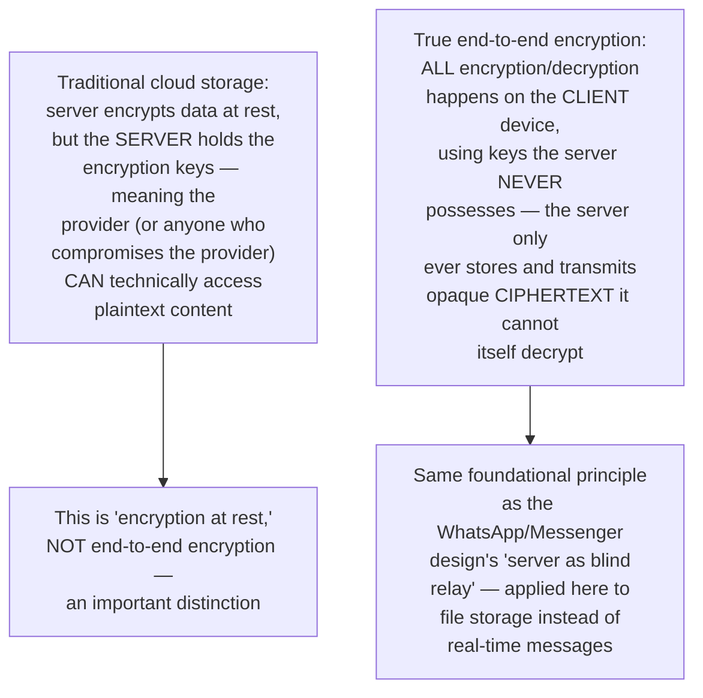
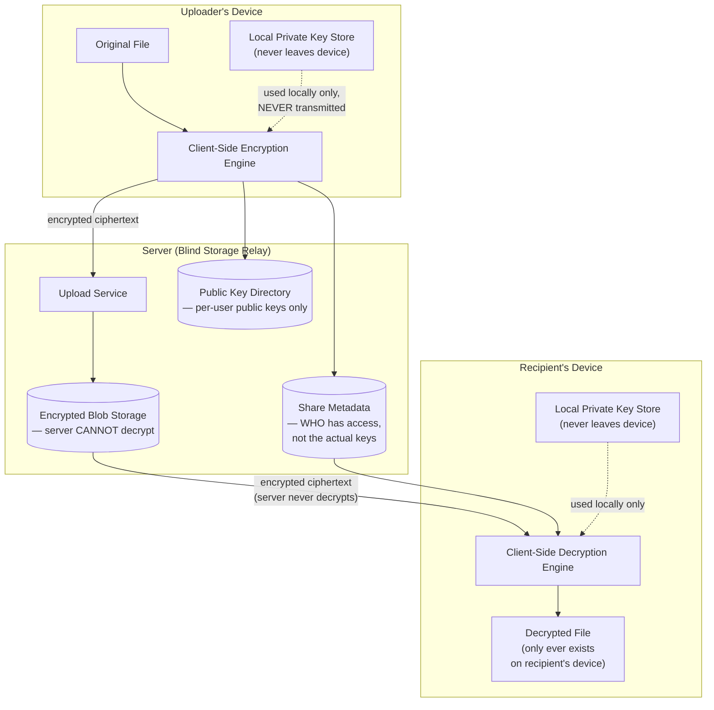
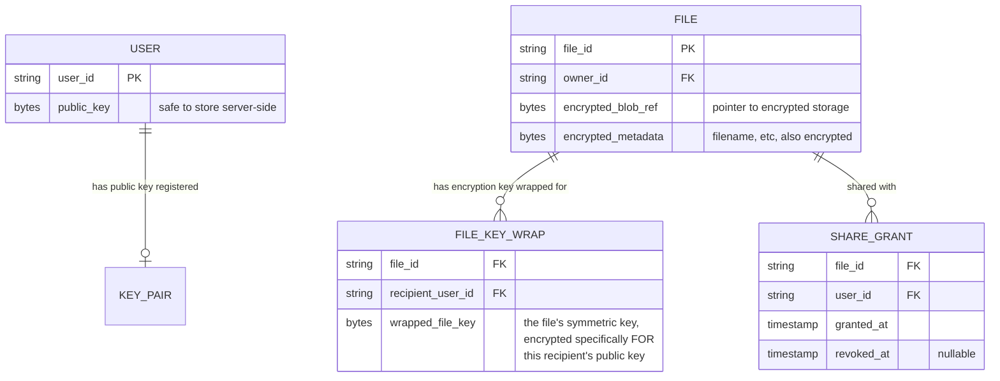
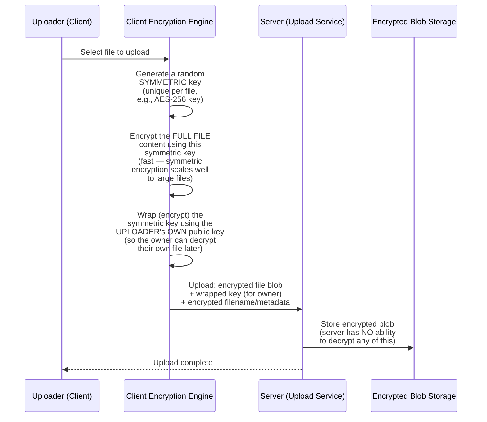
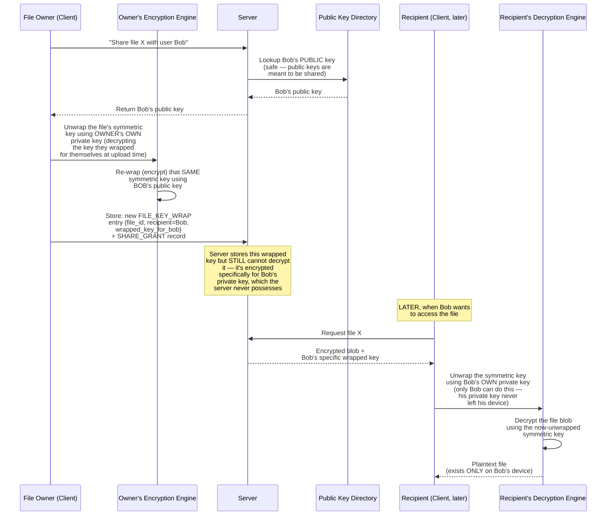
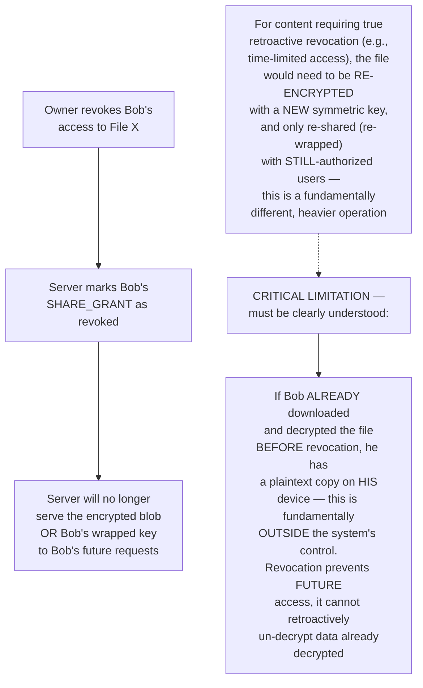
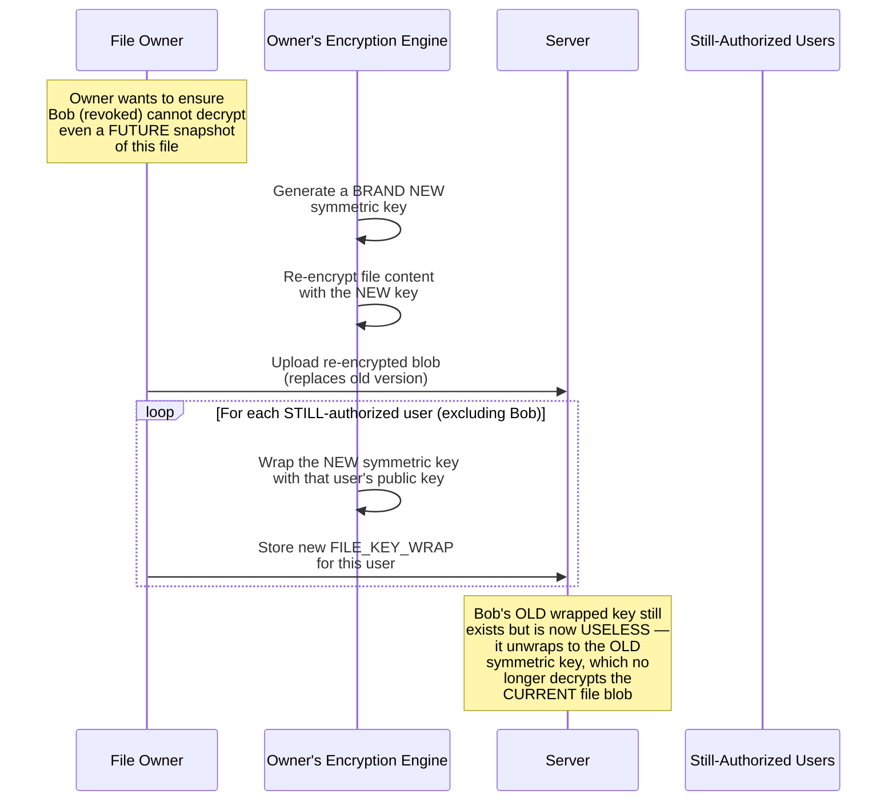
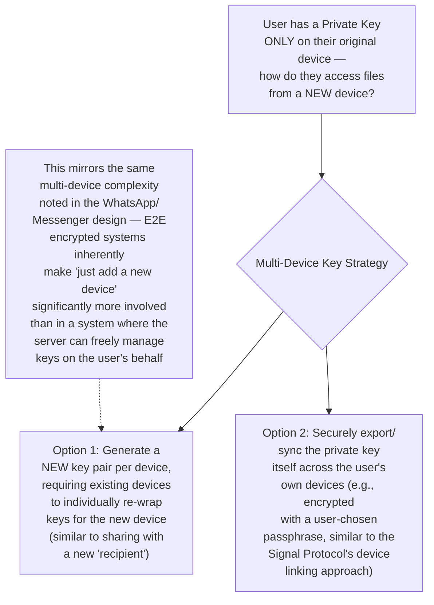
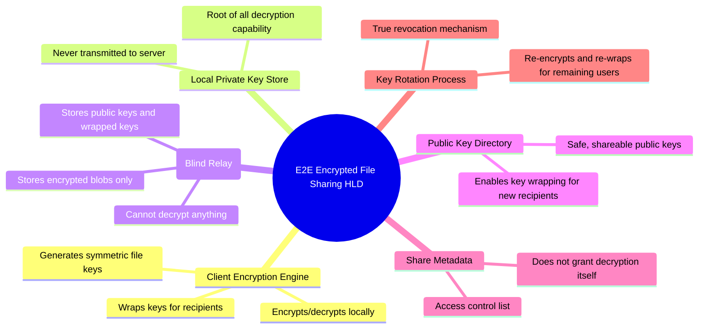

# Design an End-to-End Encrypted File Sharing System — High-Level Design Document

## 1. Requirements

### Functional Requirements
- Users can upload files that are encrypted such that even the storage provider cannot read the content
- Users can share encrypted files with specific other users, granting them (and only them) decryption capability
- Support revoking a previously-shared user's access
- Support large file uploads/downloads efficiently despite the encryption overhead

### Non-Functional Requirements
- **True end-to-end encryption:** The server must NEVER have access to plaintext file content or the keys needed to decrypt it — this is the core, non-negotiable security property
- **Usability despite complexity:** Key management is inherently complex; the system must make this invisible/manageable for ordinary users, not just cryptography experts
- **Performance:** Encryption/decryption overhead should be imperceptible for typical file sizes
- **Revocation effectiveness:** Once access is revoked, the revoked user should not be able to decrypt NEWLY shared updates (though already-downloaded plaintext copies are inherently outside the system's control)

### Back-of-Envelope Estimation
| Metric | Value |
|---|---|
| Files stored | Billions |
| Avg file size | Highly variable, KB to GB |
| Sharing operations/sec | Thousands |
| Key operations (encrypt/decrypt) | Client-side, scales with user activity not server load |

---

## 2. The Core Principle — The Server Is a Blind Storage Relay

---

## 3. High-Level Architecture

**Key idea:** Note precisely what the server DOES and DOESN'T store: encrypted file blobs (opaque to the server), public keys (safe to share by definition), and share metadata (WHO should have access — a list of user IDs, not decryption capability itself). The actual private keys capable of decryption never leave the client devices that generated them.

---

## 4. Data Model

**Key modeling concept — "key wrapping":** Rather than encrypting the entire (potentially huge) file separately for every recipient, the file is encrypted ONCE with a randomly generated symmetric key (fast, efficient for large data). That symmetric key is then itself encrypted ("wrapped") individually for each authorized recipient using their public key — a small, cheap operation repeated per-recipient, while the expensive full-file encryption happens only once.

---

## 5. File Upload & Initial Encryption Flow — Detailed Sequence

---

## 6. Sharing With Another User — Detailed Sequence

**Why re-wrapping (not re-encrypting the whole file) makes sharing efficient:** The expensive operation — encrypting the entire file — happened exactly once, at upload time. Sharing with a new recipient only requires the cheap operation of encrypting the small symmetric key for that recipient's public key — this is what makes end-to-end encrypted sharing practical even for very large files shared with many people, since the per-recipient cost stays small and constant regardless of file size.

---

## 7. Revoking Access

**Why this limitation is worth stating explicitly in any real design discussion:** A common misconception is that "revoke access" in an E2E encrypted system works like revoking a database permission — instantly and completely. In reality, once plaintext has been decrypted on a device, no cryptographic mechanism can reach into that device and destroy it. Being explicit about this boundary is a sign of genuine security understanding, not a design flaw to hide.

---

## 8. Key Rotation for True Revocation (When Needed)

---

## 9. Multi-Device Support (Same User, Multiple Devices)

---

## 10. Component Responsibilities Summary

---

## 11. Key Design Decisions & Tradeoffs

| Decision | Choice | Why |
|---|---|---|
| Encryption architecture | Client-side only, server as blind relay | The defining, non-negotiable property of true end-to-end encryption — server compromise cannot expose plaintext |
| File encryption approach | Hybrid: symmetric key for file content, asymmetric wrapping per recipient | Symmetric encryption scales efficiently to large files; per-recipient asymmetric wrapping is cheap and avoids re-encrypting the whole file for each share |
| Sharing mechanism | Re-wrap the existing symmetric key for new recipients | Avoids the expensive full-file re-encryption cost when adding a new authorized viewer |
| Standard revocation | Access-list based (prevents future server-mediated access) | Simple and sufficient for most use cases, with the explicit, honestly-communicated limitation that already-decrypted plaintext is outside the system's control |
| True/retroactive revocation | Key rotation + full re-encryption when required | The only cryptographically meaningful way to ensure a revoked user cannot decrypt content going forward, at the cost of a heavier re-encryption operation |
| Multi-device support | Explicit key-sharing/linking process between devices | Inherent complexity tradeoff of true E2E encryption — the server cannot transparently manage keys across a user's devices the way it could in a non-E2E system |

---

## 12. Bottlenecks & Scaling Considerations

- **Client-side computational cost** — encryption/decryption happens entirely on user devices, which is a deliberate security property but does mean very large files or low-powered devices (older phones) may experience meaningfully slower upload/download compared to a non-encrypted equivalent — this cost is fundamental to the security model, not an implementation inefficiency to be optimized away.
- **Sharing with many recipients** — while re-wrapping is cheap per recipient, sharing a file with thousands of people (e.g., a large team) still means thousands of individual wrap operations and stored FILE_KEY_WRAP records; this remains far more efficient than full re-encryption per recipient, but isn't entirely free at extreme scale.
- **Key loss = permanent data loss** — since the server never has access to plaintext or unwrapped keys, if a user loses their private key (device lost/reset without backup) with no other authorized party able to re-share, that file's content is genuinely, cryptographically unrecoverable — this is the direct, unavoidable cost of true end-to-end encryption and must be clearly communicated to users, often necessitating a carefully-designed (and separately security-reviewed) key backup/recovery mechanism.
- **Search and preview functionality limitations** — since the server cannot see file content, server-side features common in non-encrypted systems (full-text search across file contents, automatic thumbnail generation, virus scanning) become impossible or require entirely different approaches (e.g., client-side search index generation, encrypted separately) — this is a genuine, inherent product tradeoff of choosing true E2E encryption.
- **Metadata leakage** — even with content fully encrypted, some metadata (file sizes, sharing patterns, access timing, who-shares-with-whom social graph) may still be visible to the server unless specifically designed to also be protected/obscured — a thorough security design must explicitly decide what metadata protection guarantees are and aren't being made, rather than assuming "encrypted" means "fully private in every dimension."
- **Verifying public key authenticity (trust establishment)** — the entire security model depends on users genuinely having the CORRECT public key for their intended recipient, not an attacker-substituted one (a man-in-the-middle risk); production systems need mechanisms like key fingerprint verification or a trusted key transparency log to give users genuine assurance they're encrypting for the right person, not just trusting whatever public key the server happens to hand back.
