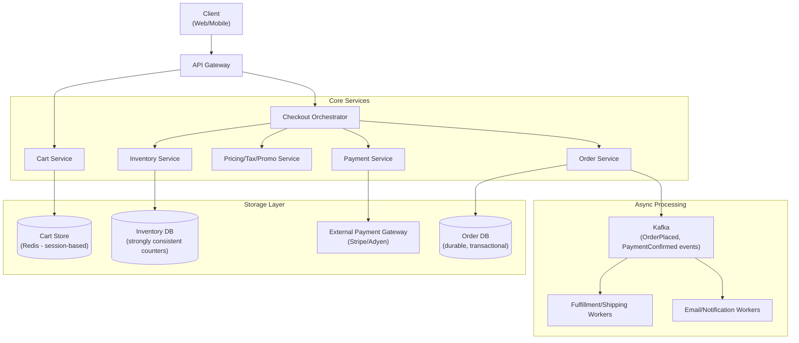
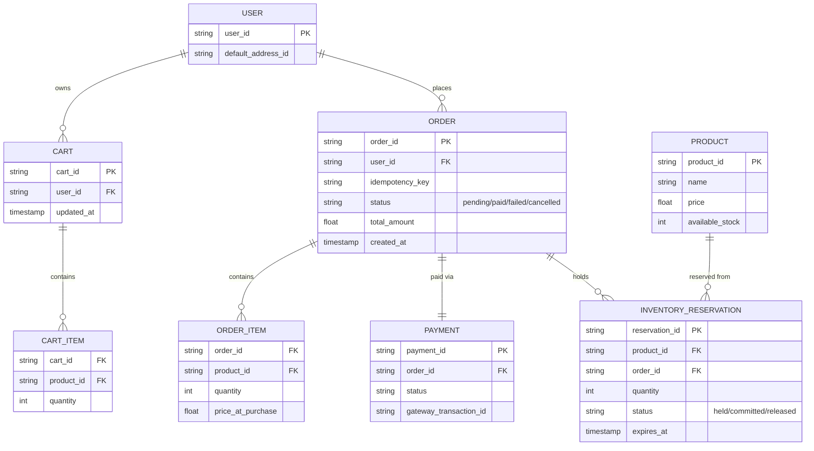
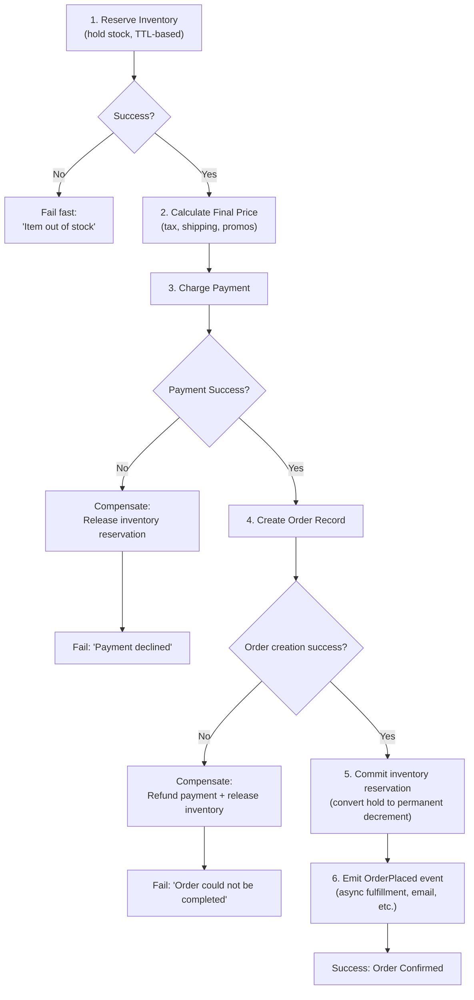
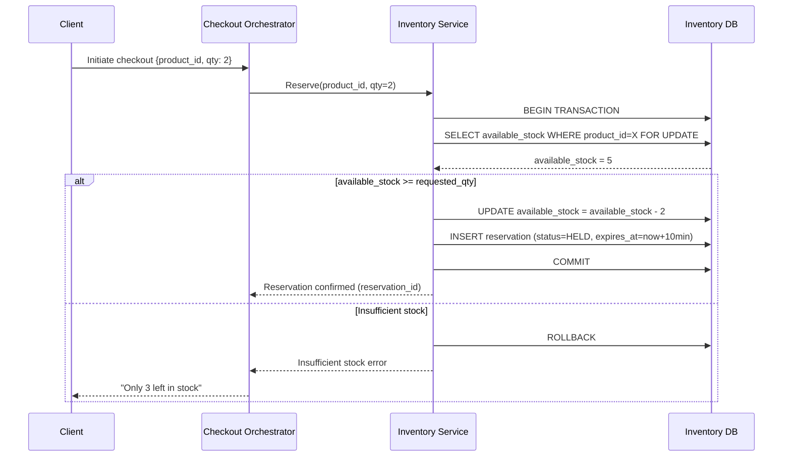
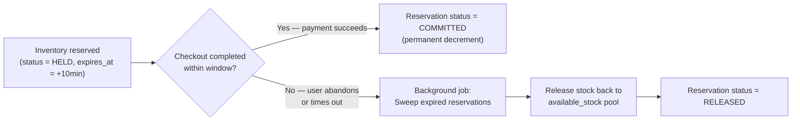
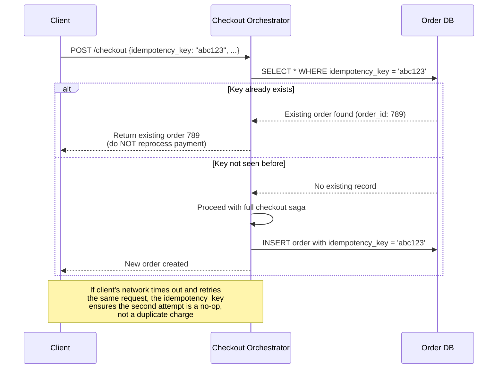
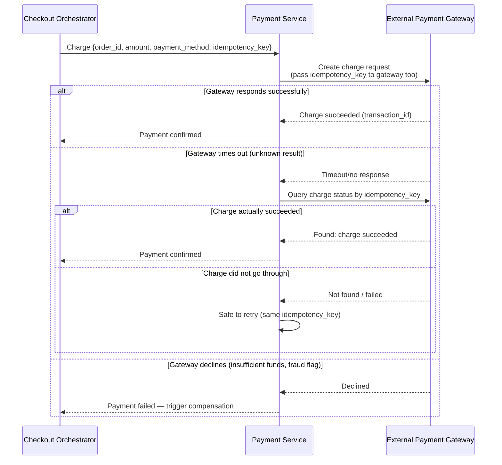
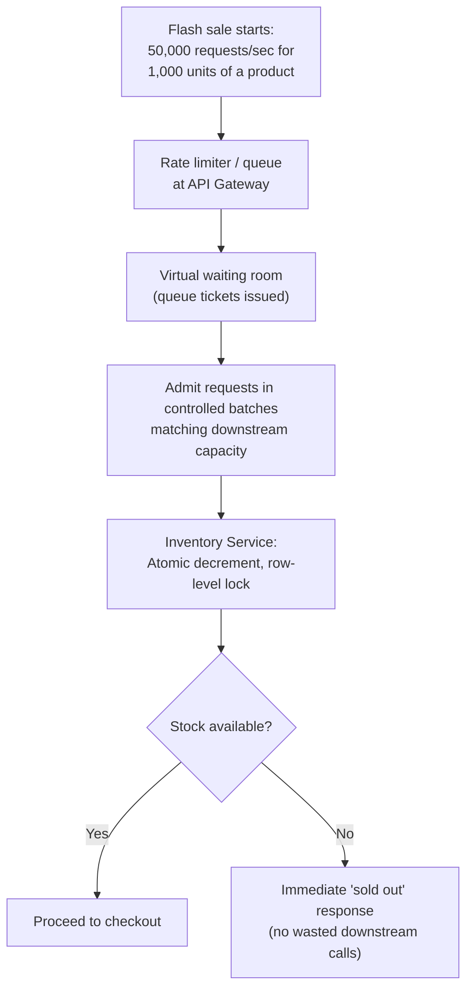
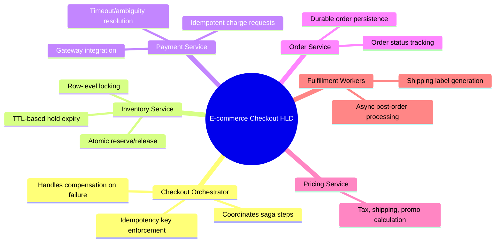

# Design an E-commerce Checkout System — High-Level Design Document

## 1. Requirements

### Functional Requirements
- Add items to cart, view cart, modify quantities
- Checkout flow: address, shipping, payment, order confirmation
- Inventory must be reserved during checkout (no overselling)
- Support multiple payment methods, retries on failure
- Order confirmation and receipt generation
- Handle abandoned carts / checkout timeouts gracefully

### Non-Functional Requirements
- **Correctness over speed:** Never oversell inventory, never double-charge
- **Idempotency:** Network retries must not create duplicate orders/charges
- **Scale:** Flash-sale traffic spikes (10-100x normal load in minutes)
- **Consistency:** Strong consistency required for inventory decrement; eventual consistency acceptable for order history display
- **Availability:** Checkout should degrade gracefully rather than hard-fail during spikes

### Back-of-Envelope Estimation
| Metric | Value |
|---|---|
| Checkouts/sec (normal) | ~1,000 |
| Checkouts/sec (flash sale peak) | ~50,000+ |
| Avg items per order | ~3 |
| Inventory check + reserve latency budget | < 100ms |
| Payment gateway round-trip | 500ms - 2s (external dependency) |

---

## 2. High-Level Architecture

**Key idea:** The Checkout Orchestrator coordinates a multi-step process (reserve inventory → calculate price → charge payment → create order) where each step can fail independently. This is a textbook **distributed transaction / saga** problem — money and inventory must never end up inconsistent even when a step fails partway through.

---

## 3. Data Model

---

## 4. Checkout Flow — The Saga Pattern

**Key idea:** Every step that changes state (inventory hold, payment charge) has a corresponding **compensating action** (release hold, refund) that runs if a later step fails. This is the Saga pattern — since checkout spans multiple services/systems, a classic all-or-nothing database transaction isn't possible, so correctness is achieved through explicit forward + compensating steps.

---

## 5. Inventory Reservation — Detailed Sequence (Preventing Overselling)

**Key design point:** The `SELECT ... FOR UPDATE` (row-level lock) combined with an atomic decrement is what prevents the classic race condition where two concurrent checkouts both read `stock=1` and both proceed to "successfully" reserve the last unit — a pure application-level check-then-act without locking is unsafe under concurrency.

---

## 6. Handling Reservation Expiry (Abandoned Checkout)

*A time-boxed hold (e.g., 10 minutes) balances two competing needs: giving a legitimate slow shopper enough time to complete checkout, while not letting abandoned carts lock up inventory indefinitely during high-demand events.*

---

## 7. Idempotent Order Creation (Preventing Duplicate Charges)

**Key idea:** Every checkout request carries a client-generated `idempotency_key` (typically a UUID generated once per checkout attempt). If the client retries after a timeout (not knowing if the first request succeeded), the server recognizes the duplicate key and returns the original result instead of processing payment twice.

---

## 8. Payment Charging Flow (with Retry Logic)

*Passing the same idempotency key to the external payment gateway itself (most major gateways like Stripe support this natively) is critical — it protects against the ambiguous "did my charge actually go through before the timeout?" scenario, which a client-side retry alone cannot resolve safely.*

---

## 9. Flash Sale / High-Contention Traffic Handling

*Rather than letting all 50,000 requests hammer the inventory service simultaneously (causing lock contention meltdown), a "virtual waiting room" admits requests at a rate the system can actually process — most e-commerce platforms use this pattern for major flash sales/drops.*

---

## 10. Component Responsibilities Summary

---

## 11. Key Design Decisions & Tradeoffs

| Decision | Choice | Why |
|---|---|---|
| Multi-step consistency | Saga pattern with compensating actions | No single database transaction can span cart, inventory, payment gateway, and order services |
| Inventory concurrency control | Row-level locking + atomic decrement | Prevents overselling under concurrent checkout attempts on the same product |
| Reservation model | Time-boxed hold (TTL) rather than instant permanent decrement | Balances giving shoppers time to complete checkout against not locking up stock indefinitely |
| Duplicate request handling | Client-generated idempotency key, checked server-side and at payment gateway | Network retries are inevitable; must not result in double charges or duplicate orders |
| Flash sale traffic | Virtual waiting room / admission control | Prevents lock contention meltdown from massively overwhelming a scarce-inventory resource |
| Post-order processing | Async via event bus (Kafka) | Shipping, email, analytics shouldn't block the user-facing checkout confirmation |

---

## 12. Bottlenecks & Scaling Considerations

- **Inventory row contention on hot products** — a single viral/flash-sale product creates a hot row that many concurrent transactions lock against; consider sharding stock counters (e.g., split 1000 units across 10 counter shards of 100 each) to reduce contention, reconciling at the end.
- **Payment gateway latency** — external dependency (500ms-2s) sits directly in the critical path; must have circuit breakers and clear timeout/retry semantics so a slow gateway doesn't cascade into checkout service exhaustion.
- **Idempotency key storage growth** — needs a bounded retention window (e.g., 24-48 hours) since keys are only useful for detecting near-term retries, not indefinite storage.
- **Reservation expiry sweep job** — must run frequently enough that abandoned holds don't starve legitimate demand during high-traffic events, but not so frequently that it adds unnecessary DB load.
- **Cart service scaling** — carts are read/written far more frequently than checkouts complete; typically backed by a fast KV store (Redis) rather than the transactional order database.
- **Cross-region checkout** — for global platforms, inventory for region-specific warehouses must be tracked separately; a checkout in the EU shouldn't decrement US warehouse stock.
- **Fraud detection latency** — real-time fraud scoring adds latency to the payment step; often run asynchronously post-charge with the ability to reverse/flag suspicious orders rather than blocking checkout entirely.
