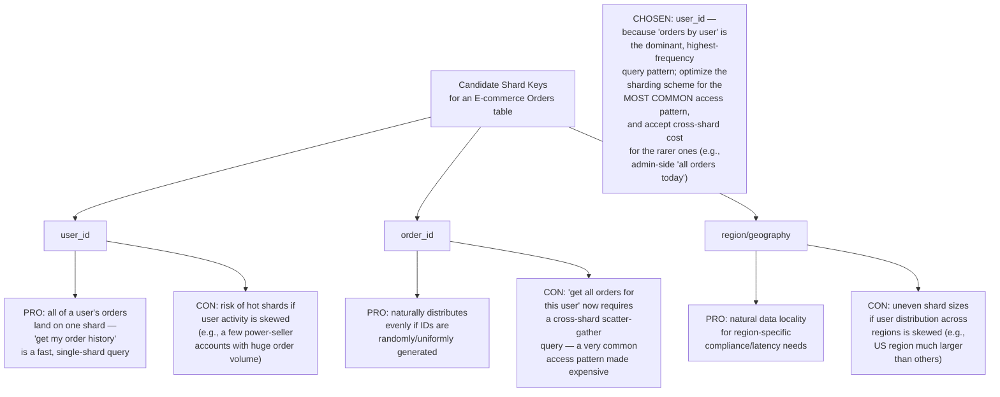
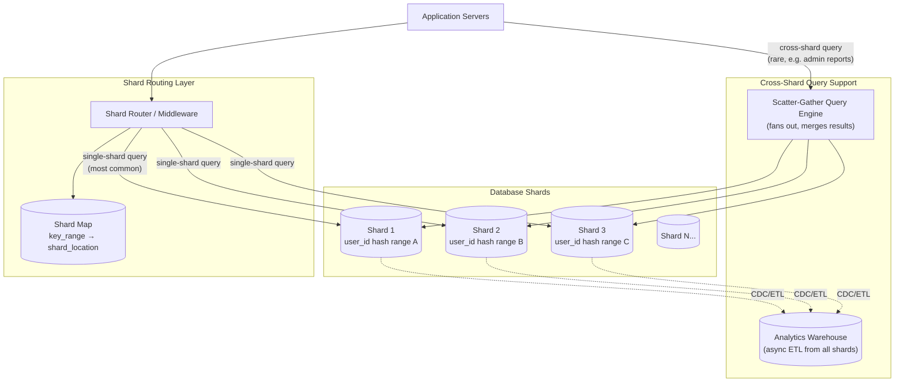
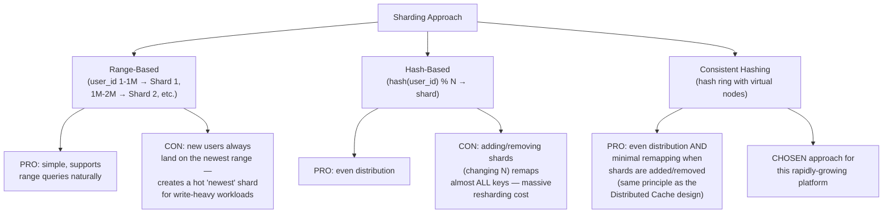
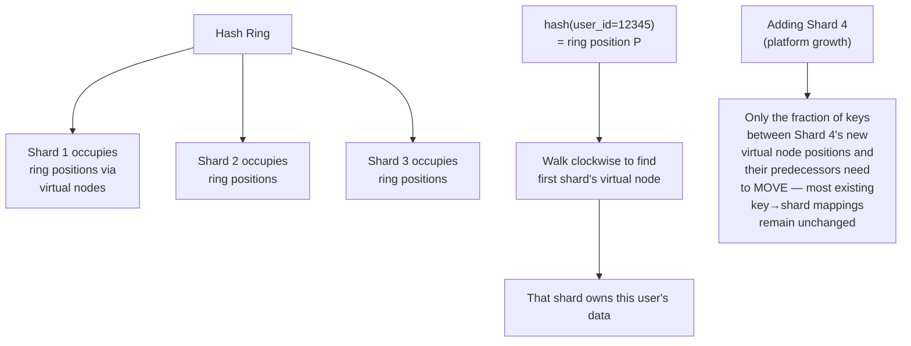
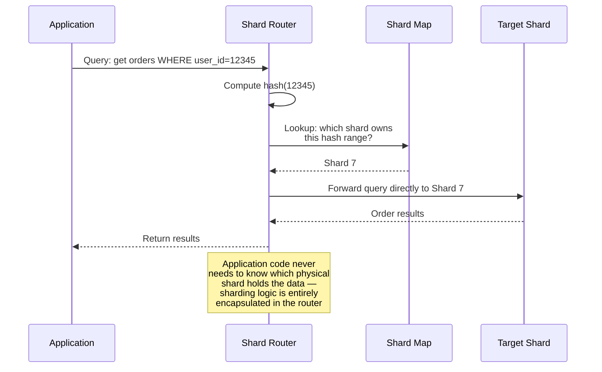
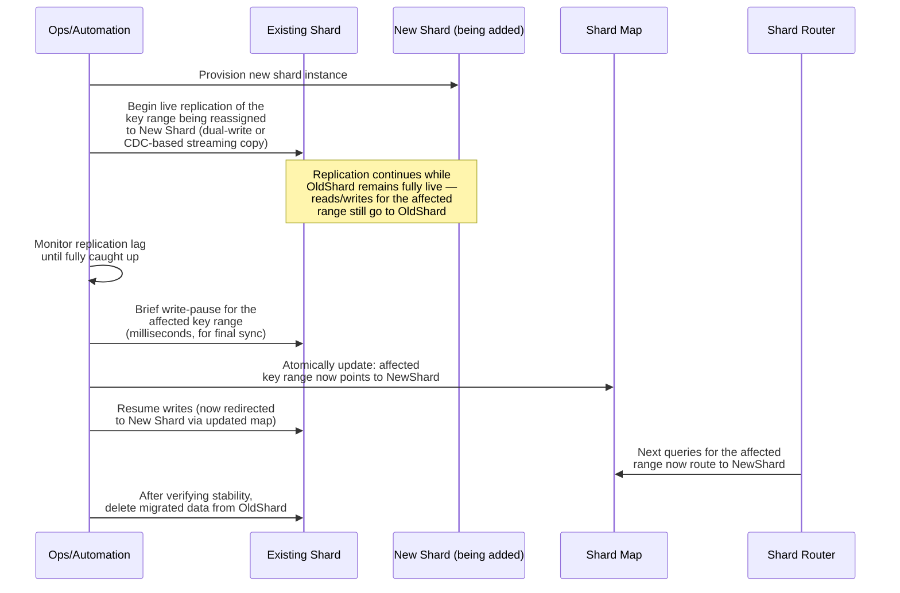
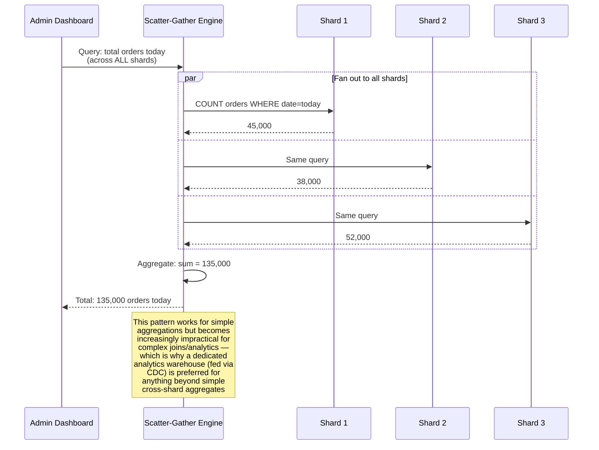
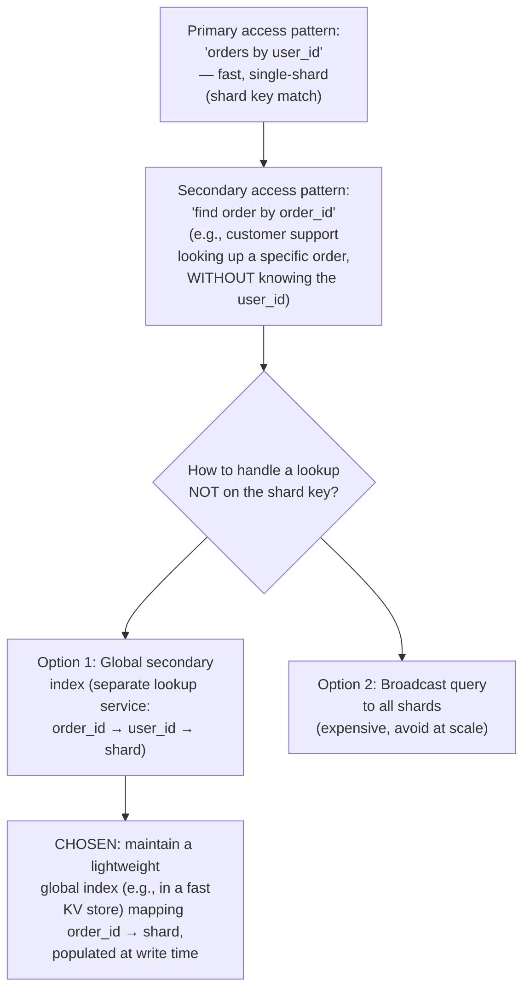
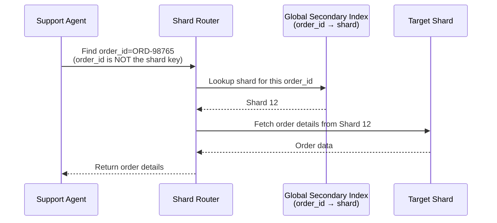
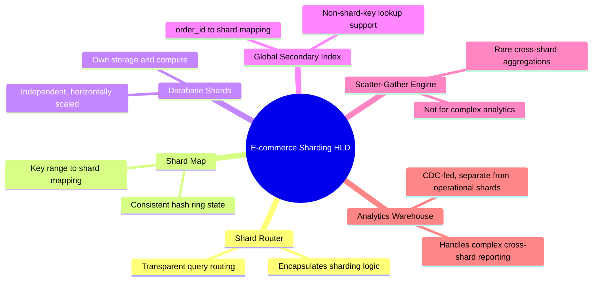

# Design a Database Sharding Strategy for a Rapidly Growing E-commerce Platform — High-Level Design Document

## 1. Requirements

### Functional Requirements
- Distribute a rapidly growing dataset (orders, products, users) across multiple database instances
- Support efficient point lookups (e.g., "get order by order_id") and common range/filter queries
- Support resharding (adding more shards) as data volume grows, WITHOUT downtime
- Handle cross-shard queries/joins where genuinely necessary (e.g., admin reporting)

### Non-Functional Requirements
- **Growth accommodation:** The platform is "rapidly growing" — the sharding scheme must not require a full redesign every time the dataset doubles
- **Availability during resharding:** Migration of data between shards must not take the platform offline
- **Balanced load:** Avoid hot shards — both storage and query load should distribute evenly
- **Minimal cross-shard operations:** Most queries should be satisfiable from a single shard, since cross-shard operations are inherently slower and more complex

### Back-of-Envelope Estimation
| Metric | Value |
|---|---|
| Orders/day (current) | ~1M, growing 3x year-over-year |
| Orders table size (2 years out) | Hundreds of millions of rows |
| Peak writes/sec | ~10,000 (flash sales) |
| Target shard count (initial) | 16-32 shards, designed to grow |

---

## 2. Choosing a Shard Key — The Most Important Decision

**Why shard key choice is the single most consequential decision:** Every subsequent design decision — how data distributes, which queries stay single-shard vs become cross-shard, how resharding works — flows directly from this choice. Getting it wrong is expensive to fix later, since it typically requires a full data migration to correct.

---

## 3. High-Level Architecture

**Key idea:** The Shard Router makes sharding transparent to most application code — a query for "orders by user X" gets automatically routed to the single correct shard. Genuinely cross-shard needs (platform-wide reporting) are deliberately routed to a **separate analytics path** (via CDC/ETL, covered in the CDC pipeline design) rather than forcing the live operational shards to support expensive scatter-gather queries as a first-class pattern.

---

## 4. Sharding Strategy: Consistent Hashing vs Range-Based

---

## 5. Consistent Hashing Applied to Database Sharding

---

## 6. Query Routing Flow — Detailed Sequence

---

## 7. Resharding Without Downtime — Detailed Sequence

**Why the brief write-pause matters:** Even with careful live replication, there's a small window where the "cutover" from old to new shard must happen atomically — pausing writes for milliseconds (not the whole migration duration) ensures no write is lost or applied to the wrong shard during the exact moment of cutover, while keeping actual downtime negligible.

---

## 8. Handling Cross-Shard Queries (When Truly Necessary)

---

## 9. Handling Secondary Access Patterns (Non-Shard-Key Lookups)

---

## 10. Component Responsibilities Summary

---

## 11. Key Design Decisions & Tradeoffs

| Decision | Choice | Why |
|---|---|---|
| Shard key | user_id | Optimizes for the dominant access pattern ("orders by user"), accepting cross-shard cost for rarer patterns |
| Distribution algorithm | Consistent hashing | Minimizes data movement when adding shards to accommodate growth — critical for a "rapidly growing" platform |
| Resharding approach | Live replication + brief atomic cutover | Achieves effectively zero-downtime migration, essential for a live e-commerce platform that can't tolerate extended outages |
| Non-shard-key lookups | Global secondary index | Avoids broadcasting every non-shard-key query to all shards, at the cost of maintaining an additional index structure |
| Cross-shard analytics | Separate CDC-fed warehouse, not live scatter-gather | Keeps operational shards fast and simple; complex analytics gets a purpose-built system instead of straining the transactional path |

---

## 12. Bottlenecks & Scaling Considerations

- **Shard key skew** — if certain users generate disproportionately more orders (e.g., B2B power sellers), their shard can become a hot spot despite otherwise-even hashing; may require special-casing exceptionally large accounts (similar to the multi-tenant silo-tier pattern) rather than forcing them into the standard shard.
- **Global secondary index becomes its own scaling concern** — as order volume grows, this index itself needs to scale (likely sharded independently by order_id), and its write path adds latency/complexity to every order creation.
- **Resharding operational complexity** — while the process is designed for zero downtime, it requires careful tooling, monitoring, and rollback capability; resharding should be a well-tested, semi-automated operational procedure, not an ad-hoc manual process, especially as it will need to happen repeatedly as the platform grows.
- **Foreign key/referential integrity across shards** — relationships that naturally span shard boundaries (e.g., an order referencing a product that might be sharded differently) lose database-enforced referential integrity; must be handled at the application level with appropriate validation.
- **Backup and disaster recovery per shard** — each shard needs independent backup scheduling and recovery testing; a full-platform recovery scenario requires coordinating consistent recovery points across all shards.
- **Connection pool management at scale** — application servers connecting to potentially dozens of shards need careful connection pool sizing per shard to avoid exhausting database connection limits as both shard count and application server count grow independently.
- **Monitoring per-shard health and load distribution** — proactive dashboards tracking per-shard storage growth, query latency, and load are essential for anticipating when the next resharding cycle is needed, rather than reactively scrambling once a shard is already overloaded.
