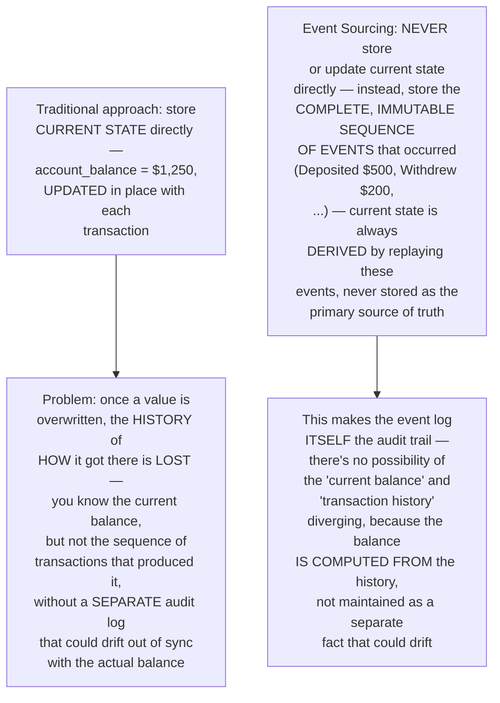
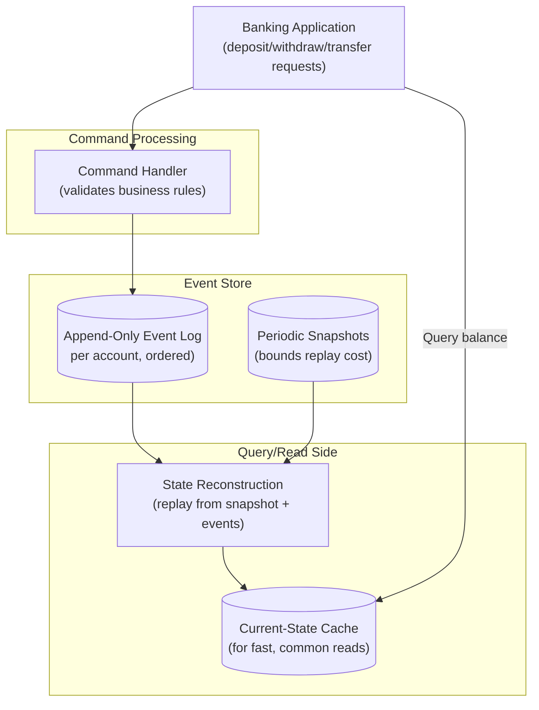
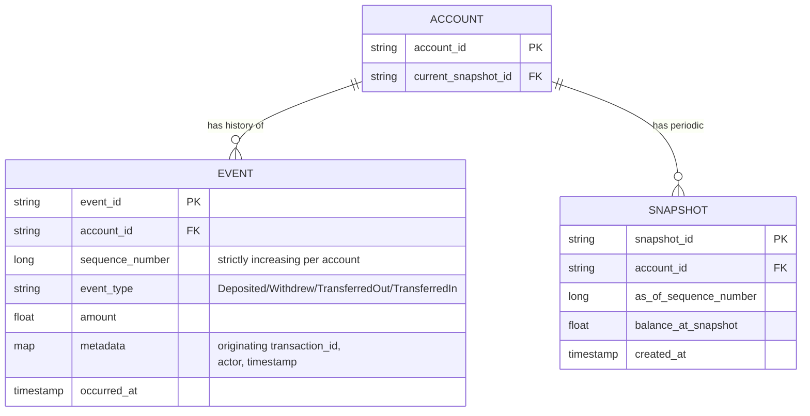
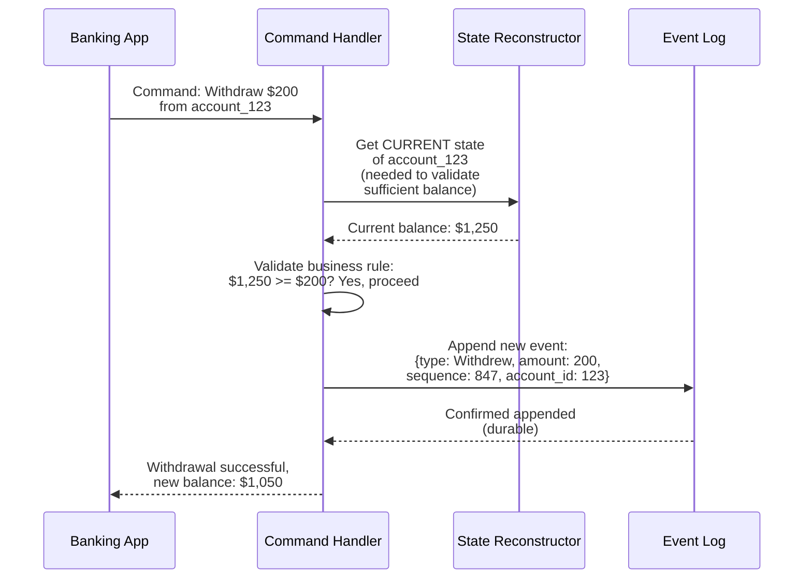
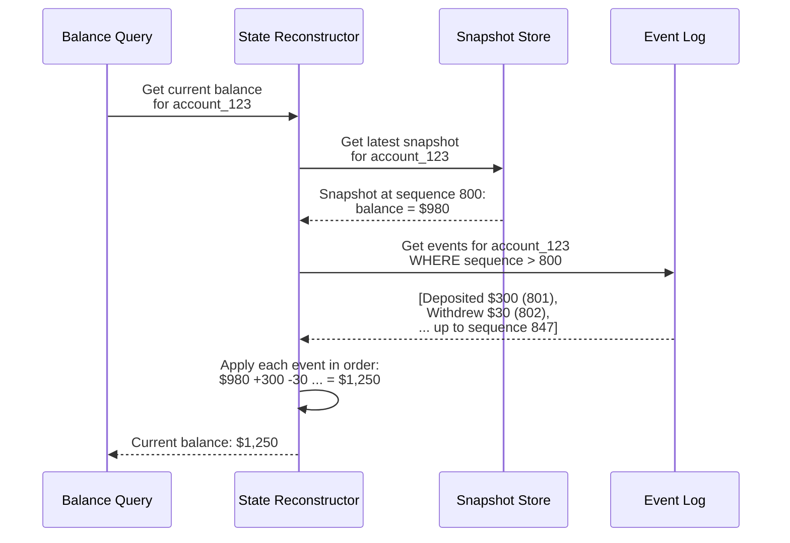
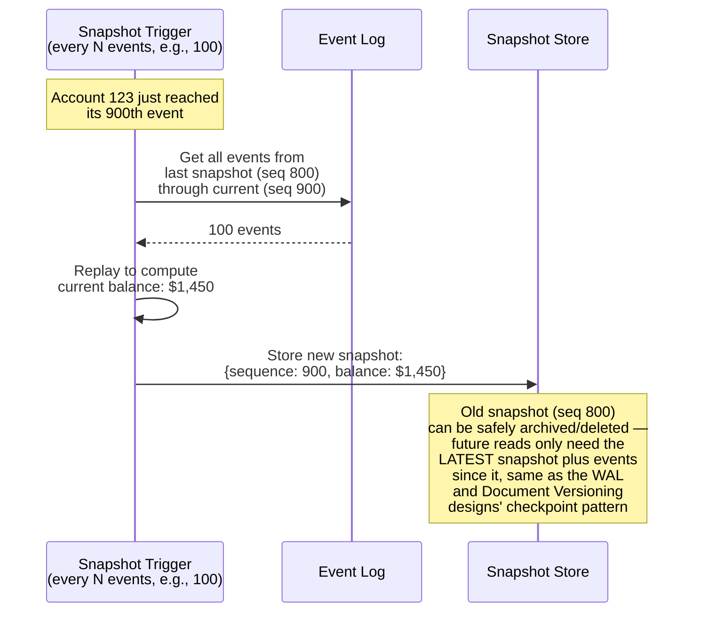
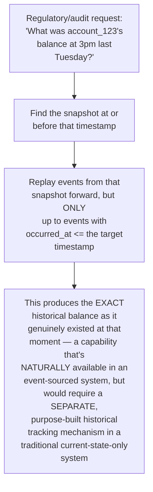
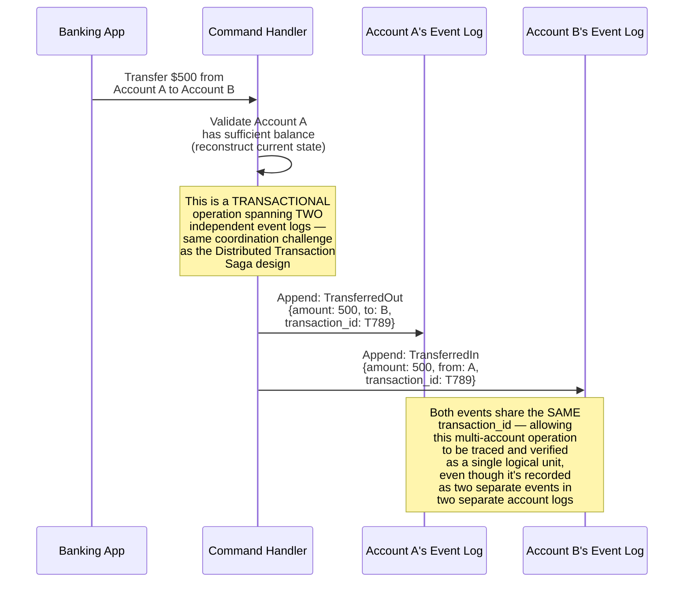
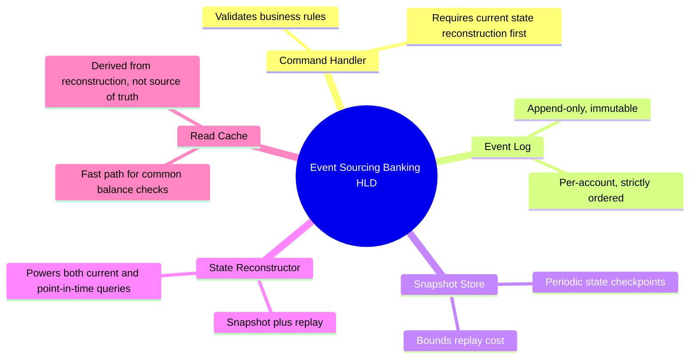

# Design an Event Sourcing System for a Banking Application — High-Level Design Document

## 1. Requirements

### Functional Requirements
- Record every state-changing action (deposit, withdrawal, transfer) as an immutable event, rather than just storing current account balances
- Reconstruct an account's current state by replaying its event history
- Support point-in-time queries — "what was this account's balance as of last Tuesday?"
- Support snapshotting to avoid replaying an account's ENTIRE history on every read

### Non-Functional Requirements
- **Complete auditability:** Every single balance change must be traceable to a specific originating event — a hard regulatory requirement in banking
- **Correctness above all:** Financial calculations must be exact, with no possibility of silently-lost or duplicated transactions
- **Durability:** Events, once recorded, must never be lost — they ARE the source of truth, not a derived convenience
- **Reasonable read performance:** Despite being event-sourced, common operations (checking current balance) must remain fast

### Back-of-Envelope Estimation
| Metric | Value |
|---|---|
| Accounts | Millions |
| Transactions/sec (platform-wide) | Thousands |
| Avg events per account (over lifetime) | Hundreds to thousands |
| Snapshot interval | Every N events (e.g., 100) |

---

## 2. The Core Principle — Store What Happened, Not Just the Current State

---

## 3. High-Level Architecture

**Key idea:** Writes (commands) always append new events to the immutable log — never modify existing entries. Reads reconstruct current state by starting from the nearest snapshot and replaying subsequent events — the same snapshot-plus-replay pattern established in both the WAL & Recovery System and Document Versioning designs, applied here to financial account state specifically.

---

## 4. Data Model

**Why the sequence number is strictly per-account, not global:** Each account's event history is an independent, ordered log — replaying account A's events never needs to consider account B's events at all, which is what allows different accounts to be processed and scaled completely independently of one another.

---

## 5. Command Processing (Write Path) — Detailed Sequence

**Why validation requires reconstructing current state FIRST:** Unlike a traditional system that can directly check a stored balance column, an event-sourced system must derive the current state (by replay) BEFORE it can validate a new command against business rules (e.g., "sufficient funds") — this is a genuine architectural cost of event sourcing, mitigated by the snapshot mechanism keeping reconstruction fast.

---

## 6. State Reconstruction (Read Path) — Detailed Sequence

**Why this stays fast even for old accounts with thousands of historical events:** Just as in the WAL & Recovery System and Document Versioning designs, the snapshot bounds the replay window — regardless of whether an account has 100 or 100,000 total historical events, reconstruction only ever needs to replay events SINCE the most recent snapshot, keeping read latency predictable and bounded.

---

## 7. Snapshotting Flow — Detailed Sequence

---

## 8. Point-in-Time Queries (A Natural Consequence of Event Sourcing)

**Why this is a genuine architectural advantage, not just a nice side effect:** In a traditional system storing only current balance, answering "what was the balance at time T" requires EITHER a separate point-in-time snapshot system (extra infrastructure) OR is simply IMPOSSIBLE if that historical data was never separately captured. In event sourcing, this capability falls out naturally from the fundamental way the system already stores data — connecting directly to the same point-in-time correctness principle explored in the Feature Store design's training data generation.

---

## 9. Handling Transfers (Multi-Account Events)

**Why the shared `transaction_id` matters for correctness verification:** Since each account maintains an independent event log, a transfer necessarily produces two separate events — the shared transaction_id lets auditors and reconciliation processes verify that every "TransferredOut" event has a matching "TransferredIn" event elsewhere, catching any inconsistency (e.g., a partial failure that recorded one side but not the other) that would otherwise be invisible.

---

## 10. Component Responsibilities Summary

---

## 11. Key Design Decisions & Tradeoffs

| Decision | Choice | Why |
|---|---|---|
| Core storage model | Immutable event log as source of truth, not current-state storage | Makes the audit trail structurally guaranteed to match reality — current state is DERIVED from history, never divergent from it |
| Read performance | Snapshot + replay | Bounds reconstruction cost regardless of an account's total historical event count, mirroring the WAL and Document Versioning designs' checkpoint pattern |
| Point-in-time queries | Natural consequence of the event-sourced model | Falls out of the architecture directly, rather than requiring separate historical-tracking infrastructure |
| Multi-account transactions | Shared transaction_id across separate per-account events | Enables cross-log consistency verification despite each account's log being independently managed |
| Write validation | Requires state reconstruction before command processing | A genuine architectural cost of event sourcing, directly mitigated by snapshot-bounded reconstruction speed |

---

## 12. Bottlenecks & Scaling Considerations

- **Write validation latency** — since every command requires reconstructing current state FIRST (to validate business rules like sufficient balance), this adds a read-before-write step to every single transaction; the read cache and snapshot mechanism directly mitigate this, but it remains a genuine architectural overhead compared to a traditional direct-update system.
- **Snapshot frequency tuning** — same fundamental tradeoff as the WAL & Recovery System design: frequent snapshots increase storage/compute overhead, infrequent snapshots increase replay cost for reads — tuned based on actual per-account transaction velocity.
- **Cross-account transaction coordination** — transfers spanning two accounts introduce the same distributed coordination challenges covered in the Distributed Transaction Saga design; a partial failure (one side's event recorded, the other's not) requires reconciliation processes actively monitoring for unmatched transaction_ids.
- **Event schema evolution** — as the banking application's business logic evolves over years, the STRUCTURE of events themselves may need to change (new event types, additional metadata fields); since old events are immutable and permanent, the state reconstruction logic must remain capable of correctly interpreting events recorded under OLDER schema versions indefinitely, not just the current one.
- **Storage growth over very long account lifetimes** — accounts open for decades accumulate enormous event histories; while snapshotting bounds READ cost, the underlying storage for the full historical log continues growing and must be planned for at platform scale, though this is generally an acceptable cost given banking's inherent regulatory requirement to retain complete transaction history regardless of storage architecture chosen.
- **Regulatory reporting and compliance queries** — beyond simple point-in-time balance queries, real banking compliance often requires more complex historical analysis (e.g., "show me all transactions over $10,000 in the last year across all accounts") — this typically requires a SEPARATE analytical system fed by the event stream (similar to the OLAP System design's ingestion approach), since the account-by-account event logs aren't optimized for this kind of cross-account analytical query pattern.
- **Testing reconstruction correctness** — because state is always DERIVED, not directly observed, thorough testing must verify that replaying any given event sequence ALWAYS produces the mathematically correct resulting state — this is a different testing discipline than verifying direct state mutations, requiring careful property-based or exhaustive-sequence testing of the event-application logic itself.
