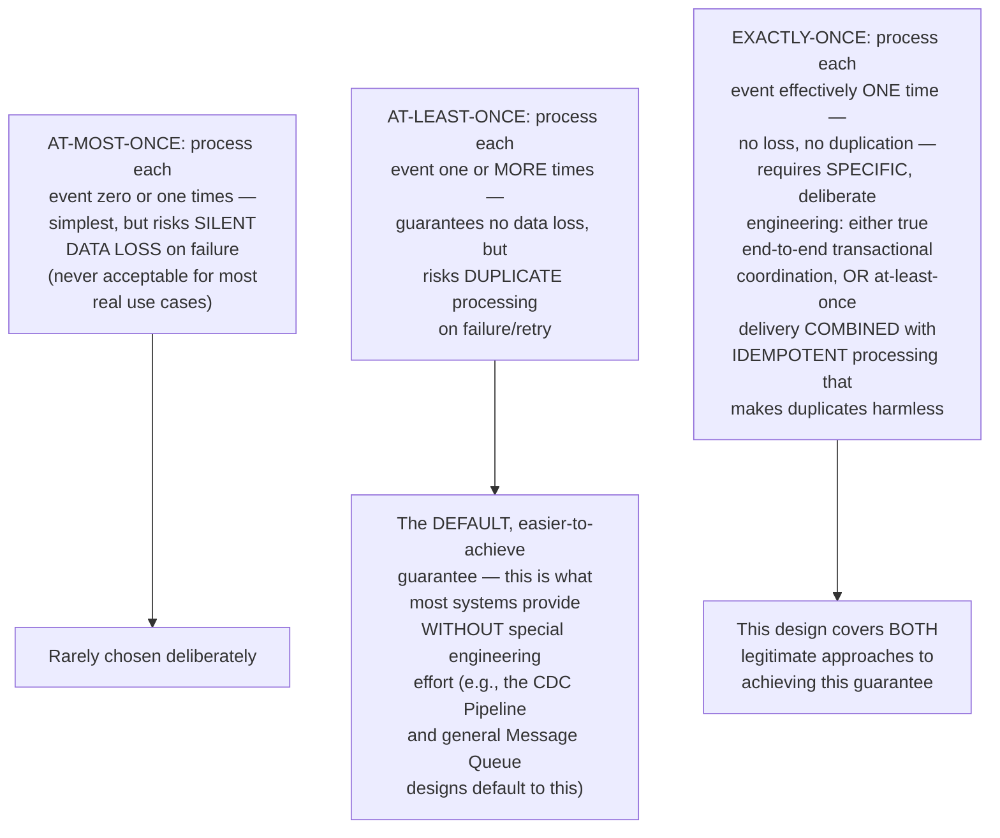
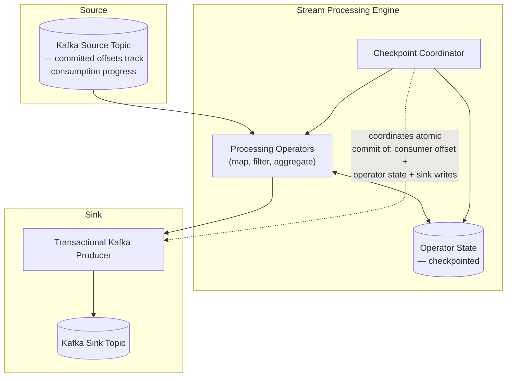
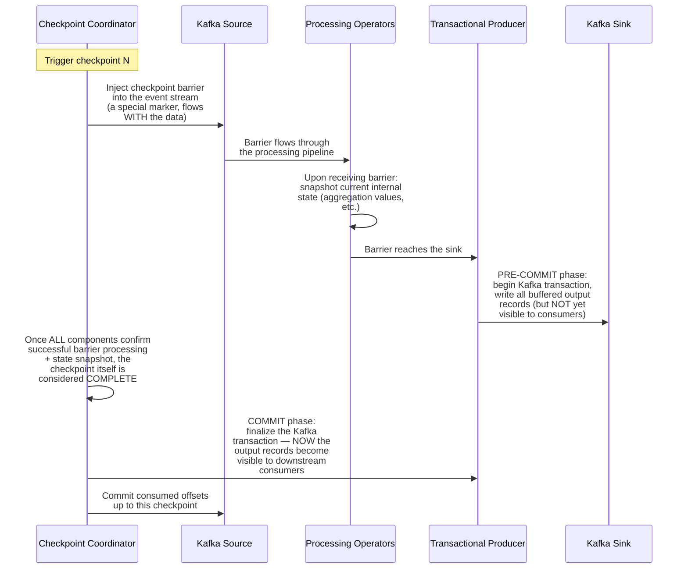
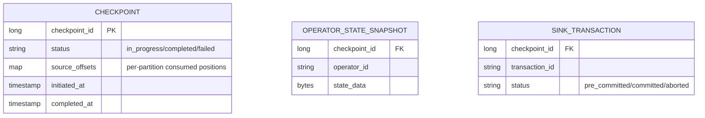
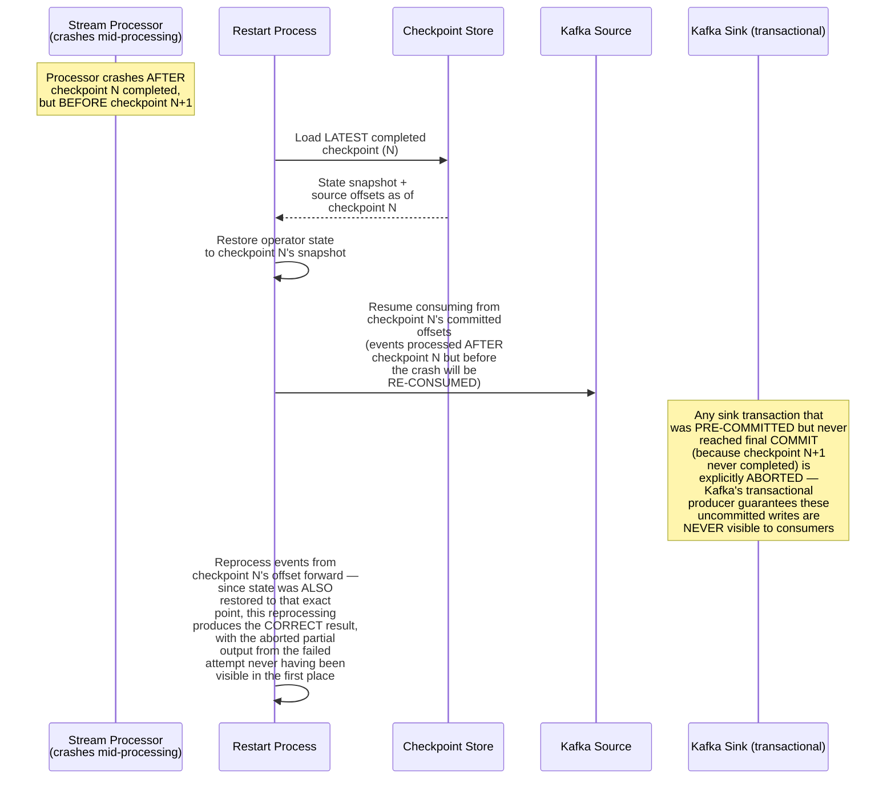
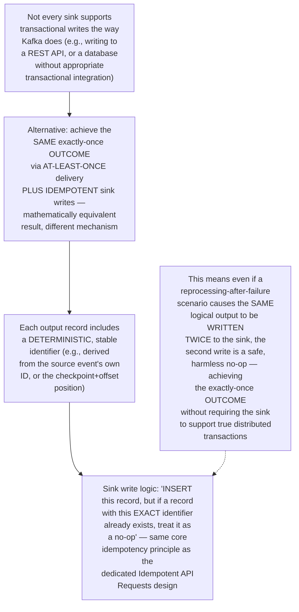
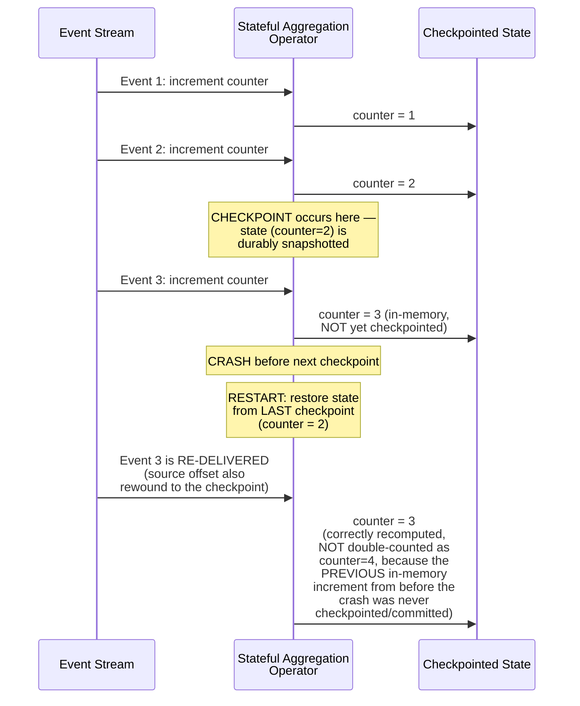
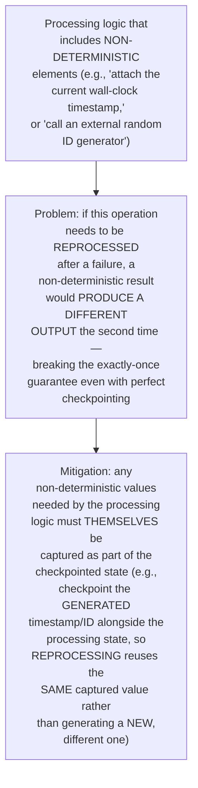
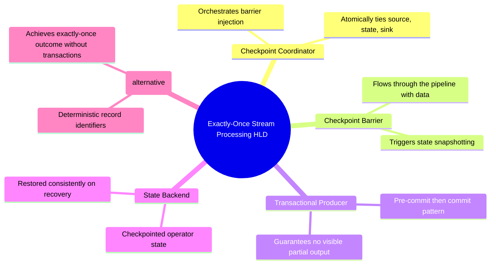

# Design an Exactly-Once Stream Processing Pipeline (Kafka/Flink-style) — High-Level Design Document

## 1. Requirements

### Functional Requirements
- Consume events from a source (e.g., Kafka), transform/aggregate them, and write results to a sink (e.g., another Kafka topic, or a database)
- Guarantee each source event's effect is reflected EXACTLY ONCE in the final output — no duplicates, no omissions — even across failures and restarts
- Support stateful processing (aggregations, joins) that must also survive failures without corruption
- Support both Kafka-to-Kafka pipelines and pipelines writing to external systems (databases, APIs)

### Non-Functional Requirements
- **True exactly-once semantics, not just "at-least-once with a hopeful shrug":** This is a precise, well-defined guarantee, not an aspiration
- **Fault tolerance:** Any component (source, processing, sink) can fail and recover without violating the exactly-once guarantee
- **Reasonable throughput despite the strong guarantee:** Exactly-once mechanisms add overhead; the design must minimize this cost
- **Consistency across the entire pipeline:** The guarantee must hold end-to-end, from source consumption through to final sink write — a weak link anywhere breaks the whole guarantee

### Back-of-Envelope Estimation
| Metric | Value |
|---|---|
| Events/sec | Hundreds of thousands |
| Checkpoint interval | Seconds |
| Failure recovery time | Seconds to low minutes |
| Sink types | Kafka (native transactional support) vs external systems (requires additional coordination) |

---

## 2. Why "Exactly-Once" Is Genuinely Hard — Setting Precise Expectations

**Why this framing matters upfront:** "Exactly-once" is often loosely used to mean "we tried hard to avoid duplicates" — but the RIGOROUS engineering definition requires either genuine distributed transactions spanning the entire pipeline, or the mathematically equivalent combination of guaranteed-at-least-once delivery plus provably idempotent processing. This design is explicit about which mechanism provides the guarantee at each stage, rather than treating it as a vague aspiration.

---

## 3. High-Level Architecture

**Key idea:** True end-to-end exactly-once requires the CHECKPOINT COORDINATOR to atomically tie together THREE things at each checkpoint: (1) how far the source has been consumed, (2) the internal processing state at that point, and (3) what's been committed to the sink — this three-way atomicity, spanning across otherwise-independent systems, is the core technical challenge this entire design solves.

---

## 4. Checkpoint-Based Exactly-Once (Two-Phase Commit Across the Pipeline)

**Why this is fundamentally a two-phase commit pattern (connecting to the Distributed Transaction design):** The sink writes happen in a PRE-COMMIT (buffered, not yet visible) state until the ENTIRE checkpoint across the whole pipeline succeeds — only then does the coordinator trigger the final COMMIT, making the output visible. This mirrors the prepare/commit pattern from the Distributed Transaction Saga design, applied specifically to make an entire streaming pipeline's state transition atomic.

---

## 5. Data Model

---

## 6. Failure Recovery Flow — Detailed Sequence

**Why this achieves TRUE exactly-once, not just at-least-once:** The critical guarantee is that reprocessed events NEVER produce VISIBLE duplicate output — because any partial sink writes from the failed attempt were still in an uncommitted transactional state (never visible to consumers) at the moment of failure, and get explicitly aborted on recovery. The reprocessing that follows produces the ONE, correct, visible output — downstream consumers never see evidence that reprocessing happened at all.

---

## 7. The Alternative Approach — Idempotent Sinks (When Transactions Aren't Available)

---

## 8. Stateful Aggregation Correctness Across Failures

**Why this doesn't result in double-counting:** The key insight is that the in-memory state change from processing Event 3 the FIRST time (before the crash) was never durably checkpointed — from the system's committed, durable perspective, Event 3 was NEVER successfully processed at all. Reprocessing it after recovery is therefore the FIRST successful processing of that event from the system's consistent viewpoint, not a duplicate.

---

## 9. Handling Non-Deterministic Processing Logic

---

## 10. Component Responsibilities Summary

---

## 11. Key Design Decisions & Tradeoffs

| Decision | Choice | Why |
|---|---|---|
| Core mechanism | Checkpoint barriers + two-phase sink commit | Atomically ties together source offset, processing state, and sink output — the only way to achieve TRUE exactly-once across an entire heterogeneous pipeline |
| Sink strategy (transactional systems) | Pre-commit/commit pattern (e.g., Kafka transactions) | Ensures partial output from a failed attempt is never visible to downstream consumers |
| Sink strategy (non-transactional systems) | At-least-once delivery + idempotent writes | Achieves the mathematically equivalent exactly-once OUTCOME when true distributed transactions aren't available at the sink |
| Recovery approach | Restore state to last checkpoint, rewind and reprocess | Reprocessing from a consistent checkpoint produces correct results without double-counting, since pre-crash uncommitted progress was never durably recorded |
| Non-determinism handling | Checkpoint any non-deterministic values alongside state | Prevents reprocessing from producing genuinely different output than the original (failed) attempt would have |

---

## 12. Bottlenecks & Scaling Considerations

- **Checkpoint barrier alignment overhead** — coordinating a consistent snapshot across many parallel processing operators requires the barrier to propagate through and align across ALL of them before the checkpoint can complete; operators with uneven processing speeds can create alignment delays, directly impacting checkpoint frequency and thus recovery granularity.
- **Checkpoint interval tuning** — the same fundamental tradeoff seen throughout this document series (WAL, ML Training, general Stream Processing): frequent checkpoints add overhead and reduce throughput, infrequent checkpoints widen the reprocessing window on failure — tuned based on actual throughput requirements and acceptable recovery time.
- **Non-transactional sink limitations** — the idempotent-write alternative (Section 7) requires the sink system to actually SUPPORT efficient deduplication by a stable identifier; not every external system (e.g., certain third-party APIs) provides this capability, which can genuinely limit which sinks can participate in a true exactly-once pipeline versus only achieving at-least-once.
- **State size and checkpoint I/O cost** — pipelines with very large accumulated state (e.g., aggregating over long time windows across millions of keys) face substantial I/O cost for each checkpoint's state snapshot; incremental checkpointing (saving only what changed since the last checkpoint, rather than the full state each time) is an important optimization at scale.
- **Cross-system coordination complexity** — true end-to-end exactly-once spanning genuinely independent systems (a Kafka source, a stateful processor, AND an external database sink) requires careful, deliberate engineering at each integration point — this is meaningfully harder than a pure Kafka-to-Kafka pipeline where the same transactional infrastructure spans the whole flow.
- **Testing exactly-once guarantees** — verifying this guarantee actually holds requires deliberately injecting failures at EVERY possible point in the pipeline (mid-checkpoint, mid-sink-write, mid-state-restore) and confirming no duplicates or losses occur — this demands the same rigorous fault-injection testing discipline emphasized in the WAL & Recovery System and ML Training Pipeline designs, since these correctness properties are largely invisible during normal, failure-free operation.
