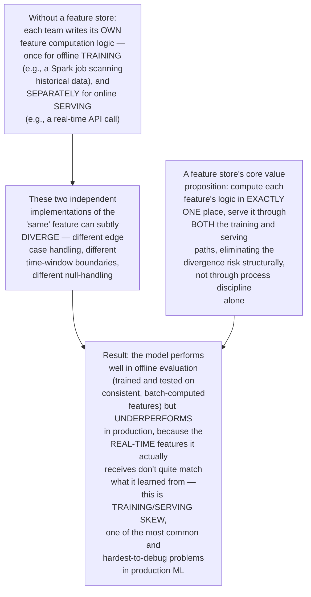
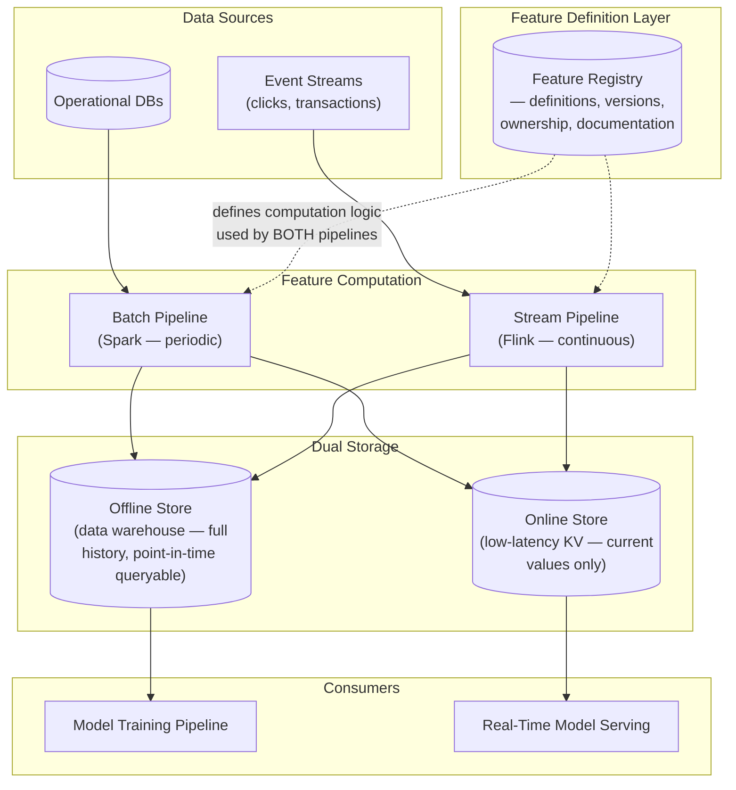
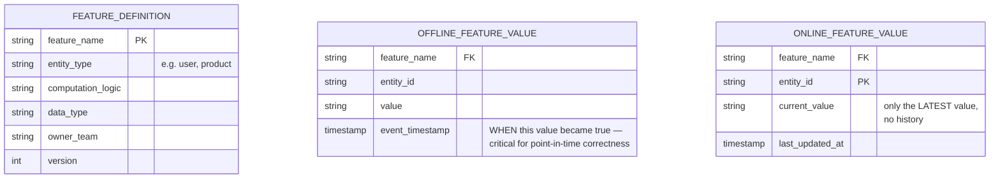
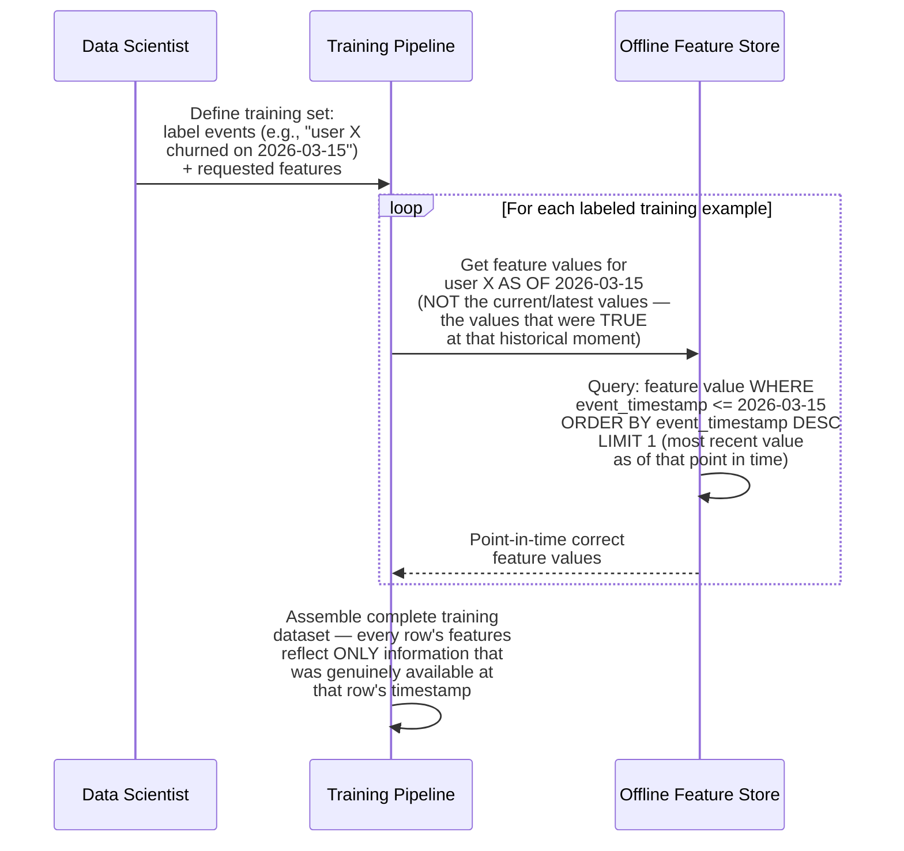
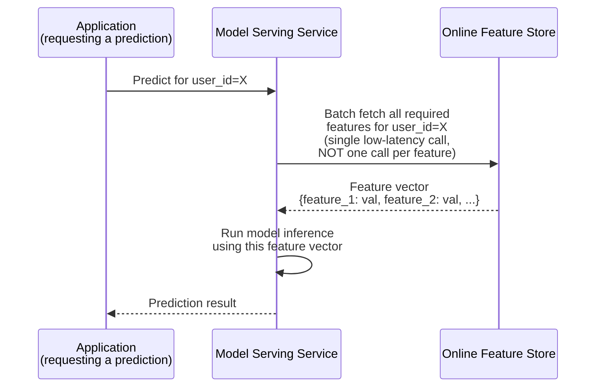
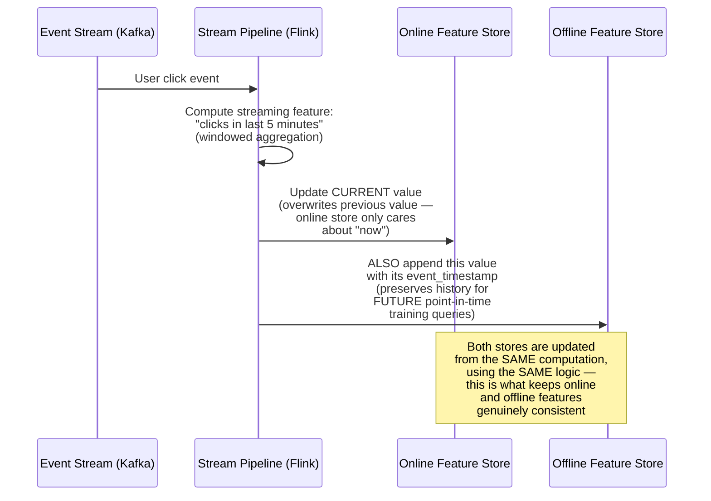
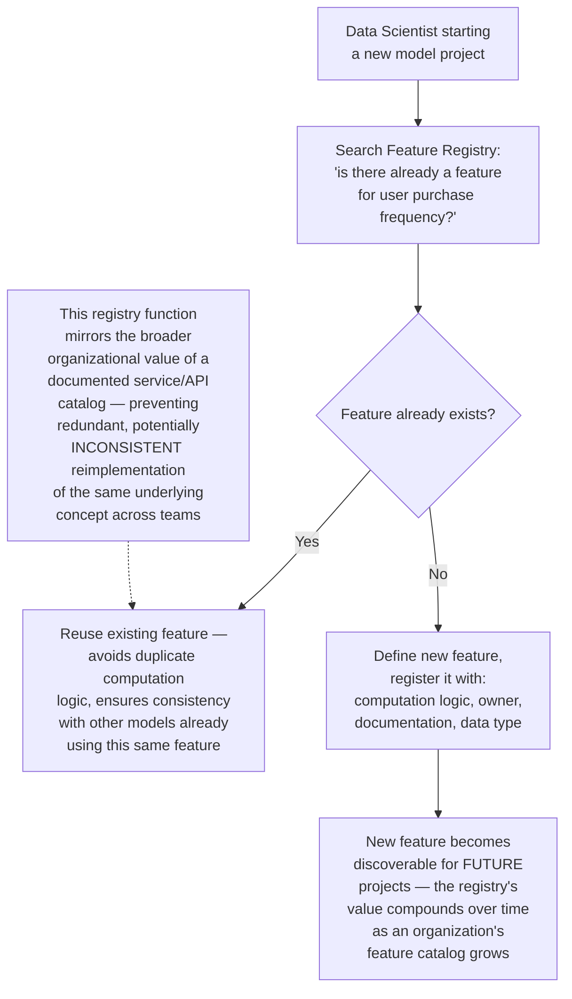
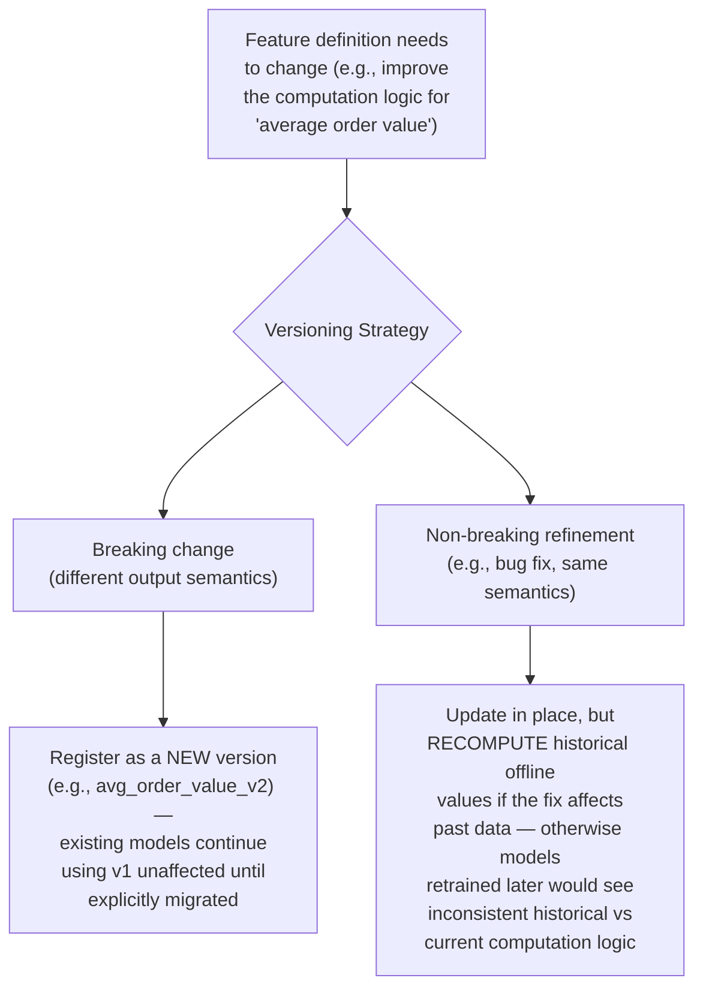
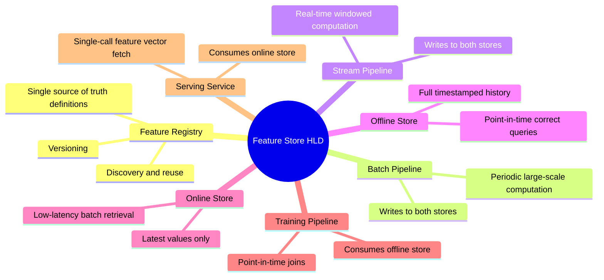

# Design a Feature Store for ML Models — High-Level Design Document

## 1. Requirements

### Functional Requirements
- Store and serve features (computed inputs to ML models) for both model TRAINING (offline, batch) and model SERVING (online, real-time)
- Guarantee that a model sees the EXACT SAME feature values during training as it will during real-time serving for equivalent inputs
- Support feature versioning and discovery (data scientists finding and reusing existing features rather than reinventing them)
- Support both batch-computed features (e.g., daily aggregates) and streaming/real-time features (e.g., "clicks in the last 5 minutes")

### Non-Functional Requirements
- **Point-in-time correctness (the defining challenge):** Training data must reflect EXACTLY what would have been known at the historical moment being trained on — not future information "leaking" backward
- **Low-latency online serving:** Real-time model inference needs feature lookups in single-digit milliseconds
- **High-throughput offline access:** Training jobs need to pull large volumes of historical feature data efficiently for batch processing
- **Consistency between online and offline paths:** The same logical feature must be computed identically whether accessed via the batch or streaming path

### Back-of-Envelope Estimation
| Metric | Value |
|---|---|
| Distinct features registered | Hundreds to thousands, across many teams/models |
| Online feature lookups/sec | Very high — one per model inference request |
| Offline training data volume | Terabytes, spanning months/years of historical feature values |
| Feature freshness (streaming features) | Seconds |
| Feature freshness (batch features) | Hours to a day |

---

## 2. The Core Problem This System Solves — Training/Serving Skew

---

## 3. High-Level Architecture

**Key idea:** The Feature Registry holds the SINGLE, authoritative definition of how each feature is computed — both the batch and streaming pipelines implement this SAME definition (ideally sharing actual code, not just a specification), and write their results into BOTH stores. This structural sharing is what prevents the divergence at the root of training/serving skew, rather than relying on two independent teams/pipelines staying manually synchronized.

---

## 4. Data Model

**Why the offline store retains full history with `event_timestamp`, while online only keeps the latest value:** Training needs to reconstruct "what was true AT THE TIME of each historical training example" — requiring the full timestamped history. Serving only ever needs "what's true RIGHT NOW" for a live inference request — no history needed, which is why the online store can stay small, fast, and simple by design.

---

## 5. Point-in-Time Correct Training Data Generation — Detailed Sequence

**Why this "as of" query is the single hardest technical problem in feature store design:** Naively joining "user X's current profile data" against a historical label from months ago would leak FUTURE information into training (e.g., training a churn model using the user's CURRENT status, which obviously already reflects whether they churned) — this is called "label leakage," and it's one of the most common, subtle bugs in ML pipelines. Point-in-time correct joins are specifically engineered to prevent this by always fetching feature values as they existed at the exact historical moment relevant to each training example.

---

## 6. Real-Time Online Feature Serving — Detailed Sequence

**Why batching feature fetches into a single call matters:** If a model requires 50 features, making 50 separate network round-trips to fetch them individually would badly blow the latency budget for real-time inference; the online store is designed to support efficient batch retrieval of an entity's full feature vector in one call, similar in spirit to why the Distributed Cache design emphasizes batched operations for hot-path efficiency.

---

## 7. Streaming Feature Computation — Detailed Sequence

---

## 8. Feature Registry & Discovery

---

## 9. Handling Feature Versioning

---

## 10. Component Responsibilities Summary

---

## 11. Key Design Decisions & Tradeoffs

| Decision | Choice | Why |
|---|---|---|
| Core architecture | Shared feature definitions feeding dual storage (offline + online) | Structurally eliminates training/serving skew by ensuring identical computation logic feeds both paths, rather than relying on process discipline across separate implementations |
| Offline storage | Full timestamped history | Enables point-in-time correct training data generation, preventing label leakage from future information |
| Online storage | Latest-value-only, optimized for low latency | Real-time inference never needs historical values — keeping this store simple and fast by design |
| Feature discovery | Central registry with documentation | Prevents redundant, potentially inconsistent reimplementation of the same conceptual feature across different teams/models |
| Feature fetching (serving) | Batched, single-call retrieval of full feature vector | Avoids the latency cost of many sequential round-trips for models requiring dozens of features |
| Versioning | New version for breaking changes, in-place fix + historical recompute for non-breaking | Balances allowing feature improvement against not silently breaking models already depending on existing behavior |

---

## 12. Bottlenecks & Scaling Considerations

- **Point-in-time join computational cost** — generating training datasets with proper point-in-time correctness across many features and millions of historical examples is computationally expensive; this is often the single most resource-intensive job in an ML pipeline, requiring careful query optimization and often specialized point-in-time join engines rather than naive SQL joins.
- **Online store latency under high fan-out** — models requiring very large feature vectors (hundreds of features) still face aggregate latency cost even with batched retrieval; may require the online store itself to be sharded/optimized specifically for wide, single-entity reads.
- **Streaming feature computation backpressure** — similar to the Analytics/Metrics Dashboard design's stream processing concerns, if the streaming pipeline falls behind event volume, online feature freshness degrades exactly when real-time signals matter most (e.g., during a traffic spike).
- **Feature registry governance at scale** — as the number of registered features grows into the thousands across many teams, without active curation the registry risks becoming cluttered with duplicate, poorly-documented, or abandoned features — this requires ongoing organizational process (feature review, deprecation policies), not just the technical registry infrastructure alone.
- **Consistency window between batch and streaming updates for the same conceptual feature** — if a feature has BOTH a batch-computed baseline AND a streaming real-time adjustment (e.g., daily aggregate plus "activity in the last few minutes"), reconciling these into a single coherent feature value requires careful design to avoid double-counting or gaps.
- **Backfilling historical feature values for NEW features** — when a data scientist defines a brand-new feature, generating its historical values for past training data (not just going-forward) can require reprocessing large volumes of historical raw data — this backfill capability needs to be a first-class, well-supported operation, not an afterthought, since new feature ideas are a constant, ongoing need.
- **Cross-team feature dependency management** — as more models depend on shared features (which is the whole point), a change to a widely-used feature's computation logic can have wide-reaching downstream impact across many models simultaneously; needs the same careful change-management rigor as changing a widely-depended-upon shared API or library.
