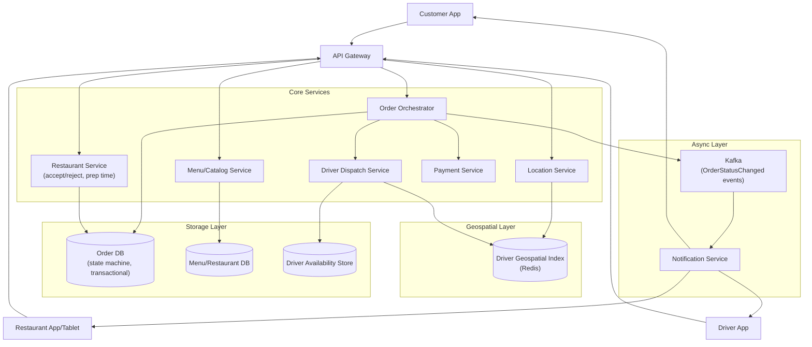
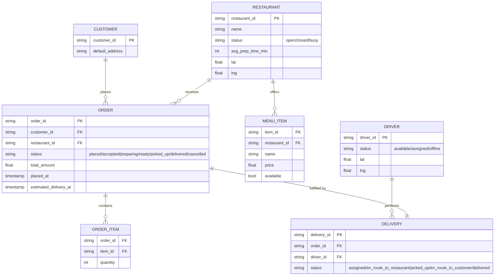
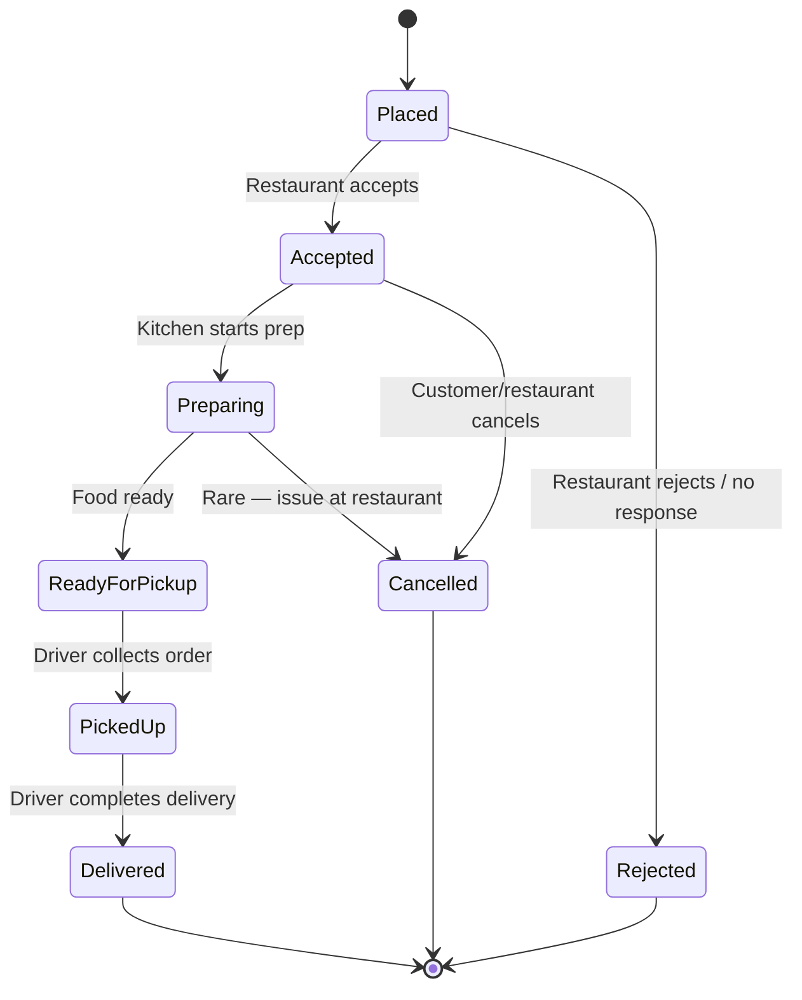
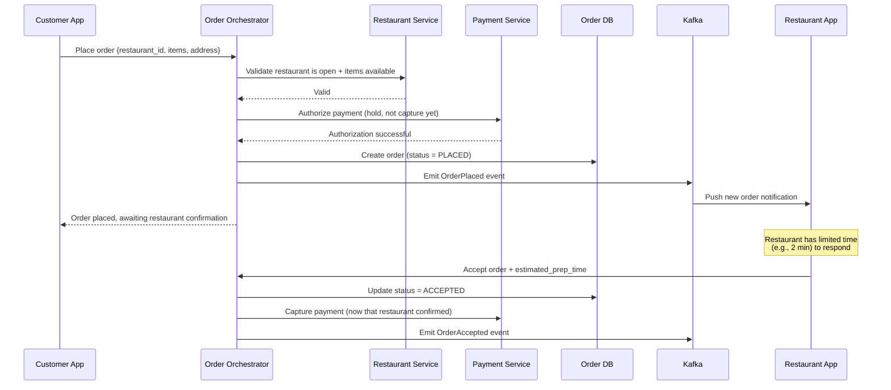
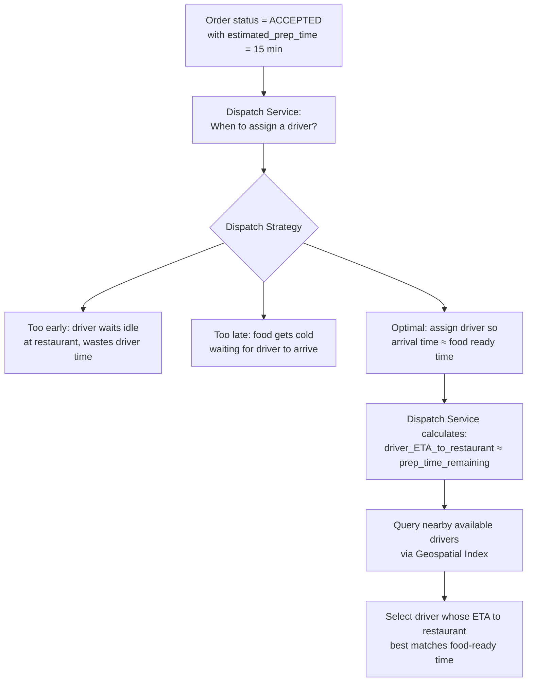
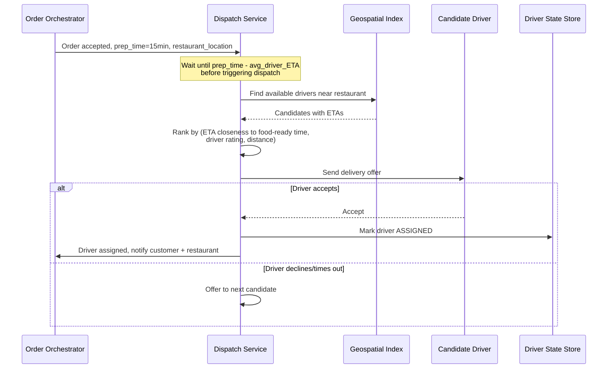
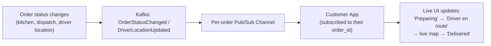
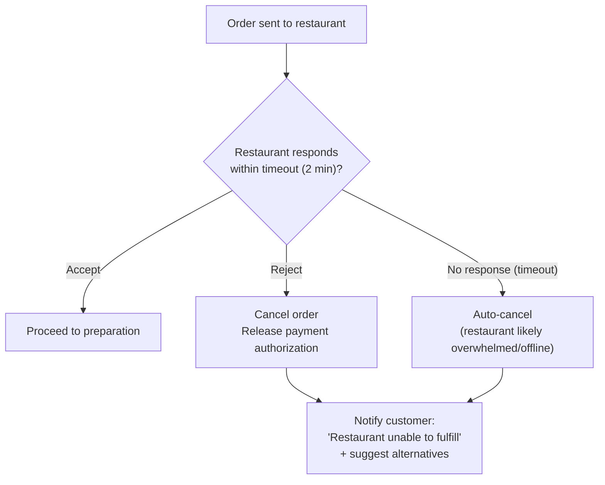
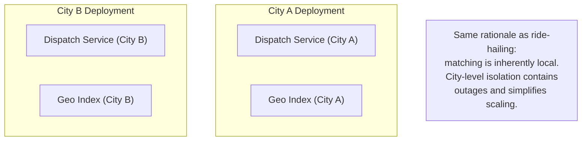
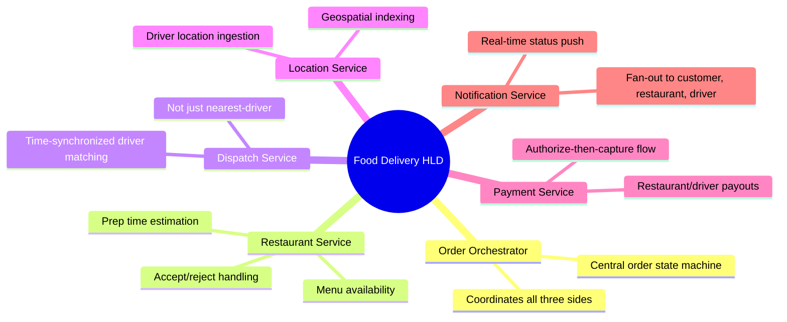

# Design a Food Delivery Platform — High-Level Design Document

## 1. Requirements

### Functional Requirements
- Customers browse restaurants, view menus, place orders
- Restaurants receive and accept/reject orders, mark food ready
- Drivers get matched to pick up and deliver orders
- Real-time order tracking (prep status, driver location, ETA)
- Three-sided marketplace: customers, restaurants, drivers all need coordinated state
- Payment processing and restaurant/driver payouts

### Non-Functional Requirements
- **Scale:** Millions of orders/day, geographically distributed demand
- **Real-time coordination:** Order state must sync accurately across customer, restaurant, and driver apps
- **Time-sensitive matching:** Driver assignment must account for restaurant prep time, not just proximity
- **Availability:** A regional outage shouldn't affect other cities (similar to Uber's model)
- **Consistency:** Order status must never show conflicting states to different parties

### Back-of-Envelope Estimation
| Metric | Value |
|---|---|
| Orders/day (large platform) | ~5M |
| Orders/sec (peak, dinner rush) | ~500-1,000/sec |
| Avg order lifecycle duration | 30-45 minutes |
| Active drivers (peak, per city) | Thousands |
| Location updates/sec (drivers) | Similar firehose pattern to ride-hailing |

---

## 2. High-Level Architecture

**Key idea:** This is a **three-sided marketplace** where a single order touches customer, restaurant, and driver simultaneously — the Order Orchestrator acts as the single source of truth for order state, and every party's view is derived from (never independently mutates) that central state machine.

---

## 3. Data Model

---

## 4. Order Lifecycle State Machine

*This is the backbone the entire system revolves around — every service (dispatch, notifications, payment capture) reacts to transitions in this single state machine rather than maintaining independent state.*

---

## 5. Order Placement Flow — Detailed Sequence

**Key design point:** Payment is **authorized** (funds held, not charged) when the order is placed, but only **captured** (actually charged) once the restaurant accepts. This avoids charging a customer for an order the restaurant ends up rejecting (out of stock, closed unexpectedly).

---

## 6. Driver Dispatch — Timing-Aware Matching

*This is the key differentiator from ride-hailing dispatch: it's not simply "nearest available driver" — it's **time-synchronized matching** where the system deliberately delays assignment until the driver's travel time to the restaurant roughly aligns with when the food will actually be ready.*

---

## 7. Driver Dispatch — Detailed Sequence

---

## 8. Real-Time Order Tracking (Customer View)

*Same per-entity pub/sub pattern as ride-hailing's live trip tracking — the customer subscribes to updates scoped to their specific order, not a broad broadcast channel.*

---

## 9. Handling Restaurant Non-Response / Rejection

---

## 10. Multi-Region / City-Based Partitioning

---

## 11. Component Responsibilities Summary

---

## 12. Key Design Decisions & Tradeoffs

| Decision | Choice | Why |
|---|---|---|
| Order state ownership | Single central state machine (Order Orchestrator) | Prevents conflicting views across customer/restaurant/driver apps |
| Payment timing | Authorize at order placement, capture at restaurant acceptance | Avoids charging for orders the restaurant can't fulfill |
| Driver dispatch timing | Time-synchronized to food-ready estimate, not immediate nearest-match | Minimizes both driver idle-wait time and food getting cold |
| Restaurant response | Hard timeout with auto-cancel fallback | Prevents orders hanging indefinitely if a restaurant is unresponsive |
| Regional architecture | City-level partitioning | Delivery matching is inherently local; contains blast radius |
| Order tracking | Per-order pub/sub channel | Scoped, efficient real-time updates without broad broadcast overhead |

---

## 13. Bottlenecks & Scaling Considerations

- **Prep time estimation accuracy** — inaccurate restaurant prep-time estimates cascade into bad dispatch timing (driver waits too long or arrives too early); often improved with historical data per restaurant rather than restaurant-reported estimates alone.
- **Dinner rush concentration** — demand is extremely peaked around meal times in each city; dispatch and geospatial services need to handle sharp load spikes, not just steady average throughput.
- **Driver supply shortages in specific micro-areas** — a popular restaurant cluster can outstrip nearby driver supply even if city-wide supply looks adequate; may need surge incentives similar to ride-hailing to pull drivers into under-supplied zones.
- **Order state consistency across three apps** — must guard against race conditions like a restaurant marking "ready" at the exact moment the customer cancels; state transitions need to be atomic and validate current state before applying.
- **Multi-restaurant orders / large catering orders** — significantly complicate the "single restaurant, single driver" assumption; often require pooling multiple drivers or accepting longer fulfillment windows.
- **Real-time location fanout during peak hours** — thousands of simultaneous active deliveries per city, each needing live tracking pushed to a customer, adds up to substantial pub/sub fanout load requiring the same firehose-handling infrastructure as ride-hailing.
- **Payment payout reconciliation** — restaurant and driver payouts must reconcile precisely against completed orders, refunds, and cancellations; typically handled by a separate async ledger/reconciliation system rather than inline with the order flow.
