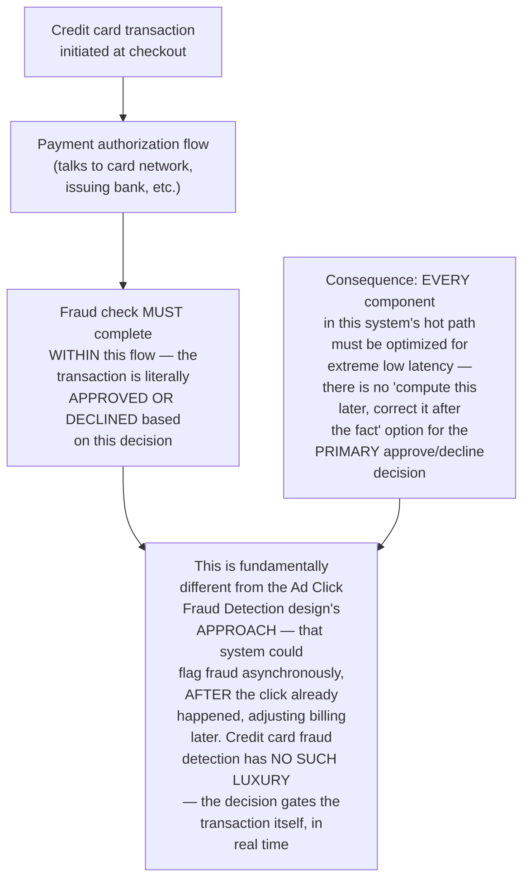
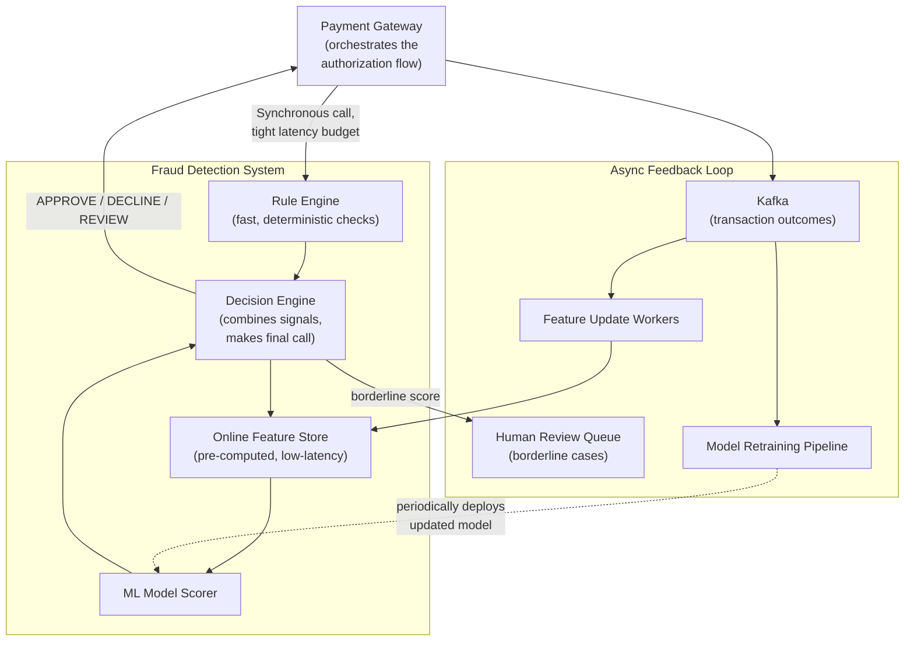
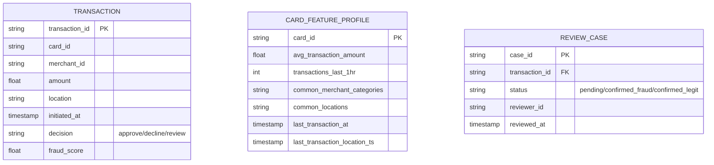
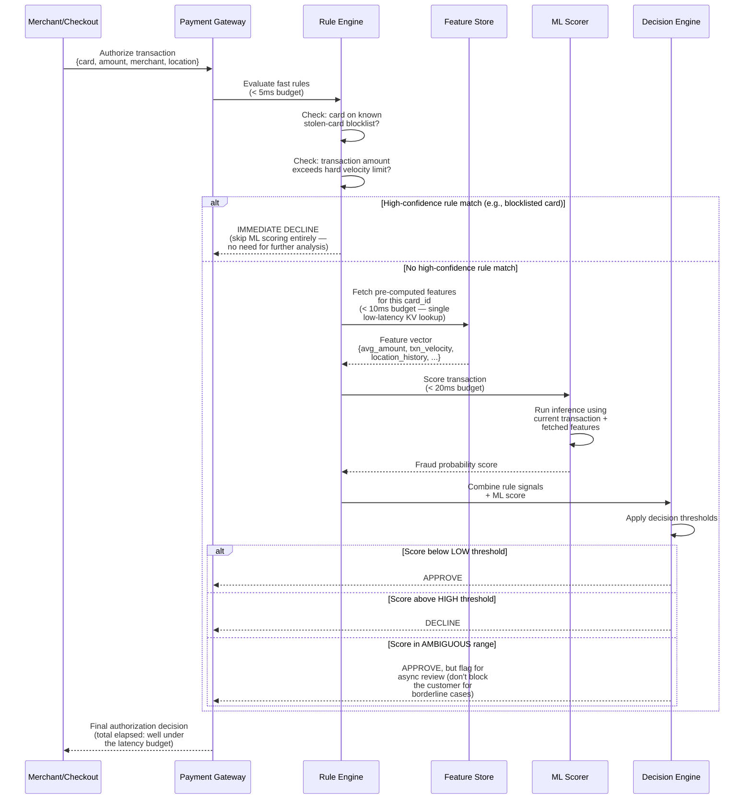
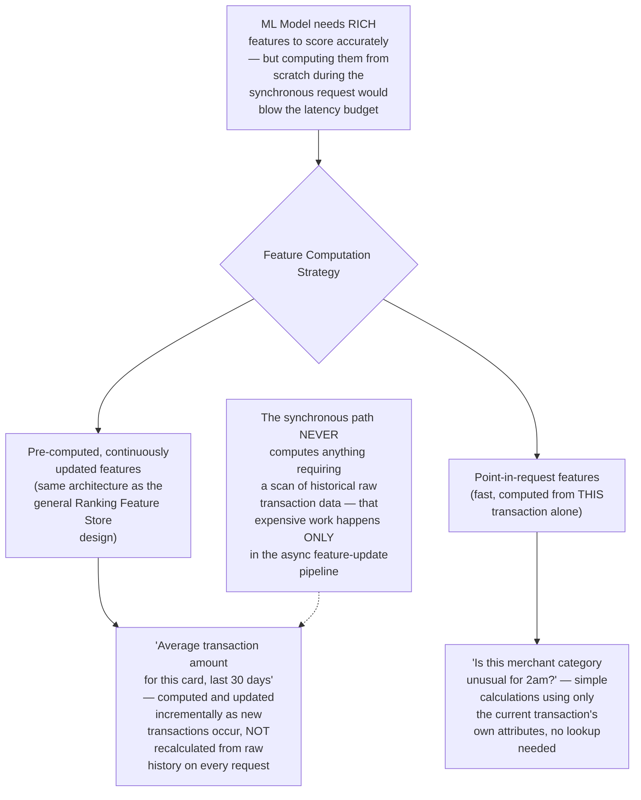
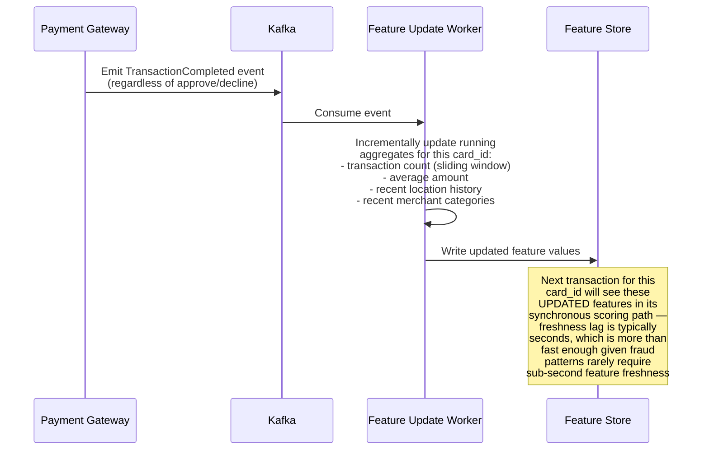
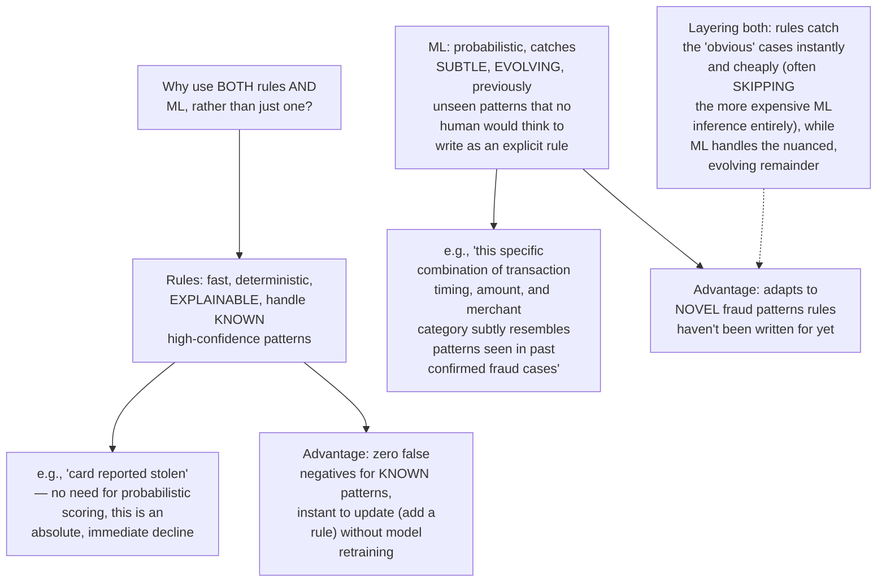
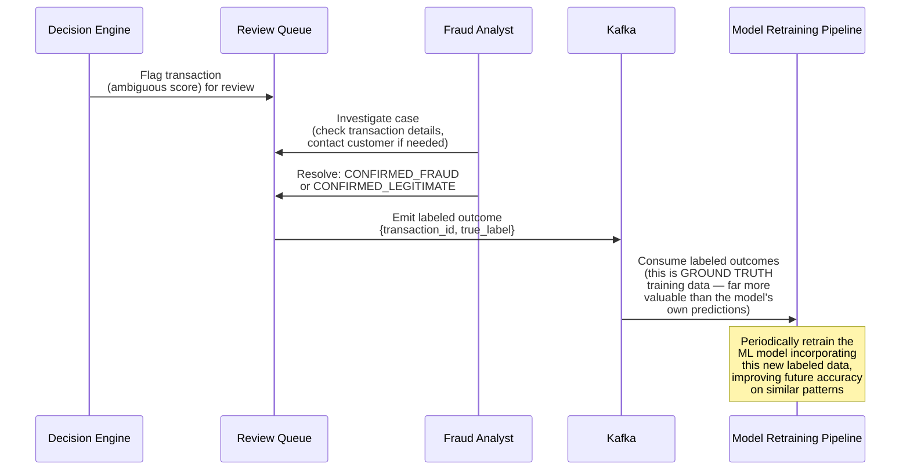
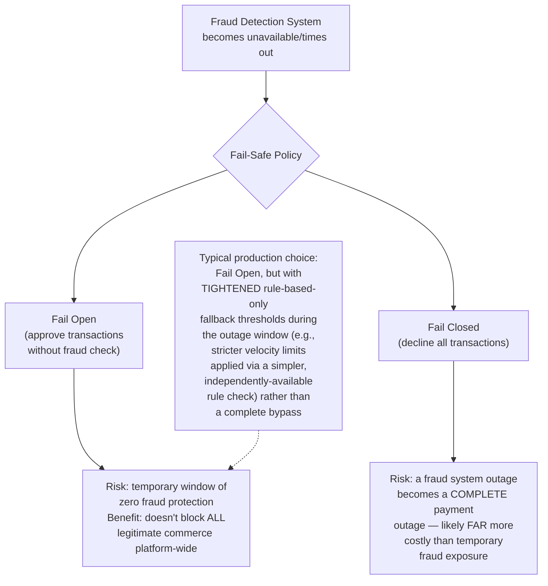
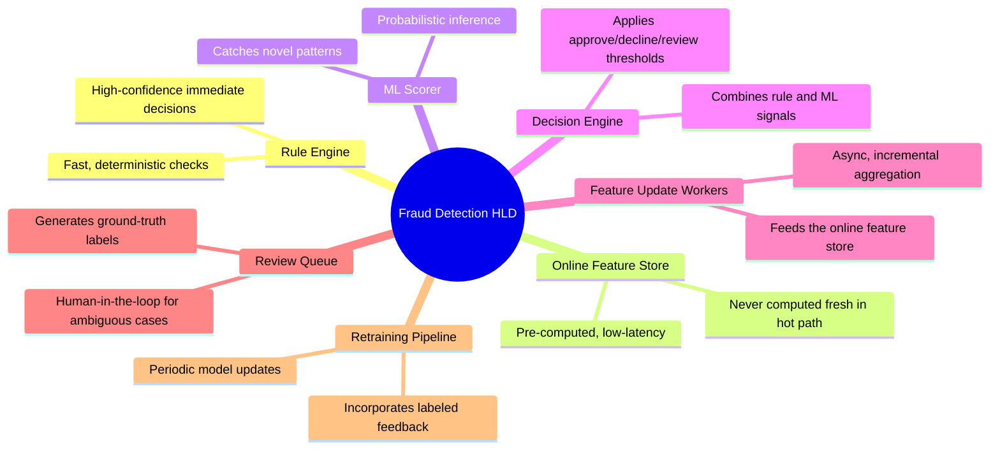

# Design a Real-Time Credit Card Fraud Detection System — High-Level Design Document

## 1. Requirements

### Functional Requirements
- Score every transaction for fraud risk BEFORE it's approved — this is a synchronous, blocking decision, not after-the-fact analysis
- Combine rule-based checks (known fraud patterns) with ML-based scoring (learned patterns)
- Support a human review queue for ambiguous/borderline transactions
- Continuously incorporate feedback (confirmed fraud, false positives) to improve future scoring

### Non-Functional Requirements
- **Extremely low latency:** The fraud check happens IN-LINE with the payment authorization flow — must complete in tens of milliseconds, not seconds, or it delays every single legitimate transaction too
- **High availability:** A fraud detection outage cannot be allowed to block all transactions platform-wide — needs a well-defined fail-safe behavior
- **High accuracy with asymmetric costs:** A false negative (missed fraud) costs real money; a false positive (blocking a legitimate transaction) costs customer trust/friction — these have different, context-dependent costs
- **Adaptability:** Fraud patterns evolve constantly and adversarially — the system must be continuously retrainable, not a fixed, static ruleset

### Back-of-Envelope Estimation
| Metric | Value |
|---|---|
| Transactions/sec (platform-wide peak) | ~50,000 |
| Latency budget for fraud check | < 50-100ms (part of overall payment auth latency budget) |
| Fraud rate (industry typical) | 0.1-1% of transactions |
| Feature computation | Must be pre-computed/cached — no time for expensive queries during the synchronous check |

---

## 2. The Core Architectural Constraint — This Is a Synchronous, Latency-Critical Decision

---

## 3. High-Level Architecture

**Key idea:** The synchronous hot path (rule engine → feature lookup → ML scoring → decision) is deliberately kept as lean as possible, drawing only from PRE-COMPUTED, low-latency data sources. All the expensive, time-consuming work — updating features from new transaction history, retraining models, human review — happens entirely in a separate asynchronous path that feeds back into the hot path's data sources without ever blocking it.

---

## 4. Data Model

---

## 5. Real-Time Transaction Scoring Flow — Detailed Sequence

**Why the "ambiguous range" defaults to approve-but-flag, not block-and-wait:** Blocking a legitimate customer's transaction for manual review would be an unacceptable customer experience for the (statistically likely) common case where the transaction is actually fine. The system optimizes for NOT interrupting the customer's real-time experience, accepting some risk on ambiguous cases in exchange for reviewing them asynchronously and taking corrective action (chargebacks, account flags) if fraud is later confirmed.

---

## 6. Feature Engineering — What Makes Scoring Fast

---

## 7. Asynchronous Feature Update Flow — Detailed Sequence

---

## 8. Rule Engine vs ML Model — Complementary, Not Redundant

---

## 9. Human Review Queue & Feedback Loop

**Why human-reviewed outcomes are the most valuable training data:** Unlike many ML systems that can bootstrap from historical data alone, fraud detection benefits enormously from a continuous stream of DEFINITIVELY LABELED outcomes (confirmed fraud vs confirmed legitimate) — this human-in-the-loop feedback is what allows the model to genuinely learn and adapt to evolving fraud patterns, rather than becoming stale.

---

## 10. Handling Fraud Detection System Failure (Fail-Safe Design)

---

## 11. Component Responsibilities Summary

---

## 12. Key Design Decisions & Tradeoffs

| Decision | Choice | Why |
|---|---|---|
| Architecture | Synchronous, latency-critical hot path + fully decoupled async feedback loop | The approve/decline decision gates the transaction itself in real time, unlike systems (e.g., ad click fraud) that can correct after the fact |
| Detection approach | Layered rules + ML, not either alone | Rules provide fast, explainable, zero-latency handling of known patterns; ML adapts to novel, evolving patterns rules can't anticipate |
| Feature computation | Fully pre-computed, incrementally updated | The synchronous path cannot afford to compute anything from raw historical data on the fly |
| Ambiguous case handling | Approve-and-flag, not block-and-wait | Prioritizes not disrupting the common case (legitimate transactions) over catching every possible fraud case synchronously |
| Failure mode | Fail open with tightened fallback rules | A fraud system outage causing a complete payment outage is generally far more costly than a temporary window of reduced fraud protection |
| Model improvement | Human-reviewed ground truth feeds retraining | Definitively labeled outcomes are the highest-value training signal for continuously adapting to evolving fraud patterns |

---

## 13. Bottlenecks & Scaling Considerations

- **Feature store latency is the dominant hot-path risk** — since this is the one component in the synchronous path requiring a network round-trip to external state (not just in-request computation), its latency and availability directly bound the entire fraud check's latency budget; needs to be treated with the same criticality as the idempotency store in the Idempotent API Requests design.
- **Model inference latency at peak load** — ML scoring must sustain the platform's full peak transaction rate without latency degradation; this often requires model optimization (quantization, distillation) specifically for the inference-speed/accuracy tradeoff, not just using the most accurate model available regardless of latency cost.
- **Adversarial adaptation** — as explicitly noted in the related Ad Click Fraud Detection design, this is fundamentally an adversarial system; fraudsters actively probe and adapt to evade known detection patterns, making continuous retraining and rule updates a permanent operational necessity, not a one-time build.
- **Feature staleness during high-velocity fraud attempts** — a fraudster making many rapid transactions might exploit the (typically seconds-long) lag between a transaction occurring and its effect appearing in pre-computed features; may need a lightweight, very-low-latency real-time velocity check layered alongside the standard feature store for the most time-sensitive signals.
- **False positive cost asymmetry across contexts** — declining a legitimate $10,000 transaction from a long-standing high-value customer has different real business cost than declining a $10 transaction from a new customer; decision thresholds may need to be context-aware (customer tenure, transaction history) rather than a single global threshold.
- **Review queue backlog during fraud spikes** — a coordinated fraud attack can generate a surge of ambiguous-scored transactions simultaneously, overwhelming the human review capacity; needs either auto-scaling review capacity or temporary threshold tightening (accepting more false positives) during detected attack windows.
- **Cross-border/multi-currency complexity** — transaction patterns, typical amounts, and fraud indicators vary significantly by region and currency; a single global model/feature set may underperform compared to regionally-tuned scoring, adding a dimension of complexity to both the feature store and model architecture beyond what's shown in this simplified design.
