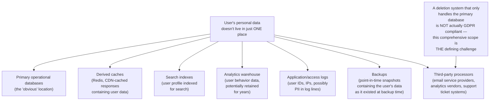
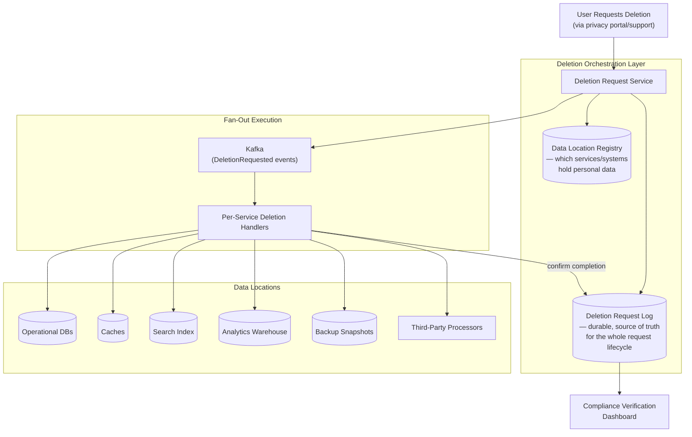
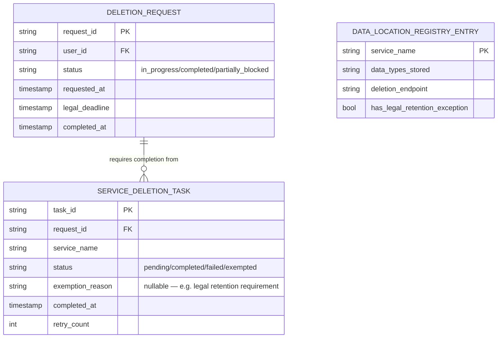
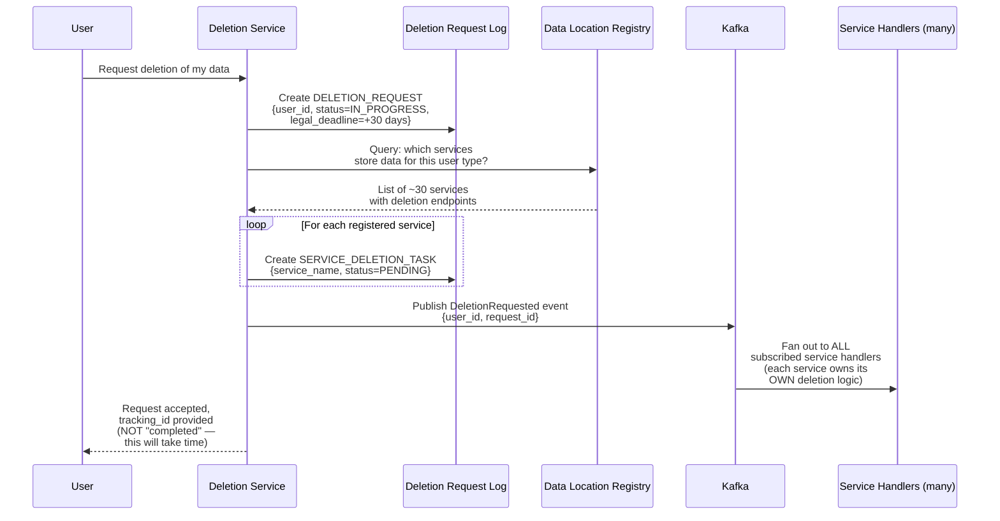
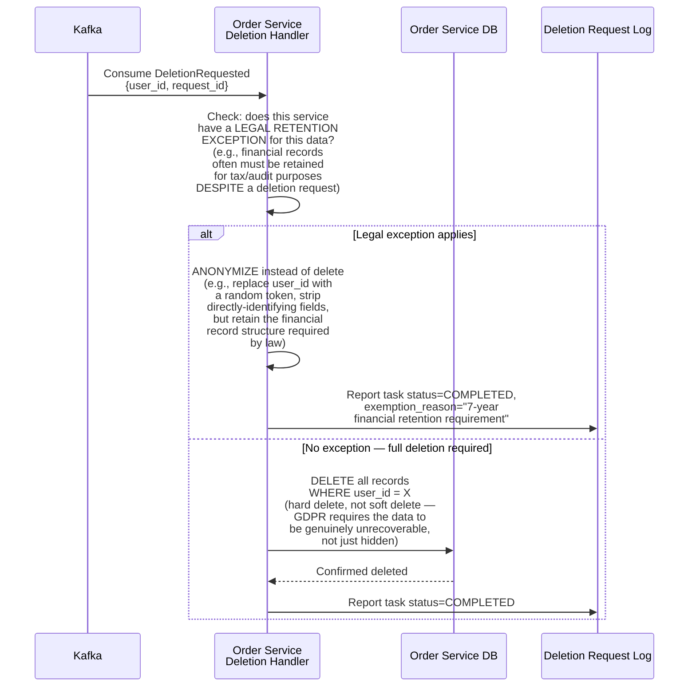
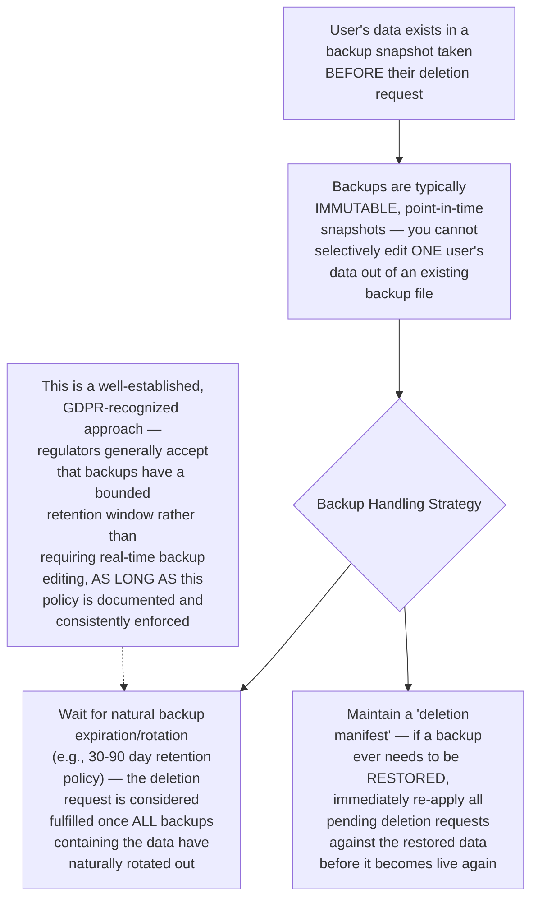
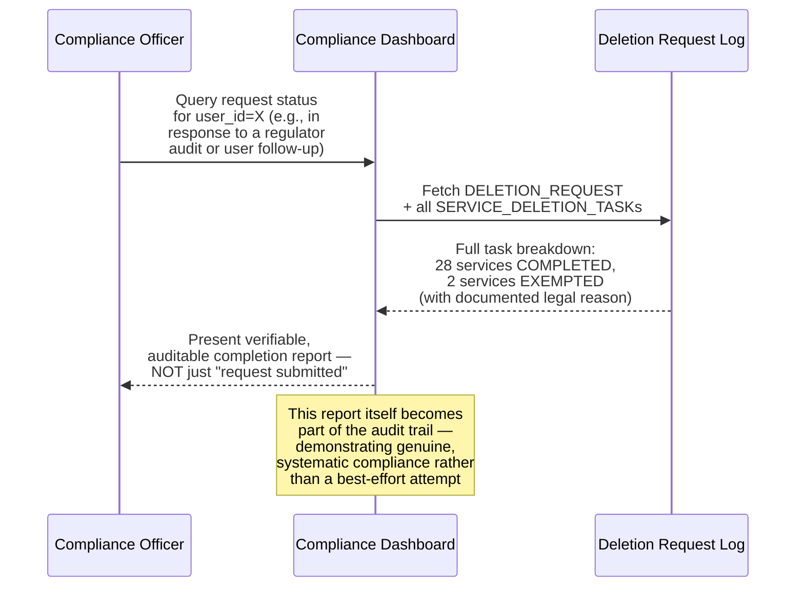
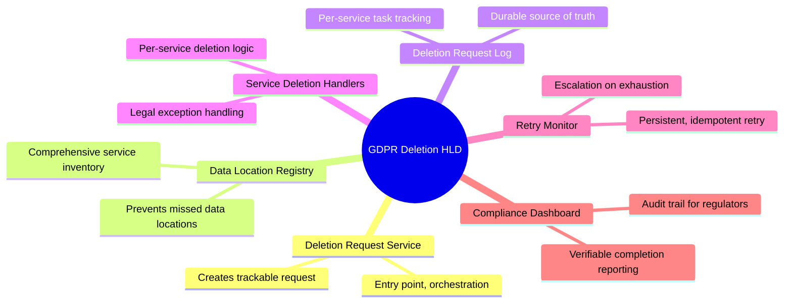

# Design a GDPR-Compliant Data Deletion System Across Microservices — High-Level Design Document

## 1. Requirements

### Functional Requirements
- When a user exercises their "right to be forgotten," permanently delete their personal data across EVERY service that stores it
- Provide verifiable confirmation that deletion actually completed everywhere, not just "request submitted"
- Handle data that's replicated across caches, backups, logs, analytics warehouses, and third-party processors
- Support legally-required exceptions (e.g., data that must be retained for financial/legal compliance despite a deletion request)

### Non-Functional Requirements
- **Completeness (paramount):** Missing even ONE service that retains the user's data is a compliance failure — this isn't a "best effort" system
- **Auditability:** Must produce evidence of what was deleted, when, and confirmation it propagated everywhere — regulators can and do ask for this
- **Bounded time:** GDPR specifies deletion must complete "without undue delay," generally interpreted as within 30 days
- **Correctness under partial failure:** If one downstream service is temporarily unavailable, the request must not be silently dropped — it must be retried until confirmed complete

### Back-of-Envelope Estimation
| Metric | Value |
|---|---|
| Deletion requests/day | Hundreds to low thousands (varies heavily by platform size/region) |
| Services storing personal data | Dozens across a typical microservices platform |
| Time to complete a request | Target: hours to low days, legal maximum: 30 days |
| Data locations per user | Operational DBs, caches, search indexes, analytics warehouse, logs, backups, third-party processors |

---

## 2. The Core Challenge — Data Sprawls Far Beyond the "Obvious" Database



---

## 3. High-Level Architecture



**Key idea:** This is fundamentally a **saga-style orchestrated workflow** (same pattern as the Distributed Transaction Saga design) — but instead of "all-or-nothing with compensation on failure," the goal is "eventually ALL services confirm completion, with persistent retry until they do." The Data Location Registry is the critical piece of institutional knowledge that makes "every place this data lives" a known, queryable fact rather than tribal knowledge scattered across teams.

---

## 4. Data Model



---

## 5. Deletion Request Flow — Detailed Sequence



---

## 6. Per-Service Deletion Handling — Detailed Sequence



**Why anonymization is a legitimate, important alternative to deletion:** GDPR itself recognizes that some data must be retained for OTHER legal obligations (tax law, financial audit requirements) that can conflict with the right to erasure. The correct handling isn't to ignore the deletion request, but to STRIP the personally-identifying elements while retaining the legally-required record in an anonymized form — this must be an explicit, documented, and consistently-applied policy per data type, not an ad-hoc judgment call made differently by different teams.

---

## 7. Handling Retries and Partial Failures

```mermaid
sequenceDiagram
    participant Handler as Service Deletion Handler
    participant DB as Service Database
    participant Log as Deletion Request Log
    participant Retrier as Retry Monitor

    Handler->>DB: Attempt deletion
    Note over DB: Database temporarily<br/>unavailable
    DB--xHandler: Failure/timeout

    Handler->>Log: Report task status=FAILED,<br/>retry_count+1

    loop Retry Monitor, periodic sweep
        Retrier->>Log: Query tasks WHERE<br/>status=FAILED AND<br/>retry_count < max_retries
        Log-->>Retrier: List of failed tasks

        Retrier->>Handler: Re-trigger deletion attempt<br/>(idempotent — same pattern<br/>as the Idempotent API<br/>Requests design; deleting<br/>an already-deleted or<br/>never-existed record is<br/>safely a no-op)
    end

    Note over Retrier: If retries exhausted<br/>AND legal_deadline approaching,<br/>ESCALATE to on-call/compliance<br/>team — this cannot simply<br/>be silently abandoned
```

**Why idempotency matters here specifically:** A "delete user's data" operation is naturally idempotent (deleting something already deleted is a safe no-op), which makes aggressive, persistent retry a safe strategy — unlike operations where retrying could cause harmful duplication, this system can and should retry relentlessly until every service confirms completion, without special-casing "was this already done?" logic.

---

## 8. Handling Backups (The Hardest Data Location)



---

## 9. Compliance Verification & Reporting



---

## 10. Component Responsibilities Summary



---

## 11. Key Design Decisions & Tradeoffs

| Decision | Choice | Why |
|---|---|---|
| Orchestration model | Saga-style, fan-out with persistent tracking | Deletion must eventually reach EVERY service, not just attempt once — this requires durable tracking of per-service completion, not fire-and-forget |
| Legal exceptions | Anonymization instead of deletion, explicitly documented | GDPR itself recognizes conflicting legal retention requirements; the correct response is documented anonymization, not ignoring the request |
| Retry strategy | Persistent, idempotent retry until confirmed complete | Deletion is naturally idempotent, making aggressive retry safe; silent abandonment of a failed deletion task is a compliance failure |
| Backup handling | Bounded retention window + deletion manifest for restores | Real-time backup editing is generally infeasible; this is a well-established, regulator-accepted alternative approach |
| Verification | Explicit compliance dashboard with per-service audit trail | "Request submitted" is not equivalent to "deletion completed" — genuine compliance requires provable, granular completion evidence |
| Data location tracking | Central, actively-maintained registry | Without this, "did we miss a service" becomes tribal knowledge rather than a systematically verifiable fact |

---

## 12. Bottlenecks & Scaling Considerations

- **Registry staleness is a genuine compliance risk** — if a new microservice starts storing personal data but isn't registered in the Data Location Registry, deletion requests will silently miss it; this requires organizational process (not just technical design) — e.g., a mandatory registry-update step in any new service's launch checklist, not purely an engineering solution.
- **Third-party processor deletion isn't fully within the platform's control** — services like email providers or analytics vendors require their OWN deletion API calls, and their completion confirmation depends on THEIR reliability, not just the platform's own infrastructure; this requires the same retry/tracking rigor applied to internal services, extended to external dependencies.
- **Legal deadline monitoring** — the 30-day (or jurisdiction-specific) legal deadline needs proactive monitoring with escalation BEFORE it's breached, not reactive discovery after the fact; requires the same alerting discipline as any other SLA-bound business process.
- **Cross-request interactions** — if a user submits a NEW data-generating action (e.g., places an order) WHILE a deletion request for their PREVIOUS data is still in progress, the system needs clear semantics for how these interact, rather than allowing a race condition that could either incorrectly delete new legitimate data or leave old data undeleted.
- **Testing completeness is uniquely hard to verify** — unlike most systems where correctness can be tested against a known specification, "did we successfully identify and delete from EVERY location personal data could exist" is fundamentally difficult to exhaustively verify — this argues for periodic manual compliance audits/penetration-testing-style reviews as a complement to automated testing, not a replacement for it.
- **Volume scaling during regulatory events** — a sudden surge in deletion requests (e.g., following negative press or a new regulation taking effect) could create a burst far exceeding normal volume; the orchestration and per-service handler capacity should be designed to absorb such spikes without breaching the legal completion deadline for the backlog.
