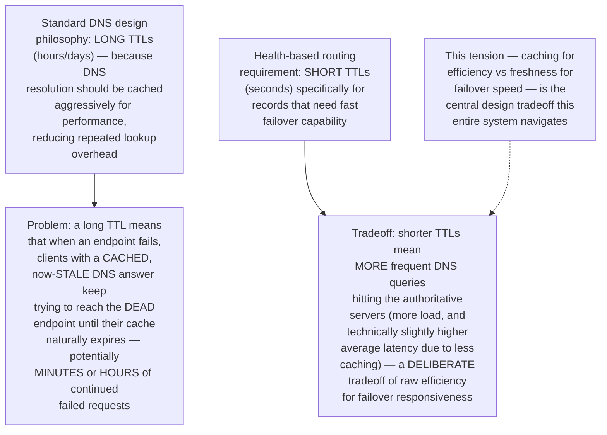
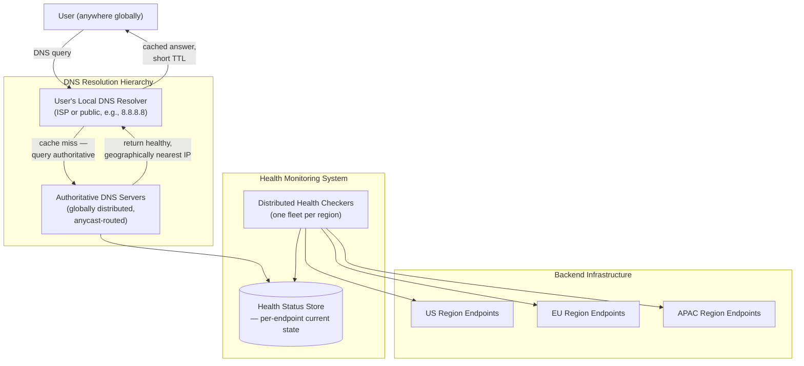
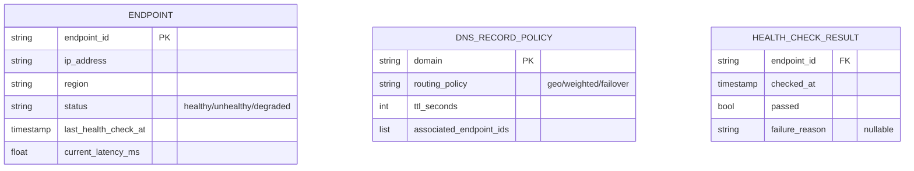
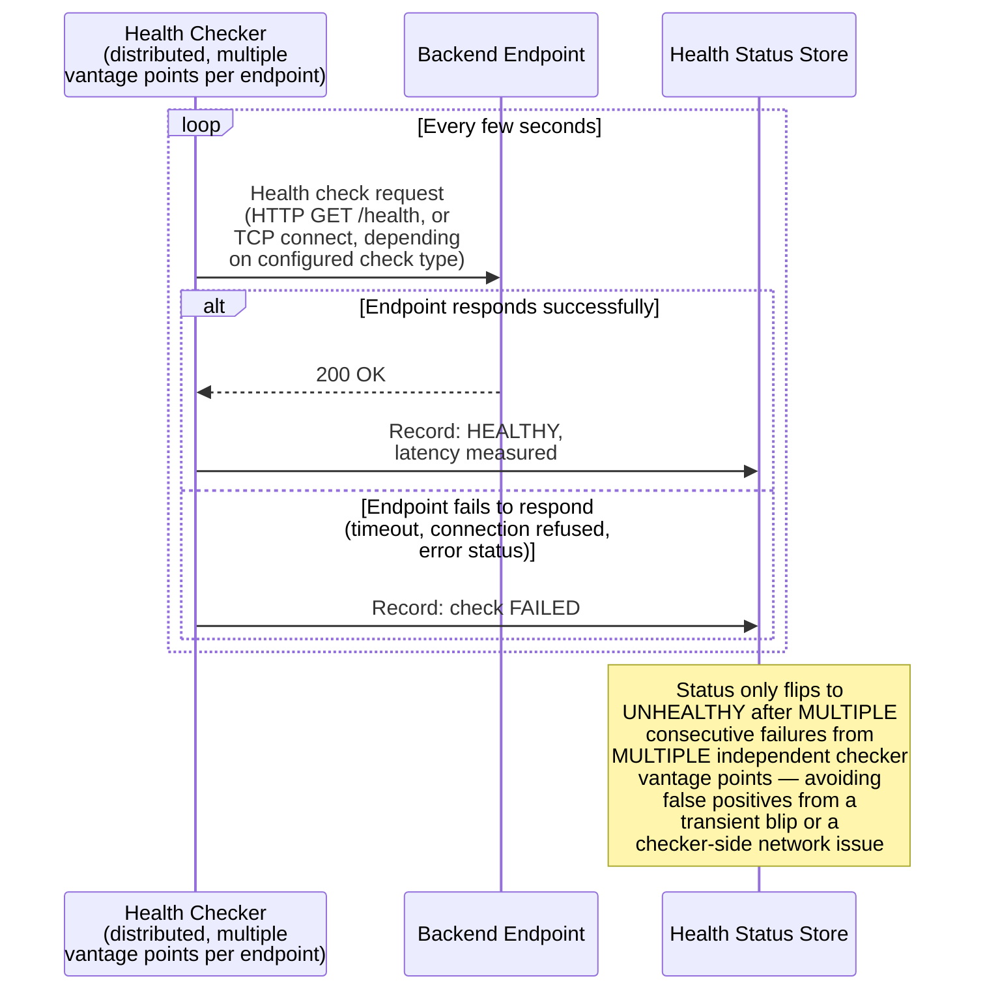
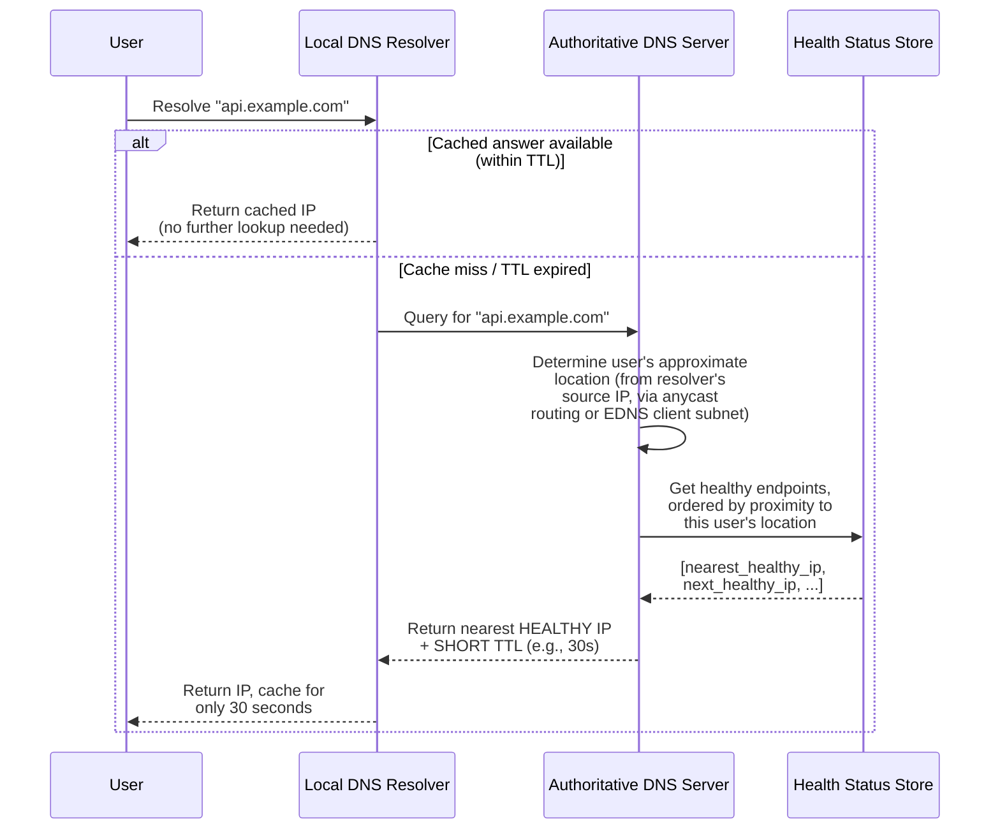
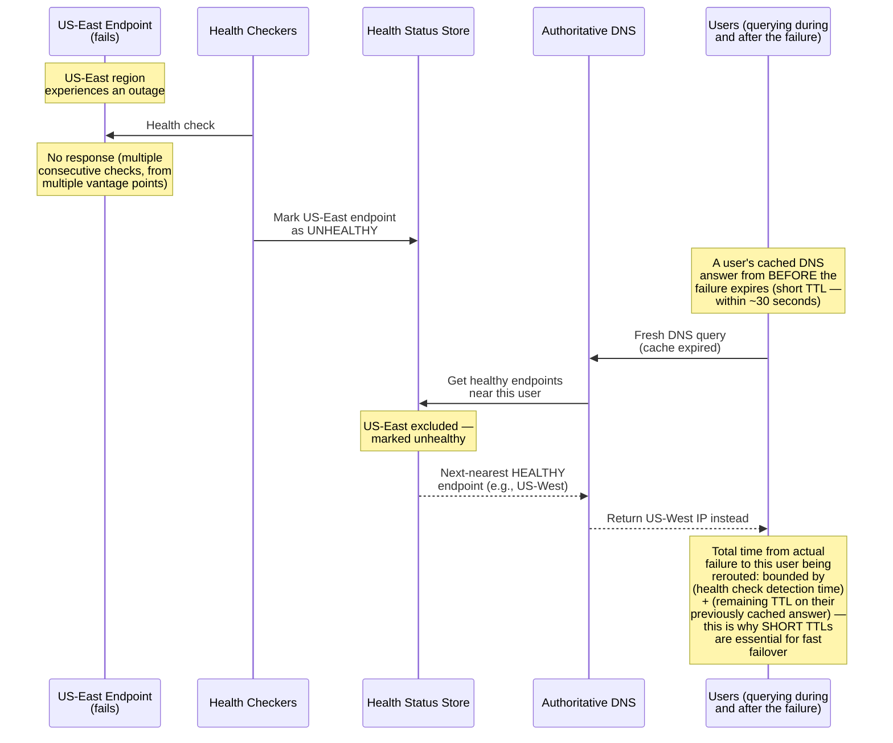
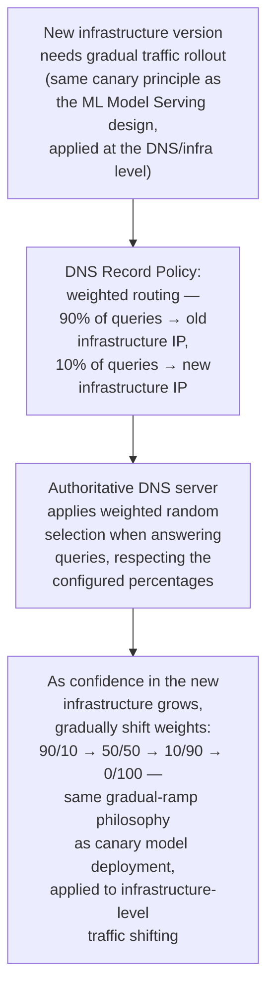
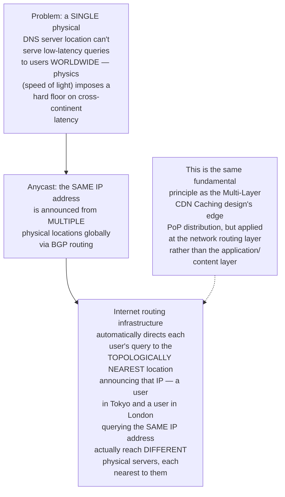
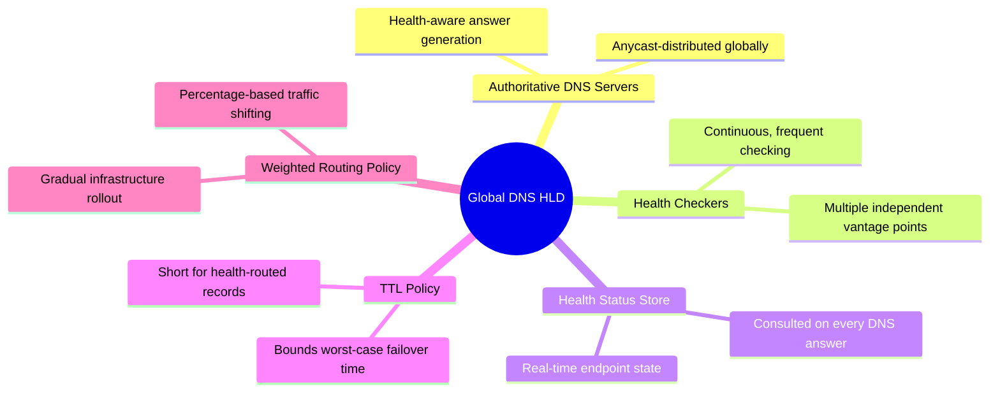

# Design a Global DNS System with Health-Based Routing and Failover — High-Level Design Document

## 1. Requirements

### Functional Requirements
- Resolve domain names to IP addresses, routing users to the geographically/topologically nearest healthy endpoint
- Continuously monitor the health of backend endpoints and automatically stop routing to unhealthy ones
- Support automatic failover — if a region/datacenter goes down, traffic reroutes to healthy alternatives within seconds
- Support weighted/percentage-based traffic distribution (for gradual rollouts, A/B testing at the infrastructure level)

### Non-Functional Requirements
- **Extremely high availability:** DNS is the literal first step of nearly every user interaction — a DNS outage is effectively a total platform outage
- **Low resolution latency:** DNS lookups happen before ANY other part of a request — added latency here delays everything downstream
- **Fast failure detection and rerouting:** Users should be routed away from failing infrastructure within seconds, not minutes
- **Global scale:** Must serve resolution queries from users worldwide with consistently low latency, not just from one region

### Back-of-Envelope Estimation
| Metric | Value |
|---|---|
| DNS queries/sec (large platform) | Hundreds of thousands to millions |
| Health check frequency | Every few seconds per endpoint |
| Failover detection target | < 30 seconds from failure to rerouted traffic |
| DNS TTL (time-to-live) | Seconds to minutes for health-routed records (much shorter than typical static DNS) |

---

## 2. The Core Tension — DNS Caching vs Fast Failover

---

## 3. High-Level Architecture

**Key idea:** The Authoritative DNS Servers don't just serve static records — they consult a continuously-updated Health Status Store before answering EVERY query, meaning the IP address returned reflects REAL-TIME infrastructure health, not a fixed configuration. This is fundamentally different from traditional DNS, which is purely static/configuration-driven.

---

## 4. Data Model

---

## 5. Health Check Flow — Detailed Sequence

**Why multiple independent vantage points matter for health checking:** A single health checker experiencing ITS OWN network issue could incorrectly report a perfectly healthy endpoint as down — using several geographically distributed checkers and requiring agreement across MULTIPLE of them before declaring an endpoint unhealthy protects against this false-positive risk, similar in principle to the majority-quorum thinking in the Network Partition Detection design.

---

## 6. DNS Query Resolution Flow — Detailed Sequence

---

## 7. Automatic Failover Flow — Detailed Sequence

**Why the short TTL is the critical enabler of fast failover, not just the health checking itself:** Even with instant health detection, a user holding a cached answer with a LONG TTL won't make a new query until that cache expires — they'll keep trying the dead endpoint regardless of how quickly the health system detected the failure. The short TTL is what bounds the WORST CASE time any given user remains misdirected after a failure.

---

## 8. Weighted Traffic Distribution (Gradual Rollouts)

---

## 9. Anycast Routing for Global Low-Latency Resolution

---

## 10. Component Responsibilities Summary

---

## 11. Key Design Decisions & Tradeoffs

| Decision | Choice | Why |
|---|---|---|
| TTL strategy | Short TTLs (seconds) for health-routed records | Directly bounds the worst-case time any user remains misdirected to a failed endpoint after failure — the single most important lever for fast failover |
| Health check consensus | Multiple independent vantage points, requiring agreement | Prevents a single checker's own network issue from falsely marking a healthy endpoint as down |
| Global distribution | Anycast routing | The only mechanism providing consistently low-latency DNS resolution to users worldwide, given the hard physical constraint of speed-of-light latency |
| Traffic distribution | Weighted routing support | Enables gradual, safe infrastructure rollouts at the DNS level, mirroring canary deployment principles from application-level rollouts |
| Health-answer coupling | Every DNS answer consults real-time health status | Transforms DNS from a static configuration lookup into a dynamic, infrastructure-aware routing decision |

---

## 12. Bottlenecks & Scaling Considerations

- **Short TTL vs query load tradeoff** — shorter TTLs enable faster failover but directly increase query volume hitting authoritative servers (since clients cache for less time); this requires the authoritative DNS infrastructure itself to be provisioned for meaningfully higher query throughput than a traditional long-TTL setup would require.
- **Health check overhead at scale** — checking every endpoint from every vantage point at a rapid cadence (every few seconds) generates significant aggregate health-check traffic as endpoint count grows; needs careful scaling of the checker fleet independent of, but proportional to, backend infrastructure growth.
- **DNS resolver caching outside your control** — while the authoritative server controls the TTL it ADVERTISES, some intermediate resolvers or client-side caches don't always perfectly respect short TTLs (occasionally over-caching for operational reasons on their end) — this is a real-world limitation of the DNS protocol's trust model that no amount of authoritative-server design can fully eliminate.
- **Health Status Store as the new critical dependency** — since every single DNS answer now depends on this store's current state, its availability and latency directly bound the entire DNS system's — and therefore the whole platform's — availability; this deserves the same critical-path treatment as similar central-dependency stores in other designs (feature stores, session stores, idempotency stores).
- **Split-horizon complexity for enterprise/multi-network scenarios** — some deployments need different DNS answers depending on WHERE the query originates from beyond simple geographic proximity (e.g., internal corporate network vs public internet) — this adds policy complexity beyond the pure health/geo-routing model described here.
- **False failover from health-check blind spots** — a health check verifying "can I reach this endpoint" doesn't necessarily verify "can actual USERS successfully complete their real workflows against this endpoint" — sophisticated systems sometimes need application-level synthetic transaction monitoring, not just basic connectivity checks, to catch subtler classes of degradation that a simple health check would miss.
- **DNSSEC and security considerations** — a globally-distributed, dynamically-answering DNS system is an attractive attack target (DNS spoofing, cache poisoning); production systems need DNSSEC (cryptographically signed DNS responses) and careful protection of the authoritative infrastructure itself, adding meaningful additional complexity beyond the core health-routing logic covered in this design.
