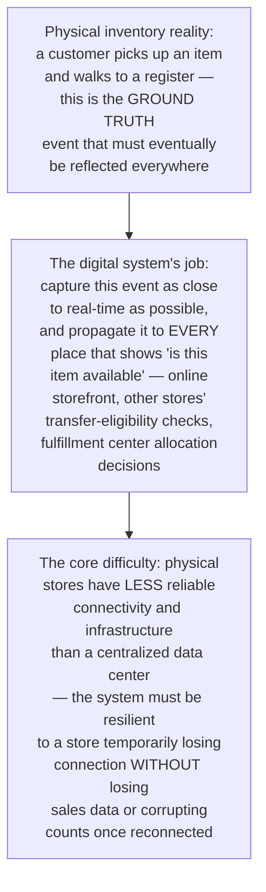
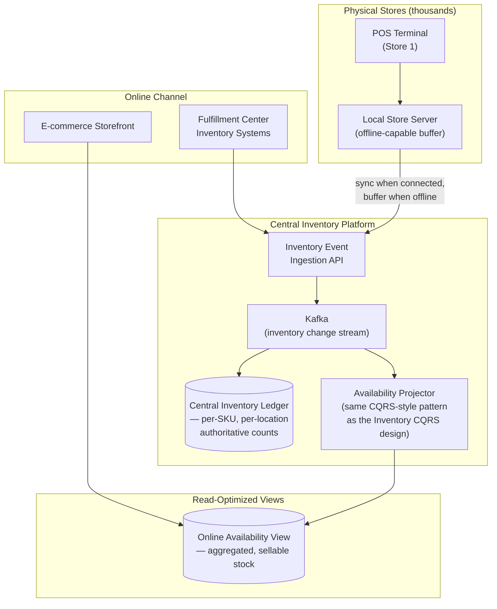
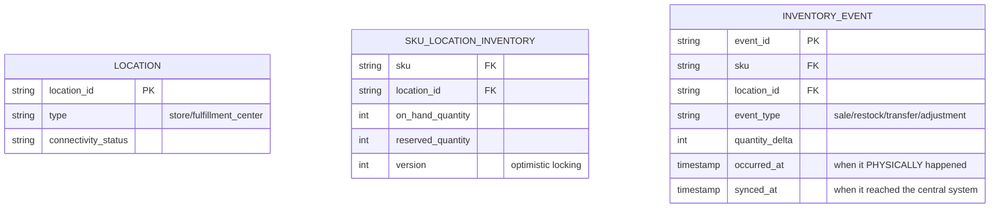
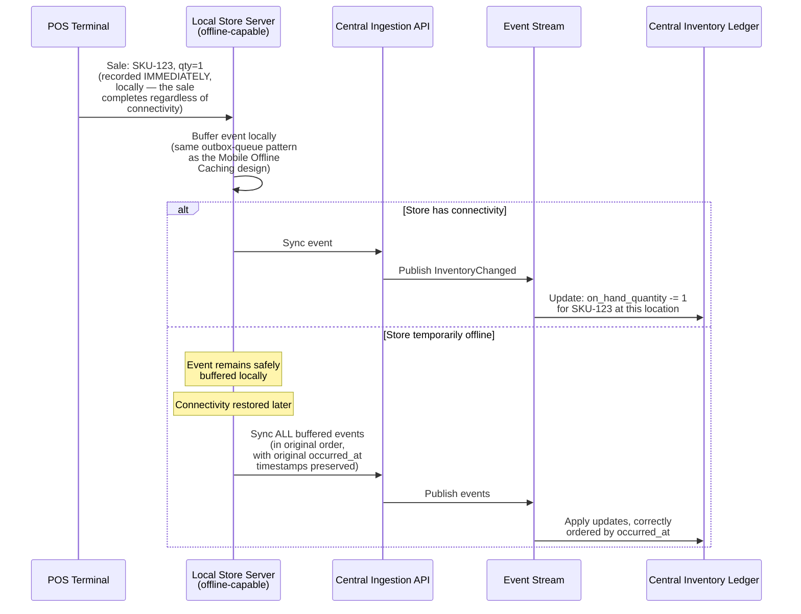
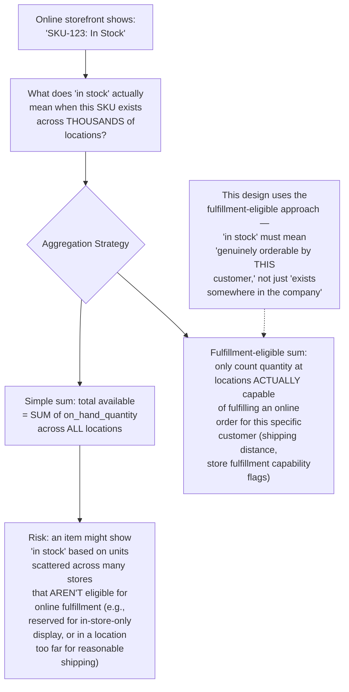
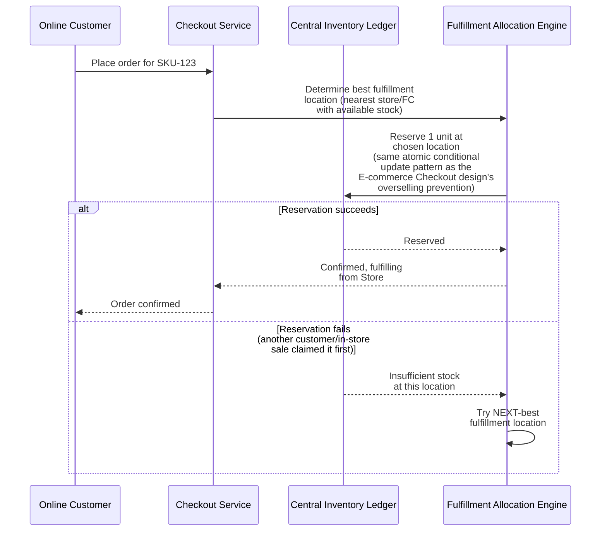
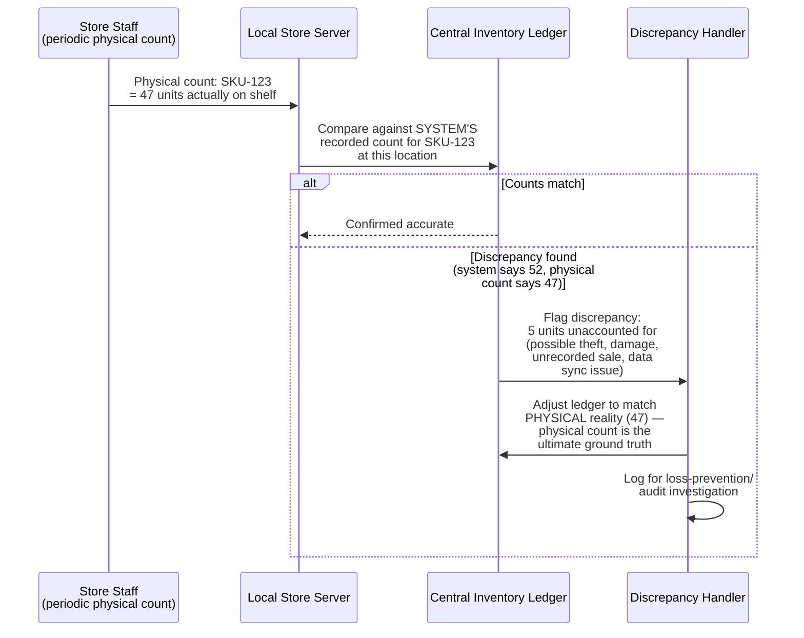
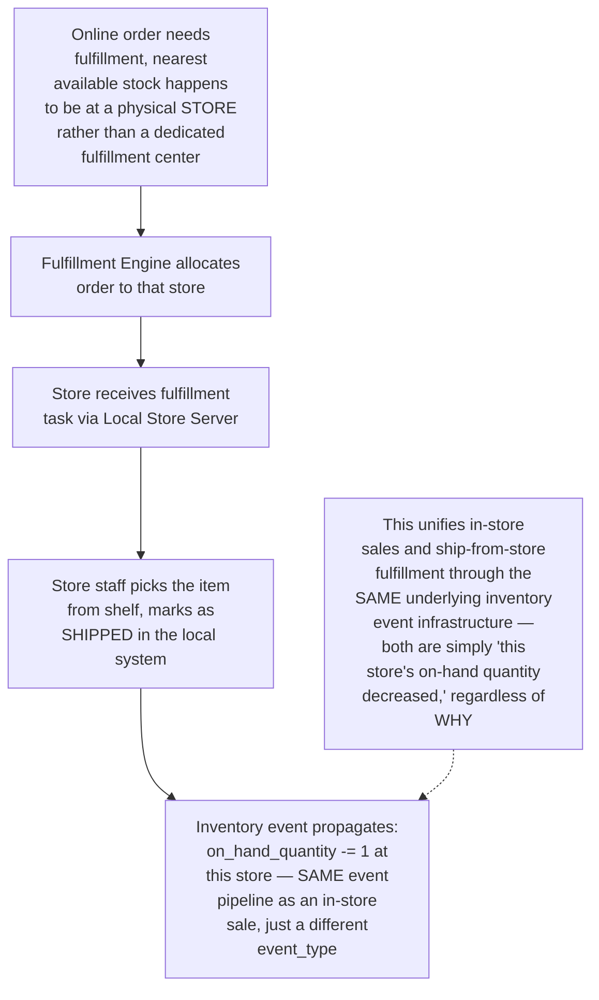
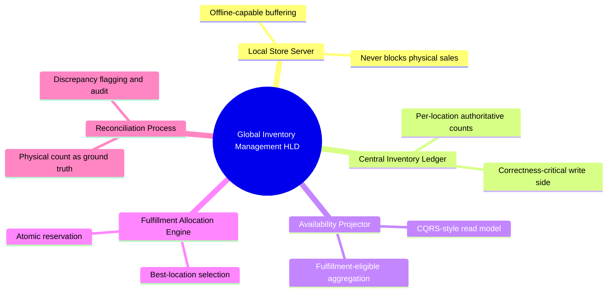

# Design a Global Inventory Management System for a Retailer (Online + In-Store Sync) — High-Level Design Document

## 1. Requirements

### Functional Requirements
- Track inventory levels across thousands of physical stores AND online fulfillment centers simultaneously
- Keep online product availability synchronized with real, physical in-store stock as it changes
- Support "buy online, pick up in store" (BOPIS) and "ship from store" fulfillment models
- Support inventory transfers between locations and periodic physical stock reconciliation

### Non-Functional Requirements
- **Correctness for sellable inventory:** Never show an item as available online if it's genuinely out of stock everywhere — this directly causes cancelled orders and customer trust damage
- **Near-real-time sync between physical and digital:** A sale at a physical register should reflect in online availability within seconds, not hours
- **Resilience to store-level connectivity issues:** Individual store networks can be unreliable; the system must handle this gracefully without losing sales or corrupting inventory counts
- **Scale:** Thousands of stores, millions of SKUs, tracking inventory across all location combinations

### Back-of-Envelope Estimation
| Metric | Value |
|---|---|
| Physical stores | Thousands |
| SKUs tracked | Millions (varying subsets per store) |
| Inventory update events/sec (platform-wide) | Thousands (POS sales, online orders, restocks, transfers) |
| Sync latency target (in-store sale → online reflection) | Seconds |

---

## 2. The Core Challenge — Reconciling Physical Reality With Digital Representation

---

## 3. High-Level Architecture

**Key idea:** This combines two patterns established in earlier designs — the offline-resilient local buffering from the Mobile Offline Caching design (applied to store-level connectivity instead of individual mobile devices) and the CQRS-style write/read separation from the Inventory CQRS design (the central ledger is the correctness-critical write side; the online availability view is the fast, denormalized read side).

---

## 4. Data Model

**Why both `occurred_at` and `synced_at` are tracked separately:** Given that store connectivity can be unreliable, an event might PHYSICALLY happen at 2:00pm but not reach the central system until 2:15pm due to a temporary network issue — distinguishing these two timestamps is essential for correctly ordering events (by when they actually happened) rather than by when they happened to arrive, the same event-time vs processing-time distinction covered in depth in the Stream Processing Fraud Detection design.

---

## 5. Store-Level Sale Event Flow — Detailed Sequence

**Why the physical sale must NEVER be blocked by connectivity:** A customer at a physical register cannot be told "please wait, we're checking with headquarters" — the sale must complete locally and instantly regardless of network status, with synchronization happening asynchronously and resiliently whenever connectivity allows, exactly mirroring why the Mobile Offline Caching design treats local writes as always-available and network sync as a background concern.

---

## 6. Multi-Location Availability Aggregation

---

## 7. Reservation During Checkout (Preventing Overselling Across Locations)

**Why this directly reuses the E-commerce Checkout design's reservation pattern:** The same fundamental overselling-prevention challenge exists here — but with an added dimension: the "stock" being reserved might get claimed not just by another ONLINE customer, but by an in-store customer physically buying the item at that exact moment, making the atomic conditional update pattern even more essential given the additional physical-world race condition.

---

## 8. Handling Physical Inventory Reconciliation (Cycle Counts)

**Why physical count is always treated as ground truth over the system's records:** Despite all the careful event-tracking infrastructure, the actual physical item on a shelf is unambiguous reality — any accumulated small errors (edge cases in sync timing, occasional lost events despite best efforts) must periodically be corrected against this ground truth, which is precisely why regular cycle counts remain an essential operational process even with a well-engineered digital tracking system.

---

## 9. Ship-From-Store Fulfillment Flow

---

## 10. Component Responsibilities Summary

---

## 11. Key Design Decisions & Tradeoffs

| Decision | Choice | Why |
|---|---|---|
| Store connectivity handling | Local offline-capable buffering | Physical sales must never be blocked by network issues; mirrors the Mobile Offline Caching design's core philosophy |
| Availability calculation | Fulfillment-eligible aggregation, not simple total sum | "In stock" must genuinely mean orderable by the specific customer, not just existing somewhere in the company |
| Overselling prevention | Atomic conditional reservation at allocation time | Same E-commerce Checkout design pattern, extended to handle the additional race condition of competing in-store physical sales |
| Event ordering | Physical occurred_at timestamp, not sync arrival time | Correctly reconstructs the true sequence of events despite variable store connectivity delays |
| Reconciliation | Periodic physical count as ground truth override | Accumulated small digital-tracking errors are inevitable at this scale; physical reality is the ultimate correctness anchor |
| Architecture pattern | CQRS-style separation (correctness-critical ledger + fast read view) | Matches the fundamentally different needs of accurate inventory tracking versus fast customer-facing availability display |

---

## 12. Bottlenecks & Scaling Considerations

- **Store server buffer capacity during extended outages** — a store with connectivity issues lasting hours or days accumulates a growing backlog of unsynced events; local buffering needs sufficient capacity and the sync process needs efficient batch-catch-up capability, same fundamental concern as the Mobile Offline Caching design's outbox growth handling.
- **Cross-location race conditions at scale** — with thousands of stores and online customers simultaneously competing for the same limited stock of a popular item, the atomic reservation mechanism must handle very high contention on hot SKUs, connecting to the same hot-key mitigation principles covered in the dedicated Hot Key Mitigation design.
- **Fulfillment allocation optimization complexity** — determining the "best" fulfillment location isn't just about proximity; it involves shipping cost, delivery speed, store fulfillment capacity, and inventory balancing goals (e.g., avoiding depleting a store's own walk-in stock for online orders) — this allocation logic can become a genuinely complex optimization problem at scale, beyond simple nearest-location selection.
- **Sync latency variability across store infrastructure quality** — stores in different regions/countries may have meaningfully different baseline connectivity reliability; the system's monitoring must account for this variance rather than applying uniform sync-latency alerting thresholds across a genuinely heterogeneous store network.
- **Discrepancy investigation workflow scaling** — as flagged discrepancies accumulate across thousands of stores, the loss-prevention/audit investigation process needs its own prioritization and workflow tooling (similar in spirit to the Content Moderation design's review queue) to handle this at scale rather than treating each discrepancy as an isolated manual investigation.
- **Seasonal/promotional demand spikes** — major sales events create both massive transaction volume (stressing the event ingestion pipeline) AND intense competition for limited popular-item stock (stressing the reservation/allocation system) simultaneously — this connects directly to the same launch-readiness and stampede-prevention considerations covered in the Cache Warming design, applied to inventory infrastructure rather than caching infrastructure.
- **Multi-national regulatory and tax complexity** — a genuinely global retailer faces varying regulatory requirements (customs, taxes, region-specific fulfillment rules) that add business logic complexity to the fulfillment allocation engine beyond the pure inventory-tracking challenge covered in this design's core architecture.
