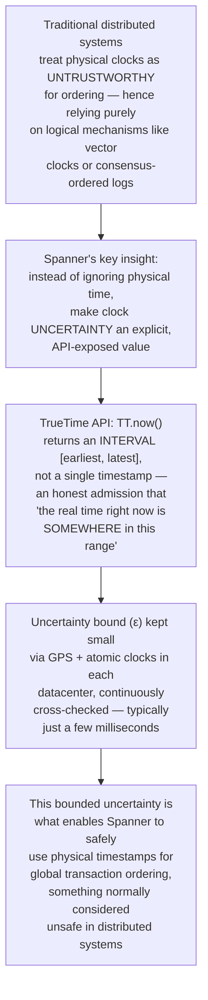
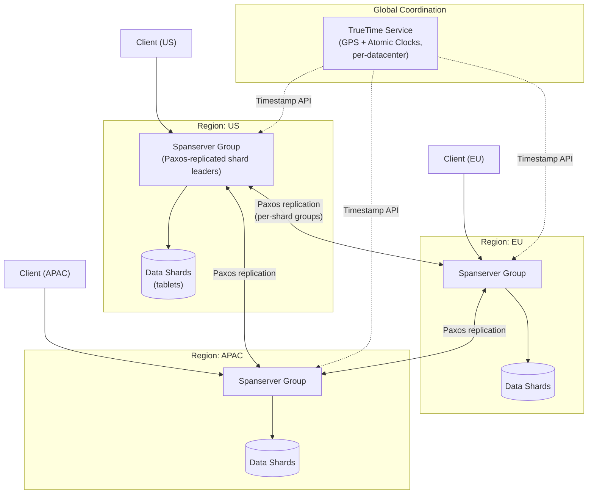
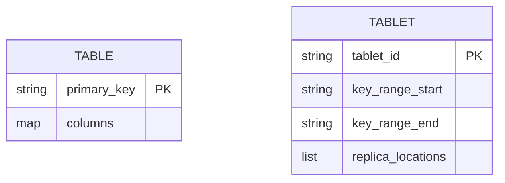
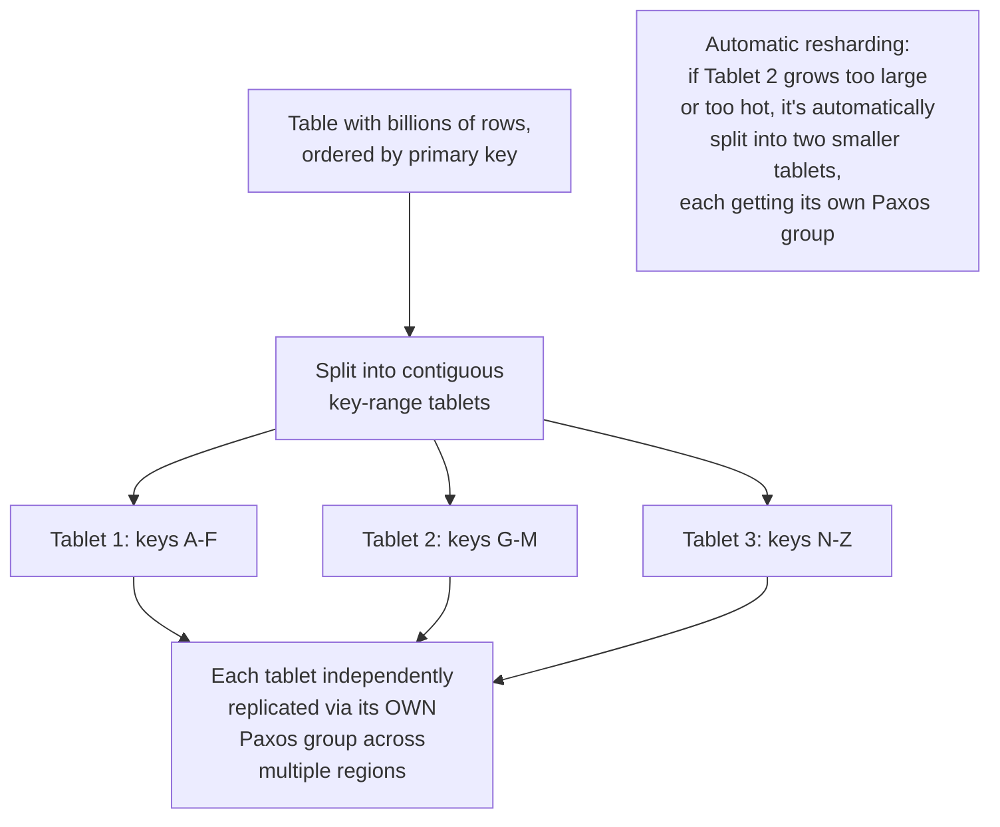
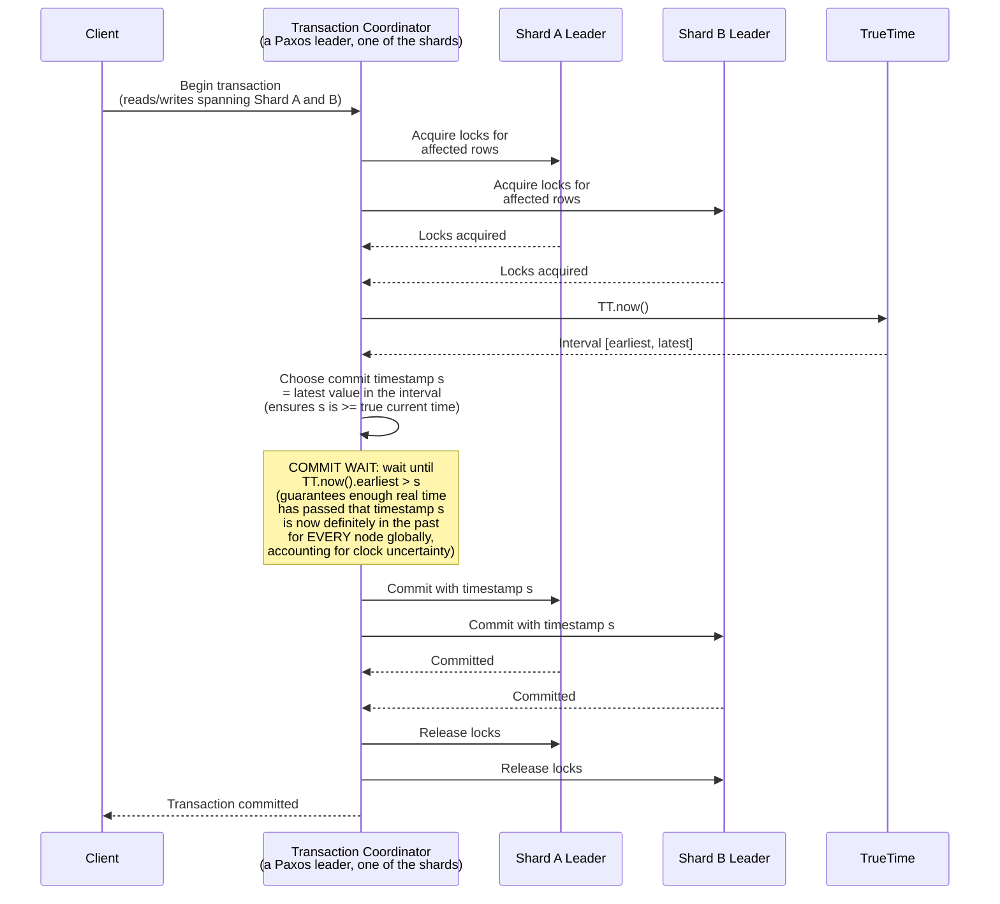
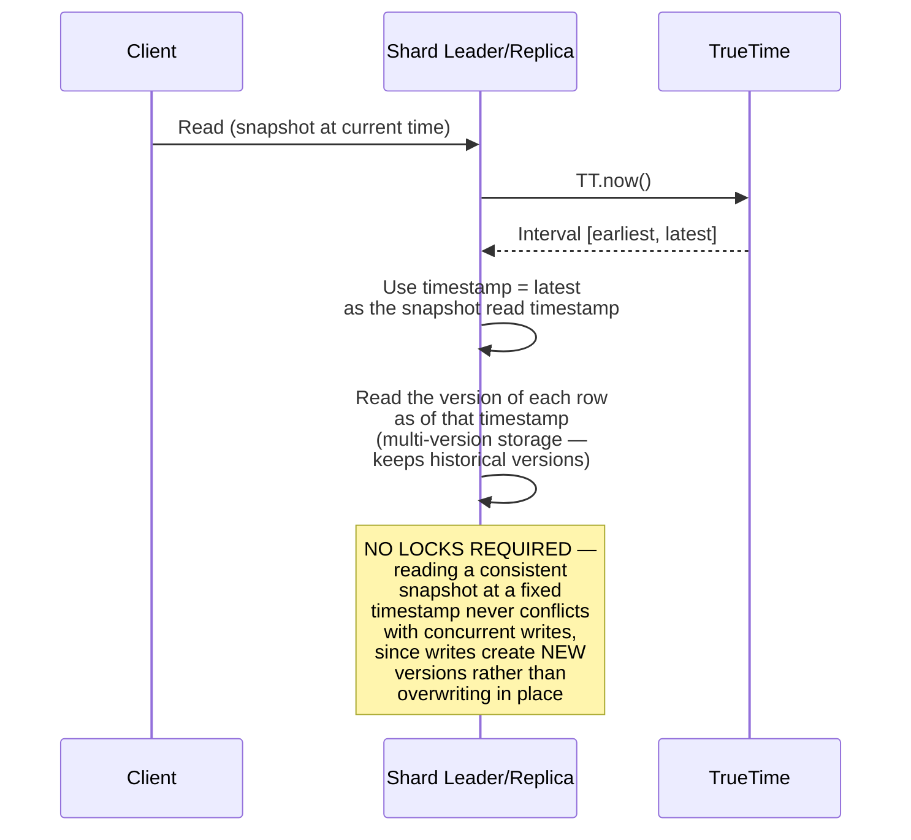
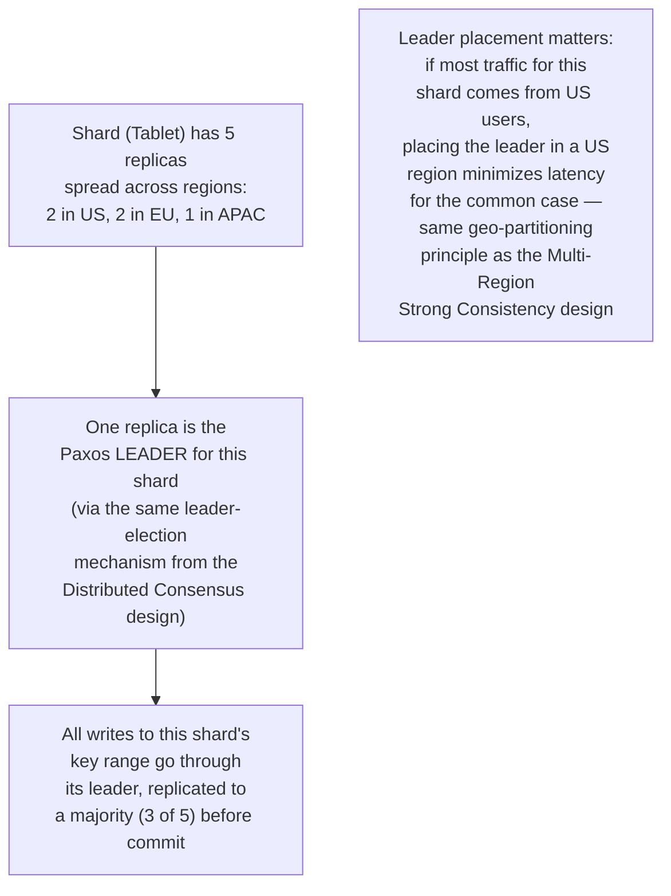
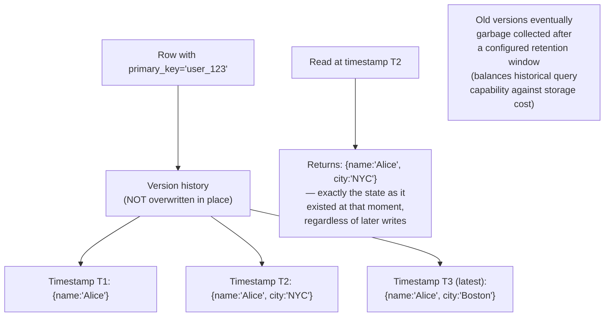
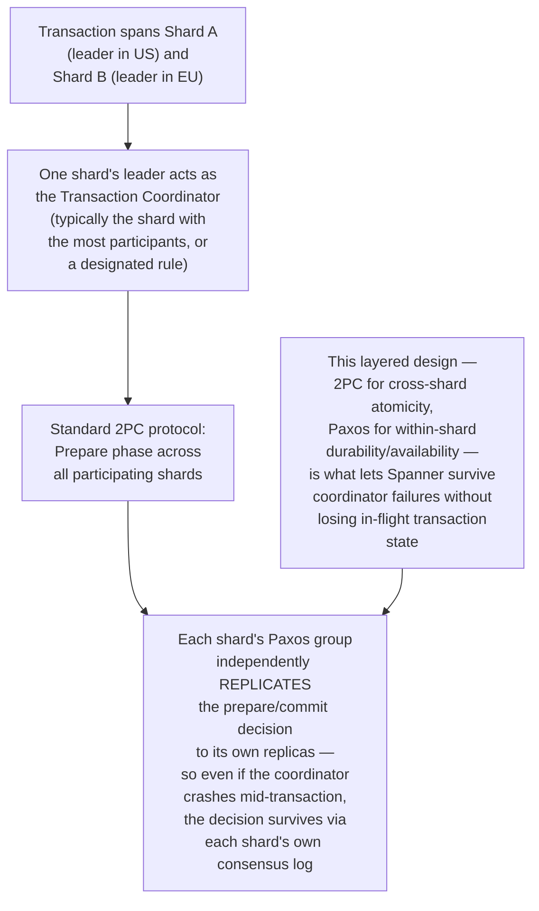
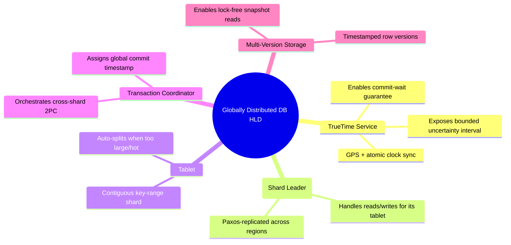

# Design a Globally Distributed Database (Spanner-style) — High-Level Design Document

## 1. Requirements

### Functional Requirements
- Store and serve data across multiple continents/regions
- Support strongly consistent, externally consistent transactions spanning multiple rows/shards, even across regions
- Provide SQL-like query capabilities with strict schema (unlike typical NoSQL eventually-consistent stores)
- Automatic sharding and rebalancing of data across nodes

### Non-Functional Requirements
- **External consistency (the defining property):** If transaction T1 commits before transaction T2 starts (in real, wall-clock time), then T1's effects must be visible to T2 — this is a STRONGER guarantee than plain linearizability, because it holds across the entire globally distributed system, not just a single register
- **Global scale:** Petabytes of data, millions of QPS, spanning many datacenters worldwide
- **High availability:** Survives datacenter and regional failures via synchronous replication
- **Horizontal scalability:** Both storage and throughput must scale by adding more machines/shards

### Back-of-Envelope Estimation
| Metric | Value |
|---|---|
| Regions | 5+ globally distributed |
| Replicas per shard | 3-5 (spread across regions/zones) |
| Clock uncertainty bound (TrueTime-style) | Single-digit milliseconds |
| Cross-region commit latency | Tens to low hundreds of ms, bounded by network + clock uncertainty wait |
| Read latency (local, snapshot) | Single-digit ms |

---

## 2. The Core Innovation — TrueTime (Bounded Clock Uncertainty)

---

## 3. High-Level Architecture

**Key idea:** Data is broken into shards (Spanner calls them "tablets"), each replicated via its own Paxos group spanning multiple regions. Every read/write transaction gets a globally meaningful timestamp derived from TrueTime, which is what allows the entire globally-distributed system — not just one shard — to maintain a single, consistent, real-time-respecting order of all transactions.

---

## 4. Data Model & Sharding

---

## 5. Read-Write Transaction Flow — Detailed Sequence

**Why "Commit Wait" is the critical, unique step:** This deliberate pause — waiting out the clock uncertainty window before acknowledging the commit — is precisely what guarantees external consistency. It ensures that by the time any client can possibly learn the transaction committed, that transaction's timestamp is guaranteed to be in the past everywhere in the system, so any subsequent transaction (anywhere globally) will be assigned a strictly later timestamp. This small latency cost (roughly the clock uncertainty bound, typically a few milliseconds) buys a very strong global ordering guarantee.

---

## 6. Snapshot Read Flow (Lock-Free Reads at a Timestamp)

**Why lock-free reads matter for scale:** Because the underlying storage is multi-versioned (every write creates a new timestamped version rather than overwriting), reads at a specific timestamp never need to block on or coordinate with concurrent writes — this is what allows Spanner to serve enormous read volumes without read-side lock contention, while still guaranteeing a perfectly consistent snapshot view.

---

## 7. Paxos Replication Within a Shard

---

## 8. Multi-Version Storage Layer

---

## 9. Cross-Shard Transaction Coordination (Two-Phase Commit + Paxos)

---

## 10. Component Responsibilities Summary

---

## 11. Key Design Decisions & Tradeoffs

| Decision | Choice | Why |
|---|---|---|
| Clock model | TrueTime — bounded uncertainty interval, not a trusted single value | Enables safe use of physical timestamps for global ordering, something normally avoided in distributed systems due to clock skew risk |
| Consistency guarantee | External consistency (stronger than plain linearizability) | Real-world ordering (if T1 commits before T2 starts in wall-clock time) is preserved globally, not just per-object |
| Commit protocol | Commit-wait based on clock uncertainty | The deliberate latency cost of waiting out the uncertainty window is what makes external consistency achievable at all |
| Replication | Paxos per-shard, spanning regions | Provides both durability (survives node failure) and geographic distribution (survives regional failure) |
| Read model | Multi-version storage, lock-free snapshot reads | Avoids read-write lock contention entirely, critical for sustaining massive global read throughput |
| Sharding | Automatic tablet splitting | Scales horizontally without manual intervention as data grows or hotspots emerge |

---

## 12. Bottlenecks & Scaling Considerations

- **Commit-wait latency is a direct, unavoidable cost** — every read-write transaction pays a latency penalty proportional to the clock uncertainty bound; this is why enormous engineering investment (dedicated GPS/atomic clock hardware) goes into keeping that uncertainty window as small as possible (single-digit milliseconds) — it directly determines write latency floor.
- **Cross-shard transactions are inherently more expensive** — 2PC across shards with different regional leaders incurs multiple cross-region round trips; application/schema design should minimize transactions that need to span shards where possible (similar lesson to the Multi-Region Strong Consistency design).
- **Leader placement affects regional latency asymmetrically** — a shard's leader being in one region means writes from other regions always pay that cross-region cost; careful data locality-aware sharding (placing a shard's leader near where most of its traffic originates) mitigates this.
- **Multi-version storage growth** — retaining historical versions for snapshot reads increases storage requirements; needs a garbage collection policy balancing how far back point-in-time queries should be supported against storage cost.
- **TrueTime infrastructure dependency** — this entire consistency model depends on genuinely reliable, low-uncertainty time infrastructure in every datacenter; this is a substantial operational investment that smaller-scale systems typically can't justify, which is part of why this architecture is associated with hyperscale infrastructure specifically.
- **Read-only transaction optimization** — because snapshot reads don't need locks, read-heavy workloads scale extremely well horizontally by simply adding more replicas to serve reads, decoupled entirely from write throughput scaling (which remains bounded by per-shard Paxos leader capacity).
