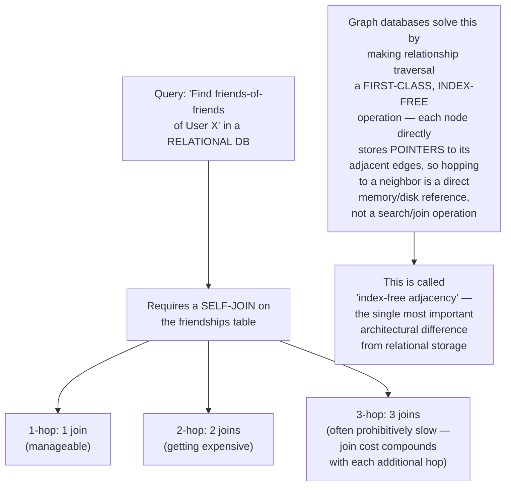
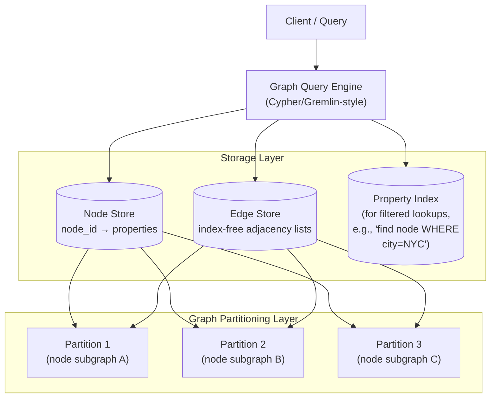
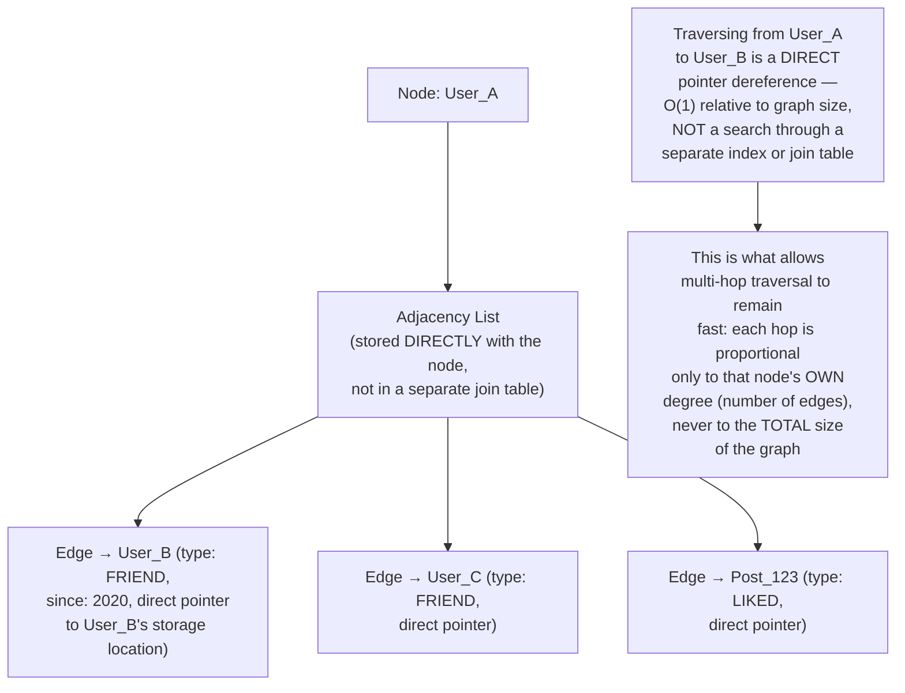
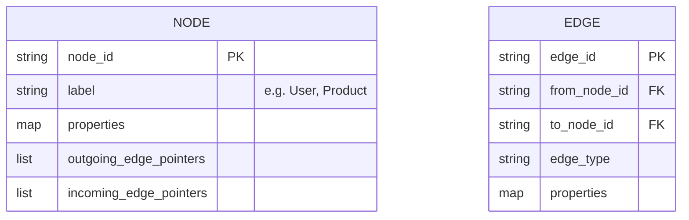
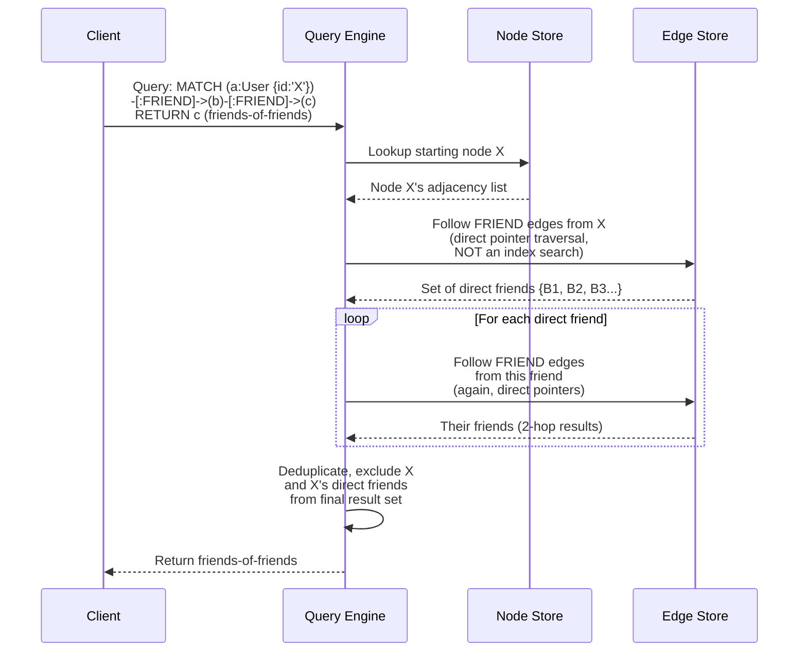
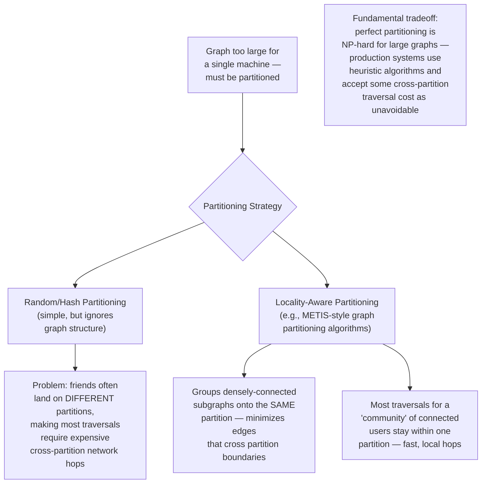
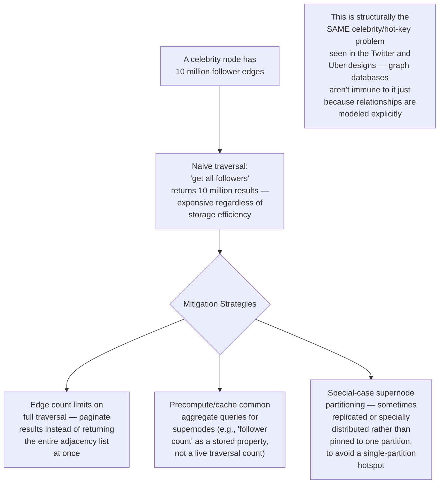
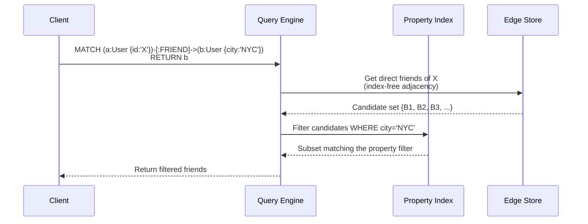
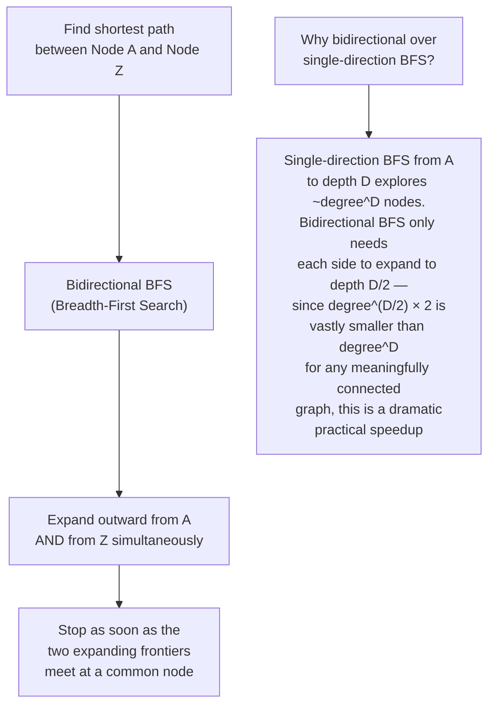
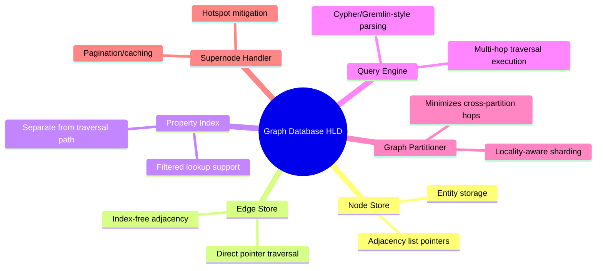

# Design a Graph Database — High-Level Design Document

## 1. Requirements

### Functional Requirements
- Store nodes (entities) and edges (relationships) with associated properties
- Efficient traversal queries: "find all friends-of-friends," "shortest path between A and B"
- Support both shallow (1-2 hop) and deep (multi-hop) graph traversals
- Support property-based filtering during traversal (e.g., "friends who live in NYC")
- Handle highly-connected "supernodes" (e.g., a celebrity with millions of followers) gracefully

### Non-Functional Requirements
- **Traversal performance:** Multi-hop queries must remain fast even as the graph grows — this is the defining challenge, since naive approaches degrade exponentially with hop depth
- **Scale:** Billions of nodes, tens of billions of edges
- **Write throughput:** Support continuous edge creation (e.g., new social connections, transactions)
- **Flexible schema:** Different node/edge types with varying properties, without rigid upfront schema design

### Back-of-Envelope Estimation
| Metric | Value |
|---|---|
| Nodes | ~1B (e.g., users) |
| Edges | ~50B (e.g., social connections, avg 50 edges/node) |
| Traversal queries/sec | ~50,000 |
| Typical query depth | 1-3 hops (deeper queries are rare and expensive) |
| Supernode edge count | Can reach millions (celebrity accounts) |

---

## 2. Why Graph Databases Exist — The Core Problem With Relational Joins

---

## 3. High-Level Architecture

---

## 4. Storage Model — Index-Free Adjacency

---

## 5. Traversal Query Flow — Detailed Sequence

**Why this stays fast at 2-3 hops but gets expensive beyond that:** Each hop's cost is proportional to the AVERAGE DEGREE (number of edges) of nodes at that level — for a typical social graph with ~50 average friends, 2 hops touches ~50×50 = 2,500 nodes, which is very manageable. But this branches multiplicatively with each additional hop — this is precisely why deep multi-hop traversals are rare in practice and often require specialized handling (see Section 7).

---

## 6. Graph Partitioning Strategy

---

## 7. Handling Supernodes (Celebrity Problem, Graph Edition)

---

## 8. Property-Filtered Traversal

*Note that the traversal itself (finding direct friends) uses index-free adjacency, while the property filter (city='NYC') uses a separate property index — these are two distinct access patterns within the same query, each using the storage structure best suited to it.*

---

## 9. Shortest Path Query (Common Graph Algorithm)

---

## 10. Component Responsibilities Summary

---

## 11. Key Design Decisions & Tradeoffs

| Decision | Choice | Why |
|---|---|---|
| Core storage principle | Index-free adjacency (direct pointers between connected nodes) | Makes traversal cost proportional to node degree, not total graph size — the fundamental advantage over relational joins for relationship-heavy queries |
| Partitioning | Locality-aware (community-preserving) over naive hash | Minimizes expensive cross-partition network hops for typical traversal patterns, at the cost of harder (NP-hard, heuristic) partitioning computation |
| Supernode handling | Pagination + precomputed aggregates + special partitioning | The same celebrity/hot-key problem recurs in graph form; naive full-traversal doesn't scale for extremely high-degree nodes |
| Shortest path algorithm | Bidirectional BFS | Dramatically reduces the search space compared to single-direction BFS, exploiting the exponential blowup of naive traversal |
| Property filtering | Separate property index, combined with adjacency traversal | Uses the right access structure for each part of a query — traversal via pointers, filtering via index |
| Query depth | Optimized for 1-3 hops; deeper queries treated as special cases | Reflects the practical reality that traversal cost compounds multiplicatively with hop depth |

---

## 12. Bottlenecks & Scaling Considerations

- **Cross-partition traversal cost** — even with locality-aware partitioning, some fraction of edges will inevitably cross partition boundaries (especially in graphs with genuinely global connectivity, like social networks); these hops require network round trips instead of local pointer dereferences, and are the dominant latency cost for queries that touch them.
- **Supernodes remain a structural challenge regardless of mitigation** — no amount of clever engineering makes "return all 10 million followers" fast in an absolute sense; the real solution is usually re-framing the product requirement (e.g., "show a sample" or "show aggregate stats" rather than the full list).
- **Deep traversal queries are fundamentally expensive** — multi-hop queries beyond 3-4 hops in a densely connected graph explore an enormous number of nodes; production systems often impose hard depth limits or require these queries to run as offline batch jobs (e.g., using a graph processing framework like Pregel/GraphX) rather than live online queries.
- **Write amplification for highly-connected nodes** — adding a new edge means updating the adjacency lists of BOTH connected nodes; for a supernode, even a single new edge touches a node whose adjacency structure may already be under heavy read/write contention.
- **Graph algorithm complexity beyond simple traversal** — more sophisticated queries (community detection, PageRank-style centrality, recommendation via graph embeddings) often can't run efficiently as live online queries at all — these typically run as separate offline batch computations (see the Recommendation System design's collaborative filtering approach) with results periodically materialized back into the graph or a separate serving store.
- **Schema flexibility vs query optimization tension** — the flexible, evolving-schema nature that makes graph databases attractive for complex relationship modeling also makes query planning/optimization harder than in a rigid relational schema, where the query planner has much more upfront structural information to exploit.
