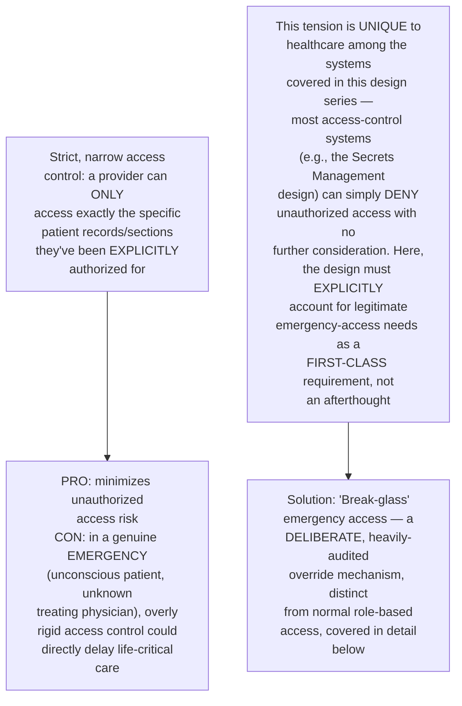
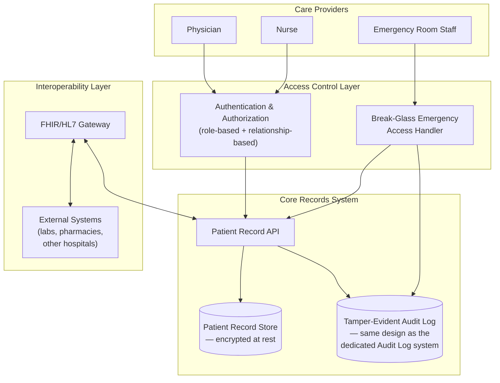
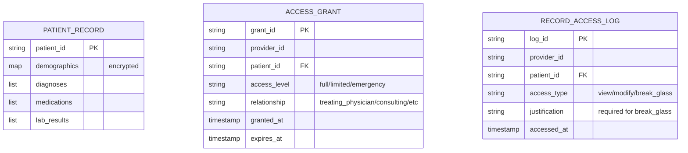
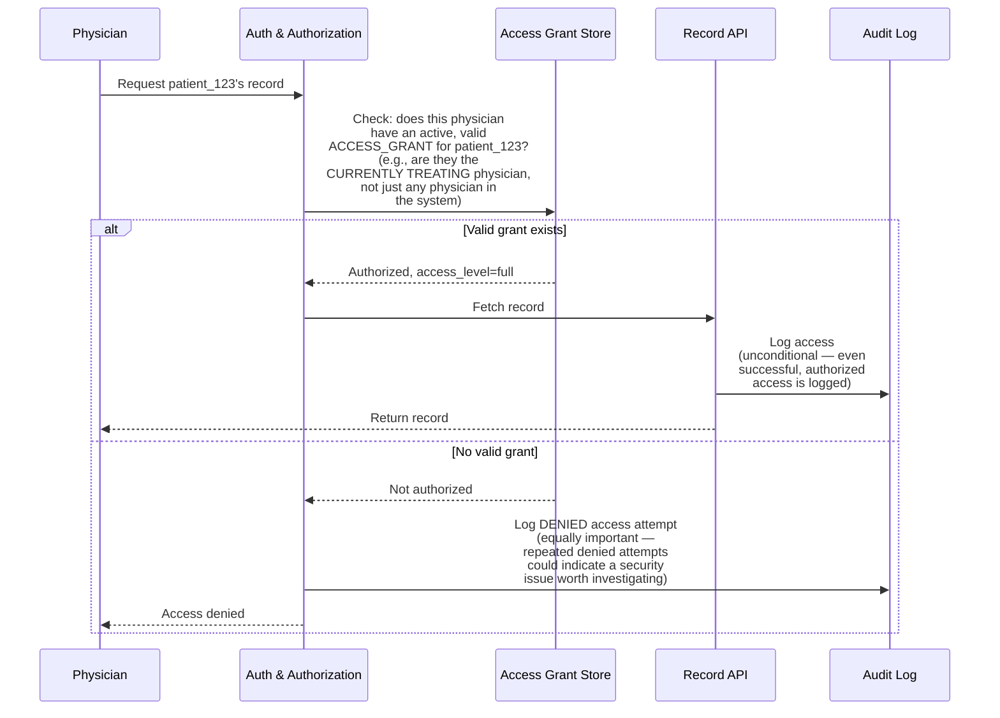
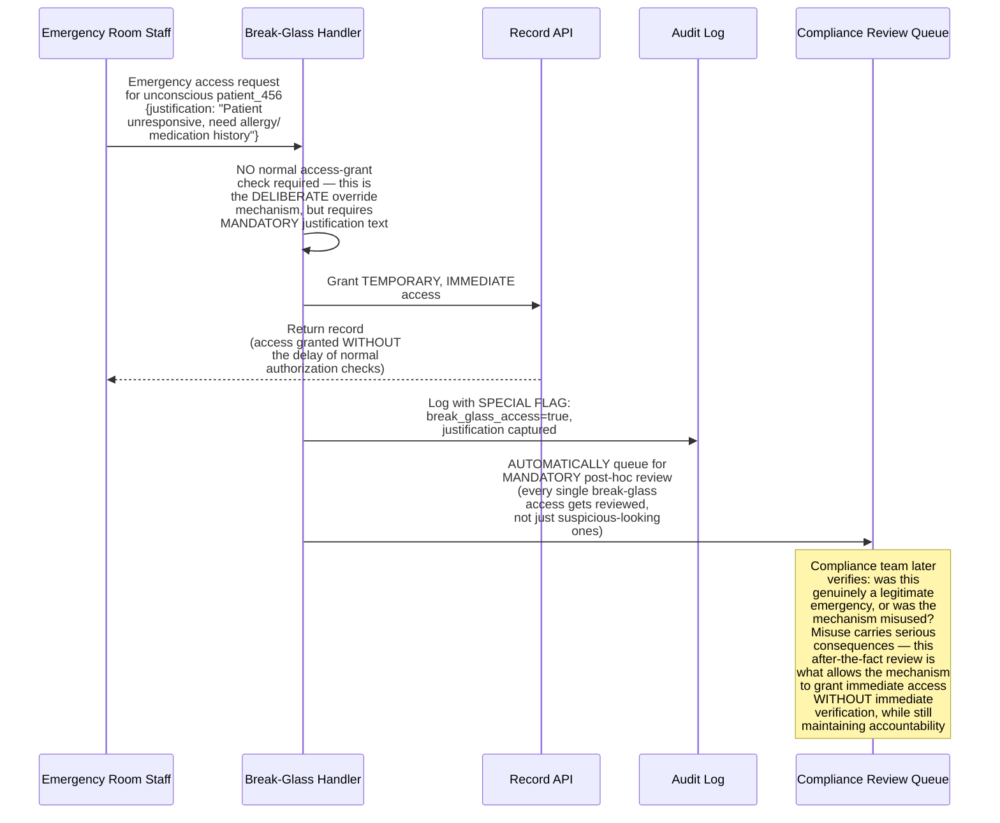
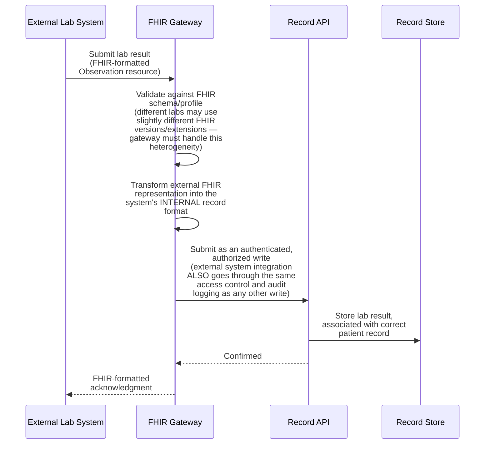
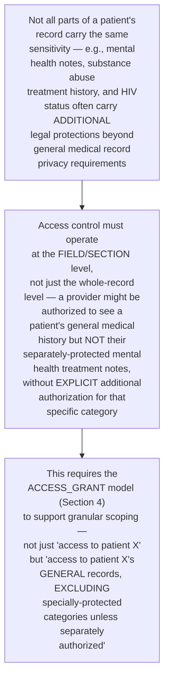
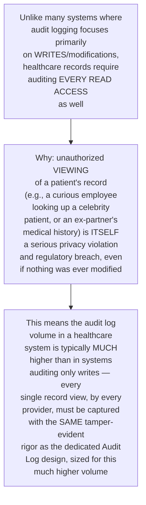
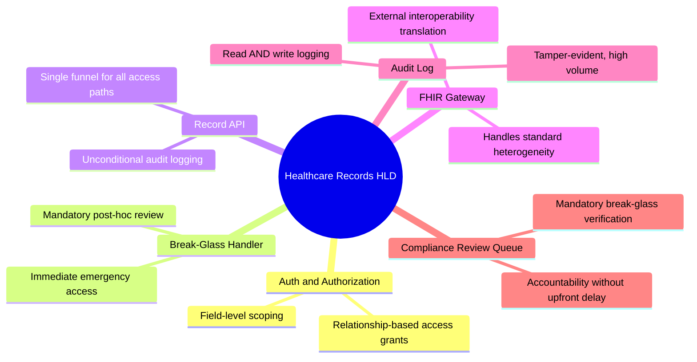

# Design a Healthcare Records System (Strict Access Control + HL7/FHIR Interoperability) — High-Level Design Document

## 1. Requirements

### Functional Requirements
- Store and retrieve patient medical records (diagnoses, medications, lab results, clinical notes)
- Support fine-grained, role-based access control — different care providers need different levels of access to different parts of a record
- Exchange data with EXTERNAL healthcare systems (other hospitals, labs, pharmacies) using standardized interoperability formats (HL7/FHIR)
- Maintain complete audit trails of every single record access, not just modifications

### Non-Functional Requirements
- **Strict privacy and access control (paramount):** Unauthorized access to patient data has severe legal (HIPAA and similar regulations), ethical, and patient-trust consequences
- **Interoperability:** Must correctly exchange data with a highly heterogeneous ecosystem of external systems, each potentially using slightly different standard versions/implementations
- **Availability for clinical use:** In emergency/clinical settings, the system being unavailable can directly impact patient care — this is a genuinely different availability calculus than most business systems
- **Complete auditability:** Every access (not just writes) must be logged, given the regulatory requirement to detect and investigate unauthorized access

### Back-of-Envelope Estimation
| Metric | Value |
|---|---|
| Patient records | Millions, across a large healthcare network |
| Record accesses/sec | Thousands during peak clinical hours |
| External system integrations | Dozens to hundreds (labs, pharmacies, other hospital systems) |
| Audit log retention | Often 7+ years, per regulatory requirement |

---

## 2. The Core Tension — Access Control Granularity vs Clinical Urgency

---

## 3. High-Level Architecture

**Key idea:** EVERY path to patient data — normal role-based access, emergency break-glass access, and external system integration via FHIR — funnels through the same Record API, which unconditionally logs to the tamper-evident audit log (the same core design covered in the dedicated Tamper-Evident Audit Log document) before returning any data. There is no access path that bypasses auditing.

---

## 4. Data Model

---

## 5. Role-Based Access Control Flow — Detailed Sequence

**Why access is tied to an active clinical RELATIONSHIP, not just a general role:** A "physician" role alone is far too broad an access grant — a cardiologist shouldn't have unrestricted access to every patient in the hospital, only those they're actually currently treating or consulting on. Access grants must be tied to genuine, verifiable clinical relationships (treating physician, active consult, care team membership), automatically expiring when that relationship ends (e.g., patient discharge).

---

## 6. Break-Glass Emergency Access Flow — Detailed Sequence

**Why break-glass access trades upfront verification for guaranteed after-the-fact review, rather than eliminating verification entirely:** In a genuine emergency, delaying access for verification could cost a life — but removing accountability entirely would create an obvious security hole. The solution is to grant access IMMEDIATELY (optimizing for the emergency case) while making EVERY such access automatically and mandatorily subject to compliance review afterward (optimizing for accountability) — nobody can quietly use break-glass access without it being reviewed.

---

## 7. FHIR/HL7 Interoperability Flow — Detailed Sequence

**Why the FHIR Gateway exists as a distinct translation layer, not direct external access to the Record API:** Real-world healthcare interoperability involves genuine heterogeneity — different external systems implement FHIR/HL7 standards with subtle variations, different resource profiles, sometimes different protocol versions entirely (HL7 v2 messaging vs FHIR REST). The gateway isolates this external-facing complexity and variability from the internal record system's clean, consistent internal data model.

---

## 8. Field-Level Access Restriction (Sensitive Record Sections)

---

## 9. Comprehensive Access Auditing (Beyond Just Writes)

---

## 10. Component Responsibilities Summary

---

## 11. Key Design Decisions & Tradeoffs

| Decision | Choice | Why |
|---|---|---|
| Access control model | Relationship-based, not just role-based | A broad "physician" role is far too permissive; access must be tied to a genuine, verifiable, time-bounded clinical relationship |
| Emergency access | Break-glass with mandatory post-hoc review | Balances the genuine risk of delayed emergency care against the need for accountability, rather than choosing one at the expense of the other |
| External interoperability | Dedicated FHIR Gateway translation layer | Isolates the internal record system from the genuine heterogeneity of external systems' standard implementations |
| Access granularity | Field/section-level, not whole-record only | Certain data categories (mental health, substance abuse) carry additional legal protection requiring finer-grained control than whole-record access |
| Audit scope | Every read AND every write | Unauthorized viewing alone is a serious privacy violation in healthcare, unlike many systems where only modifications warrant audit-level scrutiny |
| Auditing mechanism | Tamper-evident (same design as dedicated Audit Log system) | Regulatory and legal stakes require the same non-repudiation guarantees established in that dedicated design |

---

## 12. Bottlenecks & Scaling Considerations

- **Audit log volume from comprehensive read-tracking** — logging every single view (not just writes) generates substantially higher audit volume than most systems in this document series; needs the same tiered storage/retention strategy as the general Audit Log and Log Aggregation designs, but sized for this healthcare-specific higher baseline.
- **Break-glass review workload scaling** — as break-glass access is used across a large healthcare network, the mandatory compliance review queue needs adequate staffing/tooling to keep pace, similar to the review-queue scaling concerns in the Content Moderation design — a growing unreviewed backlog undermines the accountability the mechanism depends on.
- **Access grant expiration and relationship tracking accuracy** — the system's access control is only as good as its underlying knowledge of WHO is currently treating WHICH patient; this requires reliable integration with hospital admission/discharge/transfer systems to keep access grants accurately time-bounded, a significant real-world integration challenge beyond the pure access-control logic itself.
- **FHIR version and profile heterogeneity** — different external labs, pharmacies, and hospital systems may implement different FHIR versions or custom extensions/profiles; the gateway's translation logic requires ongoing maintenance as new external partners integrate, each potentially bringing their own implementation quirks.
- **Availability requirements during genuine emergencies** — unlike most systems where "the system was briefly unavailable" is an inconvenience, a records system outage during active emergency care has direct patient-safety implications; this justifies substantially higher investment in redundancy and graceful degradation (e.g., cached recent-access data available even during a partial outage) than typical business-system availability requirements would warrant.
- **Cross-institution identity resolution** — when a patient receives care across MULTIPLE healthcare institutions/systems, correctly linking their records as the SAME person (without incorrectly merging different people, or missing that separate records belong to the same person) is a genuinely hard identity-resolution problem with direct patient-safety consequences if done incorrectly — a significant challenge beyond this design's core access-control and interoperability architecture.
- **Regulatory variation across jurisdictions** — a healthcare system operating across multiple regions/countries faces varying specific regulatory requirements (HIPAA in the US, GDPR-health-data provisions in the EU, and others), meaning the field-level protection categories and consent/access requirements from Section 8 may need to be configurable per jurisdiction rather than a single global policy, connecting to similar regulatory-variation considerations as the GDPR Deletion System design.
