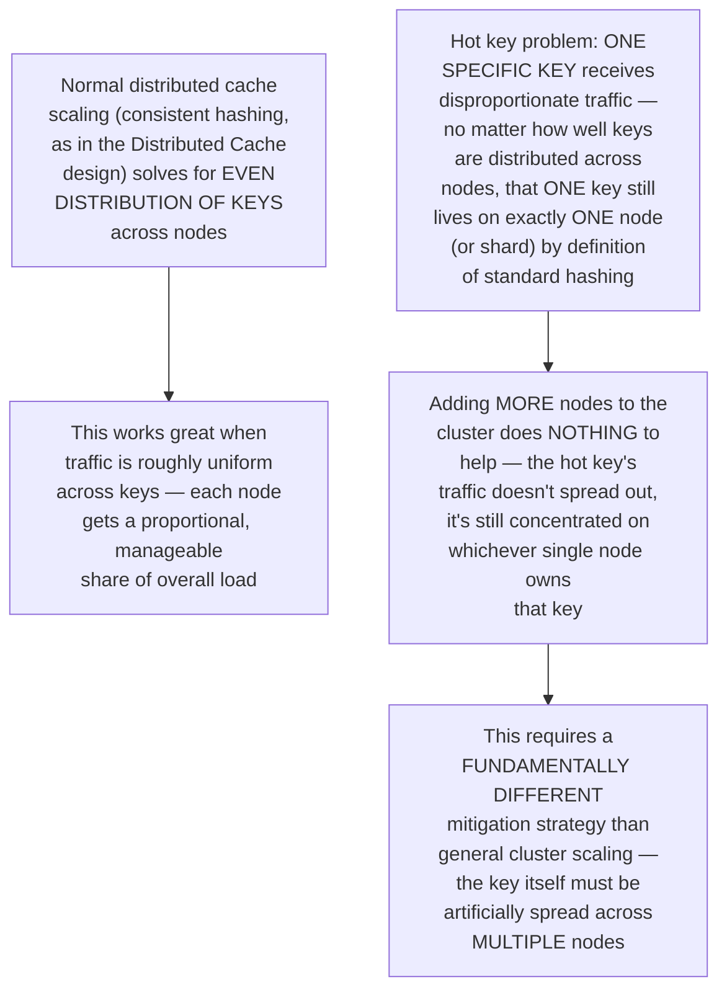
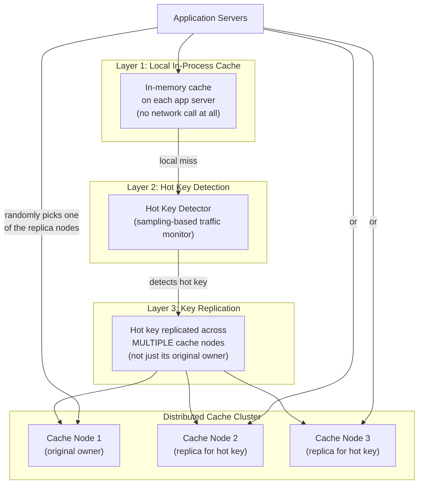
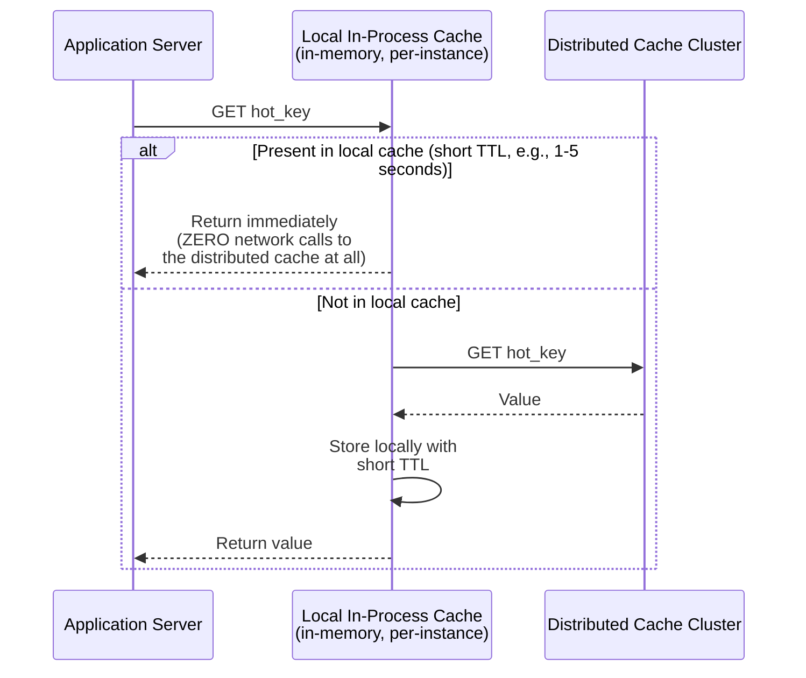
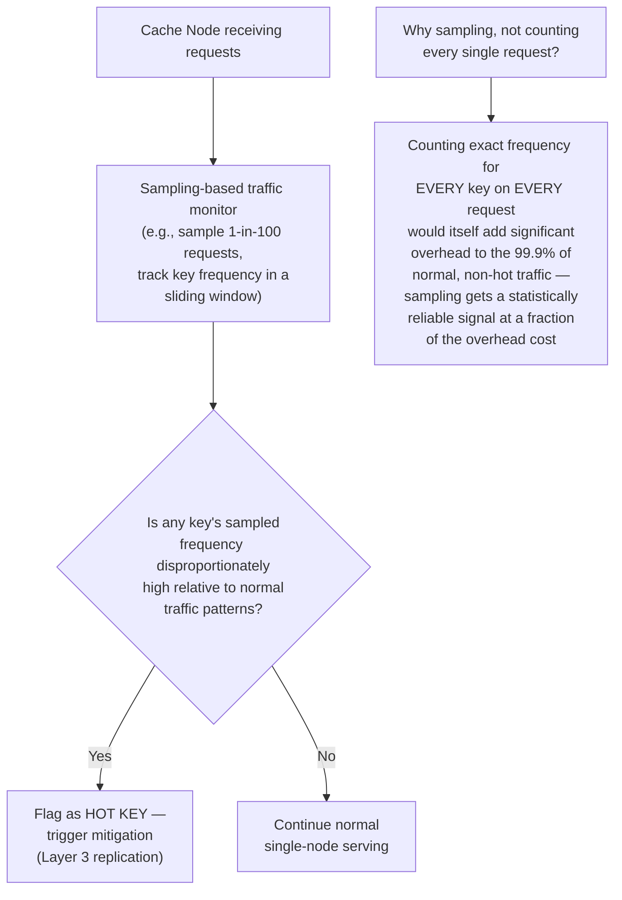
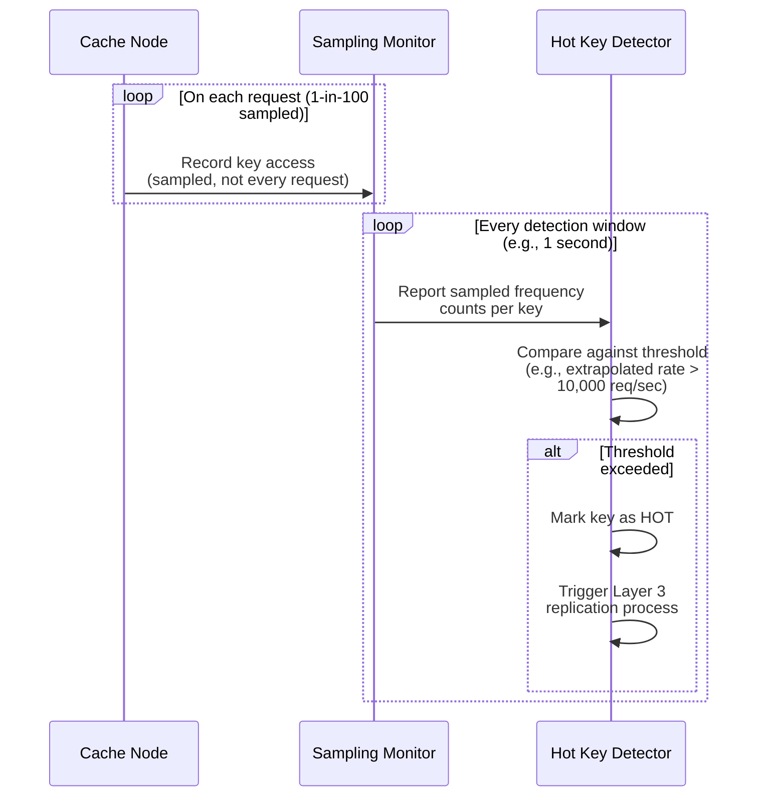
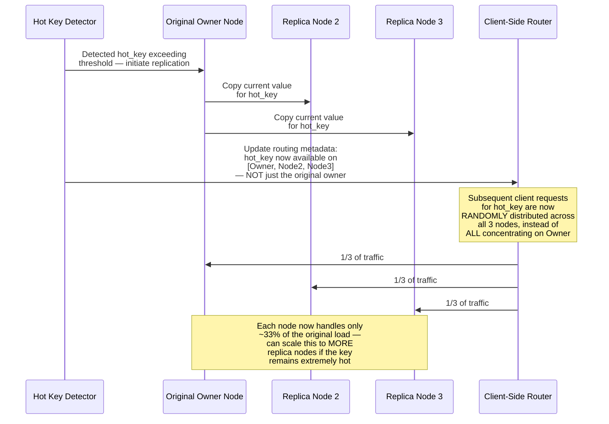
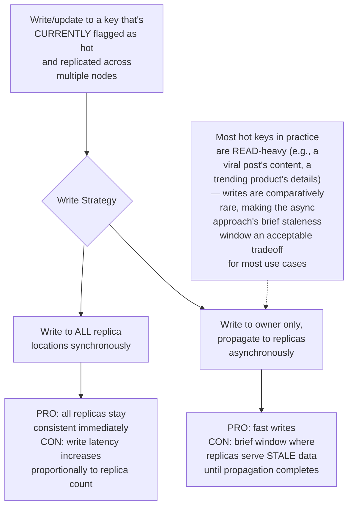
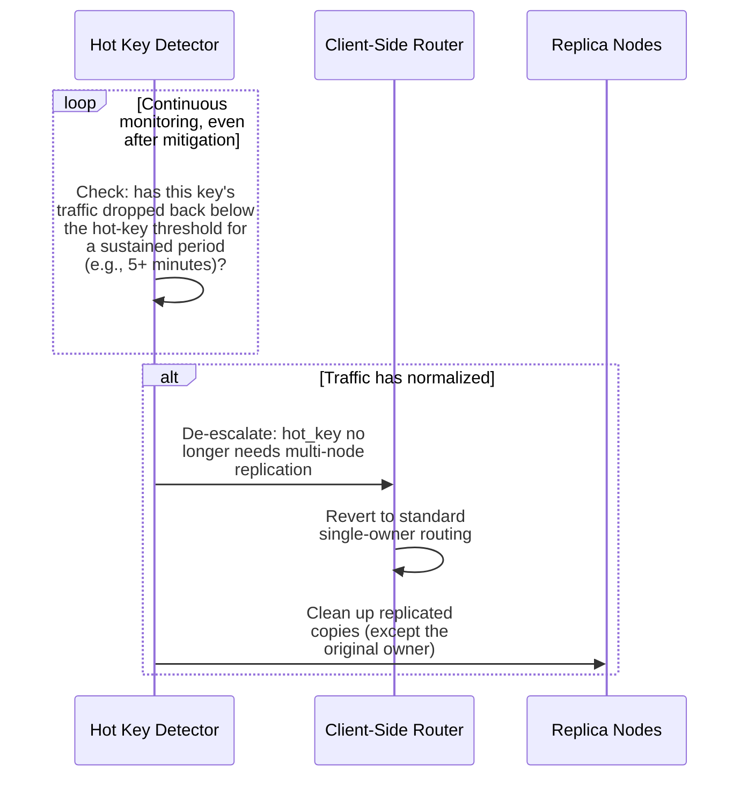
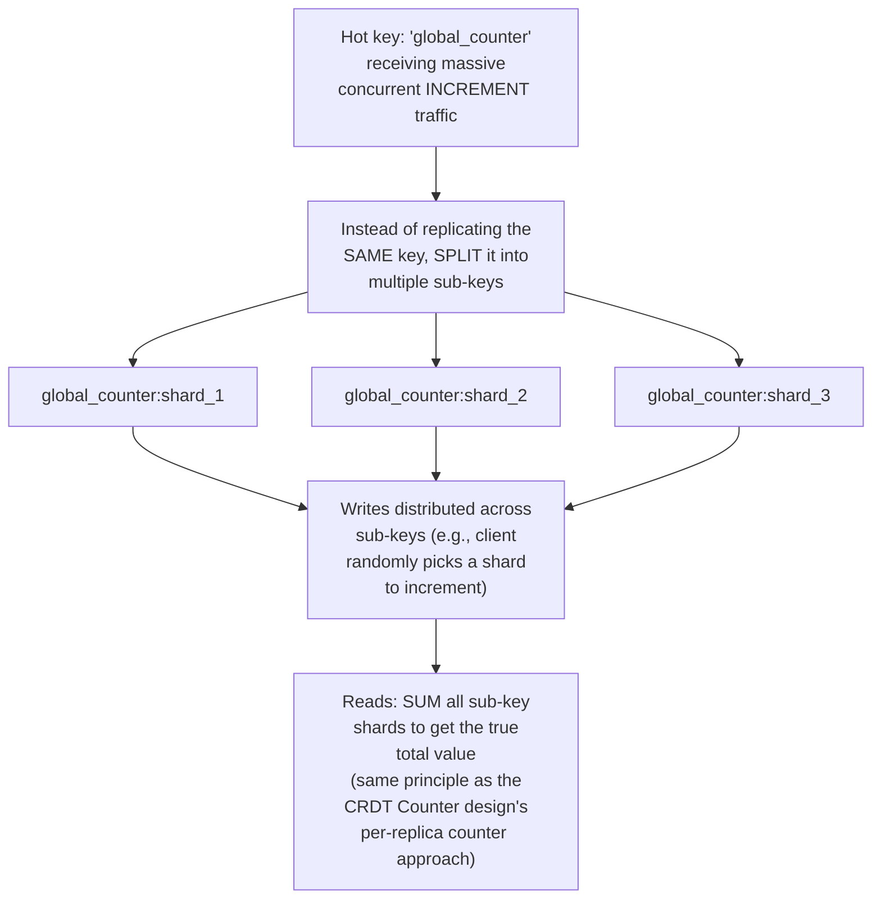
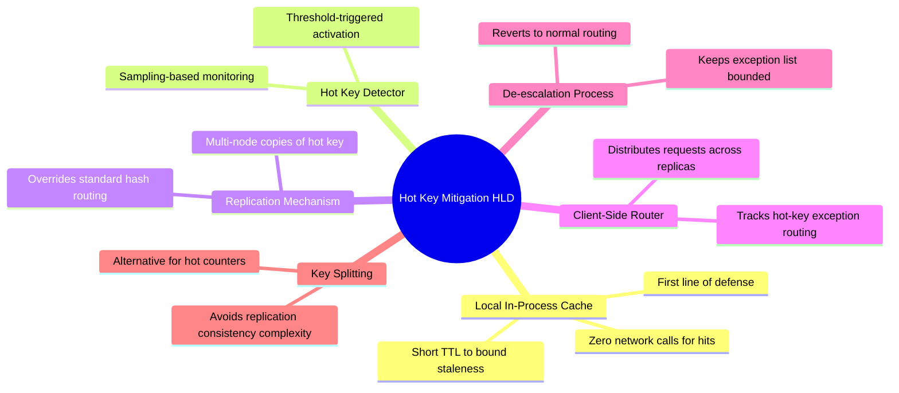

# Design a System to Handle "Hot Key" Problems in a Distributed Cache — High-Level Design Document

## 1. Requirements

### Functional Requirements
- Detect when a specific cache key is receiving disproportionately high traffic relative to others
- Distribute the load for that hot key across multiple cache nodes rather than concentrating it on one
- Maintain correctness (all reads still return the right value) despite the load-distribution mechanism
- Support both organic (gradual) and sudden (viral/flash) hot key emergence

### Non-Functional Requirements
- **Single-node capacity limits:** A single cache node/shard has a hard ceiling on requests/sec it can serve, regardless of overall cluster size
- **Minimal detection lag:** A key going viral should be mitigated within seconds, not minutes, to avoid cascading failure
- **Low overhead in the common case:** The mitigation machinery shouldn't add meaningful cost to the 99.9% of keys that are NOT hot
- **Graceful degradation:** Even under extreme hot-key load, the system should degrade predictably, not fail catastrophically

### Back-of-Envelope Estimation
| Metric | Value |
|---|---|
| Normal key traffic | Hundreds to low thousands of req/sec |
| Hot key traffic (viral event) | 100,000+ req/sec for a SINGLE key |
| Single cache node capacity | ~50,000-100,000 ops/sec typical ceiling |
| Detection target | Within a few seconds of onset |

---

## 2. Why This Is a Fundamentally Different Problem From General Cache Scaling

---

## 3. High-Level Architecture — Layered Defense

**Key idea:** This is a layered defense, not a single mechanism — Layer 1 (local caching) eliminates network calls entirely for the most frequently accessed data, Layer 2 continuously watches for emerging hot keys, and Layer 3 activates only when needed, spreading a detected hot key's load across multiple nodes rather than concentrating it on its single natural owner.

---

## 4. Layer 1 — Local In-Process Caching (First Line of Defense)

**Why even a very short local TTL (1-5 seconds) helps enormously:** If an application server would otherwise make 1,000 requests/sec for the same hot key, a 1-second local cache reduces this to just 1 request/sec hitting the distributed cache from that server — a 1000x reduction, achieved with almost no staleness cost for most use cases. Multiplied across every application server instance, this dramatically reduces the load that ever reaches the distributed cache cluster for hot keys.

---

## 5. Layer 2 — Hot Key Detection

---

## 6. Layer 3 — Hot Key Replication (Active Mitigation)

**Why this requires breaking the normal consistent-hashing rule deliberately:** Under standard consistent hashing, a given key ALWAYS maps to exactly one node (or a fixed replica set for fault tolerance) — this is what makes lookups efficient. Hot key mitigation deliberately violates this for specific flagged keys, trading the simplicity of "one canonical location" for load distribution — the routing layer must now track this exception explicitly rather than relying on pure hash-based routing for these specific keys.

---

## 7. Handling Writes to a Hot (Replicated) Key

---

## 8. De-escalation (Returning a Key to Normal Status)

**Why de-escalation matters:** Permanently replicating every key that was ever briefly hot would cause the mitigation mechanism itself to become a growing source of overhead and complexity over time. Automatically reverting keys to normal single-node handling once their traffic normalizes keeps the system's "exception list" small and proportional to CURRENT hot keys, not an ever-growing historical record.

---

## 9. Alternative/Complementary Mitigation: Key Splitting

*This key-splitting technique is particularly effective for hot counters specifically (as opposed to hot read-mostly content keys), since it avoids the read-after-write consistency complexity of replication — each shard is independently, unambiguously correct, and the true value is simply their sum.*

---

## 10. Component Responsibilities Summary

---

## 11. Key Design Decisions & Tradeoffs

| Decision | Choice | Why |
|---|---|---|
| First-line defense | Local in-process caching with short TTL | Eliminates the vast majority of hot-key network traffic before it ever reaches the distributed cache cluster, at near-zero staleness cost |
| Detection mechanism | Sampling-based monitoring | Provides a statistically reliable hot-key signal without adding meaningful overhead to the overwhelming majority of normal traffic |
| Core mitigation | Deliberate multi-node replication for flagged keys only | Directly addresses the root cause — a single key's traffic being concentrated on one node — which adding more cluster nodes alone cannot fix |
| Write handling for hot keys | Asynchronous propagation (given read-heavy nature of most hot keys) | Optimizes for the common case (read-heavy hot content) while accepting a brief, usually-acceptable staleness window |
| De-escalation | Automatic reversion after sustained traffic normalization | Keeps the mitigation mechanism's overhead proportional to CURRENT hot keys, not an ever-growing historical list |
| Counter-specific alternative | Key splitting rather than replication | Avoids replication's consistency complexity entirely for the specific, common case of hot increment-heavy counters |

---

## 12. Bottlenecks & Scaling Considerations

- **Detection lag vs false-positive tradeoff** — a shorter detection window catches emerging hot keys faster but risks false-positive flagging from normal traffic bursts; a longer window is more accurate but delays mitigation during exactly the critical early moments of a viral spike — this requires careful tuning based on the platform's actual traffic volatility patterns.
- **Replication factor scaling** — for an EXTREMELY hot key (e.g., a global celebrity event), even 3-5 replica nodes might not be sufficient; the system should support dynamically increasing replica count in response to sustained extreme load, not just a fixed replication factor.
- **Router metadata consistency** — the client-side router's knowledge of "which keys are currently hot and where their replicas live" must itself be kept consistent and low-latency across the entire application server fleet — this metadata distribution is itself a smaller-scale version of the broader cache-coherence problem.
- **Cross-region hot keys** — for a globally distributed cache (connecting to the Multi-Layer CDN design), a globally viral key needs replication awareness across regions, not just within a single cluster — the same principles apply but with added cross-region latency considerations for replica synchronization.
- **Cascading hot keys** — sometimes mitigating one hot key (e.g., successfully spreading load for a viral product's main record) reveals a SECOND hot key underneath (e.g., its associated inventory count now becomes the bottleneck, since ALL the redirected traffic still needs that shared piece of data) — mitigation may need to be applied iteratively, not just once.
- **Testing hot key scenarios proactively** — because hot keys are often triggered by unpredictable external events (viral social media moments, news events), the detection and mitigation machinery benefits enormously from deliberate load testing that simulates sudden extreme concentration on a single key, rather than only being validated reactively after a real incident occurs.
