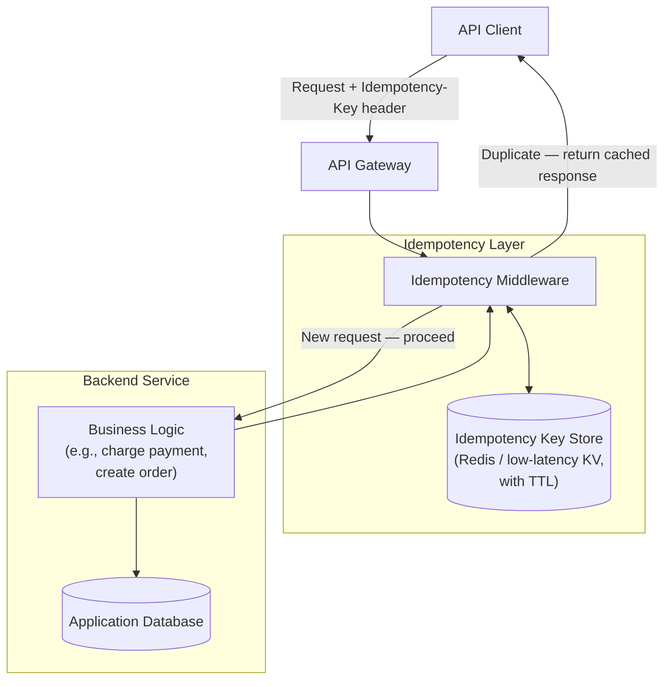
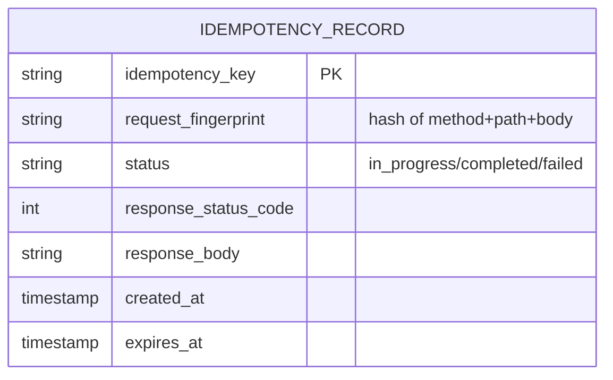
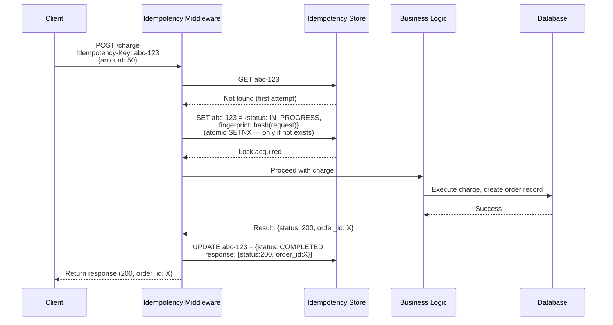
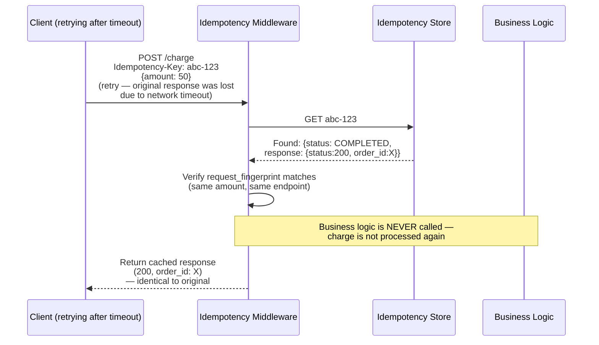
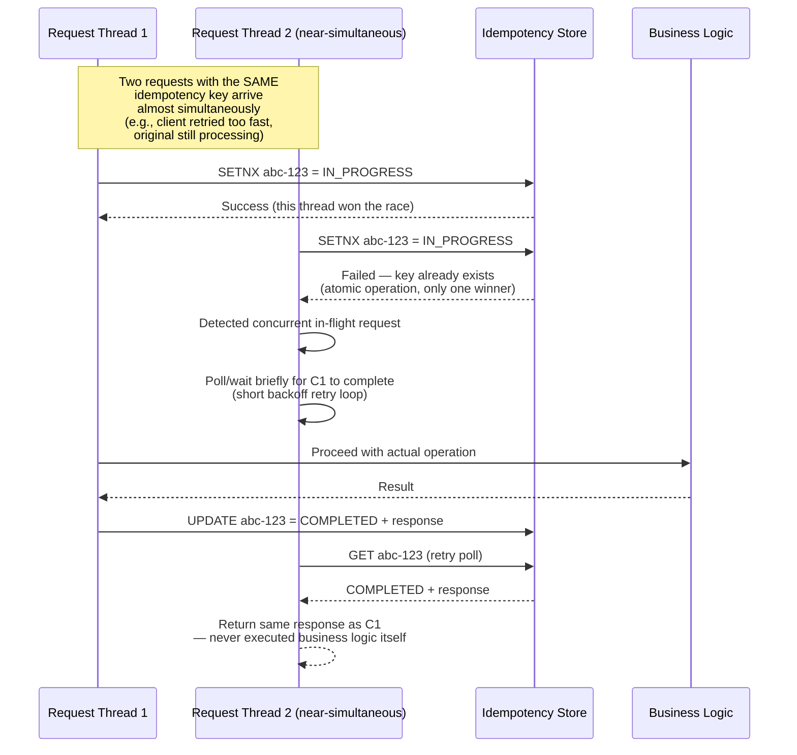
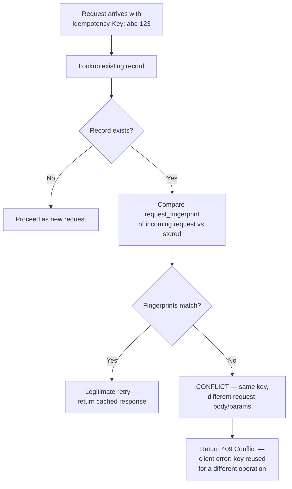
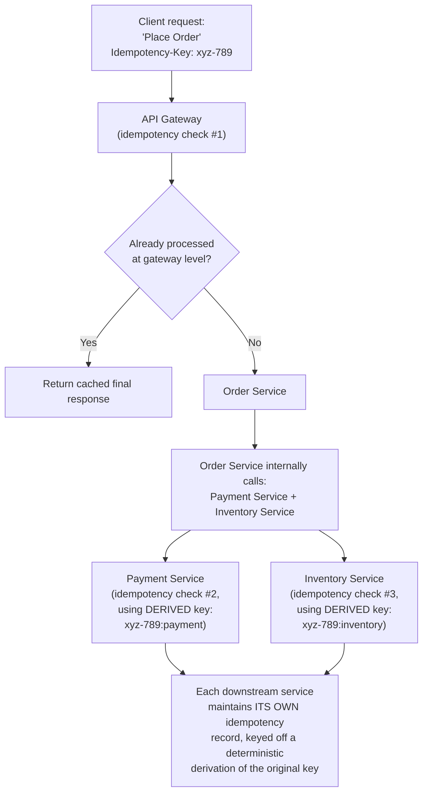
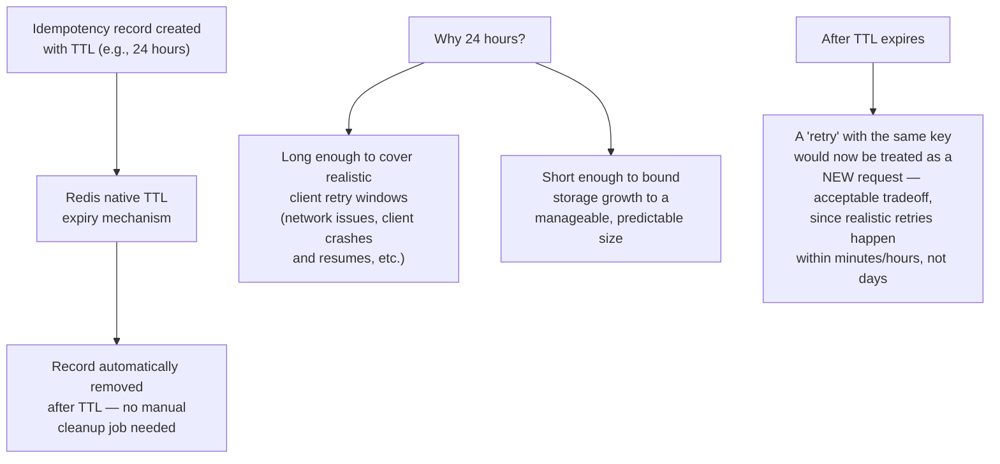
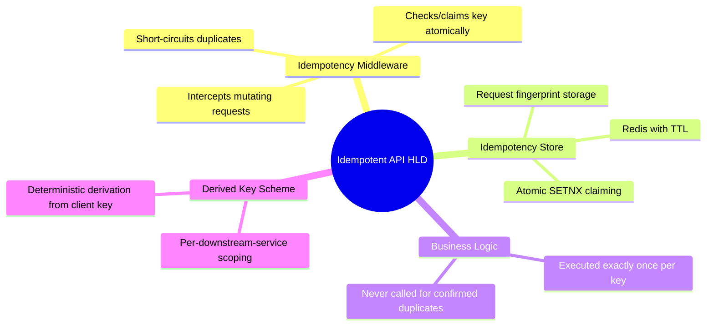

# Design a System for Idempotent API Requests at Scale — High-Level Design Document

## 1. Requirements

### Functional Requirements
- Clients can safely retry any mutating API request (POST, PATCH) without risk of duplicate side effects
- Support idempotency keys supplied by clients
- Return the original response for a retried request with the same key, not re-execute the operation
- Handle concurrent retries of the same request (race condition between two near-simultaneous retries)
- Support idempotency across distributed backend services, not just a single monolith

### Non-Functional Requirements
- **Correctness above all:** This system exists specifically to prevent duplicate financial/state-changing operations — false negatives (allowing a duplicate through) are unacceptable
- **Low latency overhead:** Idempotency checking must add minimal latency to every mutating request
- **Availability:** The idempotency layer itself must not become a single point of failure for the whole API
- **Bounded storage:** Idempotency records can't be kept forever — need a sensible expiration policy
- **Distributed consistency:** Two concurrent requests with the same key from different servers must not both "win"

### Back-of-Envelope Estimation
| Metric | Value |
|---|---|
| Mutating API requests/sec | ~100,000 |
| Retry rate (typical) | ~1-5% of requests are retries |
| Idempotency key TTL | 24 hours (typical — long enough to cover realistic retry windows) |
| Idempotency store size | Proportional to (requests/sec × TTL) |

---

## 2. High-Level Architecture

**Key idea:** The idempotency layer sits as **middleware** in front of business logic — its entire job is to answer one question before any side-effecting code runs: "have I already processed this exact request?" If yes, it short-circuits and returns the original result without touching business logic again. If no, it lets the request through and durably records the outcome once complete.

---

## 3. Data Model

**Key design point — the `request_fingerprint` field:** Storing a hash of the request's method/path/body alongside the key allows the system to detect a client error — reusing the same idempotency key for a genuinely *different* request (e.g., different amount) — and reject it as a conflict, rather than silently returning the wrong cached response.

---

## 4. Idempotent Request Flow — Detailed Sequence (Happy Path)

---

## 5. Retry Flow — Same Request, Already Completed

---

## 6. Concurrent Retry Race Condition — Detailed Handling

**Why atomic SETNX (SET if Not eXists) is essential:** Without an atomic "claim this key" operation, both concurrent threads could each check "does this key exist?", both see "no," and both proceed to execute the business logic — defeating the entire purpose of idempotency. The atomicity of SETNX in Redis (or an equivalent DB unique-constraint insert) is what makes exactly one thread the legitimate "winner" for actually executing the operation.

---

## 7. Handling a Conflicting Reuse of an Idempotency Key

*This protects against a client bug (or misuse) where the same idempotency key is accidentally reused for what's actually a different logical request — silently returning the wrong cached result would be far worse than an explicit error.*

---

## 8. Distributed Idempotency Across Multiple Services

**Why derived keys per downstream call:** A single idempotency key can't be reused verbatim across multiple distinct downstream operations within the same logical request (charging payment vs reserving inventory are different operations) — each needs its own idempotency scope, but deterministically derived from the original client-supplied key so that a full end-to-end retry of "Place Order" correctly deduplicates at every layer.

---

## 9. Idempotency Key Expiration & Storage Management

---

## 10. Component Responsibilities Summary

---

## 11. Key Design Decisions & Tradeoffs

| Decision | Choice | Why |
|---|---|---|
| Claiming mechanism | Atomic SETNX (set-if-not-exists) | The only way to guarantee exactly one concurrent request "wins" and executes business logic; without atomicity, race conditions defeat the entire purpose |
| Storage | Redis (or DB with unique constraint) with TTL | Low-latency reads/writes on the hot path; TTL bounds storage growth automatically without manual cleanup |
| Conflict detection | Store request fingerprint, compare on reuse | Protects against client bugs reusing a key for a genuinely different request — fails loudly (409) rather than silently returning wrong data |
| Concurrent retry handling | Losing thread polls/waits for winner's result | Ensures both concurrent requests ultimately return the identical, correct response rather than one succeeding and one erroring |
| Multi-service idempotency | Deterministically derived keys per downstream call | A single client key can't directly serve multiple distinct downstream operations within one logical request; derivation preserves end-to-end retry safety |
| Key expiration | ~24 hour TTL | Balances realistic retry window coverage against unbounded storage growth |

---

## 12. Bottlenecks & Scaling Considerations

- **Idempotency store as a new critical dependency** — every single mutating request now depends on this store's availability and latency; it must be highly available and fast, similar to the criticality of a rate limiter's shared state store.
- **Long-running operations under lock** — if the "winning" request's business logic takes a long time, concurrent retries polling for its result add latency; consider a reasonable poll timeout with a clear error response rather than blocking indefinitely.
- **Storage sizing at scale** — with 100,000 req/sec and a 24-hour TTL, the idempotency store must comfortably hold a full day's worth of key records — needs capacity planning proportional to peak sustained traffic, not average.
- **Fingerprint collision risk** — using a hash for the request fingerprint (rather than storing the full request body) is more storage-efficient but introduces a theoretical hash collision risk; in practice negligible with a strong hash function (e.g., SHA-256), but worth being deliberate about.
- **Client key generation quality** — the entire system's safety depends on clients generating genuinely unique keys per logical operation (e.g., UUID per checkout attempt, not per page load); poor client-side key generation (e.g., reusing a key across genuinely different requests) undermines the guarantee no matter how well the server-side is built.
- **Cross-region idempotency** — for globally distributed systems, ensuring the same idempotency key check is consistent across regions requires either a globally-replicated store (added latency) or accepting region-scoped idempotency guarantees as a deliberate, documented limitation.
- **Failure during business logic execution** — if the business logic crashes mid-execution after claiming the key but before completing, the key must not remain stuck in `IN_PROGRESS` forever; needs a secondary shorter timeout on the `IN_PROGRESS` state itself, distinct from the overall record TTL, to allow eventual retry after a genuine failure.
