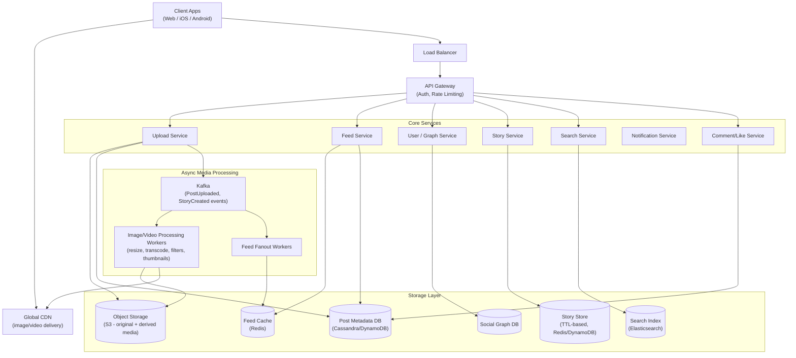
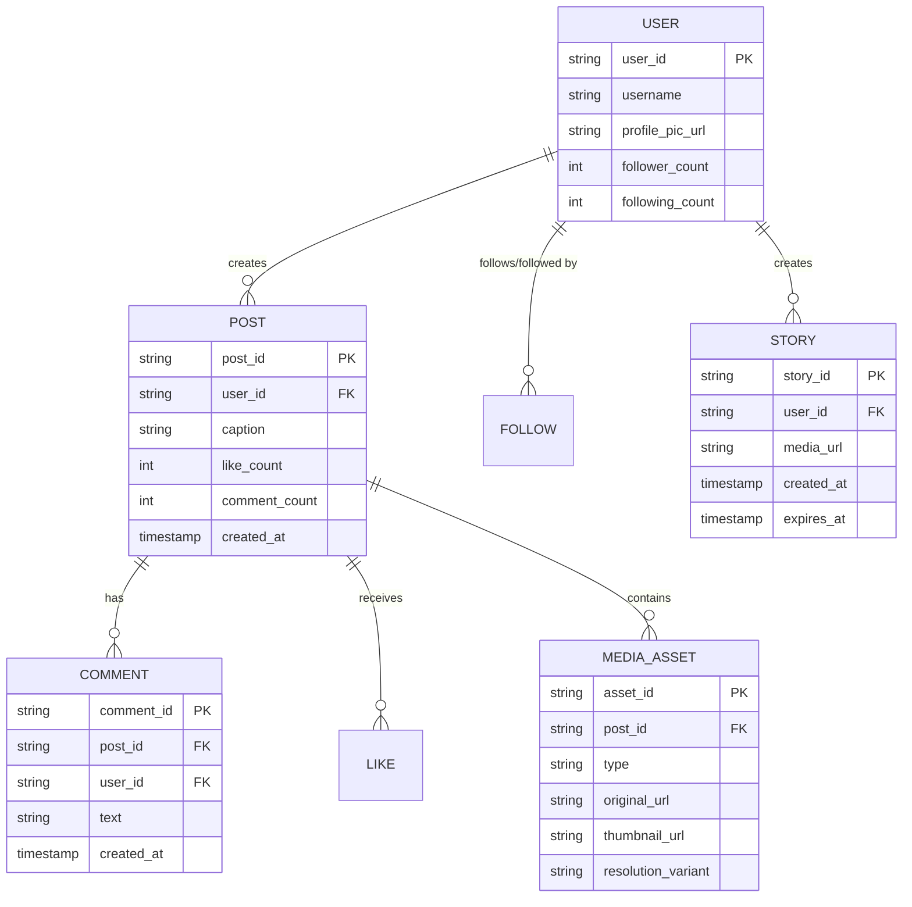
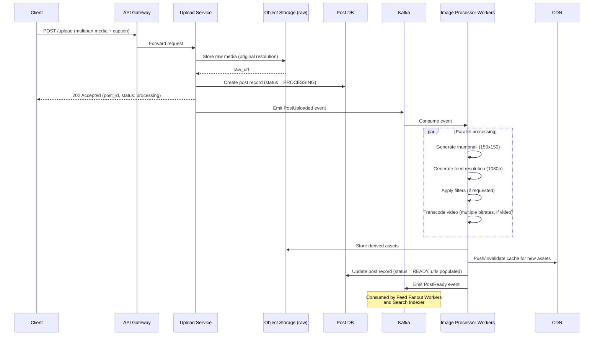
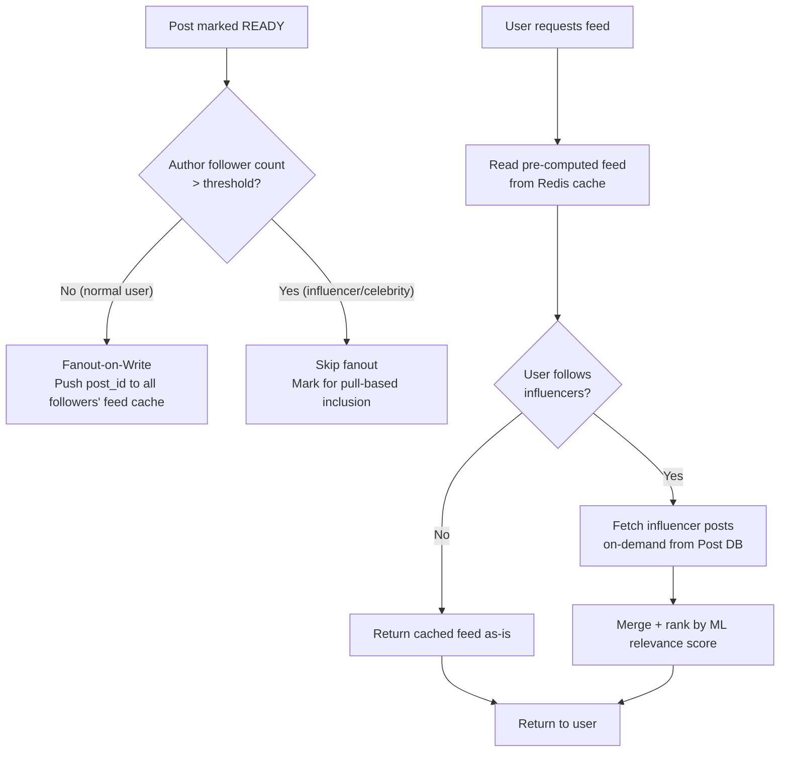
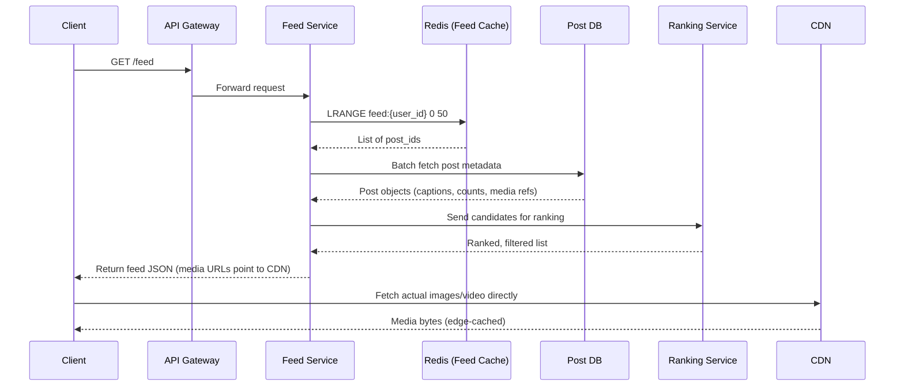
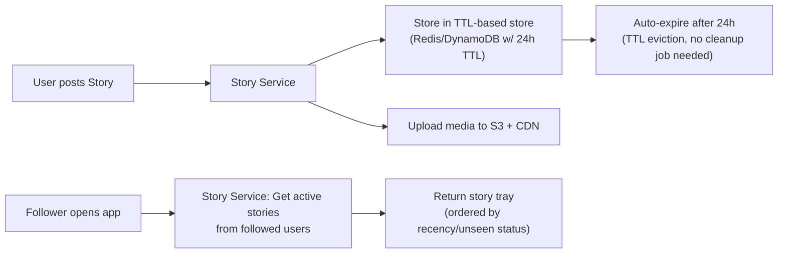
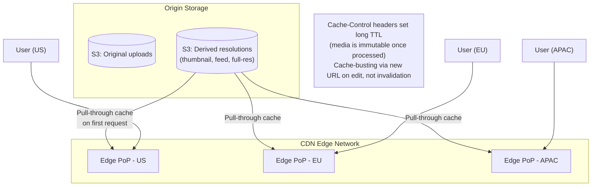
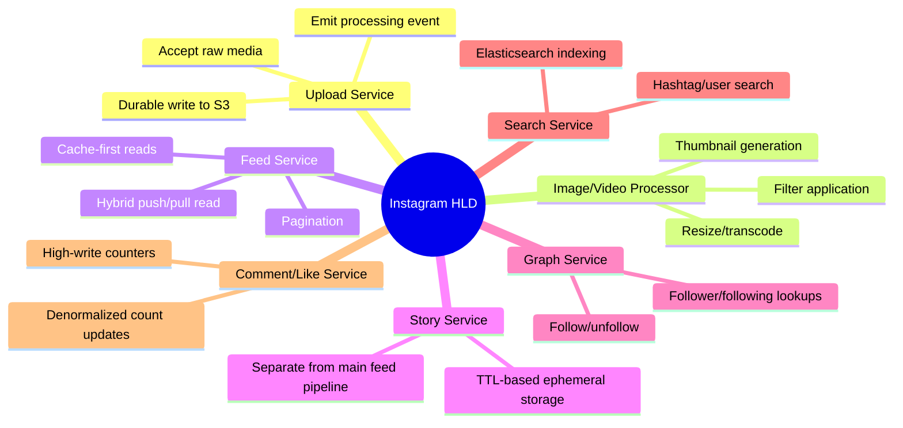

# Design Instagram — High-Level Design Document

## 1. Requirements

### Functional Requirements
- Users can upload photos/videos (posts)
- Users can follow/unfollow other users
- Users see a feed of posts from people they follow
- Users can like, comment on posts
- Users can post Stories (ephemeral, 24h expiry)
- Support image/video filters and processing
- Search users/hashtags

### Non-Functional Requirements
- **Scale:** ~500M DAU, ~100M photos uploaded/day
- **Read-heavy:** Read:Write ratio ~100:1
- **Low latency image serving:** < 200ms globally via CDN
- **High availability** for feed reads; some write latency (processing) is tolerable
- **Durability:** Uploaded media must never be lost

### Back-of-Envelope Estimation
| Metric | Value |
|---|---|
| DAU | 500M |
| Photos uploaded/day | ~100M |
| Avg photo size | ~2MB (post-compression, multiple resolutions) |
| Daily storage growth | ~200TB/day (raw) before CDN-tier duplication |
| Peak upload QPS | ~5,000/sec |
| Feed read QPS | ~500,000/sec |
| Video content | ~35% of uploads, larger storage/bandwidth footprint |

---

## 2. High-Level Architecture

**Key idea:** Upload is decoupled from processing. A client uploads raw media, gets a fast ack once it's durably stored, and heavy work (resizing, transcoding, filters, thumbnail generation) happens asynchronously via workers before the post appears in feeds.

---

## 3. Data Model (ER Diagram)

---

## 4. Media Upload & Processing Pipeline

---

## 5. Feed Generation (Hybrid Push/Pull — Same Core Problem as Twitter)

---

## 6. Feed Read Path — Detailed Sequence

---

## 7. Stories Architecture (Ephemeral Content)

*Stories use a **separate storage path** with native TTL expiry rather than the main Post DB — avoids polluting the permanent feed pipeline with self-deleting content and lets the datastore handle cleanup natively.*

---

## 8. Media Storage & CDN Strategy

---

## 9. Component Responsibilities Summary

---

## 10. Key Design Decisions & Tradeoffs

| Decision | Choice | Why |
|---|---|---|
| Upload flow | Async processing after fast ack | User doesn't wait for resizing/transcoding; better perceived latency |
| Feed generation | Hybrid push/pull | Same celebrity-fanout problem as Twitter; push for normal users, pull for influencers |
| Media storage | Multi-resolution derivatives, not on-the-fly resize | Avoids repeated CPU cost per view; trade storage for compute |
| Stories storage | Separate TTL-based store | Native expiry, keeps main Post DB clean of ephemeral writes |
| CDN strategy | Pull-through caching, long TTL, immutable URLs | Media rarely changes once processed; maximizes cache hit rate |
| Like/comment counts | Denormalized counters on Post record | Avoids COUNT() queries at read time; updated via async counter service |

---

## 11. Bottlenecks & Scaling Considerations

- **Processing pipeline backlog during viral spikes** → auto-scale worker pool horizontally; prioritize thumbnail generation (needed for feed) over full-res processing.
- **Celebrity/influencer fanout** → same hybrid solution as Twitter; threshold-based routing.
- **Hot posts (viral content) overwhelming like/comment counters** → use approximate counters or write-behind aggregation instead of synchronous increments.
- **CDN cold-start for newly uploaded viral content** → pre-warm edge caches for posts from high-follower accounts.
- **Story storage growth** → TTL handles cleanup automatically, but ensure sharding accounts for time-based access patterns (recent stories hot, expiring ones cold).
- **Cross-region media availability** → replicate S3 buckets across regions; CDN handles most of the latency concern regardless.
