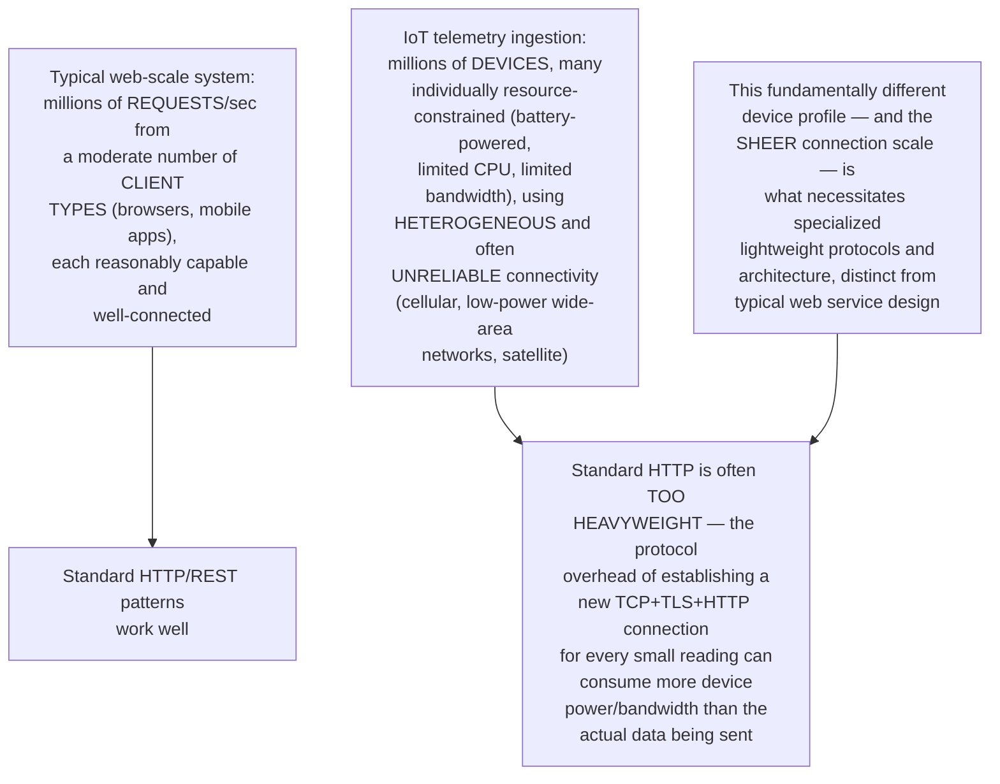
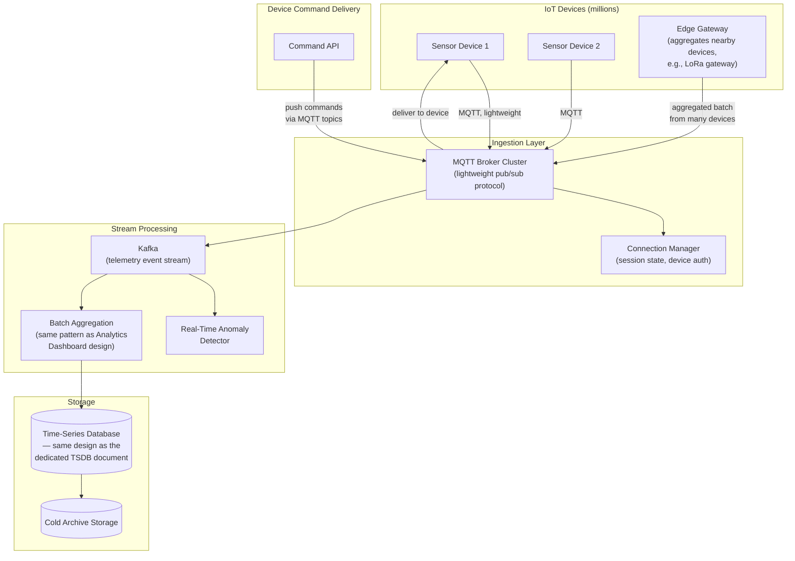
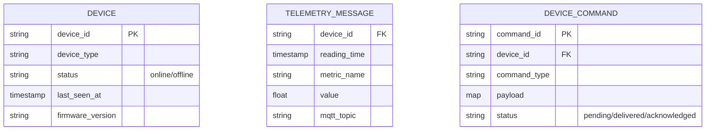
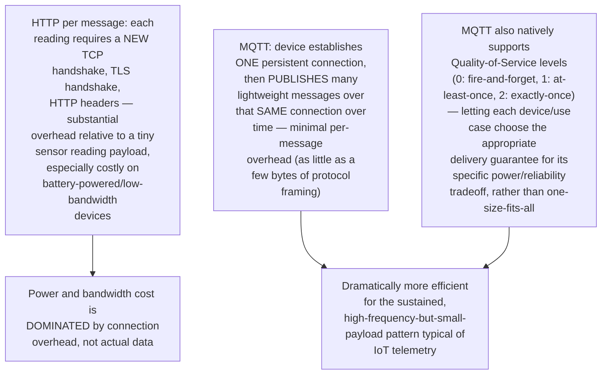
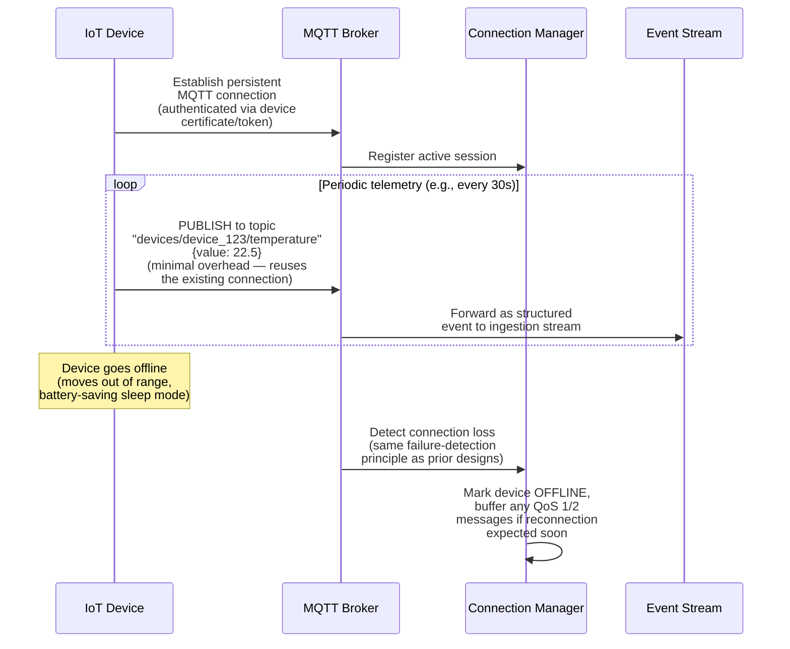
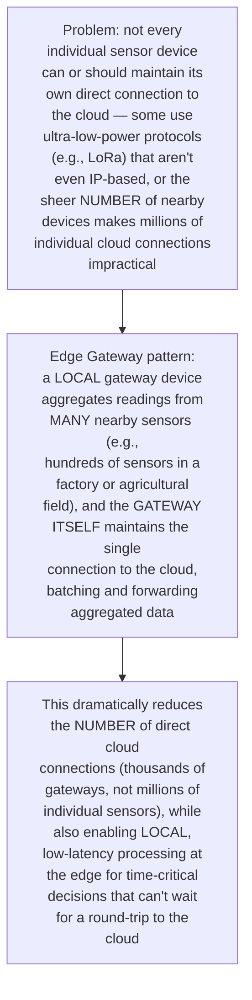
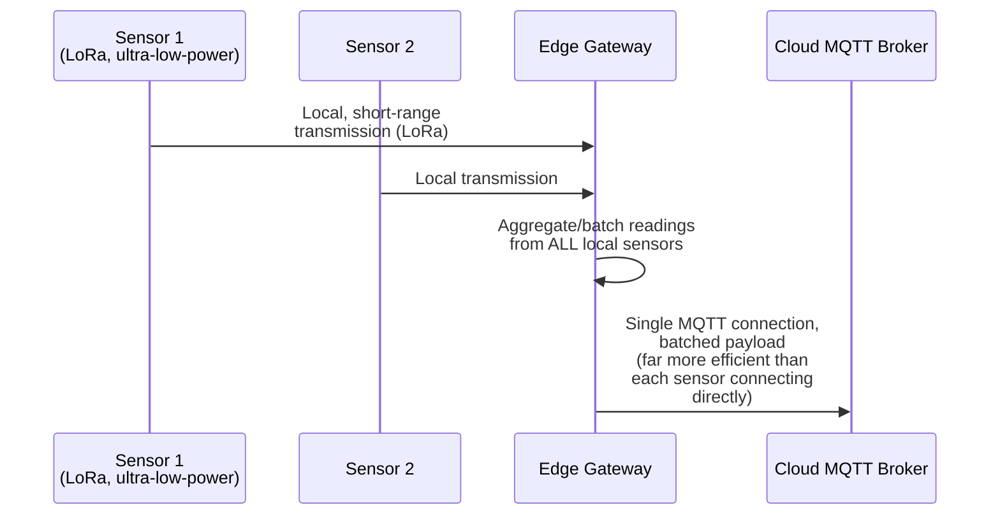
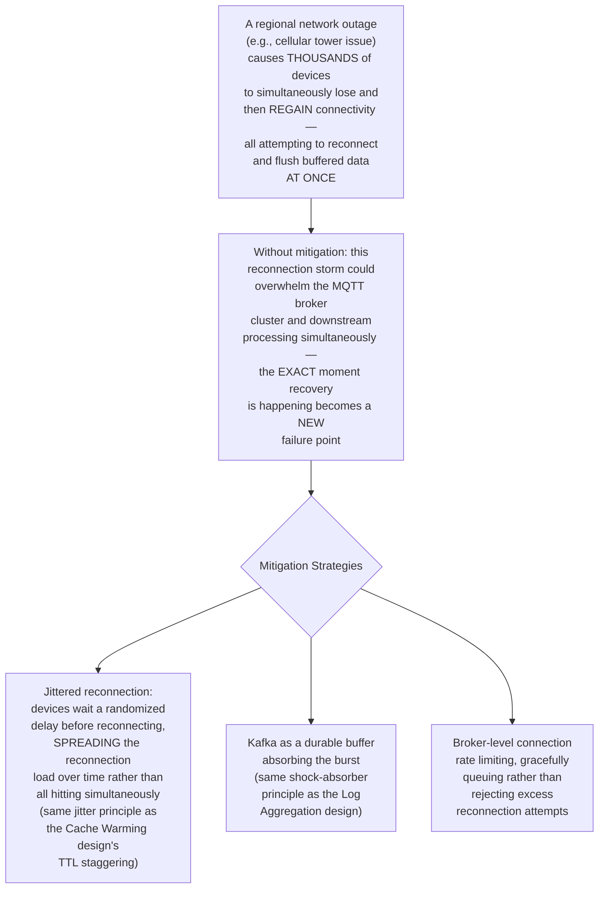
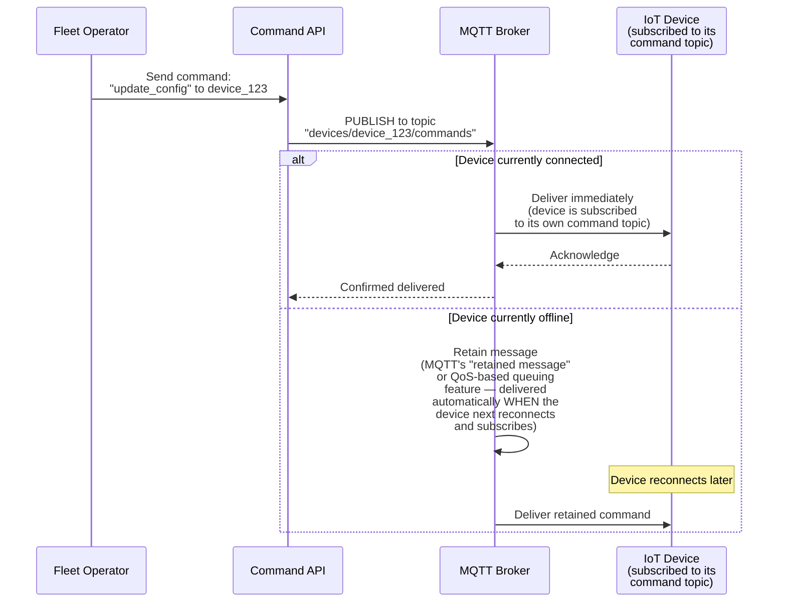
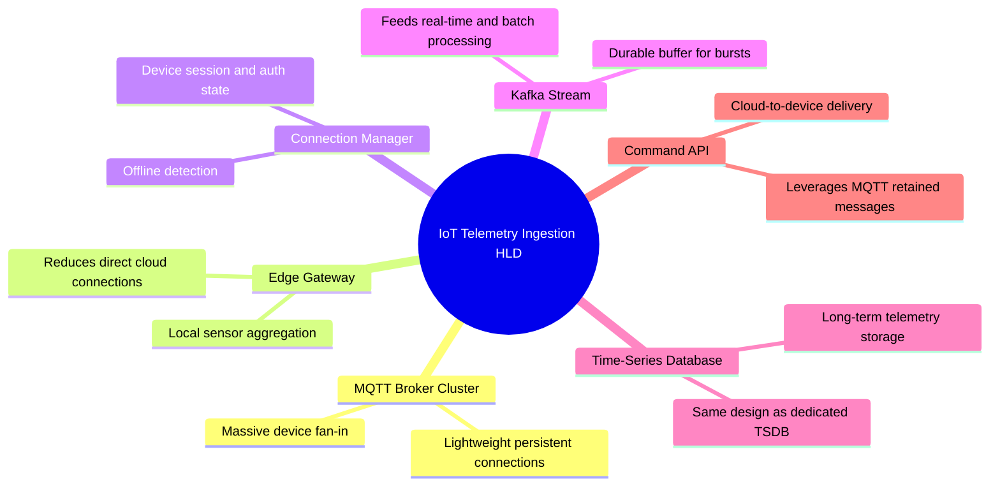

# Design an IoT Telemetry Ingestion System for Millions of Devices — High-Level Design Document

## 1. Requirements

### Functional Requirements
- Ingest continuous telemetry data (sensor readings, status updates) from millions of geographically distributed IoT devices
- Support devices with severely constrained resources (low power, limited bandwidth, intermittent connectivity)
- Support both real-time processing (alerting on anomalous readings) and long-term storage for historical analysis
- Support remote device configuration/command delivery (not just one-way data collection)

### Non-Functional Requirements
- **Massive connection scale:** Millions of concurrent or near-concurrent device connections, far exceeding typical web-service connection counts
- **Protocol efficiency:** Devices often have severe power/bandwidth constraints — the ingestion protocol itself must be lightweight, not a heavyweight HTTP-per-message approach
- **Graceful backpressure handling:** A traffic spike (e.g., many devices reporting simultaneously after a network outage) must not overwhelm downstream systems
- **Edge-aware architecture:** Not every device can or should stream raw data directly to the cloud continuously

### Back-of-Envelope Estimation
| Metric | Value |
|---|---|
| Connected devices | Millions to tens of millions |
| Telemetry messages/sec (platform-wide) | Millions |
| Message size | Small — often bytes to low KB per reading |
| Device connectivity | Highly variable — cellular, WiFi, LPWAN (LoRa, NB-IoT), often intermittent |

---

## 2. The Core Challenge — This Is Not a Typical Web-Scale Problem

---

## 3. High-Level Architecture

**Key idea:** MQTT (a lightweight publish-subscribe protocol purpose-built for constrained devices) replaces HTTP as the primary device-facing protocol — devices maintain a single persistent, low-overhead connection rather than repeatedly establishing new connections per message, and the broker handles the massive fan-in of millions of small, frequent messages before handing off to the same Kafka-based stream processing patterns established in earlier designs (Analytics Dashboard, Time-Series Database).

---

## 4. Data Model

---

## 5. Why MQTT — Protocol Efficiency for Constrained Devices

---

## 6. Telemetry Ingestion Flow — Detailed Sequence

---

## 7. Edge Aggregation (Reducing Direct-to-Cloud Connections)

---

## 8. Backpressure Handling During Reconnection Storms

---

## 9. Device Command Delivery (Cloud-to-Device)

**Why MQTT's publish-subscribe model naturally supports this bidirectional pattern:** Since MQTT already establishes persistent, subscribable topics per device for telemetry publishing, the SAME mechanism naturally extends to command delivery — a device simply subscribes to its own dedicated "commands" topic, and the broker's built-in message retention handles the offline-device case without requiring an entirely separate command-delivery infrastructure.

---

## 10. Component Responsibilities Summary

---

## 11. Key Design Decisions & Tradeoffs

| Decision | Choice | Why |
|---|---|---|
| Device protocol | MQTT (lightweight pub/sub) over HTTP | Minimizes per-message overhead critical for battery/bandwidth-constrained devices, unlike HTTP's heavier per-request connection cost |
| Connection topology | Edge gateway aggregation where feasible | Reduces the number of direct cloud connections from millions of individual sensors to thousands of gateways, while enabling local low-latency processing |
| Reconnection handling | Jittered reconnect + Kafka buffering | Prevents simultaneous mass-reconnection events from becoming a secondary failure point during recovery from network outages |
| Command delivery | Reuses MQTT pub/sub with retained messages | Leverages the same protocol/infrastructure already handling telemetry, avoiding a separate command-delivery system |
| Storage | Time-series database (same design as dedicated TSDB) | Telemetry data has the exact same structural properties (regular intervals, gradual value changes) that specialized TSDB compression exploits |
| Delivery guarantee | Configurable MQTT QoS levels per use case | Different telemetry types have different reliability needs; a single global guarantee level would over- or under-serve different device/data categories |

---

## 12. Bottlenecks & Scaling Considerations

- **MQTT broker cluster connection scaling** — sustaining millions of persistent connections requires careful broker cluster sizing and horizontal scaling, similar in principle to the connection-server scaling challenges in the WhatsApp/Messenger design, but at potentially even larger device counts.
- **Edge gateway as a new single point of failure per cluster** — while aggregation reduces cloud connection count, it introduces a new failure mode: if an edge gateway itself fails, ALL sensors depending on it lose connectivity simultaneously, even though each individual sensor might otherwise be fine — gateway redundancy/failover needs consideration for critical deployments.
- **Firmware/protocol version heterogeneity across a large device fleet** — IoT devices, once deployed, are often difficult or impossible to update quickly (unlike server software); the ingestion system must gracefully handle a long tail of devices running OLDER firmware/protocol versions indefinitely, requiring careful backward-compatibility discipline.
- **Time synchronization across constrained devices** — many IoT devices have imprecise onboard clocks; telemetry timestamps may carry meaningful clock skew, requiring the same event-time correction/watermarking principles covered in the Stream Processing Fraud Detection design, adapted for device-clock unreliability specifically rather than just network delay.
- **Security for a massive, physically-distributed device fleet** — unlike servers in a controlled data center, IoT devices are often physically accessible to potential attackers (tampering, credential extraction); device authentication and the ability to remotely revoke a compromised device's access are critical security requirements beyond typical server-to-server authentication concerns.
- **Cold storage cost management at massive data volume** — millions of devices reporting continuously generates enormous data volume over time; the same tiered storage and downsampling strategies from the Time-Series Database and Analytics Dashboard designs become essential for cost control, likely even more aggressively applied given IoT's typically much higher device-to-value-per-reading ratio compared to business metrics.
- **Testing at realistic device-fleet scale and heterogeneity** — validating system behavior under millions of connections with genuinely variable connectivity quality, intermittent patterns, and mixed firmware versions requires sophisticated device-simulation testing infrastructure — production issues specific to this scale and heterogeneity are notoriously difficult to reproduce in smaller-scale testing environments.
