# Design an LLM Inference Serving Platform at Scale — High-Level Design Document

## 1. Requirements

### Functional Requirements
- Serve text generation requests from large language models, supporting streaming token-by-token output
- Support many concurrent users/requests against a shared pool of expensive GPU resources
- Support multiple model sizes/versions simultaneously
- Support variable-length inputs and outputs efficiently

### Non-Functional Requirements
- **GPU memory is the primary scarce resource:** Unlike typical inference (bounded by compute), LLM serving is heavily bounded by GPU memory capacity — this shapes nearly every architectural decision
- **Latency characteristics are unusual:** Time-to-first-token matters for perceived responsiveness, while total generation time scales with output length — these are DIFFERENT metrics requiring different optimization
- **Throughput vs latency tradeoff:** Serving many users simultaneously efficiently (throughput) can conflict with making any single user's response as fast as possible (latency)
- **Cost efficiency:** GPU compute for LLM serving is extremely expensive — utilization efficiency has direct, major cost impact

### Back-of-Envelope Estimation
| Metric | Value |
|---|---|
| Concurrent requests (per GPU cluster) | Hundreds to low thousands, depending on model size |
| Model size | Billions of parameters, tens of GB of GPU memory just to load |
| Time-to-first-token target | Hundreds of ms |
| Tokens/sec generation rate (per request) | Tens of tokens/sec typical |
| KV-cache memory per request | Grows linearly with context length — can be substantial |

---

## 2. The Core Problem — Why LLM Serving Is Fundamentally Different

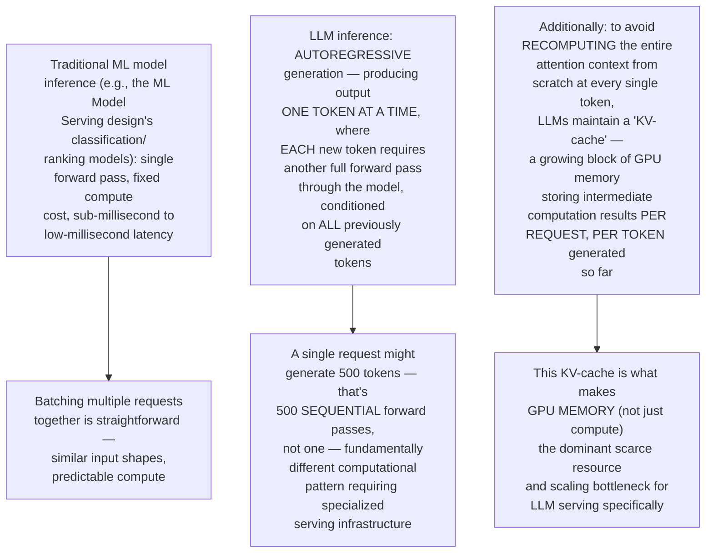

---

## 3. High-Level Architecture

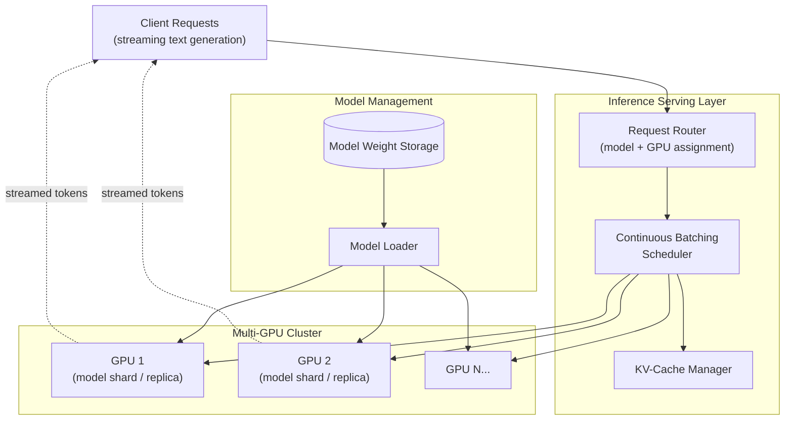

**Key idea:** The Continuous Batching Scheduler and KV-Cache Manager are the two components that don't exist in this form in traditional ML serving — they exist specifically to solve LLM serving's unique challenges: efficiently batching requests that are AT DIFFERENT STAGES of generation (not uniform, single-shot requests), and carefully managing the scarce GPU memory consumed by each request's growing context cache.

---

## 4. Continuous (In-Flight) Batching — The Core Serving Innovation

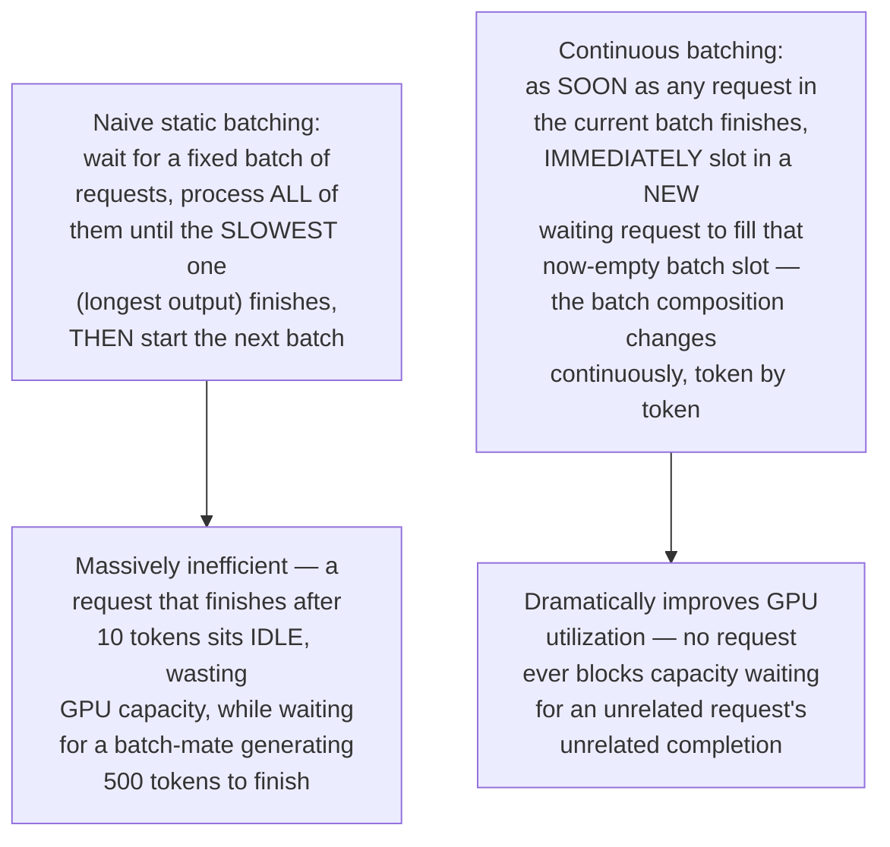

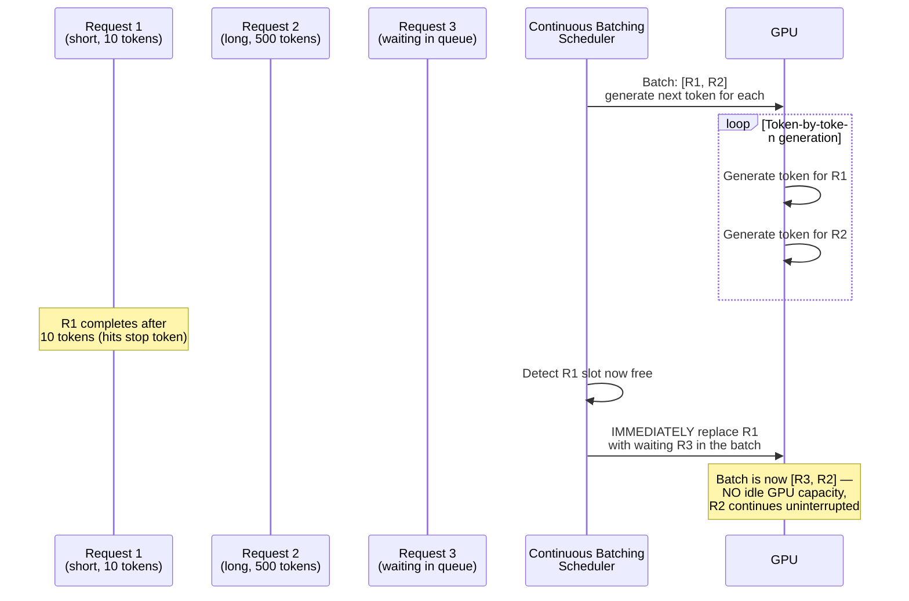

---

## 5. Data Model

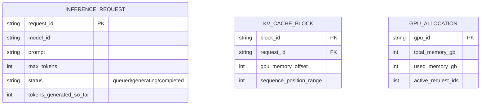

---

## 6. KV-Cache Memory Management

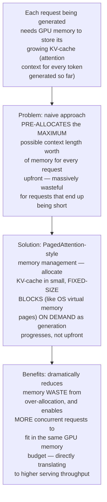

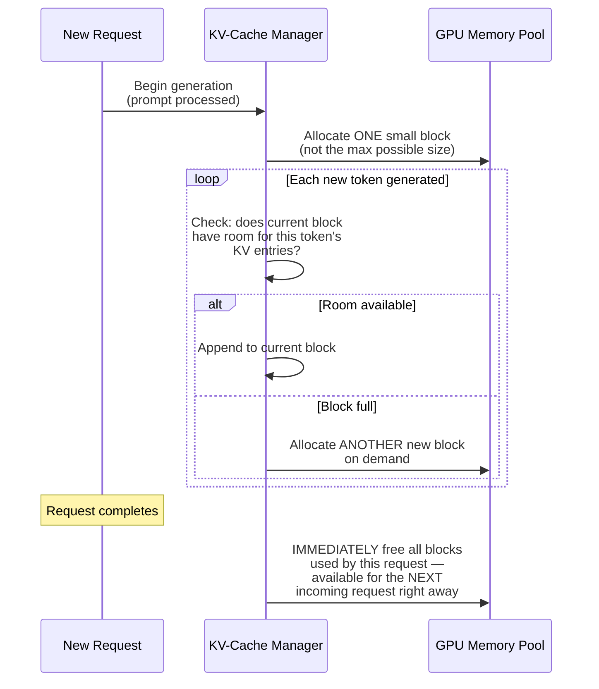

**Why this block-based approach is analogous to OS virtual memory paging:** Just as an operating system doesn't reserve a process's ENTIRE potential memory footprint upfront, but allocates physical memory pages on demand as the process actually uses them, this system allocates KV-cache memory incrementally as generation actually proceeds — avoiding the massive waste of reserving worst-case memory for every request regardless of how much it actually ends up needing.

---

## 7. Multi-GPU Routing Strategies

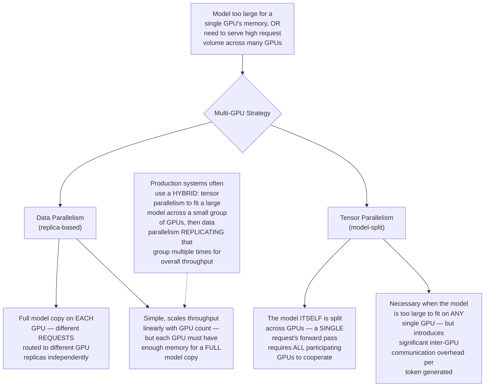

---

## 8. Request Routing & Load Balancing — Detailed Sequence

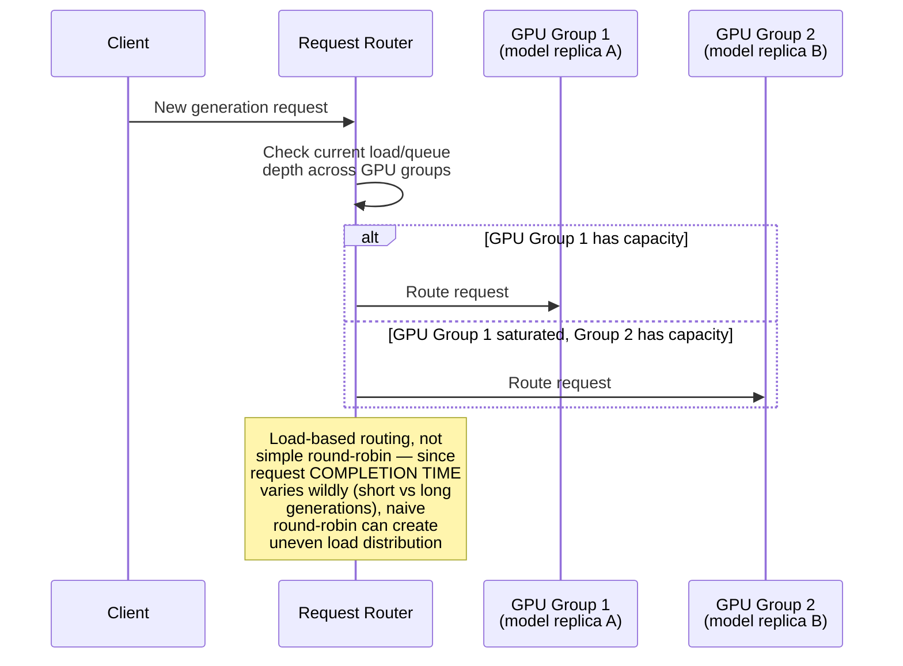

---

## 9. Streaming Response Delivery

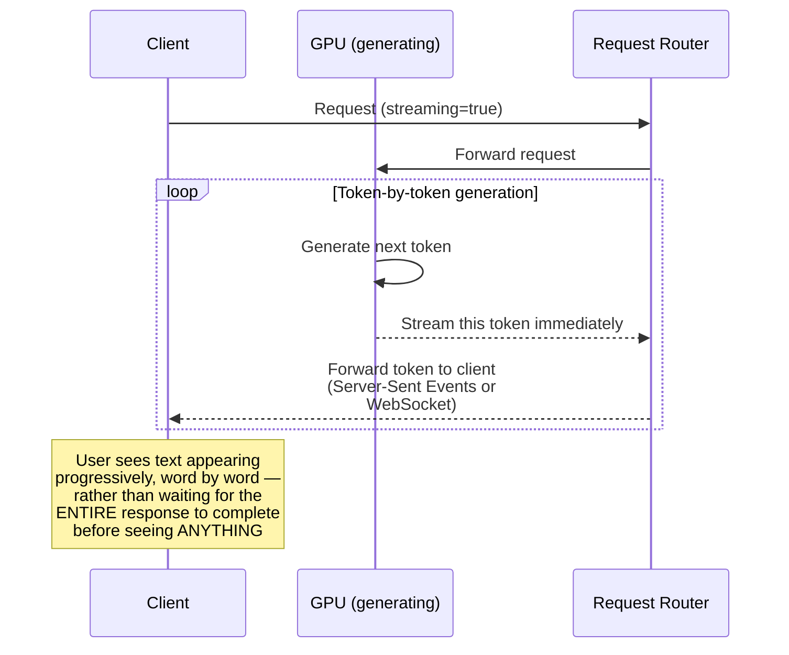

**Why streaming matters enormously for perceived latency:** Given that full generation of a long response can take several seconds, waiting for complete generation before showing anything would feel sluggish — streaming tokens as they're generated lets the user start reading almost immediately (time-to-first-token, often under a second), dramatically improving perceived responsiveness even though the TOTAL generation time is unchanged.

---

## 10. Component Responsibilities Summary

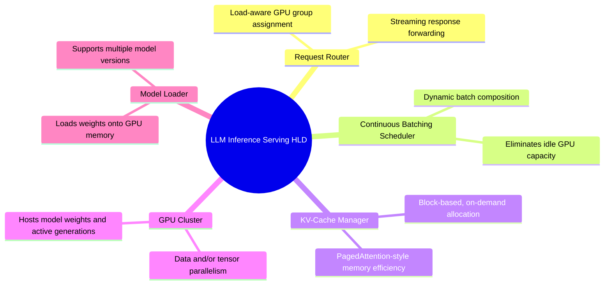

---

## 11. Key Design Decisions & Tradeoffs

| Decision | Choice | Why |
|---|---|---|
| Batching strategy | Continuous (in-flight) batching | Eliminates GPU idle time caused by waiting for the slowest request in a static batch — directly addresses LLM serving's uniquely variable per-request completion times |
| KV-cache allocation | Block-based, on-demand (PagedAttention-style) | Avoids massive memory waste from pre-allocating worst-case context length for every request, directly increasing achievable concurrency |
| Multi-GPU strategy | Hybrid tensor + data parallelism | Tensor parallelism handles models too large for one GPU; data parallelism replicates for throughput — neither alone is sufficient at scale |
| Response delivery | Token-by-token streaming | Dramatically improves perceived latency (time-to-first-token) despite total generation time remaining unchanged |
| Load balancing | Load-aware routing, not round-robin | Request completion times vary enormously (short vs long generations), making naive round-robin routing produce uneven actual load |

---

## 12. Bottlenecks & Scaling Considerations

- **GPU memory as the fundamental ceiling** — unlike most serving systems where compute is the primary constraint, LLM serving is frequently memory-bound; the number of concurrent requests a GPU can serve is directly limited by how much KV-cache memory is available, making memory management efficiency (Section 6) the single highest-leverage optimization area.
- **Long-context requests disproportionately consume resources** — a request with a very long input prompt or requesting a very long generation consumes proportionally more KV-cache memory throughout its lifetime, potentially crowding out capacity for many shorter concurrent requests — may need separate handling/quotas for exceptionally long-context requests.
- **Tensor parallelism communication overhead** — splitting a model across GPUs requires significant inter-GPU communication for EVERY token generated (not just periodically, unlike the gradient synchronization in the ML Training Pipeline design which happens once per training step) — this makes high-bandwidth GPU interconnects (NVLink) essential infrastructure, not a nice-to-have, for tensor-parallel serving.
- **Cold-start model loading time** — loading a large model's weights onto GPU memory can take significant time; auto-scaling GPU capacity up in response to demand spikes faces this same warm-up latency challenge covered in the general ML Model Serving design, often more pronounced given LLM model sizes.
- **Fairness and starvation** — under high load, the scheduler must ensure long-running generations don't perpetually starve newly-arriving requests of batch slots (or vice versa) — this requires deliberate fairness policies within the continuous batching scheduler, not just greedy capacity-filling.
- **Cost optimization through request batching economics** — because GPU cost is so significant, maximizing genuine throughput (tokens generated per GPU-second across ALL concurrent requests) rather than optimizing any single request's latency in isolation is often the primary cost-driving metric this entire architecture is designed to optimize.
- **Speculative decoding and other emerging optimizations** — beyond the core architecture described here, advanced techniques like speculative decoding (using a smaller, faster model to draft multiple tokens that the large model then verifies in parallel) represent an active, rapidly evolving area for further throughput improvements — worth acknowledging as the frontier of this space continues advancing beyond the foundational architecture covered in this design.
