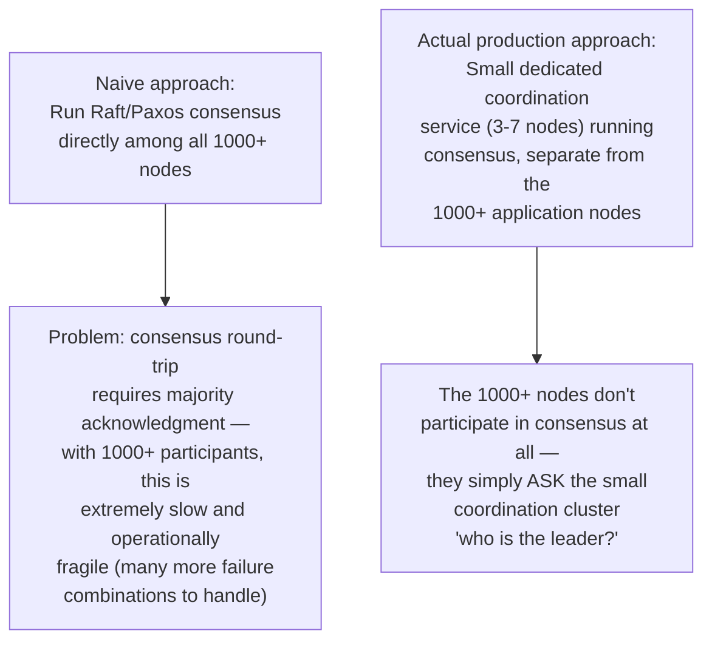
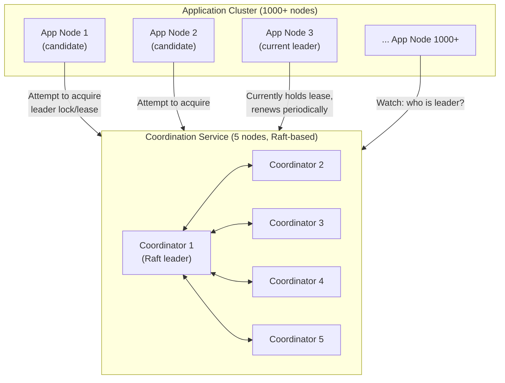
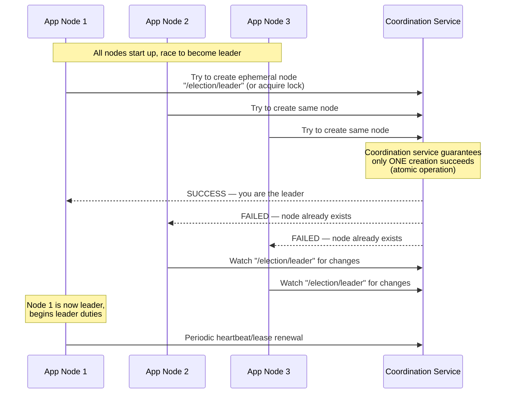
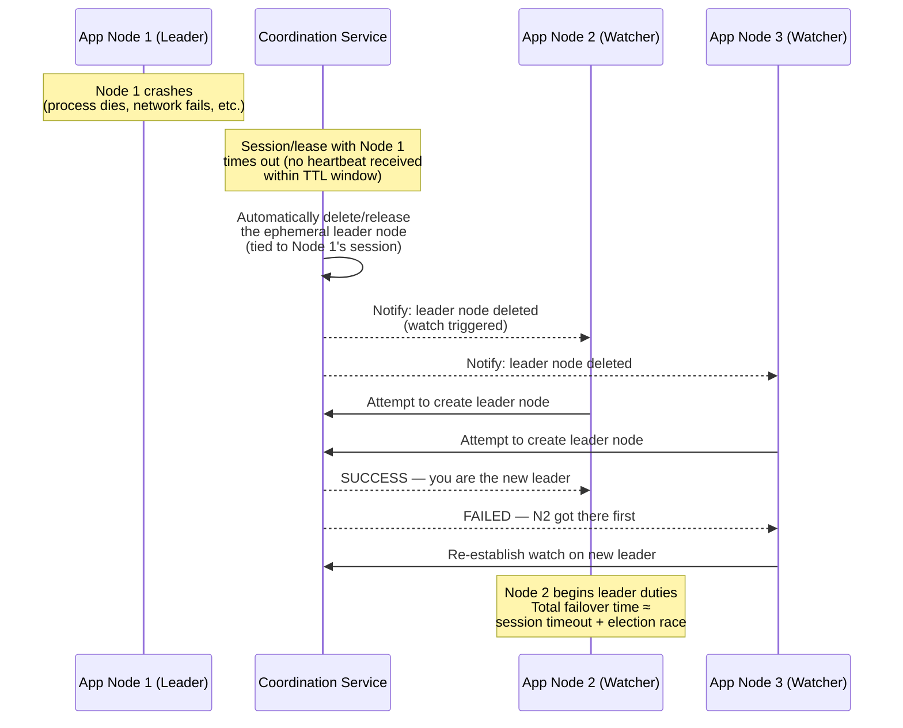
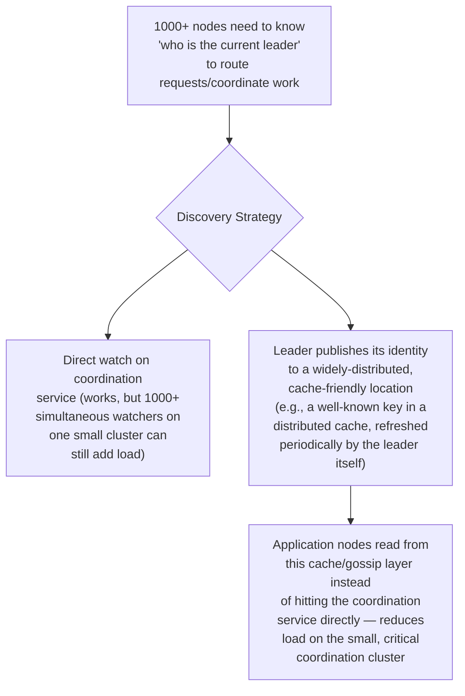
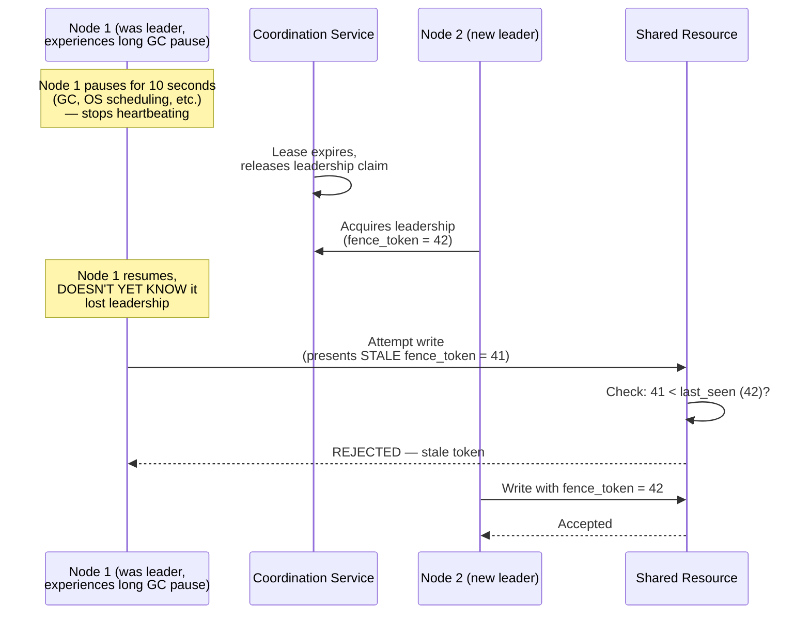
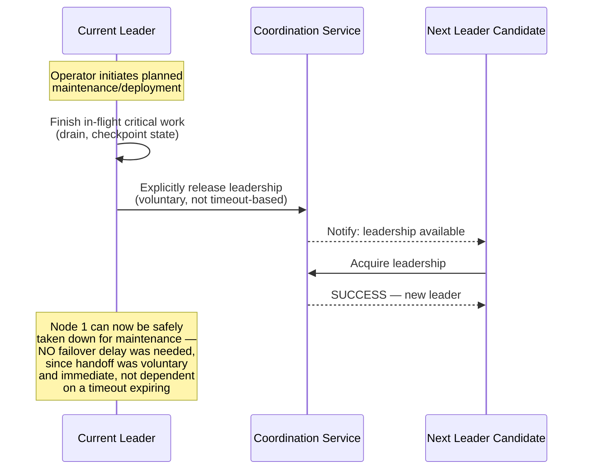
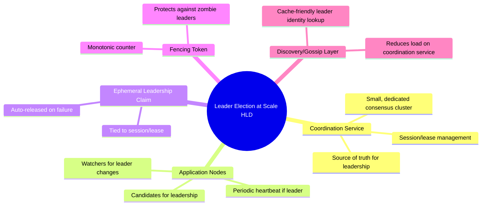

# Design a Leader Election System for a Cluster of 1000+ Nodes — High-Level Design Document

## 1. Requirements

### Functional Requirements
- A large cluster (1000+ nodes) must agree on exactly one active leader at any time
- Automatic failover — if the leader crashes/becomes unreachable, a new leader is elected without manual intervention
- Nodes must be able to reliably determine "who is the current leader" (leader discovery)
- Support graceful leader handoff for planned maintenance (not just crash recovery)

### Non-Functional Requirements
- **Split-brain prevention (paramount):** At most one node may believe it is the active leader at any given time
- **Scalability:** Election mechanism must not require O(N) coordination overhead across all 1000+ nodes directly — this would not scale
- **Fast failover:** New leader should be established within seconds of the previous leader's failure
- **Low steady-state overhead:** Leader election machinery shouldn't consume significant resources during normal (non-election) operation

### Back-of-Envelope Estimation
| Metric | Value |
|---|---|
| Cluster size | 1,000-10,000 nodes |
| Actual consensus participants | Small (3-7 dedicated coordinator nodes) — NOT all 1000+ |
| Failover target | < 5-10 seconds |
| Leader lease renewal interval | ~1-2 seconds |
| Heartbeat/health check interval | Sub-second |

---

## 2. The Key Insight — Don't Run Consensus Across All 1000+ Nodes

**This is the single most important design decision:** Systems like ZooKeeper, etcd, and Consul exist precisely because running full consensus among a large, dynamic set of application nodes doesn't scale. Instead, a small, stable coordination cluster runs consensus among *itself*, and the large application cluster treats it as an external, trusted authority for leader election — reducing an O(N) coordination problem to an O(1) lookup against a much smaller, purpose-built system.

---

## 3. High-Level Architecture

**Key idea:** The small coordination cluster acts as a **distributed lock manager** (see the earlier Distributed Lock Manager design — this is a direct application of that pattern). "Being the leader" is modeled as "holding a specific named lock" — whichever application node successfully acquires the lock is the leader; everyone else watches for the lock to become available.

---

## 4. Leader Election via Distributed Lock — Detailed Sequence

---

## 5. Failover on Leader Crash — Detailed Sequence

**Why ephemeral nodes/sessions matter:** The leader's "claim" on leadership is tied to an active session with the coordination service (via periodic heartbeats). If the leader crashes, it stops heartbeating, the session expires, and the coordination service *automatically* releases the leadership claim — no separate failure-detection mechanism is needed; session expiry IS the failure detection.

---

## 6. Leader Discovery for the Broader 1000+ Node Cluster

*For genuinely massive clusters, even 1000+ simultaneous watches on a 5-node coordination service can become a scaling concern — production systems often add a caching/gossip layer so most nodes discover the leader through a cheap, widely-replicated read rather than a direct connection to the coordination service itself.*

---

## 7. Preventing a "Zombie Leader" (Fencing, Revisited)

*This is the exact same fencing token mechanism from the Distributed Lock Manager design — leader election is fundamentally a specialized application of distributed locking, so it inherits the same "paused-not-crashed" correctness hazard and the same solution.*

---

## 8. Graceful Leader Handoff (Planned Maintenance)

**Why this matters operationally:** Relying solely on timeout-based failure detection means every planned deployment/restart of the leader incurs the full failover delay (waiting for lease timeout) even though the leader is healthy and could hand off instantly. Supporting explicit voluntary release avoids this unnecessary downtime for routine operational events.

---

## 9. Component Responsibilities Summary

---

## 10. Key Design Decisions & Tradeoffs

| Decision | Choice | Why |
|---|---|---|
| Consensus scope | Small dedicated coordination cluster (3-7 nodes), not all 1000+ app nodes | Running consensus among 1000+ nodes directly doesn't scale; a small, stable coordinator cluster reduces this to an O(1) lookup problem for application nodes |
| Leadership model | Ephemeral node/lock tied to a session | Session expiry naturally IS the failure detection mechanism — no separate heartbeat-monitoring system needed |
| Zombie leader protection | Fencing tokens | A paused (not crashed) former leader could otherwise still issue commands after losing its lease — fencing makes this safe regardless |
| Leader discovery at scale | Caching/gossip layer over direct coordination service watches | Prevents 1000+ simultaneous connections from overwhelming the small coordination cluster |
| Planned maintenance | Explicit voluntary handoff | Avoids unnecessary failover delay for routine, healthy leader transitions |

---

## 11. Bottlenecks & Scaling Considerations

- **Coordination service as a critical, small-blast-radius dependency** — because it's intentionally small (3-7 nodes) and handles only leadership metadata (not application data), it's much easier to keep highly available and low-latency than trying to scale consensus to the full cluster size.
- **Watch/notification fan-out at 1000+ scale** — even with a small coordination cluster, if all 1000+ nodes directly watch it for leader changes, that's still 1000+ open connections/watches on a small cluster; the gossip/caching layer mitigation (section 6) is essential at this scale, not optional.
- **Thundering herd on leader failure** — when the leader's session expires, potentially many candidate nodes may attempt to acquire leadership simultaneously; the coordination service's atomic creation guarantee handles correctness, but a large candidate pool still generates a burst of near-simultaneous requests worth monitoring.
- **Lease timeout tuning** — too short risks false failover during transient network blips or GC pauses (mitigated by fencing, but still causes unnecessary leadership churn); too long delays genuine failover — typically tuned to a few seconds based on realistic heartbeat reliability.
- **Coordination service becomes a single point of failure if under-provisioned** — while intentionally small, it must still itself be deployed with proper fault tolerance (odd node count, spread across failure domains) since ALL leader election for the entire 1000+ node cluster depends on its availability.
- **Cross-region leader election** — if the 1000+ node cluster spans regions, the coordination service's placement becomes critical; a coordination service in one region adds latency for election operations from distant regions, and a regional outage affecting the coordination service itself would halt leader election cluster-wide.
