# Linearizability vs Eventual Consistency — High-Level Design Document

## 1. Requirements & Framing

This question asks you to **design a system requiring each consistency model** and justify the tradeoffs with a concrete example — it's fundamentally a comparative systems-theory question, not a single architecture. This document covers:
1. A system requiring **linearizability** (e.g., a distributed lock / bank account balance)
2. A system where **eventual consistency** is the right choice (e.g., a social media like counter)
3. The theoretical distinction, and why the "right" choice depends entirely on the use case

### Key Non-Functional Tradeoff
| Property | Linearizable | Eventually Consistent |
|---|---|---|
| Latency | Higher (requires coordination) | Lower (local writes/reads) |
| Availability during partition | Reduced (may reject requests) | Full (always accepts) |
| Read result | Always reflects latest write | May be stale, temporarily |
| Use case fit | Financial balances, locks, inventory counts | Like counts, view counts, presence status |

---

## 2. Conceptual Definitions

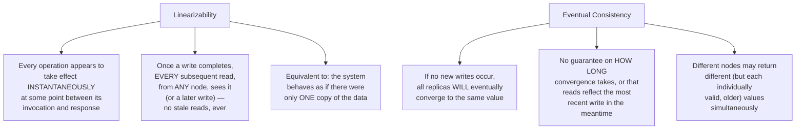

---

## 3. System A — Requires Linearizability: Distributed Bank Account Balance

### 3.1 High-Level Architecture

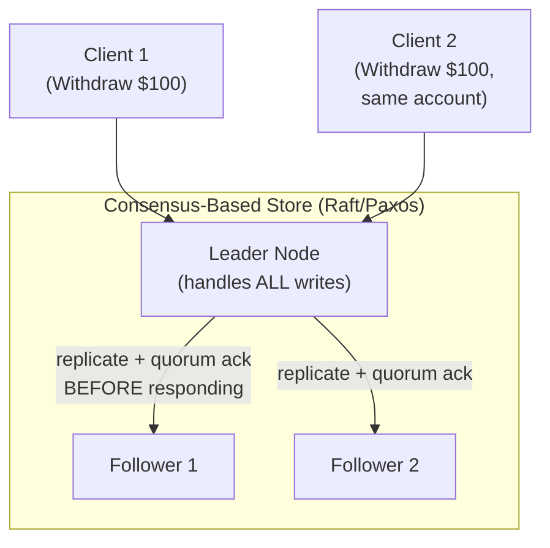

**Why linearizability is non-negotiable here:** Consider an account with $150. If both clients' withdrawal requests were allowed to read a stale balance ("I see $150, so $100 is fine") without linearizable ordering, **both** could succeed — overdrawing the account by $50. A financial balance is exactly the case where "every read must reflect the absolute latest state" isn't a nice-to-have, it's the core correctness property the whole system exists to provide.

### 3.2 Linearizable Withdrawal Flow — Detailed Sequence

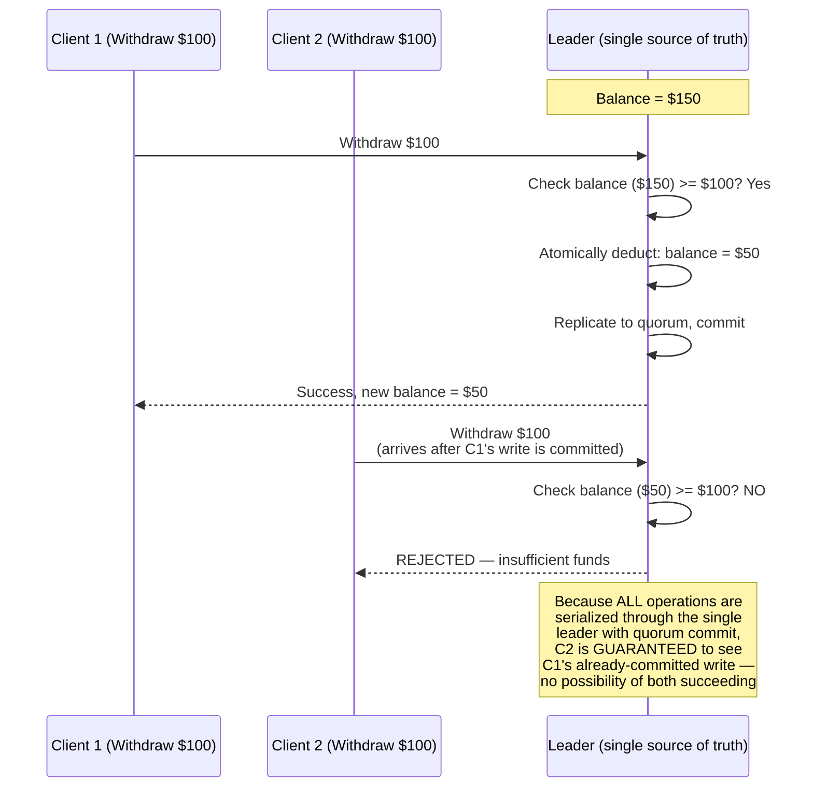

### 3.3 Tradeoff Cost of This Choice

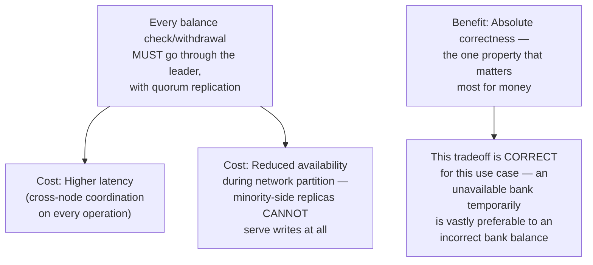

---

## 4. System B — Eventual Consistency Is the Right Choice: Social Media Like Counter

### 4.1 High-Level Architecture

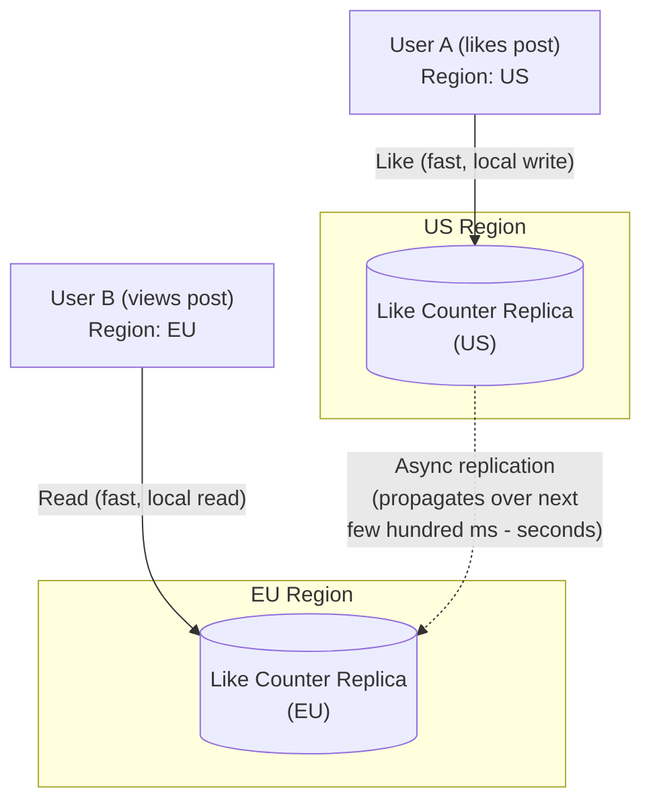

**Why eventual consistency is the RIGHT choice here (not a compromise):** If User B in the EU reads the like count a few hundred milliseconds before User A's like in the US has propagated, they see "1,203 likes" instead of "1,204 likes." This is completely inconsequential — no one is harmed, no invariant is violated, and the value converges moments later. Forcing this operation through linearizable consensus would add meaningful latency to every single like/view, for a property where nobody would ever notice or care about a fleeting few-hundred-millisecond discrepancy.

### 4.2 Eventually Consistent Write Flow — Detailed Sequence

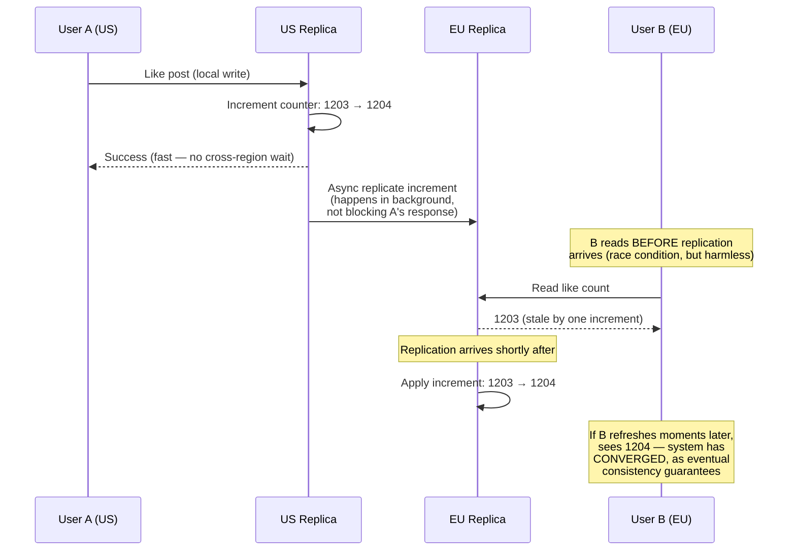

### 4.3 Conflict Resolution for Concurrent Writes (CRDT-style Counter)

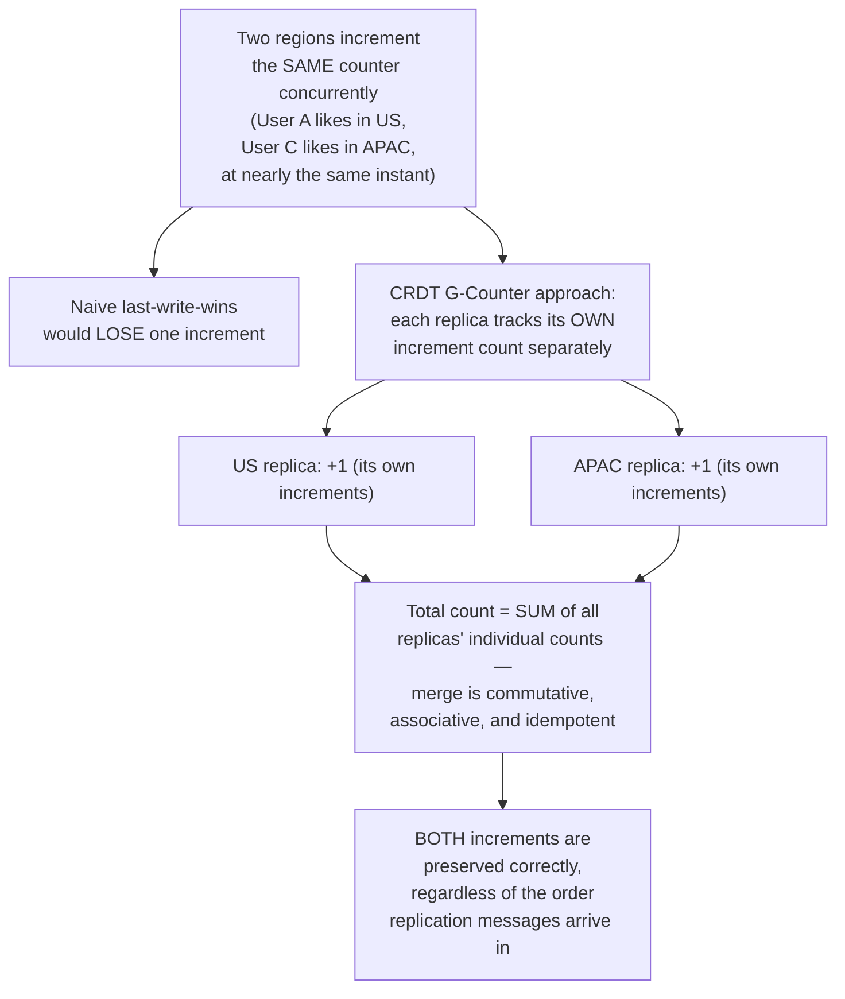

**Why this matters:** This is the elegant solution eventual consistency enables that strict linearizability wouldn't even need — because the operation (increment) is commutative, the system can accept concurrent local writes on every replica *and* guarantee mathematically correct convergence without ever needing cross-region coordination on the write path at all.

### 4.4 Tradeoff Benefit of This Choice

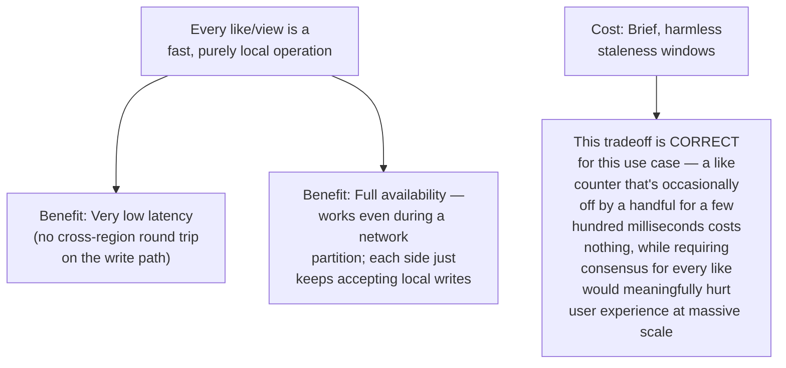

---

## 5. Side-by-Side Comparison

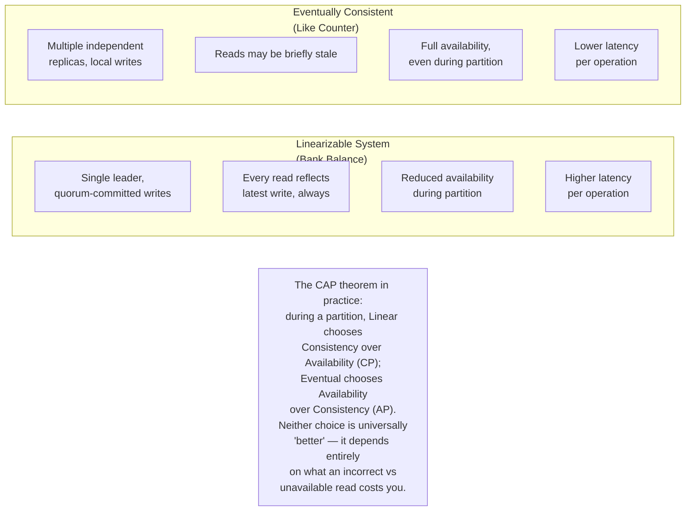

---

## 6. Decision Framework — Choosing the Right Model

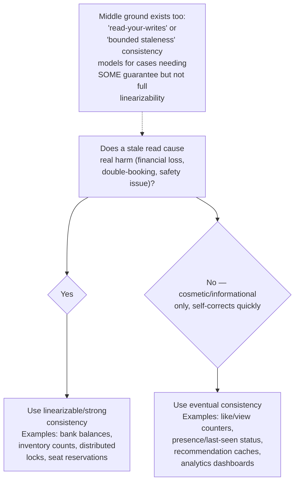

---

## 7. Component Responsibilities Summary

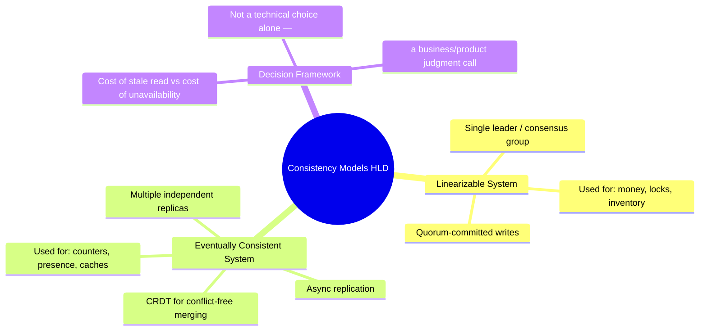

---

## 8. Key Design Decisions & Tradeoffs

| Decision | Choice | Why |
|---|---|---|
| Bank balance consistency | Linearizable (consensus-based) | A stale read directly causes real financial harm (double-spending); correctness is non-negotiable even at latency/availability cost |
| Like counter consistency | Eventual (CRDT-based) | A stale read is cosmetically inconsequential and self-corrects within moments; forcing consensus here would only add cost with no real benefit |
| Conflict resolution (eventual) | CRDT (commutative merge) | Enables correct convergence without ANY cross-replica coordination on the write path, when the operation itself (increment) is naturally commutative |
| Availability during partition | System-dependent, deliberate choice | This is literally the CAP theorem's central tradeoff — there's no universally correct answer, only a correct answer for each specific use case |

---

## 9. Bottlenecks & Scaling Considerations

- **Linearizable systems don't scale writes horizontally** — since all writes must be serialized through a single logical point (leader/consensus group), throughput is fundamentally bounded regardless of how many nodes you add; this is precisely why linearizability is reserved for the specific data that truly needs it, not applied system-wide.
- **Eventually consistent systems must handle conflict resolution explicitly** — "eventually consistent" doesn't mean "no work required"; concurrent writes to the same key need a defined merge strategy (CRDT, last-write-wins with vector clocks, application-level reconciliation) or data can silently diverge incorrectly.
- **Mixed systems are the norm in practice** — real-world platforms (e.g., a social media app) use linearizable consistency for payment/billing data and eventual consistency for engagement metrics, within the SAME overall product — the consistency model is a per-data-type decision, not a single global architectural choice.
- **Monitoring convergence lag** — for eventually consistent systems, actively tracking replication lag matters; if lag grows unexpectedly (network issues, replica overload), staleness windows that were "a few hundred milliseconds, harmless" can silently become "minutes, user-visible and confusing."
- **Testing for the specific failure mode each model risks** — linearizable systems need chaos testing for partition/leader-failure correctness; eventually consistent systems need testing for conflict-resolution correctness under genuinely concurrent writes from multiple replicas.
