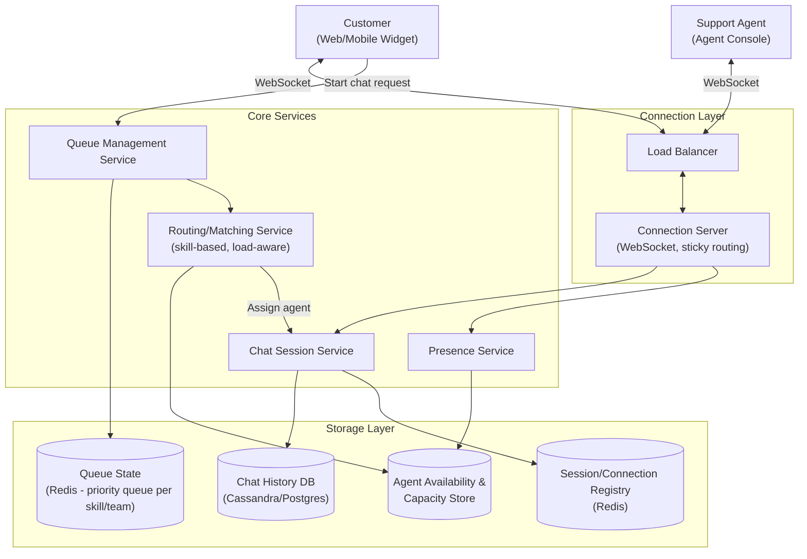
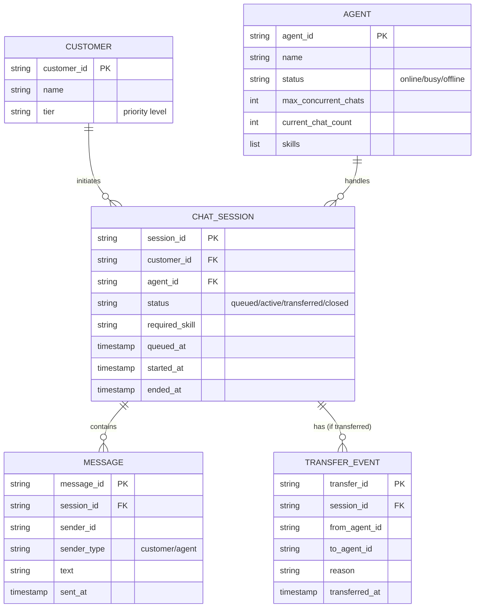
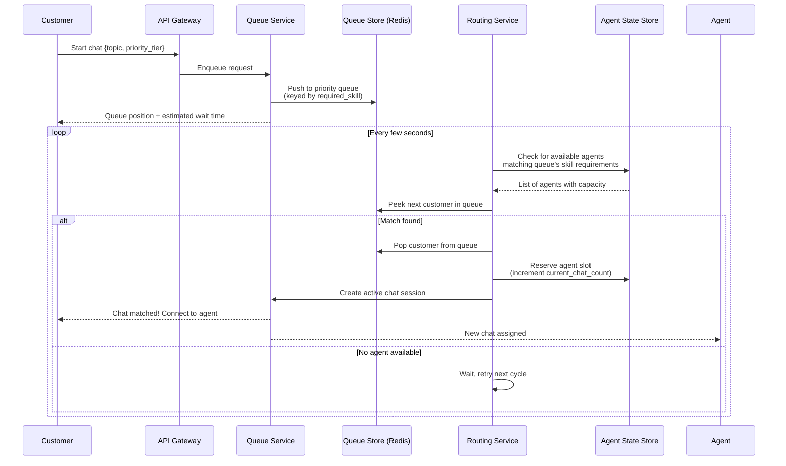
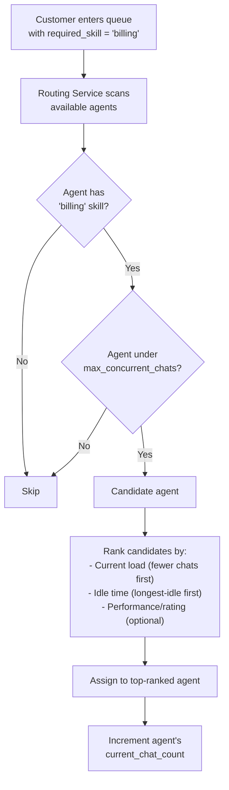
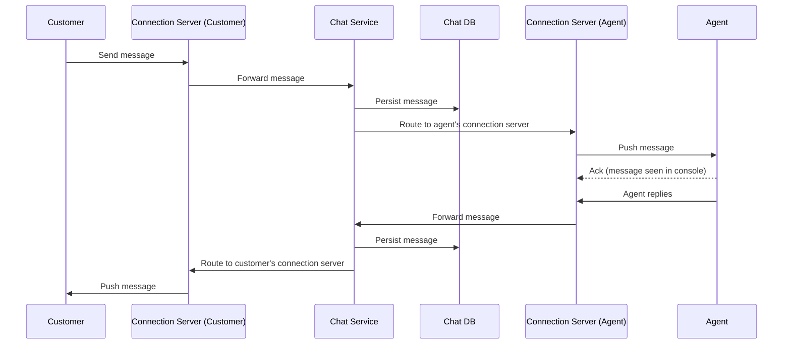
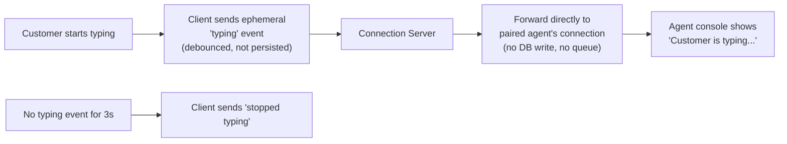
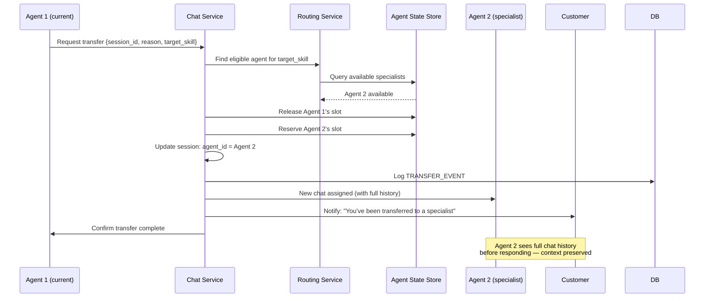
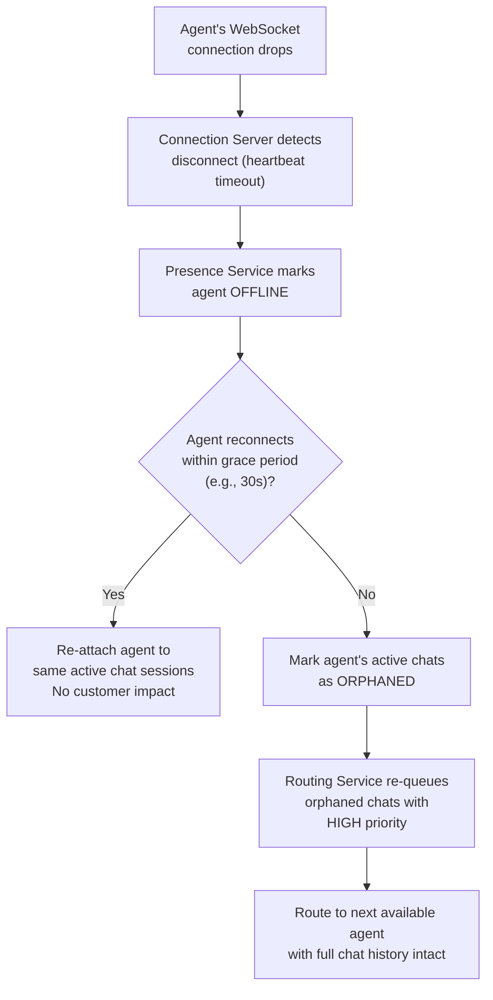
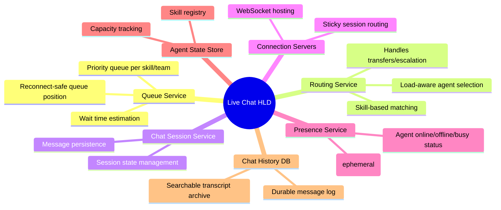

# Design a Live Chat Support System — High-Level Design Document

## 1. Requirements

### Functional Requirements
- Customers can start a chat and be routed to an available support agent
- Real-time bidirectional messaging between customer and agent
- Presence indicators: online/offline, typing indicators
- Queueing when no agents are available, with position/wait-time estimate
- Chat history persisted and searchable
- Support handoff (transfer between agents, escalation to specialist)
- Agents can handle multiple concurrent chats

### Non-Functional Requirements
- **Scale:** ~100K concurrent chats at peak (e.g., large e-commerce platform)
- **Low latency:** Messages and typing indicators should feel instant (< 200ms)
- **Availability:** Chat must degrade gracefully — never lose a customer's queue position
- **Durability:** No message loss, even across agent reassignment or reconnects
- **Fairness:** Queueing and routing must be fair (FIFO within priority tiers, skill-based routing)

### Back-of-Envelope Estimation
| Metric | Value |
|---|---|
| Concurrent chats (peak) | ~100,000 |
| Concurrent agents online | ~5,000 |
| Avg chats per agent (concurrent) | ~3-5 |
| Messages/sec (platform-wide) | ~10,000 |
| Avg chat session duration | ~10-15 minutes |
| Typing indicator events/sec | High-frequency, ephemeral — much higher than message volume |

---

## 2. High-Level Architecture

**Key idea:** Chat routing is a two-phase problem: (1) a **Queue Service** holds waiting customers in priority order until an agent is available, then (2) a **Routing Service** matches the customer to the best available agent by skill/load — only after a match is made does the actual bidirectional chat session begin over the connection layer.

---

## 3. Data Model

---

## 4. Chat Initiation & Queueing Flow

**Key idea:** Queue position is never lost even if the customer's connection drops — the queue entry lives server-side in Redis, keyed by `customer_id`/`session_id`, so a reconnecting client simply re-attaches to its existing queue slot rather than losing its place in line.

---

## 5. Agent Routing / Matching Logic

---

## 6. Real-Time Messaging Flow — Detailed Sequence

*Mirrors the same "session store maps user → connection server" pattern as a messaging system, but here the "conversation" is always exactly 1 customer : 1 (currently assigned) agent, simplifying the fanout compared to group chat.*

---

## 7. Typing Indicators & Presence

---

## 8. Chat Transfer / Escalation Flow

---

## 9. Handling Agent Disconnects (Reliability)

*Because chat history is persisted immediately on every message (not just at session end), an orphaned chat can be handed to a new agent with zero information loss — the new agent sees the entire conversation up to that point.*

---

## 10. Component Responsibilities Summary

---

## 11. Key Design Decisions & Tradeoffs

| Decision | Choice | Why |
|---|---|---|
| Queueing model | Server-side priority queue per skill, keyed by session | Survives customer disconnects without losing queue position |
| Routing strategy | Skill-based + load-aware ranking | Balances customer needs (right expertise) with agent fairness (even load distribution) |
| Message persistence | Synchronous write on every message | Enables lossless agent handoff/transfer with full context, unlike ephemeral-only chat |
| Typing indicators | Ephemeral, direct connection-server routing | High-frequency, low-value data — persisting or DB-routing would be wasteful |
| Agent disconnect handling | Grace period + re-queue with high priority | Balances tolerance for brief network blips against not leaving customers stranded |
| Transfer/escalation | Explicit session re-assignment with full history handoff | Critical for support quality — new agent must never ask the customer to repeat themselves |

---

## 12. Bottlenecks & Scaling Considerations

- **Queue fairness at scale** — naive FIFO can starve low-priority customers indefinitely during high load; use priority tiers with aging (wait time itself boosts effective priority over time) to prevent starvation.
- **Routing service polling overhead** — constantly polling for available agents across many skill queues can become expensive; prefer event-driven matching (agent becomes available → trigger immediate match attempt) over fixed-interval polling where possible.
- **Connection server capacity during peak support hours** — support traffic is highly time-of-day dependent (spikes during business hours or after outages); auto-scale connection server fleet based on concurrent session count.
- **Orphaned chat storms** — if many agents disconnect simultaneously (e.g., an agent-side outage), re-queueing a flood of high-priority orphaned chats can overwhelm remaining agents; needs backpressure/graceful degradation (e.g., temporarily widen acceptable wait-time SLAs).
- **Agent overload edge cases** — routing logic must strictly enforce `max_concurrent_chats` to avoid overwhelming agents during traffic spikes, even if it means longer queue times platform-wide.
- **Chat history search at scale** — full-text search across millions of historical transcripts needs a dedicated search index (Elasticsearch) rather than querying the primary Chat DB directly.
- **Cross-session context for repeat customers** — linking a customer's chat history across multiple past sessions (for context) requires indexing chats by `customer_id` in addition to `session_id`, adding a secondary access pattern to plan for.
