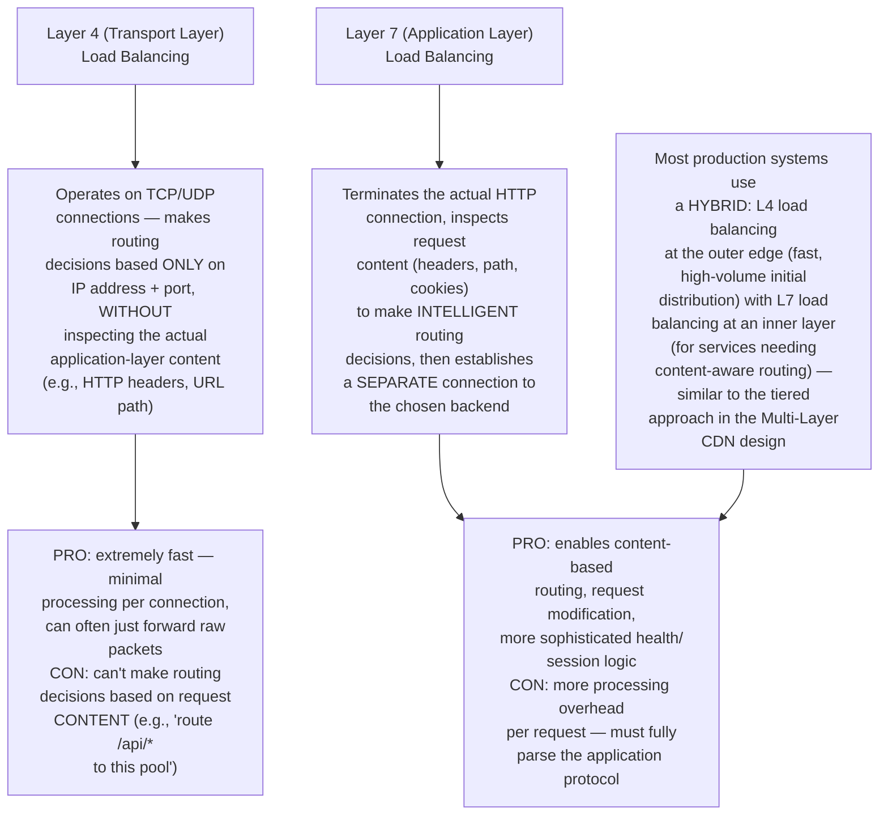
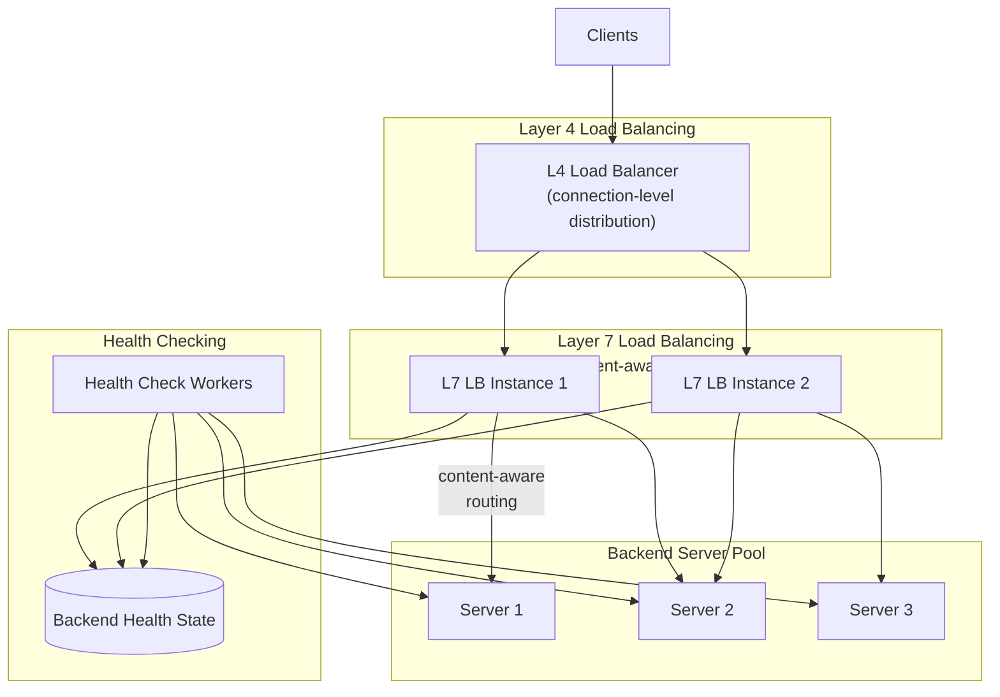
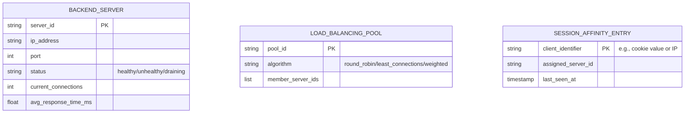
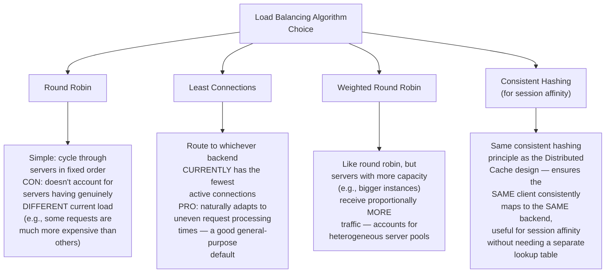
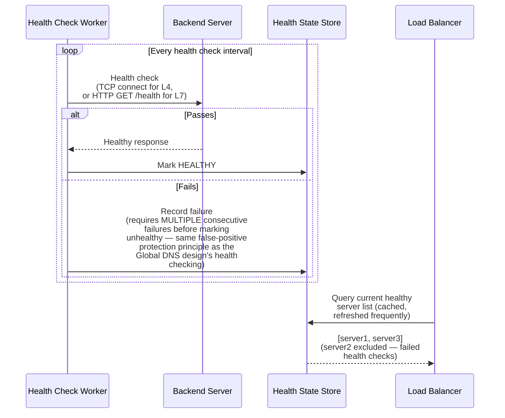
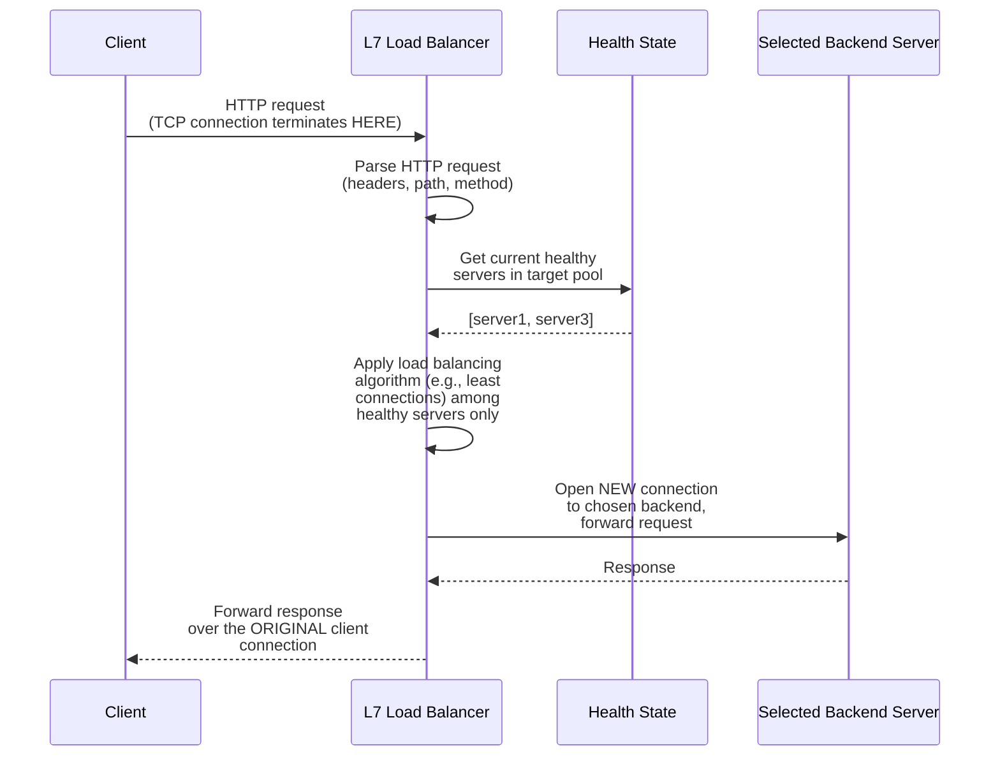
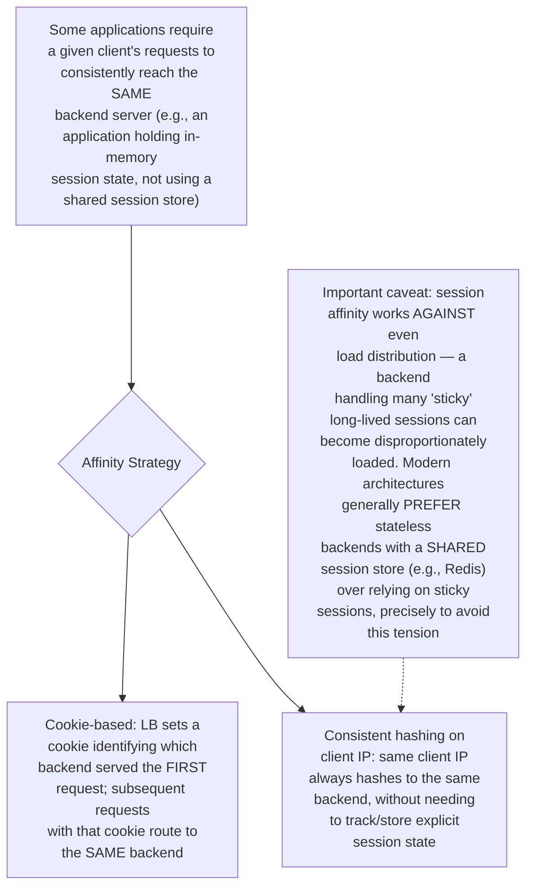
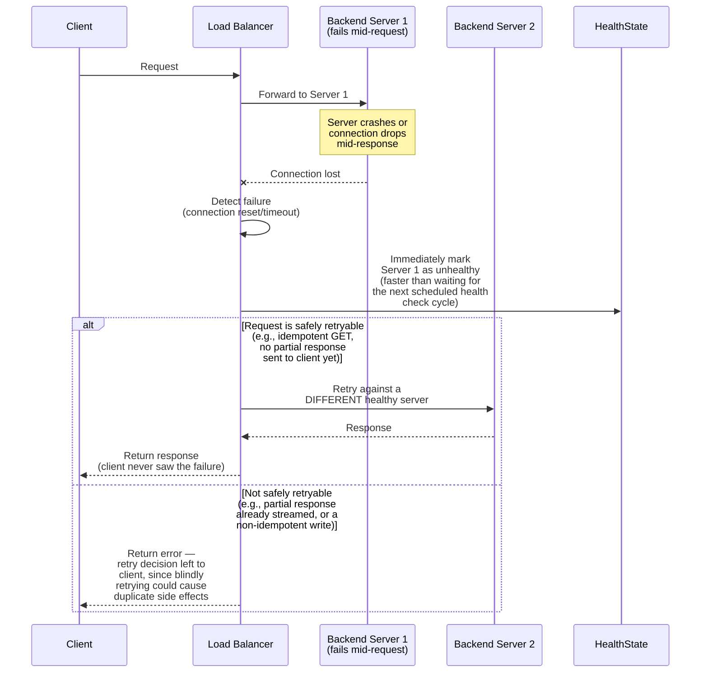
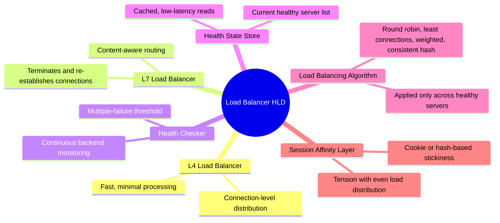

# Design a Load Balancer From Scratch — High-Level Design Document

## 1. Requirements

### Functional Requirements
- Distribute incoming traffic across a pool of backend servers according to a configurable algorithm
- Continuously health-check backend servers, automatically removing unhealthy ones from rotation
- Support both Layer 4 (TCP/transport-level) and Layer 7 (HTTP/application-level) load balancing
- Support session affinity ("sticky sessions") where a client's requests consistently reach the same backend

### Non-Functional Requirements
- **Extremely high throughput:** The load balancer sits in the critical path of essentially ALL platform traffic — must handle very high connection/request rates
- **Minimal added latency:** Every request now passes through this extra hop before reaching its actual destination
- **High availability:** A load balancer failure can take down access to an entire pool of otherwise-healthy backend servers
- **Fair, efficient distribution:** Backend load should be genuinely balanced, not accidentally skewed toward particular servers

### Back-of-Envelope Estimation
| Metric | Value |
|---|---|
| Connections/sec (large platform) | Hundreds of thousands to millions |
| Backend servers per pool | Tens to hundreds |
| Health check interval | Few seconds |
| Added latency budget | Sub-millisecond to low single-digit ms |

---

## 2. Layer 4 vs Layer 7 Load Balancing — The Fundamental Architectural Choice

---

## 3. High-Level Architecture

---

## 4. Data Model

---

## 5. Load Balancing Algorithms

---

## 6. Health Checking Flow — Detailed Sequence

---

## 7. Request Routing Flow (Layer 7) — Detailed Sequence

**Why L7 load balancing requires TWO separate TCP connections:** Because the load balancer must fully receive and parse the incoming request BEFORE it can make a content-aware routing decision, it necessarily terminates the client's connection first, then establishes an entirely separate connection to the chosen backend — this is fundamentally different from L4 balancing, which can often just forward packets along a single logical flow without this connection-splitting overhead.

---

## 8. Session Affinity ("Sticky Sessions")

---

## 9. Handling Backend Server Failure Mid-Request

**Why retry safety depends on idempotency, connecting to earlier designs:** This is the exact same principle explored in depth in the Idempotent API Requests design — a load balancer can only safely retry a failed request against a different backend if doing so can't cause harmful duplicate effects; blindly retrying a non-idempotent write operation risks the same double-processing danger covered extensively in that design.

---

## 10. Component Responsibilities Summary

---

## 11. Key Design Decisions & Tradeoffs

| Decision | Choice | Why |
|---|---|---|
| Architecture tier | Hybrid L4 (edge) + L7 (content-aware inner tier) | L4 provides maximum throughput for initial high-volume distribution; L7 enables intelligent routing where genuinely needed, without paying its overhead everywhere |
| Default algorithm | Least connections | Naturally adapts to servers with genuinely different current load, unlike round robin's assumption that all requests are equally expensive |
| Health check failure threshold | Multiple consecutive failures required | Prevents false-positive removal of a healthy server due to a single transient blip, same principle as the Global DNS design's health checking |
| Session affinity | Supported, but with explicit tradeoff acknowledgment | Sticky sessions create genuine tension with even load distribution; modern designs generally prefer shared session stores where feasible |
| Failure handling | Immediate unhealthy marking + conditional retry based on idempotency | Faster failure detection than waiting for the next health check cycle; retry safety must respect the same idempotency principles as any distributed system |

---

## 12. Bottlenecks & Scaling Considerations

- **L7 processing overhead at very high request volume** — fully parsing and re-establishing connections for every request is meaningfully more expensive than L4's largely pass-through approach; at extreme scale, this argues for pushing as much traffic as possible to the faster L4 tier, reserving L7 specifically for routes that genuinely need content-aware decisions.
- **Health check storm at large backend pool sizes** — checking hundreds of backend servers frequently generates meaningful aggregate health-check traffic; needs the checker fleet to scale proportionally with backend pool size, similar to the same concern noted in the Global DNS design.
- **Load balancer itself needing to be highly available** — a single load balancer instance is a single point of failure for its entire backend pool; production deployments require the load balancer layer itself to be redundant (often via additional upstream L4 balancing or DNS-based failover), avoiding simply moving the single-point-of-failure problem down one layer rather than solving it.
- **Connection draining during backend deployment** — when intentionally taking a backend server out of rotation (e.g., for a deployment), abruptly cutting its connections mid-request causes user-visible errors; needs a "draining" state where the server stops receiving NEW connections but existing ones are allowed to complete gracefully before final removal.
- **Uneven load from session affinity** — as noted, sticky sessions can create hot backends; monitoring per-backend load distribution specifically when affinity is enabled is important to catch this skew before it becomes a genuine capacity problem.
- **TLS termination overhead** — if the load balancer also handles TLS termination (common for L7 balancers), the cryptographic handshake and encryption/decryption work adds meaningful CPU cost per connection; often mitigated via connection reuse/keep-alive and, at extreme scale, dedicated hardware acceleration for cryptographic operations.
- **Geographic/multi-region load balancing coordination** — for a globally distributed backend pool, this single-region load balancer design needs to interoperate with the geo-routing capabilities covered in the Global DNS design — DNS-level routing directs users to the correct REGIONAL load balancer, which then handles the finer-grained distribution within that region, forming a coordinated two-tier system rather than either mechanism operating in isolation.
