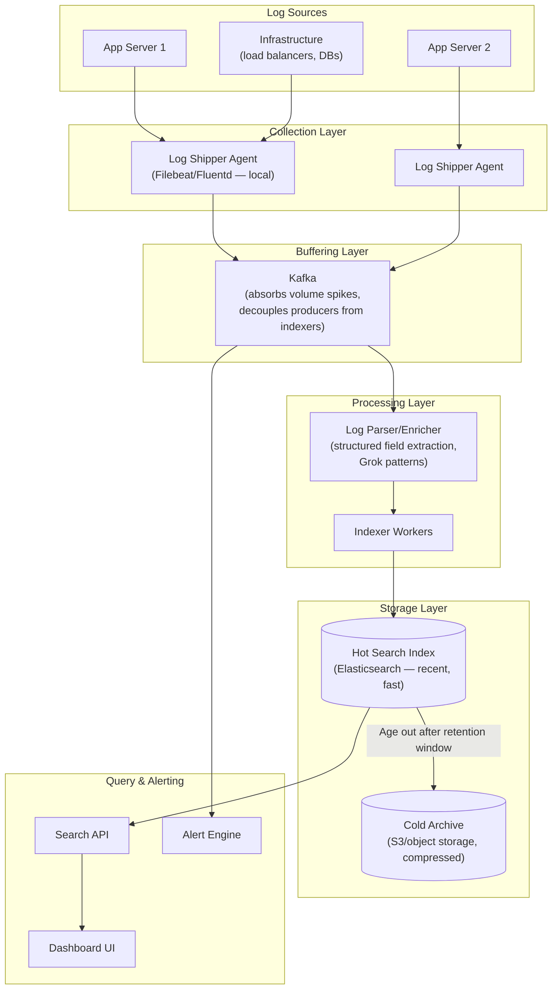
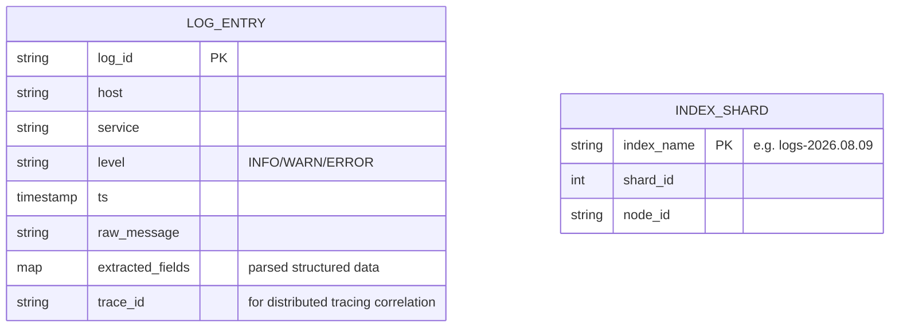
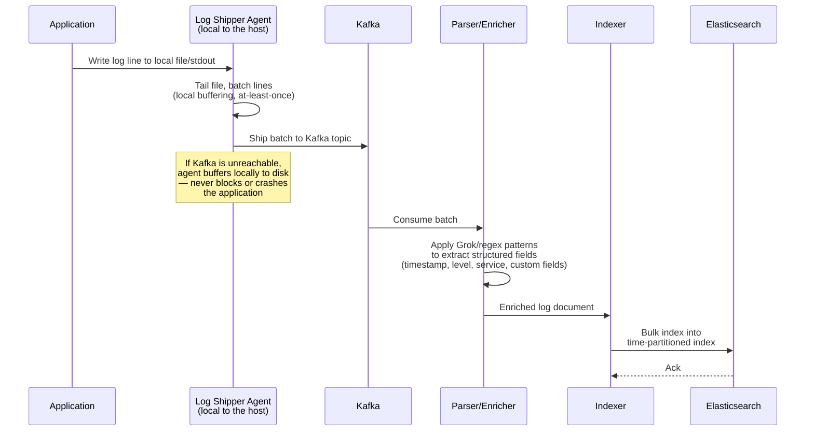
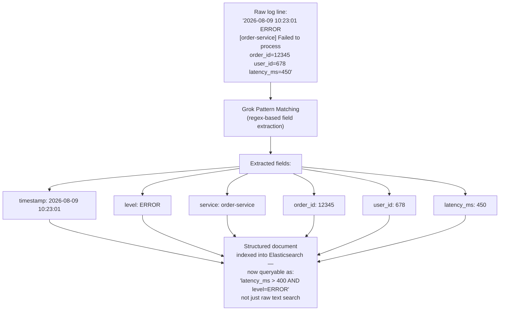
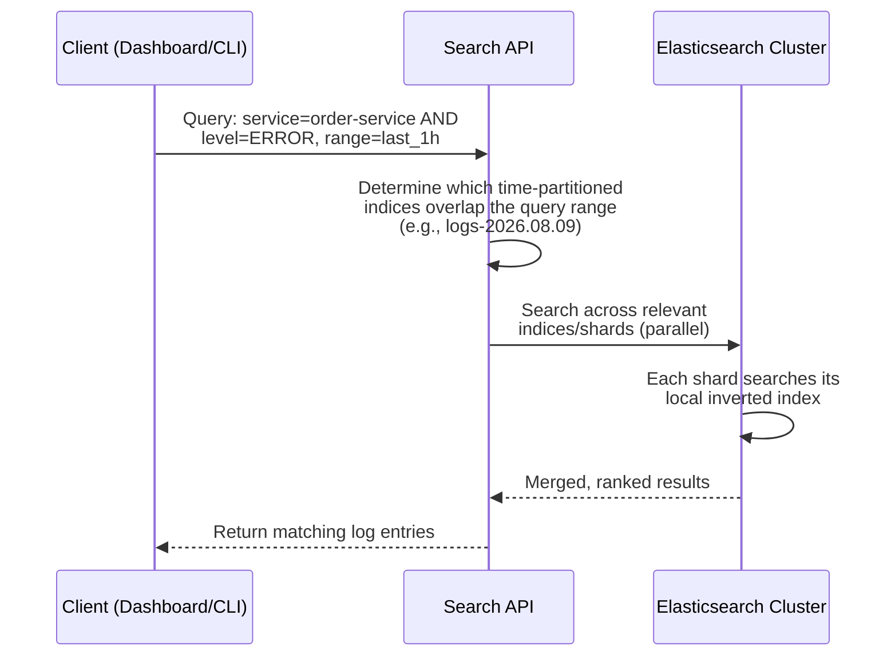
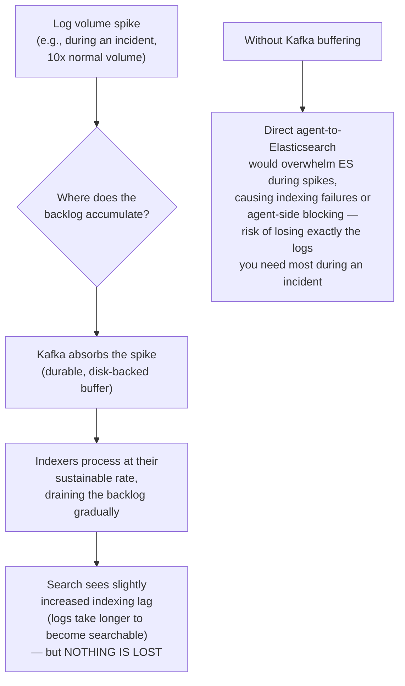
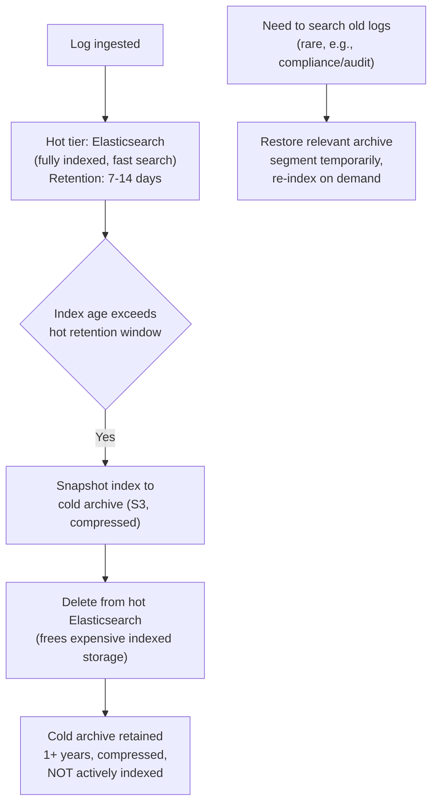
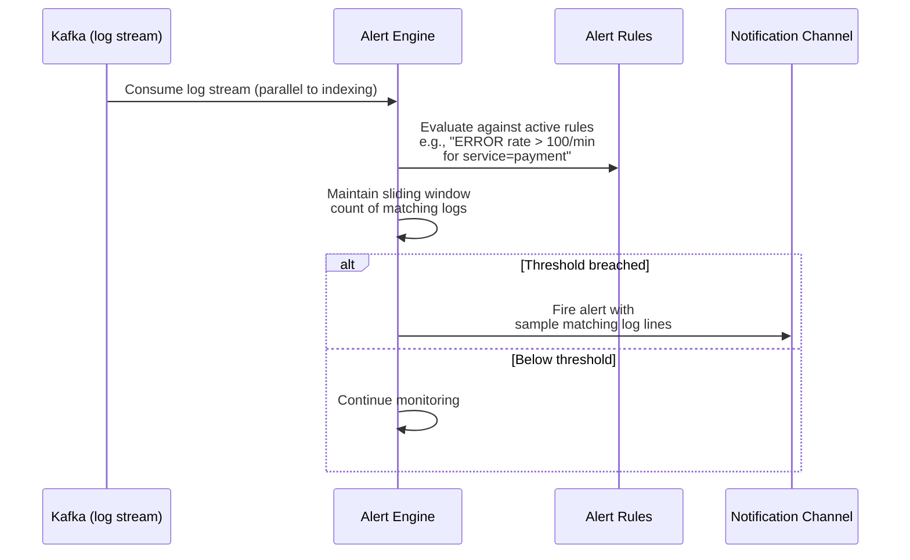
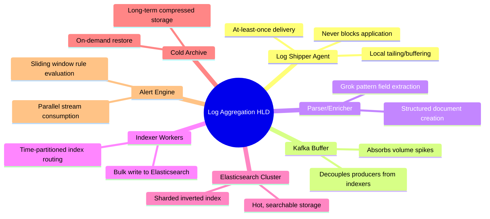

# Design a Log Aggregation and Monitoring System (ELK/Datadog-style) — High-Level Design Document

## 1. Requirements

### Functional Requirements
- Collect logs from thousands of distributed application/infrastructure instances
- Support full-text search across logs
- Structured log parsing (extract fields from semi-structured log lines)
- Real-time tailing/streaming for live debugging
- Dashboards, alerting on log patterns (e.g., error rate spikes)
- Long-term retention with cost-efficient archival

### Non-Functional Requirements
- **High write throughput:** Massive log volume from thousands of hosts continuously
- **Search latency:** Recent logs should be searchable within seconds of being written
- **Durability:** Logs must not be silently dropped, especially error/critical logs
- **Cost efficiency:** Storage costs must be managed via tiering/compression — raw log volume is enormous
- **Resilience to backpressure:** A logging system slowdown must never crash or block the applications producing logs

### Back-of-Envelope Estimation
| Metric | Value |
|---|---|
| Log lines/sec (platform-wide) | ~1M-5M |
| Avg log line size | ~500 bytes |
| Daily raw log volume | ~50-200 TB/day |
| Search query latency target | < 1-2s for recent logs |
| Retention: hot (searchable) | 7-14 days |
| Retention: cold (archived) | 1+ year |

---

## 2. High-Level Architecture

**Key idea:** Kafka sits between log collection and indexing as a **shock absorber** — if the indexing/search layer slows down or a burst of logs arrives (e.g., during an incident, when log volume often spikes dramatically), Kafka buffers the backlog without ever blocking the application generating the logs. This decoupling is the single most important architectural decision in a logging pipeline.

---

## 3. Data Model

*Indices are typically time-partitioned (e.g., one index per day: `logs-2026.08.09`) rather than one giant index — this makes retention/deletion trivial (just drop old daily indices) and keeps individual shard sizes manageable.*

---

## 4. Log Collection Flow — Detailed Sequence

---

## 5. Log Parsing & Field Extraction

**Why structured extraction matters:** Raw full-text search ("find lines containing 'error'") is far less useful than structured queries ("show me all ERROR logs from order-service with latency_ms > 400 in the last hour"). Parsing at ingestion time is what transforms unstructured log noise into an actually queryable dataset.

---

## 6. Search Query Flow

---

## 7. Backpressure Handling (Critical Path)

*This is precisely why logs shouldn't be shipped directly to the search index — an incident (the exact moment you need logs most) is also exactly when log volume spikes hardest, and a direct-write architecture would be most likely to fail at the worst possible time.*

---

## 8. Storage Tiering & Retention

*Full-text indexing is expensive to maintain indefinitely — the vast majority of log queries target the last few hours/days. Cold storage keeps older data available for rare compliance/audit needs at a fraction of the cost, accepting slower access in exchange.*

---

## 9. Alerting on Log Patterns

*The alert engine consumes directly from the Kafka log stream in parallel with indexing — this means alerting doesn't wait for the (potentially lagging) search index to catch up, giving faster incident detection than "query Elasticsearch every minute" would.*

---

## 10. Component Responsibilities Summary

---

## 11. Key Design Decisions & Tradeoffs

| Decision | Choice | Why |
|---|---|---|
| Buffering layer | Kafka between agents and indexers | Absorbs volume spikes without blocking applications or losing logs during exactly the moments they matter most (incidents) |
| Log structure | Parse into structured fields at ingestion | Transforms raw text into queryable structured data, enabling precise filtering beyond simple keyword search |
| Index partitioning | Time-based (daily indices) | Makes retention/deletion trivial and keeps shard sizes manageable |
| Storage tiering | Hot (indexed) + Cold (compressed archive) | Full indexing is expensive to maintain indefinitely; most queries only need recent data |
| Alerting architecture | Parallel stream consumption, not query-based polling | Faster detection — doesn't wait for the (potentially lagging) search index |
| Agent-side failure handling | Local disk buffering on shipper agents | Application logging must never block or crash on downstream unavailability |

---

## 12. Bottlenecks & Scaling Considerations

- **Elasticsearch indexing throughput** — the indexing layer is often the bottleneck under sustained high volume; horizontal scaling (more shards, more indexer workers) and bulk-write batching are essential.
- **Hot shard/index sizing** — too few shards per daily index limits parallelism; too many adds per-shard overhead — needs tuning based on actual daily volume per service/environment.
- **Cardinality in structured fields** — similar to metrics systems, indexing high-cardinality fields (e.g., raw user_id as a keyword field) can bloat index size and slow queries; requires thoughtful field mapping decisions.
- **Cost of full retention at full fidelity** — most organizations can't afford to keep everything hot forever; tiering strategy (and sometimes sampling of high-volume, low-value logs) is essential for cost control.
- **Multi-tenancy/noisy neighbor** — one service suddenly logging at 100x its normal rate (e.g., a misbehaving retry loop) can degrade indexing performance for all other services sharing the pipeline; per-service rate limiting or quotas protect against this.
- **Search query complexity at scale** — expensive queries (e.g., broad wildcard searches across weeks of data) can overwhelm the cluster; query complexity limits and query result caching help contain this.
- **Log format inconsistency** — different services/teams often log in inconsistent formats, making universal Grok patterns fragile; encouraging structured logging (e.g., JSON) at the application source dramatically simplifies the parsing layer.
