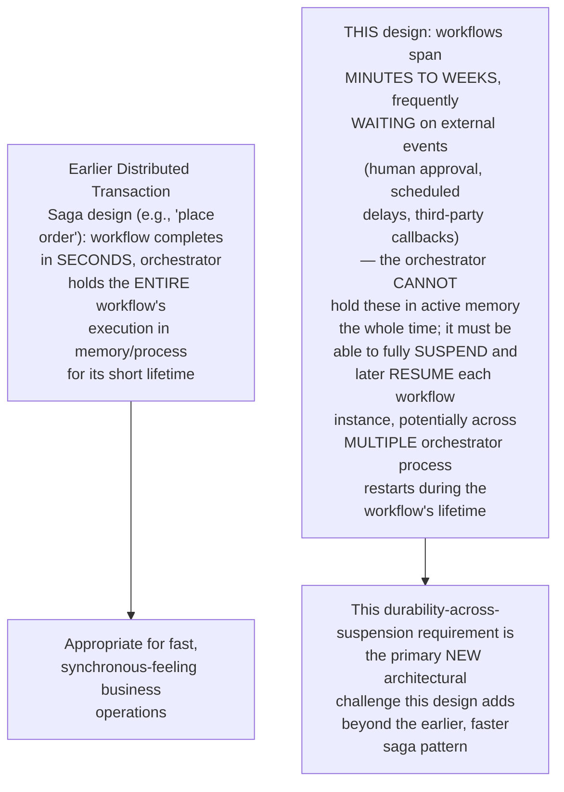
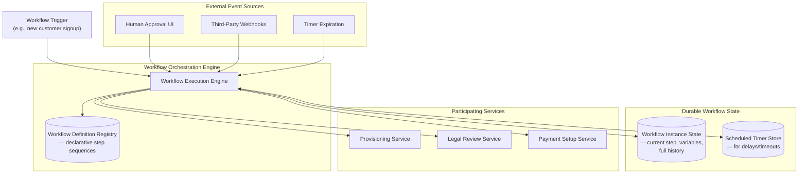
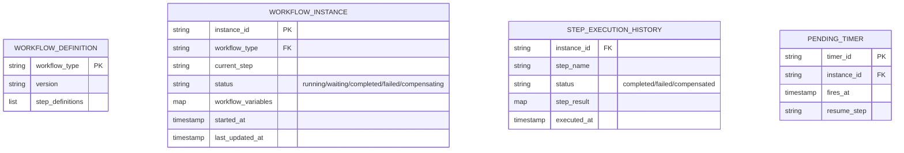
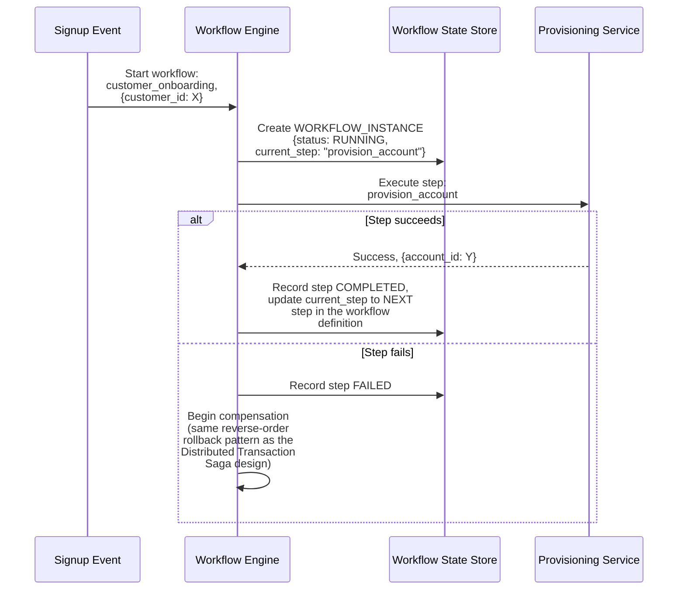
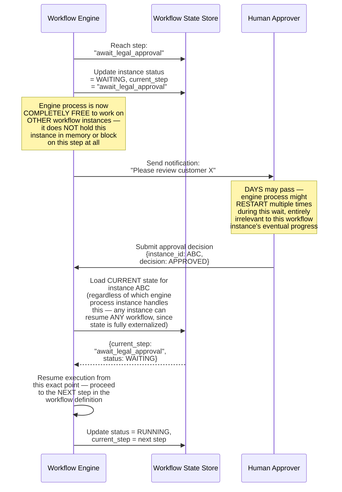
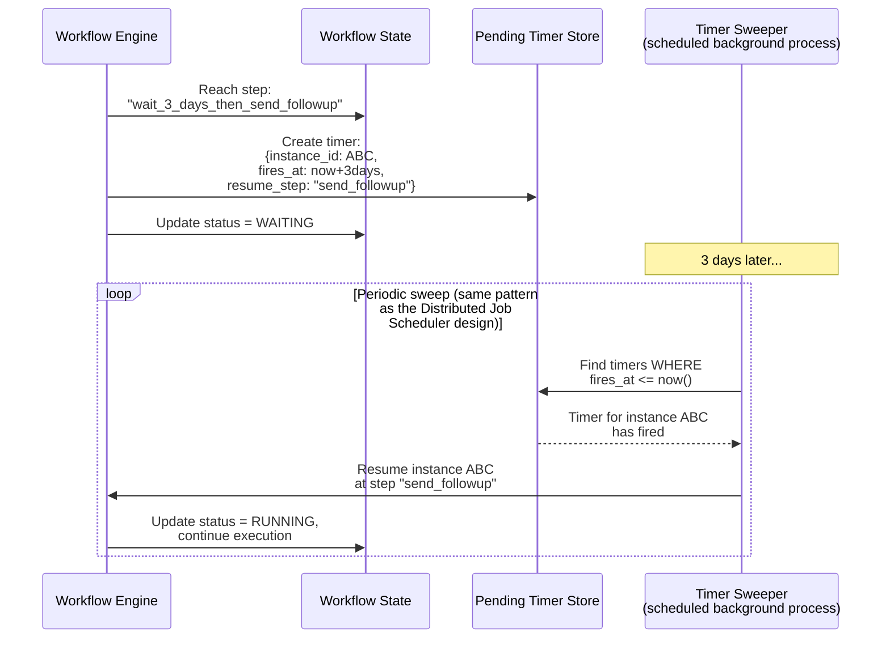
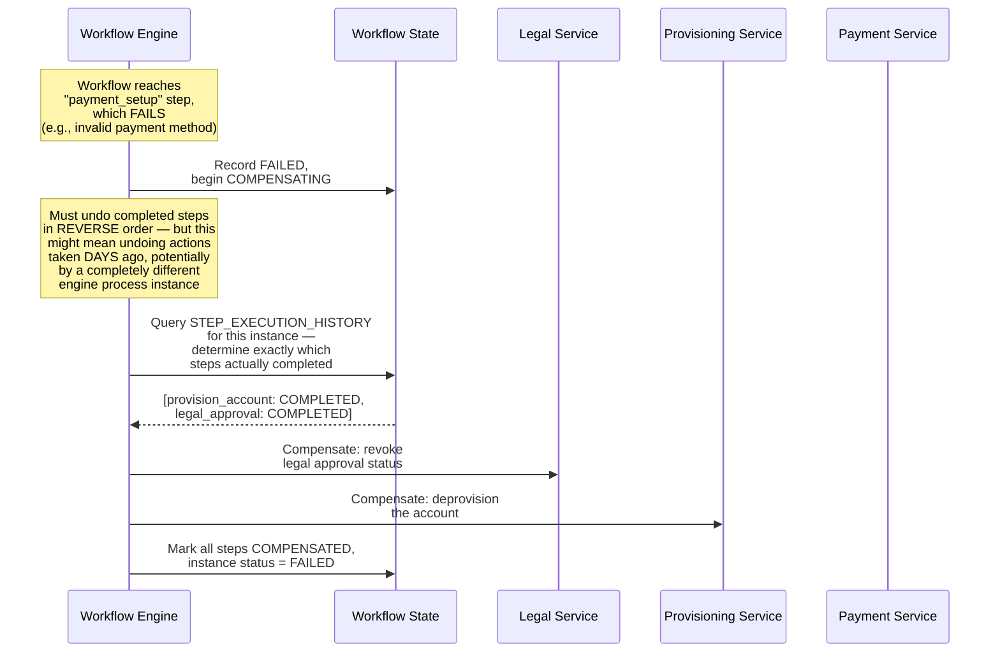
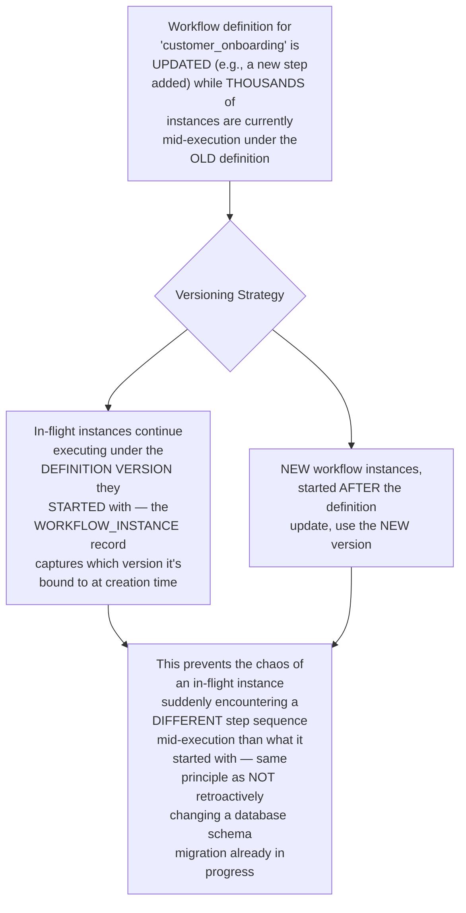
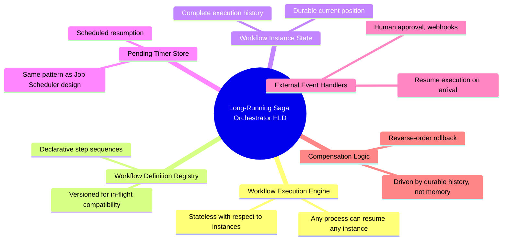

# Design a Distributed Saga Orchestrator for Long-Running Business Workflows — High-Level Design Document

## 1. Requirements

### Functional Requirements
- Coordinate multi-step business workflows spanning many services, where individual steps may take minutes to DAYS to complete (e.g., "onboard a new enterprise customer": provisioning, legal review, payment setup, welcome sequence)
- Support workflows that pause waiting for EXTERNAL events (human approval, a third-party webhook, a scheduled delay) not just synchronous service calls
- Recover and resume in-progress workflows correctly after orchestrator restarts/crashes
- Provide visibility into exactly where any given workflow instance currently stands

### Non-Functional Requirements
- **Durability across arbitrarily long timeframes:** Unlike the earlier Distributed Transaction Saga design's typically-fast checkout flow, this must correctly handle workflows genuinely spanning days or weeks
- **Correct compensation on failure:** Same core requirement as the earlier saga design — failed workflows must be cleanly unwound
- **Scalability:** Must manage potentially millions of concurrent long-running workflow instances simultaneously
- **Auditability:** Given the business-critical, long-running nature of these workflows, complete history of every step/decision must be available

### Back-of-Envelope Estimation
| Metric | Value |
|---|---|
| Concurrent active workflow instances | Millions |
| Workflow duration | Minutes to weeks |
| Steps per workflow | 5-50 typical |
| Orchestrator restart frequency | Regular (deployments), must never lose workflow progress |

---

## 2. How This Differs From the Earlier Distributed Transaction Saga Design

---

## 3. High-Level Architecture

**Key idea:** Every meaningful state change in a workflow instance's progress is DURABLY persisted BEFORE the engine considers that step complete — this means the in-memory workflow engine process is fundamentally STATELESS with respect to any individual workflow instance's progress; any engine instance can pick up and continue ANY workflow instance at ANY time, purely by reading its current durable state, which is what makes suspension across process restarts (even weeks apart) work correctly.

---

## 4. Data Model

---

## 5. Workflow Execution Flow — Detailed Sequence

---

## 6. Suspending on an External Event (Human Approval) — Detailed Sequence

**Why this suspend/resume capability is the defining technical achievement of this design:** The workflow engine holds ZERO in-memory state for a waiting instance — everything needed to resume is durably externalized. This means the engine can be redeployed, scaled up/down, or crash and restart any number of times during a multi-day wait, and the workflow resumes correctly exactly where it left off, driven entirely by its durable state rather than any particular process's memory or lifetime.

---

## 7. Timer-Based Delays (Scheduled Resumption)

**Why this reuses the same fundamental pattern as the Distributed Job Scheduler design:** A workflow "waiting 3 days" is conceptually identical to scheduling a delayed job — this design deliberately builds on the same durable, TTL-based, periodically-swept scheduling mechanism established in that dedicated design, rather than inventing a parallel timer mechanism.

---

## 8. Compensation for Long-Running Workflows

**Why the durable execution history is essential for correct compensation:** Because a long-running workflow's completed steps might have happened days or weeks before a LATER step's failure, the compensation logic can't rely on any in-memory record of "what we did" — it must reconstruct exactly which steps genuinely completed by querying the durable STEP_EXECUTION_HISTORY, ensuring compensation is accurate even if the compensating engine process is entirely different from whichever process executed the original steps.

---

## 9. Workflow Versioning (Handling In-Flight Instances During Definition Changes)

---

## 10. Component Responsibilities Summary

---

## 11. Key Design Decisions & Tradeoffs

| Decision | Choice | Why |
|---|---|---|
| Engine statefulness | Fully stateless with respect to individual workflow instances | Enables any engine process to resume any workflow instance at any time, essential for correctness across restarts during multi-day/week waits |
| State externalization | Every meaningful progress point durably persisted before considered complete | Makes suspend/resume across arbitrary time spans and process restarts fundamentally correct, not just "usually works" |
| Delay/timer mechanism | Reuses the Distributed Job Scheduler design's pattern | A workflow "waiting N days" is conceptually identical to a delayed job — no need for a parallel, separate timer mechanism |
| Compensation logic | Driven by durable execution history, not in-memory tracking | Ensures correct rollback even when the compensating process differs entirely from whichever process executed the original steps |
| Workflow versioning | In-flight instances bound to their starting definition version | Prevents chaos from a definition change altering the step sequence for already-executing instances |

---

## 12. Bottlenecks & Scaling Considerations

- **Workflow state store as a critical, high-cardinality dependency** — with potentially millions of concurrent instances, this store faces both high write volume (every step transition) and high read volume (resuming instances); needs the same sharding/partitioning considerations as other high-cardinality stores covered in prior designs (e.g., by instance_id hash).
- **Timer sweep scalability at massive scale** — periodically scanning for "which of potentially millions of timers have fired" needs an efficient time-indexed query structure, same fundamental scaling concern as the Distributed Job Scheduler design's due-job scanning.
- **Long-running workflow observability** — given multi-week workflow durations, operators need robust tooling to answer "where is instance X right now, and why has it been stuck at this step for 3 days" — this requires purpose-built dashboarding beyond simple state-store queries, especially for diagnosing workflows that are stuck due to a genuine bug rather than a legitimate long wait.
- **External event correlation at scale** — matching an incoming webhook or approval submission back to the CORRECT waiting workflow instance (among potentially millions of concurrently waiting instances) requires efficient, well-indexed lookup by whatever correlation identifier the external system provides.
- **Compensation complexity for very long chains** — a workflow that failed after 40 completed steps requires compensating ALL 40 in reverse order; some of these compensating actions may themselves fail (e.g., trying to deprovision a resource that was already manually modified by a human during the multi-week window) — needs robust partial-compensation-failure handling and likely human escalation paths for cases automated rollback can't cleanly resolve.
- **Workflow definition testing** — given that a single definition change affects potentially millions of NEW instances going forward while millions of EXISTING instances continue under old versions, thorough testing must validate correctness for the new definition WITHOUT assuming clean-slate deployment — a genuinely more complex testing surface than typical stateless service deployments.
- **Cross-workflow dependencies** — real business processes sometimes require ONE long-running workflow to trigger or wait on ANOTHER (e.g., customer onboarding waiting on a separate compliance review workflow); this composition of workflows-within-workflows adds a meaningful additional layer of orchestration complexity beyond the single-workflow model covered in this design's core architecture.
